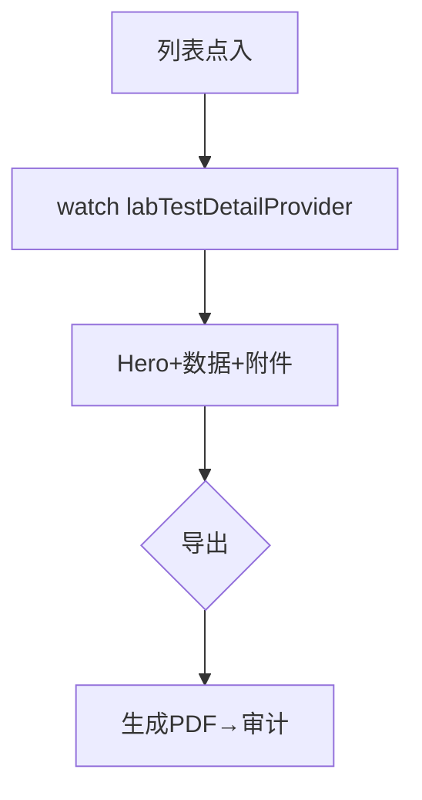

# 检测报告页

> 路由：`/lab/test/:id`（计划：`lib/features/lab/pages/lab_test_report_page.dart`）· Phase 4
> 上层：[Phase4-生产实验室总览](Phase4-生产实验室总览.md)

## 一、定位

查看单条检测的完整报告（样品+项目+结果+判定+附件），可导出 PDF 报告。

## 二、入口与导航
- 进入：[检测列表页](检测列表页.md) 点项。
- 离开：导出 → 下载 PDF；返回列表。

## 三、响应式布局
- compact：单列滚动，Hero 判定 + 样品信息 + 检测数据 + 附件 + 底部导出。
- expanded：内容居中 ≤720dp。

```
┌────────────────────────┐
│ ← 检测报告      [导出PDF]│
├────────────────────────┤
│ ┌────────────────────┐ │
│ │ S001 拉伸强度 [✅合格]│ │  ← Hero（样品+判定）
│ │ 320 MPa  2026-07-15 │ │
│ └────────────────────┘ │
│ 样品信息               │
│  编号 S001 名称 XX 批次B│
│  来源 XX 送检人 张三    │
│ 检测数据               │
│  项目 拉伸强度          │
│  结果 320 MPa          │
│  标准 ≥300 MPa         │
│  设备 万能试验机        │
│  检测员 李四            │
│ 附件                   │
│  📎 原始数据.xlsx ⬇     │
├────────────────────────┤
│ [⬇ 导出检测报告 PDF]     │
└────────────────────────┘
```

## 四、涉及的 Uten 组件
`UtenAppBar`（导出）/ `UtenCard` / `UtenInfoRow` / `UtenStatusBadge`（判定）/ `UtenSectionHeader` / `UtenButton`（导出）/ `UtenBottomActionBar` / `UtenToast` / `UtenEmpty`。

## 五、功能点
1. **Hero**：样品编号+检测项目+判定徽章+日期。
2. **样品信息** + **检测数据**（项目/结果/标准值/设备/检测员）。
3. **附件**：原始数据/图片下载。
4. **导出 PDF**：生成正式检测报告（带公司抬头/检测员签名/盖章占位）。

## 六、功能链路图


## 七、涉及的数据实体
`LabTest` / `LabSample` / `LabReport`（报告）/ `LabEquipment` / `Attachment`。

## 八、权限要求
- lab / manager 只读 / admin。`lab:test:view`。导出走审计日志。

## 九、边界情况
- 无数据：`UtenEmpty`「检测记录不存在」。
- 导出：必须在线，断网 Toast。
- 性能档 lite：去 Hero 阴影。
- 网络现状：报告读取和导出均依赖在线连接；断网时明确报错。报告加密缓存与离线查看属于目标能力，当前尚未实现。

---

**最后更新**：2026-07-30 · **状态**：需求定稿；离线缓存待实现
