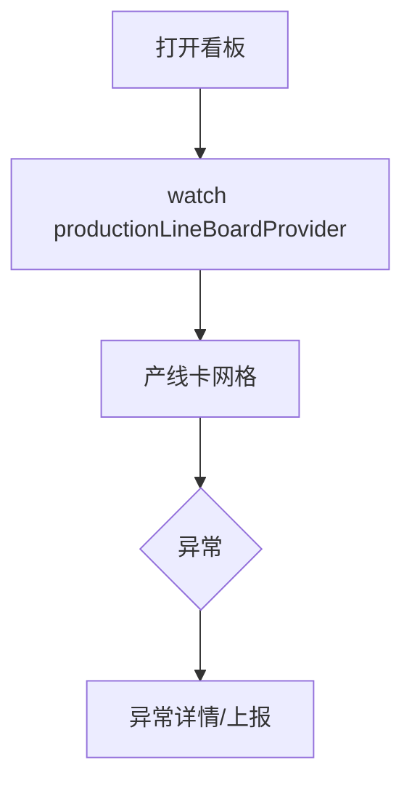

# 流水线看板页

> 路由：`/production/line`（计划：`lib/features/production/pages/production_line_board_page.dart`）· Phase 4
> 上层：[Phase4-生产实验室总览](Phase4-生产实验室总览.md)

## 一、定位

车间看板：各产线实时进度、当前工单、节拍、当日产量、异常告警。**大屏/平板**为主，挂在车间现场。

## 二、入口与导航
- 进入：production 主导航「流水线看板」。
- 离开：点产线 → 工单明细（Phase 4+）；异常 → 处理。

## 三、响应式布局
看板网格，每条产线一张大卡。

- expanded（车间大屏）：
```
┌──────────────────────────────────────────────┐
│ 流水线看板              2026-07-22  班次:白班   │
├──────────────────────────────────────────────┤
│ ┌──────────────┐┌──────────────┐             │
│ │ 一号线 🟢运行  ││二号线 🟡换模  │             │
│ │ 工单 WO-1023  ││工单 WO-1024  │             │
│ │ 进度 ▓▓▓▓▓░ 75%││进度 ▓▓░░░ 35%│             │
│ │ 节拍 30s 产量1280││节拍 —  产量640│             │
│ │ 异常: 0       ││异常: ⚠缺料    │             │
│ └──────────────┘└──────────────┘             │
└──────────────────────────────────────────────┘
```
- compact：产线卡纵向堆叠。

## 四、涉及的 Uten组件
`UtenAppBar`（班次/日期）/ `UtenResponsiveGrid`（产线卡）/ `UtenCard` / `UtenStatCard`（产量/节拍）/ `UtenStatusBadge`（运行 success/换模 warning/停机 error）/ 进度条（LinearProgressIndicator 或自建）/ `UtenEmpty`。

## 五、功能点
1. **产线卡**：状态色 + 当前工单 + 进度条 + 节拍 + 当班产量 + 异常数。
2. **异常高亮**：缺料/设备故障/质量异常红色角标，点击看详情/上报。
3. **班次切换**：白班/夜班。
4. **实时刷新**：后端轮询/SSE（前端 Mock 定时刷新）。
5. **大屏模式**：expanded 自动放大字号、隐藏次要元素（性能档 rich 时启用粒子/动效）。

## 六、功能链路图


## 七、涉及的数据实体
`ProductionLine`（产线：状态/节拍）/ `ProductionOrder`（当前工单：进度）/ `ProductionShift`（班次）/ `ProductionOutput`（当班产量）。

## 八、权限要求
- production / manager 只读 / admin。`production:view`。

## 九、边界情况
- 无产线：`UtenEmpty`「暂无产线数据」。
- 实时性：断网显示上次 +「数据可能非最新」。
- 性能档 lite：去进度条动画，纯数字。
- 大屏防烧屏：rich 档可加轻微动态背景（lite 不加）。

---

**最后更新**：2026-07-22 · **状态**：需求定稿
