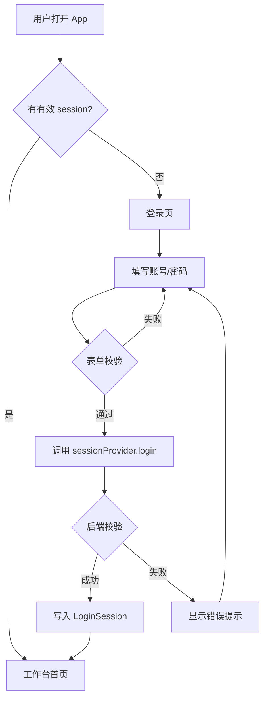

# 登录页

> 路由：`/login` · 实现源：`lib/features/auth/pages/login_page.dart`

## 一、定位

给所有员工（包括 hr / finance / lab / production / manager / admin）使用的统一登录入口。

- 解决的问题：身份认证、设备记住、引导首次进入系统。
- 产品位置：App 启动默认页，未登录用户唯一的可达页面；登录成功后被路由守卫重定向至 [工作台首页](工作台首页.md)。

> Phase 1 阶段为前端 Mock：任意非空账号密码即可登录成功，详见 [边界情况](#九边界情况)。

## 二、入口与导航

- 进入路径：
  - App 冷启动 / 未持有有效 `LoginSession` → 默认落地
  - [设置页](设置页.md) "退出登录" → 回到这里
  - 路由守卫在任何受保护页面检测到 session 失效 → 跳回
- 在导航中的位置：独立全屏页，**不在** ShellRoute 内，无底部/侧边导航
- 离开去向：登录成功 → [工作台首页](工作台首页.md)（也可带 `returnTo` 参数回到原页面）

## 三、响应式布局

> 配色总策略：**统一深色背景 + 浅色实心面板**。背景为 slate-900 `#0F172A` → slate-800 `#1E293B` 上下渐变，**浅色模式与深色模式均保持深色背景**（不再用大块绿色渐变）。登录面板是浅色实心卡片，跟随主题：浅色模式为白底，深色模式为 slate-900 底。面板内所有文字、控件均跟随 `theme.textTheme` / `colorScheme`，不硬编码白字。

- compact（手机，< 600dp）：
  ```
  ┌──────────────────────┐
  │  (深色 slate 渐变背景) │  ← slate-900 #0F172A → slate-800 #1E293B
  │                      │
  │   ┌──────────────┐   │
  │   │ [U] Logo     │   │  ← 浅色实心卡片（UtenCard solid）
  │   │ 欢迎使用 IMP  │   │     elevation: high，跟随主题
  │   │              │   │     浅色=白底 / 深色=slate-900 底
  │   │ [账号____] 👤│   │
  │   │ [密码____] 🔒│   │
  │   │ □记住设备 忘记?│   │  ← checkbox / TextButton 跟随主题
  │   │ [  登 录  ]  │   │  ← primary 绿色主按钮
  │   │ ⓘ 演示提示行  │   │  ← surfaceContainerLow 底
  │   └──────────────┘   │
  │      © Uten IMP      │  ← onSurfaceVariant 字色
  └──────────────────────┘
  ```
  说明：整屏深色渐变背景 + 单列居中浅色实心卡（`maxWidth: 420`），单列垂直排列。面板内文字、按钮、checkbox、提示框均跟随主题。

- medium（平板，600-840dp）：登录卡水平居中，左右留白变宽，整体内容不变。

- expanded（桌面，> 840dp）：登录卡居中显示在屏幕中央，可考虑后续在右侧补充企业品牌插画区（Phase 1 暂未实现）。

## 四、涉及的 Uten 组件

- `UtenAppBar`（实际未使用，登录页是全屏无 AppBar）
- `UtenCard`（variant = `solid`，elevation = `high`，浅色实心登录卡；**不再是 `glass` 玻璃拟态**）
- `UtenInput`（账号 / 密码输入框，密码框 `isPassword: true`）
- `UtenButton`（type = `primary`，size = `large`，`isExpanded`；**不再是 `secondary`**）
- `UtenColors`（slate-900/slate-800 深色渐变背景；teal 系 logo 渐变方块）
- `UtenAnim`（`slow` 时长 + `enter` 曲线，控制进场 fade + slide）

## 五、功能点

1. 账号 + 密码表单，带 `Form` 校验（空值即拦截），账号密码均有 `validator`。
2. "记住设备" 复选框（默认主题 Checkbox，不自定义填充色），传递给 `sessionProvider.login(rememberDevice:)`，后续设备指纹免登用。
3. 密码输入框支持"键盘回车直接提交"（`onFieldSubmitted` → `_handleLogin`）。
4. "忘记密码"按钮（跟随主题 `TextButton`，不硬编码 teal300 下划线；Phase 1 占位，未实现）。
5. 登录中状态：按钮 `isLoading=true`、`onPressed=null`，避免重复提交。
6. 登录失败：在按钮上方红色提示条显示 `errorMessage`。
7. 登录成功：`context.go(RouteName.dashboard)`，路由守卫兜底重定向。
8. 进场动画：`AnimationController` + fade + 5% 上滑，强化品牌感。
9. 统一深色背景，浅色面板跟随主题：背景为 slate-900/slate-800 渐变，**浅色模式与深色模式均保持深色**；登录面板为浅色实心卡（浅色模式白底、深色模式 slate-900 底）。面板内标题用 `headlineSmall`、副标题用 `bodyMedium + onSurfaceVariant`、演示提示框用 `surfaceContainerLow` 底 + `onSurfaceVariant` 字、页脚用 `onSurfaceVariant`——全部跟随 `theme.textTheme` / `colorScheme`，不硬编码白字或玻璃拟态。品牌绿色仅出现在登录主按钮上。
10. 多语言：标题、副标题、按钮文案、提示行均走 `AppLocalizations`。

## 六、功能链路图



## 七、涉及的数据实体

→ 见 [04-数据模型/实体字典.md](../04-数据模型/实体字典.md)
- `User`：登录成功后写入 session 的用户基本信息（姓名、工号、部门、岗位、角色）
- `LoginSession`：登录会话（token、过期时间、是否记住设备）
- `Role`：用户角色枚举，决定后续页面可见性

## 八、权限要求

- 全员可访问，**无需任何角色**。
- 未登录用户唯一可达页面，是后续所有受保护路由的"前置闸门"。
- 后端注意事项：登录接口必须做账号锁定/限流（防爆破），密码需 BCrypt/Argon2 哈希存储，token 使用短期 access + 长期 refresh。

## 九、边界情况

- 无数据时：登录页本身不依赖列表数据，不存在空态。
- 加载失败时：
  - 网络/接口异常 → catch 异常，红色提示条显示 `e.toString()`，按钮恢复可点。
  - Phase 1 Mock 阶段任意非空账号密码即放行，无真实失败场景。
- 性能档 = lite 下：关闭 `UtenAnim` 进场动画（直接显示卡片，无 fade/slide）。登录面板已是 `UtenCard variant: solid` 实心卡片，**不依赖 `BackdropFilter` 模糊**，故 lite 档无视觉降级差异（与 standard/rich 表现一致）。
- 网络断开时：Phase 1 为纯前端 Mock，无网络依赖。后端接入后需：
  - 区分"网络错误"（提示"请检查网络"）与"账号密码错误"（提示"账号或密码不正确"），不要把 401 直接抛给用户。
  - 离线时保留上次输入，给"重试"按钮。
