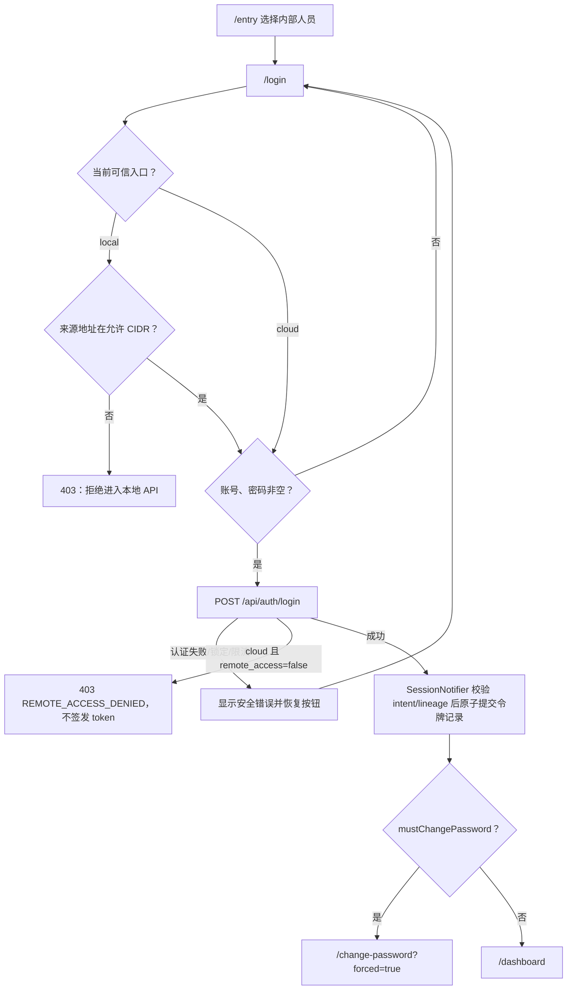

# 登录页

> 路由：`/login` · 实现：`lib/features/auth/pages/login_page.dart` · 网络仓储：`DioAuthRepository` · 生产注入：`DurableLogoutAuthRepository`

## 一、当前定位

员工账号密码登录的独立全屏页，不在业务 `ShellRoute` 内。应用未登录时先进入 `/entry` 选择
“内部人员”或“访客”；内部人员再进入本页。这里已经接真实
`POST /api/auth/login`，不存在“任意非空账号密码即可进入”的 Mock 行为。

- 登录成功且无需改密：进入 `/dashboard`。
- 登录成功但 `mustChangePassword=true`：全局路由守卫强制进入
  `/change-password?forced=true`，完成改密前不能进入其它员工页面。
- 已登录员工访问 `/login`：路由守卫转到 `/dashboard`。
- 访客使用独立 `/visitor/login` 和访客 session，不复用本页。

当前登录提交固定进入工作台；虽然通用导航辅助支持 `returnTo`，本页并未读取或恢复登录前目标，
文档和产品不得宣称已实现登录后回跳。

## 二、真实功能

1. 账号和密码均做非空表单校验；密码框支持显隐、系统自动填充和回车提交。
2. `AccountField` 从安全存储读取最近成功登录的账号，默认填充最近一项；下拉可选择、逐项删除或
   清空，最多保留 10 个。只保存账号，绝不保存密码。
3. 点击登录后按钮进入 loading 且不可重复提交；`ApiException` 只显示服务端安全消息，其它异常
   统一显示“登录失败，请稍后重试”，不把堆栈或网络库细节暴露给用户。
4. `DioAuthRepository` 只调用 `/api/auth/login` 并返回响应，不自行写令牌。`SessionNotifier`
   先登记最新登录意图，网络请求完成后再核对 intent、generation 和 session lineage；只有仍属于当前
   用户意图的响应，才把 access/refresh 及三个代次字段作为一个 `auth.token_record.v1` JSON
   原子提交到 `flutter_secure_storage` 并更新 `sessionProvider`。迟到的旧登录结果不得覆盖退出、
   改密或更新后的会话。
5. 启动时，`sessionProvider` 从权威原子记录恢复并调用 `/api/auth/me`；在途 refresh 已换代时
   复读最新记录，而不是让旧响应覆盖新会话。断网、超时、HTML/空体错误、未知 401、结构化
   `503 SERVICE_UNAVAILABLE` 和其它 5xx 都保留当前记录并等待后续恢复；不能把“暂时联系不上”
   当成凭据失效。
6. “记住此设备”和“忘记密码”控件已移除。每次显式登录都必须输入密码；当前也没有用户自助找回
   密码流程，账号支持人员只能通过受控重置能力处理。

## 三、认证与安全边界

- 员工账号默认 `users.remote_access=false`，即只允许从公司本地入口使用。local 站点先在 JWT 与
  Controller 之前校验请求源 `remoteAddr` 是否落入 `UTEN_LOCAL_ALLOWED_CIDRS`，因此登录、刷新和
  所有 `/api/**` 都受局域网门禁；公网伪造 `X-Forwarded-For` 不能直接取得信任。
- cloud 站点在**密码正确且账号状态校验完成后**，才检查远程授权；未授权返回
  `403 REMOTE_ACCESS_DENIED` 且不签发 token。`POST /api/auth/refresh` 在 refresh 轮换前执行同一
  检查；已认证业务请求还会在 `JwtAuthFilter` 后逐请求检查，登录/刷新不是绕过通道。
- 授权与撤权都属于会话边界：V241 递增 `auth_version`，后端同时撤销目标账号全部 refresh token，
  要求重新登录。撤权后旧 access 因版本不匹配先返回 `401 UNAUTHORIZED`；旧 refresh 在云端返回
  `403 REMOTE_ACCESS_DENIED`，且不会签发替代 token。本地入口仍可用账号密码重新登录。
- 访客是独立公网主体，没有 `users.remote_access`，cloud 的员工远程开关策略明确跳过 visitor；这不
  绕过访客账号状态、访客权限或 local 站点对全部 `/api/**` 的源网段门禁。
- 后端以 Argon2id 校验密码，并限制密码最大长度，降低超长输入导致的 CPU 消耗。
- 未知账号和错误密码返回相同错误；未知账号仍执行 dummy Argon2 匹配。dummy hash 在服务启动
  时预计算，避免首次未知账号请求额外编码形成明显时序差。
- 登录按客户端 IP 限流；失败次数达到阈值后临时锁定。密码校验成功前不暴露停用/锁定状态。
- 成功后签发短期 access token 和轮换 refresh token；V135 的授权版本不匹配时，既有 access
  token 会被拒绝。staff access JWT 只含 `sub/typ/av/ae` 与标准时效/签发字段；账号、部门、
  角色和权限由服务端复查并返回用户快照，不复制进 JWT。
- 令牌只存平台安全存储。权威记录损坏时写无令牌 tombstone 并 fail-closed，旧双键令牌不能被重新
  读回“复活”；Web 的跨标签锁和事件只保存随机 owner、租约或代次，不广播 token。
- refresh 只有在 HTTP 状态和结构化业务码同时精确匹配时才允许销毁当前会话：
  `401 UNAUTHORIZED`、`401 ACCOUNT_LOCKED`、`401 ACCOUNT_DISABLED`、
  `422 VALIDATION_FAILED`、员工链的 `403 REMOTE_ACCESS_DENIED`，以及访客链的
  `403 VISITOR_BLOCKED`。代理/WAF/Tomcat 返回的
  HTML、空体或未知状态码组合一律按服务暂不可用处理。
- 后端账号/权限解析依赖故障返回结构化 `503 SERVICE_UNAVAILABLE`；安全读只做有限重试，不显示
  “无权限”、不触发全局断网探测，也不清除令牌。
- 登录不使用认证 Cookie；当前 CSRF 关闭与 bearer-only 模型一致。若未来改为 Cookie 会话，
  必须重新设计 CSRF、SameSite、Secure 和 HttpOnly。
- 前端页面不是授权真相源；进入业务页后仍由路由权限契约和后端 `@PreAuthorize`/对象授权共同
  控制。

## 四、响应式与组件

| 断点 | 当前布局 |
|---|---|
| compact `<600dp` | 表单直接位于页面背景上，水平留白 24；不渲染卡片 |
| medium / expanded `≥600dp` | 淡 teal/深色主题背景，居中 `UtenCard`，最大宽度 440 |

表单内容在所有断点复用同一实现：`UtenBrandMascot`、`UtenWordmarkLogo`、`AccountField`、
`UtenInput`、`UtenButton`。页面使用 `UtenAnim.slow` 淡入和轻微上移动画；当前源码没有按性能
档关闭该动画，因此不能把“lite 模式无动画”写成已完成能力。

## 五、流程

## 六、数据契约

- 请求仅包含 `{loginAccount, password}`；前端、后端 DTO 和文案都不再接受
  `rememberDevice`，不提供长期记住设备或免密登录。
- 响应：access token、refresh token、`mustChangePassword` 与用户快照。
- 用户快照包括员工标识、部门、岗位、权限集合和超管标志；旧 role 列表只做兼容映射，页面可见性
  以权限点为准。
- 持久化：账号、员工、refresh token 与密码历史位于后端；客户端只保存令牌和最近账号，不存在
  本地 `LoginSession` 业务实体。

## 七、验收清单

- [ ] 正确密码、错误密码、未知账号、停用、管理员锁定、暴力临时锁和限流响应符合契约。
- [ ] 默认未授权员工在 local 允许网段登录成功；同账号 cloud 登录/refresh 均
      `403 REMOTE_ACCESS_DENIED` 且响应无新 token；每请求门禁不能绕过。
- [ ] 超管授权后 cloud 登录/refresh 成功；撤权后旧 access 401、旧 refresh 403 且无替代 token，
      local 仍可重新登录；空/缺失 `remoteAccess` 请求不得被解释为撤权。
- [ ] 首登账号只能进入强制改密页；成功改密后令牌轮换且其它设备旧令牌失效。
- [ ] 启动恢复、access 过期单飞刷新、refresh 重用检测和离线退出均通过真实 API 测试。
- [ ] 三个标签页错峰 401、登录/改密/退出竞态和迟到响应不能覆盖或复活新的会话。
- [ ] HTML/空体/未知 401、结构化 503、断网和超时保留令牌；只有精确结构化拒绝且 lineage/代次
      仍为当前值时清会话。
- [ ] 权威记录损坏时 fail-closed 且旧双键不复活；退出 fence 生效时，应用重启也不自动恢复旧账号。
- [ ] 账号历史最多 10 个、只存账号、可逐项/全部删除；密码、token 不进入日志或普通偏好存储。
- [ ] compact/medium/expanded、浅色/深色、键盘、自动填充、加载/错误状态通过视觉与可访问性回归。
- [ ] 补齐未登录状态的可信端点恢复：已保存“仅本地/仅云端”导致当前端点不可达或无权时，用户能
      恢复 auto/另一构建期可信端点，但不能输入任意 host；当前没有该入口，属于生产阻断缺口。
- [ ] 比较存在/不存在账号的响应时序分布，确认没有可利用的账号枚举侧信道。
- [ ] 明确是否需要登录后 `returnTo`、自助找回密码和按性能档减弱动画；未实现前不得写成已交付。

---

**最后更新**：2026-08-09 · **状态**：真实鉴权、原子会话协调、本地源网段与云端远程授权门禁均
已接；隔离克隆库已完成上述授权 HTTP 矩阵。公司真实 CIDR/可信代理、原生 Release 端点、Web
同源入口、目标云域名/VPN、长会话多标签和断链恢复仍是生产验收项，未完成前为 **NO-GO**。
