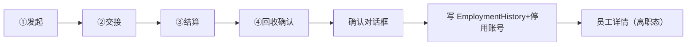

# 离职流程页

> 路由：`/employee/:id/offboarding`（计划：`lib/features/employee/pages/employee_offboarding_page.dart`）· Phase 2
> 上层：[Phase2-人事端总览](Phase2-人事端总览.md)

## 一、定位

hr 通过**多步向导**办理员工离职，覆盖交接、结算、回收，并写入离职任职记录、停用账号。

## 二、入口与导航
- 进入：员工详情「发起离职」（状态=在职/试用）。
- 离开：完成 → 回员工详情（状态变离职）；取消 → 回详情。

## 三、响应式布局
`UtenWizard` 步骤条 + 单步表单，同 [入职流程页](入职流程页.md)。

## 四、涉及的 Uten 组件
`UtenAppBar` / `UtenWizard` / `UtenForm` / `UtenInput`（原因/备注，多行）/ `UtenDropdown`（离职类型）/ `UtenDatePicker`（离职日期）/ `UtenSwitch`（确认项）/ `UtenButton` / `UtenConfirmDialog`（最终确认）/ `UtenToast`。

## 五、功能点（4 步）

| 步骤 | 内容 | 校验/说明 |
|---|---|---|
| ① 发起 | 离职类型（主动/辞退/合同到期/退休）、离职日期、离职原因 | 日期 ≥ 今天 |
| ② 工作交接 | 交接人（选员工）、交接清单（勾选项：文档/项目/权限）、交接备注 | 交接人必选 |
| ③ 薪资结算 | 结算工资月份、应发/扣除/实发（hr 填或系统算）、最后发薪日 | 金额确认 |
| ④ 回收确认 | 勾选：收回门禁/资产、停用系统账号、社保公积金停缴、开具离职证明 | 全勾才允许完成 |

1. **最终确认**：`UtenConfirmDialog`「确认办理离职？该员工账号将被停用」。
2. **完成**：写 `EmploymentHistory`（离职事件）+ `Employee.status=resigned` + 停用 `User`。
3. 成功 → Toast「离职办理完成」→ 回员工详情。

## 六、功能链路图

## 七、涉及的数据实体
`Employee`（状态置离职）/ `EmploymentHistory`（离职事件）/ `User`（停用账号）/ `PayrollSlip`（最终结算）。

## 八、权限要求
- 仅 `hr` / `admin`。
- 权限点：`employee:edit`（发起离职）。
- 仅状态=在职/试用的员工可发起；已离职阻断。

## 九、边界情况
- 员工已离职：阻断入口，Toast「该员工已离职」。
- 有未完成报销/工资：提示先结算（链接对应审批）。
- 网络：草稿本地暂存；停用账号须在线（排队）。
- 性能档 lite：步骤切换去动画。

---

**最后更新**：2026-07-22 · **状态**：需求定稿
