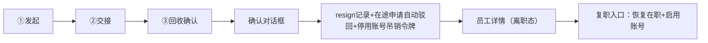

# 离职流程页

> 路由：`/employee/:id/offboarding`（实现：`lib/features/employee/pages/employee_offboarding_page.dart`）· Phase 2
> 上层：[Phase2-人事端总览](Phase2-人事端总览.md)

## 一、定位

具备 `employee:edit` 的账号通过三步表单办理员工离职，覆盖交接、结算、回收，并写入离职任职记录、停用账号。

## 二、入口与导航
- 进入：员工详情「发起离职」（状态=在职/试用）。
- 离开：完成 → 回员工详情（状态变离职）；取消 → 回详情。

## 三、响应式布局
页面使用私有三步状态 + 单步表单；项目没有通用 `UtenWizard`。

## 四、涉及的 Uten 组件
当前页面使用私有步骤状态、`UtenAppBar`、`UtenContentContainer.narrow`、主题化 Material
下拉/日期/文本字段/按钮与确认 `AlertDialog`。项目没有 `UtenWizard`、`UtenForm`、
`UtenDropdown`、`UtenDatePicker`、`UtenSwitch` 或 `UtenConfirmDialog`；若迁移确认框应使用
现有 `UtenDialog`。

## 五、功能点（3 步，真实后端）

| 步骤 | 内容 | 校验/说明 |
|---|---|---|
| ① 发起 | 离职类型（主动/辞退/合同到期/退休）、离职日期、离职原因 | 可补录过去日期，前端最大日期为今天；后端还校验不得早于入职日或最新任职事件 |
| ② 工作交接 | 交接说明（文档/项目/权限，多行） | 并入任职记录备注存档 |
| ③ 回收确认 | 勾选：收回门禁/回收资产/停用系统账号/停缴社保公积金 | 全勾才允许完成；勾选项并入存档留痕 |

1. **最终确认**：对话框「确认办理离职？该员工账号将被停用」。
2. **完成**（`POST /api/org/employees/{id}/offboard`，单事务）：
   写 `EmploymentHistory`（resign 事件，备注=类型+原因+交接+回收清单）
   → `Employee.status=resigned`（乐观锁 +1）
   → **该员工在途的个人信息修改申请自动驳回**（评论「员工离职，申请自动驳回」）
   → `users.status=disabled` + 吊销全部 refresh token（JwtAuthFilter 逐请求校验，**账号即时冻结**）。
3. 成功 → Toast「离职办理完成」→ 回员工详情（状态变离职）。
4. **保护**：目标员工绑定超管账号 / 对本人操作 → 403；已离职 → 409。
5. **回滚路径**：详情页「复职」（`POST /{id}/rehire`，V93）恢复在职 + 重新启用账号 + 写 rehire 任职记录。

## 六、功能链路图

## 七、涉及的数据实体
`Employee`（状态置离职）/ `EmploymentHistory`（离职/复职事件）/ `UserAccount`（停用/启用账号）/ `ProfileChangeRequest`（在途申请自动驳回）/ `RefreshToken`（吊销）。

## 八、权限要求
- 权限点：`employee:edit`（离职/复职）。
- 仅状态=在职/试用的员工可发起；已离职阻断。

## 九、边界情况
- 员工已离职：阻断入口，Toast「该员工已离职」。
- 有未完成报销/工资：提示先结算（链接对应审批）。
- 网络：草稿本地暂存；停用账号须在线（排队）。
- 性能档 lite：步骤切换去动画。
- 生效日期晚于今天、早于入职日或早于最新任职事件：后端拒绝，不写 `resign` 事件、不改变账号状态。
- 目标员工是部门负责人时，离职事务同时清空该部门负责人引用。

---

**最后更新**：2026-08-01 · **状态**：真实后端、离职日期顺序守卫和负责人解除已接入（端到端验证：离职冻结登录 401 / 复职恢复）。
