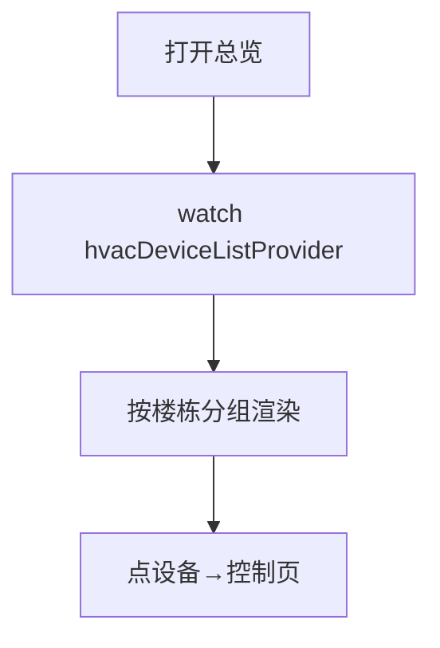

# 空调设备总览页

> 路由：`/hvac`（计划：`lib/features/hvac/pages/hvac_overview_page.dart`）· Phase 4
> 上层：[Phase4-生产实验室总览](Phase4-生产实验室总览.md)

## 一、定位

设备人员总览全厂楼栋空调运行状态（在线/离线、当前温度、模式），按楼栋/楼层筛选，进入单台控制。车间大屏/平板常用。

## 二、入口与导航
- 进入：production 主导航「空调控制」。
- 离开：点设备 → [空调控制页](空调控制页.md)。

## 三、响应式布局
卡片网格（按楼栋分组）。

- expanded：
```
┌──────────────────────────────────────────────┐
│ 空调总览   楼栋[1号厂房▼] 状态[全部▼] 🔍       │
├──────────────────────────────────────────────┤
│ 1号厂房 2F                                   │
│ ┌──────┐┌──────┐┌──────┐                     │
│ │A车间  ││B车间  ││仓库   │  ← 设备卡         │
│ │🟢22℃  ││🔴离线 ││🟡26℃  │   (状态色+温度)   │
│ │制冷   ││      ││送风   │                     │
│ └──────┘└──────┘└──────┘                     │
│ 1号厂房 1F …                                 │
└──────────────────────────────────────────────┘
```
- compact：单列卡片列表。

## 四、涉及的 Uten 组件
`UtenAppBar`（楼栋/状态筛选+搜索）/ `UtenResponsiveGrid`（设备卡瀑布）/ `UtenCard` / `UtenStatusBadge`（在线 success/离线 error/告警 warning）/ `UtenEmpty` / `UtenSkeletonList`。

## 五、功能点
1. **按楼栋分组**：每组一个楼层区块，设备卡按楼层排。
2. **设备卡**：位置名 + 状态色点 + 当前温度 + 模式 + 目标温度。
3. **筛选**：楼栋、楼层、状态（在线/离线/告警）。
4. **搜索**：按位置名。
5. 点卡 → 控制页。
6. **异常高亮**：离线/温度超阈值红色，便于巡检。

## 六、功能链路图


## 七、涉及的数据实体
`HvacDevice`（设备：位置/状态/当前温度/目标温度/模式）/ `Building` / `Floor`。

## 八、权限要求
- production / manager 只读 / admin。`production:view`。

## 九、边界情况
- 无设备：`UtenEmpty`「暂无空调设备」。
- 实时性：后端接入后轮询/SSE 刷新状态（前端阶段 Mock）。
- 性能档 lite：卡片去状态色动画。
- 网络现状：页面仍使用 Mock 数据，尚未接入实时后端，也没有断网缓存。后续接入真实设备后，才实施“显示最后一次可信状态 + 离线角标”，并明确状态采集时间。

---

**最后更新**：2026-07-30 · **状态**：需求定稿；真实设备、实时通道与离线缓存待实现
