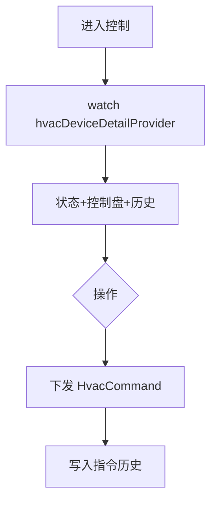

# 空调控制页

> 路由：`/hvac/:id`（计划：`lib/features/hvac/pages/hvac_control_page.dart`）· Phase 4
> 上层：[Phase4-生产实验室总览](Phase4-生产实验室总览.md)

## 一、定位

设备人员远程控制单台空调：开关、温度、模式、风速、定时，并看历史指令与当前实测温湿度。

## 二、入口与导航
- 进入：[空调总览页](空调总览页.md) 点设备。
- 离开：返回总览。

## 三、响应式布局
- compact：单列，Hero 设备状态 + 控制盘 + 定时 + 指令历史。
- expanded：居中 ≤600dp，控制盘居中大圆盘。

```
┌────────────────────────┐
│ ← A车间空调   [在线🟢]   │
├────────────────────────┤
│ ┌────────────────────┐ │
│ │   22℃  目标 24℃     │ │  ← Hero（实测+目标）
│ │   湿度 55%  制冷❄️   │ │
│ └────────────────────┘ │
│  开关  [●──── 开]       │  ← UtenSwitch
│  温度  [───●───] 24℃   │  ← UtenSlider 16-30
│  模式  [制冷❄][制热🔥][送风🌬] │
│  风速  [低][中][高]     │
│  定时  □ 开启  [07:00]  │
│ 指令历史               │
│  ● 开机·制冷24℃  09:00  │  ← UtenTimeline
│  ● 调温25℃      08:30  │
└────────────────────────┘
```

## 四、涉及的 Uten 组件
`UtenAppBar` / `UtenCard` / `UtenStatusBadge` / `UtenSwitch`（开关/定时）/ `UtenSlider`（温度，自定义或 CupertinoSlider）/ `UtenSegmentedFilter`（模式/风速）/ `UtenDatePicker`+时间（定时）/ `UtenTimeline`（指令历史）/ `UtenConfirmDialog`（批量/危险操作）/ `UtenToast`。

## 五、功能点
1. **Hero**：实测温湿度 + 目标温度 + 模式 + 在线状态。
2. **控制**：开关、温度滑块（16-30）、模式（制冷/制热/送风）、风速（低/中/高/自动）。
3. **定时**：开关机定时。
4. **指令历史**：`UtenTimeline` 展示 `HvacCommand`（谁/何时/下了什么指令）。
5. **每次控制下发指令**：写 `HvacCommand` + 走审计；离线时指令排队（见全局机制 §4）。
6. **危险操作**：批量关机/全厂调度需 `UtenConfirmDialog`。

## 六、功能链路图


## 七、涉及的数据实体
`HvacDevice`（状态/目标/模式）/ `HvacCommand`（指令历史：command/payload/actor/at）/ `Building`/`Floor`。

## 八、权限要求
- production（控制）/ manager 只读（无控制盘）/ admin。`production:view` + 控制。
- 关键操作走审计（全局机制 + 安全准则 §4.8）。

## 九、边界情况
- 设备离线：控制盘禁用 + 提示「设备离线，指令将排队」。
- 网络：指令排队，恢复后下发；状态显示「本地缓存」。
- 性能档 lite：滑块改步进按钮，去圆盘动画。
- 并发：多人同时控同一台，后端按最新指令为准 + 版本号。

---

**最后更新**：2026-07-22 · **状态**：需求定稿
