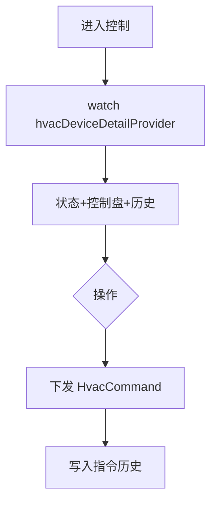

# 空调控制页

> 路由：`/hvac/:id`（计划：`lib/features/hvac/pages/hvac_control_page.dart`）· Phase 4
> 上层：[Phase4-生产实验室总览](Phase4-生产实验室总览.md)

## 一、定位

设备人员远程控制单台空调：开关、温度、模式、风速、定时，并看历史指令与当前实测温湿度。

## 二、入口与导航
- 进入：[空调总览页](空调总览页.md) 点设备。
- 离开：返回总览。

## 三、响应式布局
- compact：单列，Hero 设备状态 + 控制盘 + 定时 + 指令历史。
- expanded：居中 ≤600dp，控制盘居中大圆盘。

```
┌────────────────────────┐
│ ← A车间空调   [在线🟢]   │
├────────────────────────┤
│ ┌────────────────────┐ │
│ │   22℃  目标 24℃     │ │  ← Hero（实测+目标）
│ │   湿度 55%  制冷❄️   │ │
│ └────────────────────┘ │
│  开关  [●──── 开]       │  ← Material Switch
│  温度  [───●───] 24℃   │  ← Material Slider 16-30
│  模式  [制冷❄][制热🔥][送风🌬] │
│  风速  [低][中][高]     │
│  定时  □ 开启  [07:00]  │
│ 指令历史               │
│  ● 开机·制冷24℃  09:00  │  ← 页面私有历史列表
│  ● 调温25℃      08:30  │
└────────────────────────┘
```

## 四、涉及的 Uten 组件
当前前端使用 `UtenAppBar`、`UtenCard`、`UtenStatusBadge`、主题化 Material
`Switch`/`Slider`、`UtenSectionHeader` 和页面私有历史列表。项目没有
`UtenSwitch`、`UtenSlider`、`UtenTimeline`；控制请求仍进入 `MockHvacRepository`。

## 五、功能点
1. **Hero**：实测温湿度 + 目标温度 + 模式 + 在线状态。
2. **控制**：开关、温度滑块（16-30）、模式（制冷/制热/送风）、风速（低/中/高/自动）。
3. **定时**：开关机定时。
4. **指令历史**：当前页面私有列表展示演示指令；接真实后端后必须记录操作者、时间、目标、旧值、
   新值和执行结果。
5. **每次控制下发指令（目标）**：真实后端接入后写 `HvacCommand` 并走审计；离线指令队列属于全局机制 §4 的待实现能力，当前 Mock 不提供可靠排队。
6. **危险操作（目标）**：批量关机/全厂调度使用 `UtenDialog`，后端仍须专属权限、幂等和审计。

## 六、功能链路图


## 七、涉及的数据实体
`HvacDevice`（状态/目标/模式）/ `HvacCommand`（指令历史：command/payload/actor/at）/ `Building`/`Floor`。

## 八、权限要求
- production（控制）/ manager 只读（无控制盘）/ admin。`production:view` + 控制。
- 关键操作走审计（全局机制 + 安全准则 §4.8）。

## 九、边界情况
- 设备离线（目标）：控制盘禁用并提示设备离线；在可靠队列、幂等键和冲突策略完成前，不得承诺指令会自动排队或下发。
- 网络现状：控制请求仍进入 `MockHvacRepository`，没有真实指令队列或状态缓存。恢复后下发及“本地缓存”标识均为待实现能力。
- 性能档 lite：滑块改步进按钮，去圆盘动画。
- 并发：多人同时控同一台，后端按最新指令为准 + 版本号。

---

**最后更新**：2026-07-30 · **状态**：需求定稿；真实控制、审计、幂等及离线队列待实现
