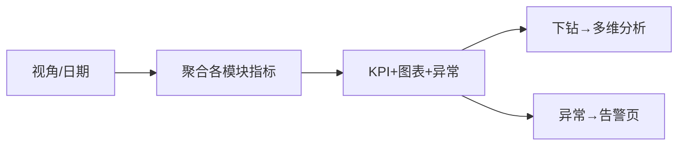

# 经营 Dashboard 页

> 路由：`/analytics/dashboard`（计划：`lib/features/analytics/pages/business_dashboard_page.dart`）· Phase 5
> 上层：[Phase5-管理层总览](Phase5-管理层总览.md)

## 一、定位

管理层一屏看全公司经营关键指标（产量/订单/成本/利润/人员/库存），趋势 + 异常入口。大屏/桌面为主。

## 二、入口与导航
- 进入：manager 主导航「经营 Dashboard」。
- 离开：点指标 → [多维分析页](多维分析页.md) 下钻；异常角标 → [异常告警页](异常告警页.md)。

## 三、响应式布局

- expanded（大屏）：
```
┌──────────────────────────────────────────────┐
│ 经营 Dashboard      范围[全公司▼] 2026-07-22   │
├──────────────────────────────────────────────┤
│ [产量12800][订单¥450万][成本¥260万][利润¥190万]│  ← KPI 矩阵(含环比)
│ [在职286][库存周转4.2][合格率98.5%][设备在线96%]│
│ 营收趋势(折线)          产品产量(柱)           │  ← 图表
│ 部门成本占比(饼)        库存预警(列表)          │
└──────────────────────────────────────────────┘
```
- compact：KPI 2 列 + 图表纵向堆叠（手机只看概览）。

## 四、涉及的 Uten 组件
`UtenAppBar`（视角+日期）/ `UtenViewContextSelector` / `UtenStatCard`（KPI+环比+趋势箭头）/ `UtenChartPlaceholder` / `UtenResponsiveGrid`（KPI/图表布局）/ `UtenStatusBadge`（异常）/ `UtenEmpty`。

## 五、功能点
1. **KPI 矩阵**：产量/订单/成本/利润/在职人数/库存周转/合格率/设备在线率，每项含环比。
2. **图表**（占位→真库）：营收趋势、产品产量、部门成本占比。
3. **异常提示**：库存预警/设备离线/质量异常角标，点击跳告警页。
4. **视角跟随**：切部门 → KPI 按部门汇总。
5. **大屏模式**：rich 档放大、自动刷新、轻微动效。

## 六、功能链路图


## 七、涉及的数据实体
聚合：`ProductionOutput` / `PayrollSlip` / `ExpenseClaim` / `Employee` / `InventoryStock` / `LabTest` / `HvacDevice`。

## 八、权限要求
- manager / admin。门槛 `employee:view`。只读。

## 九、边界情况
- 无数据：KPI 显示 0 + 图表 `UtenEmpty`。
- 性能档 lite：图表降级静态数字表，去动效。
- 网络：缓存上次指标 +「数据可能非最新」。

---

**最后更新**：2026-07-22 · **状态**：需求定稿
