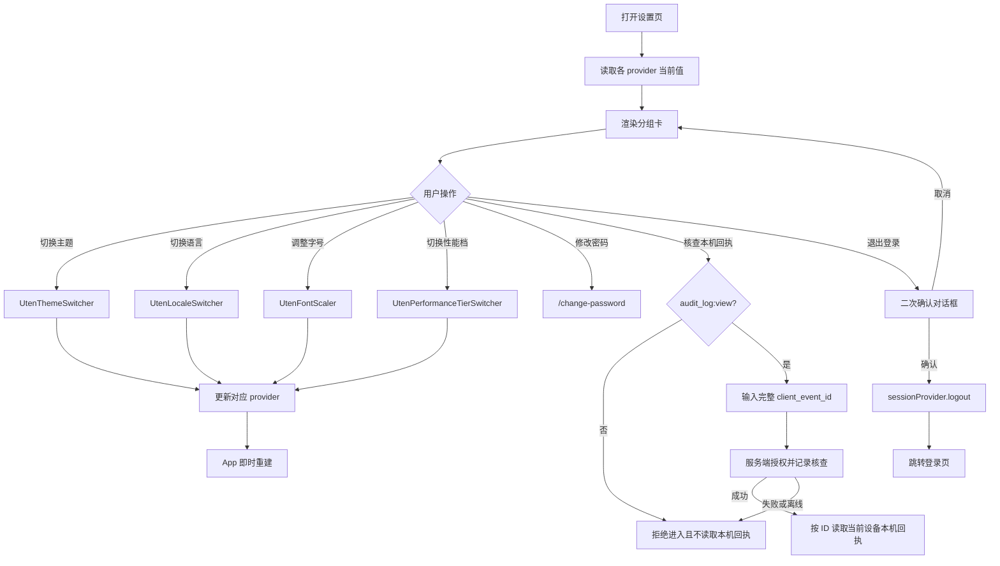

# 设置页

> 路由：`/settings` · 实现源：`lib/features/settings/pages/settings_page.dart`

## 一、定位

给所有员工使用的应用级偏好与账号出口页；其中“本机信息与操作回执”是受限核查子页，只有持
超级管理员或个人获授 `audit_log:view` 的指定核查人员可见，普通员工和访客不进入该能力。

- 解决的问题：切换主题/语言/字号/性能档、查看版本、修改密码、退出登录。
- 产品位置：底部/侧边导航固定项，与业务页面解耦的全局设置中心。

## 二、入口与导航

- 进入路径：
  - [我的页](我的页.md) → "应用设置" 入口
  - 底部/侧边导航固定项"设置"
- 在导航中的位置：悬浮胶囊固定主项（参见[页面总览](页面总览.md#workbench-sections)）。
- 离开去向：
  - 退出登录 → [登录页](登录页.md)
  - 本机信息与操作回执 → `/settings/device-receipts`（仅 `audit_log:view`）
  - 返回上一页（保留路由栈）

## 三、响应式布局

- 所有断点使用 `UtenContentContainer.narrow`，内容最大宽度 1120；员工页位于主外壳内，不重复
  渲染自己的 `UtenAppBar`。compact（手机）为单列纵向区块：
  ```
  ┌────────────────────────┐
  │ 外观                   │
  │ ┌────────────────────┐ │
  │ │ 主题模式  [亮|暗|系统]│ │  ← ExpansionTile 展开
  │ │ 语言      [中|英]   │ │
  │ │ 字号      [- 100% +]│ │
  │ └────────────────────┘ │
  │ 性能                  │
  │ ┌────────────────────┐ │
  │ │ 性能档 [lite|standard│ │
  │ │        |rich]       │ │
  │ └────────────────────┘ │
  │ 关于                  │
  │ ┌────────────────────┐ │
  │ │ 版本      AppInfo  │ │
  │ └────────────────────┘ │
  │ 账号                  │
  │ ┌────────────────────┐ │
  │ │ 修改密码          > │ │
  │ └────────────────────┘ │
  │ ┌────────────────────┐ │
  │ │ 🔴 退出登录         │ │
  │ └────────────────────┘ │
  │ 优腾综合管理平台       │
  │ © 2026 Uten           │
  └────────────────────────┘
  ```
  说明：单列纵向卡片分组，每组复用 `SettingsSection` + `SettingsItem` + `UtenCard`。

- medium / expanded：结构不变，内容居中且最大宽度 1120，避免设置行随超宽屏无限拉伸。

## 四、涉及的 Uten 组件

- `UtenCard`（每个分组一个卡）
- `UtenContentContainer.narrow`（居中并限制超宽屏内容宽度）
- `SettingsSection` / `SettingsItem`（员工与访客设置共用分组、行和分隔线）
- `UtenThemeSwitcher`（主题切换器，跟随系统/亮/暗）
- `UtenLocaleSwitcher`（语言切换器，中/英）
- `UtenFontScaler`（字号缩放器，影响全局 `TextScaler`）
- `UtenPerformanceTierSwitcher`（性能档切换器：lite / standard / rich）
- `UtenNotify.alert`（员工与访客共用的退出二次确认）
- `UtenColors`（退出登录红色）

## 五、功能点

1. **外观区**（3 个 `ExpansionTile`）：
   - 主题模式：通过 `UtenThemeSwitcher` 切换 system/light/dark，即时生效。
   - 语言：通过 `UtenLocaleSwitcher` 切换 中/英，立即重建界面。
   - 字号：通过 `UtenFontScaler` 调整全局文本缩放，便于视力不佳员工。
2. **性能区**：
   - 性能档切换（`UtenPerformanceTierSwitcher`）：lite 关闭动画/特效，standard 默认，rich 开启全部动画/模糊/粒子。
   - 副标题提示"根据设备性能选择合适档位"。
3. **关于**：显示 `AppInfo.version`。构建时用 `--dart-define=APP_VERSION=...` 注入，未注入时
   回退 `0.1.0`；员工/访客设置共用这一来源。
4. **账号**：进入 `/change-password`；访客设置不显示该项，因为访客使用验证码登录。
5. **退出登录**：红色 ListTile，员工/访客都复用 `UtenNotify.alert` 二次确认，不再分别复制
   `AlertDialog`。员工确认后调用 `sessionProvider.logout()` 并跳 `/login`。
6. **正式页脚**：员工侧显示 `AppInfo.displayName + copyright`；访客侧显示正式产品名和“访客端”，
   不再出现 Phase 0/Demo 文案。
7. 偏好通过 Riverpod provider 持久化（具体存储介质见架构文档）。
8. **设备核查（条件入口）**：仅在当前员工持 `audit_log:view` 时显示“本机信息与操作回执”，
   进入 `/settings/device-receipts`；普通员工不显示，访客设置页也不提供同类入口。

### 5.1 本机信息与操作回执子页

该子页用于核查**当前这台设备**的本地证据，不是普通用户的操作历史页：

- 顶部展示本机安装标识、名称、厂商/型号、平台、系统版本和应用版本/构建号；平台未提供的字段显示
  “平台未提供”，不得根据 User-Agent 猜测物理型号；
- 核查人员从审计详情复制完整“本地操作 ID（`client_event_id`）”，在原设备精确查询；页面不列出、
  不分页也不搜索共享设备上的全部历史；
- 每次精确查询先调用
  `POST /api/admin/audit-logs/local-receipt-verifications/{clientEventId}`，由服务端重新校验
  `audit_log:view` 并写入 `verify_local_audit_receipt`；无权限、离线或授权接口失败时不读取本机回执；
- 查询结果展示请求方法、去除查询值后的路径、开始/完成时间、结果、HTTP 状态、服务器 Request ID、
  重试轨迹、当时设备快照和本地完整性状态；
- 页面可复制单条回执用于人工比对；如提供文件导出，必须再校验 `audit_log:export` 并沿用加密导出规范；
- 不提供“删除/清空/编辑本机回执”操作。本机最多保留最近 300 条，并按服务器审计总留存月数自动
  清理；超期、超量、卸载、浏览器/系统清理或设备重置后显示“本机已无可核查数据”；
- 本地完整性通过和数据库字段一致只能标为“交叉佐证一致”。本机密钥也位于本机，不能据此声称
  物理设备已认证、实际操作者已证明或证据不可抵赖；
- 回执正文是 shared preferences 中的明文 JSON，只有 HMAC 密钥进入平台安全存储。产品权限不能阻止
  已取得设备管理员/root、浏览器开发工具或用户系统账号权限的人直接读取本地数据，所以回执不得保存
  query、正文、凭证、令牌或直接 PII。

路由必须单独执行 `audit_log:view` 守卫，不能只依赖设置页隐藏入口。无权限员工直接输入深链返回
无权限页且不得读取本机存储；访客端不注册 `/visitor/settings/device-receipts` 等等价路由。

## 六、功能链路图



## 七、涉及的数据实体

→ 见 [04-数据模型/实体字典.md](../04-数据模型/实体字典.md)
- `SessionState`：退出时先清内存状态与平台安全存储中的令牌
- `AppInfo`：集中提供产品名、版本和版权；不是数据库实体
- `DeviceAuditProfile`：当前安装实例和平台可提供的设备快照；随机安装标识不是硬件识别码
- `LocalAuditReceipt`：仅存当前设备、按完整操作 ID 精确查询的本机证据；不是服务器数据库实体

> 本页大部分操作针对应用偏好（性能档、主题、语言、字号），属于本地设置而非业务实体，无独立实体。

## 八、权限要求

- 员工 `/settings` 为登录即可见；访客使用独立 `/visitor/settings` 和 visitor session。
- `/settings/device-receipts` 及其设置入口要求 `audit_log:view`；普通员工和所有访客均无入口，
  深链也必须拦截。
- 查看审计和本机回执不授予写能力；不能修改或删除服务器记录，也不能手动清除本机回执。
- 审计或回执导出还要求 `audit_log:export`；`audit_log:view` 单独不足以导出。
- 数据范围：仅影响当前设备/账号的本地偏好。
- 关键操作权限点：退出登录需用户主动触发 + 二次确认。

## 九、边界情况

- 无数据时：本页不依赖列表数据。
- 加载失败时：本地 provider 读写失败概率极低；若 storage 异常应降级使用内存默认值并 Toast 提示"设置未能保存"。
- 性能档 = lite 下：所有切换器自身不依赖动画；切到 lite 后整个 App 的转场动画被禁用。
- 本机回执为空时：区分“该操作来自另一台设备”“已自动超期/超量清理”“应用卸载或系统清理导致
  本地数据消失”，不得把无本机记录解释为服务器记录无效。
- Web 端：浏览器通常不能提供真实设备名称、厂商和型号；显示浏览器/平台及缺失状态，不采集或模拟
  IMEI、MAC、硬件序列号。
- 网络断开时：偏好可继续使用本地存储。真实退出流程会先清平台安全存储和内存 session，再尽力异步
  调后端撤销旧 refresh token；因此断网也能立即本地退出，迟到的旧 logout 响应不会清除随后新登录
  取得的令牌。远端未撤销 token 仍须依靠服务端 TTL/轮换/重用检测失效。本机回执核查不能离线降级：
  服务端授权未成功时不读取或展示目标回执。

---

**最后更新**：2026-07-31 · **状态**：正式设置页、集中版本信息和共享退出确认已接；本机回执子页
按 `audit_log:view` 限定为核查能力，入口隐藏、深链守卫、访客无入口、在线授权失败零本机读取及无手动
清理已有定向测试；六端设备字段与本地留存仍须完成真机 E2E。
