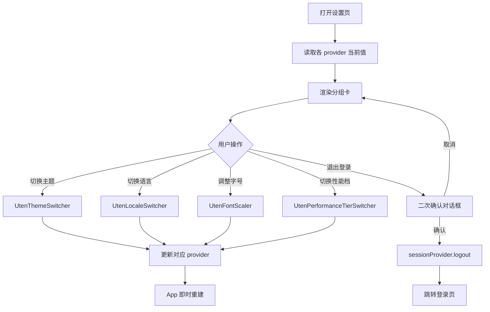

# 设置页

> 路由：`/settings` · 实现源：`lib/features/settings/pages/settings_page.dart`

## 一、定位

给所有员工使用的应用级偏好与账号出口页。

- 解决的问题：切换主题/语言/字号/性能档、查看版本、退出登录。
- 产品位置：底部/侧边导航固定项，与业务页面解耦的全局设置中心。

## 二、入口与导航

- 进入路径：
  - [我的页](我的页.md) → "应用设置" 入口
  - 底部/侧边导航固定项"设置"
- 在导航中的位置：**底部固定项**（参见 [页面总览](页面总览.md#32-导航分组按角色)）。
- 离开去向：
  - 退出登录 → [登录页](登录页.md)
  - 返回上一页（保留路由栈）

## 三、响应式布局

- compact（手机，< 600dp）：
  ```
  ┌────────────────────────┐
  │ UtenAppBar 设置         │
  ├────────────────────────┤
  │ 外观                   │
  │ ┌────────────────────┐ │
  │ │ 主题模式  [亮|暗|系统]│ │  ← ExpansionTile 展开
  │ │ 语言      [中|英]   │ │
  │ │ 字号      [- 100% +]│ │
  │ └────────────────────┘ │
  │ 性能                  │
  │ ┌────────────────────┐ │
  │ │ 性能档 [lite|standard│ │
  │ │        |rich]       │ │
  │ └────────────────────┘ │
  │ 关于                  │
  │ ┌────────────────────┐ │
  │ │ 版本      0.1.0    │ │
  │ └────────────────────┘ │
  │ ┌────────────────────┐ │
  │ │ 🔴 退出登录         │ │
  │ └────────────────────┘ │
  │ Phase 0 地基 Demo     │
  └────────────────────────┘
  ```
  说明：单列纵向卡片分组，每组用 `_SectionTitle` + `UtenCard` 包裹。

- medium（平板，600-840dp）：内容居中宽度限制（约 600dp），其他不变。

- expanded（桌面，> 840dp）：内容居中，最大宽度 720dp，更宽松的卡片内边距。

## 四、涉及的 Uten 组件

- `UtenAppBar`
- `UtenCard`（每个分组一个卡）
- `UtenThemeSwitcher`（主题切换器，跟随系统/亮/暗）
- `UtenLocaleSwitcher`（语言切换器，中/英）
- `UtenFontScaler`（字号缩放器，影响全局 `TextScaler`）
- `UtenPerformanceTierSwitcher`（性能档切换器：lite / standard / rich）
- `UtenColors`（退出登录红色）

## 五、功能点

1. **外观区**（3 个 `ExpansionTile`）：
   - 主题模式：通过 `UtenThemeSwitcher` 切换 system/light/dark，即时生效。
   - 语言：通过 `UtenLocaleSwitcher` 切换 中/英，立即重建界面。
   - 字号：通过 `UtenFontScaler` 调整全局文本缩放，便于视力不佳员工。
2. **性能区**：
   - 性能档切换（`UtenPerformanceTierSwitcher`）：lite 关闭动画/特效，standard 默认，rich 开启全部动画/模糊/粒子。
   - 副标题提示"根据设备性能选择合适档位"。
3. **关于**：显示当前版本（"0.1.0 (Phase 0)"）。
4. **退出登录**：红色文字 ListTile，点击弹 `AlertDialog` 二次确认 → 调用 `sessionProvider.logout()` → 跳 [登录页](登录页.md)。
5. **页脚信息**：展示"Phase 0 地基 Demo / 完整功能将在 Phase 1+ 陆续开放"。
6. 所有偏好通过 Riverpod provider 持久化（具体存储介质见 05-架构）。

## 六、功能链路图



## 七、涉及的数据实体

→ 见 [04-数据模型/实体字典.md](../04-数据模型/实体字典.md)
- `LoginSession`：退出登录时清空
- `User`：间接（退出后 session 失效）

> 本页大部分操作针对应用偏好（性能档、主题、语言、字号），属于本地设置而非业务实体，无独立实体。

## 八、权限要求

- **全员可见**。
- 数据范围：仅影响当前设备/账号的本地偏好。
- 关键操作权限点：退出登录需用户主动触发 + 二次确认。

## 九、边界情况

- 无数据时：本页不依赖列表数据。
- 加载失败时：本地 provider 读写失败概率极低；若 storage 异常应降级使用内存默认值并 Toast 提示"设置未能保存"。
- 性能档 = lite 下：所有切换器自身不依赖动画；切到 lite 后整个 App 的转场动画被禁用。
- 网络断开时：所有偏好均本地存储，无网络依赖。退出登录接口（Phase 1 Mock 直接清 session）后端接入后需在断网时也允许本地登出（清 token，下次联网时上报）。
