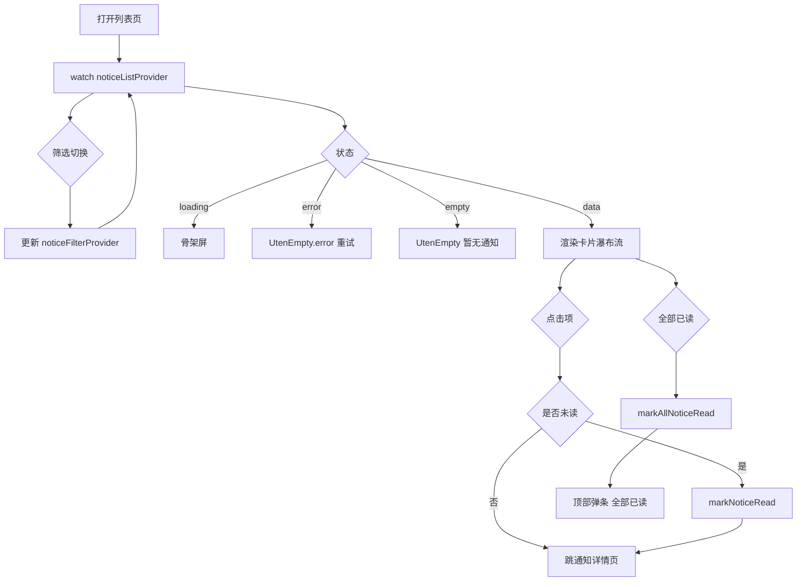
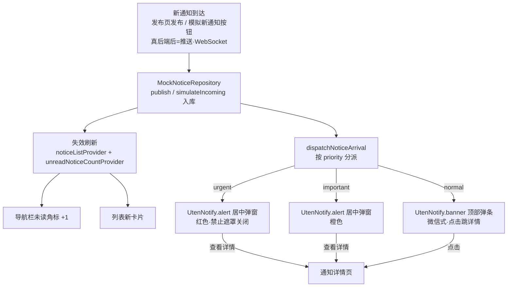

# 通知列表页

> 路由：`/notice` · 实现源：`lib/features/notice/pages/notice_list_page.dart`

## 一、定位

员工查看公司发布的所有通知公告的列表入口。

- 解决的问题：按类型/未读快速浏览通知，区分已读未读，支持一键全部已读。
- 产品位置：员工主导航"通知"项，是 [通知详情页](通知详情页.md) 的前置列表。

## 二、入口与导航

- 进入路径：
  - [工作台首页](工作台首页.md) → "公司通知"快捷操作
  - [我的页](我的页.md) → "公司通知"快捷入口
  - 主导航"通知"
- 在导航中的位置：**员工主导航**项。
- 离开去向：点击列表项 → [通知详情页](通知详情页.md)。

## 三、响应式布局

卡片瀑布流布局：列表容器改用 `UtenResponsiveGrid`，每条通知渲染为竖版 `UtenCard`，**列数按父容器实际宽度自适应**（非屏幕宽度）。

| 容器宽度 | 列数 | 典型设备 |
|---|---|---|
| `< 500px` | 1 列 | 手机 |
| `500-800px` | 2 列 | 大屏手机 / 小平板 |
| `800-1100px` | 3 列 | 平板 |
| `1100-1500px` | 4 列 | 桌面 |
| `> 1500px` | 5 列 | 宽屏桌面 |

> 概括：**手机 1 列 / 平板 2-3 列 / 桌面 3-5 列**。在抽屉/分栏展开导致内容区收窄时，列数会随之减少。

- compact（手机，1 列）：
  ```
  ┌────────────────────────┐
  │ ← 公司通知   [全部已读]  │  ← AppBar 带 action
  ├────────────────────────┤
  │ [全部][未读]            │  ← SegmentedFilter 2 段
  ├────────────────────────┤
  │ ┌────────────────────┐ │
  │ │ [公告] 🔴            │ │  ← 类型标签 + 未读红点
  │ │ 国庆放假通知         │ │  ← 标题
  │ │ 根据国务院安排...    │ │  ← 摘要
  │ │ 人事部 · 2 小时前     │ │  ← 发布人 + 时间
  │ └────────────────────┘ │  ← UtenCard（竖版）
  │ ┌────────────────────┐ │
  │ │ [制度]               │ │  ← 已读显示类型标签
  │ │ 考勤制度             │ │
  │ │ 上班时间调整为...    │ │
  │ │ 人事部 · 3 天前       │ │
  │ └────────────────────┘ │
  │ ┌────────────────────┐ │
  │ │ [福利]               │ │
  │ │ 中秋福利             │ │
  │ │ ...                 │ │
  │ └────────────────────┘ │
  └────────────────────────┘
  ```
  说明：AppBar 右上 action + 2 段 SegmentedFilter + `UtenResponsiveGrid` 单列卡片瀑布。

- medium（平板，2-3 列）：同结构，卡片按容器宽度自动排成 2 或 3 列瀑布。

- expanded（桌面，3-5 列）：卡片密度更高，列数随容器宽度自适应；左右分栏 Phase 2+ 考虑。

## 四、涉及的 Uten 组件

- `UtenAppBar`（带返回按钮 + actions）
- `UtenSegmentedFilter` + `UtenSegment`（2 段：全部 / 未读）
- `UtenResponsiveGrid`（卡片瀑布流容器，按父容器宽度自适应列数）
- `UtenCard`（竖版通知卡片）
- `UtenStatusBadge`（已读项显示类型标签）
- `UtenEmpty`（空态：无通知 / error）
- `UtenSkeletonList`（加载骨架，6 项）
- `UtenColors`（未读红点用 error 色）

## 五、功能点

1. `UtenSegmentedFilter` 2 段：全部 / 未读，切换更新 `noticeFilterProvider`。
2. AppBar 右上 action "全部已读"：调 `markAllNoticeRead(ref)` → SnackBar"全部已读"。
3. `RefreshIndicator` 下拉刷新 `noticeListProvider.refresh()`。
4. `AsyncValue.when` 三态：loading / error（重试）/ data。
5. **空态**：`UtenEmpty`（notifications_none_rounded + "暂无通知"）。
6. 通知卡片 `UtenCard`（在 `UtenPagedGrid` 内渲染）：
   - **重要度强调条**：卡片左缘 4dp 色条——`important` 橙 / `urgent` 红（`normal` 无）。
   - 顶部行：类型徽章（8 类，图标+颜色来自 `notice.type`）+ **「工作」标识**（`type.isWork` 即任务/审批/流程时显示的描边小签）+ 重要度徽章（`priority.showBadge` 时：重要橙 / 紧急红）+ 置顶 pin + 未读红点。
   - 标题：标题（2 行 ellipsis）。
   - 摘要：通知正文摘要（2 行 + ellipsis）。
   - 底部行：发布人（工作类用 work_outline 图标）+ 相对时间（"X 分钟前 / X 小时前 / X 天前 / yyyy-MM-dd"）。
7. 点击卡片：若未读先 `markNoticeRead(ref, n.id)` → 跳详情页。
8. **「模拟新通知」按钮**（全部已读旁）：全链路演示入口。调 `repo.simulateIncoming()` 轮换产生三类工作事件（**任务下发=重要 / 上游完成=一般 / 审批结果=一般**）→ 入库 → 列表+角标失效刷新 → `dispatchNoticeArrival` 按重要度弹出到达提醒（重要/紧急=居中弹窗，一般=顶部弹条）。接真后端后由推送/WebSocket 触发同一调度器。

## 六、功能链路图



### 通知到达链路（全链路演示 / 接真后端的推送落点）



## 七、涉及的数据实体

→ 见 [04-数据模型/实体字典.md](../04-数据模型/实体字典.md)
- `Notice`：列表项主实体（id / title / type / publisher / publishedAt / isRead / topPriority / priority）
- `NoticeType`：8 种枚举——公告类 5 种（announcement / policy / benefit / system / urgent）+ **工作类 3 种（task 任务 / approval 审批 / workflow 流程）**；`type.isWork` 区分工作消息与公告广播
- `NoticePriority`：3 种重要度（normal 一般 / important 重要 / urgent 紧急），驱动卡片样式与到达弹出通道
- `NoticeReadRecord`：标记已读时写入（userId + noticeId + readAt）

## 八、权限要求

- **全员可见**（所有角色都可读公司通知）。
- 数据范围：Phase 1 列出所有"全员范围"通知；后端接入后按通知的可见范围（部门/工种/全员）过滤。
- 关键操作权限点：
  - 标记本人已读（self）
  - 全部已读（self）
  - 发布/编辑通知：仅 hr 角色（在 Phase 2 [通知发布页](通知发布页.md)）

## 九、边界情况

- 无数据时：`UtenEmpty` 显示"暂无通知"。
- 加载失败时：`UtenEmpty.error` + 重试（`ref.invalidate(noticeListProvider)`）。
- 性能档 = lite 下：禁用卡片进场动画，`UtenResponsiveGrid` 退化为固定单列、卡片间距压缩，骨架屏退化为纯灰块。
- 网络断开时：Phase 1 Mock 无影响；后端接入后：
  - 通知支持离线缓存，未读红点状态本地维护。
  - `markNoticeRead` 写入需排队，恢复网络后批量同步。
  - 紧急通知（urgent 类型）应支持推送通道（FCM/极光），不依赖用户打开 App。
