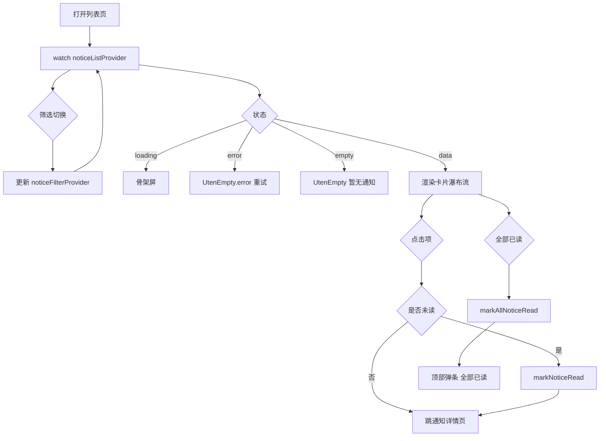
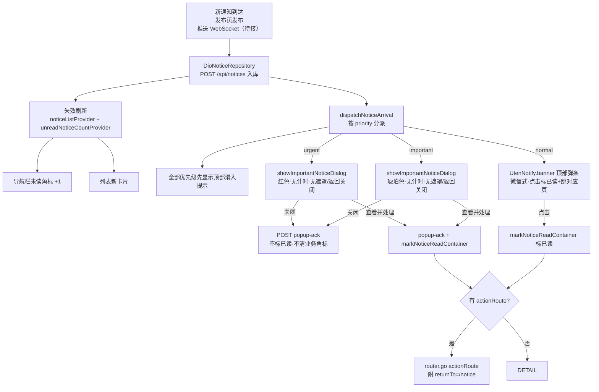
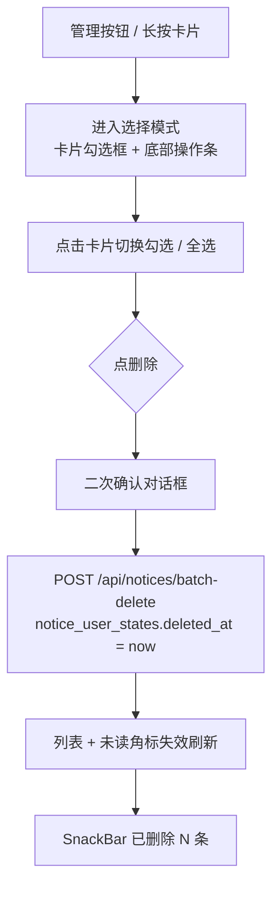

# 通知列表页

> 路由：`/notice` · 实现源：`lib/features/notice/pages/notice_list_page.dart`
> 后端：`server .../features/notice/NoticeController`（`/api/notices`，V92 建表 + V94 补审计列）

## 一、定位

员工查看公司发布的所有通知公告的列表入口。

- 解决的问题：按类型/未读快速浏览通知，区分已读未读，支持一键全部已读、多选删除。
- 产品位置：员工主导航"通知"项，是 [通知详情页](通知详情页.md) 的前置列表。

## 二、入口与导航

- 进入路径：
  - [工作台首页](工作台首页.md) → "公司通知"快捷操作
  - 主导航"通知"
- 在导航中的位置：**员工主导航**项。
- 点击列表项：手机打开高位底部弹层，平板/桌面打开居中详情弹窗；`/notice/:id` 深链仍可独立打开详情页。

## 三、响应式布局

卡片瀑布流布局：列表容器改用 `UtenResponsiveGrid`，每条通知渲染为竖版 `UtenCard`，**列数按父容器实际宽度自适应**（非屏幕宽度）。

| 容器宽度 | 列数 | 典型设备 |
|---|---|---|
| `< 500px` | 1 列 | 手机 |
| `500-800px` | 2 列 | 大屏手机 / 小平板 |
| `800-1100px` | 3 列 | 平板 |
| `1100-1500px` | 4 列 | 桌面 |
| `> 1500px` | 5 列 | 宽屏桌面 |

> 概括：**手机 1 列 / 平板 2-3 列 / 桌面 3-5 列**。在抽屉/分栏展开导致内容区收窄时，列数会随之减少。

- compact（手机，1 列）：
  ```
  ┌────────────────────────┐
  │ ← 公司通知   [全部已读]  │  ← AppBar 带 action
  ├────────────────────────┤
  │ [全部][未读]            │  ← SegmentedFilter 2 段
  ├────────────────────────┤
  │ ┌────────────────────┐ │
  │ │ [公告] 🔴            │ │  ← 类型标签 + 未读红点
  │ │ 国庆放假通知         │ │  ← 标题
  │ │ 根据国务院安排...    │ │  ← 摘要
  │ │ 人事部 · 2 小时前     │ │  ← 发布人 + 时间
  │ └────────────────────┘ │  ← UtenCard（竖版）
  │ ┌────────────────────┐ │
  │ │ [制度]               │ │  ← 已读显示类型标签
  │ │ 考勤制度             │ │
  │ │ 上班时间调整为...    │ │
  │ │ 人事部 · 3 天前       │ │
  │ └────────────────────┘ │
  │ ┌────────────────────┐ │
  │ │ [福利]               │ │
  │ │ 中秋福利             │ │
  │ │ ...                 │ │
  │ └────────────────────┘ │
  └────────────────────────┘
  ```
  说明：AppBar 右上 action + 2 段 SegmentedFilter + `UtenResponsiveGrid` 单列卡片瀑布。

- medium（平板，2-3 列）：同结构，卡片按容器宽度自动排成 2 或 3 列瀑布。

- expanded（桌面，3-5 列）：卡片密度更高，列数随容器宽度自适应；左右分栏 Phase 2+ 考虑。

## 四、涉及的 Uten 组件

- `UtenAppBar`（带返回按钮 + actions）
- `UtenSegmentedFilter` + `UtenSegment`（2 段：全部 / 未读）
- `UtenResponsiveGrid`（卡片瀑布流容器，按父容器宽度自适应列数）
- `UtenCard`（竖版通知卡片）
- `UtenStatusBadge`（已读项显示类型标签）
- `UtenEmpty`（空态：无通知 / error）
- `UtenSkeletonList`（加载骨架，6 项）
- `UtenColors`（未读红点用 error 色）

## 五、功能点

1. `UtenSegmentedFilter` 2 段：全部 / 未读，切换更新 `noticeFilterProvider`。
2. AppBar 右上 action "全部已读"：调 `markAllNoticeRead(ref)` → SnackBar"全部已读"。
3. `RefreshIndicator` 下拉刷新 `noticeListProvider.refresh()`。
4. `AsyncValue.when` 三态：loading / error（重试）/ data。
5. **空态**：`UtenEmpty`（notifications_none_rounded + "暂无通知"）。
6. 通知卡片 `UtenCard`（在 `UtenPagedGrid` 内渲染）：
   - **重要度强调条**：卡片左缘 4dp 色条——`important` 橙 / `urgent` 红（`normal` 无）。
   - 顶部行：类型徽章（8 类，图标+颜色来自 `notice.type`）+ **「工作」标识**（`type.isWork` 即任务/审批/流程时显示的描边小签）+ 重要度徽章（`priority.showBadge` 时：重要橙 / 紧急红）+ 置顶 pin + 未读红点。
   - 标题：标题（2 行 ellipsis）。
   - **主角徽章行**（V454，多主角聚合卡 `notice.isGroupCelebration` 时）：`CelebrationSubjectChips`（前 4 位头像字+姓名，超员「+N 位」；周年逐人 `eventLabel`）。聚合卡由自动调度 / HR 一键祝福产生：一天一类型一张卡，全员祝福集中一张祝福墙。
   - 摘要：通知正文摘要（2 行 + ellipsis）。
   - 底部行：发布人（工作类用 work_outline 图标）+ 相对时间（"X 分钟前 / X 小时前 / X 天前 / yyyy-MM-dd"）。
7. 点击卡片：若未读先 `markNoticeRead(ref, n.id)` → 打开详情弹窗，展示发布人、精确发布时间、完整正文、附件和阅读时间。
8. **互动脚（V224，ADR-025）**：卡片底部 `NoticeInteractionFooter`——
   - acknowledge 模式（公告广播类）：「👥 X 人已收到」+（已收到?「✓ 已收到」:「收到」chip，点 chip 一键 `acknowledgeNotice`）。
   - bless 模式（庆典类）：「🎉 X 条祝福」+「送上祝福 / 已送祝福」chip（点 chip 进详情写祝福 / 看祝福墙）。
   - 庆典卡用类型色做强调条（其余按重要度）。计数 / 我的状态由 `NoticeDto` 的互动字段（ackCount / blessingCount / myAcked / myBlessing）驱动。
9. **多选删除（管理）**：右上「管理」按钮或**长按卡片**进入选择模式——卡片右上角出现圆形勾选框（选中 = teal 填充 + 白勾），底部弹出操作条（已选 N 条 + 全选 + 删除）。点「删除」二次确认后调 `deleteNotices(ref, ids)` → 后端 `POST /api/notices/batch-delete` **从当前用户列表移除**（`notice_user_states.deleted_at`，他人不受影响）→ 列表 + 角标失效刷新 → SnackBar「已删除 N 条通知」。空选时删除按钮视觉禁用（Opacity + IgnorePointer）。
10. **通知目标页自动已读（2026-09-02，全局路由桥）**：带 `action_route` 的通知，用户**导航到其指向的路由**即自动变已读。机制：客户端把通知的 action_route 留档（`noticeTargetRoutesProvider`——通知列表加载记「未读」、到达派发记「全部」），app 外壳挂 `NoticeRouteReadBridge` 监听路由落点（`pageResumeProvider`），命中留档集合即调 `markNoticesReadByRoute(container, [落点])` → 后端 `POST /api/notices/read-by-route?routes=` 按 **action_route 精确匹配**（去重后 ≤50 条、可见性同「全部已读」）批量置 `read_at`，成功后消费该路由防重复触发。**覆盖所有有通知指向的页面**（财务审批/应付/到货异常/销售确认、生产排产/物料分析/日报/计划、品质任务中心、采购/委外/销售单据详情、仓库各任务页……含未来新增的通知路由），无需逐页接线。另有动作级补充：采购/委外单据编辑页**保存成功**即清理「来源申请 + 本单据」路由的通知（做完即读，清理从未打开过的单据）。TODO 类只置已读不代行「标记完成」（业务完成仍是独立事实）；失败静默（不打断导航与业务操作），未读角标随后台轮询对齐。

> 🗑️ 已移除：旧的「模拟新通知」按钮（Mock 全链路演示入口）随 Mock 仓储一并删除；通知到达提醒接真后端后由推送/WebSocket 触发 `dispatchNoticeArrival`。

## 六、功能链路图



### 通知到达链路（接真后端后的推送落点）



### 多选删除链路



## 七、涉及的数据实体

→ 见 [04-数据模型/实体字典.md](../04-数据模型/实体字典.md)
- `Notice`：列表项主实体（id / title / type / publisher / publishedAt / isRead / topPriority / priority / sourceEvent）
- `NoticeType`：8 种枚举——公告类 5 种（announcement / policy / benefit / system / urgent）+ **工作类 3 种（task 任务 / approval 审批 / workflow 流程）**；`type.isWork` 区分工作消息与公告广播
- `NoticePriority`：3 种重要度（normal 一般 / important 重要 / urgent 紧急），驱动卡片样式与到达弹出通道
- `notice_user_states`（后端表）：每用户状态行——`read_at` 已读、`popup_acknowledged_at` 居中窗已手动关闭、`deleted_at` 删除、`task_completed_at` 通知待办完成；四者不得混用

## 八、权限要求

- **notice:read**（employee 全员基础权限包）：列表 / 详情 / 未读数 / 标记已读 / 全部已读 / 批量删除（均为当前用户维度）。
- **notice:publish**：发布通知（在 [通知发布页](通知发布页.md)）。角色体系下线（ADR-011）后由部门配置 / 个人加授授予。
- 数据范围：通知本体全员共享；已读/弹窗关闭/删除/待办完成都是每用户状态，互不影响。

## 九、边界情况

- 无数据时：`UtenEmpty` 显示"暂无通知"。
- 加载失败时：`UtenEmpty.error` + 重试（`ref.invalidate(noticeListProvider)`）。
- 删除不存在的 id：后端静默跳过（幂等），返回实际删除条数。
- 重复标记已读：幂等，不刷新 `read_at`。
- 重复关闭强提醒：`POST /api/notices/{id}/popup-ack` 幂等，不刷新首次确认时间；关闭不自动标已读，也不代表源业务已经完成。
- 性能档 = lite 下：禁用卡片进场动画，骨架屏退化为纯灰块。
- 网络断开时：
  - 通知支持离线缓存，未读红点状态本地维护（待实现）。
  - `markNoticeRead` 写入需排队，恢复网络后批量同步（待实现）。
  - 紧急通知（urgent 类型）应支持推送通道（FCM/极光），不依赖用户打开 App。
