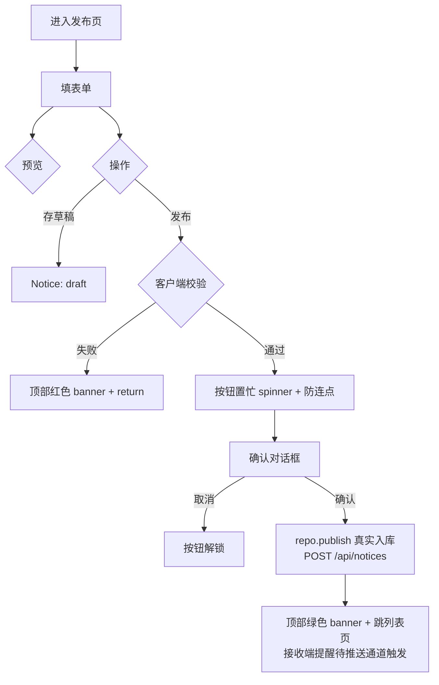

# 通知发布页

> 路由：`/notice/publish`（计划：`lib/features/notice/pages/notice_publish_page.dart`）· Phase 2
> 上层：[Phase2-人事端总览](Phase2-人事端总览.md) · 读端见 [通知列表页](通知列表页.md)

## 一、定位

hr 撰写并发布公司通知，指定可见范围（部门/工种/全员）、置顶、附件。是员工侧 [通知列表页](通知列表页.md) 的数据来源。

## 二、入口与导航
- 进入：hr 主导航「通知发布」；通知列表（hr 视角）「+发布」。
- 离开：发布 → 跳通知列表；存草稿 → 留本页。

## 三、响应式布局
- compact：单列表单 + 底部发布栏。
- medium / expanded：内容居中 ≤720dp；expanded 可左编辑右预览（双栏）。

```
┌────────────────────────────────┐
│ ← 发布通知           [预览]     │
├────────────────────────────────┤
│ 类型 [公告▼]  □ 置顶            │
│ 标题* [______________________] │
│ ┌──────────────────────────┐  │
│ │ 正文（多行富文本编辑）      │  │
│ │ …                        │  │
│ └──────────────────────────┘  │
│ 可见范围  ◉全员 ○按部门 ○按工种 │
│   [选部门: 生产部 质量部 ✕]    │  ← 按部门时显示
│ 附件  [📎 上传] 放假安排.pdf ✕  │
├────────────────────────────────┤
│ [存草稿]            [发布]      │
└────────────────────────────────┘
```

## 四、涉及的 Uten 组件
`UtenAppBar` / `UtenForm` / `UtenInput`（标题单行/正文多行）/ `UtenDropdown`（类型：公告/制度/福利/系统/紧急）/ `UtenSwitch`（置顶）/ `UtenSegmentedFilter`（可见范围：全员/部门/工种）/ `UtenDropdown`(多选部门/工种) / **`UtenActionButton`**（"存草稿" + "发布"——按钮自动管 loading-state + 防连点） / `UtenConfirmDialog`（发布确认） / **顶部 AppNotification**（替代底部 SnackBar 报错/提示成功）。

## 五、功能点
1. **类型**：5 种（复用 `NoticeType`），紧急类型强制红色高亮 + 推送通道提示。
2. **标题/正文**：标题必填；正文富文本（Phase 2 先纯文本多行，Phase 3 可升级富文本编辑器）。
3. **可见范围**：全员 / 指定部门 / 指定工种；选部门时多选部门树。
4. **置顶**：开关，置顶在员工列表顶部标「[置顶]」。
5. **附件**：多文件上传（Phase 2 先文件名，后端接入落地 `Attachment`）。
6. **预览**：弹层模拟员工端阅读样式。
7. **存草稿**：状态 draft，仅 hr 可见。**发布**：状态 published，按可见范围推送给员工。
8. 发布确认 `UtenConfirmDialog`「确认发布？将通知到 N 人」。

### 5.1「发布」按钮的完整交互时序

> 这是防连点 + 等待回执模式的真实例子，**禁止** 改成裸 async `onPressed`。

```text
用户点击「发布」
       ↓
[Phase A] 客户端校验（标题/正文）
       ↓ 失败 → 顶部红色 banner 提示 → return；按钮未置忙（未触发 onAction）
       ↓ 通过
[Phase B] UtenActionButton 进入置忙 → 按钮 spinner + "发布中…"，**禁掉重复点击**
       ↓
[Phase C] 弹确认对话框 showDialog<bool>() 异步等待
       ↓ 用户点「取消」→ onAction return → 按钮立刻解锁
       ↓ 用户点「发布」→ await resolve
[Phase D] 真实入库 `repo.publish(...)` → 后端 `POST /api/notices`
       ↓ 类型→重要度映射：紧急=urgent / 置顶=important / 其余=normal
       ↓ 发布人由后端取当前登录员工姓名快照（前端不再传 publisher）
[Phase D2] 失效刷新 `noticeListProvider` + `unreadNoticeCountProvider`
       ↓
[Phase D3] 顶部绿色 banner「已发布」
       ↓
[Phase D5] `context.go('/notice')` 跳列表页
       ↓
[Phase E] 按钮解锁
```

> 接收端逻辑收敛在 `lib/features/notice/providers/notice_arrival.dart`。
> 已接真后端：发布者本地不再模拟到达弹窗（旧 Phase D4 已删）；
> 接收端提醒由后端推送/WebSocket 在**每个接收端**触发 `dispatchNoticeArrival`（待接推送通道）。

业务侧只需要把 A→B→C→D 一整段写在 `UtenActionButton.onAction: () async {...}`，状态机的 busy / 防重入全交给按钮管。详见 [`ClickGuard & UtenActionButton` 组件文档 §9.2](../../02-组件库/ClickGuard与UtenActionButton.md)。

## 六、功能链路图


## 七、涉及的数据实体
`Notice`（标题/内容/类型/发布人/publishedAt/topPriority/可见范围/附件；后端表 `notices`，发布人 = 当前员工姓名快照）/ `Department`、`Position`（范围选择）/ `Attachment`。

## 八、权限要求
- `notice:publish`（角色体系下线后由部门配置 / 个人加授授予；超管全量）。
- 发布后不可改可见范围（避免已读状态错乱），可「撤回」重发。

## 九、边界情况
- 标题/正文空：阻断发布——客户端校验后顶部红色 banner 提示，按钮不进入置忙。
- 范围为空（按部门但没选）：阻断，提示选部门。
- 草稿丢失：自动本地暂存。
- 网络：发布须在线；草稿本地存。
- 性能档 lite：富文本降级为纯文本框。
- **快速连点「发布」5 次**：只触发 1 次请求（`UtenActionButton` 防连点），其余 4 次在 Phase B 被拦。

---

**最后更新**：2026-07-29 · **状态**：已接真后端（`POST /api/notices` 真实入库；发布人取当前员工姓名快照；本地模拟到达弹窗已删，接收端提醒待推送通道触发 `dispatchNoticeArrival`）
