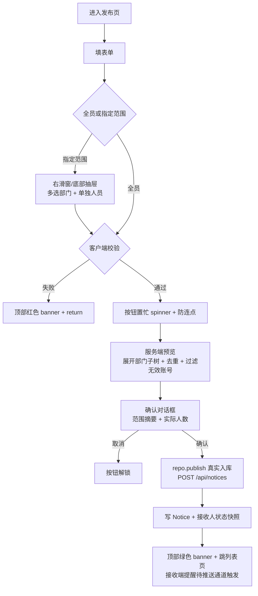

# 通知发布页

> 路由：`/notice/publish` · 实现源：`lib/features/notice/pages/notice_publish_page.dart`
> 上层：[Phase2-人事端总览](Phase2-人事端总览.md) · 读端见 [通知列表页](通知列表页.md)
> 2026-08-06 修复+增强（ADR-026）：①修「选祝福对象 A→取消→选 B，标题仍为 A」残留 bug——`_onCelebrationSubjectChanged` 用 `_titleAutoFilled`+`_autoFilledTitle` 追踪标题是否系统自动套入（用户未手改），改对象时覆盖、清空时一并清空，手改过则保留；②路由支持 `?subject=<员工id>`（`presetSubjectId`）预填祝福对象 + 模板 + 标题，供 HR 任务中心子页「每行送祝福」透传。

## 一、定位

有 `notice:publish` 权限的员工撰写公司通知，可发全员，或组合选择多个部门和多个具体人员。服务端发布时展开部门子树、与单独人员去重，并固化实际接收人快照。

## 二、入口与导航
- 进入：hr 主导航「通知发布」；通知列表（hr 视角）「+发布」。
- 离开：发布成功 → 跳通知列表；取消 → 返回上一页。

## 三、响应式布局
- compact：单列表单 + 底部发布栏。
- medium / expanded：内容区最大 1040dp，左侧编辑通知、右侧设置接收范围。

```
┌────────────────────┬────────────────────┐
│ 通知内容             │ 接收范围             │
│ 类型 [公告▼]         │ [全员] [指定范围]      │
│ 标题* [__________]  │                    │
│ ┌────────────────┐ │ 指定范围时：          │
│ │ 正文（多行纯文本） │ │ [选择多个部门 ▾]      │
│ │ …              │ │ [添加单独人员 ▾]      │
│ └────────────────┘ │ 已选 2 部门、3 人      │
│ □ 置顶              │ 发布前由服务端核算人数  │
└────────────────────┴────────────────────┘
│ [取消]                         [发布] │
└──────────────────────────────────────┘
```

## 四、涉及的 Uten 组件
当前页面使用 `UtenAppBar`、`UtenContentContainer`、`UtenCard`、`UtenSectionHeader`、
`UtenBottomActionBar`、`UtenActionButton` 和顶部通知；类型、置顶、范围选择暂用主题化 Material
控件，部门复用 `UtenDepartmentPicker.multi`，人员使用 `UtenEmployeeMultiPicker`。
发布确认暂用 `AlertDialog`。公共库已有 `UtenDialog`，后续可在回归测试覆盖后迁移。

## 五、功能点
1. **类型**：9 种（复用 `NoticeType`），由分组选择器 `NoticeTypePicker` 选择——
   - **公告广播** 5 种（announcement / policy / benefit / system / urgent，互动=点击收到）；紧急类型强制红色高亮 + 推送通道提示。
   - **庆典祝福** 4 种（birthday / anniversary / wedding / newborn，互动=送上祝福）；详见 §5.2。
2. **标题/正文**：标题必填；正文富文本（Phase 2 先纯文本多行，Phase 3 可升级富文本编辑器）。
3. **接收范围**：全员 / 指定范围；指定范围可同时多选部门与单独人员，平板/桌面复用右侧滑窗，手机使用底部抽屉。**庆典类强制全员**（所有人可送上祝福）。
4. **置顶**：开关，置顶在员工列表顶部标「[置顶]」。
5. **附件**：后端仍兼容附件文件名数组；人工发布页暂不开放上传，待统一 Attachment 上传链路后接入。
6. **接收人预览**：确认发布前调用 `/api/notices/audience/preview`，由服务端重算并显示去重后的实际人数。
7. **发布**：全员通知动态可见；指定范围通知将当时的接收账号写入 `notice_user_states`，人员以后调岗不改变历史可见性。
8. 发布确认当前为 `AlertDialog`，显示服务端返回的范围摘要与实际目标人数。

### 5.2 庆典祝福发布流（V224，ADR-025）

> 选庆典类型后，系统按对象自动填充标题 / 事件标签 / 祝福模板；也可由人事任务中心快捷入口（`/notice/publish?type=birthday` 等）透传 `presetType` 直接预填。

```text
选类型(birthday/anniversary/wedding/newborn)
   ↓ 显示「祝福对象」UtenEmployeePicker（必填）
选对象 → GET /api/notices/celebration/preview?employeeId=&type=
   ↓ 服务端读员工 birth_date/hire_date 派生 eventLabel（生日快乐/入职N周年/新婚快乐/喜添新丁）
   ↓ 返回 suggestedTitle + suggestedTemplates（{name}-only，与后端一致）
自动填标题(空时) + 模板策展 chips（发布者勾选要提供给送祝福者的模板，默认全选）
   ↓ 发布（POST /api/notices 带 subjectEmployeeId + blessingTemplates，audience 强制 all）
   ↓ 服务端 interaction_mode=bless，快照 subject_name/event_label
全员收到庆典通知 → 列表卡片「X 条祝福 · 送上祝福」/ 详情祝福墙
```

- **祝福模板占位符**：统一只用 `{name}`（送祝福时替换为对象名）；`eventLabel` 单独承载带年数文案。
- **快捷入口**：人事任务中心 `HrWorkbenchPage._quickNotice` 5 瓦片（发通知 / 生日 / 周年 / 新婚 / 新生儿），`hasPerm(notice:publish)` 显隐，`context.push('/notice/publish?type=...')`。

### 5.1「发布」按钮的完整交互时序

> 这是防连点 + 等待回执模式的真实例子，**禁止** 改成裸 async `onPressed`。

```text
用户点击「发布」
       ↓
[Phase A] 客户端校验（标题/正文）
       ↓ 失败 → 顶部红色 banner 提示 → return；按钮未置忙（未触发 onAction）
       ↓ 通过
[Phase B] UtenActionButton 进入置忙 → 按钮 spinner + "发布中…"，**禁掉重复点击**
       ↓
[Phase C] 弹确认对话框 showDialog<bool>() 异步等待
       ↓ 用户点「取消」→ onAction return → 按钮立刻解锁
       ↓ 用户点「发布」→ await resolve
[Phase D] 真实入库 `repo.publish(...)` → 后端 `POST /api/notices`
       ↓ 指定范围先 POST `/api/notices/audience/preview`
       ↓ 服务端展开部门子树 + 合并单独人员 + 去重 + 排除离职/停用账号
       ↓ 发布事务写通知本体和接收人快照
       ↓ 类型→重要度映射：紧急=urgent / 置顶=important / 其余=normal
       ↓ 发布人由后端取当前登录员工姓名快照（前端不再传 publisher）
[Phase D2] 失效刷新 `noticeListProvider` + `unreadNoticeCountProvider`
       ↓
[Phase D3] 顶部绿色 banner「已发布」
       ↓
[Phase D5] `context.go('/notice')` 跳列表页
       ↓
[Phase E] 按钮解锁
```

> 接收端逻辑收敛在 `lib/features/notice/providers/notice_arrival.dart`。
> 已接真后端：发布者本地不再模拟到达弹窗（旧 Phase D4 已删）；
> 接收端提醒由后端推送/WebSocket 在**每个接收端**触发 `dispatchNoticeArrival`（待接推送通道）。

业务侧只需要把 A→B→C→D 一整段写在 `UtenActionButton.onAction: () async {...}`，状态机的 busy / 防重入全交给按钮管。详见 [`ClickGuard & UtenActionButton` 组件文档 §9.2](../02-组件库/ClickGuard与UtenActionButton.md)。

## 六、功能链路图


## 七、涉及的数据实体
`Notice`（标题/内容/类型/发布人/publishedAt/topPriority/接收范围/附件；后端表 `notices`，发布人 = 当前员工姓名快照）/ `NoticeUserState`（指定范围接收人快照 + 已读/删除状态）/ `Department`、`Employee`、`User`。

## 八、权限要求
- `notice:publish`（角色体系下线后由部门配置 / 个人加授授予；超管全量）。
- 发布后不可修改接收范围（避免历史接收资格和已读状态错乱）；需更正时重新发布。

## 九、边界情况
- 标题/正文空：阻断发布——客户端校验后顶部红色 banner 提示，按钮不进入置忙。
- 指定范围为空：阻断，提示至少选择一个部门或人员。
- 部门与人员重复：服务端按 `users.id` 去重，只投递一次。
- 部门为空、人员离职/停用或账号失效：服务端拒绝并要求重新选择；选中范围无有效账号时不允许发布。
- 网络：接收人数预览和发布都须在线；正式发布时再次解析，避免预览后组织状态变化。
- 性能档 lite：富文本降级为纯文本框。
- **快速连点「发布」5 次**：只触发 1 次请求（`UtenActionButton` 防连点），其余 4 次在 Phase B 被拦。

---

**最后更新**：2026-07-30 · **状态**：已接真后端（V149 支持全员 / 多部门 + 多人员，服务端预览实际人数并固化接收人快照）
