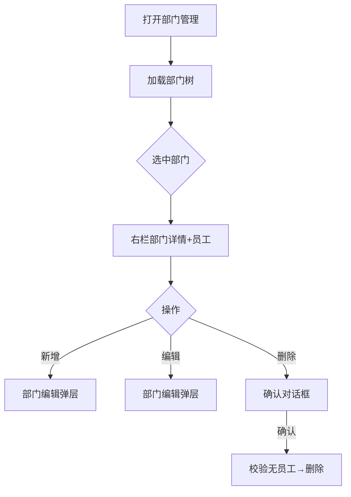

# 部门管理页

> 路由：`/department`（计划：`lib/features/department/pages/department_page.dart`）· Phase 2
> 上层：[Phase2-人事端总览](Phase2-人事端总览.md)

## 一、定位

hr 维护公司部门树（增删改、负责人、排序），是员工归属、工资条生成范围、通知发布范围的基础数据。

## 二、入口与导航
- 进入：hr 主导航「部门管理」。
- 离开：选部门 → 查看该部门员工（跳员工列表带部门筛选）。

## 三、响应式布局

**左树右表**模式。

- compact（手机）：部门树全屏（折叠面板式），点部门 → push 员工列表；增删改用底部弹层。
- medium / expanded（桌面）：
```
┌──────────────────────────────────────────────┐
│ 部门管理                       + 新增顶级部门   │
├──────────────┬───────────────────────────────┤
│ 🏢 优腾       │ 生产部（选中）                 │
│ ├ 生产部 ●   │ ┌──────────────────────┐      │
│ │ ├ 一车间   │ │ 编码 DEPT-PROD        │      │
│ │ └ 二车间   │ │ 上级 优腾             │      │
│ ├ 质量部     │ │ 负责人 李主管          │      │
│ ├ 人事部     │ │ 人数 48               │      │
│ └ 财务部     │ │ [编辑] [新增子部门] [删除]│      │
│              │ └──────────────────────┘      │
│              │ 该部门员工（UtenDataTable）    │
└──────────────┴───────────────────────────────┘
```

## 四、涉及的 Uten 组件
`UtenAppBar` / `UtenTreeView`（部门树，可展开/折叠/拖拽排序）/ `UtenCard` / `UtenInfoRow` / `UtenDataTable`（部门员工）/ `UtenButton` / `UtenConfirmDialog`（删除确认）/ `UtenEmpty`。

## 五、功能点
1. **部门树**：`UtenTreeView` 展示层级，支持展开/折叠、选中高亮、拖拽排序（仅 hr/admin）。
2. **部门详情**（右栏）：编码 / 名称 / 上级 / 负责人 / 人数 / 排序。
3. **新增**：顶级部门 / 子部门（选中父后「新增子部门」）。
4. **编辑**：名称/编码/上级（不能成环）/负责人。
5. **删除**：仅叶子部门且无员工可删；有员工提示「先转移员工」；`UtenConfirmDialog`。
6. **查看员工**：右栏下方 `UtenDataTable` 列该部门员工，点行跳员工详情。
7. manager 只读：树可浏览、不可增删改。

## 六、功能链路图


## 七、涉及的数据实体
`Department`（id / code / name / parentId / managerId / sortOrder / headcount）/ `Employee`（部门员工）。

## 八、权限要求
- 可见：hr / manager（只读）/ admin。
- 权限点：`department:view`（本页）/ `department:edit`（增删改）。
- 防成环：上级选择禁止选自己或子孙。

## 九、边界情况
- 无部门：树空态 `UtenEmpty`「尚未建立部门」+ 新增按钮。
- 删除有员工的部门：阻断 + 提示转移员工。
- 拖拽成环：前端校验禁止，Toast 提示。
- 性能档 lite：树去掉展开动画；拖拽改为「上移/下移」按钮。
- 网络：树结构本地缓存，离线只读不可改。

---

**最后更新**：2026-07-22 · **状态**：需求定稿
