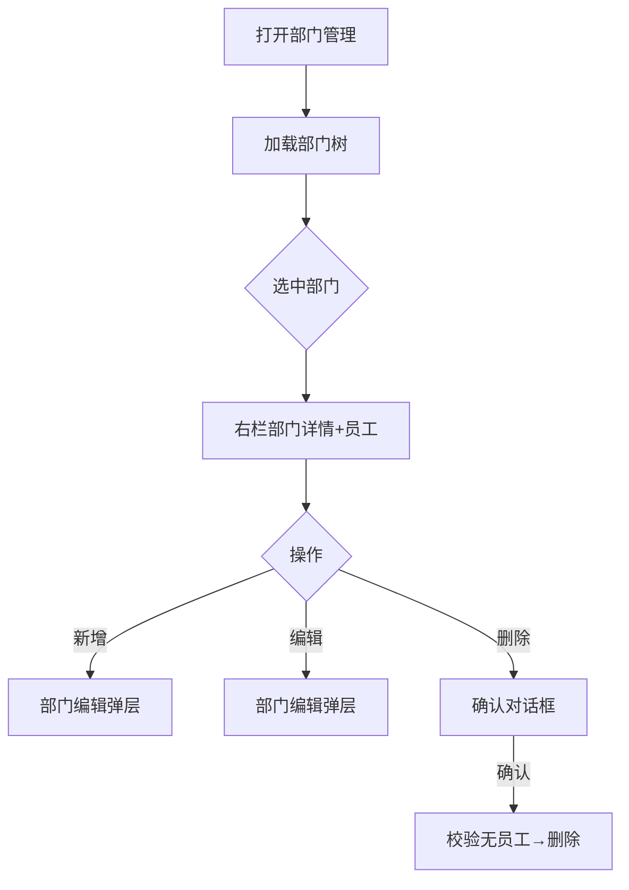

# 部门管理页

> 路由：`/department`（`lib/features/department/pages/department_page.dart`）· Phase 2
> 最近更新：2026-07-25 — **树点部门自动展开+选中**（`UtenDepartmentTreeView` 加 `expandOnRowTap`，对齐基础资料分类树）+ **员工列表加搜索**（标题行「图标+员工(N) \| 搜索 \| 添加」，搜索走后端 `EmployeeQueryService.list` 的 `search` 参数，子树范围模糊匹配姓名/工号）+ **点父部门显示全部子部门员工**（`includeSubtree: true`，无"仅叶子"限制）。
> 上层：[Phase2-人事端总览](Phase2-人事端总览.md)
> 最近更新：2026-07-23 — 新增**岗位管理**：一级部门/二级班组/三级科室节点旁徽章按钮打开岗位抽屉，HR 增删改岗位（编码/名称/职级带建议 chips 领导层·班组管理·员工/排序号），走 `POST|PUT|DELETE /api/org/positions*`（`department:edit` 守卫）；V24 迁移已为全部部级/组级节点播种模板岗位（部长/副部长/主管、组长/副组长/员工）。
> 组件化：左侧组织架构树 = 全站唯一共享组件 **`UtenDepartmentTreeView`**（`lib/features/department/widgets/uten_department_tree_view.dart`），与 `UtenDepartmentPicker` 抽屉内的树是同一套——搜索/层级标签/展开逻辑改一处全站生效；管理页通过 `trailingBuilder` 插槽挂人数/岗位徽章/编辑/删除按钮，`showCompanyRoot: true`（公司根与中间层可选中管理）。组织/岗位逻辑定稿见 [ADR-010](../99-决策记录-ADR/ADR-010-组织岗位模型与统一部门选择器.md)。
> 最近更新：2026-07-24 — **新增/编辑对话框重构**：新增/编辑部门改用共享 **`UtenLocationField`**（「添加位置」卡片 + 响应式抽屉选父级，见 [../02-组件库/UtenLocationField.md](../02-组件库/UtenLocationField.md)）；**去掉 level 下拉框，level 由所选父级自动推导**（公司/根→一级→二级→三级），杜绝旧版「下拉框随便选 level、却挂在任意父级下」的不一致（后端 `create/update` 信任前端 level）。**编辑能力落地**：树节点 trailing 加铅笔图标，可重命名 + 移动父级；移动时后端 `DepartmentService.update` **relevel 整棵子树**（按新父级重算 level，镜像分类逻辑）。

## 一、定位

hr 维护公司部门树（增删改、负责人、排序），是员工归属、工资条生成范围、通知发布范围的基础数据。

## 二、入口与导航
- 进入：hr 主导航「部门管理」。
- 离开：选部门 → 查看该部门员工（跳员工列表带部门筛选）。

## 三、响应式布局

**左树右表**模式。

- compact（手机）：部门树全屏（折叠面板式），点部门 → push 员工列表；增删改用底部弹层。
- medium / expanded（桌面）：
```
┌──────────────────────────────────────────────┐
│ 部门管理                       + 新增顶级部门   │
├──────────────┬───────────────────────────────┤
│ 🏢 优腾       │ 生产部（选中）                 │
│ ├ 生产部 ●   │ ┌──────────────────────┐      │
│ │ ├ 一车间   │ │ 编码 DEPT-PROD        │      │
│ │ └ 二车间   │ │ 上级 优腾             │      │
│ ├ 质量部     │ │ 负责人 李主管          │      │
│ ├ 人事部     │ │ 人数 48               │      │
│ └ 财务部     │ │ [编辑] [新增子部门] [删除]│      │
│              │ └──────────────────────┘      │
│              │ 该部门员工（UtenPersonCard）   │
└──────────────┴───────────────────────────────┘
```

## 四、涉及的 Uten 组件
`UtenAppBar` / `UtenDepartmentTreeView`（部门树，`expandOnRowTap` 点行展开+选中 / 搜索 / 选中高亮）/ `MasterDetailCard`（部门详情卡）/ `UtenPersonCard`（员工行）/ `UtenSearchBar`（员工标题行搜索）/ `UtenButton` / `UtenEmpty` / **`UtenLocationField` + `showUtenPickerSheet`**（新增/编辑对话框的「添加位置」卡片 + 抽屉选父级）。

## 五、功能点
1. **部门树**：`UtenDepartmentTreeView` 展示层级，`expandOnRowTap`——**点部门节点（有子部门）既展开又选中**（不必只点 chevron 图标）；搜索命中路径自动展开；选中高亮；trailing 挂人数/编辑/删除。
2. **部门详情**（右栏 `MasterDetailCard`）：编码 / 名称 / 上级 / 负责人 / 人数 / 排序 + 编辑 / 新增子部门 / 删除 / 岗位管理。
3. **新增**：app bar「+」打开对话框，顶部「添加位置」卡片选父级（响应式抽屉：手机底部 / 桌面右侧；仅一级/二级/三级可选，决策层/管理中心仅展开），**level 由父级自动推导并显示**（公司/根→一级 → 二级 → 三级）；编码 + 名称手填。
4. **编辑**：树节点 trailing 铅笔图标打开对话框，**重命名 + 移动父级**（同样卡片 + 抽屉，禁选自己/后代防成环；编辑模式不提供「顶级」，因后端 `parentId=null` 视为不改）。移动后后端 `relevelSubtree` 按新父级重算整棵子树 level。编码不可改；负责人/岗位在「岗位管理」抽屉维护。
5. **删除**：仅叶子部门且无员工可删；有员工提示「先转移员工」。
6. **员工列表**：右栏下方，标题行一行三件套「`Icon + 员工(N)` \| `UtenSearchBar`（搜索，子树范围模糊匹配姓名/工号）\| `添加员工`（仅一/二/三级部门）」；列表用 `UtenPersonCard` 渲染，**按子树汇总**（点父部门显示其全部后代部门员工，`includeSubtree: true`，无"仅叶子"限制），点行跳员工详情。搜索走后端 `GET /org/employees?departmentId=&includeSubtree=true&search=`。
7. manager 只读：树可浏览、不可增删改。

## 六、功能链路图


## 七、涉及的数据实体
`Department`（id / code / name / parentId / managerId / sortOrder / headcount）/ `Employee`（部门员工）。

## 八、权限要求
- 可见：hr / manager（只读）/ admin。
- 权限点：`department:view`（本页）/ `department:edit`（增删改）。
- 防成环：上级选择禁止选自己或子孙（前端 `nodeEnabledPredicate` + 后端 `isDescendant` 兜底）。
- **移动重算 level**：改父级时后端 `DepartmentService.update.relevelSubtree` 按新父级重算子树 level（一级→二级→三级），level 与父级永远一致。

## 九、边界情况
- 无部门：树空态 `UtenEmpty`「尚未建立部门」+ 新增按钮。
- 删除有员工的部门：阻断 + 提示转移员工。
- 拖拽成环：前端校验禁止，Toast 提示。
- 性能档 lite：树去掉展开动画；拖拽改为「上移/下移」按钮。
- 网络现状：部门树读取和修改均依赖在线连接；断网时明确报错。树结构本地缓存与离线只读属于目标能力，当前尚未实现。

---

**最后更新**：2026-07-30 · **状态**：已实现（Phase 2 + 编辑/移动 relevel + 树点行展开 + 员工搜索/子树汇总）· 树 `expandOnRowTap` + 员工标题行搜索（`UtenSearchBar`，子树范围）+ 点父部门显示全部后代员工；离线缓存待实现

## 十、2026-07-31 人员概况与权限入口

- 公司根与普通部门共用 `GET /api/org/departments/{id}/workforce-overview`，统计范围始终包含所选节点和全部下级。
- 概况卡分为三组：当前在册（正式/试用/休假/直属）、近 12 个月流动（入职/复职/离职/净变化/跨部门调动）、合同与试用期逾期及未来 30 天提醒。
- 离职率为 `离职事件数 ÷ ((期初在册 + 期末在册) / 2)`。任职事件缺失或流量守恒异常时接口返回空比率，页面显示 `—` 与数据质量说明。
- `compact/medium` 使用组织树抽屉和单列详情；`expanded` 才使用 300dp 左树右详情。右侧采用统一 `CustomScrollView`，统计、详情、搜索和员工列表不会在低高度窗口溢出。
- 部门负责人从本部门直属在册员工中选择并支持清空；负责人调离、离职或档案归档时，后端会原子清空旧负责人引用。
- 员工按“本部门负责人 → 领导层 → 班组管理 → 普通员工 → 工号”在数据库分页前排序，文字标识放在姓名前。
- 超级管理员且具备 `authorization:manage` 时显示“权限设置”，深链到 `/admin/permissions?departmentId=...`；统计卡还要求 `employee:view`。
- 搜索、切部门和加载更多使用请求代次保护；从员工详情或入职页返回后会刷新统计和员工列表。

**最后更新**：2026-07-31 · **状态**：公司/部门人员概况、负责人闭环、部门权限入口、领导优先分页和响应式统一滚动已实现。
