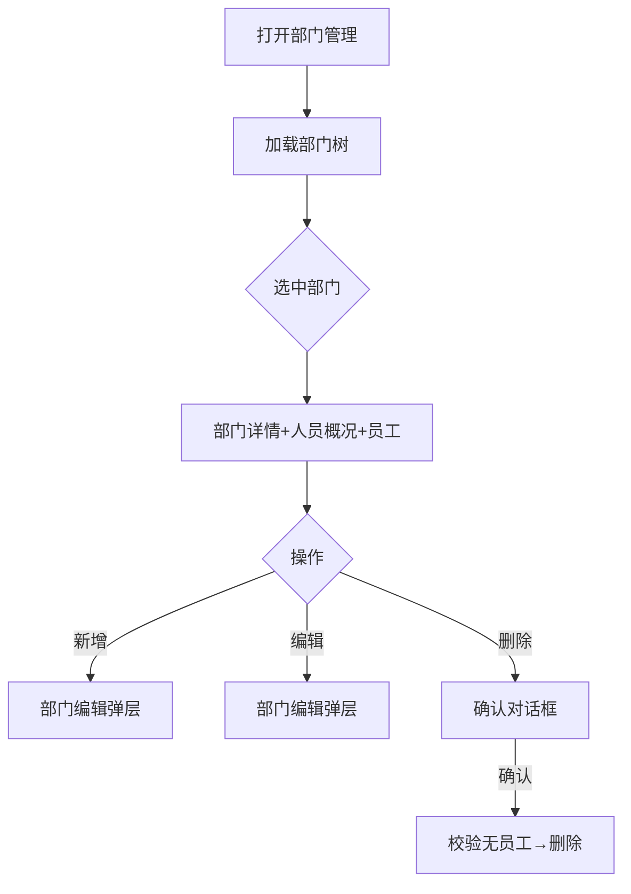

# 部门管理页

> 路由：`/department`（`lib/features/department/pages/department_page.dart`）· Phase 2
> 最近更新：2026-08-17 — **编辑部门保存后右栏详情自动重载**：`DepartmentOverviewPane` 原只按 `node.id` 变化重拉，编辑名称/负责人保存后树虽换新但 id 不变、详情卡停在旧数据；现树节点对象被整体替换（`!identical`）时也触发 `_load()`（重拉详情卡 + 人员总览 + 员工列表）。「岗位管理」抽屉关闭后静默重拉人员数据（岗位改名/增删会影响员工列表的岗位名展示）。回归测试 `test/features/department/pages/department_page_edit_refresh_test.dart`。
> 最近更新：2026-08-14 — 左树统一搜索同时匹配部门名称/编号与授权范围内员工姓名/工号；完整分页定位员工所属部门，展开祖先路径并驱动右侧同词结果。输入、手动点树和异步响应有代次保护；无 `employee:view` 时只执行部门节点搜索，不发员工接口。统一契约见 [UtenHierarchySearch](../02-组件库/UtenHierarchySearch.md)。
> 最近更新：2026-08-05 — **部门架构图 v2**（[ADR-021](../99-决策记录-ADR/ADR-021-人事域完善-转正车辆多联系方式与任务软认领.md) §七）：节点卡片化 + 引导线层级 + **负责人归入班组**（负责人即使档案挂在总经办，也在其负责节点内以「负责人」首行呈现，非直属标注「挂职」）+ 成员领导/班组管理徽章 + 节点折叠；**「打印花名册」「打印架构图」按新权限点 `employee:export` 门控（无权限隐藏）**，架构图查看仍 `employee:view`。
> 2026-08-02 新增：**「我的部门」**（任意员工只读本分支，独立于本管理页 `/department`；**2026-08-03 由工作台移植到「我的」页** `/profile/me/department`）+ **部门负责人权限转授面板**（仅负责人，ceiling = 本人有效 ∖ 全员基础）。
> 最近更新：2026-08-03 — **管理中心转为可用人组织**：可添加直属员工、岗位和本中心直属负责人；中心负责人可管理子孙部门的直属成员，但中心自身的上级位置仍锁定。详见 [ADR-020](../99-决策记录-ADR/ADR-020-入职工号岗位与管理中心用人语义.md)。
> 最近更新：2026-08-02 — **上级位置选择确认制**：分类/部门共用的位置滑窗改为“点节点暂存并勾选 → 取消/确定”；取消、关闭或点遮罩不改变编辑表单，确定后回填。管理中心可作为业务部门的上级位置，但中心自身的上级只读；员工归属通用选择器可选管理中心，公司/历史决策层仍禁选。
> 最近更新：2026-08-02 — **负责人选择器对象门禁**：公司/历史决策层不展示负责人选择器；管理中心和一级部门/二级班组/三级科室只能从本节点直属在册员工中选负责人。无直属候选时明确提示先添加或调入员工。
> 最近更新：2026-08-01 — **组织树拍平（V175）**：总经办降为「一级部门」，制造/营销/财税三中心从总经办下提到公司下。V206/ADR-020 进一步将三中心改为可用人但结构位置锁定的组织。
> 最近更新：2026-07-25 — **树点部门自动展开+选中**（`UtenDepartmentTreeView` 加 `expandOnRowTap`，对齐基础资料分类树）+ **员工列表加搜索**（标题行「图标+员工(N) \| 搜索 \| 添加」，搜索走后端 `EmployeeQueryService.list` 的 `search` 参数，子树范围模糊匹配姓名/工号）+ **点父部门显示全部子部门员工**（`includeSubtree: true`，无"仅叶子"限制）。
> 上层：[Phase2-人事端总览](Phase2-人事端总览.md)
> 最近更新：2026-07-23 — 新增**岗位管理**：管理中心、一级部门/二级班组/三级科室可维护本组织岗位，走 `POST|PUT|DELETE /api/org/positions*`（`department:edit` 守卫）；V206 为活动管理中心补“负责人/副负责人/专员”中性岗位，名称/职级不产生权限。
> 组件化：组织架构树统一使用 **`UtenDepartmentTreeView`**，并与 `UtenDepartmentPicker` 复用搜索、层级标签和展开逻辑；管理页树尾部只保留负责人提示与删除等轻量动作，编辑、岗位管理放在详情区（**部门级「权限设置」按钮已于 2026-08-03 下线**——成员权限转授改由「我的部门」页负责人面板承担，系统级权限仍在权限管理页 `/admin/permissions`）。`showCompanyRoot: true`，公司根与骨架节点可用于浏览统计，但业务动作按节点层级限制。组织/岗位逻辑见 [ADR-010](../99-决策记录-ADR/ADR-010-组织岗位模型与统一部门选择器.md)。
> 最近更新：2026-07-24 — **新增/编辑对话框重构**：新增/编辑部门改用共享 **`UtenLocationField`**（「添加位置」卡片 + 响应式抽屉选父级，见 [../02-组件库/UtenLocationField.md](../02-组件库/UtenLocationField.md)）；**去掉 level 下拉框，level 由所选父级自动推导**（公司/根→一级→二级→三级），杜绝旧版「下拉框随便选 level、却挂在任意父级下」的不一致（后端 `create/update` 信任前端 level）。**编辑能力落地**：树节点 trailing 加铅笔图标，可重命名 + 移动父级；移动时后端 `DepartmentService.update` **relevel 整棵子树**（按新父级重算 level，镜像分类逻辑）。

## 一、定位

本页按权限点维护公司部门树（增删改、负责人、排序），同时提供公司/部门人员统计和员工入口，是员工归属、工资条生成范围、通知发布范围的基础数据。

## 二、入口与导航
- 进入：具备 `department:view` 的账号从工作台进入「部门管理」。
- 离开：选部门 → 查看该部门员工（跳员工列表带部门筛选）。

## 三、响应式布局

**组织树选择 + 单列详情 / expanded 分栏**模式，首次进入默认选中公司根。

- compact / medium：页面显示单列详情，AppBar 的“组织架构”按钮打开响应式右侧抽屉选择节点。
- expanded：左侧组织树 + 右侧统一 `CustomScrollView`，中间分割线可左右拖动调宽（`UtenSplitView`，初始约 300dp、双击复位、宽度本地记忆，见 [UtenSplitView](../02-组件库/UtenSplitView.md)）；低高度窗口中概况、详情、搜索和员工列表共同滚动，不发生纵向溢出。
- 新增/编辑继续使用响应式弹层；手机从底部弹出，宽屏从右侧打开。

```text
┌──────────────┬────────────────────────────────────┐
│ 🔍部门/员工   │ 部门详情 → 人员概况（可收起）       │
│ 组织架构树    │ 同词员工结果 → 员工列表 → 加载更多  │
└──────────────┴────────────────────────────────────┘
```

## 四、涉及的 Uten 组件
`UtenAppBar` / `UtenSplitView` / `UtenDepartmentTreeView` / `DepartmentOverviewPane` / `MasterDetailCard` /
`OrganizationWorkforceOverviewCard` / `UtenPersonCard` / `EmployeeLeadershipBadge` / `UtenSearchBar` /
`UtenEmployeePicker` / `UtenLocationField` + `showUtenPickerSheet` / `UtenEmpty`。

## 五、功能点
1. **部门树统一搜索**：点有下级的节点同时展开并选中；一个左框匹配部门名称/编号和员工姓名/工号。具有 `employee:view` 时按右侧相同的在册状态口径逐页收集全部命中员工的 `departmentId`，补齐并展开祖先路径；没有该权限时只搜索部门，不触发 403。内容命中分支保留关键词，只命中部门时展示该部门全部员工；点击无关分支进入普通浏览。compact 正文与抽屉输入文本同步。
2. **部门详情**：展示编码、名称、上级、负责人、实时直属在册人数和排序；编辑、新增子部门、岗位管理及权限动作集中在详情卡。
3. **人员概况**：位于部门详情卡下方，默认收起并显示当前人员；展开后显示近 12 个月流动、到期提醒和数据质量。
   - 当前人数只统计未软删且状态为 `active/probation/onLeave` 的员工；直属人数只计算所选节点直属员工，其余指标包含全部下级。
   - 近 12 个月统计入职、复职、离职、净变化及跨范围调入/调出；父组织范围内部调岗相互抵消。
   - 离职率 = `离职事件数 ÷ ((期初在册 + 期末在册) / 2)`；任职历史缺失或反推期初人数异常时显示 `—` 和数据质量说明。
   - 合同/试用期分别显示已逾期、今天至未来 30 天到期；历史归属按当前部门树重述，组织后来移动会改变历史统计归属。
4. **新增/编辑**：level 由父级推导；业务部门实际移动时，后端在事务级组织树锁内防环，并以递归 CTE 同步整棵子树的 level/path。管理中心可作为业务部门的结构父级，自身的上级位置只读。管理中心与一级部门/二级班组/三级科室都可从本节点直属在册员工中选负责人；公司/历史决策层不可设置。岗位仍在独立岗位管理抽屉维护。
5. **负责人闭环**：负责人调岗、离职或归档时自动解除；后端拒绝把非本部门直属员工或离职员工设为负责人。
6. **添加员工**：管理中心和各级业务部门均显示入口；跳转 `/employee/onboarding?departmentId=...` 时预填完整组织节点，用户仍可在确认制选择器中改选。
7. **删除**：仅叶子部门且无员工可删；有员工提示先转移员工。
8. **员工列表**：调用 `GET /api/org/employees?departmentId=&includeSubtree=true&search=&statuses=active,probation,onLeave&page=&size=50`，仅展示在册/试用/请假并支持加载更多；统一定位使用相同状态集合，避免离职员工把树定位到右侧空结果。分页前按负责人、领导层、班组管理、普通员工和工号排序。
9. ~~**权限设置**~~（**2026-08-03 下线**）：原「仅业务部门层级、要求超级管理员且具备 `authorization:manage`、深链 `/admin/permissions?departmentId=...`」的部门级权限按钮已从本页移除——部门负责人对本部门成员的权限转授改在「我的部门」页（`/profile/me/department`，见 [我的页.md](我的页.md)）的负责人面板；系统级权限管理仍在权限管理页 `/admin/permissions`。

## 六、功能链路图


## 七、涉及的数据实体
`Department`（id / code / name / parentId / managerId / sortOrder；物理 `headcount` 不是展示权威）/
`Employee` / `Position` / `EmploymentHistory` / `WorkforceOverview`（查询读模型，非数据库表）。

## 八、权限要求
- `department:view`：进入页面和读取部门树；不再按 `hr/manager/admin` 角色名判断。
- `employee:view`：读取公司/部门人员概况和员工列表；概况接口要求 `department:view AND employee:view`。
- `department:edit`：新增、编辑、移动、负责人、岗位和删除。
- `employee:create`：在管理中心和各级业务部门显示“添加员工”，并将所选组织 ID 带到入职页预填。
- `employee:export`（V210 新增）：「打印花名册」与架构图弹层内「打印架构图」按该点显隐（文档下载独立授权，ADR-021 §五）。
- ~~`authorization:manage + superAdmin`：显示业务部门「权限设置」~~（2026-08-03 下线，部门级权限按钮已移除；权限管理走 `/admin/permissions`，成员权限转授走「我的部门」页）。
- 防成环与层级：前端禁止选择自己/后代、禁止移动组织骨架；后端用事务级锁关闭并发成环窗口，只在父级 ID 实际变化后以递归 CTE 重算整棵子树 level/path。

## 九、边界情况
- 无部门：树空态 `UtenEmpty`；有公司根时默认选中公司，避免详情区空白。
- 删除有员工的部门：阻断并提示先转移员工；可用人组织（含管理中心）无直属负责人候选时提示先添加或调入员工；公司/历史决策层不打开空选择器。
- 概况无权限时不发请求；概况失败不阻断部门详情和员工列表，可独立重试。
- 历史覆盖不完整时离职率显示 `—`，不得用零值掩盖；当前组织树重述历史是已知统计口径限制。
- 输入每个字符立即使旧定位失效，300ms 后才启动新查询；手动点部门会取消待执行防抖与在途定位。搜索、切部门、重新加载和加载更多均使用请求代次，旧响应不得覆盖新节点或造成永久加载状态。
- 从员工详情或入职页返回后刷新概况与员工列表。
- 网络现状：读取和修改依赖在线连接；断网明确报错。树缓存和离线只读尚未实现。
- 性能档 lite：树去掉展开动画。

## 十、「我的部门」（2026-08-02 新增；2026-08-03 由工作台移植到「我的」页，与 `/department` 管理页解耦）

本管理页要求 `department:view` 等编辑权限，**普通员工原来无法看到自己部门的全貌**。「我的部门」现位于「我的」页（快捷卡在「我的修改申请」之上，点进 `/profile/me/department` 全页面查看，详见 [我的页.md](我的页.md)），任意登录员工可见，定位为「看自己所在大部门」，**只读、无编辑入口**：

- **范围**：服务端 `MyDepartmentService.myBranchRoot` 计算员工所在大部门（管理中心 / 决策层分支）根节点；只能浏览本分支，不能跨部门查看。
- **左侧**：分支架构树（`UtenDepartmentTreeView`）；统一搜索仅使用本人授权分支的部门名称/编号和安全花名册姓名/工号，命中后展开祖先并以同词过滤右侧；大屏左右分屏，小屏抽屉选择，文本与状态一致。
- **右侧花名册**：响应记录共 10 字段，其中 `employeeId/departmentId` 是详情与树定位 ID；安全展示字段为工号 / 姓名 / 岗位 / 所属部门 / 办公电话 / 邮箱 / 是否负责人 / 是否本人。只返回 active/probation/onLeave，**不返回**证件、私人手机、薪酬等 PII/敏感字段（与 [安全策略.md §六](../05-架构/安全策略.md) 一致）。
- **端点**：`GET /api/my-department/tree`、`GET /api/my-department/roster?departmentId=`（任意已登录，服务端按本人分支鉴权）。

## 十一、部门负责人权限转授面板（仅负责人，2026-08-02 新增）

组织负责人（`department.manager_id`，数据驱动判定）在「我的部门」页（`/profile/me/department`）额外见成员权限面板。普通部门负责人只能选本部门；管理中心负责人可选中心或子孙部门，每次面板只列所选节点的直属在册成员。该面板不要求 `authorization:manage`，但不会凭中心层级自动增加权限。

### 11.1 转授上限（防越权升级，重点）

负责人可转授的权限上限 = **本人有效权限集 ∖ 全员基础权限**：

```
DepartmentStaffPermissionService.headCeilingCodes
  = PermissionResolver.breakdownOf(head).effective()
      − baselinePermissions()
```

即只转授「负责人自己持有的、非人人皆有的」权限点，**禁止把个人未持有的权限授予他人**（防越权升级）。DTO `DepartmentStaffPermissionsDto.PermissionItem` 加 `baseline` 字段区分两种来源：

| `baseline` 值 | 含义 | 默认开关 |
|---|---|---|
| `true` | 部门基线（全员基础或部门配置，人人皆有） | 默认 ON，不可由负责人关闭 |
| `false` | 负责人个人加授（来自本人有效权限） | 默认 OFF，可由负责人对单个成员开/关 |

### 11.2 端点

| 端点 | 谁可调用 | 说明 |
|---|---|---|
| `GET /api/department-staff-permissions/managed?departmentId=` | 目标部门负责人，或其管理中心负责人 | 列出所选节点直属成员 × 权限点矩阵（含 baseline 标记） |
| `PUT /api/department-staff-permissions/employees/{id}/overrides/{code}` | 当前部门负责人 | 写 `user_permission_overrides`，同时吊销目标 refresh token（依赖 V135 `auth_version/epoch`，旧 staff access 下一请求即 401） |

权限校验是**数据驱动**：普通负责人要求目标节点 `manager_id` = 当前员工；管理中心负责人要求目标节点的递归祖先中有本人负责的“管理中心”。岗位名称/职级不参与。端点不使用 `@PreAuthorize` 注解，服务端逐请求复查对象范围。

### 11.3 收回与本人保护

- **收回孤儿覆盖始终允许**：即便负责人本人已不再持有某权限点（如被超管回收），仍可清除成员现存的对应覆盖，防止「孤儿覆盖」永久滞留。
- **禁止修改本人覆盖**：负责人不能在自己的权限矩阵行上开关，防止自锁（把自己某权限关掉后再也打不开）。
- **基线不可改**：`baseline=true` 的权限点不显示开关（人人皆有，不允许负责人关闭他人基础权限）。

详见 [安全策略.md §四-4.6](../05-架构/安全策略.md) 部门负责人转授一节。

---

**最后更新**：2026-08-03 · **状态**：管理中心用人/岗位/负责人、中心负责人子树范围、入职组织预填与确认回填已接入源码；目标库 V206、运行实例重启、真实多账号/E2E 与离线缓存待验收。
