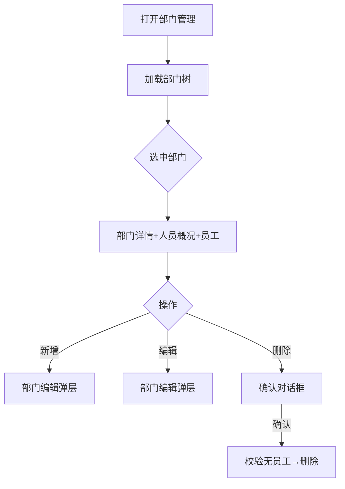

# 部门管理页

> 路由：`/department`（`lib/features/department/pages/department_page.dart`）· Phase 2
> 最近更新：2026-08-01 — **组织树拍平（V175）**：总经办从「决策层」骨架降为「一级部门」（可选，可挂人/岗位），制造/营销/财税三中心从总经办下提到公司（优腾电器）下，三中心下子部门层级不变；公司下现为平级 4 单位（总经办 + 三中心）。树视图/选择器/详情页均按 level 自适应，**无前端改动**（GM 落入 `kSelectableDepartmentLevels` 自动可选，三中心仍是 `kSkeletonDepartmentLevels` 骨架）。迁移绕开 `relevelSubtree` 直改 parent/level，并递归重算 path。
> 最近更新：2026-07-25 — **树点部门自动展开+选中**（`UtenDepartmentTreeView` 加 `expandOnRowTap`，对齐基础资料分类树）+ **员工列表加搜索**（标题行「图标+员工(N) \| 搜索 \| 添加」，搜索走后端 `EmployeeQueryService.list` 的 `search` 参数，子树范围模糊匹配姓名/工号）+ **点父部门显示全部子部门员工**（`includeSubtree: true`，无"仅叶子"限制）。
> 上层：[Phase2-人事端总览](Phase2-人事端总览.md)
> 最近更新：2026-07-23 — 新增**岗位管理**：一级部门/二级班组/三级科室节点旁徽章按钮打开岗位抽屉，HR 增删改岗位（编码/名称/职级带建议 chips 领导层·班组管理·员工/排序号），走 `POST|PUT|DELETE /api/org/positions*`（`department:edit` 守卫）；V24 迁移已为全部部级/组级节点播种模板岗位（部长/副部长/主管、组长/副组长/员工）。
> 组件化：组织架构树统一使用 **`UtenDepartmentTreeView`**，并与 `UtenDepartmentPicker` 复用搜索、层级标签和展开逻辑；管理页树尾部只保留负责人提示与删除等轻量动作，编辑、岗位管理和权限设置放在详情区。`showCompanyRoot: true`，公司根与骨架节点可用于浏览统计，但业务动作按节点层级限制。组织/岗位逻辑见 [ADR-010](../99-决策记录-ADR/ADR-010-组织岗位模型与统一部门选择器.md)。
> 最近更新：2026-07-24 — **新增/编辑对话框重构**：新增/编辑部门改用共享 **`UtenLocationField`**（「添加位置」卡片 + 响应式抽屉选父级，见 [../02-组件库/UtenLocationField.md](../02-组件库/UtenLocationField.md)）；**去掉 level 下拉框，level 由所选父级自动推导**（公司/根→一级→二级→三级），杜绝旧版「下拉框随便选 level、却挂在任意父级下」的不一致（后端 `create/update` 信任前端 level）。**编辑能力落地**：树节点 trailing 加铅笔图标，可重命名 + 移动父级；移动时后端 `DepartmentService.update` **relevel 整棵子树**（按新父级重算 level，镜像分类逻辑）。

## 一、定位

本页按权限点维护公司部门树（增删改、负责人、排序），同时提供公司/部门人员统计和员工入口，是员工归属、工资条生成范围、通知发布范围的基础数据。

## 二、入口与导航
- 进入：具备 `department:view` 的账号从工作台进入「部门管理」。
- 离开：选部门 → 查看该部门员工（跳员工列表带部门筛选）。

## 三、响应式布局

**组织树选择 + 单列详情 / expanded 分栏**模式，首次进入默认选中公司根。

- compact / medium：页面显示单列详情，AppBar 的“组织架构”按钮打开响应式右侧抽屉选择节点。
- expanded：左侧固定约 300dp 组织树，右侧为统一 `CustomScrollView`；低高度窗口中概况、详情、搜索和员工列表共同滚动，不发生纵向溢出。
- 新增/编辑继续使用响应式弹层；手机从底部弹出，宽屏从右侧打开。

```text
┌──────────────┬────────────────────────────────────┐
│ 组织架构树    │ 部门详情 → 人员概况（可收起）       │
│ 公司/部门     │ 员工搜索 → 员工列表 → 加载更多      │
└──────────────┴────────────────────────────────────┘
```

## 四、涉及的 Uten 组件
`UtenAppBar` / `UtenDepartmentTreeView` / `DepartmentOverviewPane` / `MasterDetailCard` /
`OrganizationWorkforceOverviewCard` / `UtenPersonCard` / `EmployeeLeadershipBadge` / `UtenSearchBar` /
`UtenEmployeePicker` / `UtenLocationField` + `showUtenPickerSheet` / `UtenEmpty`。

## 五、功能点
1. **部门树**：点有下级的节点同时展开并选中；搜索命中路径自动展开；切换节点会重置员工搜索和分页，并丢弃旧请求响应。
2. **部门详情**：展示编码、名称、上级、负责人、实时直属在册人数和排序；编辑、新增子部门、岗位管理及权限动作集中在详情卡。
3. **人员概况**：位于部门详情卡下方，默认收起并显示当前人员；展开后显示近 12 个月流动、到期提醒和数据质量。
   - 当前人数只统计未软删且状态为 `active/probation/onLeave` 的员工；直属人数只计算所选节点直属员工，其余指标包含全部下级。
   - 近 12 个月统计入职、复职、离职、净变化及跨范围调入/调出；父组织范围内部调岗相互抵消。
   - 离职率 = `离职事件数 ÷ ((期初在册 + 期末在册) / 2)`；任职历史缺失或反推期初人数异常时显示 `—` 和数据质量说明。
   - 合同/试用期分别显示已逾期、今天至未来 30 天到期；历史归属按当前部门树重述，组织后来移动会改变历史统计归属。
4. **新增/编辑**：level 由父级推导；移动时后端重算整棵子树。负责人从本部门直属在册员工中选择并可清空，岗位仍在独立岗位管理抽屉维护。
5. **负责人闭环**：负责人调岗、离职或归档时自动解除；后端拒绝把非本部门直属员工或离职员工设为负责人。
6. **删除**：仅叶子部门且无员工可删；有员工提示先转移员工。
7. **员工列表**：调用 `GET /api/org/employees?departmentId=&includeSubtree=true&search=&page=&size=50`，仅展示在册状态并支持加载更多；分页前按负责人、领导层、班组管理、普通员工和工号排序。
8. **权限设置**：仅业务部门层级显示，要求超级管理员且具备 `authorization:manage`，深链 `/admin/permissions?departmentId=...`；公司根和管理中心等骨架节点不显示。

## 六、功能链路图


## 七、涉及的数据实体
`Department`（id / code / name / parentId / managerId / sortOrder；物理 `headcount` 不是展示权威）/
`Employee` / `Position` / `EmploymentHistory` / `WorkforceOverview`（查询读模型，非数据库表）。

## 八、权限要求
- `department:view`：进入页面和读取部门树；不再按 `hr/manager/admin` 角色名判断。
- `employee:view`：读取公司/部门人员概况和员工列表；概况接口要求 `department:view AND employee:view`。
- `department:edit`：新增、编辑、移动、负责人、岗位和删除。
- `employee:create`：显示“添加员工”。
- `authorization:manage + superAdmin`：显示业务部门“权限设置”。
- 防成环与层级：前端禁止选择自己/后代，后端兜底并在移动后重算整棵子树 level/path。

## 九、边界情况
- 无部门：树空态 `UtenEmpty`；有公司根时默认选中公司，避免详情区空白。
- 删除有员工的部门：阻断并提示先转移员工；选择负责人候选为空或失败时保留可理解状态。
- 概况无权限时不发请求；概况失败不阻断部门详情和员工列表，可独立重试。
- 历史覆盖不完整时离职率显示 `—`，不得用零值掩盖；当前组织树重述历史是已知统计口径限制。
- 搜索、切部门、重新加载和加载更多使用请求代次；旧请求不得覆盖新节点或造成永久加载状态。
- 从员工详情或入职页返回后刷新概况与员工列表。
- 网络现状：读取和修改依赖在线连接；断网明确报错。树缓存和离线只读尚未实现。
- 性能档 lite：树去掉展开动画。

---

**最后更新**：2026-08-01 · **状态**：公司/部门人员概况、默认收起卡片、负责人闭环、部门权限入口、领导优先分页和响应式统一滚动已实现；离线缓存待实现。
