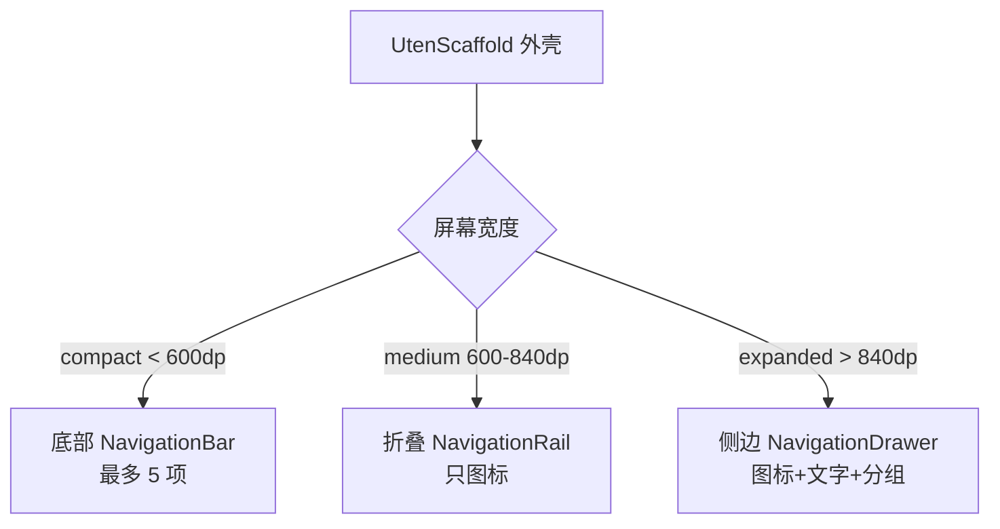
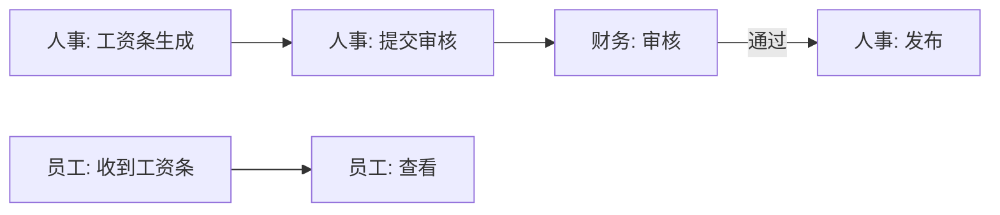

# 页面总览

> ⭐ **本档是项目的核心导航**。所有页面在此登记，每页一份独立文档。
> 新增页面必须在本档登记 + 在 `03-页面/` 下创建对应文档。

---

## 一、页面文档组织原则

- **一页一档**：每个页面一份 markdown，文件名 = 页面中文名
- **Page-driven**：以页面为单位组织，不按功能组织
- 每个页面文档记录：定位 / 入口 / 响应式布局 / 组件 / 功能点 / 功能链路图 / 涉及实体 / 权限 / 边界情况
- 页面变更 → 同步更新本档 + 该页文档

---

## 二、完整页面清单（按 Phase 分批）

### Phase 0 — 地基（必做）

| # | 页面 | 路由 | 文档 | 状态 |
|---|---|---|---|---|
| 1 | 登录页 | `/login` | [登录页.md](登录页.md) ⏳ | 文档待写 |
| 2 | App 外壳（导航容器） | `/` (ShellRoute) | [App外壳.md](App外壳.md) ⏳ | 文档待写 |
| 3 | 工作台首页 | `/dashboard` | [工作台首页.md](工作台首页.md) ⏳ | 文档待写 |
| 4 | 设置页 | `/settings` | [设置页.md](设置页.md) ⏳ | 文档待写 |

### Phase 1 — 全员可用

| # | 页面 | 路由 | 文档 | 状态 |
|---|---|---|---|---|
| 5 | 我的 / 个人资料 | `/profile` | [我的页.md](我的页.md) ⏳ | 文档待写 |
| 6 | 工资条列表 | `/payroll/slip` | [工资条列表页.md](工资条列表页.md) ⏳ | 文档待写 |
| 7 | 工资条详情 | `/payroll/slip/:id` | [工资条详情页.md](工资条详情页.md) ⏳ | 文档待写 |
| 8 | 报销申请列表 | `/expense` | [报销列表页.md](报销列表页.md) ⏳ | 文档待写 |
| 9 | 新建报销 | `/expense/new` | [新建报销页.md](新建报销页.md) ⏳ | 文档待写 |
| 10 | 报销详情 | `/expense/:id` | [报销详情页.md](报销详情页.md) ⏳ | 文档待写 |
| 11 | 公司通知列表 | `/notice` | [通知列表页.md](通知列表页.md) ⏳ | 文档待写 |
| 12 | 通知详情 | `/notice/:id` | [通知详情页.md](通知详情页.md) ⏳ | 文档待写 |
| 13 | 建议箱 | `/suggestion` | [建议箱页.md](建议箱页.md) ⏳ | 文档待写 |

> 📐 **Phase 1 列表页布局统一为卡片瀑布流**：工资条列表、报销列表、通知列表、建议箱 4 个列表页均已从 `ListView`（横向长条项）改造为 `UtenResponsiveGrid` 卡片瀑布流网格，每条记录渲染为竖版 `UtenCard`（不再是横向长条 `UtenListItem`）。
>
> - 列数按**父容器实际宽度**自适应（非屏幕宽度）：`<500px=1 列` / `500-800=2 列` / `800-1100=3 列` / `1100-1500=4 列` / `>1500=5 列`，概括为**手机 1 列 / 平板 2-3 列 / 桌面 3-5 列**。
> - [报销详情页](报销详情页.md) 的明细项同样改成了 `UtenResponsiveGrid` 瀑布流网格。
> - 4 个列表页的卡片结构见各自文档第三节"响应式布局"。

### Phase 2 — 人事端

| # | 页面 | 路由 | 文档 | 状态 |
|---|---|---|---|---|
| 14 | 员工档案列表 | `/employee` | [员工列表页.md](员工列表页.md) ⏳ | 文档待写 |
| 15 | 员工详情 | `/employee/:id` | [员工详情页.md](员工详情页.md) ⏳ | 文档待写 |
| 16 | 新增/编辑员工 | `/employee/new`、`/employee/:id/edit` | [员工编辑页.md](员工编辑页.md) ⏳ | 文档待写 |
| 17 | 部门树 | `/department` | [部门管理页.md](部门管理页.md) ⏳ | 文档待写 |
| 18 | 入职流程 | `/employee/onboarding` | [入职流程页.md](入职流程页.md) ⏳ | 文档待写 |
| 19 | 离职流程 | `/employee/:id/offboarding` | [离职流程页.md](离职流程页.md) ⏳ | 文档待写 |
| 20 | 工资条生成 | `/payroll/generate` | [工资条生成页.md](工资条生成页.md) ⏳ | 文档待写 |
| 21 | 通知发布 | `/notice/publish` | [通知发布页.md](通知发布页.md) ⏳ | 文档待写 |

### 访客系统（前后端打通）

> 详见 [访客预约系统.md](访客预约系统.md)。外部访客来访闭环：入口选择 → 手机验证码预约 → HR 审批 → 签名二维码 → 保安扫码核验。

| # | 页面 | 路由 | 角色 |
|---|---|---|---|
| 22 | 入口选择页 | `/entry` | 登录前 |
| 23 | 访客登录 | `/visitor/login` | 访客 |
| 24 | 访客首页（我的预约） | `/visitor/home` | 访客 |
| 25 | 来访预约表单 | `/visitor/apply` | 访客 |
| 26 | 访客预约详情（含二维码） | `/visitor/apply/:id` | 访客 |
| 27 | 访客审批列表 | `/visitor-approval` | HR |
| 28 | 访客审批详情 | `/visitor-approval/:id` | HR |
| 29 | 我的访客（被访人确认） | `/my-visitors` | 员工 |
| 30 | 保安扫码核验 | `/security/scan` | 保安 |

### Phase 3 — 财务端

| # | 页面 | 路由 | 文档 | 状态 |
|---|---|---|---|---|
| 22 | 报销审批列表 | `/expense/approval` | [报销审批列表页.md](报销审批列表页.md) ⏳ | 文档待写 |
| 23 | 报销审批详情 | `/expense/approval/:id` | [报销审批详情页.md](报销审批详情页.md) ⏳ | 文档待写 |
| 24 | 工资条审核 | `/payroll/review` | [工资条审核页.md](工资条审核页.md) ⏳ | 文档待写 |
| 25 | 财务报表 | `/finance/report` | [财务报表页.md](财务报表页.md) ⏳ | 文档待写 |

### Phase 4 — 生产/实验室

| # | 页面 | 路由 | 文档 | 状态 |
|---|---|---|---|---|
| 26 | 实验室检测上传 | `/lab/test/upload` | [检测上传页.md](检测上传页.md) ⏳ | 文档待写 |
| 27 | 检测记录列表 | `/lab/test` | [检测列表页.md](检测列表页.md) ⏳ | 文档待写 |
| 28 | 检测报告详情 | `/lab/test/:id` | [检测报告页.md](检测报告页.md) ⏳ | 文档待写 |
| 29 | 空调设备总览 | `/hvac` | [空调总览页.md](空调总览页.md) ⏳ | 文档待写 |
| 30 | 空调设备详情/控制 | `/hvac/:id` | [空调控制页.md](空调控制页.md) ⏳ | 文档待写 |
| 31 | 流水线进度看板 | `/production/line` | [流水线看板页.md](流水线看板页.md) ⏳ | 文档待写 |
| 32 | 产量录入 | `/production/output/entry` | [产量录入页.md](产量录入页.md) ⏳ | 文档待写 |
| 33 | 产量统计 | `/production/output` | [产量统计页.md](产量统计页.md) ⏳ | 文档待写 |
| 34 | 库存查询 | `/inventory` | [库存列表页.md](库存列表页.md) ⏳ | 文档待写 |
| 35 | 出入库记录 | `/inventory/movement` | [出入库记录页.md](出入库记录页.md) ⏳ | 文档待写 |

### Phase 5 — 管理层

| # | 页面 | 路由 | 文档 | 状态 |
|---|---|---|---|---|
| 36 | 经营 Dashboard | `/analytics/dashboard` | [经营Dashboard页.md](经营Dashboard页.md) ⏳ | 文档待写 |
| 37 | 多维分析 | `/analytics/explore` | [多维分析页.md](多维分析页.md) ⏳ | 文档待写 |
| 38 | 异常告警 | `/analytics/alerts` | [异常告警页.md](异常告警页.md) ⏳ | 文档待写 |

---

## 三、入口地图（导航结构）

### 3.1 响应式导航



### 3.2 导航分组（按角色）

> 同一个 App，不同角色看到的导航项不同。详见权限矩阵。

**默认导航（员工角色能看到）**：

| 分组 | 项目 |
|---|---|
| 主导航 | 工作台、我的工资条、我的报销、通知 |
| 次导航 | 建议箱、我的 |
| 底部固定 | 设置 |

**人事角色追加**：

| 分组 | 项目 |
|---|---|
| 人事管理 | 员工档案、部门、入离职、工资条生成、通知发布 |

**财务角色追加**：

| 分组 | 项目 |
|---|---|
| 财务管理 | 报销审批、工资条审核、财务报表 |

**实验室/车间角色追加**：

| 分组 | 项目 |
|---|---|
| 生产管理 | 实验室检测、空调控制、流水线、产量、库存 |

**管理层角色追加**：

| 分组 | 项目 |
|---|---|
| 决策支持 | 经营 Dashboard、多维分析、异常告警 |

---

## 四、权限矩阵

### 4.1 角色定义

| 角色 code | 中文名 | 说明 |
|---|---|---|
| `employee` | 普通员工 | 默认角色，看自己的数据 |
| `hr` | 人事 | 管理员工档案、部门、工资条生成 |
| `finance` | 财务 | 报销审批、工资条审核、报表 |
| `lab` | 实验室 | 检测数据 |
| `production` | 车间 | 流水线、产量、库存 |
| `manager` | 管理层 | 看全部数据的只读 + Dashboard |
| `admin` | 系统管理员 | 全部权限 + 用户管理 |

> 一个用户可以有多个角色（如某员工既是 `employee` 又是 `lab`）。

### 4.2 页面权限矩阵

| 页面 | employee | hr | finance | lab | production | manager | admin |
|---|---|---|---|---|---|---|---|
| 工作台 | ✅ | ✅ | ✅ | ✅ | ✅ | ✅ | ✅ |
| 我的工资条 | ✅ 自己 | ✅ 全员 | ✅ 自己 | ✅ 自己 | ✅ 自己 | ✅ 自己 | ✅ |
| 我的报销 | ✅ 自己 | ✅ 自己 | ✅ 自己 | ✅ 自己 | ✅ 自己 | ✅ 自己 | ✅ |
| 通知 | ✅ 读 | ✅ 读 | ✅ 读 | ✅ 读 | ✅ 读 | ✅ 读 | ✅ |
| 建议箱 | ✅ 自己 | ✅ 自己 | ✅ 自己 | ✅ 自己 | ✅ 自己 | ✅ 自己 | ✅ |
| 员工档案 | ❌ | ✅ | ❌ | ❌ | ❌ | ✅ 只读 | ✅ |
| 部门管理 | ❌ | ✅ | ❌ | ❌ | ❌ | ✅ 只读 | ✅ |
| 工资条生成 | ❌ | ✅ | ✅ 审核 | ❌ | ❌ | ✅ 只读 | ✅ |
| 报销审批 | ❌ | ❌ | ✅ | ❌ | ❌ | ✅ 只读 | ✅ |
| 财务报表 | ❌ | ❌ | ✅ | ❌ | ❌ | ✅ 只读 | ✅ |
| 检测上传 | ❌ | ❌ | ❌ | ✅ | ❌ | ✅ 只读 | ✅ |
| 检测列表 | ❌ | ❌ | ❌ | ✅ | ❌ | ✅ 只读 | ✅ |
| 空调控制 | ❌ | ❌ | ❌ | ❌ | ✅ | ✅ 只读 | ✅ |
| 流水线 | ❌ | ❌ | ❌ | ❌ | ✅ | ✅ 只读 | ✅ |
| 产量 | ❌ | ❌ | ❌ | ❌ | ✅ | ✅ 只读 | ✅ |
| 库存 | ❌ | ❌ | ❌ | ❌ | ✅ | ✅ 只读 | ✅ |
| 经营 Dashboard | ❌ | ❌ | ❌ | ❌ | ❌ | ✅ | ✅ |

### 4.3 前端权限处理规则

- **隐藏而非禁用**：没权限的菜单/按钮直接 `hide`，不要 `disable`（disable 反而暴露功能存在）
- **后端必须校验**：前端隐藏只是体验优化，**后端必须独立校验权限**（真相在后端）
- **路由守卫**：未授权访问受保护路由 → 跳工作台或 403 页

---

## 4.4 管理视角上下文选择器（✅ 已定稿）

> **完整设计见 [全局机制.md §二](../05-架构/全局机制.md#二管理视角上下文选择器viewcontextprovider)**。
>
> 用户需求：领导层/人事 能在"全公司/某部门/某个员工"之间切换视角，
> 选中后相关页面的数据按此上下文过滤；普通员工只能看自己。
>
> **定稿要点**：全局 `ViewContextProvider` + AppBar 右侧 `UtenViewContextSelector`（按角色显隐）；
> 默认 self、持久化记忆、角色降级校验；跟随页面矩阵见全局机制文档。

### 交互设计

```
┌────────────────────────────────────────┐
│ [全公司 ▼]  ← 顶部全局选择器              │  ← 仅 hr/finance/manager/admin 可见
├────────────────────────────────────────┤
│  选中"生产部"后：                        │
│  - Dashboard KPI → 生产部的产量/库存     │
│  - 工资条列表 → 生产部所有人的工资条      │
│  - 报销列表 → 生产部所有人的报销          │
│  - 通知 → 发给生产部的通知               │
└────────────────────────────────────────┘
```

### 选择器粒度

| 选项 | 说明 | 可见角色 |
|---|---|---|
| 我自己 | 只看自己的数据（默认） | 全员 |
| 某部门 | 看该部门所有人的汇总数据 | hr / finance / manager / admin |
| 某员工 | 下钻到具体某个员工 | hr / finance / manager / admin |
| 全公司 | 看全员汇总 | manager / admin |

### 权限规则（按角色区分）

| 角色 | 能选的上下文 | 数据范围 |
|---|---|---|
| employee | 仅"我自己" | 只看自己 |
| hr | 我自己 / 某部门 / 某员工 | 员工档案、工资条生成 |
| finance | 我自己 / 某部门 / 某员工 | 报销审批、工资条审核 |
| manager | 我自己 / 某部门 / 某员工 / 全公司 | 全部只读 |
| admin | 全部 | 全部读写 |

### 技术实现（规划）

1. **全局 `ViewContextProvider`**（Riverpod）：保存当前选中的"部门 ID / 员工 ID / 自己"，所有列表 Provider watch 它
2. **顶部选择器组件**：AppBar 右侧下拉，按角色显示可选范围
3. **数据过滤**：Repository 层接收 `viewContext` 参数，Mock 阶段本地过滤，后端接入后传给 API
4. **权限守卫**：前端校验选择权限（员工选"某部门"会被拒），后端二次校验

### 相关页面影响

| 页面 | 是否跟随上下文 | 说明 |
|---|---|---|
| Dashboard | ✅ | KPI 按选中范围汇总 |
| 工资条列表 | ✅ | 按选中范围列出工资条 |
| 报销列表 | ✅ | 按选中范围列出报销 |
| 通知列表 | ❌ | 通知是发给"角色/全员"，不按部门过滤 |
| 建议箱 | 部分 | "我的建议"不变；"建议广场"可按部门筛 |
| 员工档案（Phase 2） | ✅ | 直接按部门/员工展示 |

---

## 五、页面流转图（关键流程）

### 5.1 登录到工作台


### 5.2 报销全流程（跨角色）


### 5.3 工资条生成流程



---

## 六、页面文档统一模板

每个页面文档按以下结构写：

```markdown
# [页面名]

## 一、定位
给谁用 / 解决什么问题 / 在产品中的位置

## 二、入口与导航
- 进入路径：从哪里点进来
- 在导航中的位置：主导航/次导航/角色专属
- 离开去向：常见下一步

## 三、响应式布局
- compact（手机）：草图 + 说明
- medium（平板）：草图 + 说明
- expanded（桌面）：草图 + 说明

## 四、涉及的 Uten 组件
列出用到的组件名

## 五、功能点
1. xxx
2. xxx

## 六、功能链路图
mermaid 流程图（如 5.x）

## 七、涉及的数据实体
→ 见 [04-数据模型/实体字典.md](../04-数据模型/实体字典.md)#实体名

## 八、权限要求
- 哪些角色可访问
- 数据范围（自己/部门/全员）
- 关键操作权限点

## 九、边界情况
- 无数据时
- 加载失败时
- 性能档 = lite 下的表现
- 网络断开时
```

---

## 七、页面进度看板

| Phase | 计划页面数 | 已完成文档 | 已实现 UI |
|---|---|---|---|
| 0 地基 | 4 | 4 | 4 |
| 1 全员 | 9 | 9 | 9 |
| 2 人事 | 8 | 8 | 0 |
| 3 财务 | 4 | 4 | 0 |
| 4 生产 | 10 | 10 | 0 |
| 5 管理层 | 3 | 3 | 0 |
| **合计** | **38** | **38** | **13** |

---

**最后更新**：2026-07-21
