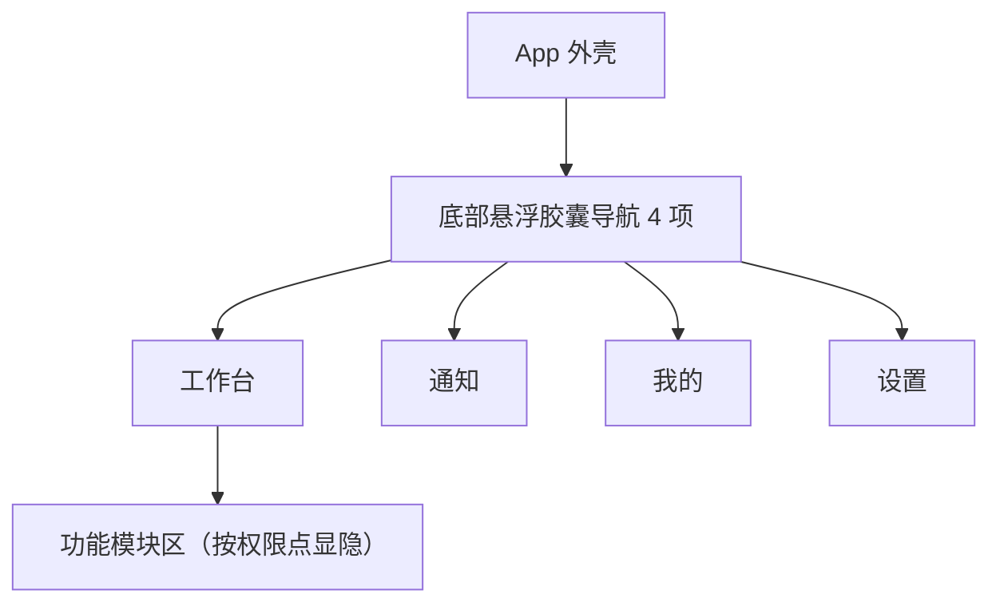
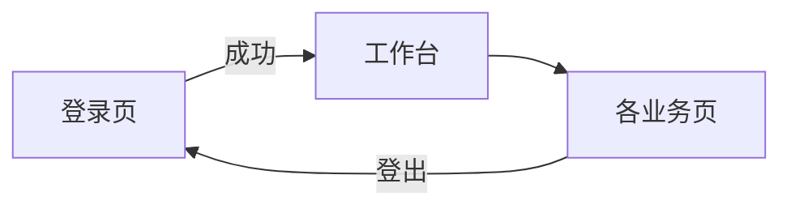
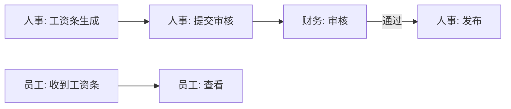

# 页面总览

> ⭐ **本档是项目的核心导航**。所有页面在此登记，每页一份独立文档。
> 新增页面必须在本档登记 + 在 `03-页面/` 下创建对应文档。

> 📍 **现状（2026-08-14）**：核心业务多数使用真实后端；工资与员工报销活动 Mock 已移除、
> V133 表、真实 API 与固定状态机已有源码，业务口径和生产 E2E 待验收。实验室检测与空调控制暂无页面、路由或后端，
> 工作台仅保留不可点击的“功能规划接入中”占位，不得计为已实现功能。
> 页面存在只说明 UI/路由存在，不代表数据库/API 已生产完成。
>
> **2026-08-27 人员自助与权限交互同步**：`/profile` 已改用不接受目标员工 ID 的
> `GET /api/profile/me`，以当前账号绑定档案为唯一对象，补齐身份/组织/联系/合同/任职信息并标注
> “可直接修改 / 需 HR 审核 / 请联系人事修改”；薪酬和银行不因本人范围自动展示。各业务页
> `/page-permissions/:surfaceKey` 与工作台账号支持入口均明确显示未开户状态，只有当前操作者真实持有
> `account:support` 才询问并执行开户，负责人身份与 `authorization:manage` 均不替代该权限。
>
> **2026-08-27 订货表头与员工选择统一**：销售/采购/委外三类订货单的结账/结算方式在
> Flutter 新建/编辑页统一为必填，空值显示红色 `*`、错误色边框并阻止保存；收货/退货等下游单据
> 保留来源快照兼容。员工选择主行与已选值统一为 `姓名(工号)`，部门位于副行。详见
> [订货单公共表头规范](订货单公共表头规范.md)与
> [UtenEmployeePicker](../02-组件库/UtenEmployeePicker.md)。
> 公司目标库仍保留 V238 既有只读证据并须发布前复核；当前共享工作树迁移目录已到 V451/413，413 个唯一版本且无重号。生产核心执行/FQC/仓库点收为 V409–V415，V418 补全零拒收重交，V419 补到货创建幂等。V277/V278 收紧财务 UUID，V279 建立全局业务标识，V282/V284/V286/V287 是窄范围 PII 迁移链，V285 收紧客户默认结算 UUID，V290/V291 补销售物流单号与退货处置纠错，V292 清洗来源单号可读化，V293 补 IQC 权限；V288/V289 已形成生产物料分析现货借用结构、终态守卫、审计与在线源码候选，但尚未迁移目标库或完成真实岗位 UAT。这些都**不是生产默认车间迁移**。生产默认车间仍只有 V192 `production_goods_workshop_preferences` 一份权威来源，生产物料分析的一次性隔离克隆仍是 V250/231 历史证据。本地/云端部署证据和剩余工作以
> [2026-08-09 本地云端部署与生产就绪清单](../99-项目治理/2026-08-09-本地云端部署与生产就绪清单.md)为准。
> 销售—仓库—计划—生产/采购/委外的当前边界与阻断项以
> [2026-08-01 全链路安全复核报告](../99-项目治理/2026-08-01-销售仓库生产采购委外全链路安全复核报告.md)为准；
> [生产就绪审计报告](../99-项目治理/2026-07-30-生产就绪审计报告.md)保留历史发布审计，资产与待摊以
> [2026-08-01 专项验收报告](../99-项目治理/2026-08-01-资产与待摊全链路实现与验收报告.md)为准，
> 当前为默认门禁关闭的安全骨架，完整生命周期 **NO-GO**。
>
> **采购/委外财务链现行口径**（V196–V202 引入，V229/ADR-027 改共享审核组，V328 拆分动作权限；V292/ADR-038 撤销订货仓库）：计划下达申请，采购/委外端申请只读；任务中心跨申请选行、部分分解，一单一供应商/委外商。订货保存后进入 `finance_order_approval:view` 共享队列；批准/驳回分别要求 `:approve` / `:reject` 与实时审核资格，只有合法批准才 `status=1` 并形成预计到货。业务详情始终只读，决定仅在财务任务中心用 `{caseId,expectedVersion}` batch 协议执行；旧单笔路径 fail-closed。超量在财务决定前不写库存/AP，批准量仍由仓库再审，未批量只交原下单人退回。公司目标库、真实岗位/实物 UAT、完整质量链和发布签字仍需独立验收，生产 **NO-GO**。详见[生产履约任务工作台](生产履约任务工作台.md)与[ADR-027](../99-决策记录-ADR/ADR-027-财务审批改为权限授权的审核组.md)。


---

## 一、页面文档组织原则

- **一页一档**：每个页面一份 markdown，文件名 = 页面中文名
- **Page-driven**：以页面为单位组织，不按功能组织
- 每个页面文档记录：定位 / 入口 / 响应式布局 / 组件 / 功能点 / 功能链路图 / 涉及实体 / 权限 / 边界情况
- 页面变更 → 同步更新本档 + 该页文档

---

## 二、完整页面清单（按 Phase 分批）

### Phase 0 — 地基（必做）

| # | 页面 | 路由 | 文档 | 状态 |
|---|---|---|---|---|
| 1 | 登录页 | `/login` | [登录页.md](登录页.md) | 🟡 真实鉴权与 local/cloud 门禁已接、隔离 HTTP 已测；待目标网络/多端 E2E |
| 2 | App 外壳（导航容器） | `/` (ShellRoute) | [App外壳.md](App外壳.md) ✅ | v4 — 悬浮胶囊导航；原生本地优先/Web 同源 |
| 3 | 工作台首页 | `/dashboard` | [工作台首页.md](工作台首页.md) ✅ | v4 — 功能集散中心 |
| 4 | 设置页 | `/settings` | [设置页.md](设置页.md) | 🟡 可信服务器项、偏好/改密/真实退出已接；待 Release 端点/网络/多端 E2E |

### Phase 1 — 全员可用

| # | 页面 | 路由 | 文档 | 状态 |
|---|---|---|---|---|
| 5 | 我的 / 个人资料 | `/profile` | [我的页.md](我的页.md) ✅ | v7 — 档案区 Tab 化（对齐员工详情页范式）；车辆/备用号与我的文件吸收为 Tab；返回导航恒回"我的" |
| 5a | 修改我的信息 | `/profile/edit` | [我的页.md §A](我的页.md) ✅ | 业务分组表单；直接生效/需审核/人事维护；提交前真实校验 |
| 5b | 我的修改申请 | `/profile/me/changes` | [我的页.md §A](我的页.md) ✅ | 本人申请记录、状态与撤销 |
| 5c | 我的部门 | `/profile/me/department` | [我的页.md §四·甲](我的页.md) | 🟡 本人分支安全树/花名册与统一关联搜索源码候选已接；待多账号权限与岗位 UAT |
| 5d | 我的车辆与号码 | （v7 吸收为 `/profile` 联系与车辆 Tab，路由下线） | [我的页.md §三·甲](我的页.md) | 🟡 本人车辆与备用手机号直改源码已接；目标账号/岗位 UAT 待验收 |
| 5e | 我的文件 | （v7 吸收为 `/profile` 我的文件 Tab，路由下线） | [我的页.md §十](我的页.md) | 🟡 通用附件系统只读自服务(attachment:view + 对象级限本人)；HR 端上传链路待 E2E 验收 |
| 6 | 工资条列表 | `/payroll/slip` | [工资条列表页.md](工资条列表页.md) | 🟡 Dio + V133/V138 服务端分页，待容量/权限/E2E 验收 |
| 7 | 工资条详情 | `/payroll/slip/:id` | [工资条详情页.md](工资条详情页.md) | 🟡 Dio + V133，待对象授权/PDF 验收 |
| 8 | 员工报销申请列表 | `/expense` | [报销列表页.md](报销列表页.md) | 🟡 Dio + V133/V138 服务端分页，待容量/权限/E2E 验收 |
| 9 | 新建员工报销 | `/expense/new` | [新建报销页.md](新建报销页.md) | 🟡 Dio + V133，待状态机验收 |
| 10 | 员工报销详情 | `/expense/:id` | [报销详情页.md](报销详情页.md) | 🟡 Dio + V133，待对象授权/状态机验收 |
| 11 | 公司通知列表 | `/notice` | [通知列表页.md](通知列表页.md) | 🟡 真实 API、分页/上限、已读与批删已接；推送/离线/E2E 待验收 |
| 12 | 通知详情 | `/notice/:id` | [通知详情页.md](通知详情页.md) | 🟡 真实 API 与已读状态已接；附件/深链/E2E 待验收 |
| 13 | 建议箱 | `/suggestion` | [建议箱页.md](建议箱页.md) | 🟡 真实 API、提交/点赞/官方回复已接；完整回归与权限 E2E 待验收 |

### Phase 2 — 人事端（新增：员工修改审批）

| # | 页面 | 路由 | 文档 | 状态 |
|---|---|---|---|---|
| 14a | 员工修改审批（HR 队列） | `/hr/profile-changes` | [我的页.md §B](我的页.md) ✅ | Phase 6 新增 |
| 14b | 员工修改审批（详情） | `/hr/profile-changes/:id` | [我的页.md §B](我的页.md) ✅ | Phase 6 新增 |

> 📐 **Phase 1 列表页布局统一为卡片瀑布流**：工资条列表、报销列表、通知列表、建议箱 4 个列表页均已从 `ListView`（横向长条项）改造为 `UtenResponsiveGrid` 卡片瀑布流网格，每条记录渲染为竖版 `UtenCard`（不再是横向长条 `UtenListItem`）。
>
> - 列数按**父容器实际宽度**自适应（非屏幕宽度）：`<500px=1 列` / `500-800=2 列` / `800-1100=3 列` / `1100-1500=4 列` / `>1500=5 列`，概括为**手机 1 列 / 平板 2-3 列 / 桌面 3-5 列**。
> - [报销详情页](报销详情页.md) 的明细项同样改成了 `UtenResponsiveGrid` 瀑布流网格。
> - 4 个列表页的卡片结构见各自文档第三节"响应式布局"。

### Phase 2 — 人事端

| # | 页面 | 路由 | 文档 | 状态 |
|---|---|---|---|---|
| 14 | 员工档案列表 | `/employee` | [员工列表页.md](员工列表页.md) | 🟡 真实前后端，待生产同构验收 |
| 15 | 员工详情 | `/employee/:id` | [员工详情页.md](员工详情页.md) | 🟡 真实前后端，待生产同构验收 |
| 16 | 编辑员工 | `/employee/:id/edit` | [员工编辑页.md](员工编辑页.md) | 🟡 V141 敏感写权限已闭环，待权限矩阵/E2E |
| 17 | 部门树 | `/department` | [部门管理页.md](部门管理页.md) | 🟡 真实前后端，待生产同构验收 |
| 18 | 入职流程 | `/employee/onboarding` | [入职流程页.md](入职流程页.md) | 🟡 原子建档/建号和一次性密码已实现，待 E2E |
| 19 | 离职流程 | `/employee/:id/offboarding` | [离职流程页.md](离职流程页.md) | 🟡 真实状态机，待生产同构验收 |
| 20 | 工资条生成 | `/payroll/generate` | [工资条生成页.md](工资条生成页.md) | 🟡 Dio + V133/V138，待生成/容量/并发/E2E 验收 |
| 21 | 通知发布 | `/notice/publish` | [通知发布页.md](通知发布页.md) | 🟡 真实前后端，待生产同构验收 |

### 访客系统（前后端打通）

> 详见 [访客预约系统.md](访客预约系统.md)。外部访客来访闭环：入口选择 → 手机验证码预约 → HR 审批 → 签名二维码 → 保安扫码核验。cloud 的 visitor 公网主体不使用员工 `remote_access`，但仍受访客状态/权限控制；local 的源 CIDR 门禁不会跳过访客。
> 本人预约、HR 审批、被访人三类列表已改服务端分页，V139 补长期索引；真实短信、容量/权限矩阵
> 与生产 E2E 仍待验收。

| # | 页面 | 路由 | 主体/权限 |
|---|---|---|---|
| 22 | 入口选择页 | `/entry` | 登录前 |
| 23 | 访客登录 | `/visitor/login` | 未登录访客 |
| 24 | 访客首页（我的预约） | `/visitor/home` | visitor JWT |
| 25 | 来访预约表单 | `/visitor/apply` | visitor JWT |
| 26 | 访客预约详情（含二维码） | `/visitor/apply/:id` | visitor JWT + 本人对象范围 |
| 27 | 访客审批列表 | `/visitor-approval` | `visitor:approve` |
| 28 | 访客审批详情 | `/visitor-approval/:id` | `visitor:approve` |
| 29 | 我的访客（被访人确认） | `/my-visitors` | `visitor:approve` + 当前 host 对象范围 |
| 30 | 保安扫码核验 | `/security/scan` | `visitor:check-in` |

### Phase 3 — 财务端

| # | 页面 | 路由 | 文档 | 状态 |
|---|---|---|---|---|
| 22 | 员工报销审批列表 | `/expense/approval` | [报销审批列表页.md](报销审批列表页.md) | 🟡 Dio + V133/V138 服务端分页，待容量/权限/E2E 验收 |
| 23 | 员工报销审批详情 | `/expense/approval/:id` | [报销审批详情页.md](报销审批详情页.md) | 🟡 Dio + V133，待支付会计交接验收 |
| 24 | 工资条审核 | `/payroll/review` | [工资条审核页.md](工资条审核页.md) | 🟡 Dio + V133/V138 服务端分页，待审核/发布/容量 E2E 验收 |
| 25 | 财务报表 | `/finance/report` | [财务报表页.md](财务报表页.md) | 🟡 真实报表/API/导出已接；会计口径、权限、容量与 E2E 待验收 |
| 25o | 应收应付总览 | `/finance/report/overview` | [财务报表页.md §5.1](财务报表页.md) | 🟡 客户/供应商分类与往来单位统一搜索、公司级定位及竞态保护源码候选已接；待财务真实账号与容量 UAT |
| 25a | 资产与待摊专业工作台 | `/finance/assets` | [资产与待摊管理页.md](资产与待摊管理页.md) | 🟡 V183 安全骨架与月度不可变批次已交付；核心落账门禁默认关闭，完整生命周期 **NO-GO** |

| 25b | 采购/委外订货与超量到货审批任务 | `/finance/procurement-approvals`、`/finance/procurement-arrival-exceptions` | [生产履约任务工作台.md §4.4](生产履约任务工作台.md#44-财务审核组与未来入库) | 🟡 已迁移/有源码；共享列表用 `view`，批准/驳回按 `approve/reject` 分权并实时复核财务部门/active 个人加授资格；岗位 UAT 未完成（V328/ADR-027） |
| 25c | 销售订单财务确认（收件箱）+ 财务审核详情 | `/finance/sales-order-confirmations`、`/finance/sales-order-confirmations/:id` | [销售订单财务审核页.md](销售订单财务审核页.md) | 🟡 V294 闸门 + V300 重设计（待确认/已驳回 Tab、客户应收随卡、专用审核详情含客户财务快照与确认/驳回双决策）；源码候选，目标库迁移与岗位 UAT 未完成 |
### Phase 4 — 生产/实验室

> 📌 **现状对齐（2026-08-31）**：本节原列 10 个 UX 页面（实验室 3 / 空调 2 / 流水线·产量 3 / 库存 2）。
> 业务落地后部分概念被新模块接收：**库存查询/出入库** 已由新 [`stock`](#业务单据与报表2026-07-新增真实后端候选) 模块（真实后端候选）覆盖；
> **生产** 真实后端模块覆盖了生产计划/日报/BOM 成本（[生产管理报表](#业务单据与报表2026-07-新增真实后端候选)）；原「流水线看板 / 产量录入 / 产量统计」仅是未注册路由和页面的旧提案。
> **实验室检测 / 空调控制** 的 5 个纯 Mock 页面及路由已下线；旧 `/lab/test*` 与 `lab:test:*` 仍无业务实现。2026-08-31 新增的 [品质检测记录页](品质检测记录页.md) 只读聚合既有 IQC/FQC 追加式决定与撤销事实，不是实验室模块复活。

| # | 页面 | 路由 | 文档 | 状态 |
|---|---|---|---|---|
| 31 | 流水线进度看板（旧提案） | `/production/line` | [流水线看板页.md](流水线看板页.md) | ⛔ 无注册路由/页面；现有 `/production/schedule|progress` 可能替代 |
| 32 | 产量录入（旧提案） | `/production/output/entry` | [产量录入页.md](产量录入页.md) | ⛔ 无注册路由/页面；先确认与生产日报是否重复 |
| 33 | 产量统计（旧提案） | `/production/output` | [产量统计页.md](产量统计页.md) | ⛔ 无注册路由/页面；优先扩展 `/production/report/*` |
| 34 | 库存余额（2026-09-01 并入库存详情） | `/stock/balance`（重定向） | [库存余额页.md](库存列表页.md) | ✅ 已并入 `/stock/item/:goodsId`；余额调整（`stock:balance:adjust` → CHECK 单）迁入库存详情 |
| 35 | 出入库流水（2026-09-01 并入库存详情） | `/stock/movement`（重定向） | [出入库记录页.md](出入库记录页.md) | ✅ 已并入 `/stock/item/:goodsId`；盘盈/盘亏与全部来源流水可回查源单 |

### 系统管理与受控支持(按独立权限开放)

| # | 页面 | 路由 | 文档 | 状态 |
|---|---|---|---|---|
| 39 | 账号支持 / 权限管理 | `/admin/permissions` | [权限管理页.md](权限管理页.md) ✅ | `account:support` 或 `authorization:manage` 可进共享壳；未开户候选明确标识并询问开户；详情顶部远程授权仅超管 + `authorization:manage`，support-only 不渲染/请求授权区 |
| 39p | 业务页“本页权限”工作台 | `/page-permissions/:surfaceKey` | [权限管理页.md §四-A](权限管理页.md) ✅ | 超管或组织负责人按服务端能力进入；只看当前页面权限与负责人子树人员；未开户时仅实际持 `account:support` 才可发起开户 |
| 39a | 系统设置 | `/admin/system-settings` | [系统设置页.md](系统设置页.md) ✅ | 2026-07-27 新增（运行时策略阈值 + 二次密码确认，[ADR-013](../99-决策记录-ADR/ADR-013-系统设置与安全策略可视化.md)） |
| 39b | 审计中心 | `/admin/audit-logs` | [审计日志页.md](审计日志页.md) ✅ | 超级管理员或个人获授 `audit_log:view` 的核查人员只读查看；先选人员与北京时间，再按登录会话进入独立 Sliver 时间线；对象名称/业务编号/旧系统编号结构化展示，事件列表与会话共用四页详情、设备证据和本机回执核对；导出另需 `audit_log:export` |

### 基础资料（全员可见，2026-07 新增）

> 工作台「常用功能」→ 基础资料 hub，按权限显示 11 个入口：货品/模具/客户/供应商（分类树+主档），颜色/基本单位/币种/仓库/账户（扁平主档），收付款类别（纯分类目录），结算方式（扁平字典+账期口径维护，2026-09-01）。
> 货品/模具/客户/供应商四页**结构同构**（左分类树 + 右主档列表），左树一个搜索框同时查分类名称/编号和具体主档并展开关联路径；五个扁平主档没有分类反向定位；收付款类别没有“分类下具体内容”，不套统一关联搜索；结算方式是账期口径专用字典页（`settlement_method:view/edit`，系统角色 CASH/MONTHLY 锁定）。统一契约见 [UtenHierarchySearch](../02-组件库/UtenHierarchySearch.md)，页面细节见 [基础资料页.md](基础资料页.md)。

| # | 页面 | 文档 | 状态 |
|---|---|---|---|
| 40 | 基础资料 hub（11 入口）：4 个分类主档 + 5 个扁平主档 + 1 个纯分类页 + 1 个结算方式字典页 | [基础资料页.md](基础资料页.md) | 🟡 四个分类主档的统一关联搜索、完整分页/轻量定位与竞态保护为源码候选；真实环境 UAT 未完成 |

### 业务单据与报表（2026-07 新增，真实后端候选）

> 老库业务数据已有阶段性导入与局部对账，但不得表述为“十几年数据 100% 迁移”：BOM 20,798 条源端 reject、
> 委外发料数量、客户/销售 owner、总账开账和增量追平仍未闭环。当前状态以
> [2026-08-01 全链路安全复核报告](../99-项目治理/2026-08-01-销售仓库生产采购委外全链路安全复核报告.md)为准。页面结构总体同构：
> **hub 入口** → 单据列表 / 详情 / 编辑（状态机审核 + 库存/应收应付联动 + 受控反向）+ 模块报表（明细/汇总，参数化，镜像 `ReportTableResponse` 范式）。销售出货一旦 `SHIPPED` 即是明确例外：禁止普通红冲，纠错走退货质量冻结。
> 全部共用统一表格 [`MasterDataTableView`](../02-组件库/MasterDataTableView.md)（列排序 + autofilter + 分页）+ [`UtenExportButton`](../02-组件库/UtenExportButton.md)（加密 Excel 导出）。
> 迁移细节见 [../数据迁移/](../数据迁移/)，进度见 [README](../../README.md)「项目当前阶段」。
> 采购/委外申请是明确例外：只读查看计划下达事实，不进入通用新建/编辑/审核/红冲模板；订货则使用“保存并提交财务”和独立财务状态。财务关联订单页面只读，不授采购/委外编辑能力。
>

| # | 模块 | 路由前缀 | 报表数 | 状态 |
|---|---|---|---|---|
| 41 | 销售管理（报价/订货/出货/退货/其它出货） | `/sales` | 8 | 🟡 真实后端 + 报表；V187–V189 已有发运策略、最小仓库状态/事件和退货冻结，完整 WMS/RMA/QMS、目标库迁移与岗位 UAT 仍为 NO-GO |
| 42 | 采购管理（计划申请只读/订货分解/收货/退货） | `/purchase` | 9 | 🟡 V196–V202 已包含在目标库 V238：跨申请部分分解、单供应商（订货不带仓库，入库仓库收货时选）、订货送财务审核组、预计到货、超量审批与原下单人退回已接（V229/ADR-027、V292/ADR-038）；2026-09-01 订货编辑页明细新增「申请来源」列（任务中心带单/从上游引入自动回填来源申请单号，点击跳只读申请详情，取代表头引入总结横幅）；真实岗位/实物 UAT 和完整 IQC 未闭环 |
| 43 | [委外专属工作台与页面权限](委外专属工作台与页面权限.md)（计划申请只读/订货分解+自建/前置自制/全链进度） | `/subcontract`、`/operations/workbench/subcontract`、`/subcontract/preparations`、`/procurement/iqc-rejections` | 8 类单据 + 3 报表 + V440 IQC 拒收专页 | 🟡 V436/V437/V440/V446/V447/ADR-059 源码候选：八类业务显式页面、列表内直接下单与任务中心申请分解两种业务来源、目标件准备/出仓、跨分析前置自制权益接管、回厂 IQC 与仓库确认、拒收实物退回/供应商贷项/零金额结案/财务异常恢复、余料/损耗责任及精确页面/金额权限已对齐；Hub 不再重复展示下单说明卡或前置自制任务卡，目标非空库迁移、权限管理员授权、真实岗位/实物/金额脱敏 UAT 与恢复发布仍未闭环 |
| 44 | 仓库管理（**2026-09-01 重组**：[出库任务中心](出库任务中心页.md) + [入库任务中心](入库任务中心页.md) + [生产领料任务中心](生产领料任务中心页.md) + 品质部检查结果四张任务中心卡；出入库单据区保留调拨/盘点/委外成品退货/委外损耗；库存查询合并进即时库存+库存详情 + [仓库实物单据历史专页](仓库实物单据历史专页.md) + [货架目视化清单](货架目视化清单页.md) + 报表） | `/warehouse`（hub）、`/warehouse/tasks/{outbound,inbound,draw}` | 14 | 🟡 V450 源码候选：三张任务中心页、库存详情页、V450 权限面与读路径索引已就绪；空库 PostgreSQL/查询解析和定向测试已过，目标非空库、旧授权切换及真实岗位实物 UAT 未闭环 |
| 45 | 生产管理（[计划前物料分析](生产物料分析页.md) + 执行段/日报/FQC恢复/[补产物料待办](生产补产物料待办.md)） | `/production/material-analysis`、`/production/material-analyses`、`/production` | 3 | 🟡 生产迁移到 V415：统一 BOM、执行段/DRAW/开工、完工申报、FQC、REWORK、SCRAP/REJECT 补料和仓库点收已成源码候选；目标非空库及多岗位实物 UAT 前生产 NO-GO |
| 46 | 钱流管理（收付款/费用/银行/AR/AP/报表/资产 + 订货审批任务、超量到货审批） | `/finance`（+`/finance/procurement-approvals`、`/finance/procurement-arrival-exceptions`、报表/资产路由） | 22 + 23 | 🟡 钱流/报表真实；V196–V202 财务任务已迁移且关联订单只读；资产完整生命周期和真实职责分离 UAT 均 NO-GO |
| 47 | 库存查询（即时库存唯一入口 + [库存详情页](库存详情页.md)；**2026-09-01 合并**：余额/流水两页并入，旧路由重定向保深链；**同日简化**：分类分段工具栏替代左树+统一搜索，页面/打印移除库存台账金额列） | `/stock/instant-inventory`、`/stock/item/:goodsId` | [即时库存页.md](即时库存页.md) | 🟡 真实后端；V450 补余额/流水按货品覆盖索引，规则见 [盘点修正文档](../数据迁移/50-仓库盘点修正与历史单据处理.md) |

### 工程研发部独立任务（V423 后；生产转发已退役）

| # | 页面 | 路由 | 文档 | 状态 |
|---|---|---|---|---|
| 48 | 工程研发部任务中心 | `/rd/tasks` | [工程研发部任务中心.md](工程研发部任务中心.md) | 🟡 V204 `rd_tasks` 后端与 `rd_task:view/edit/resolve` 保留；当前只承接独立 DESIGN/SAMPLE/TRIAL/ECN/OTHER 工程任务。V423 已删除生产 forward-rd 单条/批量入口及权限；存量 `category=BOM` 任务只读，不再自动创建或从页面流转 |
| 49 | 品质任务中心（IQC + 生产 FQC + 只读记录） | `/quality/task-center` | [品质任务中心.md](品质任务中心.md) | 🟡 工作台品质管理部唯一顶层入口；2026-09-01 起任务中心只留一张「待检处置」合并卡（IQC+FQC 统一队列，角标合计两域 pending count），查询与记录分组进入真实只读检测记录 |
| 49a | 生产成品质检任务 | `/quality/production-inspections` | [生产成品质检任务页.md](生产成品质检任务页.md) | 🟡 V410–V415：逐行 inspection、PASS/PARTIAL/FAIL、REWORK/补产和分页对象范围已接；仓库实收前不增加 `iqty`；2026-09-01 待办办理并入待检处置「自制产成品」分段，本页保留状态分段浏览与深链 |
| 49b | 品质检测记录（IQC/FQC 追加事实） | `/quality/inspection-records` | [品质检测记录页.md](品质检测记录页.md) | 🟡 只读列表/详情；读取既有决定与撤销事件，按两域 view 权限及对象范围裁剪；无修改、删除或导出；目标库对账、UAT、部署仍 NO-GO |
| 50 | 仓库到货登记页（登记实际到货） | `/warehouse/inbound/receipts/new` | [仓库到货登记页.md](仓库到货登记页.md) | 🟡 2026-08-19 源码候选：仓库专属登记页（无币种/汇率/结帐方式/金额），建议仓按物料分析目标仓锁定，库位/系列/编码「学习」回写货品主档（`goods-profile-hints`）；保存后不跳收货单详情；V302 起收货单价格按权限点脱敏（`priceMasked` + 服务端置 null） |
| 50a | 产成品待点收任务 | `/warehouse/production-finished-in/tasks` | [产成品待点收任务页.md](产成品待点收任务页.md) | 🟡 FQC PASS 上限进入队列；仓库逐行实收才增加库存/`iqty`，支持短收余量与专用红冲 |
| 50b | 品质部检查结果（原 IQC 合格待入库 + IQC 不合格实物退回合并） | `/warehouse/quality-results`（旧列表/详情深链 `/warehouse/iqc-stock-ins*`、`/warehouse/iqc-returns*` 全部重定向保链；旧详情页源码已删） | [品质部检查结果页.md](品质部检查结果页.md) | 🟡 2026-09-01 合并：按收货单聚合作业状态（等待检查结果/全部合格/部分合格/需退回/已完结，整行状态色），多选批量入库（整批同事务，任一冲突整批回滚），双击进完整详情页——单据信息 + **合并明细表**（检查结果与放行待入库一表打通：勾选 | 判定结果 | 货品 | 库位 | 收货/合格/不合格数量 | 待入库余量含本次实收输入 | 检验状态 | 放行信息；不合格行标红、部分合格黄、多切片行标「切片 i/n」，基于 UtenEditableGrid 只选不编模式）+ 就地登记退回/查历史；同人放行+确认降级为复核提示；单收货单读路径不再全表聚合（按事件 LATERAL 点查 V448 索引）；库位输入 V451 起按「仓库×货品×颜色」学习自动带出上次实际确认库位并回写主档；两阶段库存合同与验收门禁沿用 [采购委外IQC合格待入库任务页](采购委外IQC合格待入库任务页.md)；预计到货不再展示纯等待品质任务；目标库对账及真实岗位 UAT 仍为 **NO-GO** |
| 50c | 出库任务中心（销售出库/委外出库/其它出库/产成品出库；新建+历史一体） | `/warehouse/tasks/outbound` | [出库任务中心页.md](出库任务中心页.md) | 🟡 2026-09-01 重组新增：原销售出库卡、委外出仓卡、其它/产成品出库单据卡并入；分段徽章与 hub 卡/工作台角标同源（销售待出库 + 委外待出仓）；独立深链页保留 |
| 50d | 入库任务中心（采购/委外入库（预计到货+异常+收货历史）、产成品入库、其它入库） | `/warehouse/tasks/inbound` | [入库任务中心页.md](入库任务中心页.md) | 🟡 2026-09-01 重组新增：原预计到货、到货异常、产成品入库任务、采购/委外收货历史与其它入库卡并入；角标 = 预计到货 + 到货异常 + 产成品待点收 |
| 50e | 生产领料任务中心（待领任务/领料单/生产退料） | `/warehouse/tasks/draw` | [生产领料任务中心页.md](生产领料任务中心页.md) | 🟡 2026-09-01 重组新增：原拣货工作台卡与领料/退料单据卡并入；待领徽章与履约工作台 countPending 同源 |
| 50f | 库存详情（单货品余额 + 出入库流水 + 受控余额调整） | `/stock/item/:goodsId` | [库存详情页.md](库存详情页.md) | 🟡 2026-09-01 合并新增：即时库存双击进入；原 `/stock/balance`、`/stock/movement` 两页并入并重定向保深链；V450 补按货品覆盖索引 |

> 生产 V1 页面说明已补齐：[生产调度工作台](生产调度工作台.md) ·
> [生产物料分析页](生产物料分析页.md) · [生产订单排产页](生产订单排产页.md) · [生产执行分段与报工页](生产执行分段与报工页.md) ·
> [生产主管看板页](生产主管看板页.md) · [销售订单生产进度](销售订单生产进度.md) ·
> [销售订单进度详情页](销售订单进度详情页.md)（快递式履约时间线，2026-08-19 新增） ·
> [生产履约任务工作台](生产履约任务工作台.md) · [生产成品质检任务页](生产成品质检任务页.md) ·
> [生产补产物料待办](生产补产物料待办.md) · [产成品待点收任务页](产成品待点收任务页.md) ·
> [工程研发部任务中心](工程研发部任务中心.md)（设计、打样、试产、ECN 等独立工程任务；历史 BOM 任务只读兼容）。
> 其中 `subplan_links` 自制件子计划是独立生产计划，`production_execution_segments` 只是父计划执行从属；
> 页面测试覆盖点击/深链，V194 PostgreSQL 用例覆盖 MAKE 精确回供约束；这些本地候选证据不等于目标库部署或真实岗位验收，生产发布仍为 **NO-GO**。
>
> **2026-08-14 生产页面现行覆盖**：调度台未选时主按钮为「新建物料分析」，选中后为「联合分析所选 N 项」。桌面待排表按服务端每页 100 行分页，支持表头三态、跨页保留选择和最多 500 项；当前 compact 待排卡只展示已请求的首批 100 行，**尚无上一页/下一页控件，不得写成移动调度台已支持跨页**。进入物料分析页后，候选销售产品才在桌面/手机都按每页 100 项分页；手机显示「上一页/下一页」并跨页保留选择，销售产品与手工来源合计最多 500 项。
>
> **2026-08-14 一期/二期增强（源码候选，定向自动化已覆盖，岗位 UAT 未做）**：产品卡新增齐套进度条与「还缺 N 种料」摘要；BOM 节点行新增备料进度条（口径=合格覆盖÷需求，不混报工/入库）、加大缩进与层级色带；BOM 区新增「按产品看 / 按物料汇总」排布切换，汇总行跨产品聚合同一物料并展开逐路径明细（pegging），任务身份不合并；新增现货层借用「调给其它产品」（V288/V289 表与守卫 + 服务端双趟精确投影 + 双向徽标 + 可撤销）。本地无 Java 工具链，服务端编译与行为测试待 CI 执行。
>
> 物料结果默认「只看缺料」，可切「待确认路线/全部 BOM」，搜索命中子节点时保留祖先；只有已确认且可执行节点显示复选框，其余显示 48dp 的「先确认路线/先保存路线/下层未齐/仅查看」。MAKE/root 的 `ProductionPlanWizardPage` 负责逐张填写并以「确认并提交审批」提交生产计划草稿；AppBar「备料汇总预览」打开的是只读「生产备料计划汇总单」，只提供「打印 / 导出 PDF」，不能提交采购、委外或生产计划。两处当前都显示硬编码公司名「中山市优腾电器有限公司」；多公司组织配置尚未接入。
>
> 销售履约页面说明：[销售出货仓库作业页](销售出货仓库作业页.md) ·
> [销售退货质检冻结处置页](销售退货质检冻结处置页.md)。两页对应 V187–V189 的最小安全链，
> 不是完整 WMS/RMA/QMS；当前候选验证与剩余门禁见[全链路安全复核报告](../99-项目治理/2026-08-01-销售仓库生产采购委外全链路安全复核报告.md)。

> 各模块 hub 页统一：`<module>_hub_page.dart` → 单据/报表双卡 + 卡内 `ChoiceChip` 切单据类型。
> 单据详情/编辑页跨模块同构：状态机审核 + 明细 `MasterDataTableView` + 关联单据交叉引用列。

### 老系统融合（双写）

> 详见 [../06-老系统融合/00-融合总策略.md](../06-老系统融合/00-融合总策略.md)（[ADR-005](../99-决策记录-ADR/ADR-005-单向影子双写策略.md)）。新库单向影子老库，迁移完成后老系统逐步退出。

---

## 三、入口地图（导航结构）

### 3.1 悬浮胶囊导航（UI v4，2026-07-23 起）

> 详见 [App外壳.md](App外壳.md)。**全断点统一**（不再按宽度切换底栏/Rail/侧栏）：
> 底部悬浮胶囊导航 4 项 —— **工作台 · 通知 · 我的 · 设置**，overlay 悬浮不占布局，
> 四页 PageView 支持左右跟手滑动，滑块高亮实时联动；内容全屏宽。



<a id="workbench-sections"></a>

### 3.2 工作台功能模块区（按业务部门分区，[ADR-011](../99-决策记录-ADR/ADR-011-工作台部门分区与动态权限配置.md)）

> 工作台按公司 9 个一级业务部门分区（折叠/排序由服务端按账号持久化，`user_preferences.workbench.layout`）。
> 可见性判定由 `permission_by_path` 的 any/all 契约统一决定（与路由守卫同一份映射），超管调整部门权限后模块自动增减；普通用户只见有可见卡片的分区，超管见全部分区。

| 分区 key | 分区 | 模块 | 可见条件 |
|---|---|---|---|
| common | 常用功能 | 工资条、我的报销、我的访客（被访人确认）、基础资料、意见箱、公司通知 | 全员基础权限（登录即可见；我的访客需 `visitor:approve`） |
| hr | 行政与人力资源部 | 员工档案、部门管理、入职向导、通知发布、访客审批•、信息变更审核• | 对应 hr 权限点（• 带待审红点） |
| fin | 财税部 | 订货审批任务、超量到货审批、关联采购/委外订单只读、账户资料、报销/工资审批、钱流/报表、资产与待摊 | 任务使用 `finance_order_approval:view/approve/reject` 并叠加实时审核资格；关联订单只授 view，不授采购/委外 edit（V328/ADR-027） |
| prod | 生产部 | 生产管理（计划/日报/BOM 成本）；“空调控制”仅为不可点击的规划占位 | 生产功能按实际路由权限；空调占位无路由/API |
| eng | 工程研发部 | 物料反查产成品（BOM where-used，与生产部共用入口）、任务中心（设计/打样/试产/ECN；历史 BOM 任务只读兼容，复用工作台统一角标） | `production_where_used:view` / `rd_task:view` |
| pmc | PMC运营部 | 仓库管理（三张任务中心+品质结果+调拨/盘点+即时库存/库存详情+报表） | hub `/warehouse` 按 any/all 契约显隐；库存入口 `stock:view`，余额调整另需动作级 `stock:balance:adjust`，仓库卡角标=三张任务中心卡之和 |
| qa | 品质管理部 | 顶层仅 [品质任务中心](品质任务中心.md)：IQC 待检 + [生产 FQC](生产成品质检任务页.md) + [只读检测记录](品质检测记录页.md) | IQC：`procurement_inspection:view/handle`；FQC：`production_quality_inspection:view/approve`，决定动作另受品质组织池约束；记录入口接受任一 view 且无写/导出 |
| sales / newmedia / rail | 综合营销部 / 新媒体事业部 / 轨道事业部 | 销售管理、委外管理（综合营销部已接入；其余待接入，仅超管可见占位） | `sales:*` / `subcontract:*` |
| security | 安保部 | 访客核验（扫码） | `visitor:check-in` |
| system | 系统管理 | 账号支持/权限管理共享壳、系统设置、审计中心 | 共享壳接受 `account:support` 或 `authorization:manage`；系统设置/授权写仍需授权管理 + 服务端超管校验；超级管理员因固有全权限可核查审计，非超管独立要求个人点名的 `audit_log:view`，导出另需个人 `audit_log:export`，两项不得随部门继承 |

> 2026-08-02 新增两张工作台卡片：
> - **「我的部门」**（**2026-08-03 移植到「我的」页** `/profile`，快捷卡点进 `/profile/me/department` 全页面查看，详见 [我的页.md](我的页.md)；原工作台内嵌卡片已下线）：全员只读本人大部门分支（`MyDepartmentService.myBranchRoot`），一个左框关联搜索部门和安全花名册。Roster 返回 `employeeId/departmentId` 两个定位 ID + 8 个安全展示字段；本页不再提供权限转授面板。合法负责人到各业务页右上角“权限设置”：部门默认空，普通负责人根搜索本根/后代，总经办 `GM` 负责人搜索公司，选部门后按子树交集；ceiling、来源隔离与中央 revoke 优先规则见 [ADR-045](../99-决策记录-ADR/ADR-045-页面内权限委派与授权来源隔离.md)。
> - **工程研发部分区「任务中心」卡**：路由 `/rd/tasks`（[工程研发部任务中心.md](工程研发部任务中心.md)），是独立页面，下面单列。

---

## 四、权限矩阵

> **⚠️ 2026-07-24 更新**：角色体系已下线（[ADR-011](../99-决策记录-ADR/ADR-011-工作台部门分区与动态权限配置.md)，V29）。本节角色定义与页面×角色矩阵仅作历史参考。现行规则：
>
> - **权限随部门走**：员工属于哪个部门（员工档案维护），就拥有该部门及其上级部门在权限管理页配置的全部权限点；个人可单独加授/收回。
> - **全员基础**（对应原 employee 角色）：工作台、我的工资条、我的报销、通知、建议箱、我的访客、个人信息修改——人人可用，多数页面登录即可访问。
> - 页面级权限以 `permission_by_path.requiredAnyPermFor()` 与 `requiredAllPermsFor()` 为准；数据范围用分级权限点（如 `payroll:view:self` vs `payroll:view:all`）。

### 4.1 角色定义（历史参考，已下线）

| 角色 code | 中文名 | 说明 |
|---|---|---|
| `employee` | 普通员工 | 默认角色，看自己的数据 |
| `hr` | 人事 | 管理员工档案、部门、工资条生成 |
| `finance` | 财务 | 报销审批、工资条审核、报表 |
| `lab` | 实验室 | 检测数据 |
| `production` | 车间 | 流水线、产量、库存 |
| `manager` | 管理层 | 看全部数据的只读 + Dashboard |
| `admin` | 系统管理员 | 全部权限 + 用户管理 |

> 一个用户可以有多个角色（如某员工既是 `employee` 又是 `lab`）。

### 4.2 页面权限矩阵

| 页面 | employee | hr | finance | lab | production | manager | admin |
|---|---|---|---|---|---|---|---|
| 工作台 | ✅ | ✅ | ✅ | ✅ | ✅ | ✅ | ✅ |
| 我的工资条 | ✅ 自己 | ✅ 全员 | ✅ 自己 | ✅ 自己 | ✅ 自己 | ✅ 自己 | ✅ |
| 我的报销 | ✅ 自己 | ✅ 自己 | ✅ 自己 | ✅ 自己 | ✅ 自己 | ✅ 自己 | ✅ |
| 通知 | ✅ 读 | ✅ 读 | ✅ 读 | ✅ 读 | ✅ 读 | ✅ 读 | ✅ |
| 建议箱 | ✅ 自己 | ✅ 自己 | ✅ 自己 | ✅ 自己 | ✅ 自己 | ✅ 自己 | ✅ |
| 员工档案 | ❌ | ✅ | ❌ | ❌ | ❌ | ✅ 只读 | ✅ |
| 部门管理 | ❌ | ✅ | ❌ | ❌ | ❌ | ✅ 只读 | ✅ |
| 工资条生成 | ❌ | ✅ | ✅ 审核 | ❌ | ❌ | ✅ 只读 | ✅ |
| 报销审批 | ❌ | ❌ | ✅ | ❌ | ❌ | ✅ 只读 | ✅ |
| 财务报表 | ❌ | ❌ | ✅ | ❌ | ❌ | ✅ 只读 | ✅ |
| 检测上传 | ❌ | ❌ | ❌ | ✅ | ❌ | ✅ 只读 | ✅ |
| 检测列表 | ❌ | ❌ | ❌ | ✅ | ❌ | ✅ 只读 | ✅ |
| 空调控制 | ❌ | ❌ | ❌ | ❌ | ✅ | ✅ 只读 | ✅ |
| 流水线 | ❌ | ❌ | ❌ | ❌ | ✅ | ✅ 只读 | ✅ |
| 产量 | ❌ | ❌ | ❌ | ❌ | ✅ | ✅ 只读 | ✅ |
| 库存 | ❌ | ❌ | ❌ | ❌ | ✅ | ✅ 只读 | ✅ |

### 4.3 前端权限处理规则

- **隐藏而非禁用**：没权限的菜单/按钮直接 `hide`，不要 `disable`（disable 反而暴露功能存在）
- **后端必须校验**：前端隐藏只是体验优化，**后端必须独立校验权限**（真相在后端）
- **路由守卫**：未授权访问受保护路由 → 跳工作台或 403 页
- **单一数据源（UI v4）**：工作台模块区显隐与路由守卫共用
  `core/router/permission_by_path.dart` 的 any/all 映射，不再另维护角色清单
- **权限来源（2026-07-24 起）**：全员基础权限 ∪ 部门直配权限（含上级部门）± 个人覆盖；超管全量。角色体系已下线（ADR-011）。V135 使相关授权版本变化后旧 staff access token 立即 401，刷新/重登取得新权限；运行验收边界见生产报告

---

## 4.4 数据范围（当前实现）

旧版文档曾设计全局 `ViewContextProvider` 和 AppBar 选择器，但项目没有对应源码，该方案已停止
作为当前需求。现在每个模块由后端权威实施自己的数据范围：

- 员工、工资、报销按专属权限和部门/本人条件查询；
- 客户、货品和销售单据按 owner、显式 `user_data_scopes` 和 `*:view:all` 过滤；
- 页面筛选仅改变查询条件，不能扩大用户被授权的对象集合；
- 列表、详情、写、批量、引用、导出必须使用同一后端范围策略。

如果未来确有跨模块统一视角需求，须重新定义接口、权限、失效和审计，而不是恢复旧角色矩阵草图。

---

## 五、页面流转图（关键流程）

### 5.1 登录到工作台



### 5.2 报销全流程（跨角色）


### 5.3 工资条生成流程



---

## 六、页面文档统一模板

每个页面文档按以下结构写：

```markdown
# [页面名]

## 一、定位
给谁用 / 解决什么问题 / 在产品中的位置

## 二、入口与导航
- 进入路径：从哪里点进来
- 在导航中的位置：主导航/次导航/角色专属
- 离开去向：常见下一步

## 三、响应式布局
- compact（手机）：草图 + 说明
- medium（平板）：草图 + 说明
- expanded（桌面）：草图 + 说明

## 四、涉及的 Uten 组件
列出用到的组件名

## 五、功能点
1. xxx
2. xxx

## 六、功能链路图
mermaid 流程图（如 5.x）

## 七、涉及的数据实体
→ 见 [04-数据模型/实体字典.md](../04-数据模型/实体字典.md)#实体名

## 八、权限要求
- 哪些角色可访问
- 数据范围（自己/部门/全员）
- 关键操作权限点

## 九、边界情况
- 无数据时
- 加载失败时
- 性能档 = lite 下的表现
- 网络断开时
```

---

## 七、页面进度看板

> 「计划页面数」仅统计本档登记的导航/UX 页面文档；业务单据/报表页（§业务单据与报表）随模块上线，单页文档以模块 hub 页聚合，不计入此处列数。

| Phase | 计划页面数 | 已完成文档 | 已实现 UI |
|---|---|---|---|
| 0 地基 | 4 | 4 | 4 |
| 1 全员 | 9 | 9 | 9 |
| 2 人事 | 8 | 8 | 人事主干真实；工资为 Dio + V133、待运行验收 |
| 3 财务 | 7 | 7（两项采购工作流页共用工作台说明） | 钱流/报表真实；订货/超量审核组任务已迁移；资产完整生命周期和职责分离 UAT 均 NO-GO |
| 4 生产/实验室 | 5（另5项已下线） | 5 | 生产/库存已接真实后端；V194 MAKE 与 V196–V202 采购/委外财务链已包含在目标库 V238，但 IQC、完整 WMS 和岗位 UAT 未闭环；实验室/空调无页面或后端 |
| 系统管理 | 3 | 3 | 3（权限管理 + 系统设置 + 审计日志） |
| 业务单据与报表 | 7 模块 | hub 聚合 | 7（真实后端候选；各模块按上表 🟡/NO-GO 边界验收，不得概括成全量生产完成） |
| **合计（含业务模块）** | **40+** | **40+** | **40+** |

---

**最后更新**：2026-09-01(仓库管理重组：新增出库/入库/生产领料三张任务中心页
`/warehouse/tasks/*` 与库存详情页 `/stock/item/:goodsId`，余额/流水两页并入重定向保深链；
hub 收敛为任务中心四卡 + 调拨/盘点/委外特殊单据 + 即时库存 + 报表；工作台仓库卡角标
改为三张任务中心卡之和（新增销售出库待办计数接口与 V450 权限面/读路径索引）)/
2026-08-27(登记“我的”v6、本人对象级 `/api/profile/me`、车辆与号码入口、
本页权限工作台和未开户 `account:support` 交互)/
2026-08-22(“我的部门”明确保持只读，负责人转授迁至各业务页右上角“权限设置”)/ 2026-08-17(登记货架目视化清单页 `/warehouse/shelf-labels`(含独立页文档与 4 个 widget 测试)；生产计划单/生产日报列表接入「返回即刷新」；基础资料四分类页与部门管理页补齐编辑后右栏自动刷新)/ 2026-08-16(登记 5d「我的文件」`/profile/me/documents`：通用附件系统只读自服务，attachment:view + 对象级限本人)/ 2026-08-14(登记基础资料、即时库存、部门/我的部门、应收应付和共享选择器的统一关联搜索源码候选；这不代表目标环境部署或岗位 UAT)/ 2026-08-09(登录/local-cloud 门禁、App 本地优先、设置页可信服务器、权限页顶部远程
授权与 visitor 例外；隔离授权 HTTP 已测，目标网络/发布 UAT 仍 NO-GO)/ 2026-08-02(同步
V191–V195 生产链与 V196–V202 计划申请只读、订货精确财务审批、预计到货、超量再审/退回、全
public 审计 sweep；新增工程研发部任务中心 `/rd/tasks`(V204)与“我的部门”(2026-08-03 由工作台
移植至我的页 `/profile/me/department`）/部门负责人权限转授；公司目标环境、IQC/WMS/真实岗位实物
UAT 均 NO-GO）
