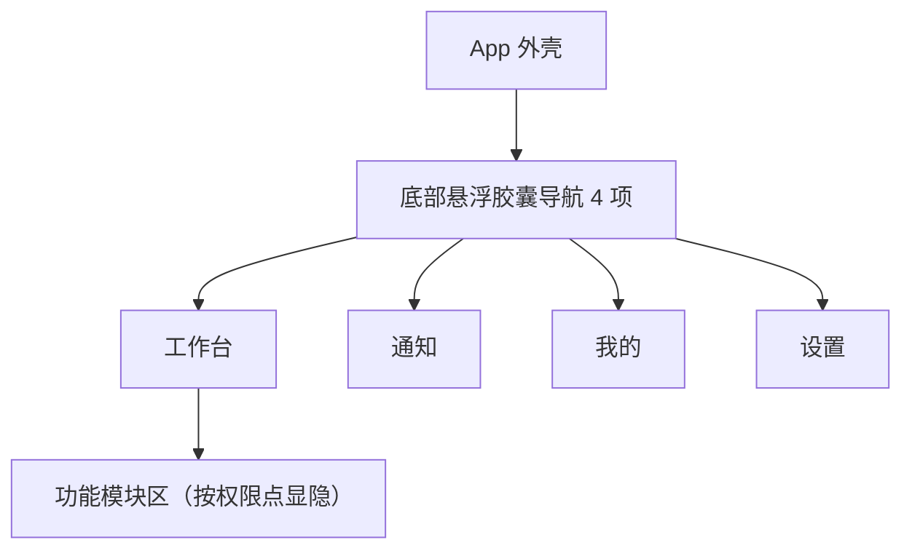
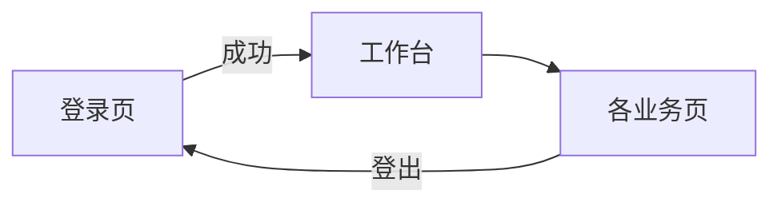
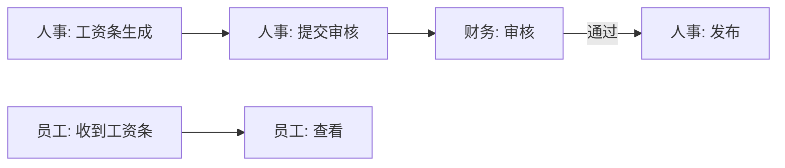

# 页面总览

> ⭐ **本档是项目的核心导航**。所有页面在此登记，每页一份独立文档。
> 新增页面必须在本档登记 + 在 `03-页面/` 下创建对应文档。

> 📍 **现状（2026-07-30）**：核心业务多数使用真实后端；工资与员工报销活动 Mock 已移除、
> V133 表、真实 API 与固定状态机已有源码，业务口径和生产 E2E 待验收。实验室/设备待接入。
> 页面存在只说明 UI/路由存在，不代表数据库/API 已生产完成。
> 发布状态与阻断项见[生产就绪审计报告](../99-项目治理/2026-07-30-生产就绪审计报告.md)。

---

## 一、页面文档组织原则

- **一页一档**：每个页面一份 markdown，文件名 = 页面中文名
- **Page-driven**：以页面为单位组织，不按功能组织
- 每个页面文档记录：定位 / 入口 / 响应式布局 / 组件 / 功能点 / 功能链路图 / 涉及实体 / 权限 / 边界情况
- 页面变更 → 同步更新本档 + 该页文档

---

## 二、完整页面清单（按 Phase 分批）

### Phase 0 — 地基（必做）

| # | 页面 | 路由 | 文档 | 状态 |
|---|---|---|---|---|
| 1 | 登录页 | `/login` | [登录页.md](登录页.md) | 🟡 真实鉴权已接，待全量 CI、时序与多端 E2E |
| 2 | App 外壳（导航容器） | `/` (ShellRoute) | [App外壳.md](App外壳.md) ✅ | v4 — 悬浮胶囊导航 |
| 3 | 工作台首页 | `/dashboard` | [工作台首页.md](工作台首页.md) ✅ | v4 — 功能集散中心 |
| 4 | 设置页 | `/settings` | [设置页.md](设置页.md) | 🟡 偏好/改密/真实退出、集中版本与正式页脚已接；待全量视觉/多端 E2E |

### Phase 1 — 全员可用

| # | 页面 | 路由 | 文档 | 状态 |
|---|---|---|---|---|
| 5 | 我的 / 个人资料 | `/profile` | [我的页.md](我的页.md) ✅ | v3 — 丰满字段 + 接入修改闭环 |
| 5a | 修改我的信息 | `/profile/edit` | [我的页.md §A](我的页.md) ✅ | Phase 6 新增 |
| 5b | 我的修改申请 | `/profile/me/changes` | [我的页.md §A](我的页.md) ✅ | Phase 6 新增 |
| 6 | 工资条列表 | `/payroll/slip` | [工资条列表页.md](工资条列表页.md) | 🟡 Dio + V133/V138 服务端分页，待容量/权限/E2E 验收 |
| 7 | 工资条详情 | `/payroll/slip/:id` | [工资条详情页.md](工资条详情页.md) | 🟡 Dio + V133，待对象授权/PDF 验收 |
| 8 | 员工报销申请列表 | `/expense` | [报销列表页.md](报销列表页.md) | 🟡 Dio + V133/V138 服务端分页，待容量/权限/E2E 验收 |
| 9 | 新建员工报销 | `/expense/new` | [新建报销页.md](新建报销页.md) | 🟡 Dio + V133，待状态机验收 |
| 10 | 员工报销详情 | `/expense/:id` | [报销详情页.md](报销详情页.md) | 🟡 Dio + V133，待对象授权/状态机验收 |
| 11 | 公司通知列表 | `/notice` | [通知列表页.md](通知列表页.md) | 🟡 真实 API、分页/上限、已读与批删已接；推送/离线/E2E 待验收 |
| 12 | 通知详情 | `/notice/:id` | [通知详情页.md](通知详情页.md) | 🟡 真实 API 与已读状态已接；附件/深链/E2E 待验收 |
| 13 | 建议箱 | `/suggestion` | [建议箱页.md](建议箱页.md) | 🟡 真实 API、提交/点赞/官方回复已接；完整回归与权限 E2E 待验收 |

### Phase 2 — 人事端（新增：员工修改审批）

| # | 页面 | 路由 | 文档 | 状态 |
|---|---|---|---|---|
| 14a | 员工修改审批（HR 队列） | `/hr/profile-changes` | [我的页.md §B](我的页.md) ✅ | Phase 6 新增 |
| 14b | 员工修改审批（详情） | `/hr/profile-changes/:id` | [我的页.md §B](我的页.md) ✅ | Phase 6 新增 |

> 📐 **Phase 1 列表页布局统一为卡片瀑布流**：工资条列表、报销列表、通知列表、建议箱 4 个列表页均已从 `ListView`（横向长条项）改造为 `UtenResponsiveGrid` 卡片瀑布流网格，每条记录渲染为竖版 `UtenCard`（不再是横向长条 `UtenListItem`）。
>
> - 列数按**父容器实际宽度**自适应（非屏幕宽度）：`<500px=1 列` / `500-800=2 列` / `800-1100=3 列` / `1100-1500=4 列` / `>1500=5 列`，概括为**手机 1 列 / 平板 2-3 列 / 桌面 3-5 列**。
> - [报销详情页](报销详情页.md) 的明细项同样改成了 `UtenResponsiveGrid` 瀑布流网格。
> - 4 个列表页的卡片结构见各自文档第三节"响应式布局"。

### Phase 2 — 人事端

| # | 页面 | 路由 | 文档 | 状态 |
|---|---|---|---|---|
| 14 | 员工档案列表 | `/employee` | [员工列表页.md](员工列表页.md) | 🟡 真实前后端，待生产同构验收 |
| 15 | 员工详情 | `/employee/:id` | [员工详情页.md](员工详情页.md) | 🟡 真实前后端，待生产同构验收 |
| 16 | 编辑员工 | `/employee/:id/edit` | [员工编辑页.md](员工编辑页.md) | 🟡 V141 敏感写权限已闭环，待权限矩阵/E2E |
| 17 | 部门树 | `/department` | [部门管理页.md](部门管理页.md) | 🟡 真实前后端，待生产同构验收 |
| 18 | 入职流程 | `/employee/onboarding` | [入职流程页.md](入职流程页.md) | 🟡 原子建档/建号和一次性密码已实现，待 E2E |
| 19 | 离职流程 | `/employee/:id/offboarding` | [离职流程页.md](离职流程页.md) | 🟡 真实状态机，待生产同构验收 |
| 20 | 工资条生成 | `/payroll/generate` | [工资条生成页.md](工资条生成页.md) | 🟡 Dio + V133/V138，待生成/容量/并发/E2E 验收 |
| 21 | 通知发布 | `/notice/publish` | [通知发布页.md](通知发布页.md) | 🟡 真实前后端，待生产同构验收 |

### 访客系统（前后端打通）

> 详见 [访客预约系统.md](访客预约系统.md)。外部访客来访闭环：入口选择 → 手机验证码预约 → HR 审批 → 签名二维码 → 保安扫码核验。
> 本人预约、HR 审批、被访人三类列表已改服务端分页，V139 补长期索引；真实短信、容量/权限矩阵
> 与生产 E2E 仍待验收。

| # | 页面 | 路由 | 主体/权限 |
|---|---|---|---|
| 22 | 入口选择页 | `/entry` | 登录前 |
| 23 | 访客登录 | `/visitor/login` | 未登录访客 |
| 24 | 访客首页（我的预约） | `/visitor/home` | visitor JWT |
| 25 | 来访预约表单 | `/visitor/apply` | visitor JWT |
| 26 | 访客预约详情（含二维码） | `/visitor/apply/:id` | visitor JWT + 本人对象范围 |
| 27 | 访客审批列表 | `/visitor-approval` | `visitor:approve` |
| 28 | 访客审批详情 | `/visitor-approval/:id` | `visitor:approve` |
| 29 | 我的访客（被访人确认） | `/my-visitors` | `visitor:approve` + 当前 host 对象范围 |
| 30 | 保安扫码核验 | `/security/scan` | `visitor:check-in` |

### Phase 3 — 财务端

| # | 页面 | 路由 | 文档 | 状态 |
|---|---|---|---|---|
| 22 | 员工报销审批列表 | `/expense/approval` | [报销审批列表页.md](报销审批列表页.md) | 🟡 Dio + V133/V138 服务端分页，待容量/权限/E2E 验收 |
| 23 | 员工报销审批详情 | `/expense/approval/:id` | [报销审批详情页.md](报销审批详情页.md) | 🟡 Dio + V133，待支付会计交接验收 |
| 24 | 工资条审核 | `/payroll/review` | [工资条审核页.md](工资条审核页.md) | 🟡 Dio + V133/V138 服务端分页，待审核/发布/容量 E2E 验收 |
| 25 | 财务报表 | `/finance/report` | [财务报表页.md](财务报表页.md) | 🟡 真实报表/API/导出已接；会计口径、权限、容量与 E2E 待验收 |

### Phase 4 — 生产/实验室

> 📌 **现状对齐（2026-07-27）**：本节原列 10 个 UX 页面（实验室 3 / 空调 2 / 流水线·产量 3 / 库存 2）。
> 业务落地后部分概念被新模块接收：**库存查询/出入库** 已由新 [`stock`](#业务单据与报表2026-07-新增全真实后端) 模块（真实后端）覆盖；
> **生产** 真实后端模块覆盖了生产计划/日报/BOM 成本（[生产管理报表](#业务单据与报表2026-07-新增全真实后端)），原「流水线看板 / 产量录入 / 产量统计」UX 仍为独立轻页面。
> **实验室检测 / 空调控制** 当前仍为前端实现（设备/检测类，未在老库迁移范围），待后续接入真实后端。

| # | 页面 | 路由 | 文档 | 状态 |
|---|---|---|---|---|
| 26 | 实验室检测上传 | `/lab/test/upload` | [检测上传页.md](检测上传页.md) ⏳ | 前端已实现，后端待接入 |
| 27 | 检测记录列表 | `/lab/test` | [检测列表页.md](检测列表页.md) ⏳ | 前端已实现，后端待接入 |
| 28 | 检测报告详情 | `/lab/test/:id` | [检测报告页.md](检测报告页.md) ⏳ | 前端已实现，后端待接入 |
| 29 | 空调设备总览 | `/hvac` | [空调总览页.md](空调总览页.md) ⏳ | 前端已实现，后端待接入 |
| 30 | 空调设备详情/控制 | `/hvac/:id` | [空调控制页.md](空调控制页.md) ⏳ | 前端已实现，后端待接入 |
| 31 | 流水线进度看板（旧提案） | `/production/line` | [流水线看板页.md](流水线看板页.md) | ⛔ 无注册路由/页面；现有 `/production/schedule|progress` 可能替代 |
| 32 | 产量录入（旧提案） | `/production/output/entry` | [产量录入页.md](产量录入页.md) | ⛔ 无注册路由/页面；先确认与生产日报是否重复 |
| 33 | 产量统计（旧提案） | `/production/output` | [产量统计页.md](产量统计页.md) | ⛔ 无注册路由/页面；优先扩展 `/production/report/*` |
| 34 | 库存余额 | `/stock/balance` | [库存余额页.md](库存列表页.md) | ✅ 真实后端；余额详情含独立授权调整，自动生成 `CHECK` |
| 35 | 出入库流水 | `/stock/movement` | [出入库记录页.md](出入库记录页.md) | ✅ 真实后端；盘盈/盘亏流水可回查来源 `CHECK` |

### 系统管理（仅超级管理员）

| # | 页面 | 路由 | 文档 | 状态 |
|---|---|---|---|---|
| 39 | 账号支持 / 权限管理 | `/admin/permissions` | [权限管理页.md](权限管理页.md) ✅ | `account:support` 或 `authorization:manage` 可进共享壳；support-only 不渲染/请求授权区 |
| 39a | 系统设置 | `/admin/system-settings` | [系统设置页.md](系统设置页.md) ✅ | 2026-07-27 新增（运行时策略阈值 + 二次密码确认，[ADR-013](../99-决策记录-ADR/ADR-013-系统设置与安全策略可视化.md)） |
| 39b | 审计中心 | `/admin/audit-logs` | [审计日志页.md](审计日志页.md) ✅ | 超级管理员或个人获授 `audit_log:view` 的核查人员只读查看；统计卡片、风险趋势、四页详情、设备证据与本机回执授权核对；导出另需 `audit_log:export` |

### 基础资料（全员可见，2026-07 新增）

> 工作台「常用功能」→ 基础资料入口页（hub）→ 货品/模具/客户/供应商（分类树+主档）+ 颜色/基本单位（扁平主档）。
> 货品/模具/客户/供应商四页**结构同构**（左分类树 + 右主档列表）；颜色/单位为**扁平列表**（无分类树）。全部共用模块组件 `MasterDataTableView` / `showMasterEditDialog` / `showMasterDetailSheet`（见 [基础资料页.md](基础资料页.md)）。

| # | 页面 | 文档 | 状态 |
|---|---|---|---|
| 40 | 基础资料入口 + 货品/模具/客户/供应商（4 同构页）+ 颜色/基本单位（2 扁平页） | [基础资料页.md](基础资料页.md) ✅ | 2026-07-25 UI 重构 + 颜色/单位扁平主档（V39/V40）+ 货品颜色/单位名解析 |

### 业务单据与报表（2026-07 新增，全真实后端）

> 老库业务数据已有阶段性导入与局部对账，但不得表述为“十几年数据 100% 迁移”：BOM reject、
> 委外发料数量、客户/销售 owner、总账开账和增量追平仍未闭环。当前状态以
> [生产就绪审计报告](../99-项目治理/2026-07-30-生产就绪审计报告.md)为准。页面结构总体同构：
> **hub 入口** → 单据列表 / 详情 / 编辑（状态机审核 + 库存/应收应付联动 + 红冲）+ 模块报表（明细/汇总，参数化，镜像 `ReportTableResponse` 范式）。
> 全部共用统一表格 [`MasterDataTableView`](../02-组件库/MasterDataTableView.md)（列排序 + autofilter + 分页）+ [`UtenExportButton`](../02-组件库/UtenExportButton.md)（加密 Excel 导出）。
> 迁移细节见 [../数据迁移/](../数据迁移/)，进度见 [README](../../README.md)「项目当前阶段」。

| # | 模块 | 路由前缀 | 报表数 | 状态 |
|---|---|---|---|---|
| 41 | 销售管理（报价/订货/出货/退货/其它出货） | `/sales` | 8 | ✅ 真实后端 + 报表 |
| 42 | 采购管理（申请/订货/收货/退货） | `/purchase` | 9 | ✅ 真实后端 + 报表（导出端到端模板） |
| 43 | 委外管理（进仓/发料/退货/材料退/损耗） | `/subcontract` | 8 | ✅ 真实后端 + 报表 |
| 44 | 仓库管理（调拨/领退料/损耗/产成品进出仓/盘点等 9 类单据） | `/warehouse` | 14 | ✅ 真实后端 + 报表 |
| 45 | 生产管理（生产计划单 / 生产日报表 / BOM 成本展开只读 + 物料反查产成品） | `/production` | 3 | ✅ 真实后端 + 报表 |
| 46 | 钱流管理（销售收款/采购付款/一般费用/其它收入/银行存取款 + 应收应付台账 + 往来对帐 + 账户流水 + **对账单 5 张 + 成本核算 8 报表 + 总账 8 报表 + 资产与待摊管理**） | `/finance`（+`/finance/report/recon|cost|gl`、`/finance/assets`） | 22 + 23（对账 5/成本 8/总账 8/资产清单 2） | ✅ 真实后端 + 报表 |
| 47 | 库存查询（即时聚合、仓货色余额、出入库流水及受控修正） | `/stock/instant-inventory`、`/stock/balance`、`/stock/movement` | — | ✅ 真实后端；规则见 [盘点修正文档](../数据迁移/50-仓库盘点修正与历史单据处理.md) |

> 各模块 hub 页统一：`<module>_hub_page.dart` → 单据/报表双卡 + 卡内 `ChoiceChip` 切单据类型。
> 单据详情/编辑页跨模块同构：状态机审核 + 明细 `MasterDataTableView` + 关联单据交叉引用列。

### 老系统融合（双写）

> 详见 [../06-老系统融合/00-融合总策略.md](../06-老系统融合/00-融合总策略.md)（[ADR-005](../99-决策记录-ADR/ADR-005-单向影子双写策略.md)）。新库单向影子老库，迁移完成后老系统逐步退出。

---

## 三、入口地图（导航结构）

### 3.1 悬浮胶囊导航（UI v4，2026-07-23 起）

> 详见 [App外壳.md](App外壳.md)。**全断点统一**（不再按宽度切换底栏/Rail/侧栏）：
> 底部悬浮胶囊导航 4 项 —— **工作台 · 通知 · 我的 · 设置**，overlay 悬浮不占布局，
> 四页 PageView 支持左右跟手滑动，滑块高亮实时联动；内容全屏宽。



<a id="workbench-sections"></a>

### 3.2 工作台功能模块区（按业务部门分区，[ADR-011](../99-决策记录-ADR/ADR-011-工作台部门分区与动态权限配置.md)）

> 工作台按公司 9 个一级业务部门分区（折叠/排序按账号云端持久化，`user_preferences.workbench.layout`）。
> 可见性判定由 `permission_by_path` 的 any/all 契约统一决定（与路由守卫同一份映射），超管调整部门权限后模块自动增减；普通用户只见有可见卡片的分区，超管见全部分区。

| 分区 key | 分区 | 模块 | 可见条件 |
|---|---|---|---|
| common | 常用功能 | 工资条、我的报销、我的访客（被访人确认）、基础资料、意见箱、公司通知 | 全员基础权限（登录即可见；我的访客需 `visitor:approve`） |
| hr | 行政与人力资源部 | 员工档案、部门管理、入职向导、通知发布、访客审批•、信息变更审核• | 对应 hr 权限点（• 带待审红点） |
| fin | 财税部 | 采购管理、客户资料、供应商资料、账户资料、报销审批、工资条生成、工资条审核、钱流管理、财务报表 | 对应 fin 权限点 |
| prod | 生产部 | 生产管理（计划/日报/BOM 成本）、流水线看板、产量录入、产量统计、楼栋空调控制 | `production:view` / `hvac:view` |
| eng | 工程研发部 | 物料反查产成品（BOM where-used，与生产部共用入口） | `production_where_used:view` |
| pmc | PMC运营部 | 库存查询、出入库记录 | 页面入口为 `stock:view`；余额调整按钮另需动作级 `stock:balance:adjust` |
| qa | 品质管理部 | 检测记录（实验室） | `lab:test:view` |
| sales / newmedia / rail | 综合营销部 / 新媒体事业部 / 轨道事业部 | 销售管理、委外管理（综合营销部已接入；其余待接入，仅超管可见占位） | `sales:*` / `subcontract:*` |
| security | 安保部 | 访客核验（扫码） | `visitor:check-in` |
| system | 系统管理 | 账号支持/权限管理共享壳、系统设置、审计中心 | 共享壳接受 `account:support` 或 `authorization:manage`；系统设置/授权写仍需授权管理 + 服务端超管校验；超级管理员因固有全权限可核查审计，非超管独立要求个人点名的 `audit_log:view`，导出另需个人 `audit_log:export`，两项不得随部门继承 |

---

## 四、权限矩阵

> **⚠️ 2026-07-24 更新**：角色体系已下线（[ADR-011](../99-决策记录-ADR/ADR-011-工作台部门分区与动态权限配置.md)，V29）。本节角色定义与页面×角色矩阵仅作历史参考。现行规则：
>
> - **权限随部门走**：员工属于哪个部门（员工档案维护），就拥有该部门及其上级部门在权限管理页配置的全部权限点；个人可单独加授/收回。
> - **全员基础**（对应原 employee 角色）：工作台、我的工资条、我的报销、通知、建议箱、我的访客、个人信息修改——人人可用，多数页面登录即可访问。
> - 页面级权限以 `permission_by_path.requiredAnyPermFor()` 与 `requiredAllPermsFor()` 为准；数据范围用分级权限点（如 `payroll:view:self` vs `payroll:view:all`）。

### 4.1 角色定义（历史参考，已下线）

| 角色 code | 中文名 | 说明 |
|---|---|---|
| `employee` | 普通员工 | 默认角色，看自己的数据 |
| `hr` | 人事 | 管理员工档案、部门、工资条生成 |
| `finance` | 财务 | 报销审批、工资条审核、报表 |
| `lab` | 实验室 | 检测数据 |
| `production` | 车间 | 流水线、产量、库存 |
| `manager` | 管理层 | 看全部数据的只读 + Dashboard |
| `admin` | 系统管理员 | 全部权限 + 用户管理 |

> 一个用户可以有多个角色（如某员工既是 `employee` 又是 `lab`）。

### 4.2 页面权限矩阵

| 页面 | employee | hr | finance | lab | production | manager | admin |
|---|---|---|---|---|---|---|---|
| 工作台 | ✅ | ✅ | ✅ | ✅ | ✅ | ✅ | ✅ |
| 我的工资条 | ✅ 自己 | ✅ 全员 | ✅ 自己 | ✅ 自己 | ✅ 自己 | ✅ 自己 | ✅ |
| 我的报销 | ✅ 自己 | ✅ 自己 | ✅ 自己 | ✅ 自己 | ✅ 自己 | ✅ 自己 | ✅ |
| 通知 | ✅ 读 | ✅ 读 | ✅ 读 | ✅ 读 | ✅ 读 | ✅ 读 | ✅ |
| 建议箱 | ✅ 自己 | ✅ 自己 | ✅ 自己 | ✅ 自己 | ✅ 自己 | ✅ 自己 | ✅ |
| 员工档案 | ❌ | ✅ | ❌ | ❌ | ❌ | ✅ 只读 | ✅ |
| 部门管理 | ❌ | ✅ | ❌ | ❌ | ❌ | ✅ 只读 | ✅ |
| 工资条生成 | ❌ | ✅ | ✅ 审核 | ❌ | ❌ | ✅ 只读 | ✅ |
| 报销审批 | ❌ | ❌ | ✅ | ❌ | ❌ | ✅ 只读 | ✅ |
| 财务报表 | ❌ | ❌ | ✅ | ❌ | ❌ | ✅ 只读 | ✅ |
| 检测上传 | ❌ | ❌ | ❌ | ✅ | ❌ | ✅ 只读 | ✅ |
| 检测列表 | ❌ | ❌ | ❌ | ✅ | ❌ | ✅ 只读 | ✅ |
| 空调控制 | ❌ | ❌ | ❌ | ❌ | ✅ | ✅ 只读 | ✅ |
| 流水线 | ❌ | ❌ | ❌ | ❌ | ✅ | ✅ 只读 | ✅ |
| 产量 | ❌ | ❌ | ❌ | ❌ | ✅ | ✅ 只读 | ✅ |
| 库存 | ❌ | ❌ | ❌ | ❌ | ✅ | ✅ 只读 | ✅ |

### 4.3 前端权限处理规则

- **隐藏而非禁用**：没权限的菜单/按钮直接 `hide`，不要 `disable`（disable 反而暴露功能存在）
- **后端必须校验**：前端隐藏只是体验优化，**后端必须独立校验权限**（真相在后端）
- **路由守卫**：未授权访问受保护路由 → 跳工作台或 403 页
- **单一数据源（UI v4）**：工作台模块区显隐与路由守卫共用
  `core/router/permission_by_path.dart` 的 any/all 映射，不再另维护角色清单
- **权限来源（2026-07-24 起）**：全员基础权限 ∪ 部门直配权限（含上级部门）± 个人覆盖；超管全量。角色体系已下线（ADR-011）。V135 使相关授权版本变化后旧 staff access token 立即 401，刷新/重登取得新权限；运行验收边界见生产报告

---

## 4.4 数据范围（当前实现）

旧版文档曾设计全局 `ViewContextProvider` 和 AppBar 选择器，但项目没有对应源码，该方案已停止
作为当前需求。现在每个模块由后端权威实施自己的数据范围：

- 员工、工资、报销按专属权限和部门/本人条件查询；
- 客户、货品和销售单据按 owner、显式 `user_data_scopes` 和 `*:view:all` 过滤；
- 页面筛选仅改变查询条件，不能扩大用户被授权的对象集合；
- 列表、详情、写、批量、引用、导出必须使用同一后端范围策略。

如果未来确有跨模块统一视角需求，须重新定义接口、权限、失效和审计，而不是恢复旧角色矩阵草图。

---

## 五、页面流转图（关键流程）

### 5.1 登录到工作台



### 5.2 报销全流程（跨角色）


### 5.3 工资条生成流程



---

## 六、页面文档统一模板

每个页面文档按以下结构写：

```markdown
# [页面名]

## 一、定位
给谁用 / 解决什么问题 / 在产品中的位置

## 二、入口与导航
- 进入路径：从哪里点进来
- 在导航中的位置：主导航/次导航/角色专属
- 离开去向：常见下一步

## 三、响应式布局
- compact（手机）：草图 + 说明
- medium（平板）：草图 + 说明
- expanded（桌面）：草图 + 说明

## 四、涉及的 Uten 组件
列出用到的组件名

## 五、功能点
1. xxx
2. xxx

## 六、功能链路图
mermaid 流程图（如 5.x）

## 七、涉及的数据实体
→ 见 [04-数据模型/实体字典.md](../04-数据模型/实体字典.md)#实体名

## 八、权限要求
- 哪些角色可访问
- 数据范围（自己/部门/全员）
- 关键操作权限点

## 九、边界情况
- 无数据时
- 加载失败时
- 性能档 = lite 下的表现
- 网络断开时
```

---

## 七、页面进度看板

> 「计划页面数」仅统计本档登记的导航/UX 页面文档；业务单据/报表页（§业务单据与报表）随模块上线，单页文档以模块 hub 页聚合，不计入此处列数。

| Phase | 计划页面数 | 已完成文档 | 已实现 UI |
|---|---|---|---|
| 0 地基 | 4 | 4 | 4 |
| 1 全员 | 9 | 9 | 9 |
| 2 人事 | 8 | 8 | 人事主干真实；工资为 Dio + V133、待运行验收 |
| 3 财务 | 4 | 4 | 钱流/报表真实；员工报销审批与工资审核为 Dio + V133、待运行验收 |
| 4 生产/实验室 | 10 | 10 | 生产/库存 已接真实后端；实验室/空调 前端已实现，后端待接入 |
| 系统管理 | 3 | 3 | 3（权限管理 + 系统设置 + 审计日志） |
| 业务单据与报表 | 7 模块 | hub 聚合 | 7（销售/采购/委外/仓库/生产/钱流/库存查询，全真实后端） |
| **合计（含业务模块）** | **45+** | **45+** | **45+** |

---

**最后更新**：2026-07-30（校准工资/员工报销 Dio + V133/V138 分页、设备待接与真实业务验收边界）
