# ER 草图

<!-- PRODUCTION-PLANNING-V195-CURRENT -->
## 2026-08-02 生产预排与 MAKE 回供关系

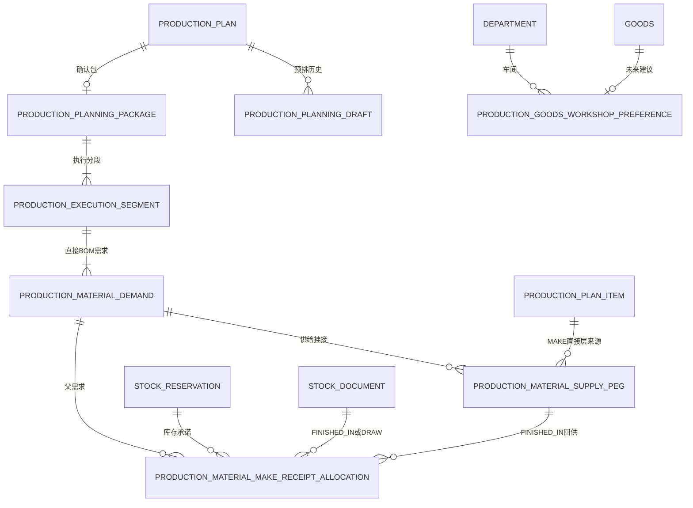

A4 生产执行工卡是上述确认事实的只读投影，不新增 ER 实体。父包的 MAKE 关系只到当前直接层子计划，后续层级由子计划再次评审生成。V195 只刷新这些公开业务表未来写入的审计触发器覆盖，不新增关系、不补历史审计。

> ⏳ **随实体字典生长的活文档**。新增实体关联时同步更新本图。
> 这里只画**概念模型**（实体 + 关系），不画物理表结构。

---

## 一、整体概览

```mermaid
erDiagram
    User ||--|| Employee : "1对1"
    Employee }o--|| Department : "属于"
    Employee }o--|| Position : "担任"
    Department ||--o{ Department : "父子"
    Employee ||--o{ PayrollSlip : "收到"
    Employee ||--o{ ExpenseClaim : "申请"
    Employee ||--o{ Notice : "发布(hr)"
    Employee ||--o{ Suggestion : "提交"
    Employee ||--o{ LabTest : "上传(lab)"
    Employee ||--o{ ProductionExecutionSegment : "负责"
    PayrollSlip ||--|{ PayrollItem : "包含"
    ExpenseClaim ||--|{ ExpenseItem : "包含"
    ExpenseClaim ||--o{ ExpenseApproval : "经过"
    Notice ||--o{ NoticeUserState : "接收快照/状态"
    User ||--o{ NoticeUserState : "接收/已读/删除"
    Suggestion ||--o{ SuggestionReply : "回复"
    LabTest ||--|| LabSample : "测"
    LabTest ||--|| LabReport : "产出"
    HvacDevice }o--|| Building : "在"
    HvacDevice }o--|| Floor : "在"
    Building ||--|{ Floor : "包含"
    HvacDevice ||--o{ HvacCommand : "被控"
    ProductionPlan ||--|{ ProductionPlanItem : "包含"
    ProductionPlan ||--o{ SubplanLink : "父计划谱系"
    SubplanLink }o--|| ProductionPlan : "指向子计划"
    ProductionPlan ||--o{ ProductionPlanningPackage : "确认批次"
    ProductionPlanningPackage ||--|{ ProductionExecutionSegment : "生成"
    ProductionExecutionSegment ||--|{ ProductionMaterialDemand : "需要"
    ProductionMaterialDemand ||--o{ ProductionMaterialSupplyPeg : "挂未来供给"
    ProductionMaterialDemand ||--o{ StockReservation : "占现货"
    SalesOrderItem ||--o{ StockReservation : "审核后订单预留"
    ProductionExecutionSegment ||--o{ ExecutionSegmentSalesAllocation : "销售归属"
    Warehouse ||--o{ StockBalance : "仓库余额"
    Goods ||--o{ StockBalance : "货品余额"
    Goods ||--o{ GoodsBomItem : "作为父件"
    Goods ||--o{ GoodsBomItem : "作为组件"
    StockDocument ||--|{ StockDocumentItem : "库存单据"
    FinanceAssetCategory ||--o{ FixedAsset : "固定资产分类"
    FinanceAssetCategory ||--o{ DeferredExpense : "待摊分类"
    FixedAsset ||--o{ FinanceAssetBook : "账簿"
    DeferredExpense ||--o{ FinanceDeferralScheduleVersion : "计划版本"
    FinanceAssetAccountingPeriod ||--o{ FinanceAssetPostingRun : "月度运行"
    FinanceAssetPostingRun ||--|{ FinanceAssetPostingLine : "逐项快照"
    FinanceAssetPostingRun }o--o| GlVoucher : "正式或反向凭证"
```

> 当前是骨架图，字段暂略。字段在 [实体字典.md](实体字典.md) 中维护。

---

## 二、分模块详图

### 2.1 组织架构

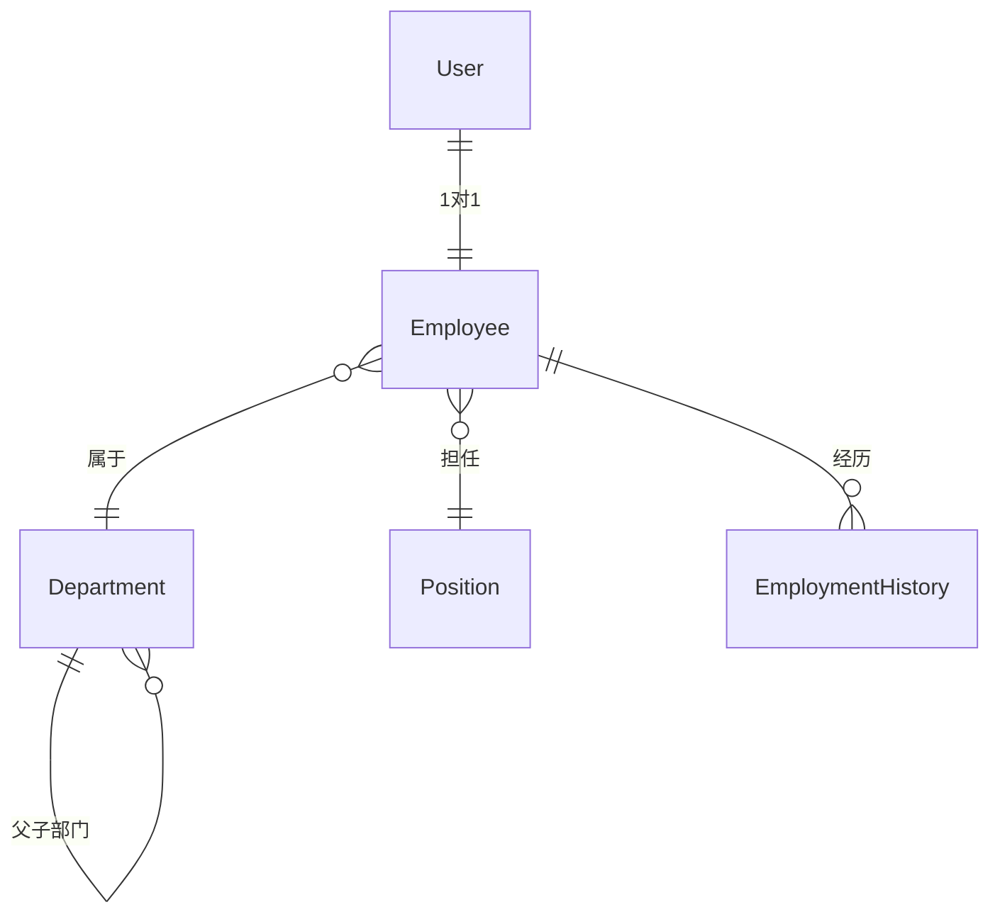

### 2.2 工资

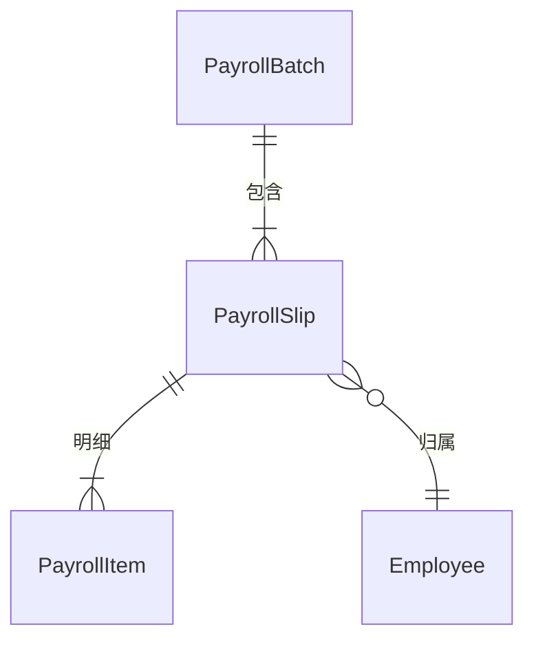

### 2.3 报销

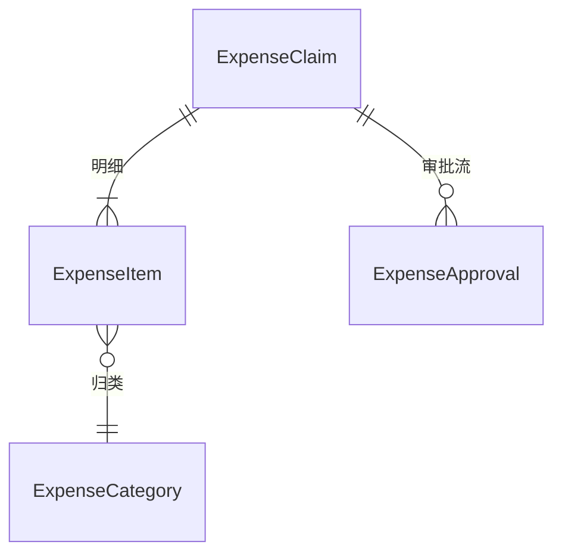

### 2.4 通知与建议

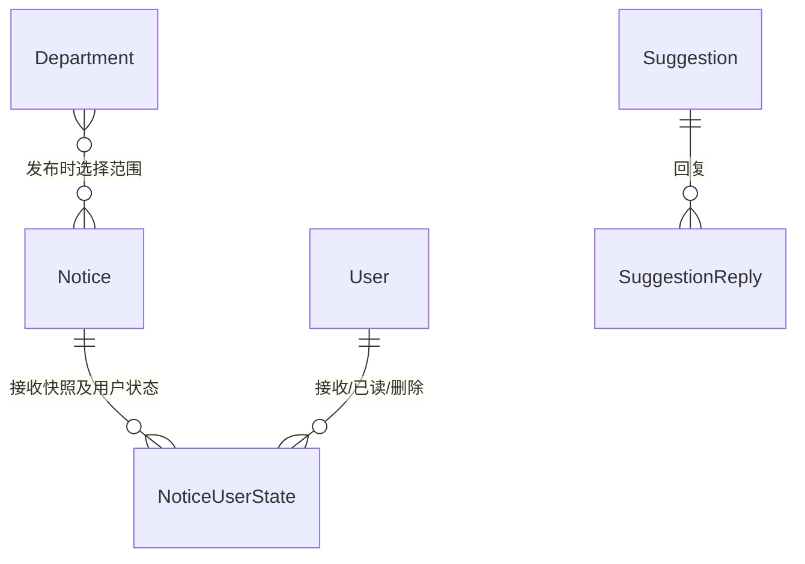

### 2.5 实验室

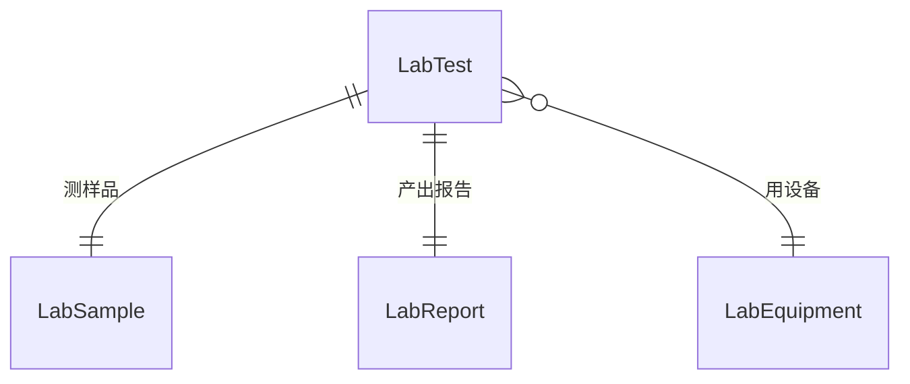

### 2.6 设备控制

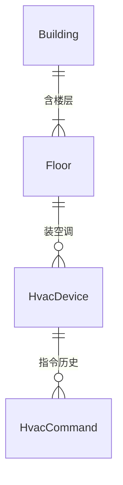

### 2.7 生产履约（当前 V150–V164）

> 执行段是计划明细的执行批次，不是新的父生产计划；`subplan_links` 才指向另一张真实自制件生产计划。物料需求、现货占用和未来供给分别记录，不能用一个状态字段互相替代。

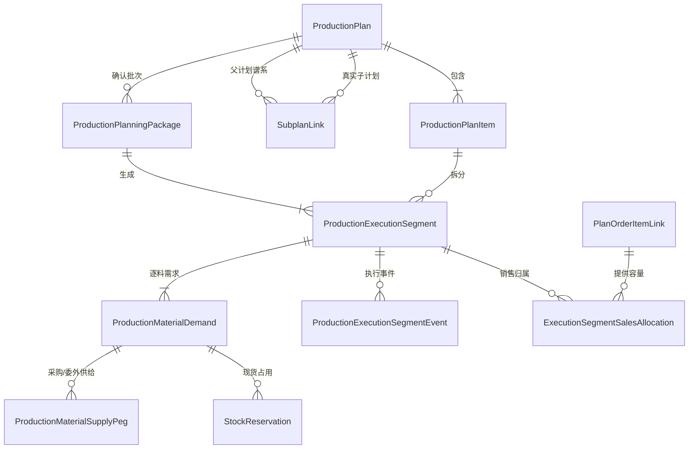

### 2.8 库存与领退耗

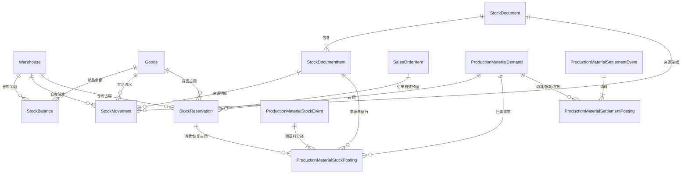

普通盘点和授权余额调整都走 `StockDocument(CHECK) → StockDocumentItem → StockMovement(9/10) → StockBalance`；
快捷调整不会建立第二套日志实体，也不会改写 `StockReservation`。库存物理结构与调整边界分别见
[仓库设计](../数据迁移/17-仓库管理-新库与迁移.md)和
[盘点修正文档](../数据迁移/50-仓库盘点修正与历史单据处理.md)。生产领退耗的完整表职责、数量守恒和
写入顺序见[生产履约 V1 实体关系与数量权威](生产履约V1实体关系.md)。

`StockReservation` 只表示订单承诺或生产现货占用：减少 ATP/自由库存但不改变在手，不等于未来供给、仓库拣货或实际出库。销售审核时可以 `warehouse_id=NULL`，发运窗口再绑定具体仓库；DRAW 审核只确认领料需求，分轮 `issue` 才扣物理库存。

### 2.8.1 目标模型：仓库作业、质量与委外供应商库存（未落地）

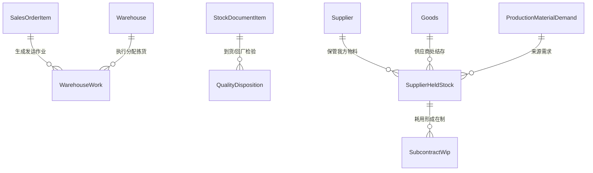

> 本图块是明确的**目标模型**，当前没有同名物理表。采购/委外到货待检必须在合格结论后才可进入可分配池；委外必须满足“累计发出 = 合格产出对应耗用 + 良/不良退回 + 审批损耗 + 供应商期末结存”。不得因 supply peg 已覆盖就在当前模型中假画成完整闭环。

### 2.9 当前货品 BOM 与历史快照

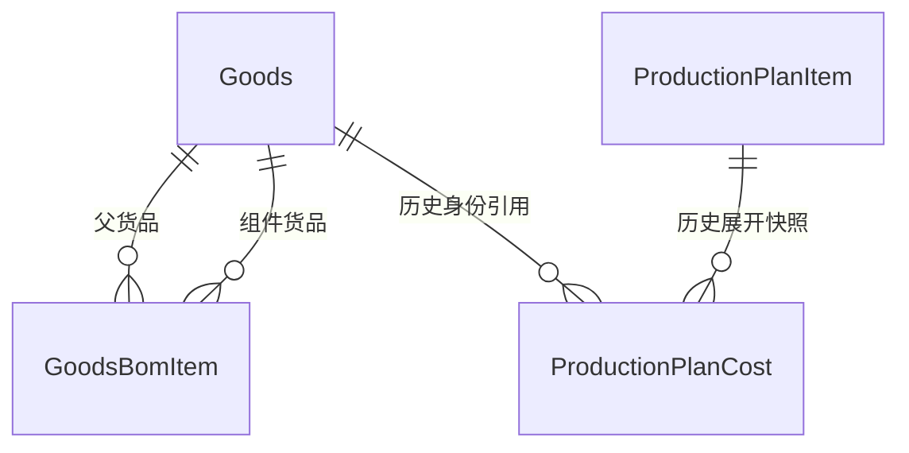

`GoodsBomItem` 是当前理论关系，活动边两端都必须是未删除且 `auto_created=false` 的正常货品；V181
已隔离 81 条历史 stub 误接边并用数据库触发器阻止复发。`ProductionPlanCost` 是历史计划展开快照，
可继续引用 31 个历史货品锚，不能因当前货品改名、BOM 调整或 stub 隔离而回溯重算。源端 20,798 条
BOM reject 仍须单独治理。

### 2.10 资产与待摊专业子账（V183）

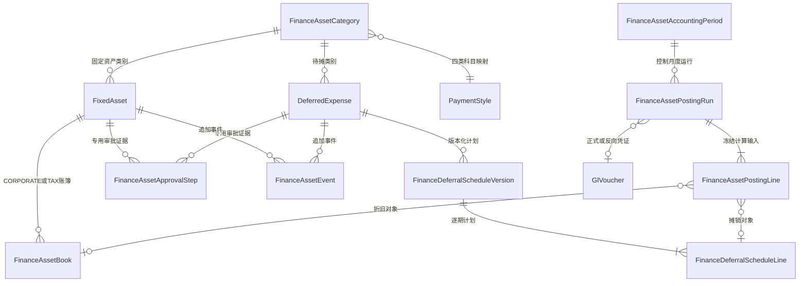

`FinanceAssetApprovalStep` 是资产领域的只追加轨迹，不等于下节仍未落地的通用
`ApprovalRecord`。TAX 账簿当前只是结构隔离预留；对外 API、计提/反冲、总账和税会差异报表均
未交付。已过账运行及其明细、日志和凭证不能修改/删除，月度错误写反向运行；资本化、处置和终止
事件的专用反冲/状态恢复尚未交付，因此完整生产仍为 NO-GO。详见
[51 · 资产与待摊专业化全链路](../数据迁移/51-资产与待摊专业化全链路.md)。

### 2.11 审批流（未来目标，不是当前 ER）

> 当前 V133 没有 `ApprovalNode` 或 `ApprovalRecord` 表：报销与工资分别把固定流程的状态、
> 操作人和时间戳保存在 `expense_claims`、`payroll_batches`。下图仅是业务决定采用可配置多级
> 审批后才考虑的目标模型，不能用于当前数据库建表或迁移对账。详见 [实体字典](实体字典.md) 与
> [全局机制 §三](../05-架构/全局机制.md#三审批流建模可配置多级)。

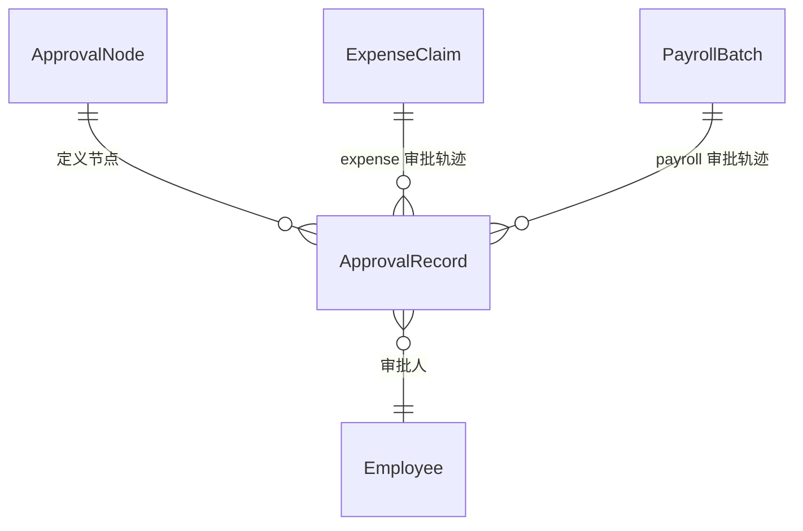

---

## 三、关联类型说明

| 符号 | 含义 |
|---|---|
| `||` | 强制 1 |
| `}o` | 可选多（0 或 N） |
| `o{` | 可选多 |
| `|{` | 强制多（1 或 N） |

例如 `Employee }o--|| Department` 表示：一个员工属于 0 或 1 个部门，一个部门有多个员工。

---

## 四、待定问题

> 关系还没完全想清楚的地方。

- [ ] User 和 Employee 是否真的一对一？（兼职/外协人员怎么算？）
- [ ] 一个员工能否同时属于多个部门？（兼任）
- [ ] 报销审批是单级还是多级？多级的话审批流实体怎么建模？
- [ ] 工资条是按月一条还是按批次？
- [ ] 老系统数据迁移时，缺失的关联关系如何补？
- [ ] 多厂区场景下，Building 和 Department 怎么关联？

---

**最后更新**：2026-08-01 · **状态**：生产履约关系已区分真实子计划、执行分段、订单预留、未来供给和实物移动；仓库作业、质量与供应商库存仅标为未落地目标，生产发布仍为 **NO-GO**
