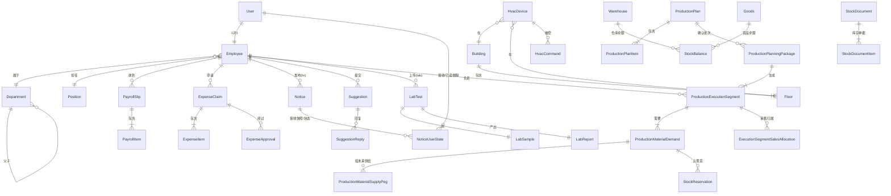
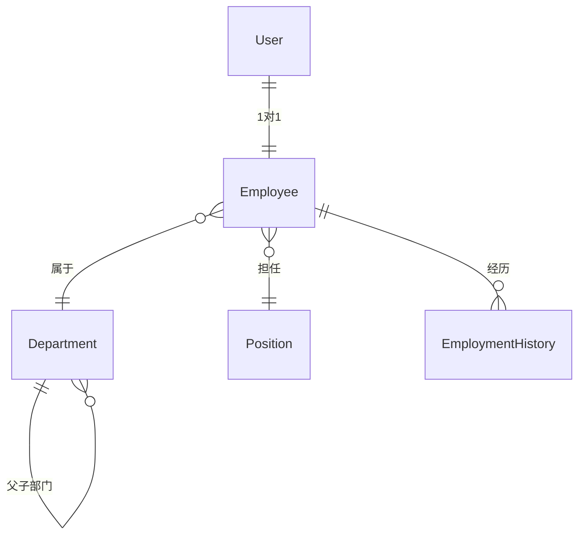
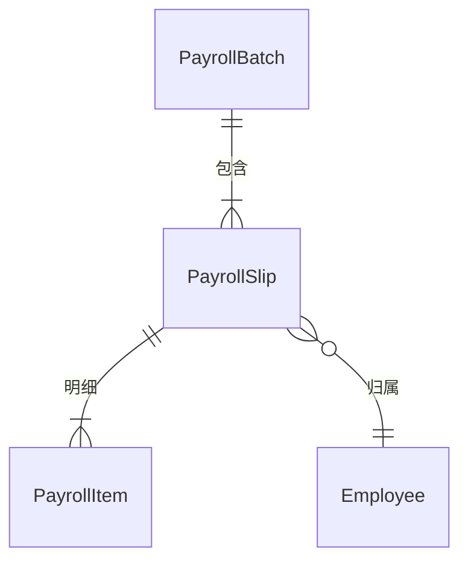
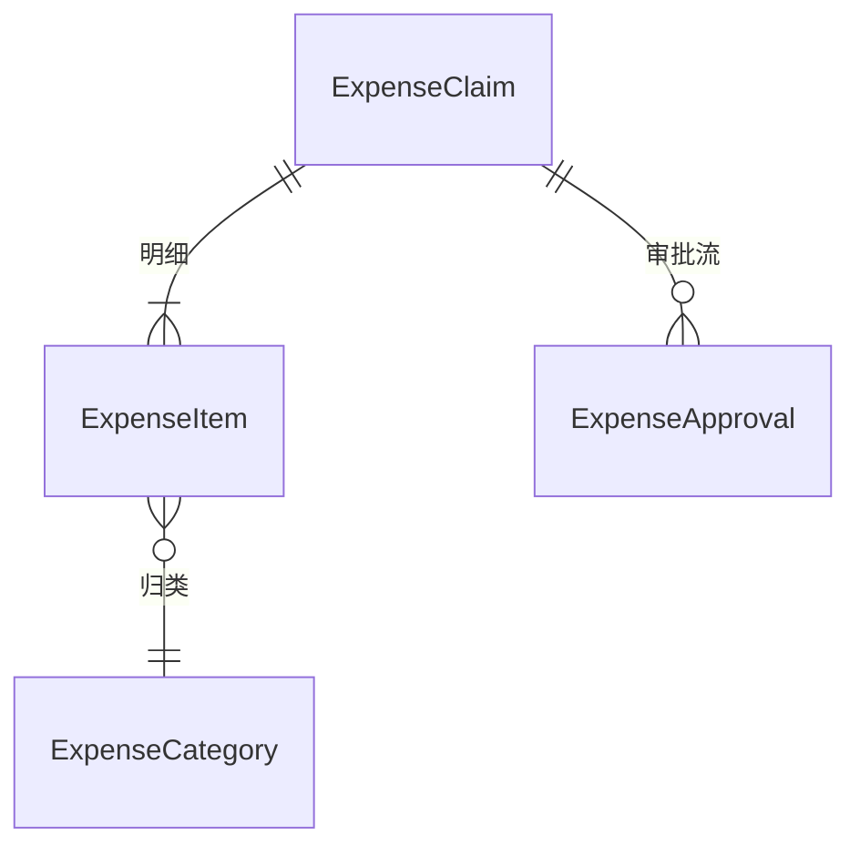
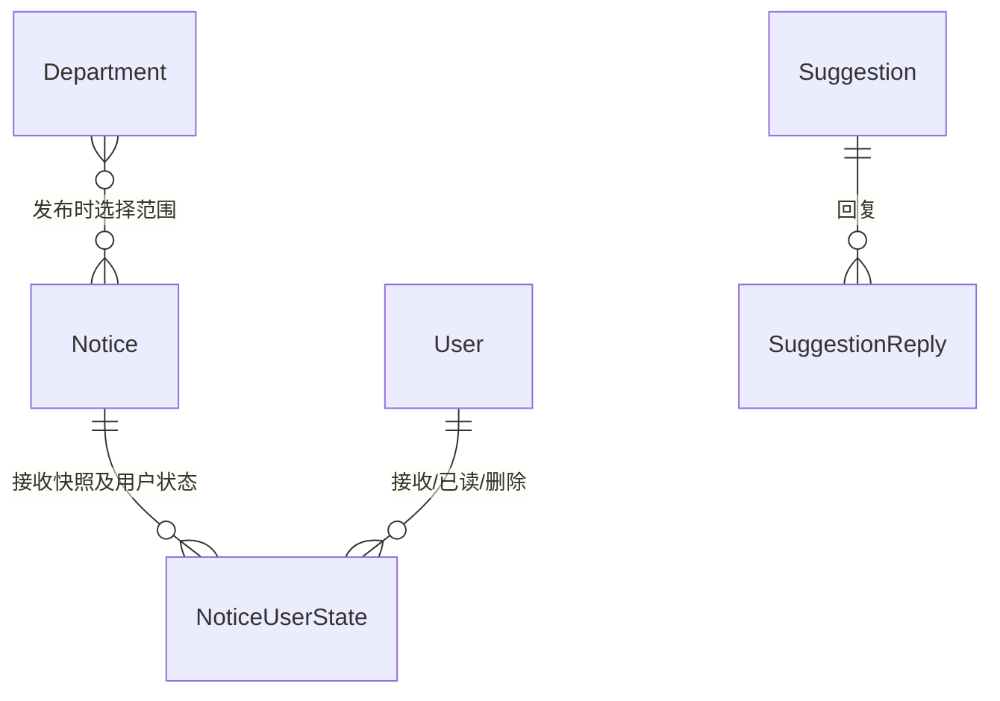
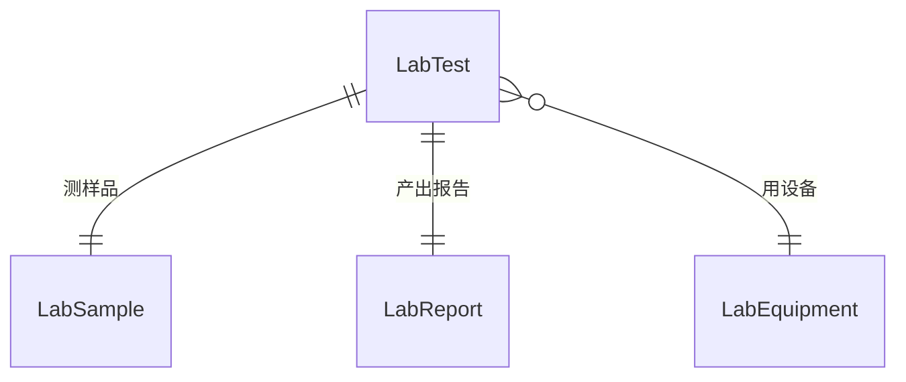
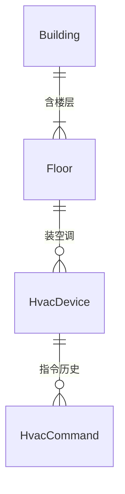
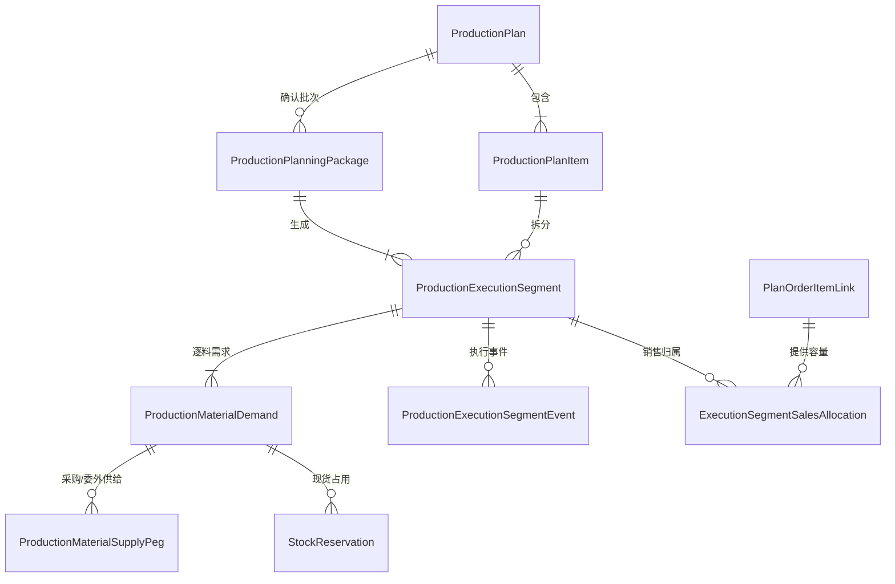
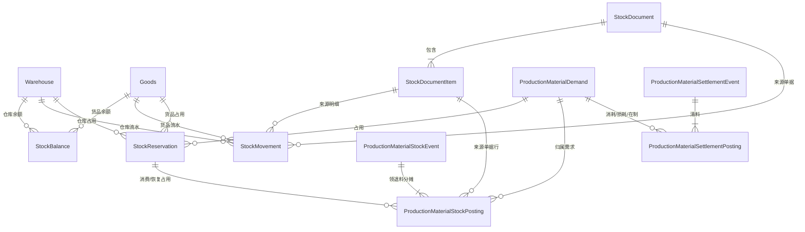
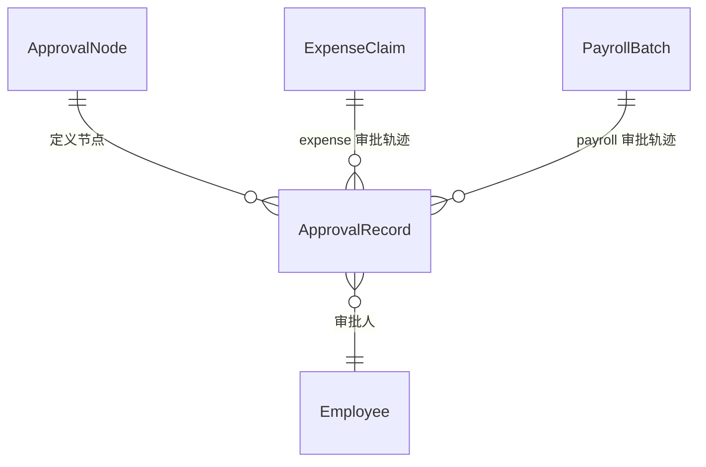

# ER 草图

> ⏳ **随实体字典生长的活文档**。新增实体关联时同步更新本图。
> 这里只画**概念模型**（实体 + 关系），不画物理表结构。

---

## 一、整体概览

> 当前是骨架图，字段暂略。字段在 [实体字典.md](实体字典.md) 中维护。

---

## 二、分模块详图

### 2.1 组织架构

### 2.2 工资

### 2.3 报销

### 2.4 通知与建议

### 2.5 实验室

### 2.6 设备控制

### 2.7 生产履约（当前 V150–V164）

> 执行段是计划明细的执行批次，不是新的父生产计划；物料需求、现货占用和未来供给分别记录，不能用一个状态字段互相替代。

### 2.8 库存与领退耗

普通盘点和授权余额调整都走 `StockDocument(CHECK) → StockDocumentItem → StockMovement(9/10) → StockBalance`；
快捷调整不会建立第二套日志实体，也不会改写 `StockReservation`。库存物理结构与调整边界分别见
[仓库设计](../数据迁移/17-仓库管理-新库与迁移.md)和
[盘点修正文档](../数据迁移/50-仓库盘点修正与历史单据处理.md)。生产领退耗的完整表职责、数量守恒和
写入顺序见[生产履约 V1 实体关系与数量权威](生产履约V1实体关系.md)。

### 2.9 审批流（未来目标，不是当前 ER）

> 当前 V133 没有 `ApprovalNode` 或 `ApprovalRecord` 表：报销与工资分别把固定流程的状态、
> 操作人和时间戳保存在 `expense_claims`、`payroll_batches`。下图仅是业务决定采用可配置多级
> 审批后才考虑的目标模型，不能用于当前数据库建表或迁移对账。详见 [实体字典](实体字典.md) 与
> [全局机制 §三](../05-架构/全局机制.md#三审批流建模可配置多级)。

---

## 三、关联类型说明

| 符号 | 含义 |
|---|---|
| `||` | 强制 1 |
| `}o` | 可选多（0 或 N） |
| `o{` | 可选多 |
| `|{` | 强制多（1 或 N） |

例如 `Employee }o--|| Department` 表示：一个员工属于 0 或 1 个部门，一个部门有多个员工。

---

## 四、待定问题

> 关系还没完全想清楚的地方。

- [ ] User 和 Employee 是否真的一对一？（兼职/外协人员怎么算？）
- [ ] 一个员工能否同时属于多个部门？（兼任）
- [ ] 报销审批是单级还是多级？多级的话审批流实体怎么建模？
- [ ] 工资条是按月一条还是按批次？
- [ ] 老系统数据迁移时，缺失的关联关系如何补？
- [ ] 多厂区场景下，Building 和 Department 怎么关联？

---

**最后更新**：2026-07-31 · **状态**：生产履约/通知关系已对齐 V165 发布基线，其余模块继续随实体字典校准
