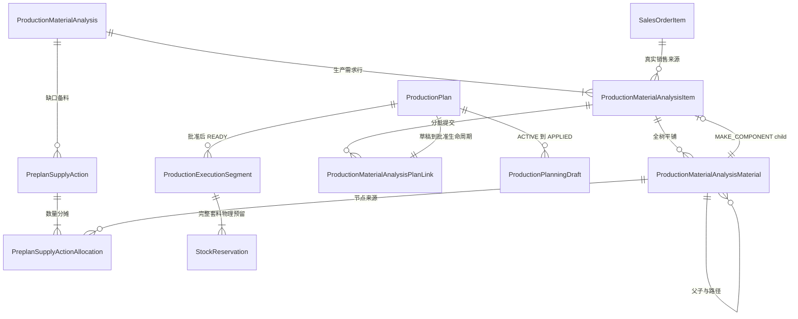
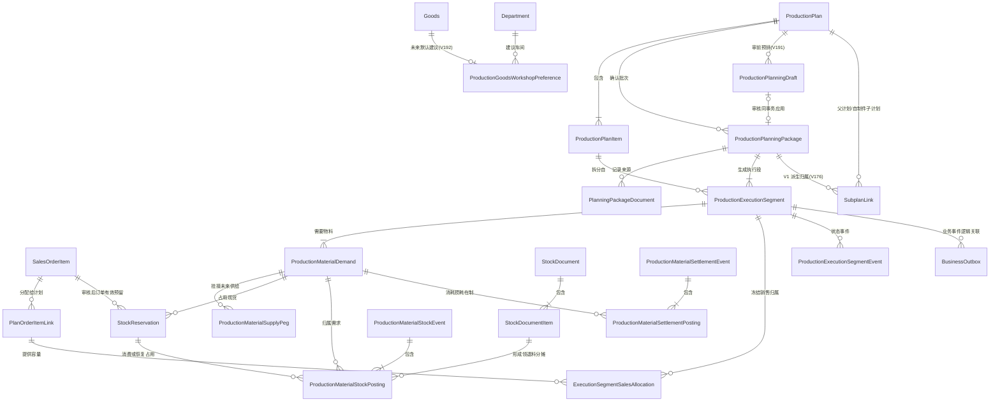

# 生产履约 V2 实体关系与数量权威

<!-- PRODUCTION-MATERIAL-ANALYSIS-V234-SOURCE-CANDIDATE -->
## 2026-08-08 当前决策：计划前需求与物料分析（V234 源码候选）

> **优先级**：本节及 [ADR-029](../99-决策记录-ADR/ADR-029-生产计划前需求与物料分析重构.md) 取代本文后续“先有正式计划，再做 V191 预排”“递归创建正式 MAKE 计划”“新建 WAITING/AUTO_WAIT/DEFERRED 正式段”的目标态描述。后续 V1 内容保留用于解释现有表、历史数据和兼容入口，不代表新流程继续产生这些事实。

新流程在正式 `production_plans` 之前增加独立的计划前领域，V234 源码候选用以下实际对象承载：

- `production_material_analyses`：一次分析聚合，保存选定单目标仓、版本、输入/预览指纹、分析时间和 `ACTIVE/PARTIALLY_PLANNED/COMPLETED/CANCELLED` 聚合状态；
- `production_material_analysis_items`：顶层生产需求行，承接真实 `SALES_ORDER_ITEM` 或 `REWORK/TRIAL/SAMPLE/STOCK/OTHER` 手工需求；`MAKE_COMPONENT` 只允许系统从 MAKE action 创建；保存 `requested_qty/submitted_qty/approved_qty`；
- `production_material_analysis_materials`：完整 BOM 树平铺节点，保留 `analysis_item_id/node_key/parent_node_key/path/depth`，同时保存主档建议、人工路线及本版本立即/预计数量快照；
- `goods.production_bom_policy`：`BOM_REQUIRED` 必须有有效 BOM，`DIRECT_MAKE` 明确允许无 BOM 直接自制，`NOT_PRODUCED` 禁止生产；不得因 BOM 行数为零推断 `DIRECT_MAKE`；
- `preplan_supply_actions` 与 `preplan_supply_action_allocations`：备料业务动作和逐分析节点数量分摊，精确回写真实采购申请、委外申请或 MAKE child 备料任务；通知只是投影；
- `production_material_analysis_commands`：PREVIEW/ROUTE/NOTIFY/GENERATE_PLAN 的幂等命令账；
- `production_material_analysis_plan_links`：分析 item 到计划草稿的分批数量归属，区分 `SUBMITTED/APPROVED/RELEASED/REVERSED`，并同步 item 的提交量/批准量；
- `production_plans.material_analysis_id/material_analysis_item_id`：正式计划回指来源分析 item；无 BOM 越权原因与越权人也保存在计划上。

共享物料调配不另建物理库存账：计划预览在一个目标仓内共享同一自由量池，人工调整只影响本次决策；批准时仍重新锁定和计算。已经被 READY 计划占用的库存必须先释放/反向，不能由分析页直接改写。



全树是分析视图，不是跨层需求合并：父产品只直接消耗其直接层组件；MAKE 节点的下层材料归属系统 `MAKE_COMPONENT` child item。子件未完工并合格入库前，只能影响预计齐套日，不能提高父需求可立即生产量。

当前完整套料的正数量批次可以生成计划草稿、`ACTIVE production_planning_drafts` 和 `SUBMITTED production_material_analysis_plan_links`，但此时不创建执行批次、物理预留、DRAW 或正式销售分摊。持 `production_plan:approve` 者批准时，才在一个事务把草稿批准并写 READY 执行批次、选定单目标仓的完整 `stock_reservations`、DRAW、销售分摊、plan link `APPROVED`、审计和 Outbox。持批准权者可显式 `approveNow`，生成与批准同事务全有或全无。未来采购、委外、MAKE 供给不得伪装成物理预留。

历史 WAITING/AUTO_WAIT/DEFERRED 不回填计划前实体，且在新工作台只读兼容；其完成或反向继续走受控旧链路。V234 结构详见[生产计划前需求与物料分析重构](../数据迁移/56-生产计划前需求与物料分析重构.md)。V234 目前仅有源码候选证据，不代表目标库已部署。

<!-- PRODUCTION-PLANNING-V195-CURRENT -->
## 2026-08-02 历史 V1 实体增量（V191–V195，兼容说明）

- `ProductionPlan 1 → N ProductionPlanningDraft`：历史草案保留，但每计划最多一个 `ACTIVE`；审核成功时 `ACTIVE→APPLIED`，覆盖时 `ACTIVE→SUPERSEDED`。
- `ProductionPlan 1 → 0..1 active ProductionPlanningPackage`：只有确认 V1 包可以持有执行段、物料需求和下游文档映射。
- `Goods 1 → 0..1 ProductionGoodsWorkshopPreference → Department`：未来默认建议，不是历史事实；只由无歧义成功安排学习。
- `ProductionMaterialDemand(MAKE) → ProductionMaterialSupplyPeg(PRODUCTION_PLAN_ITEM) → child ProductionPlanItem`：供给必须来自同父计划、同确认包的 `EXECUTION_V1` 直接层子计划。
- `FINISHED_IN item → ProductionMaterialMakeReceiptAllocation → supply peg / demand / reservation / DRAW item`：记录不可变回供来源和红冲事实，数量、预约、DRAW 与入库容量必须守恒。
- 执行段预排处置严格区分 `READY`、`AUTO_WAIT`、`DEFERRED`：`READY` 已整套占用；`AUTO_WAIT` 是系统缺料且到料后可自动齐套；`DEFERRED` 是用户主动延期，不参与自动提升。
- `release-defer` 只允许将已确认的 `DEFERRED` 单向人工放行：同事务解除延期、开启自动提升并立即重做齐套；齐套则进入 `READY`，仍缺料则进入 `AUTO_WAIT`，不能借此反向重设延期。
- 车间必须是生产部门 `DEPT_PROD` 的直属子部门，班组必须是所选车间直属子部门；负责人须为在职/试用且位于所选班组或车间组织路径内，计划开工不得晚于计划完工。
- A4“生产执行工卡”不持久化为权威实体；它只是确认包、执行段、需求、预约和 DRAW 的只读打印投影，名称策略为 `CURRENT_MASTER_DATA`。
- V195 仅在 V194 新增业务表之后刷新 fail-closed 审计触发器覆盖，只保护迁移后的未来写入，不回填历史业务行或历史审计。

<!-- PROCUREMENT-FINANCE-V202-CURRENT -->
## 2026-08-02 计划需求、订货财务审批与到货异常增量（V196–V202）

- 生产计划审核下达的是 `status=1` 采购申请/委外申请；申请只表达货品、数量、需求日期和仓库，采购/委外端只能查看，不能新建、编辑、审核、红冲或删除。
- `v_procurement_decomposition_tasks` 以 `open_qty = 申请量 - 已生效订货量 - 待财务审批占用量` 提供只读任务。使用者可跨申请选行和部分分解，但一张订货单只能一个供应商/委外商且一个仓库。
- 订货“保存并提交财务”先保存草稿，再创建财务审批实例；V229 起审批人由 `finance_order_approval:review` + 财务部门资格（或个人加授）决定，由 `WorkflowReviewerEligibility` 实时查库，超级管理员身份不能绕过对象校验。财务通过才将订单 `status=1` 并创建 `inbound_expectations`。
- 收货超过财务批准余量时，V201 先写 `PENDING_FINANCE` 异常并返回 `ARRIVAL_EXCEPTION_PENDING`，但不写库存、AP 或订单收货累计。财务可全批、自定义批准或不批；批准量仍须仓库再次审核，未批准量只生成原下单人的 `supplier_return_tasks`。
- V202 不是“只补三张异常表”的定向触发器迁移，而是在新增表后重新扫描全部 `public` 业务表，要求每表恰有一个启用的 AFTER ROW I/U/D 批准审计触发器；只保护迁移后的写入，不补造历史。

以上迁移已包含在公司目标库当前 V238 以内，源码继续到 V244；迁移存在不等于岗位 UAT、实物演练
或完整 IQC 已完成，生产仍为 **NO-GO**。

完整迁移和发布边界见[生产预排审核下达与车间建议](../数据迁移/52-生产预排审核下达与车间建议.md)。

> **文档版本**：v2.0
> **更新日期**：2026-08-09
> **代码基线**：`5097f8cc77bda2e84c04e1b80d893c5392bf8a55`
> **迁移范围**：V150–V230 为现有/候选历史链；V234 计划前需求与物料分析已有源码候选，但无目标库应用证据。目标环境版本必须以现场 `flyway_schema_history` 为准。

## 一、为什么需要独立模型

生产全链路同时包含“要生产什么”“需要什么料”“料现在在哪里”“未来由谁供应”“实际领退耗了多少”“成品属于哪张销售订单”等不同事实。它们不能塞进一个状态字段，也不能由页面临时 JOIN 猜出来。

V2 将事实拆成以下几类：

- 计划前履约：生产需求、来源、分析版本、全树节点、路线、备料动作和分批下达映射；
- 计划和执行：计划、计划明细、确认包、执行分段；
- 物料履约：需求、现货占用、采购/委外未来供给；
- 销售履约：订单有效预留、未来供给承诺、仓库作业与实际出库分层；
- 实物库存：库存单据、库存流水、即时余额；
- 领退耗结算：不可变事件和逐来源 posting；
- 销售归属：执行段到计划订单行的精确分摊；
- 异步旁路：Outbox、通知和读模型；
- 操作留痕：审计日志和语义事件。

## 二、核心实体关系



`BusinessOutbox` 通过聚合类型、聚合 ID 和 `dedupe_key` 逻辑关联业务实体，不依赖数据库外键；这允许消费者重试，但不允许重复累计业务数量。

## 三、表与职责

| 物理表/视图 | 权威职责 | 不能用它代替什么 |
|---|---|---|
| `production_material_analyses`（V234 源码候选） | 正式计划前一次持久化分析；目标仓、版本、指纹和聚合状态 | `ACTIVE/PARTIALLY_PLANNED/COMPLETED/CANCELLED` 不是计划审批状态；不是库存或正式计划 |
| `production_material_analysis_items`（V234 源码候选） | 销售/手工/MAKE_COMPONENT 生产需求行及 requested/submitted/approved 数量守恒 | 不能伪造销售来源；不能把 SUBMITTED 算成已下达 |
| `production_material_analysis_materials`（V234 源码候选） | 全树平铺节点、路径/父子归属、路线确认及立即/预计快照 | 不是批准时库存真相；不能丢路径后跨层合并需求 |
| `preplan_supply_actions` / `preplan_supply_action_allocations`（V234 源码候选） | 缺口备料动作、逐分析节点分摊及真实采购/委外/MAKE child 下游引用 | 通知、任务卡和 Outbox 不是该动作的权威状态；不是物理预留 |
| `production_material_analysis_commands`（V234 源码候选） | PREVIEW/ROUTE/NOTIFY/GENERATE_PLAN 幂等命令与结果引用 | 不能代替对应业务主表，也不能把失败请求当成功事实 |
| `production_material_analysis_plan_links`（V234 源码候选） | item 到计划草稿的分批数量归属；`SUBMITTED/APPROVED/RELEASED/REVERSED` | 不能代替销售执行分摊、批准事务、READY 批次或正式计划本身 |
| `production_plans` / `production_plan_items` | 上层生产计划及产品数量 | 不能表示逐次确认和具体执行批次 |
| `production_planning_packages` | 一次预览确认的身份、指纹、版本和幂等结果 | 不能直接充当车间执行任务 |
| `production_planning_drafts` | 草稿计划在审核前的不可变预排载荷、指纹和终结证据 | 不是计划包、执行分段、库存占用、采购/委外申请或 DRAW |
| `production_goods_workshop_preferences` | 按产品保存可修改的未来默认车间建议、选择次数和最后样本 | 不能代替执行分段上已确认的历史车间 |
| `production_planning_package_documents` | 计划包与来源单据关系 | 不能替代销售数量分摊 |
| `subplan_links` | 父计划到自制件子计划的派生关系（V176 加 `planning_package_id`+`source`） | 不是执行段；`source='EXECUTION_V1'` 标识 V1 派生，旧版/手动为空或其它 |
| `production_execution_segments` | 可派工、开工、报工、入库、结案的执行批次 | 不是新的父生产计划 |
| `production_material_demands` | 某执行段逐物料的基本单位需求快照 | 不能表示已经拿到的库存 |
| `production_material_supply_pegs` | 采购/委外未来供给及 V194 MAKE 直接层子计划明细对父需求的精确挂接 | 不能计入当前物理库存；仍须由审核入库和不可变分摊证明实际回供 |
| `purchase_requests/items`、`subcontract_applications/items` | 计划审核下达的已生效需求事实 | 不能保存供应商、价格、币种或结算信息；采购/委外端只读 |
| `v_procurement_decomposition_tasks` | 尚未分解数量的权威只读投影，扣除待财务审批占用 | 不是可写任务表，也不自动猜供应商或跨仓合单 |
| `workflow_responsibility_assignments` | **V229 已删除**（见 ADR-027） | 审批人改由 `finance_order_approval:review` + 财务部门资格决定；`procurement_order_approval_cases.assignee_*`/`procurement_arrival_exceptions.finance_assignee_*` 保留为历史快照，V229 起可空、新行为 NULL |
| `procurement_order_approval_cases/events` | 订货财务审批当前实例和追加式历史 | `PENDING/APPROVED/REJECTED` 不等于订单业务状态；只有通过才使订单 `status=1` |
| `inbound_expectations/items` | 财务批准后形成的预计到货及行快照 | 不是实物、库存、AP、质检合格或生产可用事实 |
| `procurement_arrival_exceptions/events` | 超财务批准余量的隔离、决定和追加式事件 | 不能在财务决定前过账，也不是完整 IQC |
| `supplier_return_tasks` | 财务未批准量交原下单人处理的责任任务 | 只能确认已退供应商，不能修改财务决定或扩大入库量 |
| `stock_reservations` | 销售审核后的订单承诺，或 READY 生产需求的现货占用；销售 `warehouse_id=NULL` 可表示未定发货仓 | 不改变在手，不等于未来供给、仓库拣货或实际出库 |
| `stock_balances` / `stock_movements` | 物理库存余额与逐笔增减 | 不能由工作台页面直接修改 |
| `production_material_stock_events/postings` | 领料、良品退料及其精确来源分摊 | 已接受记录禁止原地改写 |
| `production_material_settlement_events/postings` | 消耗、损耗、报废、合法在制等清料事实 | 不能绕过审批或结案门禁 |
| `execution_segment_sales_allocations` | 执行段精确归属到销售订单行 | 不能按货品名称临时 JOIN 猜归属 |
| `production_execution_segment_events` | 派工、开工、报工、入库、重开等语义事件 | 不能代替当前状态和累计字段 |
| `business_outbox` | 与主事务同写的可靠异步事件 | 不能承担业务主表写入 |
| `v_fulfillment_workbench_actions` | 仓库/采购/委外同源查询投影 | 只读，不是状态机或库存账本 |

### 3.1 五类库存/供给事实不得合并

| 事实 | 当前权威 | 说明 |
|---|---|---|
| 当前在手 | `stock_balances` + `stock_movements` | 只由审核生效的实物移动改变 |
| 当前有效预留 | `stock_reservations` | 减少 ATP/自由库存，不扣在手 |
| 未来供给 | `production_material_supply_pegs` 及来源单据 | 用于预计日期和缺口；待收/待检不是现货 |
| 仓库作业 | **目标实体，当前未完整落地** | 应表达绑定仓、分配、拣货、交接；不能塞进 reservation 状态 |
| 质量可用 | **目标状态/实体，当前未完整落地** | 到货待检、合格、隔离、不合格决定能否进入可分配池 |

委外还缺**供应商处我方库存/在制**目标实体：至少按供应商、地点、物料、颜色/批次、所有权、来源需求记录发出、耗用、退回、损耗和期末结存。它是明确的未落地目标，不能在 ER 图中伪装成现有物理表。

## 四、数量守恒

### 4.0 V2 计划前需求与分批下达

```text
计划前需求剩余量
= 需求总量 - 已取消量 - Σ有效正式计划下达分摊
>= 0

当前自由量(选定目标仓、货、色)
= 当前合格在手 - 有效统一预留 - 冻结量 - 安全库存
>= 0

可立即生产量
= min(
    计划前需求剩余量,
    floor(各直接领用组件当前自由量 / 每件基本单位用量)
  )
```

分析可展示其他有权仓库的库存分布和调拨候选，但可立即生产量只按一个选定目标仓计算，禁止跨仓直接求和。分析用共享分配之和不得超过分析截止时该目标仓自由量，但该约束只保证分析版本内部自洽；批准下达仍须重新锁定和计算。预计供给、待检库存、其他仓未完成调拨及 MAKE 未完工数量均不得进入上述当前自由量。

```text
Σ计划前需求的有效正式下达分摊 = 需求已下达量
Σ同一正式批次的计划前需求分摊 = 正式批次数量
Σ同一销售来源的有效分摊 <= 销售订单行有效剩余需求
```

### 4.1 V1 完整套料（历史 WAITING 兼容）

```text
立即可生产量
= min(
    订单/计划剩余未排量,
    floor((物料1自由库存 - 安全库存) / 单台基本用量1),
    ...,
    floor((物料N自由库存 - 安全库存) / 单台基本用量N)
  )
```

READY 段必须一次建立全部必需物料的有效占用。V234 新链路只创建 READY；下述 WAITING 规则仅解释历史兼容数据：WAITING 段只保留需求和未来供给挂接，不锁零散现货。

### 4.2 需求、占用和供给

```text
有效现货占用 = reservation.qty - consumed_qty - released_qty >= 0
有效未来供给 = peg.qty - received_qty - cancelled_qty >= 0
同一需求的有效覆盖量不得超过需求有效数量
```

V160 工作台“临时自由库存覆盖”只减少采购/委外建议，不写 `stock_reservations`；正式 WAITING→READY 时仍重新取锁并抢占完整套料。

### 4.3 销售归属

```text
Σ(执行段的有效销售分摊) = 执行段计划量
Σ(计划订单 link 被各执行段占用的分摊) <= link 有效容量
报工和成品入库累计 <= 对应执行段及销售分摊容量
```

这组约束避免同货品、多订单合并排产后把一个执行段重复显示到所有订单行。

### 4.4 领退耗与结案

```text
累计审核领用
= 已确认消耗
 + 已验收良品退料
 + 已审批损耗/报废
 + 合法在制结转
```

完成必须同时满足成品入库数量达标和物料清账。红冲沿原 posting 追加对称反向记录，不能按当前 BOM 重新猜历史来源。

### 4.5 委外供应商库存目标守恒

```text
累计发给供应商的我方物料
= 合格产出对应实际耗用
 + 良品退回
 + 不良品退回/隔离
 + 已审批损耗
 + 供应商处期末结存
```

申请、订单和回厂 supply peg 只证明供给来源与数量挂接，不能代替上述守恒、回厂 IQC 或合同损耗责任。

## 五、写入顺序

1. 服务端从已审核销售订单行或合法手工来源创建 `production_material_analyses` 和 `production_material_analysis_items`；此时不创建正式计划、销售已排量或库存占用。
2. 刷新分析时递归读取 BOM 并平铺写入 `production_material_analysis_materials`，每个节点保留 item 归属、父节点和路径；旧页面预览通过版本/指纹失效，不能继续提交。
3. 计划员在 material 节点人工确认路线。主档只是建议；偏离建议须有原因、`production_material_analysis:route` 和审计。`BOM_REQUIRED` 缺失时 fail-closed，单次越权使用独立权限且不修改主档。
4. 缺口先写幂等 `preplan_supply_actions` 和 `preplan_supply_action_allocations`，再生成真实 BUY 采购申请、SUBCONTRACT 委外申请或 MAKE `MAKE_COMPONENT` child 需求，并回写真实下游 ID。普通通知只由该动作投影。
5. 下游按现有采购、委外、订单审批、到货和 IQC 链履约。未合格入库前只更新预计量和预计齐套日；MAKE child 同样须完成自身分析、正式计划、报工及合格入库。
6. 用户选择一个或多个已有正数可立即生产量的计划前需求，选择一个目标仓并填写本次分批量。共享物料分析分配只作建议，不能代替批准时锁库存。
7. 普通生成校验 item、分析版本、路线、目标仓和数量后，只创建生产计划草稿、计划行、`ACTIVE production_planning_drafts` 与 `SUBMITTED production_material_analysis_plan_links`；link 同步 item 的 `submitted_qty`，不写执行段、预留、DRAW 或正式销售分摊。
8. 持 `production_plan:approve` 者批准时，按稳定顺序锁 item/link、草稿计划、销售来源、分析/BOM 版本和目标仓货色，重算当前完整套料；同一事务批准计划并写 READY 执行段、全部直接领用物料统一预留、DRAW、精确销售分摊、plan link `APPROVED`、审计和 Outbox。任一步失败全部回滚且不得留下部分预留。`approveNow` 仅对同时有 generate/approve 权限者开放，生成与批准同事务。
9. 正式 READY 计划不再挂未来供给来伪装齐套。采购/委外/MAKE action 的剩余数量仍归计划前需求，不能被正式计划重复消费。
10. DRAW 只确认领料需求；仓库确认实物发出后才减少物理库存并消费预留。报工、入库、退料和结案继续走现有权威链。
11. action 未形成真实下游时可撤回并留事件；已有申请、订单、预留、发料、报工或入库后，按来源执行取消/释放/红冲，禁止物理删除。
12. 历史 V191 计划绑定草案与 WAITING/AUTO_WAIT/DEFERRED 仅由隔离的兼容入口完成或反向；新链路不再写入。

## 六、并发、幂等和不可变性

- 同一命令用稳定幂等键和请求哈希识别；相同键不同载荷返回冲突。
- 上游行、需求、库存键和执行段按稳定顺序取锁，减少死锁。
- 库存按“仓库 + 货品 + 颜色”执行容量约束，禁止负可用和超分。
- 新物料需求只能从未删除的当前 `goods_bom_items` 产生；V181 数据库守卫保证活动边两端不是
  已删除或 `auto_created=true` 的历史锚。`production_plan_costs` 是历史展开快照，不得回流当前 MRP。
- V161 起，已接受的物料事件/posting 为 append-only；纠错只能追加反向事实。
- V162–V164 防止通用 CRUD 改写生产来源、供给分配或生产关联库存单据。
- V196/V201 的审批与到货异常事件同样 append-only；在途审批实例、订单来源和已绑定批准额度不得由通用 CRUD 偷换。
- Outbox 用唯一 `dedupe_key`、抢占锁、重试次数和人工处理状态避免重复投递。

V191–V202 均不改写老业务事实：老计划/明细/包/分段和历史 `status=1` 订货原样保留，不重算、不补造审批或异常历史、不重放订单生效副作用。V193/V195/V197/V202 只保证迁移后操作的审计触发器覆盖，不补历史审计。新实体和新状态只由迁移后主动预排、下达、分解、审批和到货操作产生。

## 七、当前边界

V234 迁移和配套代码目前只有源码候选证据；未核验目标库迁移、历史对账、真实岗位/实物 UAT 和发布签字，不能视为已落地或生产可用。以下能力仍未完成或未获生产证据：

- 有限产能 APS、冻结期插单重排和设备/工序优化；
- 替代料版本、审批和成本差异；
- 完整质量、不良品、超领/补料和返工/补产闭环；
- 采购/委外回厂最小待检隔离、检验结论和合格转可用；
- 仓库独立拣货与双方交接状态机；
- 源端 BOM 20,798 条 reject 的逐行隔离、业务认定与关键成品完整率签字；
- 按规则自动猜分供应商/委外商、跨仓合单及主动低库存补货；当前仅支持人工跨申请选行、单供应商/委外商且单仓库分解；
- 委外发料、在制、回厂质量和余料逐需求清账；
- 供应商处我方库存、所有权、批次和期末对账守恒；
- 历史开放单据迁移、零差异对账、生产压力及恢复演练。

> 自制件一层派生已落地（V1 confirm 对有 BOM 且净需求>0 的自制组件生成子 `production_plans` + `subplan_links(source='EXECUTION_V1')`，V176）；多层可经子计划逐级下钻。V194 候选进一步用供给 peg 与不可变收货分摊证明子计划合格入库回供父需求，并约束红冲和重新齐套；V196–V202 候选再补计划需求分解、订货财务审批、预计到货和超量数量授权，但不等于完整 IQC。目标环境仍只确认到 V190，尚未完成迁移、真实岗位 UAT 与发布签字，因此生产发布仍为 **NO-GO**。

V234 新写链路获准上线后，新业务不再由上述 V1 confirm 创建 WAITING 或递归正式 MAKE 子计划；它先通过 supply action 创建 MAKE child analysis item/备料任务，子件齐套后才分批生成 READY 正式计划。历史事实原样保留。

## 八、关联文档

- [生产订单排产与执行全链路需求](../07-业务链路/04-生产订单排产与执行全链路需求.md)
- [ADR-029：生产计划前需求与物料分析重构](../99-决策记录-ADR/ADR-029-生产计划前需求与物料分析重构.md)
- [V234 生产计划前需求与物料分析重构](../数据迁移/56-生产计划前需求与物料分析重构.md)
- [生产履约任务工作台](../03-页面/生产履约任务工作台.md)
- [生产执行分段与报工页](../03-页面/生产执行分段与报工页.md)
- [销售订单生产进度](../03-页面/销售订单生产进度.md)
- [2026-07-31 生产全链路实现与复核报告（历史基线）](../99-项目治理/2026-07-31-生产全链路实现与复核报告.md)
- [2026-08-01 全链路安全复核报告（当前候选）](../99-项目治理/2026-08-01-销售仓库生产采购委外全链路安全复核报告.md)
- [ADR-017：模块化单体与异步旁路](../99-决策记录-ADR/ADR-017-模块化单体与异步旁路.md)
- [ADR-019：计划需求分解与采购/委外财务审批](../99-决策记录-ADR/ADR-019-计划需求分解与采购委外财务审批.md)
