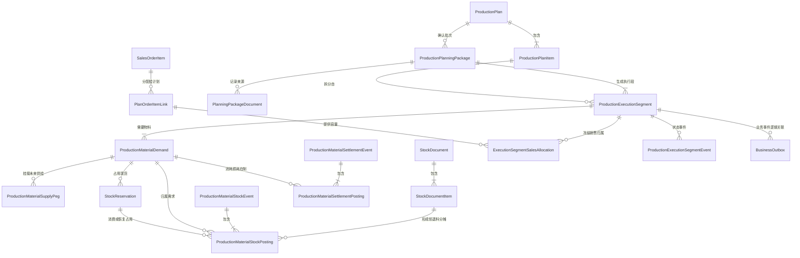

# 生产履约 V1 实体关系与数量权威

> **文档版本**：v1.0  
> **更新日期**：2026-07-31  
> **代码基线**：`5097f8cc77bda2e84c04e1b80d893c5392bf8a55`  
> **迁移范围**：生产履约 V150–V164；V149 为通知受众，V165 为保持 V148 不可变后的后续修复。

## 一、为什么需要独立模型

生产全链路同时包含“要生产什么”“需要什么料”“料现在在哪里”“未来由谁供应”“实际领退耗了多少”“成品属于哪张销售订单”等不同事实。它们不能塞进一个状态字段，也不能由页面临时 JOIN 猜出来。

V1 将事实拆成以下几类：

- 计划和执行：计划、计划明细、确认包、执行分段；
- 物料履约：需求、现货占用、采购/委外未来供给；
- 实物库存：库存单据、库存流水、即时余额；
- 领退耗结算：不可变事件和逐来源 posting；
- 销售归属：执行段到计划订单行的精确分摊；
- 异步旁路：Outbox、通知和读模型；
- 操作留痕：审计日志和语义事件。

## 二、核心实体关系



`BusinessOutbox` 通过聚合类型、聚合 ID 和 `dedupe_key` 逻辑关联业务实体，不依赖数据库外键；这允许消费者重试，但不允许重复累计业务数量。

## 三、表与职责

| 物理表/视图 | 权威职责 | 不能用它代替什么 |
|---|---|---|
| `production_plans` / `production_plan_items` | 上层生产计划及产品数量 | 不能表示逐次确认和具体执行批次 |
| `production_planning_packages` | 一次预览确认的身份、指纹、版本和幂等结果 | 不能直接充当车间执行任务 |
| `production_planning_package_documents` | 计划包与来源单据关系 | 不能替代销售数量分摊 |
| `production_execution_segments` | 可派工、开工、报工、入库、结案的执行批次 | 不是新的父生产计划 |
| `production_material_demands` | 某执行段逐物料的基本单位需求快照 | 不能表示已经拿到的库存 |
| `production_material_supply_pegs` | 采购/委外未来供给对需求的挂接 | 不能计入当前物理库存 |
| `stock_reservations` | 已被具体需求占用、尚未完全消费/释放的现货 | 不能表示预测在途 |
| `stock_balances` / `stock_movements` | 物理库存余额与逐笔增减 | 不能由工作台页面直接修改 |
| `production_material_stock_events/postings` | 领料、良品退料及其精确来源分摊 | 已接受记录禁止原地改写 |
| `production_material_settlement_events/postings` | 消耗、损耗、报废、合法在制等清料事实 | 不能绕过审批或结案门禁 |
| `execution_segment_sales_allocations` | 执行段精确归属到销售订单行 | 不能按货品名称临时 JOIN 猜归属 |
| `production_execution_segment_events` | 派工、开工、报工、入库、重开等语义事件 | 不能代替当前状态和累计字段 |
| `business_outbox` | 与主事务同写的可靠异步事件 | 不能承担业务主表写入 |
| `v_fulfillment_workbench_actions` | 仓库/采购/委外同源查询投影 | 只读，不是状态机或库存账本 |

## 四、数量守恒

### 4.1 完整套料

```text
立即可生产量
= min(
    订单/计划剩余未排量,
    floor((物料1自由库存 - 安全库存) / 单台基本用量1),
    ...,
    floor((物料N自由库存 - 安全库存) / 单台基本用量N)
  )
```

READY 段必须一次建立全部必需物料的有效占用；WAITING 段只保留需求和未来供给挂接，不锁零散现货。

### 4.2 需求、占用和供给

```text
有效现货占用 = reservation.qty - consumed_qty - released_qty >= 0
有效未来供给 = peg.qty - received_qty - cancelled_qty >= 0
同一需求的有效覆盖量不得超过需求有效数量
```

V160 工作台“临时自由库存覆盖”只减少采购/委外建议，不写 `stock_reservations`；正式 WAITING→READY 时仍重新取锁并抢占完整套料。

### 4.3 销售归属

```text
Σ(执行段的有效销售分摊) = 执行段计划量
Σ(计划订单 link 被各执行段占用的分摊) <= link 有效容量
报工和成品入库累计 <= 对应执行段及销售分摊容量
```

这组约束避免同货品、多订单合并排产后把一个执行段重复显示到所有订单行。

### 4.4 领退耗与结案

```text
累计审核领用
= 已确认消耗
 + 已验收良品退料
 + 已审批损耗/报废
 + 合法在制结转
```

完成必须同时满足成品入库数量达标和物料清账。红冲沿原 posting 追加对称反向记录，不能按当前 BOM 重新猜历史来源。

## 五、写入顺序

1. 预览只计算，不写计划包、执行段、库存占用、采购申请或领料单。
2. 确认时按稳定顺序锁订单/计划、仓货色和来源，校验预览指纹及版本。
3. 同一事务写计划包、执行段、需求、完整现货占用、未来供给挂接、精确销售分摊、领料来源和 Outbox。
4. 任一约束失败全部回滚，不允许计划成功但库存/采购/通知只成功一部分。
5. 仓库审核发料后才减少物理库存并消费占用；申请、预览、备料卡片都不扣库存。
6. 报工审核后更新合格累计；成品入库审核后才增加成品库存和销售可用进度。
7. 退料由仓库验收后才回原料可用库存；结案前再次校验物料与成品双门禁。

## 六、并发、幂等和不可变性

- 同一命令用稳定幂等键和请求哈希识别；相同键不同载荷返回冲突。
- 上游行、需求、库存键和执行段按稳定顺序取锁，减少死锁。
- 库存按“仓库 + 货品 + 颜色”执行容量约束，禁止负可用和超分。
- V161 起，已接受的物料事件/posting 为 append-only；纠错只能追加反向事实。
- V162–V164 防止通用 CRUD 改写生产来源、供给分配或生产关联库存单据。
- Outbox 用唯一 `dedupe_key`、抢占锁、重试次数和人工处理状态避免重复投递。

## 七、当前边界

本模型已经支持生产履约 V1，但不代表以下能力已经完成：

- 有限产能 APS、冻结期插单重排和设备/工序优化；
- 替代料版本、审批和成本差异；
- 完整质量、不良品、超领/补料和返工/补产闭环；
- 仓库独立拣货与双方交接状态机；
- 跨采购申请自动合单及主动低库存补货；
- 委外发料、在制、回厂质量和余料逐需求清账；
- 历史开放单据迁移、零差异对账、生产压力及恢复演练。

## 八、关联文档

- [生产订单排产与执行全链路需求](../07-业务链路/04-生产订单排产与执行全链路需求.md)
- [生产履约任务工作台](../03-页面/生产履约任务工作台.md)
- [2026-07-31 生产全链路实现与复核报告](../99-项目治理/2026-07-31-生产全链路实现与复核报告.md)
- [ADR-017：模块化单体与异步旁路](../99-决策记录-ADR/ADR-017-模块化单体与异步旁路.md)
