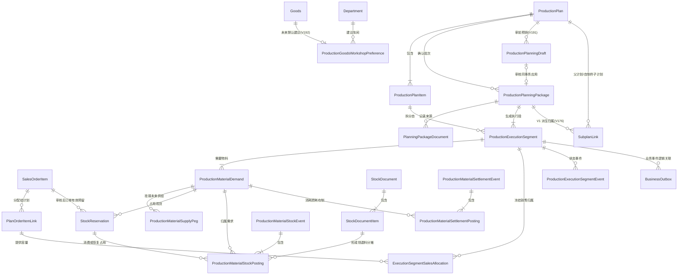

# 生产履约 V1 实体关系与数量权威

<!-- PRODUCTION-PLANNING-V195-CURRENT -->
## 2026-08-02 当前实体增量（V191–V195）

- `ProductionPlan 1 → N ProductionPlanningDraft`：历史草案保留，但每计划最多一个 `ACTIVE`；审核成功时 `ACTIVE→APPLIED`，覆盖时 `ACTIVE→SUPERSEDED`。
- `ProductionPlan 1 → 0..1 active ProductionPlanningPackage`：只有确认 V1 包可以持有执行段、物料需求和下游文档映射。
- `Goods 1 → 0..1 ProductionGoodsWorkshopPreference → Department`：未来默认建议，不是历史事实；只由无歧义成功安排学习。
- `ProductionMaterialDemand(MAKE) → ProductionMaterialSupplyPeg(PRODUCTION_PLAN_ITEM) → child ProductionPlanItem`：供给必须来自同父计划、同确认包的 `EXECUTION_V1` 直接层子计划。
- `FINISHED_IN item → ProductionMaterialMakeReceiptAllocation → supply peg / demand / reservation / DRAW item`：记录不可变回供来源和红冲事实，数量、预约、DRAW 与入库容量必须守恒。
- 执行段预排处置严格区分 `READY`、`AUTO_WAIT`、`DEFERRED`：`READY` 已整套占用；`AUTO_WAIT` 是系统缺料且到料后可自动齐套；`DEFERRED` 是用户主动延期，不参与自动提升。
- `release-defer` 只允许将已确认的 `DEFERRED` 单向人工放行：同事务解除延期、开启自动提升并立即重做齐套；齐套则进入 `READY`，仍缺料则进入 `AUTO_WAIT`，不能借此反向重设延期。
- 车间必须是生产部门 `DEPT_PROD` 的直属子部门，班组必须是所选车间直属子部门；负责人须为在职/试用且位于所选班组或车间组织路径内，计划开工不得晚于计划完工。
- A4“生产执行工卡”不持久化为权威实体；它只是确认包、执行段、需求、预约和 DRAW 的只读打印投影，名称策略为 `CURRENT_MASTER_DATA`。
- V195 仅在 V194 新增业务表之后刷新 fail-closed 审计触发器覆盖，只保护迁移后的未来写入，不回填历史业务行或历史审计。

完整迁移和发布边界见[生产预排审核下达与车间建议](../数据迁移/52-生产预排审核下达与车间建议.md)。

> **文档版本**：v1.2
> **更新日期**：2026-08-02
> **代码基线**：`5097f8cc77bda2e84c04e1b80d893c5392bf8a55`
> **迁移范围**：生产履约 V150–V164、V176 子计划归属，以及 V191 审前预排草案、V192 车间建议、V193 审计覆盖扫尾、V194 MAKE 供给生命周期/人工放行/组织约束与 V195 审计覆盖刷新（V191–V195 候选、待应用目标库；目标环境仍为 V190）。

## 一、为什么需要独立模型

生产全链路同时包含“要生产什么”“需要什么料”“料现在在哪里”“未来由谁供应”“实际领退耗了多少”“成品属于哪张销售订单”等不同事实。它们不能塞进一个状态字段，也不能由页面临时 JOIN 猜出来。

V1 将事实拆成以下几类：

- 计划和执行：计划、计划明细、确认包、执行分段；
- 物料履约：需求、现货占用、采购/委外未来供给；
- 销售履约：订单有效预留、未来供给承诺、仓库作业与实际出库分层；
- 实物库存：库存单据、库存流水、即时余额；
- 领退耗结算：不可变事件和逐来源 posting；
- 销售归属：执行段到计划订单行的精确分摊；
- 异步旁路：Outbox、通知和读模型；
- 操作留痕：审计日志和语义事件。

## 二、核心实体关系



`BusinessOutbox` 通过聚合类型、聚合 ID 和 `dedupe_key` 逻辑关联业务实体，不依赖数据库外键；这允许消费者重试，但不允许重复累计业务数量。

## 三、表与职责

| 物理表/视图 | 权威职责 | 不能用它代替什么 |
|---|---|---|
| `production_plans` / `production_plan_items` | 上层生产计划及产品数量 | 不能表示逐次确认和具体执行批次 |
| `production_planning_packages` | 一次预览确认的身份、指纹、版本和幂等结果 | 不能直接充当车间执行任务 |
| `production_planning_drafts` | 草稿计划在审核前的不可变预排载荷、指纹和终结证据 | 不是计划包、执行分段、库存占用、采购/委外申请或 DRAW |
| `production_goods_workshop_preferences` | 按产品保存可修改的未来默认车间建议、选择次数和最后样本 | 不能代替执行分段上已确认的历史车间 |
| `production_planning_package_documents` | 计划包与来源单据关系 | 不能替代销售数量分摊 |
| `subplan_links` | 父计划到自制件子计划的派生关系（V176 加 `planning_package_id`+`source`） | 不是执行段；`source='EXECUTION_V1'` 标识 V1 派生，旧版/手动为空或其它 |
| `production_execution_segments` | 可派工、开工、报工、入库、结案的执行批次 | 不是新的父生产计划 |
| `production_material_demands` | 某执行段逐物料的基本单位需求快照 | 不能表示已经拿到的库存 |
| `production_material_supply_pegs` | 采购/委外未来供给及 V194 MAKE 直接层子计划明细对父需求的精确挂接 | 不能计入当前物理库存；仍须由审核入库和不可变分摊证明实际回供 |
| `stock_reservations` | 销售审核后的订单承诺，或 READY 生产需求的现货占用；销售 `warehouse_id=NULL` 可表示未定发货仓 | 不改变在手，不等于未来供给、仓库拣货或实际出库 |
| `stock_balances` / `stock_movements` | 物理库存余额与逐笔增减 | 不能由工作台页面直接修改 |
| `production_material_stock_events/postings` | 领料、良品退料及其精确来源分摊 | 已接受记录禁止原地改写 |
| `production_material_settlement_events/postings` | 消耗、损耗、报废、合法在制等清料事实 | 不能绕过审批或结案门禁 |
| `execution_segment_sales_allocations` | 执行段精确归属到销售订单行 | 不能按货品名称临时 JOIN 猜归属 |
| `production_execution_segment_events` | 派工、开工、报工、入库、重开等语义事件 | 不能代替当前状态和累计字段 |
| `business_outbox` | 与主事务同写的可靠异步事件 | 不能承担业务主表写入 |
| `v_fulfillment_workbench_actions` | 仓库/采购/委外同源查询投影 | 只读，不是状态机或库存账本 |

### 3.1 五类库存/供给事实不得合并

| 事实 | 当前权威 | 说明 |
|---|---|---|
| 当前在手 | `stock_balances` + `stock_movements` | 只由审核生效的实物移动改变 |
| 当前有效预留 | `stock_reservations` | 减少 ATP/自由库存，不扣在手 |
| 未来供给 | `production_material_supply_pegs` 及来源单据 | 用于预计日期和缺口；待收/待检不是现货 |
| 仓库作业 | **目标实体，当前未完整落地** | 应表达绑定仓、分配、拣货、交接；不能塞进 reservation 状态 |
| 质量可用 | **目标状态/实体，当前未完整落地** | 到货待检、合格、隔离、不合格决定能否进入可分配池 |

委外还缺**供应商处我方库存/在制**目标实体：至少按供应商、地点、物料、颜色/批次、所有权、来源需求记录发出、耗用、退回、损耗和期末结存。它是明确的未落地目标，不能在 ER 图中伪装成现有物理表。

## 四、数量守恒

### 4.1 完整套料

```text
立即可生产量
= min(
    订单/计划剩余未排量,
    floor((物料1自由库存 - 安全库存) / 单台基本用量1),
    ...,
    floor((物料N自由库存 - 安全库存) / 单台基本用量N)
  )
```

READY 段必须一次建立全部必需物料的有效占用；WAITING 段只保留需求和未来供给挂接，不锁零散现货。

### 4.2 需求、占用和供给

```text
有效现货占用 = reservation.qty - consumed_qty - released_qty >= 0
有效未来供给 = peg.qty - received_qty - cancelled_qty >= 0
同一需求的有效覆盖量不得超过需求有效数量
```

V160 工作台“临时自由库存覆盖”只减少采购/委外建议，不写 `stock_reservations`；正式 WAITING→READY 时仍重新取锁并抢占完整套料。

### 4.3 销售归属

```text
Σ(执行段的有效销售分摊) = 执行段计划量
Σ(计划订单 link 被各执行段占用的分摊) <= link 有效容量
报工和成品入库累计 <= 对应执行段及销售分摊容量
```

这组约束避免同货品、多订单合并排产后把一个执行段重复显示到所有订单行。

### 4.4 领退耗与结案

```text
累计审核领用
= 已确认消耗
 + 已验收良品退料
 + 已审批损耗/报废
 + 合法在制结转
```

完成必须同时满足成品入库数量达标和物料清账。红冲沿原 posting 追加对称反向记录，不能按当前 BOM 重新猜历史来源。

### 4.5 委外供应商库存目标守恒

```text
累计发给供应商的我方物料
= 合格产出对应实际耗用
 + 良品退回
 + 不良品退回/隔离
 + 已审批损耗
 + 供应商处期末结存
```

申请、订单和回厂 supply peg 只证明供给来源与数量挂接，不能代替上述守恒、回厂 IQC 或合同损耗责任。

## 五、写入顺序

1. 草稿预览只计算；保存只写 V191 `ACTIVE` 预排草案，不写计划包、执行段、占用、采购/委外或 DRAW。
2. 计划审核时锁定 `ACTIVE` 草案，按稳定顺序锁计划、仓货色和来源，重算并校验指纹/版本。
3. 同一审核事务写已审计划、计划包、执行分段、需求、READY 整套占用/DRAW、BUY 采购草稿、SUBCONTRACT 委外草稿、精确销售分摊、Outbox，并将草案终结为 `APPLIED`。
4. MAKE 只按本包当前直接 BOM 层聚合派生子计划：A→B→D 时 A 只建 B，进入 B 再建 D；禁止父包递归生成全部层级。
5. 任一约束失败时计划审核和全部下游一起回滚；已审无包可后续补建，已审有包只读回放。
6. 首次下达成功的无歧义车间和执行段后续成功 assign 可更新 V192 建议；空/多车间、失败事务和幂等 replay 不学习。
7. DRAW 审核只确认领料需求；仓库按行分轮 `issue`、确认实物发出后才减少物理库存并消费占用。
8. 报工审核后更新合格累计；成品入库审核后才增加成品库存和销售可用进度。
9. 退料由仓库验收后才回原料可用库存；结案前再次校验物料与成品双门禁。

## 六、并发、幂等和不可变性

- 同一命令用稳定幂等键和请求哈希识别；相同键不同载荷返回冲突。
- 上游行、需求、库存键和执行段按稳定顺序取锁，减少死锁。
- 库存按“仓库 + 货品 + 颜色”执行容量约束，禁止负可用和超分。
- 新物料需求只能从未删除的当前 `goods_bom_items` 产生；V181 数据库守卫保证活动边两端不是
  已删除或 `auto_created=true` 的历史锚。`production_plan_costs` 是历史展开快照，不得回流当前 MRP。
- V161 起，已接受的物料事件/posting 为 append-only；纠错只能追加反向事实。
- V162–V164 防止通用 CRUD 改写生产来源、供给分配或生产关联库存单据。
- Outbox 用唯一 `dedupe_key`、抢占锁、重试次数和人工处理状态避免重复投递。


V191–V195 均不改写老业务事实：老计划/明细/包/分段原样保留，不重算、不补造、不从历史 `department_id` 猜车间偏好。V193/V195 只保证迁移后操作的审计触发器覆盖，不补历史审计。新实体和新状态只由迁移后主动预排、下达、人工放行和后续派工产生。
## 七、当前边界

本模型已经支持生产履约 V1，但不代表以下能力已经完成：

- 有限产能 APS、冻结期插单重排和设备/工序优化；
- 替代料版本、审批和成本差异；
- 完整质量、不良品、超领/补料和返工/补产闭环；
- 采购/委外回厂最小待检隔离、检验结论和合格转可用；
- 仓库独立拣货与双方交接状态机；
- 源端 BOM 20,798 条 reject 的逐行隔离、业务认定与关键成品完整率签字；
- 跨采购申请自动合单及主动低库存补货；
- 委外发料、在制、回厂质量和余料逐需求清账；
- 供应商处我方库存、所有权、批次和期末对账守恒；
- 历史开放单据迁移、零差异对账、生产压力及恢复演练。

> 自制件一层派生已落地（V1 confirm 对有 BOM 且净需求>0 的自制组件生成子 `production_plans` + `subplan_links(source='EXECUTION_V1')`，V176）；多层可经子计划逐级下钻。V194 候选进一步用供给 peg 与不可变收货分摊证明子计划合格入库回供父需求，并约束红冲和重新齐套；目标环境仍为 V190，尚未完成迁移、真实岗位 UAT 与发布签字，因此生产发布仍为 **NO-GO**。

## 八、关联文档

- [生产订单排产与执行全链路需求](../07-业务链路/04-生产订单排产与执行全链路需求.md)
- [生产履约任务工作台](../03-页面/生产履约任务工作台.md)
- [生产执行分段与报工页](../03-页面/生产执行分段与报工页.md)
- [销售订单生产进度](../03-页面/销售订单生产进度.md)
- [2026-07-31 生产全链路实现与复核报告（历史基线）](../99-项目治理/2026-07-31-生产全链路实现与复核报告.md)
- [2026-08-01 全链路安全复核报告（当前候选）](../99-项目治理/2026-08-01-销售仓库生产采购委外全链路安全复核报告.md)
- [ADR-017：模块化单体与异步旁路](../99-决策记录-ADR/ADR-017-模块化单体与异步旁路.md)
