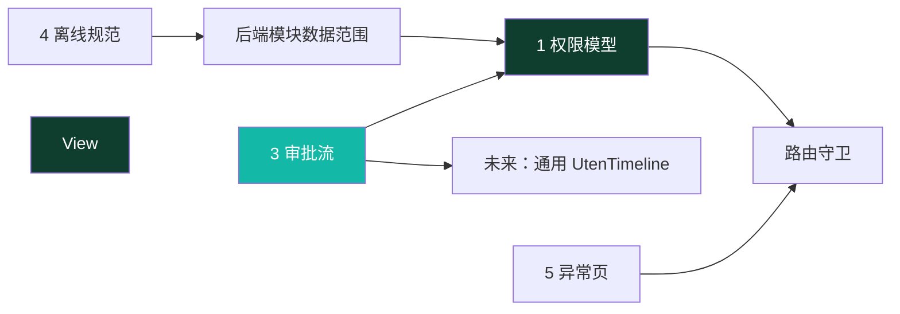
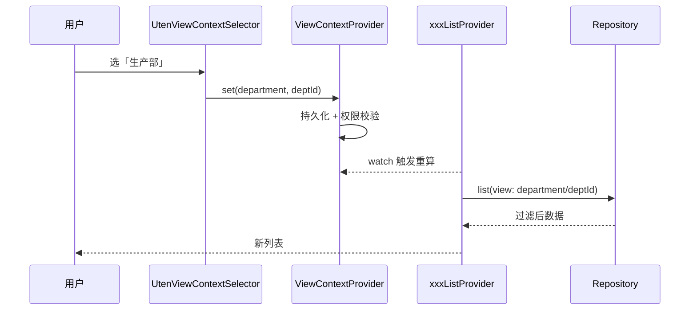
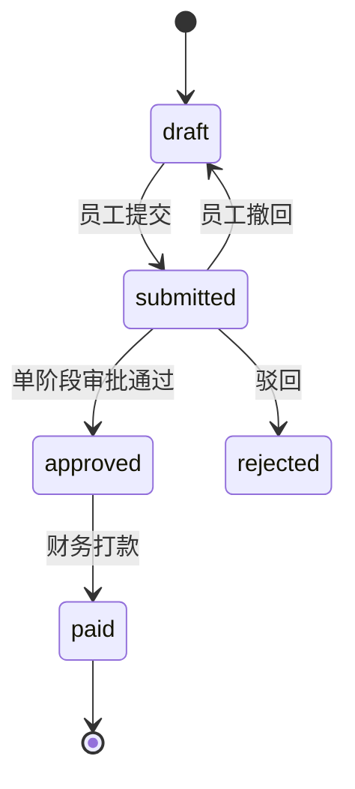
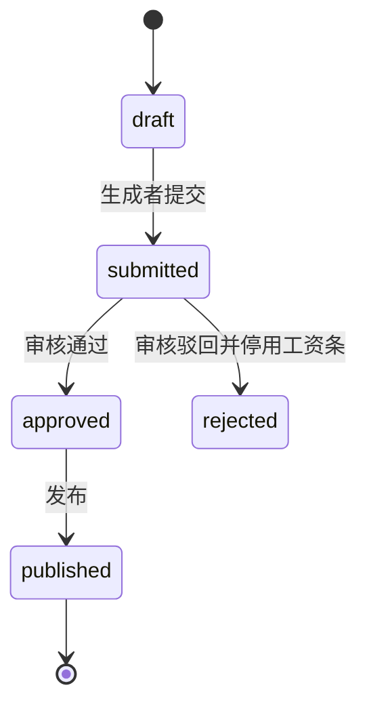

# 全局机制（跨页面状态与流程）

> 本档定义 Uten IMP **横跨多个页面/模块**的全局机制，是所有业务页面的地基。
>
> 配套文档：
> - 权限：[10-安全准则](../00-项目准则/10-安全准则.md) + [安全策略](安全策略.md)（§十为权威）
> - 路由：[路由设计](路由设计.md)
> - 状态：[状态管理](状态管理.md)
> - 数据：[实体字典](../04-数据模型/实体字典.md) + [ER草图](../04-数据模型/ER草图.md)

---

## 〇、本档涵盖（产品机制 + 服务端一致性机制）

| # | 机制 | 一句话 | 落地形态 | 状态 |
|---|---|---|---|---|
| 1 | 权限模型与路由守卫 | 部门配置 + 个人覆盖 + 按权限点脱敏；any/all 路由、页面和数据三层校验；V135 令牌授权版本；V141 员工敏感写拆分 | 前端守卫 + 后端授权/对象守卫 + `auth_version`/`epoch` | 🟡 源码主体已实施；对象越权、V135/V141 目标库与真实权限矩阵未闭环 |
| 2 | 管理视角上下文选择器（历史提案） | 曾计划在「全公司/部门/员工/自己」间切换 | 无源码；当前各模块由后端直接实施数据范围 | ⛔ 未采用，不能作为现有能力 |
| 3 | 审批流建模 | 可配置多级审批，员工报销/工资条复用统一轨迹模型 | `ApprovalNode` + `ApprovalRecord` + `UtenTimeline` | 🟡 通用模型仍为目标；V133 已用业务表状态/操作人/时间戳落地固定流程结构 |
| 4 | 离线与乐观更新规范 | 只读缓存 / 乐观更新 / 离线排队 / 必须在线 四档策略 | 现仅定规范；落地时建统一 `OfflineActionQueue` | 🟡 规范定稿，未实施 |
| 5 | 异常页与引导 | 统一 404 空状态；无权限 redirect + Toast；引导推迟 | `errorBuilder` + Toast | ✅ 主体已实施（首次引导仍未做） |
| 6 | 应用操作审计 | 进入应用的业务 API 请求全方法留痕，关键事件补语义、公开业务表补脱敏 before/after | `AuditRequestContextFilter` + MVC interceptor + `AuditService` + DB triggers | ✅ V169/V171/V172/V173 主体与定向测试已落地；生产容量、边缘日志联查和故障演练仍待验收 |
| 7 | 报表物化视图刷新 | 6 个 MV 默认每 5 分钟逐个并发刷新，多实例互斥 | scheduler + advisory lock + V131 状态表 | 🟡 源码已落地，生产同构/告警待验收 |
| 8 | 关联数量不变量 | 数据库关闭并发超收/超发/超退竞态 | V132 的 12 个触发器 | 🟡 源码已落地，并发/历史纠偏待验收 |
| 9 | 导出资源控制 | 每用户频率、单次行数、进程并发、独立权限、加密与审计 | ExportRateLimiter/Interceptor | 🟡 主体已落地，多实例总并发/容量待验收 |
| 10 | 迁移证据模型 | 输入指纹、实际消费文件、对账、reject 与未来 checkpoint | JSON+sha256 manifest + V134 | 🟡 追溯结构已落地；增量 loader/全模块结构化对账未实现 |

**依赖关系**：



---

## 一、权限模型与路由守卫

> **2026-07-24 重构（V27–V30，[ADR-011](../99-决策记录-ADR/ADR-011-工作台部门分区与动态权限配置.md)）**：角色体系已下线。**现行模型**：
>
> ```
> 有效权限 = 全员基础（employee 包，人人有份）
>          ∪ 部门配置（department_permissions，所在部门 + 所有上级部门递归向上并集）
>          ∪ 个人加授 − 个人收回（user_permission_overrides）
>          （超级管理员恒为全量）
> ```
>
> - 权限目录动态化（`GET /admin/permission-catalog`），新功能在 Flyway 迁移里登记权限点即可被超管分配；
> - `/admin/permissions` 是账号支持与授权管理的共享壳：持 `account:support` 或
>   `authorization:manage` 任一权限可进入；support-only 只渲染账号列表/状态/重置密码，不请求
>   权限目录、有效权限、个人覆盖、数据范围或部门授权；真正授权管理仍只允许超管；
> - `audit_log:view` / `audit_log:export` 是调查证据权限例外：超级管理员因固有全量权限天然具备；
>   非超管只能通过个人覆盖点名加授，不能进入部门权限或随部门树继承。部门权限服务与 V173 数据库
>   触发器都会拒绝绕过；回收查看权限后，V135 令旧 access token 在下一请求失效；
> - 数据范围由后端按模块实施。客户入口需要 `client:view`；客户归属可见性为公共数据 + 本人 +
>   `user_data_scopes(scope=client)` 授权归属人，持 `client:view:all` 或超管才可见全部；
> - 配置写库后仍吊销相关用户 refresh token；V135 同时递增用户 `auth_version` 或共享授权
>   `epoch`，旧 staff access token 在下一次请求版本复查时立即 401；
> - 敏感字段脱敏按权限点（`employee:pii:view` / `employee:compensation:view`），**不再按角色名**。

### 1.1 设计决策

| 问题 | 决策 |
|---|---|
| 权限粒度 | **权限点为主**（2026-07-24 起角色已下线，仅作 JWT roles claim / DataAccessPolicy 历史兼容） |
| 多来源用户 | 全员基础 ∪ 部门配置（含上级部门递归）∪ 个人覆盖，取**并集**（个人收回优先） |
| 无权限访问受保护路由 | redirect 到 `/dashboard` + 全局 Toast「无权限访问该页面」，**不做独立 403 页** |
| 菜单/按钮无权限 | 直接 `hide`（不渲染），**绝不 disable** |
| 数据范围 | **后端权威且按模块定义**；客户/货品使用 owner 范围，销售单据复用销售 owner 范围；前端只消费后端下发的 `writable` 等能力 |
| 账号/授权共享入口 | `/admin/permissions` 路由接受 `account:support` 或 `authorization:manage`；support-only 仅账号支持区，授权/部门/数据范围区必须 `authorization:manage` 且后端再次校验超管 |
| 审计证据权限 | 超级管理员天然具备；非超管只允许个人覆盖点名加授 `audit_log:view` / `audit_log:export`，禁止部门配置与继承；查看是查询前提，导出还需 export |
| 菜单显隐数据源 | 工作台模块区与路由守卫共用 `permission_by_path` 的 any/all 两类契约，单一映射不再两处维护 |
| 生效时效 | 配置写库并吊销 refresh；V135 用户版本/全局 epoch 不匹配使旧 staff access 下一请求立即 401，仍须目标库、覆盖矩阵和性能验收 |

### 1.2 权限点常量（节选）

> 完整清单见 [`lib/shared/auth/permissions.dart`](../../lib/shared/auth/permissions.dart)。它的目标是与后端
> `permissions.code` 对齐，但当前仍是人工维护，不能宣称天然一一对应；新增权限必须同时更新 Flyway、前端策略并通过自动契约测试。

```dart
// lib/shared/auth/permissions.dart（节选）
abstract final class Perm {
  // 员工档案 / 部门
  static const employeeView = 'employee:view';
  static const employeeEdit = 'employee:edit';
  static const employeePiiView = 'employee:pii:view';
  static const employeePiiEdit = 'employee:pii:edit';
  static const employeeCompensationView = 'employee:compensation:view';
  static const employeeCompensationEdit = 'employee:compensation:edit';
  static const departmentView = 'department:view';
  // V130 起：authorization:manage 仅超管管理授权；account:support 供 HR 日常账号支持。
  static const accountSupport = 'account:support';
  static const authorizationManage = 'authorization:manage';

  // 工资条（数据范围分级）
  static const payrollViewSelf = 'payroll:view:self';
  static const payrollViewAll = 'payroll:view:all';
  static const payrollGenerate = 'payroll:generate';
  static const payrollReview = 'payroll:review';

  // 报销审批
  static const expenseApprove = 'expense:approve';

  // 访客
  static const visitorApprove = 'visitor:approve';
  static const visitorHostConfirm = 'visitor:host-confirm';
  static const visitorCheckIn = 'visitor:check-in';

  // 个人信息自助（Phase 6）
  static const profileEditSelf = 'profile:edit:self';
  static const profileReview = 'profile:review';
  // 业务模块（各单据 :view / :edit + 报表 *_report:view）
  // 采购 / 销售 / 委外 / 仓库 / 库存 / 生产 / 钱流 / 基础资料 …（详见源文件）

  // 客户资料：入口权限 + 查看全部权限；具体 owner 集由后端 user_data_scopes 判定
  static const clientView = 'client:view';
  static const clientEdit = 'client:edit';
  static const clientViewAll = 'client:view:all';
}
```

> **历史角色映射（`rolePermissions` Map）已于 2026-07-24（V29）下线**。后端 `PermissionResolver` 合成有效权限时不再读 `user_roles` / `department_roles`（数据保留作 JWT roles claim 兼容）。前端权限判定一律走 `currentPermissionsProvider`（来自后端合成结果），**不再在前端平行合成角色映射**。

### 1.3 当前用户权限 Provider

```dart
// lib/shared/auth/permissions.dart

/// 当前用户的功能权限集合（**直接用后端合成结果**，前端不再二次合成）。
///
/// 超级管理员（UserProfile.superAdmin == true）后端已经把全量 permissions 推过来；
/// 这里对超管额外 union 所有已知 Perm 常量作兜底（即便后端漏推某个新增权限也能 work）。
final currentPermissionsProvider = Provider<Set<String>>((ref) {
  final user = ref.watch(sessionProvider).user;
  if (user == null) return const <String>{};
  if (user.superAdmin) {
    return <String>{
      Perm.employeeView, Perm.employeeEdit,
      Perm.accountSupport, Perm.authorizationManage,
      Perm.payrollViewSelf, Perm.payrollViewAll, Perm.payrollGenerate,
      Perm.payrollReview, Perm.payrollPublish, Perm.payrollExport,
      Perm.expenseApply, Perm.expenseApprove, Perm.expensePay,
      Perm.profileEditSelf, Perm.profileReview,
      Perm.employeeCompensationView,
      // … 全部已知常量（采购/销售/委外/仓库/生产/钱流/基础资料）
      ...user.permissions,
    };
  }
  return user.permissions.toSet();
});

/// 通用权限判定。超管短路放行，其他按字符串匹配。
bool hasPerm(Ref ref, String code) {
  if (ref.read(isSuperAdminProvider)) return true;
  return ref.read(currentPermissionsProvider).contains(code);
}
```

要点：
- **`AppUser.can()` 不再对持 admin 角色短路**（V30 安全加固）；只认 `superAdmin || permissions.contains(perm)`，与后端 `@PreAuthorize` 语义一致。
- 前端 `currentPermissionsProvider` 是后端合成结果的**视图**，不参与"角色 → 权限"推导——单一事实来源在后端。

### 1.4 路由 → 所需权限点（集中管理）

```dart
// lib/core/router/permission_by_path.dart

/// 返回某路径所需的权限点列表（**任一满足**即放行）；不需要权限返回 null。
/// 这是路由守卫与工作台显隐共用的唯一数据源。
List<String>? requiredAnyPermFor(String location) {
  // 共享页面：任一权限可进入，页面内部按能力分区；后端仍独立授权。
  if (location == RouteName.adminPermissions) {
    return const [Perm.accountSupport, Perm.authorizationManage];
  }
  // 审计中心与原设备本机回执使用独立调查权限。
  if (location == RouteName.adminAuditLogs ||
      location == RouteName.deviceAuditReceipts) {
    return const [Perm.auditLogView];
  }
  // 系统设置及当前其它 admin 页面仍属于授权/高危管理。
  if (location == RouteName.adminSystemSettings ||
      location.startsWith('/admin/')) {
    return const [Perm.authorizationManage];
  }
  // 员工档案（按段区分 view/create/edit）
  if (location == '/employee' || location.startsWith('/employee/')) { ... }

  // /finance/customers 是 ClientCategoryPage 的路由别名；入口权限与后端一致
  if (location.startsWith('/finance/customers')) {
    return const [Perm.clientView];
  }

  // 采购 hub：任一采购单据 view 即可见
  if (location == RouteName.purchase) {
    return const [
      Perm.purchaseRequestView, Perm.purchaseOrderView,
      Perm.purchaseReceiptView, Perm.purchaseReturnView,
    ];
  }
  // ... 销售 / 委外 / 仓库 / 生产 / 钱流 同模式
  return null;
}

/// 返回必须全部具备的权限；普通路由返回空列表。
List<String> requiredAllPermsFor(String location) {
  if (location == '/employee/onboarding') {
    return const [Perm.employeeCreate, Perm.employeePiiEdit];
  }
  return const [];
}

/// 兼容旧签名：对"任一满足"的多权限路径只返回第一个（最低门槛）。
String? requiredPermFor(String location) =>
    requiredAnyPermFor(location)?.first;
```

> 路由守卫只判“能否进入功能”，不决定能看到哪些对象。客户页以 `client:view` 作为入口；
> `OwnerVisibility` 在后端根据 `client:view:all`、本人和 `user_data_scopes` 过滤对象。详情、编辑和
> 导出仍分别在后端执行对象级与动作级校验。需要组合门槛的功能用
> `requiredAllPermsFor`；入职必须同时拥有 `employee:create` 与 `employee:pii:edit`，不能错误地
> 表达成“任一满足”。

### 1.5 三层校验

| 层 | 位置 | 做法 |
|---|---|---|
| **路由级** | `app_router.dart` redirect | any 集合至少命中一个，且 all 集合全部命中；否则返回 `/dashboard` |
| **页面级** | 导航项 / 入口卡 / 按钮 | `.where((item) => hasPerm(item.perm))` 直接 hide |
| **数据级** | 后端 Service/Policy | 根据当前身份、对象 owner、显式数据范围授权和 `*:view:all` 过滤，详情/写操作再次校验 |

```dart
// redirect 追加权限校验（在现有登录校验之后）
redirect: (context, state) {
  // …现有登录校验…
  final perms = ref.read(currentPermissionsProvider);
  final isSuper = ref.read(isSuperAdminProvider);
  final requiredAny = requiredAnyPermFor(state.matchedLocation);
  final requiredAll = requiredAllPermsFor(state.matchedLocation);
  if (!isSuper &&
      ((requiredAny != null && requiredAny.none(perms.contains)) ||
       !requiredAll.every(perms.contains))) {
    ref.read(globalToastProvider.notifier).show(l10n.errNoPermission);
    return RouteName.dashboard;
  }
  return null;
},
```

### 1.6 权限刷新与即时失效

权限变更保存即写库（`department_permissions` / `user_permission_overrides` 直写），并：
- **保存部门配置** → 吊销该部门子树（含下级）所有用户 refresh token；
- **保存个人覆盖** → 吊销该用户 refresh token；
- **V135 access 版本** → 个人授权、用户角色、员工部门、超管/员工绑定变化递增用户
  `auth_version`；部门权限、共享角色/权限以及部门树层级/软删变化递增全局授权 `epoch`；
- staff JWT 写入 `av`/`ae`，`JwtAuthFilter` 每次请求通过一次数据库投影同时校验账号状态和两个版本；
  不匹配立即 401，重登后新 token 带新权限；
- 源码默认 access TTL 为 15 分钟，V133 只将未修改的旧默认 480 收敛为 15；明确自定义值保留。

> V135 仍是“源码已实现、待运行验收”。目标库未应用 V135 时旧机制不成立；上线前必须覆盖个人
> grant/revoke、用户角色、员工换部门、部门树移动/软删、共享定义、超管和 employee 绑定变化，
> 并验证旧 token 立即 401、事务回滚不误增版本及逐请求查询 P95/P99。

### 1.7 对照清单

- [ ] 路由策略、入口卡片、按钮权限和后端授权已通过自动契约/正反向矩阵证明全覆盖
- [x] 菜单项/入口卡用 `where(hasPerm)` 过滤，无 `disable`
- [x] redirect 接入权限校验，无权限跳工作台 + Toast
- [x] 超管走 `superAdmin` 字段短路（不再对 admin 角色短路）
- [ ] 关键写操作均有专属权限点，并已验证普通查看权限不能调用高风险写接口
- [x] 配置变更吊销 refresh token 强制重登

---

## 二、管理视角上下文选择器（历史提案，未采用）

> **状态**：⛔ 没有 `ViewContextProvider`、`UtenViewContextSelector` 或对应 Repository 参数，
> 也没有页面可依赖该机制。下文仅保留早期方案背景，不是待上线功能的现行契约。
> 当前数据范围由后端的模块 Policy 直接判定；客户/货品和销售单据使用 owner 范围模型。
> Flyway 中遗留的 `viewcontext:scoped` 尚无运行时代码消费者，后续应在确认无外部依赖后用新迁移清理。

### 2.1 概念

一个全局状态，记录"当前查看的数据范围"。切换后，所有**跟随视角**的页面/Provider 自动按此范围过滤数据。

### 2.2 视角档位

```dart
// lib/shared/providers/view_context_provider.dart（待新建）

enum ViewScope {
  self,        // 我自己（默认，全员）
  department,  // 某部门全员
  employee,    // 下钻到某员工
  company,     // 全公司
}

class ViewContext {
  final ViewScope scope;
  final String? departmentId;  // scope=department 时
  final String? employeeId;    // scope=employee 时
  const ViewContext({this.scope = ViewScope.self, this.departmentId, this.employeeId});
}
```

### 2.3 可见范围（按权限点 `viewcontext:scoped` 联动，不再按角色）

| 用户持有权限 | 可选视角 | 说明 |
|---|---|---|
| 无 `viewcontext:scoped` | 仅 self | 看不到选择器 |
| 持有 `viewcontext:scoped` | self / department / employee | 部门/员工维度 |
| 持有 `viewcontext:scoped` 且被授 `*:all` 范围 | + company | 加全公司 |
| 超管 | 全部 | 含 company |

> 以上是未采用方案的设想，不适用于当前客户/销售 owner 范围模型。

### 2.4 UI：全局 AppBar 右侧选择器

- 组件：`UtenViewContextSelector`（`lib/components/navigation/uten_view_context_selector.dart`，待新建）
- 位置：`UtenAppBar` 的 `actions`，所有跟随页统一注入
- 交互：下拉/弹层，列出当前用户可选视角；选 department/company 后二级选具体部门/范围
- 默认：`self`；选择持久化到后端 `user_preferences`（key 带权限前缀，下次启动恢复，但启动时校验是否仍有权）
- 文案走 i18n

```
┌──────────────────────────────┐
│ 工作台          [全公司 ▼] ⚙  │  ← 选择器在 AppBar 右侧，齿轮是设置
├──────────────────────────────┤
```

### 2.5 跟随视角的页面矩阵

| 页面 | 是否跟随 | 说明 |
|---|---|---|
| 工作台 Dashboard | ✅ | KPI 按范围汇总 |
| 工资条列表 | ✅ | hr/manager 按范围列工资条（员工永远只看自己） |
| 报销列表 | ✅ | finance/manager 按范围列报销 |
| 员工档案 | ✅ | 直接按 department/employee 展示 |
| 工资条生成 | ✅ | 按部门生成 |
| 财务报表 | ✅ | 按范围汇总 |
| 通知列表 | ❌ | 通知按发布范围（部门/工种/全员），不按视角 |
| 建议箱 | 部分 | 「我的建议」不变；「建议广场」可按部门筛 |
| 我的 / 设置 | ❌ | 个人页，不跟随 |

### 2.6 技术实现

```dart
final viewContextProvider = NotifierProvider<ViewContextNotifier, ViewContext>(
  ViewContextNotifier.new,
);

abstract interface class PayrollRepository {
  Future<List<PayrollSlip>> list({required ViewContext view, PayrollFilter? filter});
}

final payrollListProvider =
    FutureProvider.family<List<PayrollSlip>, PayrollFilter>((ref, filter) async {
  final view = ref.watch(viewContextProvider);   // 切视角 → 重拉
  return ref.read(payrollRepositoryProvider).list(view: view, filter: filter);
});
```

> 实施时：Repository 把 `view` 透传给 API（`?scope=department&deptId=xx`），后端按权限点二次校验（防越权）。

### 2.7 数据流



### 2.8 对照清单（实施前）

- [x] 本节确认为历史草图，未实现类型不得被业务代码引用
- [x] 当前数据范围改由各模块后端 Policy 权威实施
- [ ] 确认无外部依赖后，通过新迁移清理遗留 `viewcontext:scoped` 权限点

---

## 三、审批流建模（可配置多级）

> **状态**：🟡 目标设计，未形成生产闭环。
> 现状：工资条与员工报销前端已经切换 Dio，V133 已建立业务表，并在批次/申请上保存固定流程的
> 状态、操作人和时间戳；通用审批轨迹组件 `UtenTimeline`、`ApprovalNode` 和
> `ApprovalRecord` 仍未落地。下述可配置多级状态机是目标设计，不能据此宣称当前已完成通用审批。

### 3.1 为什么要多级

制造业报销常跨部门（出差报销要主管批 + 财务批），单级审批上线后必然要改。前端一开始就按多级建模，避免返工。

### 3.2 通用审批模型（脱离具体业务）

> 把原实体字典里的 `ExpenseApproval` 收敛为通用 `ApprovalRecord`（带 entityType 区分），新增 `ApprovalNode`（流程定义）。详见 [实体字典](../04-数据模型/实体字典.md)。

```dart
/// 审批流程节点定义（可配置，按 flowType 分模板）
/// 例：报销流程 = [节点1 直属主管, 节点2 财务]
class ApprovalNode {
  final String id;
  final ApprovalFlowType flowType;   // expense / payroll
  final int order;                    // 顺序，从 1 开始
  final String name;                  // 「直属主管审批」
  final String? approverRole;         // 历史字段：谁来批（已改按权限点 expense:approve/payroll:review）
}

/// 一次审批动作的记录（轨迹的一格）
class ApprovalRecord {
  final String id;
  final ApprovalFlowType entityType;  // expense / payroll
  final String entityId;              // 报销单/工资条 ID
  final int nodeOrder;                // 第几节点
  final String? approverId;           // 实际审批人
  final ApprovalDecision decision;    // pending / approved / rejected
  final String? comment;              // 审批意见
  final DateTime? actedAt;
}

enum ApprovalFlowType { expense, payroll }
enum ApprovalDecision { pending, approved, rejected }
```

> 注：角色下线后，"谁来批"由权限点（`expense:approve` / `payroll:review`）决定，不再绑定 `approverRole`。

### 3.3 报销审批流（ExpenseClaim）

**当前固定流程**：员工创建并提交 → 有 `expense:approve` 权限的非申请人通过或驳回 → 有
`expense:pay` 权限的非申请人打款。当前不是主管 + 财务的多级审批。



`REVIEWING` 状态在 V133 中预留，服务允许把它与 `SUBMITTED` 一样审批或撤回，但当前没有
进入/推进多级节点的接口。`REJECTED` 是终态，不会自动回到草稿。打款使用行锁并在同一事务内
扣减账户、生成一般费用单、对账记录和总账凭证；相同参数重试幂等，不同参数重复付款冲突。

### 3.4 工资条审批流（PayrollSlip / PayrollBatch）



批次生命周期是 `DRAFT / SUBMITTED / APPROVED / REJECTED / PUBLISHED`。工资条在创建草稿时
已经生成；发布只改变工资条状态和员工可见性。`REJECTED` 是终态，修正时创建新批次。员工
查看/下载记录在工资条 `viewed_at/downloaded_at`，不混入批次状态。

`payroll:generate/review/publish` 是独立权限点，但当前未强制制单、复核、发布必须由不同账号执行；
是否采用四眼原则仍需业务确认并由后端强制。

### 3.5 审批轨迹 UI（当前与目标）

- 报销详情页目前按申请单的创建、提交、通过/驳回、付款时间字段合成私有
  `_ApprovalTimeline`，没有持久化逐节点意见。
- 工资审核页目前只显示批次状态、操作时间和驳回原因，不展示时间线。
- `UtenTimeline`、`ApprovalNode`、`ApprovalRecord` 仍是未来多级审批方案；未决定采用多级审批前，
  不得用目标模型描述当前数据。

### 3.6 权限与并发

- 权限点：`expense:apply/approve/pay`、`payroll:generate/review/publish/view:self/view:all/export`。
- 报销禁止申请人自审、自付；工资目前没有制单/复核/发布人员分离校验。
- 两个领域的状态变更均通过数据库悲观行锁和状态前置条件防止并发覆盖，不使用 `If-Match`。
- 报销申请人可在 `SUBMITTED/REVIEWING` 撤回到 `DRAFT`；已审批后不能撤回。

### 3.7 对照清单

- [x] V133 业务表、固定状态字段、操作人/时间戳和约束
- [x] 报销/工资源码状态机、Dio 仓储和后端 API
- [x] 状态变更使用行锁和状态前置条件
- [ ] 业务确认报销是否需要主管 + 财务多级审批、意见留存和附件
- [ ] 业务确认工资四眼原则并在后端强制
- [ ] 真实 PostgreSQL 并发、幂等、权限矩阵和端到端验收
- [ ] 若采用多级审批，再落地 `ApprovalNode` / `ApprovalRecord` / 通用时间线并同步 ER

---

## 四、离线与乐观更新规范

> **状态**：🟡 规范定稿，未实施。
> 现状：真实业务模块列表/详情断网时由 `ApiException` 统一报错；工资条与员工报销已切 Dio，
> 后端不可用时也应明确报错，不得回退 Mock。这不代表具备离线能力。
> 本节为后续离线能力落地的统一规范，避免每个页面各写各的。

### 4.1 目标操作分级策略（待实现）

> 下表描述后续离线能力的目标分级，不代表当前代码已经具备缓存、乐观更新或离线重放。

| 操作类型 | 策略 | 示例 |
|---|---|---|
| **只读列表** | 离线缓存上次成功结果 + 顶部「离线缓存」提示 | 工资条/报销/通知/建议列表 |
| **乐观更新** | 本地立即生效 + 后台异步同步，失败回滚 + Toast | 点赞、标记已读、全部已读 |
| **离线排队** | 写本地队列，恢复网络后按序重放，冲突用版本号 | 提交报销、提交建议、撤回、标记下载、提交建议回复 |
| **必须在线** | 断网直接 Toast「请检查网络后重试」，不排队 | PDF 下载、附件下载、审批动作、工资条生成、加密导出 |

### 4.2 OfflineActionQueue 统一设计（实施时落地）

```dart
class PendingAction {
  final String id;
  final String entityType;       // 'expense' / 'notice' / ...
  final String entityId;
  final String action;           // 'submit' / 'withdraw' / 'markRead' / ...
  final Map<String, dynamic> payload;
  final PendingStatus status;    // pending / syncing / failed
  final int retryCount;
  final DateTime createdAt;
  final int version;             // 乐观锁，防并发覆盖
}
```

- Worker：监听网络状态，恢复后按 `createdAt` 顺序重放
- 重试：指数退避，超阈值进死信 + 告警
- 冲突：服务端返回 409 → 按 `version` 决定覆盖/提示用户

### 4.3 各页面的目标离线要求（汇总，均待逐页实现）

| 页面 | 目标只读缓存 | 目标乐观更新 | 目标离线排队 | 必须在线 |
|---|---|---|---|---|
| 工资条列表/详情 | 待实现 | — | 待实现：标记 viewed/downloaded | PDF 下载 |
| 报销列表/详情 | 待实现 | — | 待实现：提交/撤回/删除、草稿 | — |
| 新建报销 | — | — | 草稿离线保存 | 提交（可排队）|
| 通知列表/详情 | 待实现 | 待实现：标记已读、全部已读 | 待实现：标记已读排队 | 附件下载 |
| 建议箱 | 待实现 | 待实现：点赞 | 待实现：提交建议/回复 | — |
| 加密导出 | — | — | — | ✅（数据外发，必须在线 + 限流 + 审计） |

### 4.4 安全

- 匿名建议的真名脱敏**必须由后端统一处理**，前端拿到的数据已脱敏，前端不参与脱敏逻辑
- 离线能力实施后，队列里的 PII payload 必须使用经过评审的平台安全存储或加密数据库，并按账号隔离、退出清除和设置过期时间

### 4.5 对照清单（实施前）

- [ ] 每个列表页明确属于哪一档离线策略（本文档已列）
- [ ] Repository 接口预留 `fromCache` / `syncQueue` 入参
- [ ] 离线提示文案进 i18n（`offlineCachedHint` 等）

---

## 五、异常页与引导

### 5.1 404 页（路由不存在）

`app_router.dart` 的 `errorBuilder` 用 `UtenEmpty` 美化：

```
┌──────────────────────────┐
│        🧭 (exploring)     │
│      页面走丢了            │
│   你访问的页面不存在        │
│      [返回工作台]          │
└──────────────────────────┘
```

- 用 `UtenEmpty(icon: Icons.travel_explore, title: l10n.errNotFound, action: UtenButton → go dashboard)`
- 保留原 `error.toString()` 仅在 debug 模式小字显示

### 5.2 无权限（"403"）

- **不做独立页**
- 路由级：redirect 到 `/dashboard` + 全局 Toast「无权限访问该页面」（见 §1.5）
- 组件级：直接 hide

### 5.3 首次登录引导 `/onboarding`

- **仍未实施**
- 预留路由 `RouteName.onboarding = '/onboarding'`，登录后首次进入时检测标志位决定是否走引导

### 5.4 全局 Toast 机制

- 上述无权限提示、离线提示、会话失效提示需要一个**全局 Toast/Snackbar Provider**
- 现状：`ScaffoldMessenger.of(context)` 散落各页，跨页触发困难
- 待新建：`lib/shared/providers/global_feedback_provider.dart`，提供 `showToast(msg)` / `showSnack(msg)`（路由守卫 / AuthInterceptor 间接路径都用得上）

---

## 六、服务端全局一致性与运维机制

### 6.1 应用操作审计

审计分为三层。`AuditRequestContextFilter` 在 CORS、JWT 与 MVC 前建立 Request ID、计时和已验证
操作人快照，MVC 内由 `UserOperationAuditInterceptor` 落库，未进入 MVC 或尚未成功落库的请求由
Filter 兜底。审计存储正常时，进入应用的 `GET/POST/PUT/PATCH/DELETE/HEAD /api/**` 正常请求、
匿名认证、401、CORS 非法来源 403、404/405 与前置异常都有请求记录；有效 JWT 的 404/405 仍能归属
账号，无效或过期令牌不绑定操作人。`OPTIONS`、静态资源和健康检查不视为用户业务操作。

登录、导出、配置、敏感证据读取等由 `AuditService` 补显式语义；V169 为公开业务表变化补齐同事务
`AFTER` 触发器并保存脱敏 before/after。请求层不保存 query 值和正文，避免复制密码、令牌和 PII。
通用请求审计写入失败会告警但不改写已完成的业务响应；审计详情、本机回执授权和敏感下载则在显式
审计失败时 fail closed。TLS、反向代理或网关在请求进入应用前的拒绝由边缘访问日志负责。

审计列表、统计、详情与本机回执核查要求 `audit_log:view`；导出还需 `audit_log:export`。除超级管理员
固有全权限外，两者只能个人点名加授。本机目标回执每次读取前必须联网让服务端重新授权并记录
`verify_local_audit_receipt`，拒绝、离线或接口失败时不得读取本地目标数据。

### 6.2 报表刷新与查询资源

- V131 为 `finance_ar_ap_mv`、`production_monthly_mv`、`purchase_monthly_mv`、
  `sales_monthly_mv`、`stock_monthly_mv`、`subcontract_monthly_mv` 记录刷新状态。
- scheduler 源码默认每 5 分钟逐个执行 `REFRESH MATERIALIZED VIEW CONCURRENTLY`；
  多实例用 PostgreSQL advisory lock 避免重复刷新。每个视图独立记成功/失败，不因一个失败停止其余视图。
- 通知可见性/未读过滤和计数在数据库完成，列表最多 500 条；全部已读集合更新，批量删除最多 500 条。
- 导出有独立权限、每用户频率、单次行数、进程内并发（源码默认 2）、强制文件密码与 Agile AES-256 加密和审计。
  多实例时并发闸门按实例计算，仍需全平台容量控制与压测。

### 6.3 关联数量数据库不变量

V132 的 12 个触发器保护采购、销售、委外累计收/发/退/损耗数量，利用行级更新串行化关闭
“两个事务同时看到相同剩余量”的竞态。新增负数及累计增加超过来源数量会被拒绝；历史超量数据
不会自动修复，只允许纠偏减少。服务层仍需状态机、权限、幂等和可理解的约束错误映射。

### 6.4 迁移证据

导出同时生成 `export_manifest.json` 与 `export_manifest.sha256`，JSON 绑定 checksum 清单本身的
SHA；`migrate.sh` 会验证两份清单和每个实际 CSV，并把输入、脚本、代码和映射版本写入 V134
追溯表。V134 另提供结构化对账、reject 和 future checkpoint 表，但各模块尚未统一写入，
增量 loader 也未实现；`SUCCESS` 不能替代 `reconciliation_status = PASSED`。

### 6.5 对象级授权

`@PreAuthorize` 只回答“能否进入某类功能”，列表过滤只回答“正常列表能看到什么”；详情、更新、
删除、审核、红冲、驳回、批量和上游引用必须再次按目标对象校验。当前销售单据对象级归属守卫
尚未覆盖所有入口，是 NO-GO 阻断，不能用前端隐藏或 UUID 难猜作为缓解。

---

## 七、全局机制对照清单（开发前总自检）

- [x] 权限：`permission_by_path` + `currentPermissionsProvider` + redirect 三件套接好
- [x] 权限：菜单/按钮全 `hide`，无 `disable`
- [x] 权限：超管走 `superAdmin` 字段，不对 admin 角色短路
- [x] 权限：配置变更吊销 refresh token 强制重登
- [ ] 权限：所有列表/详情/写/批量入口使用同一对象级数据范围守卫，并覆盖已知 UUID 越权测试
- [x] 视角：旧全局选择器提案未采用，页面不得依赖不存在的 Provider/组件
- [ ] 数据范围：各模块列表/详情/写/批量/引用/导出使用同一后端 Policy 并有负向测试
- [x] 审批：员工报销/工资条固定状态机、真实 API 和行锁源码
- [ ] 审批：单阶段/多阶段、附件和工资四眼原则完成业务决策
- [ ] 审批：真实数据库并发、幂等、权限矩阵和 E2E
- [ ] 审批：若采用多级模型，再同步 `ApprovalNode`/`ApprovalRecord`、ER 和通用时间线
- [ ] 离线：每页明确离线策略档位，Repository 预留参数
- [x] 异常：404 用 `UtenEmpty`，无权限 redirect + Toast
- [ ] 全局：`globalFeedbackProvider` 提供统一 Toast
- [x] 审计：业务 API 全方法请求层 + 显式安全/业务事件 + V169 公开业务表脱敏 before/after 已落地并完成定向测试
- [ ] 审计：生产容量、边缘日志联查、告警恢复、留存归档和六端真机证据完成生产同构演练
- [ ] 报表：6 个 MV 刷新新鲜度、失败恢复、多实例锁和告警通过生产同构验证
- [ ] 迁移：输入文件登记、结构化 reject/对账、增量 checkpoint 与回滚均有可复现证据

---

## 八、禁忌

🚫 禁止在业务页散落 `MediaQuery` / `ScaffoldMessenger` 做权限或 Toast（走统一 Provider）
🚫 禁止用 `disable` 表达无权限（一律 hide）
🚫 禁止把页面合成的时间线描述为持久化审批记录
🚫 禁止在业务未决定前把目标多级审批描述成现有能力
🚫 禁止在前端做匿名脱敏（后端统一）
🚫 禁止离线逻辑各页各写（统一 `OfflineActionQueue`）
🚫 禁止把审批/视角/数据范围权限只放前端（后端必须二次校验）
🚫 禁止对持 admin 角色的用户短路放行（V30 起：只认 `superAdmin` 字段）
🚫 禁止把列表过滤当作详情/写操作的对象级授权
🚫 禁止把迁移脚本 `SUCCESS` 当作数据对账 `PASSED`

---

## 九、落地排期

| 机制 | 状态 | 说明 |
|---|---|---|
| 权限模型 + 路由守卫 | 🟡 源码主体已实施 | ADR-011 + V130 + V135 + V141；即时失效、敏感写、自动契约、对象越权矩阵和逐请求性能待生产验收 |
| 视角选择器 | ⛔ 未采用 | 当前无源码；如未来重新立项，应重新做权限与接口设计，不复用本文旧草图 |
| 审批流状态机 | 🟡 固定流的 V133 表与 API 源码已实现，待生产验收 | 通用 `ApprovalNode/Record` 未实现；审批口径、权限矩阵、并发和会计副作用待验证 |
| 审批流通用轨迹组件 | 🟡 设计定稿 | `UtenTimeline` + `ApprovalNode` 待实施 |
| 离线规范 | 🟡 规范定稿 | 现仅文档；后续按需落地 `OfflineActionQueue` |
| 异常页 + 全局 Toast | 🟡 主体已实施 | 404 美化已做；`globalFeedbackProvider` 待统一抽取 |
| 审计中心与应用操作留痕 | 🟡 主体已实施 | V169/V171/V172/V173 已覆盖请求、显式事件、公开业务表变化、只读核查、设备证据、加密导出及两阶段留存；生产容量、边缘联查与恢复演练待验收 |
| 报表 MV 刷新 | 🟡 源码已实施 | V131 + scheduler；生产多实例、失败恢复和新鲜度告警待验收 |
| 关联数量约束 | 🟡 源码已实施 | V132；并发、历史异常纠偏和错误响应待验收 |
| 迁移证据/增量 | 🟡 结构已实施 | manifest 与 V134 追溯已落地；全模块对账/reject 和增量 loader 未完成 |

---

## 十、相关文档

- [10-安全准则](../00-项目准则/10-安全准则.md) — 权限点与存储分级
- [安全策略 §十](安全策略.md) — 数据导出/高危配置安全规范（权威）
- [路由设计](路由设计.md) — 路由表与 redirect
- [状态管理](状态管理.md) — Provider 分层
- [实体字典](../04-数据模型/实体字典.md) — ApprovalNode / ApprovalRecord
- [ER草图](../04-数据模型/ER草图.md) — 审批关系
- [页面总览 §4.4](../03-页面/页面总览.md) — 视角选择器原始需求
- [ADR-011](../99-决策记录-ADR/ADR-011-工作台部门分区与动态权限配置.md) — 权限模型重构

---

**最后更新**：2026-07-30（对齐 V130/V135 权限边界、V133 固定审批结构与迁移/业务验收边界）
