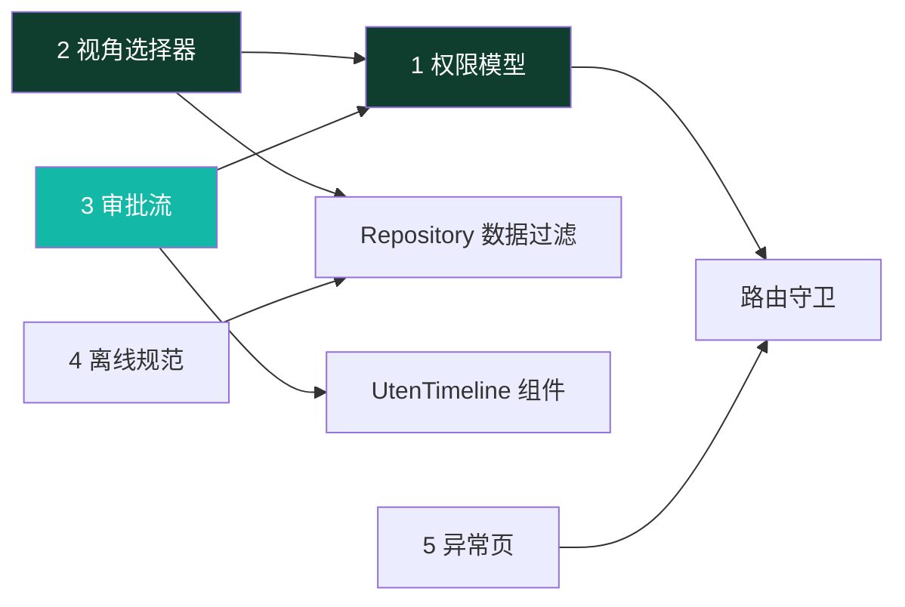
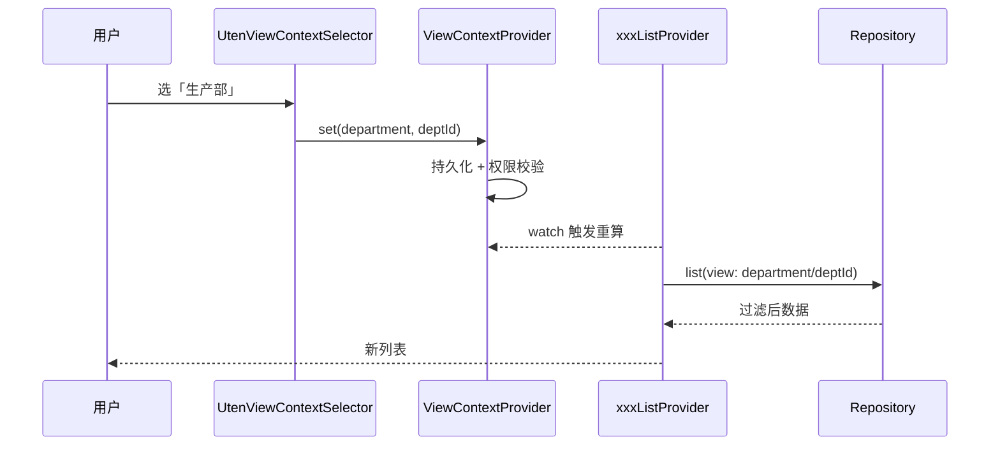
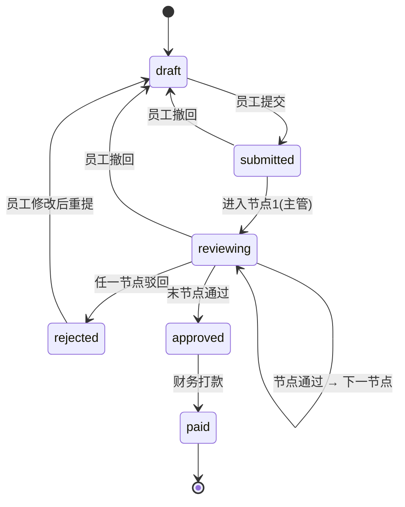
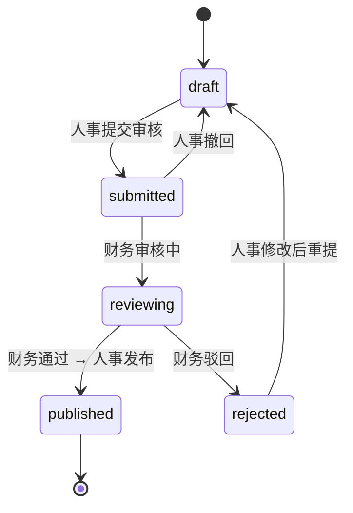

# 全局机制（跨页面状态与流程）

> 本档定义 Uten IMP **横跨多个页面/模块**的全局机制，是 Phase 2+ 所有角色端页面的地基。
> 这些机制不定下来，后面每个页面都要返工。
>
> 配套文档：
> - 权限：[10-安全准则](../00-项目准则/10-安全准则.md) + [安全策略](安全策略.md)
> - 路由：[路由设计](路由设计.md)
> - 状态：[状态管理](状态管理.md)
> - 数据：[实体字典](../04-数据模型/实体字典.md) + [ER草图](../04-数据模型/ER草图.md)

---

## 〇、本档涵盖（五个机制 + 依赖关系）

| # | 机制 | 一句话 | 落地形态 |
|---|---|---|---|
| 1 | 权限模型与路由守卫 | 角色并集 + 功能点，路由级/页面级/数据级三层校验 | `permission_by_path` + `currentPermissionsProvider` + redirect |
| 2 | 管理视角上下文选择器 | 领导/人事在「全公司/部门/员工/自己」间切换数据范围 | `ViewContextProvider` + `UtenViewContextSelector` |
| 3 | 审批流建模 | 可配置多级审批，报销/工资条复用统一轨迹模型 | `ApprovalNode` + `ApprovalRecord` + `UtenTimeline` |
| 4 | 离线与乐观更新规范 | 只读缓存 / 乐观更新 / 离线排队 / 必须在线 四档策略 | 现阶段只写规范，后端阶段落地 `OfflineActionQueue` |
| 5 | 异常页与引导 | 统一 404 空状态；无权限 redirect + Toast；引导推迟 | errorBuilder + Toast |

**依赖关系**：



---

## 一、权限模型与路由守卫

> **⚠️ 2026-07-24 重构（V27–V30，[ADR-011](../99-决策记录-ADR/ADR-011-工作台部门分区与动态权限配置.md)）**：角色体系已下线，本节 1.1/1.2 中"角色级为主""角色 → 权限点映射"的内容仅作历史参考。**现行模型**：
>
> ```
> 有效权限 = 全员基础（employee 角色包，人人有份）
>          ∪ 部门配置（department_permissions，所在部门 + 所有上级部门向上并集）
>          ∪ 个人加授 − 个人收回（user_permission_overrides）
>          （超级管理员恒为全量）
> ```
>
> - 权限目录动态化（`GET /admin/permission-catalog`），新功能在迁移里登记权限点即可被超管分配；
> - 权限管理页：按部门配权限 / 按员工两态（已授权·未授权）调整；
> - 数据范围用分级权限点 `资源:动作:范围`（如 `customer:view:self/department/all`），路由守卫用 `requiredAnyPermFor`（任一满足）；
> - 配置写库即时；变更后吊销相关用户 refresh token，强制重新登录即时生效；
> - 敏感字段脱敏按权限点（`employee:pii:view` / `employee:compensation:view`），不再按角色名。

### 1.1 设计决策

| 问题 | 决策 |
|---|---|
| 权限粒度 | **权限点为主**（2026-07-24 起，角色已下线）；历史：角色级为主 + 关键写操作加功能点 |
| 多来源用户 | 全员基础 ∪ 部门配置 ∪ 个人覆盖，取**并集**（收回优先） |
| 无权限访问受保护路由 | redirect 到 `/dashboard` + 全局 Toast「无权限访问该页面」，**不做独立 403 页** |
| 菜单/按钮无权限 | 直接 `hide`（不渲染），**绝不 disable** |
| 数据范围 | self / department / all，**后端权威**，前端只做体验过滤（见第二节视角选择器）|
| 权限来源（2026-07-24 起） | **两层合成**：全员基础（employee 包）∪ 部门配置（`department_permissions`，含上级部门）→ ± 个人覆盖（`user_permission_overrides`：grant 加授 / revoke 回收）；超管全量放行 |
| 权限管理入口 | [权限管理页](../03-页面/权限管理页.md)（仅超管，`/admin/permissions`）：按部门（目录勾选）/ 按员工（两态覆盖）；保存即写库并吊销相关用户 refresh token，强制重新登录即时生效 |
| 菜单显隐数据源 | 工作台模块区与路由守卫共用 `permission_by_path.requiredAnyPermFor()`，单一映射不再两处维护 |

### 1.2 角色与权限点

> 沿用 [10-安全准则 §5](../00-项目准则/10-安全准则.md) 的 `Perm` 设计，补全到 Phase 2+。

```dart
// lib/shared/auth/permissions.dart
abstract final class Perm {
  // 员工档案
  static const employeeView = 'employee:view';
  static const employeeCreate = 'employee:create';
  static const employeeEdit = 'employee:edit';
  static const employeeDelete = 'employee:delete';

  // 部门
  static const departmentView = 'department:view';
  static const departmentEdit = 'department:edit';

  // 工资条
  static const payrollViewSelf = 'payroll:view:self';
  static const payrollViewAll = 'payroll:view:all';
  static const payrollGenerate = 'payroll:generate';   // 人事生成
  static const payrollReview = 'payroll:review';        // 财务审核
  static const payrollPublish = 'payroll:publish';      // 人事发布
  static const payrollExport = 'payroll:export';

  // 报销
  static const expenseApply = 'expense:apply';          // 员工申请（self）
  static const expenseApprove = 'expense:approve';      // 财务/主管审批

  // 通知
  static const noticeRead = 'notice:read';
  static const noticePublish = 'notice:publish';

  // 建议箱
  static const suggestionSubmit = 'suggestion:submit';
  static const suggestionReply = 'suggestion:reply';    // hr/manager 官方回复

  // 决策视角
  static const viewContextScoped = 'viewcontext:scoped'; // 能否切视角（见第二节）

}

/// 角色 → 权限点（前端仅用于 UI 显隐，后端权威）
const Map<String, Set<String>> rolePermissions = {
  'employee':  {Perm.payrollViewSelf, Perm.expenseApply, Perm.noticeRead, Perm.suggestionSubmit},
  'hr':        {Perm.employeeView, Perm.employeeCreate, Perm.employeeEdit, Perm.departmentView, Perm.departmentEdit, Perm.payrollGenerate, Perm.payrollPublish, Perm.noticePublish, Perm.suggestionReply, Perm.viewContextScoped},
  'finance':   {Perm.expenseApprove, Perm.payrollReview, Perm.payrollViewAll, Perm.payrollExport, Perm.viewContextScoped},
  'lab':       {Perm.labTestView, Perm.labTestUpload},
  'production':{Perm.productionView, Perm.inventoryView},
  'manager':   {Perm.employeeView, Perm.payrollViewAll, Perm.expenseApprove, Perm.viewContextScoped},
  'admin':     {/* 全部，前端用通配 */},
};
```

### 1.3 当前用户权限 Provider（角色并集）

```dart
// lib/shared/providers/current_permissions_provider.dart

/// 当前登录用户的权限集合（多角色取并集）。admin 返回通配。
final currentPermissionsProvider = Provider<Set<String>>((ref) {
  final user = ref.watch(currentUserProvider);
  if (user == null) return const {};
  if (user.roles.contains('admin')) return _allPerms;
  return user.roles.fold<Set<String>>({}, (acc, role) => acc.union(rolePermissions[role] ?? const {}));
});

extension PermX on Set<String> {
  bool can(String perm) => contains(perm) || contains(_adminWildcard);
}

const _adminWildcard = '*';
```

### 1.4 路由 → 权限点映射（集中管理）

> 文档 [路由设计 §6](路由设计.md) 已预留，本档给出完整映射表。

```dart
// lib/core/router/permission_by_path.dart

/// 受保护路由所需权限点。未列出的路径 = 登录即可访问。
const Map<String, String> permissionByPath = {
  // Phase 2 人事
  '/employee':             Perm.employeeView,
  '/employee/new':         Perm.employeeCreate,
  '/employee/:id/edit':    Perm.employeeEdit,
  '/employee/onboarding':  Perm.employeeCreate,
  '/employee/:id/offboarding': Perm.employeeEdit,
  '/department':           Perm.departmentView,
  '/payroll/generate':     Perm.payrollGenerate,
  '/notice/publish':       Perm.noticePublish,
  // Phase 3 财务
  '/expense/approval':     Perm.expenseApprove,
  '/expense/approval/:id': Perm.expenseApprove,
  '/payroll/review':       Perm.payrollReview,
  '/finance/report':       Perm.payrollViewAll,
  // Phase 4 生产/实验室
  '/lab/test/upload':      Perm.labTestUpload,
  '/hvac/:id':             Perm.productionView,
  '/inventory':            Perm.inventoryView,
};

/// 用通配匹配带 :id 的路径
String? requiredPermFor(String location) {
  // 先精确，再按段通配匹配（实现略）
}
```

### 1.5 三层校验

| 层 | 位置 | 做法 |
|---|---|---|
| **路由级** | `app_router.dart` redirect | `requiredPermFor(path)` 命中且 `!can(perm)` → 返回 `/dashboard` + 触发 Toast |
| **页面级** | 导航项 / 入口卡 | `.where((item) => perms.can(item.perm))` 直接 hide |
| **数据级** | Repository | 接收 `viewContext`（见第二节），按 self/department/all 过滤；**后端二次校验** |

```dart
// redirect 追加权限校验（在现有登录校验之后）
redirect: (context, state) {
  // …现有登录校验…
  final perms = ref.read(currentPermissionsProvider);
  final required = requiredPermFor(state.matchedLocation);
  if (required != null && !perms.can(required)) {
    ref.read(globalToastProvider.notifier).show(l10n.errNoPermission);
    return RouteName.dashboard;
  }
  return null;
},
```

### 1.6 对照清单

- [ ] `permission_by_path.dart` 覆盖所有受保护路由
- [ ] 菜单项/入口卡用 `where(perms.can)` 过滤，无 `disable`
- [ ] redirect 接入权限校验，无权限跳工作台 + Toast
- [ ] 多角色用户权限取并集，admin 通配
- [ ] 关键写操作有专属功能点（不只靠角色）

---

## 二、管理视角上下文选择器（ViewContextProvider）

> 来源：[页面总览 §4.4](../03-页面/页面总览.md)（原标"规划中"，本档正式定稿）。

### 2.1 概念

一个全局状态，记录"当前查看的数据范围"。切换后，所有**跟随视角**的页面/Provider 自动按此范围过滤数据。

### 2.2 视角档位

```dart
// lib/shared/providers/view_context_provider.dart

/// 视角范围类型
enum ViewScope {
  self,        // 我自己（默认，全员）
  department,  // 某部门全员
  employee,    // 下钻到某员工
  company,     // 全公司
}

/// 当前视角上下文
class ViewContext {
  final ViewScope scope;
  final String? departmentId;  // scope=department 时
  final String? employeeId;    // scope=employee 时

  const ViewContext({this.scope = ViewScope.self, this.departmentId, this.employeeId});
}
```

### 2.3 可见范围（按角色，与权限点 `viewcontext:scoped` 联动）

| 角色 | 可选视角 | 说明 |
|---|---|---|
| employee | 仅 self | 看不到选择器 |
| hr / finance | self / department / employee | 部门/员工维度 |
| manager | self / department / employee / company | 加全公司 |
| admin | 全部 | 含 company |

> **可见性规则**：`currentPermissionsProvider.can(Perm.viewContextScoped)` 为 false 时，选择器不渲染，强制 self。

### 2.4 UI：全局 AppBar 右侧选择器

- 组件：`UtenViewContextSelector`（`lib/components/navigation/uten_view_context_selector.dart`，待新建）
- 位置：`UtenAppBar` 的 `actions`，所有跟随页统一注入
- 交互：下拉/弹层，列出当前角色可选视角；选 department/company 后二级选具体部门/范围
- 默认：`self`；选择持久化到 `shared_preferences`（key 带角色前缀，下次启动恢复，但启动时校验是否仍有权）
- 文案走 i18n

```
┌──────────────────────────────┐
│ 工作台          [全公司 ▼] ⚙  │  ← 选择器在 AppBar 右侧，齿轮是设置
├──────────────────────────────┤
```

### 2.5 跟随视角的页面矩阵

| 页面 | 是否跟随 | 说明 |
|---|---|---|
| 工作台 Dashboard | ✅ | 4 个 KPI 按范围汇总 |
| 工资条列表 | ✅ | hr/manager 按范围列工资条（员工永远只看自己）|
| 报销列表 | ✅ | finance/manager 按范围列报销 |
| 员工档案（P2） | ✅ | 直接按 department/employee 展示 |
| 工资条生成（P2） | ✅ | 按部门生成 |
| 财务报表（P3） | ✅ | 按范围汇总 |
| 通知列表 | ❌ | 通知按发布范围（部门/工种/全员），不按视角 |
| 建议箱 | 部分 | 「我的建议」不变；「建议广场」可按部门筛 |
| 我的 / 设置 | ❌ | 个人页，不跟随 |

### 2.6 技术实现

```dart
// ViewContextProvider：全局唯一，持久化
final viewContextProvider = NotifierProvider<ViewContextNotifier, ViewContext>(
  ViewContextNotifier.new,
);

// Repository 层接收视角参数
abstract interface class PayrollRepository {
  Future<List<PayrollSlip>> list({required ViewContext view, PayrollFilter? filter});
}

// Provider watch 视角 → 自动重算
final payrollListProvider = FutureProvider.family<List<PayrollSlip>, PayrollFilter>((
  ref, filter,
) async {
  final view = ref.watch(viewContextProvider);   // 切视角 → 重拉
  return ref.read(payrollRepositoryProvider).list(view: view, filter: filter);
});
```

> Mock 阶段：Repository 内部按 `view` 本地过滤模拟数据；后端接入后把 `view` 透传给 API（`?scope=department&deptId=xx`）。

### 2.7 数据流



### 2.8 对照清单

- [ ] `UtenViewContextSelector` 按 `can(viewcontext:scoped)` 显隐
- [ ] 选择持久化 + 启动时权限校验（角色变更要降级回 self）
- [ ] 所有跟随页的 Provider `watch(viewContextProvider)`
- [ ] Repository 签名统一接收 `ViewContext`
- [ ] employee 角色全程 self，无选择器

---

## 三、审批流建模（可配置多级）

> 决策：**可配置多级**，默认 2 级。报销/工资条复用统一审批轨迹模型，UI 用 `UtenTimeline` 展示。

### 3.1 为什么要多级

制造业报销常跨部门（出差报销要主管批 + 财务批），单级审批上线后必然要改。前端一开始就按多级建模，避免返工。

### 3.2 通用审批模型（脱离具体业务）

> 把原实体字典里的 `ExpenseApproval` 收敛为通用 `ApprovalRecord`（带 entityType 区分），新增 `ApprovalNode`（流程定义）。详见 [实体字典](../04-数据模型/实体字典.md)。

```dart
/// 审批流程节点定义（可配置，按 flowType 分模板）
/// 例：报销流程 = [节点1 直属主管, 节点2 财务]
class ApprovalNode {
  final String id;
  final ApprovalFlowType flowType;   // expense / payroll
  final int order;                    // 顺序，从 1 开始
  final String name;                  // 「直属主管审批」
  final String? approverRole;         // 谁来批（'manager'/'finance'），或固定 approverId
}

/// 一次审批动作的记录（轨迹的一格）
class ApprovalRecord {
  final String id;
  final ApprovalFlowType entityType;  // expense / payroll
  final String entityId;              // 报销单/工资条 ID
  final int nodeOrder;                // 第几节点
  final String? approverId;           // 实际审批人
  final ApprovalDecision decision;    // pending / approved / rejected
  final String? comment;              // 审批意见
  final DateTime? actedAt;
}

enum ApprovalFlowType { expense, payroll }
enum ApprovalDecision { pending, approved, rejected }
```

### 3.3 报销审批流（ExpenseClaim）

**默认流程**：员工提交 → 节点1 直属主管 → 节点2 财务 → 通过则打款 / 任一节点驳回则回退员工。



> 6 个状态与现有 [报销详情页](../03-页面/报销详情页.md) 一致：`draft / submitted / reviewing / approved / rejected / paid`。其中 `reviewing` 覆盖了原 `submitted→approved` 之间的审批中态。

### 3.4 工资条审批流（PayrollSlip / PayrollBatch）



> 工资条状态：`draft / submitted / reviewing / published / rejected`（员工侧再加 `viewed / downloaded`，属读取态，不影响审批流）。

### 3.5 审批轨迹 UI：UtenTimeline

- 组件：`UtenTimeline`（`lib/components/data_display/uten_timeline.dart`，待新建，Phase 1 组件总览列为 Phase 2）
- 竖向时间线，每节点一格：
  - 节点名 + 角色（「直属主管审批 · 部门主管」）
  - 状态：✅ 通过 / ❌ 驳回 / ⏳ 待审批 / ○ 未到达
  - 审批意见（comment）
  - 时间（actedAt）
- 当前 pending 节点高亮
- 性能档 lite：去掉连线动画，纯静态列表

```
┌──────────────────────────┐
│ 审批轨迹                   │
│ ● 提交申请   员工张三       │
│ │   2026-07-15 09:00      │
│ ● 主管审批   李主管  ✅ 通过 │
│ │   意见：同意             │
│ │   2026-07-15 14:20      │
│ ◉ 财务审批   ⏳ 待审批      │  ← 当前节点高亮
│ │                         │
│ ○ 自动打款   —             │
└──────────────────────────┘
```

### 3.6 权限与并发

- 审批权限点：`expense:approve`（财务/主管）、`payroll:review`（财务）
- **乐观锁防并发**：审批/撤回接口带版本号（`If-Match`），避免「财务审批中员工撤回」覆盖
- 审批中（reviewing）员工仍可**撤回**（回到 draft），撤回后审批作废

### 3.7 对照清单

- [ ] `ApprovalNode` / `ApprovalRecord` 入实体字典 + ER
- [ ] 报销/工资条状态机按本档定义
- [ ] 审批详情页用 `UtenTimeline` 展示轨迹
- [ ] 审批/撤回带版本号防并发
- [ ] 审批权限点接入路由守卫 + 按钮显隐

---

## 四、离线与乐观更新规范

> **现阶段（纯前端 Mock）：只定规范，不实现。** 后端接入后按本规范落地统一的 `OfflineActionQueue`，避免每个页面各写各的。

### 4.1 操作分级策略

| 操作类型 | 策略 | 示例 |
|---|---|---|
| **只读列表** | 离线缓存上次成功结果 + 顶部「离线缓存」提示 | 工资条/报销/通知/建议列表 |
| **乐观更新** | 本地立即生效 + 后台异步同步，失败回滚 + Toast | 点赞、标记已读、全部已读 |
| **离线排队** | 写本地队列，恢复网络后按序重放，冲突用版本号 | 提交报销、提交建议、撤回、标记下载、提交建议回复 |
| **必须在线** | 断网直接 Toast「请检查网络后重试」，不排队 | PDF 下载、附件下载、审批动作、工资条生成 |

### 4.2 OfflineActionQueue 统一设计（后端阶段）

```dart
/// 待同步动作（后端阶段落地）
class PendingAction {
  final String id;
  final String entityType;       // 'expense' / 'notice' / ...
  final String entityId;
  final String action;           // 'submit' / 'withdraw' / 'markRead' / ...
  final Map<String, dynamic> payload;
  final PendingStatus status;    // pending / syncing / failed
  final int retryCount;
  final DateTime createdAt;
  final int version;             // 乐观锁，防并发覆盖
}
```

- Worker：监听网络状态，恢复后按 `createdAt` 顺序重放
- 重试：指数退避，超阈值进死信 + 告警
- 冲突：服务端返回 409 → 按 `version` 决定覆盖/提示用户

### 4.3 各页面的离线要求（汇总，落地时逐页实现）

| 页面 | 只读缓存 | 乐观更新 | 离线排队 | 必须在线 |
|---|---|---|---|---|
| 工资条列表/详情 | ✅ | — | 标记 viewed/downloaded | PDF 下载 |
| 报销列表/详情 | ✅ | — | 提交/撤回/删除、草稿 | — |
| 新建报销 | — | — | 草稿离线保存 | 提交（可排队）|
| 通知列表/详情 | ✅ | 标记已读、全部已读 | 标记已读排队 | 附件下载 |
| 建议箱 | ✅ | 点赞 | 提交建议/回复 | — |

### 4.4 安全

- 匿名建议的真名脱敏**必须由后端统一处理**，前端拿到的数据已脱敏，前端不参与脱敏逻辑

### 4.5 对照清单（后端接入前）

- [ ] 每个列表页明确属于哪一档离线策略（本文档已列）
- [ ] Repository 接口预留 `fromCache` / `syncQueue` 入参
- [ ] 离线提示文案进 i18n（`offlineCachedHint` 等）

---

## 五、异常页与引导

### 5.1 404 页（路由不存在）

现有 `app_router.dart` 的 `errorBuilder` 是粗糙 Scaffold，**统一用 `UtenEmpty` 美化**：

```
┌──────────────────────────┐
│        🧭 (exploring)     │
│      页面走丢了            │
│   你访问的页面不存在        │
│      [返回工作台]          │
└──────────────────────────┘
```

- 用 `UtenEmpty(icon: Icons.travel_explore, title: l10n.errNotFound, action: UtenButton → go dashboard)`
- 保留原 `error.toString()` 仅在 debug 模式小字显示

### 5.2 无权限（"403"）

- **不做独立页**
- 路由级：redirect 到 `/dashboard` + 全局 Toast「无权限访问该页面」（见 §1.5）
- 组件级：直接 hide

### 5.3 首次登录引导 `/onboarding`

- **推迟到 Phase 2+**，Phase 1 不做
- 预留路由 `RouteName.onboarding = '/onboarding'`，登录后首次进入时检测标志位决定是否走引导

### 5.4 全局 Toast 机制

- 上述无权限提示、离线提示需要一个**全局 Toast/Snackbar Provider**
- `lib/shared/providers/global_feedback_provider.dart`（待新建），提供 `showToast(msg)` / `showSnack(msg)`
- 解决当前各页 `ScaffoldMessenger.of(context)` 散落、跨页触发困难的问题

---

## 六、全局机制对照清单（开发前总自检）

- [ ] 权限：`permission_by_path` + `currentPermissionsProvider` + redirect 三件套接好
- [ ] 权限：菜单/按钮全 `hide`，无 `disable`
- [ ] 视角：`ViewContextProvider` + `UtenViewContextSelector`，按角色显隐
- [ ] 视角：跟随页 Provider 都 `watch(viewContextProvider)`
- [ ] 审批：`ApprovalNode`/`ApprovalRecord` 实体 + ER 同步
- [ ] 审批：报销/工资条状态机按本档，详情页用 `UtenTimeline`
- [ ] 审批：审批/撤回带版本号
- [ ] 离线：每页明确离线策略档位，Repository 预留参数
- [ ] 异常：404 用 `UtenEmpty`，无权限 redirect + Toast
- [ ] 全局：`globalFeedbackProvider` 提供统一 Toast

---

## 七、禁忌

🚫 禁止在业务页散落 `MediaQuery`/`ScaffoldMessenger` 做权限或 Toast（走统一 Provider）
🚫 禁止用 `disable` 表达无权限（一律 hide）
🚫 禁止各页面自己写审批轨迹 UI（一律 `UtenTimeline`）
🚫 禁止审批流写死单级（按可配置多级建模）
🚫 禁止在前端做匿名脱敏（后端统一）
🚫 禁止离线逻辑各页各写（后端阶段统一 `OfflineActionQueue`）
🚫 禁止把审批/视角权限只放前端（后端必须二次校验）

---

## 八、落地排期

| 机制 | Phase | 说明 |
|---|---|---|
| 权限模型 + 路由守卫 | **Phase 2 起步** | 人事端第一个受保护路由就需要 |
| 视角选择器 | Phase 2 中 | 人事/财务列表页需要时落地 |
| 审批流 | Phase 2（工资条生成）+ Phase 3（报销审批）| 随对应模块 |
| 离线规范 | Phase 2 起定规范，后端接入实现 | 现在只写文档 |
| 异常页 + 全局 Toast | Phase 2 起步 | 美化 404、统一 Toast |

---

## 九、相关文档

- [10-安全准则](../00-项目准则/10-安全准则.md) — 权限点与存储分级
- [安全策略](安全策略.md) — RBAC + 数据范围
- [路由设计](路由设计.md) — 路由表与 redirect
- [状态管理](状态管理.md) — Provider 分层
- [实体字典](../04-数据模型/实体字典.md) — ApprovalNode / ApprovalRecord
- [ER草图](../04-数据模型/ER草图.md) — 审批关系
- [页面总览 §4.4](../03-页面/页面总览.md) — 视角选择器原始需求

---

**最后更新**：2026-07-22 · **状态**：全局机制需求定稿，待 Phase 2 起逐步实现
