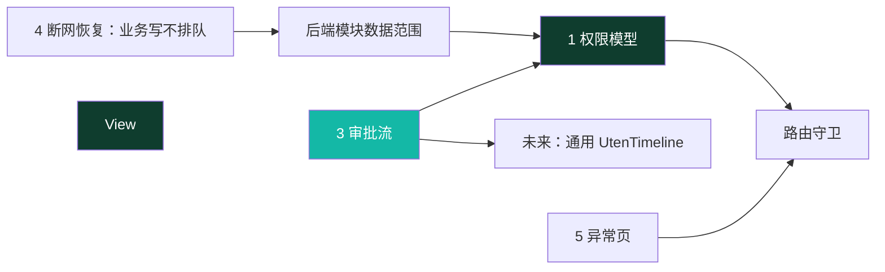
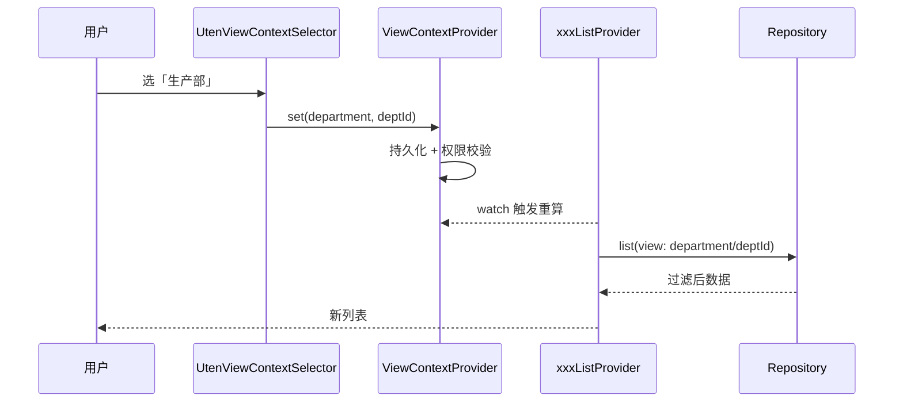
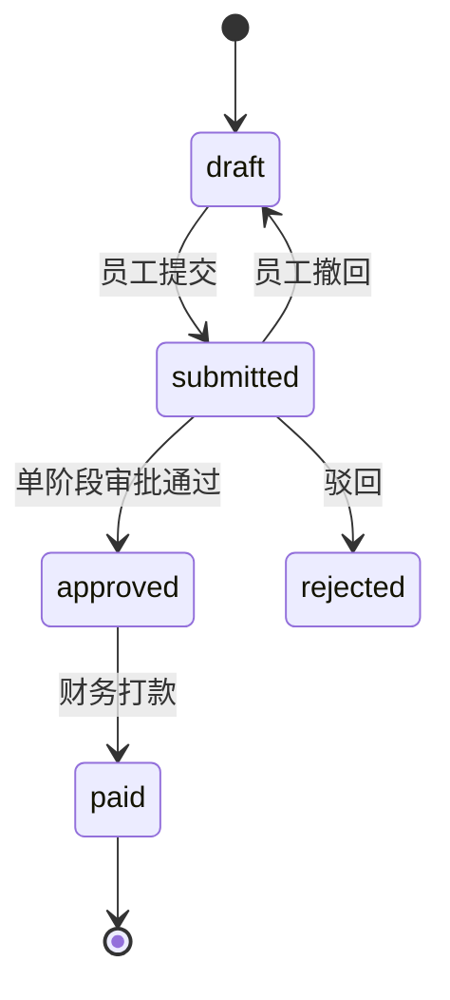
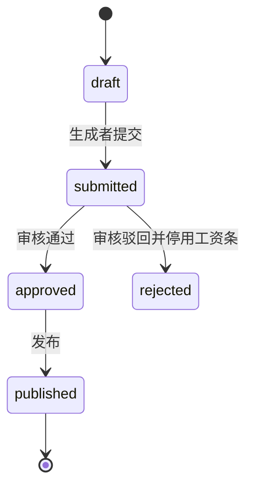

# 全局机制（跨页面状态与流程）

> 本档定义 Uten IMP **横跨多个页面/模块**的全局机制，是所有业务页面的地基。
>
> 配套文档：
> - 权限：[10-安全准则](../00-项目准则/10-安全准则.md) + [安全策略](安全策略.md)（§十为权威）
> - 路由：[路由设计](路由设计.md)
> - 状态：[状态管理](状态管理.md)
> - 数据：[实体字典](../04-数据模型/实体字典.md) + [ER草图](../04-数据模型/ER草图.md)

---

## 〇、本档涵盖（产品机制 + 服务端一致性机制）

| # | 机制 | 一句话 | 落地形态 | 状态 |
|---|---|---|---|---|
| 1 | 权限模型与路由守卫 | 部门配置 + 个人覆盖 + 按权限点脱敏；any/all 路由、页面和数据三层校验；V135 令牌授权版本；V141 员工敏感写拆分 | 前端守卫 + 后端授权/对象守卫 + `auth_version`/`epoch` | 🟡 源码主体已实施；对象越权、V135/V141 目标库与真实权限矩阵未闭环 |
| 2 | 管理视角上下文选择器（历史提案） | 曾计划在「全公司/部门/员工/自己」间切换 | 无源码；当前各模块由后端直接实施数据范围 | ⛔ 未采用，不能作为现有能力 |
| 3 | 审批流建模 | 可配置多级审批，员工报销/工资条复用统一轨迹模型 | `ApprovalNode` + `ApprovalRecord` + `UtenTimeline` | 🟡 通用模型仍为目标；V133 已用业务表状态/操作人/时间戳落地固定流程结构 |
| 4 | 断网与写入恢复 | 安全读有限重试；所有业务写在线、失败后重读权威状态；禁止通用离线重放 | ConnectionRecovery + 服务端幂等/事务；只有 logout refresh 撤销可排队 | ✅ 当前边界已实施；目标网络故障注入待验收 |
| 5 | 异常页与引导 | 统一 404 空状态；无权限 redirect + Toast；引导推迟 | `errorBuilder` + Toast | ✅ 主体已实施（首次引导仍未做） |
| 6 | 应用操作审计 | 进入应用的业务 API 请求全方法留痕，关键事件补语义、公开业务表补脱敏 before/after | `AuditRequestContextFilter` + MVC interceptor + `AuditService` + DB triggers | 🟡 V169/V171/V172/V173 主体、V183 新表触发器、V184/V185 加固与 V190 新业务表后完整 sweep 已落源码；目标库迁移、生产容量、边缘日志联查和故障演练仍待验收 |
| 7 | 报表物化视图刷新 | 6 个 MV 默认每 5 分钟逐个并发刷新，多实例互斥；成功轮次一行日志都不打（状态查 V131 状态表），单视图失败记 error、部分失败轮次补 warn 汇总 | scheduler + advisory lock + V131 状态表 | 🟡 源码已落地，生产同构/告警待验收 |
| 8 | 关联数量不变量 | 数据库关闭并发超收/超发/超退竞态 | V132 的 12 个触发器 | 🟡 源码已落地，并发/历史纠偏待验收 |
| 9 | 导出资源控制 | 每用户频率、单次行数、进程并发、独立权限、加密与审计 | ExportRateLimiter/Interceptor | 🟡 主体已落地，多实例总并发/容量待验收 |
| 10 | 迁移证据模型 | 输入指纹、实际消费文件、对账、reject 与未来 checkpoint | JSON+sha256 manifest + V134 | 🟡 追溯结构已落地；增量 loader/全模块结构化对账未实现 |
| 11 | 资产领域 maker-checker | 7 权限 + 服务端 `allowedActions` + 本人回避 + 默认落账门禁 + 不可变反冲 | V183 专用审批/事件/批次，不复用通用 ApprovalRecord | 🟡 安全骨架/月度批次已落；完整生命周期 NO-GO |
| 12 | 销售履约事实分层 | 来源订单商业事实、订单有效预留、仓库当前投影、不可变事件、退货质量冻结各自唯一权威 | V90/V178/V187–V189 + 服务端来源重取/状态守卫 | 🟡 最小安全链已落源码；目标迁移、完整 WMS/QMS、岗位 UAT仍为 NO-GO |
| 13 | 会话一致性与弱网恢复 | 原子 token record + latest-intent/CAS + logout fence；安全读有限重试与严格 health | SecureStorage/SessionNotifier/AuthInterceptor + ConnectionRecovery | 🟡 源码候选；目标浏览器、网关、故障注入和生产运行仍为 NO-GO |
| 14 | 本地/云端部署与远程授权 | 公司本地唯一写主库、云端异步热备；默认 LAN，账号显式授权云端 | V241 + Local/Remote Guard + cloud routing datasource + 复制/部署脚本 | 🟡 源码与隔离演练完成；目标 ECS/VPN/OSS/PITR/UAT 未验收 |
| 15 | 生产计划前分析与备料 | 销售/手工需求先做单仓全树齐套，用户勾选 BUY/SUBCONTRACT/MAKE，再按可完工量分批生成草稿 | V234/V237/V239 与 V247–V250 + MaterialAnalysis/Preplan/Execution/IQC 唤醒链 | 🟡 源码及隔离克隆已覆盖阶段链/HTTP 证据；开发原库 V244/公司目标库 V238 尚缺 V239–V250，实物闭环和发布仍 NO-GO |

**依赖关系**：



---

## 一、权限模型与路由守卫

> **2026-07-24 重构（V27–V30，[ADR-011](../99-决策记录-ADR/ADR-011-工作台部门分区与动态权限配置.md)）**：角色体系已下线。**现行模型**：
>
> ```
> 有效权限 = 全员基础（employee 包，人人有份）
>          ∪ 部门配置（department_permissions，所在部门 + 所有上级部门递归向上并集）
>          ∪ 个人加授 − 个人收回（user_permission_overrides）
>          （超级管理员恒为全量）
> ```
>
> - 权限目录动态化（`GET /admin/permission-catalog`），新功能在 Flyway 迁移里登记权限点即可被超管分配；
> - `/admin/permissions` 是账号支持与授权管理的共享壳：持 `account:support` 或
>   `authorization:manage` 任一权限可进入；support-only 只渲染账号列表/状态/重置密码，不请求
>   权限目录、有效权限、个人覆盖、数据范围或部门授权；真正授权管理仍只允许超管；
> - `audit_log:view` / `audit_log:export` 是调查证据权限例外：超级管理员因固有全量权限天然具备；
>   非超管只能通过个人覆盖点名加授，不能进入部门权限或随部门树继承。部门权限服务与 V173 数据库
>   触发器都会拒绝绕过；回收查看权限后，V135 令旧 access token 在下一请求失效；
> - 数据范围由后端按模块实施。客户入口需要 `client:view`；客户归属可见性为公共数据 + 本人 +
>   `user_data_scopes(scope=client)` 授权归属人，持 `client:view:all` 或超管才可见全部；
> - 配置写库后仍吊销相关用户 refresh token；V135 同时递增用户 `auth_version` 或共享授权
>   `epoch`，旧 staff access token 在下一次请求版本复查时立即 401；
> - 敏感字段脱敏按权限点（`employee:pii:view` / `employee:compensation:view`），**不再按角色名**。

### 1.1 设计决策

| 问题 | 决策 |
|---|---|
| 权限粒度 | **权限点为主**（2026-07-24 起角色已下线；staff JWT 已移除 roles/perms claim，响应 profile 仍保留服务端合成的 roles/permissions 兼容前端） |
| 多来源用户 | 全员基础 ∪ 部门配置（含上级部门递归）∪ 个人覆盖，取**并集**（个人收回优先） |
| 无权限访问受保护路由 | redirect 到明确的 `/access-denied` 拒绝页，说明目标未打开、操作未执行；后端仍独立返回 403/404 |
| 菜单/按钮无权限 | 直接 `hide`（不渲染），**绝不 disable** |
| 数据范围 | **后端权威且按模块定义**；客户/货品使用 owner 范围，销售单据复用销售 owner 范围；前端只消费后端下发的 `writable` 等能力 |
| 账号/授权共享入口 | `/admin/permissions` 路由接受 `account:support` 或 `authorization:manage`；support-only 仅账号支持区，授权/部门/数据范围区必须 `authorization:manage` 且后端再次校验超管 |
| 审计证据权限 | 超级管理员天然具备；非超管只允许个人覆盖点名加授 `audit_log:view` / `audit_log:export`，禁止部门配置与继承；查看是查询前提，导出还需 export |
| 菜单显隐数据源 | 工作台模块区与路由守卫共用 `permission_by_path` 的 any/all 两类契约，单一映射不再两处维护 |
| 生效时效 | 配置写库并吊销 refresh；V135 用户版本/全局 epoch 不匹配使旧 staff access 下一请求立即 401，仍须目标库、覆盖矩阵和性能验收 |

### 1.2 权限点常量（节选）

> 完整清单见 [`lib/shared/auth/permissions.dart`](../../lib/shared/auth/permissions.dart)。它的目标是与后端
> `permissions.code` 对齐，但当前仍是人工维护，不能宣称天然一一对应；新增权限必须同时更新 Flyway、前端策略并通过自动契约测试。

```dart
// lib/shared/auth/permissions.dart（节选）
abstract final class Perm {
  // 员工档案 / 部门
  static const employeeView = 'employee:view';
  static const employeeEdit = 'employee:edit';
  static const employeePiiView = 'employee:pii:view';
  static const employeePiiEdit = 'employee:pii:edit';
  static const employeeCompensationView = 'employee:compensation:view';
  static const employeeCompensationEdit = 'employee:compensation:edit';
  static const departmentView = 'department:view';
  // V130 起：authorization:manage 仅超管管理授权；account:support 供 HR 日常账号支持。
  static const accountSupport = 'account:support';
  static const authorizationManage = 'authorization:manage';

  // 工资条（数据范围分级）
  static const payrollViewSelf = 'payroll:view:self';
  static const payrollViewAll = 'payroll:view:all';
  static const payrollGenerate = 'payroll:generate';
  static const payrollReview = 'payroll:review';

  // 报销审批
  static const expenseApprove = 'expense:approve';

  // 访客
  static const visitorApprove = 'visitor:approve';
  static const visitorHostConfirm = 'visitor:host-confirm';
  static const visitorCheckIn = 'visitor:check-in';

  // 个人信息自助（Phase 6）
  static const profileEditSelf = 'profile:edit:self';
  static const profileReview = 'profile:review';
  // 业务模块（各单据 :view / :edit + 报表 *_report:view）
  // 采购 / 销售 / 委外 / 仓库 / 库存 / 生产 / 钱流 / 基础资料 …（详见源文件）

  // 客户资料：入口权限 + 查看全部权限；具体 owner 集由后端 user_data_scopes 判定
  static const clientView = 'client:view';
  static const clientEdit = 'client:edit';
  static const clientViewAll = 'client:view:all';
}
```

> **历史角色映射（`rolePermissions` Map）已于 2026-07-24（V29）下线**。后端
> `PermissionResolver` 合成有效权限时不再读 `user_roles` / `department_roles`。staff JWT 已移除
> roles/perms；登录/刷新响应 profile 仍返回服务端排序后的 roles/permissions 供客户端兼容展示。前端
> 权限判定一律走 `currentPermissionsProvider`，**不在前端平行合成角色映射**。

### 1.3 当前用户权限 Provider

```dart
// lib/shared/auth/permissions.dart

/// 当前用户的功能权限集合（**直接用后端合成结果**，前端不再二次合成）。
///
/// 超级管理员（UserProfile.superAdmin == true）后端已经把全量 permissions 推过来；
/// 这里对超管额外 union 所有已知 Perm 常量作兜底（即便后端漏推某个新增权限也能 work）。
final currentPermissionsProvider = Provider<Set<String>>((ref) {
  final user = ref.watch(sessionProvider).user;
  if (user == null) return const <String>{};
  if (user.superAdmin) {
    return <String>{
      Perm.employeeView, Perm.employeeEdit,
      Perm.accountSupport, Perm.authorizationManage,
      Perm.payrollViewSelf, Perm.payrollViewAll, Perm.payrollGenerate,
      Perm.payrollReview, Perm.payrollPublish, Perm.payrollExport,
      Perm.expenseApply, Perm.expenseApprove, Perm.expensePay,
      Perm.profileEditSelf, Perm.profileReview,
      Perm.employeeCompensationView,
      // … 全部已知常量（采购/销售/委外/仓库/生产/钱流/基础资料）
      ...user.permissions,
    };
  }
  return user.permissions.toSet();
});

/// 通用权限判定。超管短路放行，其他按字符串匹配。
bool hasPerm(Ref ref, String code) {
  if (ref.read(isSuperAdminProvider)) return true;
  return ref.read(currentPermissionsProvider).contains(code);
}
```

要点：
- **`AppUser.can()` 不再对持 admin 角色短路**（V30 安全加固）；只认 `superAdmin || permissions.contains(perm)`，与后端 `@PreAuthorize` 语义一致。
- 前端 `currentPermissionsProvider` 是后端合成结果的**视图**，不参与"角色 → 权限"推导——单一事实来源在后端。

### 1.4 路由 → 所需权限点（集中管理）

```dart
// lib/core/router/permission_by_path.dart

/// 返回某路径所需的权限点列表（**任一满足**即放行）；不需要权限返回 null。
/// 这是路由守卫与工作台显隐共用的唯一数据源。
List<String>? requiredAnyPermFor(String location) {
  // 共享页面：任一权限可进入，页面内部按能力分区；后端仍独立授权。
  if (location == RouteName.adminPermissions) {
    return const [Perm.accountSupport, Perm.authorizationManage];
  }
  // 审计中心与原设备本机回执使用独立调查权限。
  if (location == RouteName.adminAuditLogs ||
      location == RouteName.deviceAuditReceipts) {
    return const [Perm.auditLogView];
  }
  // 系统设置及当前其它 admin 页面仍属于授权/高危管理。
  if (location == RouteName.adminSystemSettings ||
      location.startsWith('/admin/')) {
    return const [Perm.authorizationManage];
  }
  // 员工档案（按段区分 view/create/edit）
  if (location == '/employee' || location.startsWith('/employee/')) { ... }

  // /finance/customers 是 ClientCategoryPage 的路由别名；入口权限与后端一致
  if (location.startsWith('/finance/customers')) {
    return const [Perm.clientView];
  }

  // 采购 hub：任一采购单据 view 即可见
  if (location == RouteName.purchase) {
    return const [
      Perm.purchaseRequestView, Perm.purchaseOrderView,
      Perm.purchaseReceiptView, Perm.purchaseReturnView,
    ];
  }
  // ... 销售 / 委外 / 仓库 / 生产 / 钱流 同模式
  return null;
}

/// 返回必须全部具备的权限；普通路由返回空列表。
List<String> requiredAllPermsFor(String location) {
  if (location == '/employee/onboarding') {
    return const [Perm.employeeCreate, Perm.employeePiiEdit];
  }
  return const [];
}

/// 兼容旧签名：对"任一满足"的多权限路径只返回第一个（最低门槛）。
String? requiredPermFor(String location) =>
    requiredAnyPermFor(location)?.first;
```

> 路由守卫只判“能否进入功能”，不决定能看到哪些对象。客户页以 `client:view` 作为入口；
> `OwnerVisibility` 在后端根据 `client:view:all`、本人和 `user_data_scopes` 过滤对象。详情、编辑和
> 导出仍分别在后端执行对象级与动作级校验。需要组合门槛的功能用
> `requiredAllPermsFor`；入职必须同时拥有 `employee:create` 与 `employee:pii:edit`，不能错误地
> 表达成“任一满足”。

### 1.5 三层校验

| 层 | 位置 | 做法 |
|---|---|---|
| **路由级** | `app_router.dart` redirect | any 集合至少命中一个，且 all 集合全部命中；否则返回 `/dashboard` |
| **页面级** | 导航项 / 入口卡 / 按钮 | `.where((item) => hasPerm(item.perm))` 直接 hide |
| **数据级** | 后端 Service/Policy | 根据当前身份、对象 owner、显式数据范围授权和 `*:view:all` 过滤，详情/写操作再次校验 |

```dart
// redirect 追加权限校验（在现有登录校验之后）
redirect: (context, state) {
  // …现有登录校验…
  final perms = ref.read(currentPermissionsProvider);
  final isSuper = ref.read(isSuperAdminProvider);
  final requiredAny = requiredAnyPermFor(state.matchedLocation);
  final requiredAll = requiredAllPermsFor(state.matchedLocation);
  if (!isSuper &&
      ((requiredAny != null && requiredAny.none(perms.contains)) ||
       !requiredAll.every(perms.contains))) {
    ref.read(globalToastProvider.notifier).show(l10n.errNoPermission);
    return RouteName.dashboard;
  }
  return null;
},
```

### 1.6 权限刷新与即时失效

权限变更保存即写库（`department_permissions` / `user_permission_overrides` 直写），并：
- **保存部门配置** → 吊销该部门子树（含下级）所有用户 refresh token；
- **保存个人覆盖** → 吊销该用户 refresh token；
- **V135 access 版本** → 个人授权、用户角色、员工部门、超管/员工绑定变化递增用户
  `auth_version`；部门权限、共享角色/权限以及部门树层级/软删变化递增全局授权 `epoch`；
- staff JWT 只写标准签发字段与 `sub/typ/av/ae`，不携带账号、员工、角色、权限或改密状态；
  `JwtAuthFilter` 每次请求先查账号状态/员工绑定/两个版本，再从服务端合成权限；版本键快照只缓存
  30 秒、最多 2048 项，active/软删和版本校验始终在缓存前执行；
- 明确不存在、停用、删除、员工绑定无效或版本不匹配立即结构化 401；账号投影、数据库或权限解析故障
  返回结构化 `503 + SERVICE_UNAVAILABLE`，不得误判成权限变化或清客户端会话；
- 源码默认 access TTL 为 15 分钟，V133 只将未修改的旧默认 480 收敛为 15；明确自定义值保留。

> V135 仍是“源码已实现、待运行验收”。目标库未应用 V135 时旧机制不成立；上线前必须覆盖个人
> grant/revoke、用户角色、员工换部门、部门树移动/软删、共享定义、超管和 employee 绑定变化，
> 并验证旧 token 立即 401、事务回滚不误增版本及逐请求查询 P95/P99。

### 1.7 对照清单

- [ ] 路由策略、入口卡片、按钮权限和后端授权已通过自动契约/正反向矩阵证明全覆盖
- [x] 菜单项/入口卡用 `where(hasPerm)` 过滤，无 `disable`
- [x] redirect 接入权限校验，无权限进入明确的 `/access-denied` 拒绝页
- [x] 超管走 `superAdmin` 字段短路（不再对 admin 角色短路）
- [ ] 关键写操作均有专属权限点，并已验证普通查看权限不能调用高风险写接口
- [x] 配置变更吊销 refresh token 强制重登

### 1.8 资产领域的权限与动作契约

资产工作台使用
`finance_asset:view/edit/approve/post/dispose/export` 与
`finance_asset_period:manage`。V183 对财税部只默认配置 view/edit；其余按治理要求应个人点名
授权。处置/终止最终批准要求 dispose+post，安全驳回只要求 dispose。export 目前只有权限码预留，
没有可用导出 endpoint。

页面先用 `finance_asset:view` 通过路由，再取本地动作权限与服务端 `allowedActions` 的交集。
服务端才是真相源，并继续校验本人回避、乐观版本、对象/批次状态、期间和
`UTEN_FINANCE_ASSET_POSTED_WORKFLOWS_ENABLED=false` 门禁。当前资产查询没有部门/责任人行级范围，
持 view 可看全量；企业若要求数据隔离，必须覆盖列表、详情、写动作和未来导出后再上线。

资产自己的 `finance_asset_approval_steps` 是只追加领域证据，不表示跨模块通用审批引擎已完成。
月度错误创建关联原批次的反向事实，不能删除重建；资本化/处置/终止事件反冲尚未交付。详见
[ADR-018](../99-决策记录-ADR/ADR-018-资产与待摊专业子账及不可变过账.md)。

---

## 二、管理视角上下文选择器（历史提案，未采用）

> **状态**：⛔ 没有 `ViewContextProvider`、`UtenViewContextSelector` 或对应 Repository 参数，
> 也没有页面可依赖该机制。下文仅保留早期方案背景，不是待上线功能的现行契约。
> 当前数据范围由后端的模块 Policy 直接判定；客户/货品和销售单据使用 owner 范围模型。
> Flyway 中遗留的 `viewcontext:scoped` 尚无运行时代码消费者，后续应在确认无外部依赖后用新迁移清理。

### 2.1 概念

一个全局状态，记录"当前查看的数据范围"。切换后，所有**跟随视角**的页面/Provider 自动按此范围过滤数据。

### 2.2 视角档位

```dart
// lib/shared/providers/view_context_provider.dart（待新建）

enum ViewScope {
  self,        // 我自己（默认，全员）
  department,  // 某部门全员
  employee,    // 下钻到某员工
  company,     // 全公司
}

class ViewContext {
  final ViewScope scope;
  final String? departmentId;  // scope=department 时
  final String? employeeId;    // scope=employee 时
  const ViewContext({this.scope = ViewScope.self, this.departmentId, this.employeeId});
}
```

### 2.3 可见范围（按权限点 `viewcontext:scoped` 联动，不再按角色）

| 用户持有权限 | 可选视角 | 说明 |
|---|---|---|
| 无 `viewcontext:scoped` | 仅 self | 看不到选择器 |
| 持有 `viewcontext:scoped` | self / department / employee | 部门/员工维度 |
| 持有 `viewcontext:scoped` 且被授 `*:all` 范围 | + company | 加全公司 |
| 超管 | 全部 | 含 company |

> 以上是未采用方案的设想，不适用于当前客户/销售 owner 范围模型。

### 2.4 UI：全局 AppBar 右侧选择器

- 组件：`UtenViewContextSelector`（`lib/components/navigation/uten_view_context_selector.dart`，待新建）
- 位置：`UtenAppBar` 的 `actions`，所有跟随页统一注入
- 交互：下拉/弹层，列出当前用户可选视角；选 department/company 后二级选具体部门/范围
- 默认：`self`；选择持久化到后端 `user_preferences`（key 带权限前缀，下次启动恢复，但启动时校验是否仍有权）
- 文案走 i18n

```
┌──────────────────────────────┐
│ 工作台          [全公司 ▼] ⚙  │  ← 选择器在 AppBar 右侧，齿轮是设置
├──────────────────────────────┤
```

### 2.5 跟随视角的页面矩阵

| 页面 | 是否跟随 | 说明 |
|---|---|---|
| 工作台 Dashboard | ✅ | KPI 按范围汇总 |
| 工资条列表 | ✅ | hr/manager 按范围列工资条（员工永远只看自己） |
| 报销列表 | ✅ | finance/manager 按范围列报销 |
| 员工档案 | ✅ | 直接按 department/employee 展示 |
| 工资条生成 | ✅ | 按部门生成 |
| 财务报表 | ✅ | 按范围汇总 |
| 通知列表 | ❌ | 通知按发布范围（部门/工种/全员），不按视角 |
| 建议箱 | 部分 | 「我的建议」不变；「建议广场」可按部门筛 |
| 我的 / 设置 | ❌ | 个人页，不跟随 |

### 2.6 技术实现

```dart
final viewContextProvider = NotifierProvider<ViewContextNotifier, ViewContext>(
  ViewContextNotifier.new,
);

abstract interface class PayrollRepository {
  Future<List<PayrollSlip>> list({required ViewContext view, PayrollFilter? filter});
}

final payrollListProvider =
    FutureProvider.family<List<PayrollSlip>, PayrollFilter>((ref, filter) async {
  final view = ref.watch(viewContextProvider);   // 切视角 → 重拉
  return ref.read(payrollRepositoryProvider).list(view: view, filter: filter);
});
```

> 实施时：Repository 把 `view` 透传给 API（`?scope=department&deptId=xx`），后端按权限点二次校验（防越权）。

### 2.7 数据流



### 2.8 对照清单（实施前）

- [x] 本节确认为历史草图，未实现类型不得被业务代码引用
- [x] 当前数据范围改由各模块后端 Policy 权威实施
- [ ] 确认无外部依赖后，通过新迁移清理遗留 `viewcontext:scoped` 权限点

---

## 三、审批流建模（可配置多级）

> **状态**：🟡 目标设计，未形成生产闭环。
> 现状：工资条与员工报销前端已经切换 Dio，V133 已建立业务表，并在批次/申请上保存固定流程的
> 状态、操作人和时间戳；通用审批轨迹组件 `UtenTimeline`、`ApprovalNode` 和
> `ApprovalRecord` 仍未落地。下述可配置多级状态机是目标设计，不能据此宣称当前已完成通用审批。
> V183 的资产 `finance_asset_approval_steps` 是另一个已落地的领域专用只追加轨迹，同样不等于
> 通用 `ApprovalRecord` 已实现。

### 3.1 为什么要多级

制造业报销常跨部门（出差报销要主管批 + 财务批），单级审批上线后必然要改。前端一开始就按多级建模，避免返工。

### 3.2 通用审批模型（脱离具体业务）

> 把原实体字典里的 `ExpenseApproval` 收敛为通用 `ApprovalRecord`（带 entityType 区分），新增 `ApprovalNode`（流程定义）。详见 [实体字典](../04-数据模型/实体字典.md)。

```dart
/// 审批流程节点定义（可配置，按 flowType 分模板）
/// 例：报销流程 = [节点1 直属主管, 节点2 财务]
class ApprovalNode {
  final String id;
  final ApprovalFlowType flowType;   // expense / payroll
  final int order;                    // 顺序，从 1 开始
  final String name;                  // 「直属主管审批」
  final String? approverRole;         // 历史字段：谁来批（已改按权限点 expense:approve/payroll:review）
}

/// 一次审批动作的记录（轨迹的一格）
class ApprovalRecord {
  final String id;
  final ApprovalFlowType entityType;  // expense / payroll
  final String entityId;              // 报销单/工资条 ID
  final int nodeOrder;                // 第几节点
  final String? approverId;           // 实际审批人
  final ApprovalDecision decision;    // pending / approved / rejected
  final String? comment;              // 审批意见
  final DateTime? actedAt;
}

enum ApprovalFlowType { expense, payroll }
enum ApprovalDecision { pending, approved, rejected }
```

> 注：角色下线后，"谁来批"由权限点（`expense:approve` / `payroll:review`）决定，不再绑定 `approverRole`。

### 3.3 报销审批流（ExpenseClaim）

**当前固定流程**：员工创建并提交 → 有 `expense:approve` 权限的非申请人通过或驳回 → 有
`expense:pay` 权限的非申请人打款。当前不是主管 + 财务的多级审批。



`REVIEWING` 状态在 V133 中预留，服务允许把它与 `SUBMITTED` 一样审批或撤回，但当前没有
进入/推进多级节点的接口。`REJECTED` 是终态，不会自动回到草稿。打款使用行锁并在同一事务内
扣减账户、生成一般费用单、对账记录和总账凭证；相同参数重试幂等，不同参数重复付款冲突。

### 3.4 工资条审批流（PayrollSlip / PayrollBatch）



批次生命周期是 `DRAFT / SUBMITTED / APPROVED / REJECTED / PUBLISHED`。工资条在创建草稿时
已经生成；发布只改变工资条状态和员工可见性。`REJECTED` 是终态，修正时创建新批次。员工
查看/下载记录在工资条 `viewed_at/downloaded_at`，不混入批次状态。

`payroll:generate/review/publish` 是独立权限点，但当前未强制制单、复核、发布必须由不同账号执行；
是否采用四眼原则仍需业务确认并由后端强制。

### 3.5 审批轨迹 UI（当前与目标）

- 报销详情页目前按申请单的创建、提交、通过/驳回、付款时间字段合成私有
  `_ApprovalTimeline`，没有持久化逐节点意见。
- 工资审核页目前只显示批次状态、操作时间和驳回原因，不展示时间线。
- 资产详情读取真实 `finance_asset_approval_steps`；它只服务资产/待摊对象和批次，不能供报销/
  工资复用。
- `UtenTimeline`、`ApprovalNode`、`ApprovalRecord` 仍是未来多级审批方案；未决定采用多级审批前，
  不得用目标模型描述当前数据。

### 3.6 权限与并发

- 权限点：`expense:apply/approve/pay`、`payroll:generate/review/publish/view:self/view:all/export`。
- 报销禁止申请人自审、自付；工资目前没有制单/复核/发布人员分离校验。
- 两个领域的状态变更均通过数据库悲观行锁和状态前置条件防止并发覆盖，不使用 `If-Match`。
- 报销申请人可在 `SUBMITTED/REVIEWING` 撤回到 `DRAFT`；已审批后不能撤回。

### 3.6.1 平台并发控制模型与「别人正在操作」（2026-08-07 安全/并发审计结论）

> 本节是 2026-08-07 全平台安全/并发深审的沉淀。审计逐行读码确认了并发正确性现状，并明确了「重复操作避免 / 显示他人处理中」的统一机制。

**两层并存，职责不同（机制平台统一，不引入多套）：**

| 层 | 机制 | 防什么 | 现状 |
|---|---|---|---|
| **正确性底线** | 悲观行锁 `SELECT ... FOR UPDATE`（`findByIdForUpdate`）+ 状态前置条件 + DB 数量不变量触发器（V132） | 重复审批、并发状态翻转、超收/超发/超退 | ✅ 全部业务单据（销售/采购/委外/仓库/生产/钱流）的写与审批路径均已覆盖。**「重复审批导致数据错」这个真正的危险已防住。** |
| **UX/防碰撞层** | 统一任务软认领 `TaskClaimService` + `task_claims`（V215，部分唯一索引 + 租约 + 心跳）show-as-locked | 「两人同时操作同一待办」；被认领目标显示「XXX 处理中」、他人动作禁用/服务端 409 | 🟡 基础设施已就绪并有单测；**守卫 `requireNoActiveClaimByOther` 已接入**费用审批 `approve/reject`、销售订单 `approve`、采购分解 `decompositionPreview`；前端徽标/认领会话与履约任务台接入待补 |

**关键澄清**：

- 现有 3 处 `@Version`（`ExpenseClaim`/`PayrollBatch`/`PayrollSlip`）**不在 HTTP 请求间回传版本号**，故目前是装饰性的——`approve/submit` 只传 id，版本未进 DTO。要真正防「两人编辑同一记录、后写覆盖先写」的丢失更新，乐观锁必须走 **DTO 版本回传**（编辑表单带回 `version`，服务端比对、过期即 409）。这是缺口 2 的既定方向（见下），只覆盖真正可编辑实体，不盲加给 127 个实体里的追加事件/系统/查照表。
- 主档（客户/货品/供应商/账户/颜色/单位/币种/模具…）编辑路径**目前无行锁**，是丢失更新的真实薄弱面；交易单据编辑路径已有行锁。
- 「采购/生产/仓库按业务员/负责人隔离（像销售那样）」是业务既定方向（用户 2026-08-07 确认），属对象级授权统一（范围 B），本批并发加固不动它。

**2026-08-07 已落地并验证（mvn 绿）**：

- `TaskClaimService` 此前在本分支**零调用、零测试**——新增 `TaskClaimServiceTest`（7 例，覆盖守卫空/他人占用/本人/租约过期/匿名、claim 首认领胜出/他人 409）。
- 守卫接入：`ExpenseClaimService.approve/reject`、`SalesOrderService.approve`、`PurchaseRequestService.decompositionPreview`（后者复用查询结果行 `row[0]` 取 distinct request_id，不发额外 query，保持 `DecompositionPreviewTest` 单次 `createNativeQuery` 校验）。
- **顺带修 2 个潜伏 bug**：`TaskClaimPolicy` 中 `SALES_ORDER_APPROVE` 用了**不存在的权限码** `sales_order:approve`（实际 `sales_order:edit`）、`PURCHASE_DECOMPOSE` 权限码错配为 `purchase_request:edit`（实际动作需 `purchase_order:edit`）——导致这俩功能原本根本没人能认领。已对齐动作端点真实权限。

**待办（按优先级）**：

- [x] 后端四个登记类型的守卫全部接入：费用审批、销售订单审核、采购分解、**履约工作台仓库单据编辑（`StockDocService.update`，FULFILLMENT_TASK）**。
- [x] 前端组件 `TaskClaimBadge` / `TaskClaimHandle`（单目标）+ `TaskClaimSession`（多目标，采购跨申请分解用；均非阻塞，认领失败不影响动作）+ 四个协作面全部接入：报销审批详情页（Handle）、销售订单审核（Session，page-state 跨 busy 切换）、采购分解订货编辑（Session，按申请 id 多键认领）、仓库单据编辑（Handle，FULFILLMENT_TASK）。flutter analyze 0 issue。
- [x] 缺口 2：统一乐观锁（带回传）+ 全局 `OptimisticLockException→409` + 迁移 V231，已覆盖客户/货品/供应商三大主档。简单查照类（颜色/单位/币种/账户/模具/分类）并发编辑极少，按同模式按需追加（**为不引入低价值风险，未盲目铺开**）。
- [ ] 采购 `createBatch` 守卫（正确性已由财务审批 pending-capacity 兜底，属增强，暂缓）。
- [ ] 范围 B：采购/生产/仓库改按负责人隔离。

### 3.7 对照清单

- [x] V133 业务表、固定状态字段、操作人/时间戳和约束
- [x] 报销/工资源码状态机、Dio 仓储和后端 API
- [x] 状态变更使用行锁和状态前置条件
- [ ] 业务确认报销是否需要主管 + 财务多级审批、意见留存和附件
- [ ] 业务确认工资四眼原则并在后端强制
- [ ] 真实 PostgreSQL 并发、幂等、权限矩阵和端到端验收
- [ ] 若采用多级审批，再落地 `ApprovalNode` / `ApprovalRecord` / 通用时间线并同步 ER

---

## 四、断网与写入恢复规范

> **状态（2026-08-09）**：当前明确采用“业务写必须在线、失败后读取权威结果再由用户决定是否重试”。
> 旧版 `OfflineActionQueue` 设想已撤回，不是待开发承诺；若未来重新提出，必须单独立项和 ADR，逐业务域
> 证明幂等、因果顺序、权限时效、金额/库存守恒、补偿和人工冲突处置。

### 4.0 唯一允许持久排队的操作

`PendingRefreshRevocationStore/Drainer` 只解决“用户已本地退出，但网络暂时无法通知服务器吊销旧
refresh token”：

- 退出先把精确 refresh token 持久交接到 `flutter_secure_storage` 的有界加密队列，再清本地会话；
- 队列只调用公开、幂等的 `POST /auth/logout`，成功后按 token 精确删除；
- 并发标签页可能重复调用幂等 logout，但不能覆盖后来入队的 token；
- 队列不得承载报销、建议、订单、审批、付款、库存、附件或任何业务 payload。

### 4.1 当前操作分级

| 操作类型 | 当前策略 | 断网/不确定结果 |
|---|---|---|
| GET/HEAD/OPTIONS | 仅瞬态错误最多额外重试两次；恢复后重新读取 | UI 明确显示暂时不可达；不得把旧缓存显示成权威最新值 |
| 点赞/已读等轻量写 | 当前仍按在线写处理 | 失败回滚 UI；不写持久队列，不静默重放 |
| 草稿保存、提交、撤回、审批 | 必须在线 | 不显示“已提交”；先重读服务端状态，再由用户明确重试 |
| 库存、收付款、总账、工资、导出 | 必须在线且服务端事务权威 | 不自动重放；Request ID/幂等键只防重复，不代表可离线排队 |
| 附件上传/确认/下载/删除 | 必须在线并重新做对象级授权 | 过期或不确定时重新查询附件元数据/状态，不沿用旧授权 URL |

### 4.2 本地/云端网络分区

- 公司本地员工继续使用本地 App 和唯一写主库。
- 云端员工业务请求返回 503；云端 PostgreSQL 热备不得开放为第二写端，也不保存离线命令。
- 网络恢复后由 WAL 追平云端热备，客户端重读主库权威状态；不存在数据库级双向合并。
- 若必须支持云端分区写入，应停止本架构并按单号、审批、库存、金额、附件元数据分别设计冲突语义，
  不能使用通用“最后写入胜”或上述已撤回的队列草图。

详见 [ADR-031](../99-决策记录-ADR/ADR-031-本地云端单主库部署架构.md)和
[2026-08-09 生产就绪清单](../99-项目治理/2026-08-09-本地云端部署与生产就绪清单.md)。

---

## 五、异常页与引导

### 5.1 404 页（路由不存在）

`app_router.dart` 的 `errorBuilder` 用 `UtenEmpty` 美化：

```
┌──────────────────────────┐
│        🧭 (exploring)     │
│      页面走丢了            │
│   你访问的页面不存在        │
│      [返回工作台]          │
└──────────────────────────┘
```

- 用 `UtenEmpty(icon: Icons.travel_explore, title: l10n.errNotFound, action: UtenButton → go dashboard)`
- 保留原 `error.toString()` 仅在 debug 模式小字显示

### 5.2 无权限（"403"）

- **不做独立页**
- 路由级：redirect 到 `/dashboard` + 全局 Toast「无权限访问该页面」（见 §1.5）
- 组件级：直接 hide

### 5.3 首次登录引导 `/onboarding`

- **仍未实施**
- 预留路由 `RouteName.onboarding = '/onboarding'`，登录后首次进入时检测标志位决定是否走引导

### 5.4 全局 Toast 机制

- 上述无权限提示、离线提示、会话失效提示需要一个**全局 Toast/Snackbar Provider**
- 现状：`ScaffoldMessenger.of(context)` 散落各页，跨页触发困难
- 待新建：`lib/shared/providers/global_feedback_provider.dart`，提供 `showToast(msg)` / `showSnack(msg)`（路由守卫 / AuthInterceptor 间接路径都用得上）

---

## 六、服务端全局一致性与运维机制

### 6.1 应用操作审计

审计分为三层。`AuditRequestContextFilter` 在 CORS、JWT 与 MVC 前建立 Request ID、计时和已验证
操作人快照，MVC 内由 `UserOperationAuditInterceptor` 落库，未进入 MVC 或尚未成功落库的请求由
Filter 兜底。审计存储正常时，进入应用的 `GET/POST/PUT/PATCH/DELETE/HEAD /api/**` 正常请求、
匿名认证、401、CORS 非法来源 403、404/405 与前置异常都有请求记录；有效 JWT 的 404/405 仍能归属
账号，无效或过期令牌不绑定操作人。`OPTIONS`、静态资源和健康检查不视为用户业务操作。

登录、导出、配置、敏感证据读取等由 `AuditService` 补显式语义；V169 为当时的公开业务表变化补齐同事务
`AFTER` 触发器并保存脱敏 before/after，V183 为新资产/待摊表显式挂接，V184 要求每张业务表恰有一个
启用的 AFTER ROW I/U/D 审计触发器并校验批准函数，V185 加固通用/高敏函数的软删除语义与行最小化。
V188/V189 的销售仓库事件与退货质量事件另有业务级 append-only 守卫；V196 的订货审批事件和 V201 的
到货异常事件也拒绝 UPDATE/DELETE。V190/V197/V202 都会在各自新增表后重新扫描全部 `public` 业务表，
只为缺失者挂批准函数，并严格要求每表恰有一个启用的 AFTER ROW I/U/D 审计触发器；V202 不是定向三表。
这些机制只补以后发生的状态/原因时间线与 before/after，不替代彼此，也不反向补造迁移前历史。
请求层不保存 query 值和正文，避免复制密码、令牌和 PII。
通用请求审计写入失败会告警但不改写已完成的业务响应；审计详情、本机回执授权和敏感下载则在显式
审计失败时 fail closed。TLS、反向代理或网关在请求进入应用前的拒绝由边缘访问日志负责。

审计列表、统计、详情与本机回执核查要求 `audit_log:view`；导出还需 `audit_log:export`。除超级管理员
固有全权限外，两者只能个人点名加授。本机目标回执每次读取前必须联网让服务端重新授权并记录
`verify_local_audit_receipt`，拒绝、离线或接口失败时不得读取本地目标数据。

审计中心默认最近七天“用户 + 写操作”，对象快捷筛选同时覆盖数据库变化与对应 request 路由；V185 前
软删除在读侧按删除/高风险解释。列表、统计和导出共享 `snapshotId=max(id)` 高水位并固定 `id <= snapshotId`，
用于隔离通常后续分配的高 ID；它不是跨请求 MVCC 快照，旧 ID 晚提交和留存并发删除仍须实库验收。

### 6.2 报表刷新与查询资源

- V131 为 `finance_ar_ap_mv`、`production_monthly_mv`、`purchase_monthly_mv`、
  `sales_monthly_mv`、`stock_monthly_mv`、`subcontract_monthly_mv` 记录刷新状态。
- scheduler 源码默认每 5 分钟逐个执行 `REFRESH MATERIALIZED VIEW CONCURRENTLY`；
  多实例用 PostgreSQL advisory lock 避免重复刷新。每个视图独立记成功/失败，不因一个失败停止其余视图。
- 通知可见性/未读过滤和计数在数据库完成，列表最多 500 条；全部已读集合更新，批量删除最多 500 条。
- 导出有独立权限、每用户频率、单次行数、进程内并发（源码默认 2）、强制文件密码与 Agile AES-256 加密和审计。
  多实例时并发闸门按实例计算，仍需全平台容量控制与压测。

### 6.3 关联数量数据库不变量

V132 的 12 个触发器保护采购、销售、委外累计收/发/退/损耗数量，利用行级更新串行化关闭
“两个事务同时看到相同剩余量”的竞态。新增负数及累计增加超过来源数量会被拒绝；历史超量数据
不会自动修复，只允许纠偏减少。服务层仍需状态机、权限、幂等和可理解的约束错误映射。

### 6.4 迁移证据

导出同时生成 `export_manifest.json` 与 `export_manifest.sha256`，JSON 绑定 checksum 清单本身的
SHA；`migrate.sh` 会验证两份清单和每个实际 CSV，并把输入、脚本、代码和映射版本写入 V134
追溯表。V134 另提供结构化对账、reject 和 future checkpoint 表，但各模块尚未统一写入，
增量 loader 也未实现；`SUCCESS` 不能替代 `reconciliation_status = PASSED`。

### 6.5 对象级授权

`@PreAuthorize` 只回答“能否进入某类功能”，列表过滤只回答“正常列表能看到什么”；详情、更新、
删除、审核、红冲、驳回、批量和上游引用必须再次按目标对象校验。销售单据对象级归属守卫已补强
订单/出货的新写入口、特殊仓库/财务动作与来源订单复核；**采购/委外/生产/库存已于 V233（2026-08-08）
按制单人 `maker_id` 接入同一机制**——平台级 `security/DocumentAccessPolicy`（泛化自销售
`SalesDocumentAccessPolicy`）+ 4 模块薄壳，复用 `OwnerVisibility`：普通员工只看自己制单的，持
`*:view:all`/超管看全部，老数据（maker_id 为空）公共可读+普通不可写，不可达返 404 不泄存在性。
采购/委外「申请」是计划系统生成的只读需求单不隔离；财务审核 port / MRP 自审核等内部路径豁免。
可见性委托复用 `user_data_scopes`（scope=purchase/subcontract/production_plan/stock_doc）。
真实多账号越权矩阵见 [对象级授权统一实施报告](../99-项目治理/2026-08-08-对象级授权统一实施报告.md)；
不能用前端隐藏或 UUID 难猜作为缓解。

### 6.6 聚合工作台的嵌套资源授权

能读取一个聚合工作台，不等于能读取其中每个关联业务单据。生产履约工作台按
`department + actionDocType` 映射目标模块精确 `view/edit` 权限；无查看权时服务端必须先清除单据类型、
ID、单号、明细 ID 和状态，只返回 `restricted=true`。未知类型 fail-closed。前端只根据服务端能力显示
真实深链或批量动作，不能由工作台部门权限自行推导目标单据权限。

采购/委外任务分解必须同时具备来源申请 `view`、目标订单 `edit` 和对应 `*:submit_finance`；缺任一权限，
服务端不得下发动作元数据。申请详情只读，任务投影才提供可分解余量；仓库行没有真实可执行入口时显示
只读状态或锁定说明，不渲染“点击后无动作”的伪按钮。
生产执行分段点击在父计划打开详情，真实 `subplan_links` 点击进入 `childPlanId`，二者不得混用。

路由守卫拒绝深链时进入 `/access-denied`，明确显示“未打开目标页面、未执行操作”，不再静默跳转工作台
造成用户误以为点击无反应。此页面只负责反馈，后端接口仍须独立拒绝越权请求。


### 6.7 计划需求、订货财务审批与超量到货对象边界

- 采购/委外申请由生产物料分析按用户勾选的 BUY/SUBCONTRACT 缺口以 `status=1` 下达，业务端只有来源列表/详情查看；新建、编辑、审核、红冲、删除和商业字段都不得从客户端能力推导。它不是商业订货，采购/委外人员仍须从任务中心选择来源并建单。
- `v_procurement_decomposition_tasks.open_qty` 同时扣已生效订货和待财务审批占用。允许跨申请选行、部分分解；一张订货单必须单供应商/委外商且单仓库，每行保留申请来源。
- 订货页只有“保存并提交财务”主动作。先保存草稿，再提交；失败必须保留草稿并明确未送审。财务通过才把订单 `status=1` 并创建预计到货，`PENDING` 期间禁止修改/删除。
- 审批必须同时满足动作权限和合格审核人资格（财务部门 `DEPT_FIN` 及子树内在职、账号启用且持 `finance_order_approval:review`，或在权限管理被个人加授该权限），由 `WorkflowReviewerEligibility` 实时查库判定。超级管理员身份、已知 UUID 或本地角色都不能绕过实时资格判定；前端只使用服务端 `allowedActions`，缺失即 fail closed。合格审核人仅在精确订单存在 PENDING case 时可临时打开原本 owner 隐藏的详情，不获得列表或 `*:view:all`；批准/驳回、业务副作用和返回详情在一个外层事务，响应组装失败必须整体回滚，case 结束后普通对象范围立即恢复。
- `inbound_expectations` 是未来到货任务，不是库存、AP、实物或质量结论。收货超过财务批准余量时，`ARRIVAL_EXCEPTION_PENDING` 只提交异常，原收货仍为草稿，库存/AP/累计均不变。
- 超量异常由财务审核组（财务部门持 `finance_order_approval:review` 者，含跨部门点名加授）选择全批、自定义批准或不批；批准量只绑定本异常/收货行，仓库仍须再次审核。未批准量只生成原下单人的退回任务，原下单人不能修改财务决定。
- V196–V202 已包含在开发原库 `uten_imp` V244 和公司目标库 V238；源码与一次性隔离克隆到 V250/231 个迁移。真实岗位权限、仓库/退回实物、完整 HTTP IQC 和发布签字仍未完成，生产 **NO-GO**。

### 6.8 生产计划前物料分析、阶段齐套与来源保护（V234/V237/V239 与 V247–V250）

- `production_material_analyses` 是一次单目标仓分析；全树节点必须保留 item、父节点、path/depth。MAKE 子层归系统 `MAKE_COMPONENT` child item，不得跨层合并为父件直接需求。
- V237 为 V234 新增公开业务表刷新并校验未来写入审计，不回填历史审计。V239 把物料节点剩余 `required_qty` 约束从 `> 0` 修为 `>= 0`，使全量 plan-link claim 可以合法完成，但不放宽其他数量守恒。
- V247 冻结 BOM `control_stage/hard_gate` 与 `PER_UNIT/PER_PACKAGE/FIXED_BATCH` 边规则；按基本单位逐边向上取 4 位。`ready_start` 是可开工参考，`ready_finish` 是正式计划上限，`ready_ship` 只是预计可发参考；SHIP/REFERENCE 不能伪装为硬门槛。
- 用户按行/表头多选后，通知命令先写幂等 action/allocation，再形成采购申请、委外申请或 MAKE child；它绝不直接生成采购/委外商业订货。消息、角标和页面选中态都不是业务事实。
- 普通 generate 只写计划草稿、ACTIVE planning draft 与 SUBMITTED plan link，零预留。批准时重算一个目标仓完整套料，并在同一事务形成 READY、正式需求、全量预留、DRAW、销售分摊和 APPROVED link。
- V248 将非线性包装需求冻结为 `EXACT_SNAPSHOT`；V249 要求执行段显式为 DEMANDED 或有证据的 ZERO_MATERIAL，后者只允许 `DIRECT_MAKE`、`PLAN_BOM_OVERRIDE` 或 BOM 存在但无生产硬门槛的 `NO_PRODUCTION_HARD_GATE`，无需求、无 DRAW、不得 WAITING。空需求集合本身不能推断零物料。
- 采购/委外只有 IQC 合格且真实入库的基本数量可提高当前齐套量。审核/红冲与成品入库在来源事务内刷新命中分析，失败须回滚来源事务；仅有申请、订单、预计到货、待检或拒收只能影响预计量/缺口。
- V250 将外部化 action/allocation 与采购/委外/MAKE 来源设为历史谱系：申请/应用直接来源不可拆；订货草稿在 action 尚未推进时仍可编辑，批准、反向或 action 推进后通用改删 fail closed；取消必须走专用来源反向。
- 开发原库仍为 V244/225，公司目标库仍为 V238 既有证据；V247–V250 已在一次性隔离克隆 V250/231 迁移并覆盖阶段链/HTTP 证据。目标库迁移、完整收货/IQC/MAKE/车间报工/分批发货实物链、历史对账、恢复和岗位签字未完成，生产 **NO-GO**。

### 6.9 销售履约的商业、库存与质量边界

- 订单币种与原币商业事实由服务端计算；出货从已审核来源订单重取本次原币事实，并在 `SHIPPED` 才锁定财务汇率形成发运/AR 本币。客户端汇率、本币金额、价格、成本、税率或付款条件不能成为权威。财务已审出货先反审才可编辑、删除或驳回，价格脱敏在服务端执行。
- 销售全局 ATP 按每个有货仓分别扣安全库存后合计，再扣有效预留；部分交接只把本次消耗段绑定发货仓，剩余全局承诺不丢失。
- 任意 `SHIPPED` 禁止普通红冲，包括缺 `handed_over_at` 的历史行；缺时间代表未知，不代表未交接。纠错进入 V189 销售退货冻结，只有 `GOOD_RELEASE` 增加可售库存。
- V90 `chain_status=0` 且无预留的旧未结订单不能新建 V187 出货。须逐行对账库存、历史已发和旧排产后显式激活；系统当前没有自动批量激活，也不能通过迁移伪造承诺。
- 这些守卫不等于完整价目/税务条件引擎、WMS、RMA 或 QMS；相关能力和目标 PostgreSQL/UAT仍是发布门禁。

---

## 七、全局机制对照清单（开发前总自检）

- [x] 权限：`permission_by_path` + `currentPermissionsProvider` + redirect 三件套接好
- [x] 权限：无权限动作 `hide`；`disable` 只用于加载中或状态/输入暂不可执行，不能用作安全边界
- [x] 权限：超管走 `superAdmin` 字段，不对 admin 角色短路
- [x] 权限：配置变更吊销 refresh token 强制重登
- [x] 权限：所有列表/详情/写/批量入口使用同一对象级数据范围守卫，并覆盖已知 UUID 越权测试（销售 V91 + 采购/委外/生产/库存 V233 + 财务 V245，均走 `DocumentAccessPolicy`/`OwnerVisibility`；财务已具策略/静态合同及收款真实 PostgreSQL 委托链证据）
- [x] 视角：旧全局选择器提案未采用，页面不得依赖不存在的 Provider/组件
- [x] 数据范围：各模块列表/详情/写/批量/引用/导出使用同一后端 Policy 并有负向测试（采购/委外/生产/库存 V233，财务 V245；进度看板等原生 SQL 走 `nativeReadScope` 同口径）
- [x] 审批：员工报销/工资条固定状态机、真实 API 和行锁源码
- [x] 审批：资产领域专用追加轨迹、对象/批次 `allowedActions` 与本人回避源码
- [ ] 审批：资产初始确认/处置/终止专用反冲、客户端幂等/歧义恢复和真实并发 E2E
- [ ] 审批：单阶段/多阶段、附件和工资四眼原则完成业务决策
- [ ] 审批：真实数据库并发、幂等、权限矩阵和 E2E
- [ ] 审批：若采用多级模型，再同步 `ApprovalNode`/`ApprovalRecord`、ER 和通用时间线
- [ ] 离线：每页明确离线策略档位，Repository 预留参数
- [x] 会话：refresh 撤销使用专用加密有界队列，只重试幂等 logout，不冒充通用业务离线队列
- [x] 网络：自动重试仅 GET/HEAD/OPTIONS 两次（400ms/1200ms）；严格 health 需 200 + JSON status=UP
- [x] 异常：404 用 `UtenEmpty`；无权限深链进入明确的 `/access-denied` 页面，不静默回首页
- [x] 审批：V196/V201 专用订货与超量实例使用财务审核组实时资格（`finance_order_approval:review` + 财务部门资格）、追加式事件和服务端 `allowedActions`；超管不在财务部且未被点名不可代审
- [x] 审批：订货审核人仅在精确 PENDING case 上临时读取对象隐藏详情；决定、订单副作用和响应详情同事务，结束后不扩大列表/普通详情范围
- [ ] 审批：V196–V202 目标库迁移、真实多账号权限/并发、仓库和原下单人实物 UAT、完整 IQC 与发布签字
- [x] 生产分析：V247 阶段/包装边与 start/finish/ship 三个 ready 字段（当前 ship 等于 finish 的参考投影）、V248 精确需求快照、V249 显式零物料、V250 来源谱系守卫已落源码并通过隔离 PostgreSQL 验证
- [ ] 生产分析：V247–V250 目标库迁移、现有 action/source 对账、收货/IQC/MAKE/报工/分批发货完整 HTTP 实物 UAT 与发布签字
- [ ] 全局：`globalFeedbackProvider` 提供统一 Toast
- [x] 审计：业务 API 请求层 + 显式事件 + V184 强校验/V185 脱敏；V188/V189/V196/V201 追加式事件及 V190/V197/V202 全 `public` 业务表 sweep 已落源码候选，只保护未来写入
- [ ] 审计：生产容量、边缘日志联查、告警恢复、留存归档和六端真机证据完成生产同构演练
- [ ] 报表：6 个 MV 刷新新鲜度、失败恢复、多实例锁和告警通过生产同构验证
- [ ] 迁移：输入文件登记、结构化 reject/对账、增量 checkpoint 与回滚均有可复现证据

---

## 八、禁忌

🚫 禁止在业务页散落 `MediaQuery` / `ScaffoldMessenger` 做权限或 Toast（走统一 Provider）
🚫 禁止用 `disable` 表达无权限（一律 hide）
🚫 禁止把页面合成的时间线描述为持久化审批记录
🚫 禁止在业务未决定前把目标多级审批描述成现有能力
🚫 禁止在前端做匿名脱敏（后端统一）
🚫 禁止离线逻辑各页各写（统一 `OfflineActionQueue`）
🚫 禁止把 refresh 撤销队列复用为通用业务离线队列，或据此宣称业务写支持自动重放
🚫 禁止把审批/视角/数据范围权限只放前端（后端必须二次校验）
🚫 禁止对持 admin 角色的用户短路放行（V30 起：只认 `superAdmin` 字段）
🚫 禁止把列表过滤当作详情/写操作的对象级授权
🚫 禁止把迁移脚本 `SUCCESS` 当作数据对账 `PASSED`

---

## 九、落地排期

| 机制 | 状态 | 说明 |
|---|---|---|
| 权限模型 + 路由守卫 | 🟡 源码主体已实施 | ADR-011 + V130 + V135 + V141；拒绝深链已有独立反馈页，履约工作台关联单据按精确权限脱敏；即时失效、全模块对象越权矩阵和逐请求性能待生产验收 |
| 视角选择器 | ⛔ 未采用 | 当前无源码；如未来重新立项，应重新做权限与接口设计，不复用本文旧草图 |
| 审批流状态机 | 🟡 固定流的 V133 表与 API 源码已实现，待生产验收 | 通用 `ApprovalNode/Record` 未实现；审批口径、权限矩阵、并发和会计副作用待验证 |
| 资产领域 maker-checker | 🟡 V183 安全骨架与月度批次已实现 | 专用追加审批/事件不是通用审批引擎；核心落账默认关闭，业务事件反冲等 B01–B15 未闭环 |
| 采购/委外订货财务审批与到货异常 | 🟡 已迁移/有源码，生产 NO-GO | 生产分析形成申请、采购/委外任务中心分解、财务审核组（`finance_order_approval:review`）、预计到货、超量隔离和原下单人退回已形成专用流程；公司目标库保留 V238 既有证据，开发原库 V244/225，源码/一次性克隆 V250/231，但岗位/实物/IQC/发布未验收 |
| 生产计划前物料分析 | 🟡 源码与隔离克隆已覆盖阶段链/HTTP 证据，生产 NO-GO | 单仓全树分析、多选 BUY/SUBCONTRACT/MAKE、阶段/包装齐套、分批 A4 计划草稿、精确执行需求和来源保护已形成；开发原库 V244/公司目标库 V238 未含 V247–V250，完整实物链与发布门禁未关闭 |
| 审批流通用轨迹组件 | 🟡 设计定稿 | `UtenTimeline` + `ApprovalNode` 待实施 |
| 断网与写入恢复 | 🟡 源码完成、目标环境待验收 | 安全读有限重试；业务写不排队/不静默重放；云端分区时员工业务 503；通用 `OfflineActionQueue` 提案已撤回 |
| 本地/云端部署与远程授权 | 🟡 源码与隔离演练完成，生产 NO-GO | V241、双入口、CIDR/远程门禁、云端双数据源和复制脚本已落；目标 ECS/VPN/OSS/PITR/切换/UAT 见 2026-08-09 清单 |
| 会话一致性与连接恢复 | 🟡 源码候选，生产 NO-GO | 原子 token record、CAS/latest-intent、logout fence、专用加密撤销队列、安全读两次重试和严格 health 已落源码；目标浏览器多标签页、安全存储故障、NAT 波次、真实 Nginx/Tomcat 与进程监督未验收 |
| 异常页 + 全局 Toast | 🟡 主体已实施 | 404 美化已做；`globalFeedbackProvider` 待统一抽取 |
| 审计中心与应用操作留痕 | 🟡 主体已实施 | 请求、显式事件、只读核查、设备证据、加密导出及两阶段留存已接；V183–V185 加固覆盖/软删/脱敏，V190/V197/V202 在新增表后全 `public` sweep；目标库已到 V238，但生产容量、边缘联查与恢复演练待验收 |
| 报表 MV 刷新 | 🟡 源码已实施 | V131 + scheduler；生产多实例、失败恢复和新鲜度告警待验收 |
| 关联数量约束 | 🟡 源码已实施 | V132；并发、历史异常纠偏和错误响应待验收 |
| 迁移证据/增量 | 🟡 结构已实施 | manifest 与 V134 追溯已落地；全模块对账/reject 和增量 loader 未完成 |
---

## 十、相关文档

- [10-安全准则](../00-项目准则/10-安全准则.md) — 权限点与存储分级
- [安全策略 §十](安全策略.md) — 数据导出/高危配置安全规范（权威）
- [路由设计](路由设计.md) — 路由表与 redirect
- [状态管理](状态管理.md) — Provider 分层
- [实体字典](../04-数据模型/实体字典.md) — ApprovalNode / ApprovalRecord
- [ER草图](../04-数据模型/ER草图.md) — 审批关系
- [页面总览 §4.4](../03-页面/页面总览.md) — 视角选择器原始需求
- [ADR-011](../99-决策记录-ADR/ADR-011-工作台部门分区与动态权限配置.md) — 权限模型重构
- [ADR-018](../99-决策记录-ADR/ADR-018-资产与待摊专业子账及不可变过账.md) — 资产领域职责分离与不可变过账
- [资产与待摊全链路](../数据迁移/51-资产与待摊专业化全链路.md) — 当前可达范围、API 与 NO-GO
- [生产履约任务工作台](../03-页面/生产履约任务工作台.md) — 聚合任务与关联单据权限边界
- [销售出货仓库作业页](../03-页面/销售出货仓库作业页.md) — V187 状态、动作与服务端守卫
- [销售退货质检冻结与处置](../07-业务链路/06-销售退货质检冻结与处置.md) — V189 冻结、处置和历史边界
- [销售退货质检冻结处置页](../03-页面/销售退货质检冻结处置页.md) — SALES owner 查看、直接质检接口边界及 PMC 跨归属任务入口 NO-GO
- [2026-08-01 全链路安全复核报告](../99-项目治理/2026-08-01-销售仓库生产采购委外全链路安全复核报告.md) — 当前候选证据和 NO-GO
- [ADR-019](../99-决策记录-ADR/ADR-019-计划需求分解与采购委外财务审批.md) — 计划申请只读、任务分解、精确财务负责人、预计到货与超量闭环
- [ADR-031](../99-决策记录-ADR/ADR-031-本地云端单主库部署架构.md) — 单主、远程授权、断链 503 与复制/灾备边界
- [2026-08-09 本地云端部署与生产就绪清单](../99-项目治理/2026-08-09-本地云端部署与生产就绪清单.md) — 当前证据、剩余工作与 GO 门禁

---


**最后更新**：2026-08-10（补 V247–V250 阶段/包装齐套、精确需求、显式零物料、来源谱系，以及订货财务 PENDING 临时详情和决定响应同事务边界；开发原库 V244/225、一次性克隆 V250/231，公司目标库仍以 V238 既有证据为准，生产 NO-GO）/ 2026-08-09（撤回通用离线业务重放提案，补公司本地唯一写主库、云端异步热备、远程授权和断链 503 边界）
