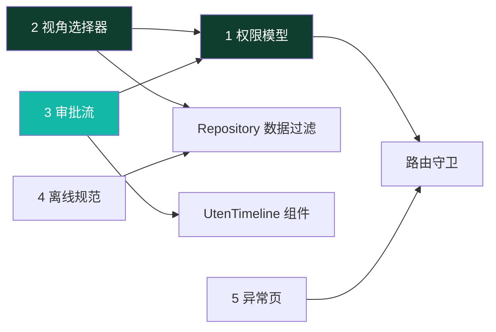
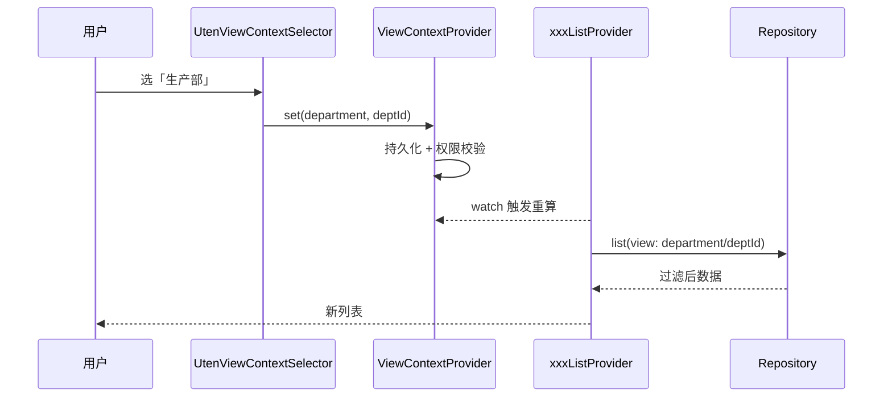
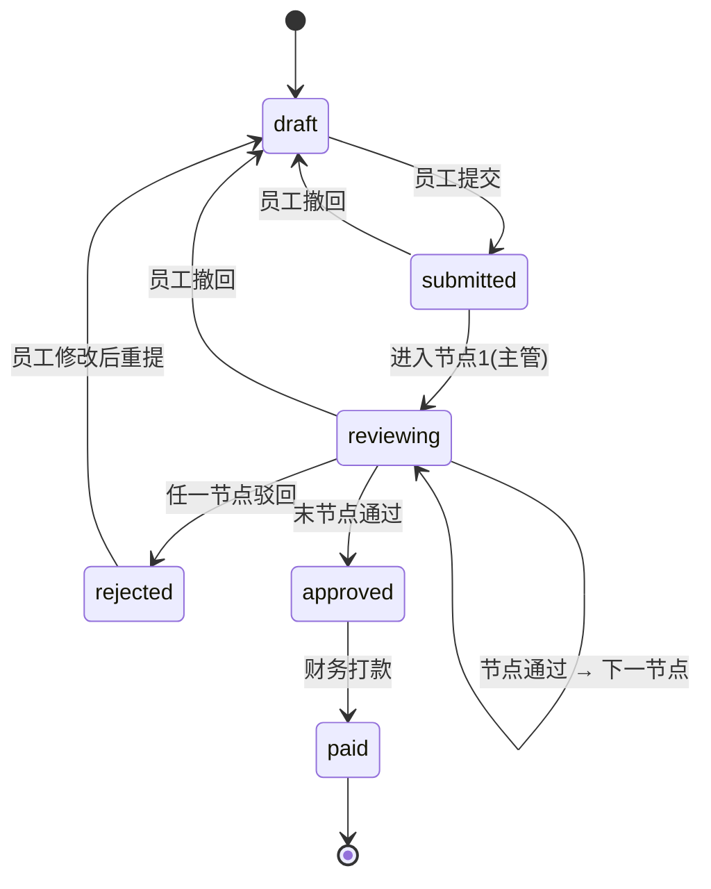
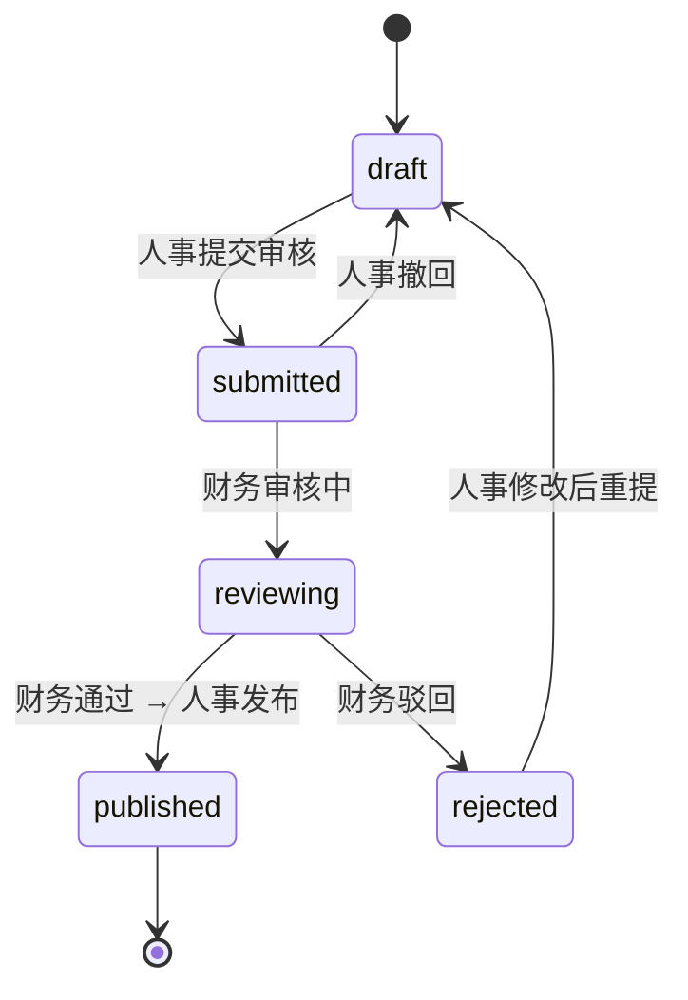

# 全局机制（跨页面状态与流程）

> 本档定义 Uten IMP **横跨多个页面/模块**的全局机制，是所有业务页面的地基。
>
> 配套文档：
> - 权限：[10-安全准则](../00-项目准则/10-安全准则.md) + [安全策略](安全策略.md)（§十为权威）
> - 路由：[路由设计](路由设计.md)
> - 状态：[状态管理](状态管理.md)
> - 数据：[实体字典](../04-数据模型/实体字典.md) + [ER草图](../04-数据模型/ER草图.md)

---

## 〇、本档涵盖（五个机制 + 依赖关系）

| # | 机制 | 一句话 | 落地形态 | 状态 |
|---|---|---|---|---|
| 1 | 权限模型与路由守卫 | 部门配置 + 个人覆盖 + 按权限点脱敏；路由级/页面级/数据级三层校验 | `permission_by_path.requiredAnyPermFor` + `currentPermissionsProvider` + redirect | ✅ 已实施（ADR-011） |
| 2 | 管理视角上下文选择器 | 领导/人事在「全公司/部门/员工/自己」间切换数据范围 | `ViewContextProvider` + `UtenViewContextSelector` | 🟡 设计定稿，未实施 |
| 3 | 审批流建模 | 可配置多级审批，报销/工资条复用统一轨迹模型 | `ApprovalNode` + `ApprovalRecord` + `UtenTimeline` | 🟡 设计定稿（状态机已在业务页落地；通用轨迹组件未实施） |
| 4 | 离线与乐观更新规范 | 只读缓存 / 乐观更新 / 离线排队 / 必须在线 四档策略 | 现仅定规范；落地时建统一 `OfflineActionQueue` | 🟡 规范定稿，未实施 |
| 5 | 异常页与引导 | 统一 404 空状态；无权限 redirect + Toast；引导推迟 | `errorBuilder` + Toast | ✅ 主体已实施（首次引导仍未做） |

**依赖关系**：



---

## 一、权限模型与路由守卫

> **2026-07-24 重构（V27–V30，[ADR-011](../99-决策记录-ADR/ADR-011-工作台部门分区与动态权限配置.md)）**：角色体系已下线。**现行模型**：
>
> ```
> 有效权限 = 全员基础（employee 包，人人有份）
>          ∪ 部门配置（department_permissions，所在部门 + 所有上级部门递归向上并集）
>          ∪ 个人加授 − 个人收回（user_permission_overrides）
>          （超级管理员恒为全量）
> ```
>
> - 权限目录动态化（`GET /admin/permission-catalog`），新功能在 Flyway 迁移里登记权限点即可被超管分配；
> - 权限管理页（`/admin/permissions`，超管专属）：按部门（目录勾选）/ 按员工（已授权·未授权两态）调整；
> - 数据范围用分级权限点 `资源:动作:范围`（如 `customer:view:self/department/all`），路由守卫用 `requiredAnyPermFor`（任一满足即放行）；
> - 配置写库即时；变更后吊销相关用户 refresh token，强制重新登录即时生效（≤15 分钟 access token 到期窗口）；
> - 敏感字段脱敏按权限点（`employee:pii:view` / `employee:compensation:view`），**不再按角色名**。

### 1.1 设计决策

| 问题 | 决策 |
|---|---|
| 权限粒度 | **权限点为主**（2026-07-24 起角色已下线，仅作 JWT roles claim / DataAccessPolicy 历史兼容） |
| 多来源用户 | 全员基础 ∪ 部门配置（含上级部门递归）∪ 个人覆盖，取**并集**（个人收回优先） |
| 无权限访问受保护路由 | redirect 到 `/dashboard` + 全局 Toast「无权限访问该页面」，**不做独立 403 页** |
| 菜单/按钮无权限 | 直接 `hide`（不渲染），**绝不 disable** |
| 数据范围 | self / department / all，**后端权威**，前端只做体验过滤（见第二节视角选择器） |
| 权限管理入口 | `/admin/permissions`（超管，要求 `user:manage`）：按部门（目录勾选）/ 按员工（两态覆盖）；保存即写库并吊销相关用户 refresh token 强制重登 |
| 菜单显隐数据源 | 工作台模块区与路由守卫共用 `permission_by_path.requiredAnyPermFor()`，单一映射不再两处维护 |
| 即时生效 | 配置写库即时；保存部门配置时吊销该部门子树所有用户 refresh，保存个人覆盖时吊销该用户 refresh（access token ≤15 分钟到期后强制重登） |

### 1.2 权限点常量（节选）

> 完整清单见 [`lib/shared/auth/permissions.dart`](../../lib/shared/auth/permissions.dart)（与后端 `permissions` 表 `code` 一一对应）。新增功能：在 Flyway 迁移里 `INSERT` 新行 + 在此追加常量。

```dart
// lib/shared/auth/permissions.dart（节选）
abstract final class Perm {
  // 员工档案 / 部门
  static const employeeView = 'employee:view';
  static const employeeEdit = 'employee:edit';
  static const departmentView = 'department:view';
  static const userManage = 'user:manage';            // 系统管理（超管）

  // 工资条（数据范围分级）
  static const payrollViewSelf = 'payroll:view:self';
  static const payrollViewAll = 'payroll:view:all';
  static const payrollGenerate = 'payroll:generate';
  static const payrollReview = 'payroll:review';

  // 报销审批
  static const expenseApprove = 'expense:approve';

  // 访客
  static const visitorApprove = 'visitor:approve';
  static const visitorHostConfirm = 'visitor:host-confirm';
  static const visitorCheckIn = 'visitor:check-in';

  // 个人信息自助（Phase 6）
  static const profileEditSelf = 'profile:edit:self';
  static const profileReview = 'profile:review';
  static const employeeCompensationView = 'employee:compensation:view';  // 薪资明文

  // 业务模块（各单据 :view / :edit + 报表 *_report:view）
  // 采购 / 销售 / 委外 / 仓库 / 库存 / 生产 / 钱流 / 基础资料 …（详见源文件）

  // 客户资料：三级数据范围（首个 `资源:动作:范围` 实战，ADR-011）
  static const customerViewSelf = 'customer:view:self';
  static const customerViewDepartment = 'customer:view:department';
  static const customerViewAll = 'customer:view:all';
}
```

> **历史角色映射（`rolePermissions` Map）已于 2026-07-24（V29）下线**。后端 `PermissionResolver` 合成有效权限时不再读 `user_roles` / `department_roles`（数据保留作 JWT roles claim 兼容）。前端权限判定一律走 `currentPermissionsProvider`（来自后端合成结果），**不再在前端平行合成角色映射**。

### 1.3 当前用户权限 Provider

```dart
// lib/shared/auth/permissions.dart

/// 当前用户的功能权限集合（**直接用后端合成结果**，前端不再二次合成）。
///
/// 超级管理员（UserProfile.superAdmin == true）后端已经把全量 permissions 推过来；
/// 这里对超管额外 union 所有已知 Perm 常量作兜底（即便后端漏推某个新增权限也能 work）。
final currentPermissionsProvider = Provider<Set<String>>((ref) {
  final user = ref.watch(sessionProvider).user;
  if (user == null) return const <String>{};
  if (user.superAdmin) {
    return <String>{
      Perm.employeeView, Perm.employeeEdit, Perm.userManage,
      Perm.payrollViewSelf, Perm.payrollViewAll, Perm.payrollGenerate, Perm.payrollReview,
      Perm.expenseApprove, Perm.profileEditSelf, Perm.profileReview,
      Perm.employeeCompensationView,
      // … 全部已知常量（采购/销售/委外/仓库/生产/钱流/基础资料）
      ...user.permissions,
    };
  }
  return user.permissions.toSet();
});

/// 通用权限判定。超管短路放行，其他按字符串匹配。
bool hasPerm(Ref ref, String code) {
  if (ref.read(isSuperAdminProvider)) return true;
  return ref.read(currentPermissionsProvider).contains(code);
}
```

要点：
- **`AppUser.can()` 不再对持 admin 角色短路**（V30 安全加固）；只认 `superAdmin || permissions.contains(perm)`，与后端 `@PreAuthorize` 语义一致。
- 前端 `currentPermissionsProvider` 是后端合成结果的**视图**，不参与"角色 → 权限"推导——单一事实来源在后端。

### 1.4 路由 → 所需权限点（集中管理）

```dart
// lib/core/router/permission_by_path.dart

/// 返回某路径所需的权限点列表（**任一满足**即放行）；不需要权限返回 null。
/// 这是路由守卫与工作台显隐共用的唯一数据源。
List<String>? requiredAnyPermFor(String location) {
  // 系统管理（超管）
  if (location == '/admin/permissions' || location.startsWith('/admin/')) {
    return const [Perm.userManage];
  }
  // 员工档案（按段区分 view/create/edit）
  if (location == '/employee' || location.startsWith('/employee/')) { ... }

  // 客户资料：三级数据范围任一即达最低门槛
  if (location.startsWith('/finance/customers')) {
    return const [
      Perm.customerViewSelf,
      Perm.customerViewDepartment,
      Perm.customerViewAll,
    ];
  }

  // 采购 hub：任一采购单据 view 即可见
  if (location == RouteName.purchase) {
    return const [
      Perm.purchaseRequestView, Perm.purchaseOrderView,
      Perm.purchaseReceiptView, Perm.purchaseReturnView,
    ];
  }
  // ... 销售 / 委外 / 仓库 / 生产 / 钱流 同模式
  return null;
}

/// 兼容旧签名：对"任一满足"的多权限路径只返回第一个（最低门槛）。
String? requiredPermFor(String location) =>
    requiredAnyPermFor(location)?.first;
```

> 数据范围 `资源:动作:范围` 的语义：路由守卫只判"能否看到入口"（任一范围即可），**业务查询按用户持有的最高范围过滤**（取最高范围顺序 all > department > self）——过滤逻辑在后端。

### 1.5 三层校验

| 层 | 位置 | 做法 |
|---|---|---|
| **路由级** | `app_router.dart` redirect | `requiredAnyPermFor(path)` 命中且 `!hasPerm(任一)` → 返回 `/dashboard` + 触发 Toast |
| **页面级** | 导航项 / 入口卡 / 按钮 | `.where((item) => hasPerm(item.perm))` 直接 hide |
| **数据级** | Repository / 后端 | 接收 `viewContext`（见第二节，未实施前按当前用户身份过滤），**后端二次校验**（`@PreAuthorize` + DataAccessPolicy） |

```dart
// redirect 追加权限校验（在现有登录校验之后）
redirect: (context, state) {
  // …现有登录校验…
  final perms = ref.read(currentPermissionsProvider);
  final isSuper = ref.read(isSuperAdminProvider);
  final required = requiredAnyPermFor(state.matchedLocation);
  if (required != null && !isSuper && required.none(perms.contains)) {
    ref.read(globalToastProvider.notifier).show(l10n.errNoPermission);
    return RouteName.dashboard;
  }
  return null;
},
```

### 1.6 即时生效（V30 加固）

权限变更保存即写库（`department_permissions` / `user_permission_overrides` 直写），并：
- **保存部门配置** → 吊销该部门子树（含下级）所有用户 refresh token；
- **保存个人覆盖** → 吊销该用户 refresh token；
- 用户 access token 到期（≤15 分钟）后 refresh 立即 401 → 跳登录 → 重登后新 token 带新权限。
- 已实测：保存后相关用户 refresh 立即 401。

### 1.7 对照清单

- [x] `permission_by_path.requiredAnyPermFor` 覆盖所有受保护路由（单据/报表/系统管理）
- [x] 菜单项/入口卡用 `where(hasPerm)` 过滤，无 `disable`
- [x] redirect 接入权限校验，无权限跳工作台 + Toast
- [x] 超管走 `superAdmin` 字段短路（不再对 admin 角色短路）
- [x] 关键写操作有专属权限点（不只靠查看权限）
- [x] 配置变更吊销 refresh token 强制重登

---

## 二、管理视角上下文选择器（ViewContextProvider）

> **状态**：🟡 设计定稿，未实施。来源：[页面总览 §4.4](../03-页面/页面总览.md)。
> 现状下数据范围由后端按用户身份/权限点直接过滤；本机制是"运行时切换数据范围"的扩展，落地时再实施。

### 2.1 概念

一个全局状态，记录"当前查看的数据范围"。切换后，所有**跟随视角**的页面/Provider 自动按此范围过滤数据。

### 2.2 视角档位

```dart
// lib/shared/providers/view_context_provider.dart（待新建）

enum ViewScope {
  self,        // 我自己（默认，全员）
  department,  // 某部门全员
  employee,    // 下钻到某员工
  company,     // 全公司
}

class ViewContext {
  final ViewScope scope;
  final String? departmentId;  // scope=department 时
  final String? employeeId;    // scope=employee 时
  const ViewContext({this.scope = ViewScope.self, this.departmentId, this.employeeId});
}
```

### 2.3 可见范围（按权限点 `viewcontext:scoped` 联动，不再按角色）

| 用户持有权限 | 可选视角 | 说明 |
|---|---|---|
| 无 `viewcontext:scoped` | 仅 self | 看不到选择器 |
| 持有 `viewcontext:scoped` | self / department / employee | 部门/员工维度 |
| 持有 `viewcontext:scoped` 且被授 `*:all` 范围 | + company | 加全公司 |
| 超管 | 全部 | 含 company |

> **可见性规则**：`!hasPerm(Perm.viewContextScoped)` 时选择器不渲染，强制 self。视角范围不能超过用户被授予的数据范围权限（`customer:view:department` 持有者不能切到 company）。

### 2.4 UI：全局 AppBar 右侧选择器

- 组件：`UtenViewContextSelector`（`lib/components/navigation/uten_view_context_selector.dart`，待新建）
- 位置：`UtenAppBar` 的 `actions`，所有跟随页统一注入
- 交互：下拉/弹层，列出当前用户可选视角；选 department/company 后二级选具体部门/范围
- 默认：`self`；选择持久化到后端 `user_preferences`（key 带权限前缀，下次启动恢复，但启动时校验是否仍有权）
- 文案走 i18n

```
┌──────────────────────────────┐
│ 工作台          [全公司 ▼] ⚙  │  ← 选择器在 AppBar 右侧，齿轮是设置
├──────────────────────────────┤
```

### 2.5 跟随视角的页面矩阵

| 页面 | 是否跟随 | 说明 |
|---|---|---|
| 工作台 Dashboard | ✅ | KPI 按范围汇总 |
| 工资条列表 | ✅ | hr/manager 按范围列工资条（员工永远只看自己） |
| 报销列表 | ✅ | finance/manager 按范围列报销 |
| 员工档案 | ✅ | 直接按 department/employee 展示 |
| 工资条生成 | ✅ | 按部门生成 |
| 财务报表 | ✅ | 按范围汇总 |
| 通知列表 | ❌ | 通知按发布范围（部门/工种/全员），不按视角 |
| 建议箱 | 部分 | 「我的建议」不变；「建议广场」可按部门筛 |
| 我的 / 设置 | ❌ | 个人页，不跟随 |

### 2.6 技术实现

```dart
final viewContextProvider = NotifierProvider<ViewContextNotifier, ViewContext>(
  ViewContextNotifier.new,
);

abstract interface class PayrollRepository {
  Future<List<PayrollSlip>> list({required ViewContext view, PayrollFilter? filter});
}

final payrollListProvider =
    FutureProvider.family<List<PayrollSlip>, PayrollFilter>((ref, filter) async {
  final view = ref.watch(viewContextProvider);   // 切视角 → 重拉
  return ref.read(payrollRepositoryProvider).list(view: view, filter: filter);
});
```

> 实施时：Repository 把 `view` 透传给 API（`?scope=department&deptId=xx`），后端按权限点二次校验（防越权）。

### 2.7 数据流



### 2.8 对照清单（实施前）

- [ ] `UtenViewContextSelector` 按 `hasPerm(viewcontext:scoped)` 显隐
- [ ] 选择持久化 + 启动时权限校验（权限变更要降级回 self）
- [ ] 所有跟随页的 Provider `watch(viewContextProvider)`
- [ ] Repository 签名统一接收 `ViewContext`
- [ ] 无 `viewcontext:scoped` 权限者全程 self，无选择器

---

## 三、审批流建模（可配置多级）

> **状态**：🟡 设计定稿。
> 现状：报销/工资条的状态机已在业务页落地（详见对应页面文档 + 实体字典）；**通用审批轨迹组件 `UtenTimeline` + 流程定义 `ApprovalNode` 未实施**，落地时按本节建模。

### 3.1 为什么要多级

制造业报销常跨部门（出差报销要主管批 + 财务批），单级审批上线后必然要改。前端一开始就按多级建模，避免返工。

### 3.2 通用审批模型（脱离具体业务）

> 把原实体字典里的 `ExpenseApproval` 收敛为通用 `ApprovalRecord`（带 entityType 区分），新增 `ApprovalNode`（流程定义）。详见 [实体字典](../04-数据模型/实体字典.md)。

```dart
/// 审批流程节点定义（可配置，按 flowType 分模板）
/// 例：报销流程 = [节点1 直属主管, 节点2 财务]
class ApprovalNode {
  final String id;
  final ApprovalFlowType flowType;   // expense / payroll
  final int order;                    // 顺序，从 1 开始
  final String name;                  // 「直属主管审批」
  final String? approverRole;         // 历史字段：谁来批（已改按权限点 expense:approve/payroll:review）
}

/// 一次审批动作的记录（轨迹的一格）
class ApprovalRecord {
  final String id;
  final ApprovalFlowType entityType;  // expense / payroll
  final String entityId;              // 报销单/工资条 ID
  final int nodeOrder;                // 第几节点
  final String? approverId;           // 实际审批人
  final ApprovalDecision decision;    // pending / approved / rejected
  final String? comment;              // 审批意见
  final DateTime? actedAt;
}

enum ApprovalFlowType { expense, payroll }
enum ApprovalDecision { pending, approved, rejected }
```

> 注：角色下线后，"谁来批"由权限点（`expense:approve` / `payroll:review`）决定，不再绑定 `approverRole`。

### 3.3 报销审批流（ExpenseClaim）

**默认流程**：员工提交 → 节点1 直属主管 → 节点2 财务 → 通过则打款 / 任一节点驳回则回退员工。



> 6 个状态与现有 [报销详情页](../03-页面/报销详情页.md) 一致：`draft / submitted / reviewing / approved / rejected / paid`。

### 3.4 工资条审批流（PayrollSlip / PayrollBatch）



> 工资条状态：`draft / submitted / reviewing / published / rejected`（员工侧再加 `viewed / downloaded`，属读取态，不影响审批流）。

### 3.5 审批轨迹 UI：UtenTimeline（未实施）

- 组件：`UtenTimeline`（`lib/components/data_display/uten_timeline.dart`，待新建）
- 竖向时间线，每节点一格：节点名 + 状态（✅ 通过 / ❌ 驳回 / ⏳ 待审批 / ○ 未到达）+ 审批意见 + 时间
- 当前 pending 节点高亮
- 性能档 lite：去掉连线动画，纯静态列表

```
┌──────────────────────────┐
│ 审批轨迹                   │
│ ● 提交申请   员工张三       │
│ │   2026-07-15 09:00      │
│ ● 主管审批   李主管  ✅ 通过 │
│ │   意见：同意             │
│ │   2026-07-15 14:20      │
│ ◉ 财务审批   ⏳ 待审批      │  ← 当前节点高亮
│ │                         │
│ ○ 自动打款   —             │
└──────────────────────────┘
```

### 3.6 权限与并发

- 审批权限点：`expense:approve`（财务/主管）、`payroll:review`（财务）
- **乐观锁防并发**：审批/撤回接口带版本号（`If-Match`），避免「财务审批中员工撤回」覆盖
- 审批中（reviewing）员工仍可**撤回**（回到 draft），撤回后审批作废

### 3.7 对照清单（实施前）

- [ ] `ApprovalNode` / `ApprovalRecord` 入实体字典 + ER
- [x] 报销/工资条状态机按本档定义（业务页已落地）
- [ ] 审批详情页用 `UtenTimeline` 展示轨迹
- [x] 审批/撤回带版本号防并发
- [x] 审批权限点接入路由守卫 + 按钮显隐

---

## 四、离线与乐观更新规范

> **状态**：🟡 规范定稿，未实施。
> 现状：所有列表/详情走真实后端，断网时由 `ApiException` 统一报错（"网络连接失败，请检查后重试"）。
> 本节为后续离线能力落地的统一规范，避免每个页面各写各的。

### 4.1 操作分级策略

| 操作类型 | 策略 | 示例 |
|---|---|---|
| **只读列表** | 离线缓存上次成功结果 + 顶部「离线缓存」提示 | 工资条/报销/通知/建议列表 |
| **乐观更新** | 本地立即生效 + 后台异步同步，失败回滚 + Toast | 点赞、标记已读、全部已读 |
| **离线排队** | 写本地队列，恢复网络后按序重放，冲突用版本号 | 提交报销、提交建议、撤回、标记下载、提交建议回复 |
| **必须在线** | 断网直接 Toast「请检查网络后重试」，不排队 | PDF 下载、附件下载、审批动作、工资条生成、加密导出 |

### 4.2 OfflineActionQueue 统一设计（实施时落地）

```dart
class PendingAction {
  final String id;
  final String entityType;       // 'expense' / 'notice' / ...
  final String entityId;
  final String action;           // 'submit' / 'withdraw' / 'markRead' / ...
  final Map<String, dynamic> payload;
  final PendingStatus status;    // pending / syncing / failed
  final int retryCount;
  final DateTime createdAt;
  final int version;             // 乐观锁，防并发覆盖
}
```

- Worker：监听网络状态，恢复后按 `createdAt` 顺序重放
- 重试：指数退避，超阈值进死信 + 告警
- 冲突：服务端返回 409 → 按 `version` 决定覆盖/提示用户

### 4.3 各页面的离线要求（汇总，落地时逐页实现）

| 页面 | 只读缓存 | 乐观更新 | 离线排队 | 必须在线 |
|---|---|---|---|---|
| 工资条列表/详情 | ✅ | — | 标记 viewed/downloaded | PDF 下载 |
| 报销列表/详情 | ✅ | — | 提交/撤回/删除、草稿 | — |
| 新建报销 | — | — | 草稿离线保存 | 提交（可排队）|
| 通知列表/详情 | ✅ | 标记已读、全部已读 | 标记已读排队 | 附件下载 |
| 建议箱 | ✅ | 点赞 | 提交建议/回复 | — |
| 加密导出 | — | — | — | ✅（数据外发，必须在线 + 限流 + 审计） |

### 4.4 安全

- 匿名建议的真名脱敏**必须由后端统一处理**，前端拿到的数据已脱敏，前端不参与脱敏逻辑
- 离线队列里的 PII payload 需考虑本地存储加密（hive 加密 / sqflite_cipher）

### 4.5 对照清单（实施前）

- [ ] 每个列表页明确属于哪一档离线策略（本文档已列）
- [ ] Repository 接口预留 `fromCache` / `syncQueue` 入参
- [ ] 离线提示文案进 i18n（`offlineCachedHint` 等）

---

## 五、异常页与引导

### 5.1 404 页（路由不存在）

`app_router.dart` 的 `errorBuilder` 用 `UtenEmpty` 美化：

```
┌──────────────────────────┐
│        🧭 (exploring)     │
│      页面走丢了            │
│   你访问的页面不存在        │
│      [返回工作台]          │
└──────────────────────────┘
```

- 用 `UtenEmpty(icon: Icons.travel_explore, title: l10n.errNotFound, action: UtenButton → go dashboard)`
- 保留原 `error.toString()` 仅在 debug 模式小字显示

### 5.2 无权限（"403"）

- **不做独立页**
- 路由级：redirect 到 `/dashboard` + 全局 Toast「无权限访问该页面」（见 §1.5）
- 组件级：直接 hide

### 5.3 首次登录引导 `/onboarding`

- **仍未实施**
- 预留路由 `RouteName.onboarding = '/onboarding'`，登录后首次进入时检测标志位决定是否走引导

### 5.4 全局 Toast 机制

- 上述无权限提示、离线提示、会话失效提示需要一个**全局 Toast/Snackbar Provider**
- 现状：`ScaffoldMessenger.of(context)` 散落各页，跨页触发困难
- 待新建：`lib/shared/providers/global_feedback_provider.dart`，提供 `showToast(msg)` / `showSnack(msg)`（路由守卫 / AuthInterceptor 间接路径都用得上）

---

## 六、全局机制对照清单（开发前总自检）

- [x] 权限：`permission_by_path` + `currentPermissionsProvider` + redirect 三件套接好
- [x] 权限：菜单/按钮全 `hide`，无 `disable`
- [x] 权限：超管走 `superAdmin` 字段，不对 admin 角色短路
- [x] 权限：配置变更吊销 refresh token 强制重登
- [ ] 视角：`ViewContextProvider` + `UtenViewContextSelector`，按权限点显隐
- [ ] 视角：跟随页 Provider 都 `watch(viewContextProvider)`
- [ ] 审批：`ApprovalNode`/`ApprovalRecord` 实体 + ER 同步
- [x] 审批：报销/工资条状态机按本档
- [ ] 审批：详情页用 `UtenTimeline`
- [x] 审批：审批/撤回带版本号
- [ ] 离线：每页明确离线策略档位，Repository 预留参数
- [x] 异常：404 用 `UtenEmpty`，无权限 redirect + Toast
- [ ] 全局：`globalFeedbackProvider` 提供统一 Toast

---

## 七、禁忌

🚫 禁止在业务页散落 `MediaQuery` / `ScaffoldMessenger` 做权限或 Toast（走统一 Provider）
🚫 禁止用 `disable` 表达无权限（一律 hide）
🚫 禁止各页面自己写审批轨迹 UI（一律 `UtenTimeline`）
🚫 禁止审批流写死单级（按可配置多级建模）
🚫 禁止在前端做匿名脱敏（后端统一）
🚫 禁止离线逻辑各页各写（统一 `OfflineActionQueue`）
🚫 禁止把审批/视角/数据范围权限只放前端（后端必须二次校验）
🚫 禁止对持 admin 角色的用户短路放行（V30 起：只认 `superAdmin` 字段）

---

## 八、落地排期

| 机制 | 状态 | 说明 |
|---|---|---|
| 权限模型 + 路由守卫 | ✅ 已实施 | ADR-011（V27–V30）；部门配置 + 个人覆盖 + 即时生效 |
| 视角选择器 | 🟡 设计定稿 | 待业务首次需要"运行时切换数据范围"时落地 |
| 审批流状态机 | ✅ 已实施 | 报销/工资条状态机已在业务页落地 |
| 审批流通用轨迹组件 | 🟡 设计定稿 | `UtenTimeline` + `ApprovalNode` 待实施 |
| 离线规范 | 🟡 规范定稿 | 现仅文档；后续按需落地 `OfflineActionQueue` |
| 异常页 + 全局 Toast | 🟡 主体已实施 | 404 美化已做；`globalFeedbackProvider` 待统一抽取 |

---

## 九、相关文档

- [10-安全准则](../00-项目准则/10-安全准则.md) — 权限点与存储分级
- [安全策略 §十](安全策略.md) — 数据导出/高危配置安全规范（权威）
- [路由设计](路由设计.md) — 路由表与 redirect
- [状态管理](状态管理.md) — Provider 分层
- [实体字典](../04-数据模型/实体字典.md) — ApprovalNode / ApprovalRecord
- [ER草图](../04-数据模型/ER草图.md) — 审批关系
- [页面总览 §4.4](../03-页面/页面总览.md) — 视角选择器原始需求
- [ADR-011](../99-决策记录-ADR/ADR-011-工作台部门分区与动态权限配置.md) — 权限模型重构

---

**最后更新**：2026-07-27（去 Mock 阶段；权限模型对齐 ADR-011；离线/视角/审批轨迹组件标注未实施）
