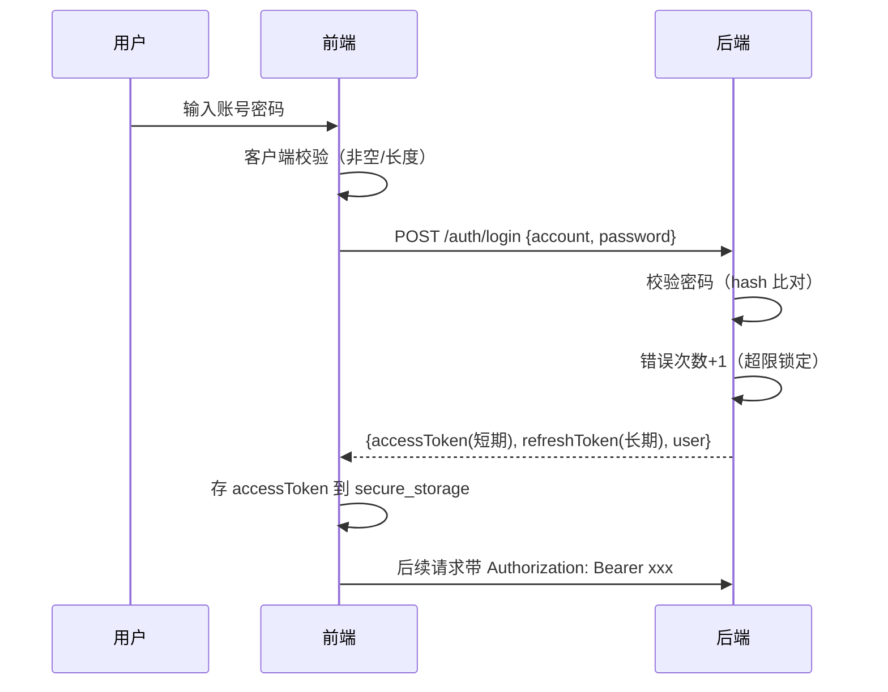

# 安全策略

> 本档是 Uten IMP 的安全架构总览。
> 详细前端准则见 [../00-项目准则/10-安全准则.md](../00-项目准则/10-安全准则.md)，本档聚焦架构层面。

---

## 一、安全原则

1. **深度防御**：前端 + 后端 + 网络多层防护，任何一层失守不致命
2. **最小权限**：默认拒绝，按需授予
3. **前端不可信**：前端所有校验只是体验优化，**后端必须独立校验**
4. **配置外置**：密钥/URL/账号不进代码，走环境变量或配置中心
5. **审计可追溯**：关键操作必须可追溯（谁/何时/做了什么）
6. **数据分级**：不同敏感度的数据用不同存储和传输方式

---

## 二、威胁模型（OWASP Top 10 2021 对照）

| OWASP | 威胁 | 本项目应对 |
|---|---|---|
| A01 | 访问控制失效 | 后端每个 API 独立校验权限；前端 hide 不 disable |
| A02 | 加密失败 | HTTPS 强制；敏感数据 flutter_secure_storage；传输 TLS 1.2+ |
| A03 | 注入 | 后端 ORM / 参数化查询；前端输入校验前置过滤 |
| A04 | 不安全设计 | 威胁建模；安全设计 review |
| A05 | 安全配置错误 | 配置外置；生产关闭调试；默认拒绝 |
| A06 | 易受攻击组件 | 依赖定期 review；锁定版本 |
| A07 | 身份认证失败 | 强密码策略；错误次数限制；双因素（可选） |
| A08 | 数据完整性失败 | 请求签名；JWT 签名校验 |
| A09 | 日志监控不足 | 审计日志；异常告警 |
| A10 | 服务端请求伪造 | 后端 URL 白名单；不直接传 URL |

---

## 三、认证与会话

### 3.1 登录流程

### 3.2 Token 策略

| Token | 有效期 | 存储 | 用途 |
|---|---|---|---|
| accessToken | **480 分（8 小时）**（可配 `jwt_access_ttl_minutes`，系统设置页「登录令牌有效期」，最小 5 分） | flutter_secure_storage | API 鉴权 |
| refreshToken | 7 天（可配 `jwt_refresh_ttl_days`，系统设置页「登录保持时长」） | flutter_secure_storage | 静默续期 accessToken |

accessToken 过期 → 后端返 **401**（由 `SecurityConfig` 的 `AuthenticationEntryPoint` 保证——过期/匿名统一 401，而非 Spring 默认 403）→ 前端 `AuthInterceptor` 单飞调 `/auth/refresh` 换新 accessToken + 重试原请求（**用户无感**），同时用响应里的 user 同步刷新权限快照。
refreshToken 过期（7 天）/ 被吊销 / 重用检测命中 → 跳登录页。

> ⚠️ **过期 access 必须返 401 不能返 403**：前端只在 401 时刷新，返 403 会被当「无权限」误显。曾因 `SecurityConfig` 未配 entry point、过期 token 落到默认 `Http403ForbiddenEntryPoint`，导致用户每 access TTL 看到一次「无权限」、需重登才恢复（2026-07-27 修复，见 [ADR-014](../99-决策记录-ADR/ADR-014-会话超时与token刷新机制修复.md)）。

### 3.2.5 会话空闲超时（前端 idle，与 token 独立的第二层）

除 token 外，前端 `IdleTimeoutGuard`（包在已登录区根）提供第二层会话保护——**滑动会话**：监听用户点击/滑动/输入续期，连续无操作超过阈值（`session_idle_timeout_minutes`，默认 30 分，系统设置页「自动退出登录」可配）→ 弹窗提示后登出（清 access+refresh，强制重输密码）。

| | access TTL（令牌层） | idle 超时（人的行为层） |
|---|---|---|
| 计时对象 | 令牌多久过期 | 用户多久没操作 |
| 到期行为 | 静默 refresh（用户无感） | 弹窗登出 |
| 防的是 | 令牌被窃后可滥用多久 | 用户离开但系统还开着 |

两层叠加：**一直操作**时 access 静默续期、idle 不计时（都不打扰）；**离开 30 分** idle 登出（即使令牌未到期）；**离开 7 天** refresh 过期需重输密码。idle 阈值实时生效（进系统拉一次 + 每 5 分钟轮询 + 超管保存后 `idleThresholdVersionProvider` 信号立即重拉）。

### 3.3 密码策略

- 至少 8 位
- 至少包含字母 + 数字
- 不允许和账号相同
- 错误 5 次锁定 15 分钟
- 每 90 天强制更换（可选）
- 不可使用最近 5 次用过的密码

前端在登录/改密页做强度提示，后端强制校验。

### 3.4 多端会话

- 同一账号可在多设备登录
- 提供会话列表 + 远程登出
- 异地登录告警

---

## 四、权限模型

### 4.1 权限模型（部门 + 个人覆盖 + 按权限点脱敏）

> 2026-07-24 角色体系下线（[ADR-011](../99-决策记录-ADR/ADR-011-工作台部门分区与动态权限配置.md)）。
> 现行模型细则见 [../00-项目准则/10-安全准则.md §六](../00-项目准则/10-安全准则.md)。

- **基础权限**：全员基础包（`employee` 权限点集合）
- **部门权限**：用户所属部门 ∪ 所有上级部门配置的权限点并集
- **个人覆盖**：对单个用户加 / 减权限点（如临时授予某报表查看权、或回收导出权）
- **按权限点脱敏**：敏感字段（PII / 薪酬）按 `employee:pii:view` / `employee:compensation:view` 等权限点决定是否展示
- **超管**：拥有全部权限点

### 4.2 前后端校验双保险

| 层 | 校验 | 说明 |
|---|---|---|
| 前端 | 隐藏菜单/按钮 | 体验优化 |
| 后端 | 每个 API 校验 | 真相源 |

**前端隐藏 ≠ 安全**，绕过前端直接调 API 必须被后端拒绝。

### 4.3 数据范围

不仅是"能不能访问"，还有"能看哪些数据"：

| 数据范围 | 说明 | 示例 |
|---|---|---|
| self | 只能看自己 | 普通员工看自己的工资条 |
| department | 看本部门及下属部门 | 部门主管看本部门员工 |
| all | 看全部 | 超管、或被授予 `*:view:all` 的用户 |

后端按用户身份过滤数据。

---

## 五、网络安全

| 项 | 要求 |
|---|---|
| HTTPS | 强制，不允许明文 HTTP |
| TLS 版本 | 1.2 及以上 |
| 证书 | 生产环境有效证书，禁止忽略证书校验 |
| CORS | Web 端配置严格白名单 |
| CSRF | Web 端使用 SameSite Cookie 或 CSRF Token |
| 请求签名 | 关键操作（如审批/转账）加签名防篡改 |
| 限流 | 登录、敏感 API 限流（如登录 5 次/分钟） |

---

## 六、数据安全

### 6.1 传输中

- 全部走 HTTPS
- 敏感字段（密码、身份证号）后端日志脱敏
- 不在 URL 中传敏感数据（用 body）

### 6.2 存储中

| 数据类型 | 存储 | 说明 |
|---|---|---|
| 偏好（主题/语言） | shared_preferences | 明文无所谓 |
| Token | flutter_secure_storage | iOS Keychain / Android Keystore |
| 用户缓存 | hive（加密） | 可选加密 |
| 离线业务数据 | 不存 | 敏感数据不落本地 |

### 6.3 展示中

- 身份证号、手机号部分隐藏（138****1234）
- 金额按权限脱敏（普通员工看不到他人工资）
- 截屏保护（移动端可选禁止截屏，敏感页面）

---

## 七、审计日志

关键操作必须记日志：

| 字段 | 说明 |
|---|---|
| userId | 操作人 |
| action | 操作类型（login/create/update/delete/approve） |
| target | 操作对象（如 employee:123） |
| before | 变更前值（JSON） |
| after | 变更后值（JSON） |
| ip | 来源 IP |
| userAgent | 客户端 |
| timestamp | 时间戳 |
| result | 成功/失败 |

需要审计的操作：
- 登录/登出
- 权限变更
- 员工入离职
- 工资条生成/发布
- 报销审批
- 数据导出
- 配置修改

---

## 八、前端安全接入点（均已实现）

以下接入点**均已真实落地**，非空实现 / 非预留：

- **鉴权拦截器** [`lib/core/network/interceptors/auth_interceptor.dart`](../../lib/core/network/interceptors/auth_interceptor.dart)：每个请求注入 `Authorization: Bearer <accessToken>`；响应 401（非登录/刷新接口本身）时单飞（`Completer` 去重）调 `/auth/refresh`，成功则换 token 重试原请求，**并把响应里的 user 经 `SessionEventBus.publishProfile` 转发给 `sessionProvider` 同步刷新权限快照**（使权限变更随 refresh 即时生效，不必重登）；失败经 `sessionEventBus.expire` 触发会话失效回登录页。配合后端 `SecurityConfig` 的 `AuthenticationEntryPoint`（过期/匿名统一返 401），access 过期可被静默续期、用户无感。
- **安全存储** [`lib/core/security/secure_storage.dart`](../../lib/core/security/secure_storage.dart)：access/refresh token、登录账号、访客令牌均走 `flutter_secure_storage`（iOS Keychain / Android Keystore），不进 shared_preferences；登出时 `clearTokens()` 保留账号名以便下次预填。
- **会话状态** Riverpod `sessionProvider` + `sessionEventBus`：登出 / 失效统一清令牌并跳登录页；`sessionEventBus.publishProfile` 在 access 静默刷新成功时把最新 user 转发给 `sessionProvider`，**权限快照随刷新滑动更新**（不再只在登录时拉一次）。
- **会话空闲超时守卫** [`lib/features/shell/widgets/idle_timeout_guard.dart`](../../lib/features/shell/widgets/idle_timeout_guard.dart)：包在已登录区根，滑动会话——监听用户活动续期，连续无操作超阈值（默认 30 分）弹窗登出；阈值实时生效（进系统拉 + 5 分钟轮询 + 超管保存立即重拉，见 §3.2.5）。
- **路由守卫** `permission_by_path`：按路径前缀校验权限点（如 `/admin/` 需 `user:manage`），不满足直接不放行；详见 [路由设计.md](路由设计.md)。

---

## 九、当前实现状态

- ✅ **后端已接入**（Spring Boot 3 + PostgreSQL），分三类现状：
  - **已接真实后端**（前端 Dio + 后端 REST）：鉴权 / 基础资料（货品/客户/供应商/币种/账户/模具/颜色/单位/仓库/类别）/ 销售 / 采购 / 委外 / 仓库单据 / 生产（计划+成本+日报+报表）/ 钱流 / 访客。
  - **Dio + 后端接口就绪，待真实数据录入后切换**：员工 / 部门 / 岗位 —— Dio repository 与后端 REST 已就绪，但人事数据尚在整理（未入库），前端 provider 暂用 Mock 显示样例数据；待人事录入真实数据后切 provider 即生效（Mock 届时删除）。
  - **前端 Mock 待后端**（无 Dio 实现待开发）：工资条 / 报销 / 通知 / 建议 / 实验室 / 空调 / 库存查询（Phase 1-4 前端先行）。
- ✅ **安全机制已端到端验证**：Argon2id 密码哈希、JWT 轮换（access 8h / refresh 7天，TTL 可配；**过期返 401 触发静默续期**）、**会话空闲超时（idle，30 分无操作登出）**、**权限快照随 refresh 滑动更新**、pgcrypto 字段加密、AFTER 触发器审计、**部门权限 + 个人覆盖 + 按权限点脱敏**（角色体系 2026-07-24 下线，见 [ADR-011](../99-决策记录-ADR/ADR-011-工作台部门分区与动态权限配置.md)）。
- 部署 checklist 见 [../00-项目准则/10-安全准则.md](../00-项目准则/10-安全准则.md)

---

## 十、数据导出与高危配置安全规范（2026-07-27，以后范式）

> 本节是加密导出 + 系统设置落地后沉淀的**强制规范**。新增任何「数据导出」「高危配置」功能，必须照此执行。
> 详见 [ADR-012](../99-决策记录-ADR/ADR-012-报表加密导出与列排序与行跳源头.md) /
> [ADR-013](../99-决策记录-ADR/ADR-013-系统设置与安全策略可视化.md)。

### 10.1 数据导出（整表数据外发）—— 五道防线（缺一不可）

| 防线 | 实现 | 要点 |
|---|---|---|
| ① 独立权限 | `*_report:export` / `*:export`（**不复用 `:view`**） | 「能查看」≠「能导出」；V71 seed + 回填跟随查看，管理员可按部门/用户回收 |
| ② 频率限流 | `ExportRateLimiter`（Bucket4j per-userId）+ 拦截器 `POST /api/**/export` | 超限 429；阈值 `export_rate_limit_per_minute` 入系统设置可配 |
| ③ 加密传输 | POI SXSSF + Agile AES-256；**密码入 body**（非 URL/query）+ prod HTTPS | Excel/WPS 打开需密码；单元格按文本写防 `=CMD()` 公式注入 |
| ④ 行数上限 | 单次 ≤ `export_max_rows`（默认 10 万，可配） | 超限拒绝，防 OOM / 批量拖库 |
| ⑤ 审计 | `audit.logExplicit("export_<module>_report", ...)` | 记 谁/什么报表/多少行/IP；审计页「仅导出」可查 |

新增导出端点范式：`*ReportService.export(report,params,sort,order)`（switch 分发 + `paginateAll` 循环累积）+ `*Controller POST /export`（`@PreAuthorize(':export')` + `@RequestBody{password}` + 审计 + 加密 `ResponseEntity<byte[]>`）。前端统一用 [UtenExportButton](../02-组件库/UtenExportButton.md)。

### 10.2 高危配置（系统设置）—— 改策略即影响全员

| 防线 | 实现 |
|---|---|
| ① 路由守卫 | `/admin/` 前缀统一要求 `user:manage`（permission_by_path）→ 普通用户**连入口卡片都看不到** |
| ② 鉴权 | Controller `@PreAuthorize('user:manage')` |
| ③ **二次密码确认** | `SystemSettingsService.write` 用 `PasswordEncoder` 校验当前账号密码——**即使 access token 被盗，改策略还需密码** |
| ④ 审计 | `update_system_setting`（记 谁/哪项/旧→新值） |
| ⑤ 校验 | 类型 + 非负双重校验（后端权威 + 前端提示） |
| ⑥ 范围 | 只放**运行时可生效的策略阈值**；密钥（jwt.secret/crypto/sms AK）/部署类（CORS/swagger/DB）**绝不入配置页**（走 env/Vault） |

### 10.3 报表隐藏元数据（行跳源头）—— `__` 前缀命名约定

列 key 以 `__` 开头 = 隐藏元数据列（如 `__srcId`）：`execute()` 末尾 `columns.filter(c -> !c.key().startsWith("__"))` 不进返回 `columns`（前端不渲染、导出 Excel 不含），但 row Map 已 put 其值（前端 `onRowTap` 可读 `row['__srcId']`）。新增「行带元数据但不展示」的需求照此约定，**无需改表格组件**。

### 10.4 新增导出/配置功能 checklist

- [ ] 导出：独立 `:export` 权限 + 限流 + 加密 + 行数上限 + 审计（五道防线）
- [ ] 配置：路由守卫 + `@PreAuthorize` + 二次密码 + 审计 + 类型校验 + 只放阈值（密钥/部署类走 env）
- [ ] 隐藏元数据用 `__` 前缀，execute 过滤
- [ ] 密码入 body，错误信息不暴露 stack/code

---

## 十一、待定问题

- [ ] 是否需要双因素认证（TOTP / 短信）
- [ ] 是否接入企业 SSO / LDAP
- [ ] 密码是否需要定期强制更换
- [ ] 是否禁止移动端截屏
- [ ] 审计日志保存多久
- [ ] 是否需要 IP 白名单

---

**最后更新**：2026-07-27（清理过时段对齐现状：§3.2 去「后端接入后」字样、§四 改为部门权限 + 个人覆盖 + 按权限点脱敏（角色下线 ADR-011）、§八 改为「均已实现」并指向真实文件、§九 业务模块全量接真实后端；§十 加密导出 / 高危配置规范与 §十一 待定问题维持不变。**二次更新 2026-07-27**：§3.2 access TTL 15分→480分(8h)可调 + 过期返 401（entry point）+ 新增 §3.2.5 会话空闲超时（idle）小节；§八 补 AuthInterceptor 权限快照随 refresh 刷新 + IdleTimeoutGuard 接入点；§九 补 idle/权限快照。见 [ADR-014](../99-决策记录-ADR/ADR-014-会话超时与token刷新机制修复.md)）
