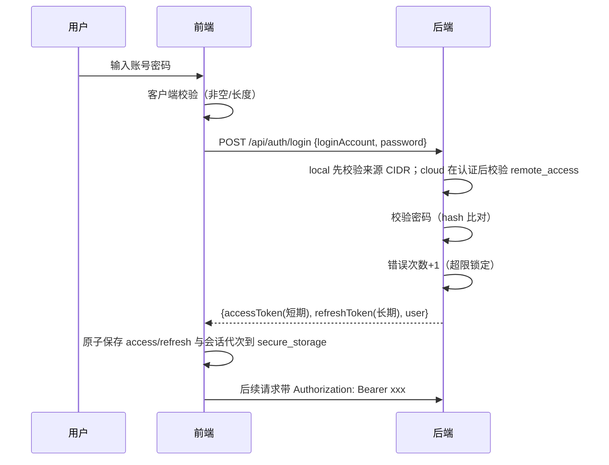

# 安全策略

> 本档是 Uten IMP 的安全架构总览。
> 详细前端准则见 [../00-项目准则/10-安全准则.md](../00-项目准则/10-安全准则.md)，本档聚焦架构层面。

---

## 一、安全原则

1. **深度防御**：前端 + 后端 + 网络多层防护，任何一层失守不致命
2. **最小权限**：默认拒绝，按需授予
3. **前端不可信**：前端所有校验只是体验优化，**后端必须独立校验**
4. **配置外置**：密钥/URL/账号不进代码，走环境变量或配置中心
5. **审计可追溯**：关键操作必须可追溯（谁/何时/做了什么）
6. **数据分级**：不同敏感度的数据用不同存储和传输方式

---

## 二、威胁模型（OWASP Top 10 2021 对照）

| OWASP | 威胁 | 本项目应对 |
|---|---|---|
| A01 | 访问控制失效 | 后端每个 API 独立校验权限；前端 hide 不 disable |
| A02 | 加密失败 | HTTPS 强制；敏感数据 flutter_secure_storage；传输 TLS 1.2+ |
| A03 | 注入 | 后端 ORM / 参数化查询；前端输入校验前置过滤 |
| A04 | 不安全设计 | 威胁建模；安全设计 review |
| A05 | 安全配置错误 | 配置外置；生产关闭调试；默认拒绝 |
| A06 | 易受攻击组件 | 依赖定期 review；锁定版本 |
| A07 | 身份认证失败 | 强密码策略；错误次数限制；双因素（可选） |
| A08 | 数据完整性失败 | JWT 签名校验；服务端状态机、幂等、版本/行锁与数据库约束；通用业务请求签名尚未实现 |
| A09 | 日志监控不足 | 审计日志；异常告警 |
| A10 | 服务端请求伪造 | 后端 URL 白名单；不直接传 URL |

---

## 三、认证与会话

### 3.1 登录流程

未知账号和错误密码使用相同对外错误；后端仍对未知账号执行一次 dummy Argon2 匹配以降低账号枚举
时序差。dummy hash 在 `LoginService` 构造时预计算，避免首个未知账号请求临时编码带来的额外延迟
与并发初始化差异。该控制只能缩小可观察差异，不能替代登录限流、锁定、统一响应和生产时序测试。

### 3.2 Token 策略

| Token | 有效期 | 存储 | 用途 |
|---|---|---|---|
| accessToken | 源码默认 **15 分钟**；运行值可由 `jwt_access_ttl_minutes` 系统设置覆盖（最小 5 分，生产实际值须从目标库核验） | 标签页级会话存储（Web：sessionStorage，各标签页独立；原生：flutter_secure_storage） | API 鉴权 |
| refreshToken | 7 天（可配 `jwt_refresh_ttl_days`，系统设置页「登录保持时长」） | 同上（随 token record 单记录保存） | 静默续期 accessToken |

accessToken 过期 → 后端返 **401**（由 `SecurityConfig` 的 `AuthenticationEntryPoint` 保证——
过期/匿名统一 401，而非 Spring 默认 403）→ 前端 `AuthInterceptor` 在本标签页内协调
`/api/auth/refresh`，只允许当前会话代写回，再重试原请求并用响应里的 user 同步权限快照。
refreshToken 过期、被吊销或重用检测命中时，只有后端返回精确的结构化拒绝且客户端 CAS 命中当前记录，
才清理并跳登录页。

### 3.2.1 员工会话记录、CAS 与退出边界

- 员工 access/refresh 与 `generation/intentGeneration/sessionLineage` 原子保存在单个
  `auth.token_record.v1` 权威记录中，**记录按标签页隔离**（ADR-061：Web 存 sessionStorage，
  同一浏览器多标签页可各自登录不同账号互不顶替；原生为进程级共享安全存储）。`generation` 记录所有写，`intentGeneration` 只推进用户/安全
  意图，`sessionLineage` 隔离登录会话。refresh 保持 intent/lineage；登录、改密、退出或明确拒绝推进
  intent 并切换 lineage。
- refresh 保存/清理比较完整快照 CAS；登录/改密提交比较预留的 `intentGeneration + lineage`，再叠加
  `SessionNotifier` 本地 mutation epoch，保证 latest-intent-wins。迟到响应不能覆盖、误清或向新账号
  交付旧账号数据；本地校验失败返回 `409 SESSION_CHANGED/SESSION_STATE_UNAVAILABLE`。
- 权威记录不存在时才允许迁移旧双键，且先写新记录再删旧键；权威记录存在但损坏时写无令牌 tombstone，
  禁止从残留旧键复活。Web Locks/lease 锁只携带 owner、到期时间等不敏感互斥元数据，绝不保存 token；
  跨标签页 BroadcastChannel 会话通知已随 ADR-061 移除（会话不再跨标签页共享）。
- 退出先使 UI 未登录并激活非敏感 logout fence（Web 随标签页存储隔离，只封闭本标签页；原生为普通
  偏好存储）；随后在跨标签 token record 锁内读取
  最新记录，先通过 `beforeClear` 把旧 refresh 持久交接到加密撤销队列，成功后才写 logout tombstone。
  交接失败时保留 fence 与原 token record 供 0/30/120ms 重试，禁止先删设备上的唯一 refresh 副本；
  fence 不可读或关键清理失败也阻止启动恢复。只有交接和清理成功，或成功的新登录 intent 取代旧会话，
  才能安全解除 fence。
- 上述旧 refresh 在退出返回前必须进入 `flutter_secure_storage` 的加密撤销队列（最多 32 项、保留 30 天），
  网络调用随后异步执行。队列只重试公开且幂等的 `/auth/logout`，成功后删除精确 token；它不是通用业务
  离线队列，不得承载订单、审批、支付或其它写请求。

### 3.2.2 破坏性刷新拒绝必须精确

只有以下 `HTTP status + JSON code` 组合是销毁本地会话的权威证据：

- staff：`401 + UNAUTHORIZED`、`401 + ACCOUNT_LOCKED`、`401 + ACCOUNT_DISABLED`、
  `422 + VALIDATION_FAILED`、`403 + REMOTE_ACCESS_DENIED`；
- visitor：上述共享规则外，另允许 `403 + VISITOR_BLOCKED`。

HTML 401、空体 401、未知 code 401、status/code 错配、任意 503、429、网络/超时、解析异常或缺失
accessToken 的畸形 2xx 都归为 `unavailable`，必须保留 token 并传播原错误。刷新后业务重放失败也不
销毁新会话。此规则只控制客户端是否破坏本地凭据，不会放宽服务端对每个请求的认证和授权。

> **staff JWT 最小化与 V135 即时失效。** staff access JWT 只携带标准签发字段及
> `sub/typ/auth_version(av)/authorization_epoch(ae)`，不再复制账号、员工、角色、权限或
> `mustChangePassword`。登录、刷新与改密响应的 `user.roles/user.permissions` 契约保持不变，
> 所以前端功能与权限展示无需从 JWT 解码。旧 token 中的权限 claim 即使仍在 TTL 内也会被忽略。
>
> `JwtAuthFilter` 每请求查询轻量账号投影，先复查 active/软删、改密状态、员工绑定和两个版本；
> 通过后再从服务端合成角色/权限。权限快照采用 30 秒、最多 2048 项的版本键 LRU 缓存，
> `auth_version/epoch` 改变会立即拒绝旧 token 或命中新键，不受 TTL 延迟；停用/删除始终在缓存前
> fail-closed。用户主动改密和管理员重置密码都会先递增 `auth_version`，再签发替代 token/撤销
> refresh，旧 access 下一请求即 401。个人覆盖、用户角色、员工换部门、部门树、共享权限及超管
> 变化继续沿用 V135 版本机制即时失效。
>
> 账号投影、数据库或权限解析器异常属于可用性故障，统一返回 JSON
> `503 + SERVICE_UNAVAILABLE`；不得伪装成 401、不得清客户端会话。明确不存在/停用/删除、员工绑定
> 无效或 `av/ae` 不匹配才返回结构化 401。

> **访客 JWT PII 最小化。** JWT payload 只签名、不加密，客户端或持有 token 的中间环节可以读取
> claim。新签发 visitor access token 以 `visitorNo` 同时填入 `acc/vno`，头像使用单独 `avs`
> seed，不再携带原手机号；登录与刷新共用该签发路径，`JwtAuthFilter`、`AuthUser` 和 Flutter
> 冷启动恢复已同步。旧 token 只为滚动兼容而可读，上线切换应等待旧 access TTL 到期或主动清退，
> 并验证通用审计中的登录标识不再是手机号。

> **JWT 环境隔离。** `JwtService` 构造时要求 secret 和 issuer 都非空，签发写入 issuer，解析时用
> `requireIssuer` 强制比对。生产 profile 必须显式提供环境唯一 `UTEN_JWT_ISSUER`；开发默认
> `uten-imp-dev`。同一 HS256 密钥被两个环境误复用时，issuer 不同的 token 仍会被拒绝，定向测试
> 已覆盖该负向路径。issuer 不能替代每环境独立密钥和正常轮换。

> ⚠️ **过期 access 必须返 401 不能返 403**：前端只在 401 时刷新，返 403 会被当「无权限」误显。曾因 `SecurityConfig` 未配 entry point、过期 token 落到默认 `Http403ForbiddenEntryPoint`，导致用户每 access TTL 看到一次「无权限」、需重登才恢复（2026-07-27 修复，见 [ADR-014](../99-决策记录-ADR/ADR-014-会话超时与token刷新机制修复.md)）。

### 3.2.5 会话空闲超时（前端 idle，与 token 独立的第二层）

除 token 外，前端 `IdleTimeoutGuard`（包在已登录区根）提供第二层会话保护——**滑动会话**：监听用户点击/滑动/输入续期，连续无操作超过阈值（`session_idle_timeout_minutes`，默认 30 分，系统设置页「自动退出登录」可配）→ 弹窗提示后登出（清 access+refresh，强制重输密码）。计时与登出均**按标签页独立**（ADR-061）：每个标签页只按自己的操作续期，超时只登出自己，互不影响。

| | access TTL（令牌层） | idle 超时（人的行为层） |
|---|---|---|
| 计时对象 | 令牌多久过期 | 用户多久没操作 |
| 到期行为 | 静默 refresh（用户无感） | 弹窗登出 |
| 防的是 | 令牌被窃后可滥用多久 | 用户离开但系统还开着 |

两层叠加：**一直操作**时 access 静默续期、idle 不计时（都不打扰）；**离开 30 分** idle 登出（即使令牌未到期）；**离开 7 天** refresh 过期需重输密码。idle 阈值实时生效（进系统拉一次 + 每 5 分钟轮询 + 超管保存后 `idleThresholdVersionProvider` 信号立即重拉）。

### 3.3 密码策略

- 至少 8 位
- 至少包含字母 + 数字
- 不允许和账号相同
- 错误 5 次锁定 15 分钟
- 每 90 天强制更换（可选）
- 不可使用最近 5 次用过的密码

前端在登录/改密页做强度提示，后端强制校验。

**管理员临时密码（V297，`POST /api/admin/users/{id}/reset-password`，`account:support`）：**

- 两种来源：系统生成（20 位高熵随机，四字符类全覆盖）或管理员自定义（与改密策略同口径
  终审：8–64 位、无空白、含字母+数字、不得等于登录账号）。
- 一次性交付：明文只出现在当次响应，不持久化、不写日志/审计详情；重置即置
  `must_change_password=true`、撤销全部会话，员工登录后由 `PasswordChangeRequiredFilter`
  收口到改密端点，其余 API 一律 403。
- 72 小时有效期：写 `users.temp_password_expires_at = now + 72h`；到期后即使密码正确也拒绝登录
  （401「临时密码已过期」），改密成功清除该列。入职/补开的初始密码（证件号后 6 位）不适用本有效期。
- 每次成功重置写显式审计 `password_temporary_reset`（操作人/目标/生成模式）；账号支持端点
  一律禁止操作超级管理员与本人，堵住「持 `account:support` 的账号被盗后重置超管密码」的横向提权路径。

### 3.4 启动与引导账号

- `spring.profiles.active` 未显式配置时默认 `prod`，本地开发必须设置 `UTEN_PROFILE=dev`。
- base/prod 默认关闭 Swagger 并使用 INFO 日志；dev 才默认开放 Swagger 和业务 DEBUG 日志。
- prod 对数据库连接、JWT issuer 和 CORS 等部署值使用必填占位，缺失即启动失败。
- `BootstrapRunner` 只在空库且引导账号不存在时创建 `admin`，并要求至少 12 位一次性密码和首登改密。
  账号已存在时严格跳过，不读取引导密码、不写账号，也不会在每次启动时重新授予被人工撤销的超管
  权限。部署完成后应移除一次性密码并审计后续授权变更。

### 3.5 多端会话（部分实施）

- 同一账号可在多设备/多浏览器登录：后端每次登录签发独立 refresh 会话、互不踢线（自始支持）
- 同一浏览器多标签页登录不同账号：已实施（ADR-061，会话记录按标签页隔离）
- 会话列表 + 远程登出：未实施
- 异地登录告警：未实施

### 3.6 本地/云端远程访问门禁（V241）

`users.remote_access` 是员工云端入口授权，不是普通业务权限点；默认 `FALSE`。三层服务端边界如下：

| 边界 | local 站点 | cloud 站点 |
|---|---|---|
| 登录 `POST /api/auth/login` | `LocalNetworkGuardFilter` 在 JWT/Controller 前校验来源 CIDR；允许后按正常密码/账号策略登录 | 密码正确且账号状态已校验后，`RemoteAccessPolicy` 拒绝 `remote_access=false`，返回 `403 REMOTE_ACCESS_DENIED` 且不签 token |
| 刷新 `POST /api/auth/refresh` | 同一 local CIDR 门禁 | 在 refresh 轮换/签发前复查远程授权；未授权 403 且不产生替代 token |
| 每个 `/api/**` 请求 | local CIDR 门禁覆盖 login、refresh、员工和访客；`/actuator/**` 留给健康监测 | `JwtAuthFilter` 后的 `RemoteAccessGuardFilter` 对每个已认证 staff 复查；visitor 是明确例外 |

- local 策略只读取 `request.remoteAddr`。仅当 Tomcat 确认直接对端匹配受信代理正则后，
  `RemoteIpValve` 才能以转发头替换它；Filter 本身绝不直接相信来访者提供的 `Forwarded`/
  `X-Forwarded-For`。无法解析的字面 IP、空 CIDR 或非法 CIDR 均 fail-closed/启动失败。
- local 默认包含 loopback/RFC1918 便于安全开发，生产必须用 `UTEN_LOCAL_ALLOWED_CIDRS` 收窄到公司
  实际网段，并同时收窄 `UTEN_TRUSTED_PROXY_REGEX` 与 8080 防火墙入口；不能把“RFC1918”当公司身份。
- 只有超级管理员且持 `authorization:manage` 可调用
  `PUT /api/admin/users/{id}/remote-access`。请求体必须显式含非 null Boolean；`{}` 返回 422、缺 body
  返回 400，均不得默认为撤权。
- 授权或撤权都会由 V241 递增目标 `auth_version`，服务层撤销全部 refresh token并记录方向审计，要求
  目标重新登录。撤权后旧 access 先被 JWT 版本检查拒绝为 401；旧 refresh 在 cloud 返回
  `403 REMOTE_ACCESS_DENIED`。这是预期的两层 fail-closed 次序，并非要求旧 access 绕过 JWT 到远程 Guard。
- visitor 没有 `users.remote_access`，cloud 策略跳过 visitor 以保留独立公网 OTP 边界；它仍受访客
  状态、权限、对象范围、限流与审计控制，local 源 CIDR 门禁也不会跳过 visitor。

---

## 四、权限模型

### 4.1 权限模型（部门 + 个人覆盖 + 按权限点脱敏）

> 2026-07-24 角色体系下线（[ADR-011](../99-决策记录-ADR/ADR-011-工作台部门分区与动态权限配置.md)）。
> 现行模型细则见 [../00-项目准则/10-安全准则.md §六](../00-项目准则/10-安全准则.md)。

- **基础权限**：全员基础包（`employee` 权限点集合）
- **部门权限**：用户所属部门 ∪ 所有上级部门配置的权限点并集
- **个人覆盖**：对单个用户加 / 减权限点（如临时授予某报表查看权、或回收导出权）
- **按权限点脱敏**：敏感字段（PII / 薪酬）按 `employee:pii:view` / `employee:compensation:view` 决定是否展示
- **敏感写入拆分**：V141 起 `employee:create/edit` 只授权普通档案；证件/联系方式/银行字段另需
  `employee:pii:edit`，工资/社保/公积金/补贴另需 `employee:compensation:edit`
- **超管**：拥有全部权限点
- **高危个人-only 权限**（任何部门默认都不授予，需逐条个人点名）：`audit_log:view`/`audit_log:export`
  （V173 触发器硬拒部门级）、`authorization:manage`、`user:manage`、`stock:balance:adjust`、
  `finance_asset:approve`/`post`/`dispose`/`export`、`finance_asset_period:manage`。
  业务部门默认权限矩阵见 [V212 部门默认权限矩阵](../数据迁移/54-部门默认权限矩阵.md)（受控重置，
  写权限下沉叶子部门、管理中心/公司留空）。授权页「全部授权」按钮在此基础上额外排除敏感业务动作
  `sales_order:priority`、`sales_order:reallocate`、`supplier_return_task:handle`，避免一键放行。

### 4.2 前后端校验双保险

| 层 | 校验 | 说明 |
|---|---|---|
| 前端 | 隐藏菜单/按钮 | 体验优化 |
| 后端 | 每个 API 校验 | 真相源 |

**前端隐藏 ≠ 安全**，绕过前端直接调 API 必须被后端拒绝。

### 4.3 数据范围

V393–V399 / ADR-050 起，owner 数据范围明确分层：

- 手工“额外查看”只读，不授予通用编辑、删除、状态或负责人变更；
- 单客户 viewer 只读取该客户，不扩大到同 owner 其它客户；
- 正式 handover 才转移当前负责人或把历史 owner 加入接手人的可写责任集合；
- maker/approver/created_by/audit actor 永不因人员离职被改写；
- 离职先标记 resigned、再交接和清理、最后停账号；并发新增责任由数据库行锁守卫拒绝。

业务详情页和直达编辑路由不能从功能权限或前端当前员工 ID 自行推导可写性，统一读取
`GET /api/auth/me/document-scopes/{scope}`。该端点只接受 `sales/finance/purchase/subcontract/
production_plan/stock_doc` 白名单且不接受目标用户 ID，响应固定为
`{scope, writeAll, writableOwnerIds}`：`writeAll` 只来自超级管理员或显式 `*:view:all`，可写 owner
只来自本人和正式交接历史；手工 `user_data_scopes` 绝不进入可写集合。响应缺失、scope 不一致、请求失败
或仍在加载时，Flutter 一律按只读处理；刷新详情会重新取能力，避免交接后长期使用旧缓存。

详情页不得只隐藏按钮而不解释：加载态显示“正在确认操作范围”；请求失败显示“无法确认操作范围，当前
仅查看”并提供重试；可见但不可写显示“此单据通过额外查看范围显示，仅可查看”，并引导正式交接或联系
管理员。`maker/owner IS NULL` 的 legacy 公共单据单独显示“历史单据未维护负责人，当前只读”；即使
`writeAll=true` 也必须先补负责人，服务端 `canWrite` 同样拒绝无负责人写入。提示使用语义色、图标和完整
文字，不能只靠颜色传达状态。

生产计划 `allowedActions` 缺失或空集合、采购/委外详情 `canEdit/canDelete/canReverse` 缺失时一律
fail closed。受支持的非订单标准详情由服务端按 `0=草稿/1=已审/-1=红冲` 明确序列化三个生命周期能力；
采购/委外订单继续使用其更细的财务待审、来源限制等权威能力。

标准单据删除统一只允许 `DRAFT`：状态为空、已审核或已红冲均拒绝。红冲记录是已发生业务的历史事实，
即使当前用户仍持有对象写范围和删除功能权限，也不得通过直接 API 软删；DTO `canDelete` 与 Flutter
删除入口必须使用同一草稿口径。

普通编辑、删除、提交、取消和非池化状态动作使用该能力与功能权限的交集。财务 maker-checker、生产审核
等明确池化动作继续由服务端“普通可读范围 + 专用 action authority”判定；生产链仓库任务继续叠加仓库
组织对象范围，不能把普通 owner 能力错误套到池化任务，也不能借池化权限扩大普通 CRUD。

本人档案使用独立的 self 对象边界：`GET /api/profile/me` 要求 `profile:edit:self`，不接受
employeeId，只从已认证 staff 的 `AuthUser.employeeId` 解析；访客拒绝，账号未绑定员工档案返回
`404 NOT_FOUND`。本人可看自己的个人 PII 明文，但该对象例外不授 `employee:pii:view`，不能读取
同事；银行与薪酬仍分别要求 `employee:pii:view` / `employee:compensation:view`。“我的”页固定
不渲染银行/薪酬，即使当前账号另持这些权限。普通 `GET /api/org/employees/{id}` 的脱敏规则不变。

不仅是"能不能访问"，还有"能看哪些数据"：

| 数据范围 | 说明 | 示例 |
|---|---|---|
| self | 只能看自己 | 普通员工看自己的工资条 |
| department | 看本部门及下属部门 | 部门主管看本部门员工 |
| all | 看全部 | 超管、或被授予 `*:view:all` 的用户 |

后端按用户身份过滤数据。

层级树关联搜索不得成为数据范围旁路：服务端定位结果必须与右侧列表/报表使用相同对象范围，客户端再丢弃
空 ID 和当前授权树外 ID。货品/库存定位端点不会授予分类树权限；应收应付位置查询要求
`finance_report:view` 且服务层要求超管或 `finance:view:all`，不能复用客户 owner 口径。

“我的部门”是明确的安全特例：`/api/my-department/tree|roster` 只允许当前用户所在大部门分支，越支 403；
统一搜索只处理该分支根花名册。Roster 仅返回 `employeeId/departmentId` 两个定位 ID 及工号、姓名、岗位、
所属部门、办公电话、邮箱、负责人/本人标记，不调用需要 `employee:view` 的全员员工接口，也不因搜索授予
`department:view`。员工业务选择器另用只需 `employee:view` 的最小部门树 DTO，不能借此读取负责人、编制或统计。

### 4.4 资产与待摊职责分离及落账门禁

V183 将资产权限拆为 `finance_asset:view/edit/approve/post/dispose/export` 和
`finance_asset_period:manage`。财税部部门默认只授予 view/edit；approve/post/dispose/export/
period manage 从部门默认授权中显式移除，必须由超管依据书面职责矩阵进行个人点名授权。export 权限
代码存在不等于真实资产导出端点已经交付，导出仍须通过独立接口、加密、限流和审计验收。

路由只校验 view；所有动作由服务端再次校验专属权限、对象版本、状态、期间以及本人回避，并将
`allowedActions` 返回给页面。页面只能取本地权限与服务端动作的交集，不能自行推导放行。月度运行
必须制单、他人审批、符合本人回避的最终过账；关闭/重开期间独立授权且重开必须有原因。

`UTEN_FINANCE_ASSET_POSTED_WORKFLOWS_ENABLED` 缺省为 `false`，当前阻断激活/初始确认、处置
申请/批准和待摊终止申请/批准。该开关是 fail-closed 风险隔离，不是上线捷径；B01–B15、UAT 和
变更审批完成前不得启用。已过账资产批次、逐项快照、日志、审批、事件和正式总账事实受数据库
不可变约束，错误写关联反向事实，禁止删除或原地改写。详见
[ADR-018](../99-决策记录-ADR/ADR-018-资产与待摊专业子账及不可变过账.md)和
[专项验收报告](../99-项目治理/2026-08-01-资产与待摊全链路实现与验收报告.md)。

### 4.5 采购/委外财务审批的审核组授权

V229/ADR-027 起采用审核组模型（取代 V196/V201 的单实例负责人），由 `WorkflowReviewerEligibility` 实时查库判定合格审核人：

- 采购/委外申请是生产物料分析按用户所选缺口形成的只读需求；商业订货必须由采购/委外人员从任务中心分解，不能恢复申请 CRUD/审核入口，也不能把通知写成自动下单。
- 合格审核人 = 财务部门(DEPT_FIN 及子树)内在职、账号启用且持当前 `finance_order_approval:approve` 或 `:reject` 动作的员工，或被 active 个人加授该具体动作的跨部门人员。inactive override/permission 不构成点名；超级管理员不自动绕过。
- `finance_order_approval:view` 只看共享队列；批准/驳回按具体动作分权。业务详情无决定动作，唯一写协议是财务任务中心 `{caseId,expectedVersion}` batch；旧 `orderId+version` 单笔路径过渡保留但 fail-closed（V328/ADR-027）。
- 前端动作只能取本地路径权限与服务端 `allowedActions` 的交集；`allowedActions` 缺失、未知或实例已变化一律 fail closed，不能从本地 `superAdmin`/角色自行显示审批按钮。
- 财务通过才使订单 `status=1` 并产生预计到货。超财务批准余量先隔离且不写库存/AP；财务批准量仍须仓库再次审核，未批准量只交原下单人确认退回，原下单人不能修改财务决定。
- 通知只是提醒，不是授权或任务事实；任务发现和决定接口由 `WorkflowReviewerEligibility` 实时判定当前账号是否合格审核人。合格审核人仅在精确订单存在 PENDING case 时可临时读取原本 owner 隐藏的订单详情，不扩大订货列表或 `*:view:all`；决定与业务副作用、返回详情在同一外层事务，详情组装失败必须回滚决定，case 结束后普通对象范围立即恢复。须用非审核人账号（不在财务部且未点名）做 404/403 负向测试。提交/到货超量检出时通知全体合格审核人。

V196–V202 已包含在开发原库 `uten_imp` V244 和公司目标库 V238；当前共享工作树迁移目录到 V289/270，270 个版本号无重复（V253 官网询盘、V272 未分类主档系统根均与生产默认车间无关；V277/V278 分别收紧账户科目和系统过账角色 UUID；V279–V287 的编号、人员/附件、局部 PII、审批快照保护、客户默认结算 UUID、扩展-only 员工敏感行及其派生一致性也都只是源码候选；V288/V289 已提供借用结构、终态守卫、审计与在线源码候选）。一次性生产物料克隆仍是 V250/231 历史证据。目录/本地回放存在不等于公司目标库迁移、真实权限 UAT 或业务验收。
负责人离职/停用处置、真实多账号/并发、仓库与供应商退回实物 UAT、完整 QMS/实物 IQC 和发布签字仍未完成，
该业务链生产 **NO-GO**。详见 [ADR-019](../99-决策记录-ADR/ADR-019-计划需求分解与采购委外财务审批.md)。

### 4.6 部门负责人页面内权限转授（2026-08-22 当前口径）

> 2026-08-02 的“我的部门”矩阵、`/managed`、逐码 `/overrides/{code}` 和负责人直接写 `user_permission_overrides` 已被 ADR-045 / V315–V329 取代，仅可作为历史演进记录，不得恢复。

全局 `/admin/permissions` 仍只允许超级管理员维护中央部门配置、个人 grant/revoke 和数据范围。普通负责人不进入该全局授权区，而是在已登记业务页右上角打开“权限设置”，只维护当前 surface、当前组织管理子树内员工的页面权限。

- **入口与目录**：业务页进入 `/page-permissions/:surfaceKey`；服务端只认 V328 的 `permission_surfaces` / `permission_surface_permissions` 精确关系，不按路由或权限码前缀回退。
- **组织权威**：只认 `departments.manager_id`；每个普通负责人根覆盖其未删除子树。稳定编码 `GM`
  且直接位于公司根、负责人是总经办直属在册员工时，总经办负责人覆盖全公司；显示名称、岗位/职级、
  `supervisor_id`、仅属于总经办、旧角色和前端布尔值均不授权。总经办结构位置和删除由前后端锁定。
- **显示与 ceiling 分离**：超级管理员显示本页完整目录；普通负责人只显示本人当前有效的本页权限，只能转授本人非委派来源的有效权限，排除全员基础、中央 revoke，并与服务端可转授策略取交集；委派所得权限不得继续递归下放。
- **来源隔离**：超级管理员写 `SUPER_ADMIN_CONFIRMED` 中央 `user_permission_overrides`；普通负责人只写 `manager_permission_delegations`。最终合成中中央 revoke 始终优先，负责人不能覆盖中央收回。
- **规模与并发**：部门默认留空，服务端递归验证全部授权根；选择部门后与该节点子树取交集。人员按
  在册状态、姓名/工号分页，每行携带真实部门，选中单人后才读取本页权限；V326 负责部门/trigram
  索引，V329 负责空筛选跨部门稳定排序；批量最多 100 项、逐项 CAS、整批原子，不返回完整矩阵。
- **未开户与账号支持**：人员列表包含无 `users` 行的在册员工，但未开户只显示明确空态，不渲染
  可编辑权限。负责人若另外持全局 `account:support`，可对当前选中人发起既有开户端点；负责人关系
  和 `authorization:manage` 都不替代该权限。开户成功必须先完成一次性凭据交付，确认保存并关闭后
  才刷新账号状态/加载权限；取消、失败和并发已开户均不发送权限 PUT。locked/disabled 是已有账号，
  不得误判为未开户。
- **即时失效**：成功写入后推进既有授权版本/epoch 并撤销目标 refresh token；负责人变化、调岗、离职、账号停用、中央覆盖变化和代际不匹配均使旧委派 fail closed。
- **默认与回退**：V328 与全量本地验收通过后，通用/生产源码默认开启页面委派。紧急停用时显式设置 `UTEN_MANAGER_PERMISSION_DELEGATION_ENABLED=false` 并重启新版本；保留委派行和审计证据，不回滚旧 JAR 或改写迁移。

现行契约详见 [ADR-045](../99-决策记录-ADR/ADR-045-页面内权限委派与授权来源隔离.md)、[部门管理页](../03-页面/部门管理页.md) 与 [权限管理页](../03-页面/权限管理页.md)。源码默认开启不代表公司目标库已迁移或功能已部署。

### 4.7 敏感字段脱敏与英文键防泄漏（2026-08-02 新增）

除按权限点脱敏（PII/薪酬）外，另一类泄漏是**面向用户的英文内部键**——懂技术者可据 `FIXED_ASSET_CATEGORY_POLICY` / `DEFERRED_EXPENSE_CATEGORY_POLICY` 等键名或 `costStyleId` 等字段名反推库表结构。2026-08-02 钱流「资产与待摊」政策未就绪横幅已彻底脱敏：

- **服务端全中文**：`FinanceAssetQueryService.overview` 下发「固定资产类别政策/长期待摊费用类别政策」；`AssetCategoryPolicyReadiness.missing()` 返回中文标签（仅展示用，`ready() = missing().isEmpty()` 逻辑不变）；`FinanceAssetCategoryService.activate` 各校验报错（`requirePostableStyle` / `requireDistinctAccounts` / 未来生效 / 长期待摊）与 `operationalBlockers` 英文句全部改中文。
- **前端防御映射**：`_PolicyBanner._friendlyPolicyLabel` 即便后端回退到英文键也映射成中文，**永不直出英文**。
- **逻辑零影响**：草稿照常保存，只阻断 submit / activate / post；脱敏只改展示文本，不改业务规则或库表结构。

该范式是后续模块的参考：**面向用户的提示/错误不应包含库表字段名或内部枚举常量**。新模块上线前的安全 review 须检查错误响应、横幅、日志输出是否泄露内部命名。

### 4.8 并发与重复操作防护（2026-08-07 加固）

> 详细并发模型见 [全局机制 §3.6.1](全局机制.md#361-平台并发控制模型与别人正在操作2026-08-07-安全并发审计结论)；

- **正确性底线（已全覆盖）**：业务单据写/审批走悲观行锁 `FOR UPDATE` + 状态前置条件 + DB 数量不变量触发器（V132）——重复审批、并发翻转、超收/超发/超退均已防住。
- **UX/防碰撞层（show-as-locked）**：统一任务软认领 `TaskClaimService`+`task_claims`(V215)。守卫 `requireNoActiveClaimByOther` 已接入费用审批、销售订单审核、采购分解；前端徽标待补。认领只是 UX 层，动作端点仍以悲观锁+状态守卫为底线。
- **主档丢失更新防护（V231）**：`clients/goods/suppliers` 加 `version` 列 + JPA `@Version` + 编辑 DTO 版本回传 + 服务端 `OptimisticLocks.requireUpToDate` 校验 + 全局 `OptimisticLockingFailureException→409`。两人改同一记录→后写者 409「该记录已被他人修改，请刷新后重试」。
- **范围 B（已落地 V233，2026-08-08）**：采购/委外/生产/库存按制单人 `maker_id` 隔离——抽平台级 `security/DocumentAccessPolicy`（泛化自销售）+ 4 模块薄壳，复用 `OwnerVisibility`；新增 `*:view:all` 权限点 + `user_data_scopes` 委托扩展；4 模块真实多账号越权 E2E 全绿。详见 [对象级授权统一实施报告](../99-项目治理/2026-08-08-对象级授权统一实施报告.md)。
- **财务范围恢复（V245，2026-08-09）**：V219 设计的 `finance` 委托范围被后续 V233 的约束重建遗漏，且五类财务 Service 未实际接入运行时策略。V245 以后置迁移恢复最终 CHECK 集合；统一 `FinanceDocumentAccessPolicy` 已覆盖付款、收款、费用、银行转账和其他收入的列表/详情/写/审核/红冲，越权读返回 404、越权写返回 403。隔离 PostgreSQL 已验证“仅有功能权限仍拒绝，显式委托制单人后才可审核”；开发原库 V244 和公司目标库 V238 尚未应用 V245，本轮一次性 V250 克隆已覆盖该迁移。

### 4.9 生产物料分析与外部供给来源保护（V234/V237/V239 与 V247–V250）

- `production_material_analysis:*` 细分 view/manage/route/notify/generate/reallocate（`bom_override` 已于 V423 随 BOM 例外机制下线删除）。路由 any-of 只允许进入工作台；每个按钮和 API 仍按动作权限、对象范围、analysis version/指纹及服务端动作条件独立拒绝。
- 用户多选通知先写幂等 action/allocation，再创建采购申请、委外申请或 MAKE child。前端复选状态、消息和角标都不能代替 action，也不能由生产权限取得采购/委外商业订货权限。
- V237 为 V234 新表补未来写入审计覆盖但不补历史；V239 仅允许剩余 `required_qty` 在全量 claim 后归零，客户端仍不能直接提交该终态或绕过数量守恒。
- V247 的阶段/包装边、V248 的 EXACT_SNAPSHOT 和 V249 的 ZERO_MATERIAL 证据必须由服务端/数据库计算并冻结。V423 后新执行段只允许 `DIRECT_MAKE`（无直接 BOM + 精确物料分析谱系）或 `NO_PRODUCTION_HARD_GATE`（BOM 存在且无生产硬门槛）；`PLAN_BOM_OVERRIDE` 仅允许历史已冻结执行段只读审计，不得由任何新请求、新页面或权限再次创建。客户端提交的 ready 数量、平均单耗或“无需求行”不能成为事实。
- V250 对外部化 action/allocation 使用不可变及 deferred 来源守卫，同时检查 OLD/NEW 关联，防止先换来源外键或先删订单头逃逸。申请/应用直接来源历史不可拆；订单批准、反向或 action 推进后，通用更新/删除必须 fail closed。
- 取消/释放必须走专用事务并同时处理 action 与下游来源；任何已有历史 action 的来源单不得被通用 CRUD 复活。迁移前须核对 route/type/id、allocation 总量、外部行归属和取消状态。
- 开发原库仍为 V244，公司目标库仍为 V238 既有证据，V247–V250 只有一次性隔离克隆证据；目标部署、历史来源对账、完整收货/IQC/QMS/反向和岗位 UAT 未完成，生产 **NO-GO**。

### 4.10 生产链健康检查的对象范围缺口（当前治理候选 NO-GO）

`GET /api/production/chain-health` 当前只要求 `production_material_analysis:view`，服务层直接执行全局 SQL，没有套用 `ProductionDocumentAccessPolicy`、owner/委派范围或销售对象范围。它会返回单号、货品和数量，因此不能因 V233 已覆盖普通生产单据就推导该聚合接口也安全；修复前不得向普通业务角色开放或作为生产放行证据。

当前检查也只覆盖四类候选异常：`SALES_GAP_NO_ANALYSIS`、`ANALYSIS_UNPLANNED`、`PLAN_NO_DRAW`、`DRAW_NO_PLAN`（单次最多 200 条）。它不检查采购/委外订单与收货、IQC、supply peg、报工、FINISHED_IN、批次或发运，故只能标为“有限治理候选”，不能命名或展示为完整全链健康证明。

上线前最低门禁：查询必须按当前账号的生产/销售对象范围先收窄候选集合，详情继续按目标单据权限二次授权；补齐 owner/委派/`*:view:all` 正负向多账号 HTTP 测试，并在页面显著写明四类覆盖。完成前该入口及其数据导出为 **NO-GO**。

---

## 五、网络安全

| 项 | 要求 |
|---|---|
| HTTPS | 强制，不允许明文 HTTP |
| TLS 版本 | 1.2 及以上 |
| 证书 | 生产环境有效证书，禁止忽略证书校验 |
| 客户端 API 基址 | 员工/访客共用 `apiBaseUrlProvider`；原生 Release 的本地 `API_BASE_URL` 与云端 `CLOUD_API_BASE_URL` 都只能是构建期可信 HTTPS，auto 本地可达优先；Web Release 强制同源 `/api` 并拒绝绝对 URL。API 地址是公开配置，`dart-define` 不得存密钥 |
| local 源网段 | `LocalNetworkGuardFilter` 位于 JWT 前，覆盖 login/refresh 与全部 `/api/**`；生产 `UTEN_LOCAL_ALLOWED_CIDRS` 必须收窄。cloud site no-op，Actuator 不在该 API 门禁内 |
| cloud 员工远程授权 | login、refresh 和每个已认证 staff 请求三处检查 `users.remote_access`；默认 false。visitor 只豁免此员工字段，不豁免自身安全策略 |
| CORS | Web 端配置严格白名单 |
| Web 入口 | `web/index.html` 不含内联 style/script，启动资源拆为同源 `loading.css`/`loading.js`；所有 Release/CI 构建必须带 `--no-web-resources-cdn`，让 CanvasKit 等运行时资源同源；Web 打印使用同源 PDF Blob，不进入公共 PDF.js/动态脚本路径；禁止通过放宽 CSP 接受第三方 CDN。Nginx 模板统一静态站点和 `/api` 反代，HTTP 308 跳 HTTPS，并设置 HSTS、严格 CSP、`frame-ancestors 'none'`/X-Frame-Options、nosniff、Permissions-Policy、COOP、gzip、2 MiB 请求体上限及鉴权/API 粗粒度 IP 限流 |
| JSON 请求体 | 应用默认限制 1 MiB，并实际读取最多上限+1，覆盖错误/伪造 Content-Length 和 chunked；超限统一 413 `PAYLOAD_TOO_LARGE`，格式/类型错误统一 400 `MALFORMED_REQUEST`。multipart/二进制须由上传端点另设流式策略 |
| 请求头预算 | Tomcat 对请求行 + 全部请求头设置有限 16 KiB 上限（`UTEN_MAX_HTTP_REQUEST_HEADER_SIZE` 可按目标环境调节）；Nginx 模板显式使用 2×8 KiB large-header buffers（单字段不超过 8 KiB）。先缩减 JWT/设备证据并测量，再评估上调，禁止以无限放大掩盖头膨胀 |
| 安全读重试 | 仅 GET/HEAD/OPTIONS 对连接/发送/接收超时、连接错误、408/502/504、503 做两次重试，固定 400ms/1200ms；POST/PUT/PATCH/DELETE 不因连接恢复自动重放。结构化 `503 + SERVICE_UNAVAILABLE` 可短重试但证明 HTTP 可达，不进入全局离线态 |
| 健康探测 | 只请求同源根 `/actuator/health`；2/5/10/15 秒档位采用 85%–100% jitter，手动重试跳过等待，重叠探测合并。只有 `HTTP 200 + JSON Map + status=UP` 才恢复；HTML、空体、空对象、DOWN、非 200 都失败。网关精确代理 health/liveness/readiness，其它 Actuator 路径 404，禁止 SPA fallback 假 200 |
| 代理头 | 默认 `server.forward-headers-strategy=none`；prod 才使用 `native`，且 Tomcat 只信任 `UTEN_TRUSTED_PROXY_REGEX`。local 门禁只消费经该边界形成的 `remoteAddr`，不直接解析 XFF。防火墙/安全组必须保证应用 8080 仅受信反向代理可达 |
| 云端断链 | cloud 到本地主库断开时写事务 503；staff 又需主库复查账号/授权版本，可能在控制器前 503。不得离线落业务写、切副库写、恢复后静默重放或声称自动合并 |
| CSRF | 当前 stateless JWT 仅从 `Authorization: Bearer` 读取、没有认证 Cookie，因此关闭 CSRF 与现模型一致；若改 Cookie 登录，必须启用 CSRF Token + SameSite/Secure/HttpOnly |
| 请求完整性 | 当前依靠 HTTPS、JWT、服务端授权、状态机、幂等、版本/行锁与审计；审批/转账的通用业务请求签名尚未实现 |
| 限流 | 登录采用“账号/规范手机号低阈值 + IP 高阈值”双桶并按员工/访客用途隔离，网关 IP 桶只作高阈值防洪，避免园区 NAT/运营商 CGNAT 正常用户互相 429；访客短信对手机号 HMAC 派生键使用 PostgreSQL transaction advisory lock，锁内复查发送间隔和日限并独立提交 OTP 后才调用供应商，明确拒绝才删除、不确定结果不自动重发。应用内桶仍为单实例，多实例必须改共享状态或由网关补齐 |

---

## 六、数据安全

### 6.1 传输中

- 全部走 HTTPS
- 敏感字段（密码、身份证号、完整手机号、短信验证码）不得进入后端日志；开发短信网关只记录手机号尾四位，明文验证码仅允许显式 dev 响应
- JWT claim 执行数据最小化；签名只保证完整性/真实性，不保证载荷保密，禁止承载原始 PII
- 不在 URL 中传敏感数据（用 body）

### 6.2 存储中

数据库字段、磁盘、备份和密钥必须按不同威胁分层，完整合同见
[数据保护与加密分级](数据保护与加密分级.md)与
[ADR-037](../99-决策记录-ADR/ADR-037-数据库数据保护与分级加密.md)：

- 金额、数量、汇率、余额、税额、成本、借贷发生额和工资计算结果保持精确 `NUMERIC`，不做会破坏
  `SUM`、范围索引、约束和借贷平衡的逐列随机/确定性/保序加密；由加密卷、加密备份、TLS、权限、
  制审分离、审计和恢复对账保护。
- 身份证、银行账号、税号、私人联系方式、地址、官网询盘正文等高危非计算 PII，目标为 KMS/HSM/Vault
  支撑的应用侧 AES-256-GCM envelope encryption；选型和历史迁移完成前不得宣称全库已加密。
- PostgreSQL 16 不宣称 TDE。`prod/cloud` 非回环 JDBC 源码门禁要求 `sslmode=verify-full` 和显式绝对
  `sslrootcert`；源码通过不替代目标证书、LUKS/加密云盘、pgBackRest 恢复和密钥轮换验收。

| 数据类型 | 存储 | 说明 |
|---|---|---|
| 偏好（主题/语言） | shared_preferences | 明文无所谓 |
| 服务器模式/本地可达缓存 | shared_preferences | 仅不敏感模式与探针结果；Release 任意 host 不从此处读取 |
| 员工 token record | flutter_secure_storage | access/refresh 与三个代次字段单记录；损坏 fail-closed 为 tombstone |
| 待撤销 refresh | flutter_secure_storage | 有界加密专用队列，仅供幂等 logout drainer；不承载业务 payload |
| logout fence | shared_preferences | 只含非敏感布尔标记；存在、损坏或不可读都阻止自动恢复 |
| 访客 Token | flutter_secure_storage | 独立 key；不得与员工会话混用 |
| 用户缓存 | 当前未落本地 | 未来如需离线缓存，必须采用平台安全存储或加密数据库 |
| 离线业务数据 | 不存 | 敏感数据不落本地 |

### 6.3 展示中

- 查看他人员工档案时，身份证号、手机号按 `employee:pii:view` 明文或部分隐藏
  （138****1234）；`GET /api/profile/me` 仅对本人个人 PII 例外，不产生查看他人的权限。
- 薪酬金额按 `employee:compensation:view` 脱敏；“我的”页固定不展示银行/薪酬，员工月度收入从
  本人工资条查看。
- 截屏保护（移动端可选禁止截屏，敏感页面）

### 6.4 附件与对象存储

- 本地、云端应用必须使用同一中国大陆私有 OSS Bucket；客户端只获得短期、对象级预签名授权，
  不持有长期 AK/SK，Bucket 不允许公共读。
- 确认上传时服务端校验对象大小、MIME/扩展名/魔数并计算 SHA-256；生产版本化 Bucket 必须取得并
  持久化精确 `versionId`。下载和删除绑定该版本，`storage_version` 为空、空白或字面 `null` 时
  fail-closed，禁止回退 current/latest。
- 切流前目标库 `SELECT count(*) FROM attachments WHERE storage_version IS NULL` 必须为 0。非 0
  数据先隔离，只能在人工核对精确 OSS 版本和服务端哈希后回填。
- 尚未完成的生产门禁：PostPolicy `content-length-range`、staging→恶意内容扫描→final 不可变转正、
  `QUARANTINED/CLEAN/REJECTED` 状态、删除 outbox、未确认对象配额/清理、固定版本生命周期对账和真实
  OSS RAM/CORS/CSP/恢复演练。任一未关闭，附件仍为 **NO-GO**。
- **2026-08-16 加密（详见 [99-项目治理/2026-08-16-附件与工资保密安全加固报告](../99-项目治理/2026-08-16-附件与工资保密安全加固报告.md)）**：
  - 内容检查升级：`AttachmentContentInspector` 解析 PNG/GIF/BMP/JPEG/WebP 头部尺寸，像素总量
    >40MP 或单边 >30000 拒绝（图片解压炸弹防护）；`text/plain` 由"前 512 字节"改为全量二进制检测。
  - 下载响应统一强制下载语义：OSS 预签名 URL 携带 `response-content-disposition=attachment` +
    `response-content-type=application/octet-stream`（防 URL 外泄后浏览器内联渲染/PDF 内嵌 JS）；
    本地 raw 端点补 `Cache-Control: private, no-store`（档案文件不进浏览器磁盘缓存）。
  - 下载审计补全：本地 raw 直下补 `attachment_download_raw` 业务审计事件，与 OSS 入口的
    `attachment_download_grant` 对等（谁在何时取走了哪个附件可查）。
  - `selectAvatar` 补通用层 `attachment:manage` 校验（此前仅对象层策略）。
  - **档案附件可见半径收紧**：`EmployeeAttachmentAccessPolicy`/`EmployeeContractAttachmentAccessPolicy`
    查看权由 `employee:view` 收紧为 `employee:pii:view`——`employee:view` 因员工选择器需求已授予
    几乎所有部门（V212），原口径等价于全公司可翻看他人身份证件/合同扫描件。现口径：本人、
    持 `employee:pii:view`（HR）、超管；拒绝统一 NOT_FOUND 防枚举。
  - **上传图片客户端压缩**（`attachment_image_compressor.dart`）：图片 >300KB 时长边 ≤1920、
    JPEG q85 重编码（dart:ui 原生解码自动 EXIF 转向 + 目标尺寸解码，isolate 编码不卡 UI）；
    GIF/小图/无收益保留原文件；异常退回原图。标准 JPEG 输出，下载/预览不受影响。
  - 工资保密：V295 修复审计触发器脱敏遗漏（`payroll_variable_inputs` 7 个 `*_amount` 键 +
    `employee_code_snapshot`）并清洗存量 audit_log；员工详情 `socialInsuranceLocation` 纳入
    `employee:compensation:view` 门控。

---

## 七、审计日志

审计分三层，不能互相替代：

- **请求覆盖层**：`AuditRequestContextFilter` 位于 `CorsFilter`、JWT 与 MVC 之前建立关联和计时，
  `UserOperationAuditInterceptor` 在 MVC 完成后写入；Filter 对未进入 MVC 或尚未成功写入的请求兜底。
  `GET/POST/PUT/PATCH/DELETE/HEAD /api/**` 的正常、匿名认证、CORS 非法来源 403、安全链拒绝、404/405 和前置异常均记录账号
  （JWT 校验成功后绑定 request 级身份快照，匿名时为空）、方法、路径、结果/状态码、耗时、IP 和 UA；
  身份快照可跨越 SecurityContext 清理完成 404/405 归属，但不会为失效令牌绑定身份。不保存 query 值和请求正文，避免把搜索条件、
  密码、令牌或 PII 复制到日志。
- **显式安全/业务层**：登录、刷新令牌重用、访客认证、访问拒绝、导出和配置等走
  `AuditService.logExplicit` / `logSecurityEvent`；这覆盖尚未进入 MVC 或没有已认证上下文的失败。
  2026-08-29 起通知/任务域的人工操作（发布公告、确收回执、完成待办、移除通知、HR/通用任务
  认领/释放/接管/强制释放）也走显式留痕，targetId 直接放通知标题或「任务类型 · 员工姓名」；
  系统自动发布的通知、自动已读与心跳续租不记录。
- **数据变化层**：V169 为当时的公开业务表补齐 `AFTER` 触发器，提供脱敏 before/after；V183 最终为其
  9 张资产/待摊新表显式挂接触发器并在尾部只补缺复扫；V184 在不修改已应用 V169 的前提下，以独立后置
  迁移验证每张业务表必须恰有一个 `trg_audit%`，且已启用、为 AFTER ROW、覆盖 I/U/D 并调用批准函数；无前缀触发器时才补挂
  `fn_audit()`，异常配置直接 fail closed。V185 让后续软删除按 delete 写入、扩充迁移列明的原因备注类敏感文本/大型嵌套快照脱敏，
  同时保留 V172 设备关联证据。V188/V189 的仓库事件和退货质量事件另有业务级 append-only 守卫；
  V190 在这些新增表后重跑全表 fail-closed sweep，只覆盖以后操作、不补历史。凭证、令牌、短信码、Flyway、序号
  与迁移运行元数据表不复制行内容。V424（2026-08-29）再把纯系统行为移出触发器覆盖：通知 4 表、
  业务/附件事件发件箱、账户月度流水汇总与 4 张幂等指令表——后台自动写入不再是审计噪音；
  人工操作由请求层与显式层完整留痕，后续 sweep 迁移必须延续这份排除清单。
  `request_id` 将一次请求与其多条数据变化串联。

审计内容全面中文化（2026-08-29）：表名/列名/状态值/结果码的中文映射覆盖全部业务表，摘要为
「动作 + 对象 + 单号 + 关键变更」的完整句子，详情提供逐字段变更明细。V425 随后一次性清空全部
审计历史（含冷归档）并重置自增 ID 从 1 开始，业务数据不受影响。

触发器是从迁移生效时刻开始的事实采集，不是历史推断。V169 之前的业务历史，以及新表在后续 sweep
生效前的变更，都不能用当前行反向补造操作人、发生时间或原始值。`AuditTriggerCoverageMigrationContractTest`
静态解析 Flyway `CREATE TABLE`：最新 sweep 之后出现的表必须是带书面理由的技术白名单项，否则测试失败；
每次部署仍要在目标 PostgreSQL 用 `pg_trigger` 复核，静态检查不能替代运行态覆盖矩阵。

审计中心默认展示最近七天的 `actorScope=user` + `operationKind=write`，使货品、分类等人工增删改优先可见；
系统/迁移记录没有被删除，切换为全部或 `system` 即可查看。后端同时支持关键字、对象类型/ID、来源、
规范 UUID Request ID、操作类型和用户/系统范围；四个主档快捷对象同时匹配数据库表与 request 路由组，
因此失败/回滚尝试不会因缺少 database 行而被隐藏；其它对象、来源等精确筛选忽略大小写。V185 前以 update
存储的软删除在读侧按删除/高风险解释。Request ID 把同一写请求
的 request 记录和一至多条 database 记录串联，核查结论不能只看其中一层。

列表首次查询取得最大审计 ID 作为 `snapshotId`（空表为 0），列表、统计和导出都固定 `id <= snapshotId`，
并按 `created_at DESC, id DESC` 排序。刷新、搜索或改变任一筛选后重新取边界。它会排除通常后续分配的更高
ID，避免审计查询自身的新日志推移 offset；但不是跨请求 MVCC 快照，旧 ID 晚提交和留存并发删除仍可能使
页集变化，必须在生产同构库验证。负数快照、非法操作范围和非规范 Request ID 必须返回 400。

请求审计在 MVC 拦截链中先于导出限流进入，因此频率或并发闸门拒绝的 429 导出尝试也会落库。审计中心
的列表、统计、详情和“本机信息与操作回执”均要求 `audit_log:view`。超级管理员因固有全权限天然具备；
非超管只授予明确指定的核查人员，
不进入普通员工基础权限、普通部门权限或访客权限。审计导出要求同时持有 `audit_log:view` 与
`audit_log:export`；“可查看”不隐含“可导出”。`authorization:manage` 只负责系统设置等授权管理，
不再作为审计查看或导出的替代权限。导出文件不含 before/after 或任何 User-Agent 字段，按日志 ID 回详情核查。
除超管固有全权限外，两个审计权限只允许个人覆盖点名授予；部门权限服务与 V173 数据库触发器都会拒绝部门级授予。
V171/V173 清理升级前已有的非超管审计 grant，发布后必须按批准名单重新授权。

权限必须前后端双重 fail closed：无 `audit_log:view` 时不渲染工作台入口、设置页本机回执入口或详情
链接，直接输入 `/admin/audit-logs`、`/settings/device-receipts` 等深链也必须被路由守卫拒绝；后端
列表、统计、详情接口再次校验权限并返回 403。普通员工和访客不得查询、导出、删除或修改服务器审计，
也不得访问本机回执。授权核查人员只能凭完整 `client_event_id` 精确核查并复制单条证据，不得批量枚举；
服务器审计无人工更新/删除端点，本机回执无手动清除入口，只按留存策略自动清理。

本机回执正文是本地偏好存储中的明文 JSON，HMAC 密钥才放平台安全存储。产品权限只能限制 UI/API，
不能阻止已取得设备管理员/root、浏览器开发工具或用户系统账号权限的人直接读取本地数据；因此回执不保存
query、正文、凭证、令牌或直接 PII。审计列表、统计、详情和核查调用会写服务器审计，但客户端不为
`/admin/audit-logs/**` 写本机回执，避免递归自观察和挤占 300 条容量。

目标本机回执不是“路由有权限即可直接读取”：详情默认只展示服务器快照，每次读取目标回执前都必须调用
服务端核查接口重新校验 `audit_log:view` 并先写 `verify_local_audit_receipt`。无权限、令牌失效、离线、
超时或服务端失败时保持零次目标回执读取，不能以本地已有数据为由降级绕过。

V172 增加设备证据关联：客户端为一次逻辑操作生成 `client_event_id`，本机先写操作回执，服务器另外
生成并回传 `request_id`；详情用二者关联服务器记录、本机请求时间、结果和设备快照。安装标识为应用
首次运行生成的随机 UUID；系统不采集 IMEI、MAC、硬盘/硬件序列号。设备名称、型号、系统、浏览器、
时区等都是经过长度、枚举和格式清洗的客户端声明，可能缺失或被伪造；数据库记录能证明服务器收到过
这些声明及请求，不能单独证明物理设备或实际操作者。本机完整性标记也不是平台设备证明，两侧一致只能
表述为“交叉佐证一致”，不得表述为“绝对真实”或“不可抵赖”。

API 错误也遵守最小披露：通用异常不返回 stack/SQL；Java 老库迁移的单模块失败只返回
`LEGACY_MIGRATION_MODULE_FAILED` 与随机 UUID `referenceId`，完整异常留在服务端日志并用该编号
关联。日志系统必须限制访问并执行 PII/密钥脱敏，referenceId 不能变成对外查询任意内部日志的能力。

通用请求审计落库失败会告警但不会回滚已经产生的业务响应；因此上线监控必须告警审计落库失败，
并持续复核“端点→显式事件→表触发器”覆盖矩阵。新增表迁移必须通过静态 sweep 护栏，目标 PostgreSQL
还必须验证所有非白名单公开业务表都有且只有预期的有效审计触发器。目标字段如下：

| 字段 | 说明 |
|---|---|
| userId | 操作人 |
| action | 操作类型（login/create/update/delete/approve） |
| target | 操作对象（如 employee:123） |
| before | 变更前值（JSON） |
| after | 变更后值（JSON） |
| ip | 来源 IP |
| userAgent | 客户端 |
| timestamp | 时间戳 |
| result | 成功/失败 |
| requestId | 关联一次请求及其数据变化 |
| clientEventId | 关联本机逻辑操作和请求重试 |
| deviceEvidence | 安装标识、名称/厂商/型号、平台/系统、应用版本、浏览器、语言/时区、采集状态和快照摘要 |
| riskLevel / riskReason | 风险等级与可解释原因 |
| http | 方法、路径、状态码、耗时 |

需要审计的操作：
- 登录/登出
- 权限变更
- 员工入离职
- 工资条生成/发布
- 报销审批
- 资产/待摊提交、审批、激活、调拨、状态变更、处置/终止、月度运行、反冲、关账/重开
- 数据导出
- 配置修改
- 审计归档与永久删除（系统任务汇总事件）

---

## 八、前端安全接入点

以下列出已落地的主要接入点，同时标明残余风险：

- **鉴权拦截器** [`lib/core/network/interceptors/auth_interceptor.dart`](../../lib/core/network/interceptors/auth_interceptor.dart)：按 lineage/intent 为逻辑请求绑定会话；401 时跨 Dio/标签页协调刷新，迟到 401 可复用同 lineage 的新 access。refresh 写回/清理均为完整快照 CAS；只接受 §3.2.2 的精确拒绝，HTML/空体/未知 401 与 503 保留会话。
- **安全存储** [`lib/core/security/secure_storage.dart`](../../lib/core/security/secure_storage.dart)：员工 token 使用原子权威记录与 tombstone；旧双键安全迁移、损坏记录 fail closed。登录账号和访客令牌也走 `flutter_secure_storage`；只有不敏感 logout fence 走普通偏好。
- **会话状态** Riverpod `sessionProvider` + `sessionEventBus`：latest-intent-wins 提交、logout fence、外部 token 变更重读和 restore pending 共同防止迟到响应复活会话；profile 事件必须匹配 generation/intent/lineage 才更新权限快照。
- **refresh 撤销** [`pending_refresh_revocation_store.dart`](../../lib/core/security/pending_refresh_revocation_store.dart) + `PendingRefreshRevocationDrainer`：退出先加密持久化，网络 drain 不阻塞 UI；仅允许幂等 logout，禁止复用为业务离线队列。
- **连接恢复** `SafeRequestRetryInterceptor` + `ConnectionRecoveryController`：安全读两次短重试、严格 health + jitter；业务写不自动重放，恢复 epoch 只在完整 disconnected 后恢复时递增一次。
- **服务器选择** `apiBaseUrlProvider` + `ServerSwitchDialog`：原生 auto 本地优先，Release 只在两个构建
  期可信端点间选择；Web 只读显示同源 `/api`。选择云端不改变 `remote_access`，云端 403 不能被
  客户端模式覆盖。
- **会话空闲超时守卫** [`lib/features/shell/widgets/idle_timeout_guard.dart`](../../lib/features/shell/widgets/idle_timeout_guard.dart)：包在已登录区根，滑动会话——监听用户活动续期，连续无操作超阈值（默认 30 分）弹窗登出；阈值实时生效（进系统拉 + 5 分钟轮询 + 超管保存立即重拉，见 §3.2.5）。
- **路由守卫**：按集中式 any/all 路由策略校验权限点；`/admin/permissions` 共享壳接受
  `account:support` 或 `authorization:manage`，support-only 页面不渲染/请求授权区；审计中心和
  `/settings/device-receipts` 要求 `audit_log:view`，访客端不得注册等价回执路由；系统设置和其它
  admin 路径按各自权限校验；`/employee/onboarding` 同时要求
  `employee:create` 与 `employee:pii:edit`。授权写操作由后端继续校验，前端守卫只是体验。
- **权限契约复核**：权限目录持续增长，禁止在文档硬编码总数；Flutter `Perm`、后端活动权限引用和
  Flyway 权限目录必须由自动契约比较。资产新增 7 个权限已在 Flutter/V183 对齐。路由、导出按钮及调用页、部门/岗位/员工敏感字段、
  基础资料卡片、实验室上传和已排产销售改单均按权限 fail closed；6 个定向测试文件共 20/20，
  全量 `flutter analyze` 为 0 issue。此静态/单元证据仍须真实 API 越权矩阵。
- **敏感员工写入**：员工编辑和入职先在 UI 限制字段；后端
  `EmployeeSensitiveWritePolicy` 按请求字段再次强制 `employee:pii:edit` /
  `employee:compensation:edit`，手工构造请求缺权限时返回 403。
- **本人资料读取**：Flutter 只调用无目标 ID 的 `/api/profile/me`，并区分加载失败、404 未绑定和
  真实未填写；不得拿 session 中可能过期的姓名/部门/岗位替代档案，也不得回退到全员员工详情接口。

---

## 九、当前实现状态

- 🟡 **后端主体已接入**：鉴权、组织、人事、基础资料、销售、采购、委外、仓库、库存、
  生产、钱流、通知、建议和访客走真实 REST API。工资与员工报销前端已切 Dio，V133 表、
  后端 API 与固定状态机已有源码；业务口径和生产 E2E 仍须验收。实验室检测与空调控制待设备对接。
- 🟡 **已有安全基线**：Argon2id、JWT/refresh 轮换、会话空闲超时、pgcrypto、开发原库 V244 与
  一次性隔离克隆 V250 的迁移/分层业务表审计覆盖、
  进入应用的 GET/POST/PUT/PATCH/DELETE/HEAD `/api/**` 请求元数据审计（含匿名、401、CORS 403、
  404/405 与前置异常）、最小 staff JWT、服务端权限解析、有限请求头预算、部门权限 + 个人覆盖 +
  按权限点脱敏。当前不得宣称“全量端到端安全验证”：
  V135/V241 的远程开关路径已完成隔离克隆真实 HTTP：未授权 local 登录 200、cloud 登录 403，授权
  后 cloud 登录/refresh 200，撤权后旧 access 401、旧 refresh 403，空/缺 body 不变更；但 V135
  其它授权形状的目标库覆盖矩阵/性能验收仍未完成。销售五类单据对象级守卫已有源码，但正式
  owner 回填、真实 API 404/403 矩阵和跨模块消费方策略仍未验收；凭证、令牌、短信码和技术元数据表按设计
  不保留 before/after；公司实际 CIDR、生产密钥、CORS/CSP、可信代理边界、备份恢复、审计容量与
  越权矩阵仍需验收。
  2026-08-10 后端全套为 1256 个测试（0 failure、0 error、1 个明确条件跳过），Flutter 568/568 且
  analyze 0 issue；本轮 PostgreSQL 16 定向链 76/76，并在一次性隔离克隆真实执行 231 个迁移到 V250，
  开发原库保持 V244/225，公司目标库仍保留 V238 既有只读证据。会话原子记录、
  加密撤销、弱网恢复、最小 JWT 与请求头预算虽有自动化证据，目标浏览器多标签页、
  安全存储故障注入、NAT 恢复波次、真实 Nginx/Tomcat header envelope、目标库/部署配置与运维进程监督
  未完成前，生产结论仍为 **NO-GO**。
- 🟡 **Web 发布基线已有模板**：入口已移除全部内联样式/脚本，部署模板位于
  [`deploy/nginx/uten-imp.conf.example`](../../deploy/nginx/uten-imp.conf.example)，只为可审查的
  起点。严格 CSP 冒烟已发现 Flutter 默认 Release 的第三方 CanvasKit CDN 请求会被正确阻断并
  导致白屏，构建与 CI 已改为 `--no-web-resources-cdn`；Web 打印也已切为同源 PDF Blob，
  不得以放宽 CSP 解决。当前主机未安装
  Nginx，尚未执行目标环境 `nginx -t`，也未用冻结后的同源运行时产物完成严格 CSP（仅为 Wasm
  保留 `wasm-unsafe-eval`）、反代、限流和安全头下的完整浏览器回归，因此不能视为部署验收。
- 部署 checklist 见 [../00-项目准则/10-安全准则.md](../00-项目准则/10-安全准则.md)
- 中国大陆的同源资源、业务时区、弱网/NAT、备案、个人信息和数据地域门禁见
  [../99-项目治理/中国大陆部署与兼容性.md](../99-项目治理/中国大陆部署与兼容性.md)。
- 本地/云端部署当前证据、生产阻断与逐项责任清单见
  [新库上线与首装操作指引](../99-项目治理/2026-09-01-新库上线与首装操作指引.md)。

### 9.8 人员数据交接与离职安全边界（V393–V399）

- 人工交接要求 `employee:handover`；离职要求 `employee:offboard`。候选人使用最小身份分页端点并套中央 HR/超管公司范围或部门经理子树范围，不能靠已知员工 UUID 越界；任何 source/target 绑定超级管理员账号都 fail closed。
- 手工 `user_data_scopes` 只增加 raw owner 历史查看，不授写；数据库记录 owner 任职代际，owner 复职后旧行自动失效。formal handover 才进入 writable history，且 edge 同时匹配 source/target 任职代际；最新 target 失效时无 edge，禁止回退旧 target。客户 owner 转移时，client scope A 只展开成本批 A 客户的逐客户 viewer，禁止改成 B scope 从而看到 B 原客户。
- 人工 execute 的 scopes 必须显式 1–8 项，null/empty 不解释成全部；批次 `requested_scopes` 与 effective graph scopes 分离，release-only/空业务范围不得产生未来归属边。
- 整笔 offboard 以唯一 `requestId` 写 `employee_offboarding_events`；同 payload、来源与默认接手人任职代际匹配且来源仍处于该次 resigned 状态才允许幂等成功。任一端复职、异 payload 或并行状态变化返回 409。
- 离职事务按 coordinator/request advisory lock 与 employee → business → user → grant/subtable 锁序执行；数据库责任 trigger 的业务行反向竞争仍可能让一方回滚，统一返回 409“刷新重试”，不得伪装为成功。
- `users.version` 是独立 JPA 写入 CAS；`auth_version` 继续只承担 token/权限快照失效。所有管理员账号写先锁绑定 employee 再锁 user，启用/提权/开放访问要求 current+active，纯撤权允许 disabled/resigned。
- 未完成 `attachment_upload_sessions` 在离职时转 `EXPIRED + EXPIRY_CLEANUP_PENDING`；V398 trigger 阻止 resigned/disabled 员工并发新建。已签发下载预签名 URL 无法即时撤回，仅受短 TTL 限制。
- 成功离职停用个人 override、本人获得/发出的经理委派、remote access 和临时凭据状态，清来源账号范围/单客户共享并强制复职后改密；复职不恢复旧个人授权。
- `employee_offboarding_events` 与 handover 的 HR reason 保留在受控源表，通用 audit before/after 删除 reason/handover_reason，避免在广域审计中心重复泄露。

---

## 十、数据导出与高危配置安全规范（现行）

> 本节描述当前统一实现。新增任何「数据导出」「高危配置」功能，必须复用该边界。
> 详见 [ADR-012](../99-决策记录-ADR/ADR-012-报表加密导出与列排序与行跳源头.md) /
> [ADR-032](../99-决策记录-ADR/ADR-032-导出文件可选密码保护.md) /
> [ADR-013](../99-决策记录-ADR/ADR-013-系统设置与安全策略可视化.md)。

### 10.1 数据导出（整表数据外发）—— 五道防线（缺一不可）

| 防线 | 实现 | 要点 |
|---|---|---|
| ① 独立权限 | `*_report:export` / `*:export`（**不复用 `:view`**） | 「能查看」≠「能导出」；审计日志必须同时具备 `audit_log:view` + `audit_log:export`。超级管理员因固有全权限天然具备；其他核查人员无需 `authorization:manage` 或超管身份，但只能个人点名授权 |
| ② 频率/资源限流 | `ExportRateLimiter`（Bucket4j per-userId）+ 拦截器 `POST /api/**/export` + 进程内并发闸门 | 超限 429；每用户频率由 `export_rate_limit_per_minute` 配置；全局并发源码默认 2（`UTEN_EXPORT_MAX_CONCURRENT`）。多实例时该并发值按实例计算，需另做平台总量控制/压测 |
| ③ 文件保护与传输 | 密码为空时返回普通 `.xlsx`；任意非空 1–128 位密码使用 POI Agile AES-256。密码只入 body（非 URL/query/日志），`ExportPasswordRequest` 与 `WorkbookDownloadService` 共同限制最大长度；prod 始终 HTTPS | UI 明确区分“直接下载”和“加密下载”；加密文件在 Excel/WPS 打开时需密码。单元格按文本写防公式注入；客户端把文件名清洗成单一叶子名，阻断路径穿越和非法字符 |
| ④ 行数上限 | 单次 ≤ `export_max_rows`（默认 10 万，可配） | 超限拒绝，防 OOM / 批量拖库 |
| ⑤ 审计 | `audit.logExplicit("export_<module>_report", ...)` | 记 谁/什么报表/多少行/IP；审计页「仅导出」可查 |

新增导出端点范式：`*ReportService.export(report,params,sort,order)`（switch 分发 + `paginateAll` 循环累积）+ `*Controller POST /export`（`@PreAuthorize(':export')` + `@Valid @RequestBody ExportPasswordRequest` + `WorkbookDownloadService` + 审计）。前端统一用 [UtenExportButton](../02-组件库/UtenExportButton.md)，不得自行实现另一套密码规则或绕过权限、限流、行数上限和审计。
所有下载必须经 `saveBytes` 的 `sanitizeDownloadFilename` 边界，不得自行拼接磁盘路径；桌面/移动端
若同名文件已存在，应生成带序号的新文件而不是覆盖原文件。当前文件名清洗已有 3 个单元测试。

### 10.2 高危配置（系统设置）—— 改策略即影响全员

| 防线 | 实现 |
|---|---|
| ① 路由守卫 | 授权管理入口要求 `authorization:manage`，并限定超级管理员；HR 日常账号支持使用 `account:support` |
| ② 鉴权 | Controller/Service 同时校验 `authorization:manage` 与 `principal.superAdmin` |
| ③ **二次密码确认** | `SystemSettingsService.write` 用 `PasswordEncoder` 校验当前账号密码——**即使 access token 被盗，改策略还需密码** |
| ④ 审计 | `update_system_setting`（记 谁/哪项/旧→新值） |
| ⑤ 校验 | 类型 + 专项范围校验（后端权威 + 前端提示）；审计在线 1–120 月、归档追加 0–240 月、导出 1–100000 行 |
| ⑥ 范围 | 只放**运行时可生效的策略阈值**；密钥（jwt.secret/crypto/sms AK）/部署类（CORS/swagger/DB）**绝不入配置页**（走 env/Vault） |

### 10.3 报表隐藏元数据（行跳源头）—— `__` 前缀命名约定

列 key 以 `__` 开头 = 隐藏元数据列（如 `__srcId`）：`execute()` 末尾 `columns.filter(c -> !c.key().startsWith("__"))` 不进返回 `columns`（前端不渲染、导出 Excel 不含），但 row Map 已 put 其值（前端 `onRowTap` 可读 `row['__srcId']`）。新增「行带元数据但不展示」的需求照此约定，**无需改表格组件**。

### 10.4 新增导出/配置功能 checklist

- [ ] 导出：独立 `:export` 权限 + 限流 + 加密 + 行数上限 + 审计（五道防线）
- [ ] 配置：路由守卫 + `@PreAuthorize` + 二次密码 + 审计 + 类型校验 + 只放阈值（密钥/部署类走 env）
- [ ] 隐藏元数据用 `__` 前缀，execute 过滤
- [ ] 密码入 body，错误信息不暴露 stack/code
- [ ] 客户端下载只传叶子文件名，经统一清洗；同名文件不覆盖

### 10.5 管理员模拟身份（「切换人」）—— 以他人真实视角核验权限（2026-08-05）

> 仅超级管理员。admin 输一次密码进入限时窗口（默认 15 分），即可反复切换到任意员工身份，**以目标真实 token**（`sub=目标`+`imp=admin`）查看其工作台卡片 / 页面 / 数据范围 / 脱敏是否正确。详见 [ADR-022](../99-决策记录-ADR/ADR-022-管理员模拟身份.md) / [模拟身份(切换人) 页](../03-页面/模拟身份(切换人).md)。

| 防线 | 实现 |
|---|---|
| ① 路由守卫 + ② 鉴权 | `/api/admin/impersonation/{enter,start,targets}` 要求 `authorization:manage` **且** `principal.superAdmin`；admin 身份= `is_super_admin` 布尔列逐请求 DB 重读（与用户名/角色无关，命名攻击=零） |
| ③ **二次密码确认** | `enter` 用 Argon2id 校验 admin 当前密码，签发限时 `modeToken`；窗口内 `start` 反复切换免再输 |
| ④ **只读守卫** | `ImpersonationWriteGuardFilter`（JwtAuthFilter 之后）：主体带 `impersonatedBy` 时拦截一切 POST/PUT/PATCH/DELETE（白名单 `/end`、`/auth/logout`）→ 403 `IMPERSONATION_READ_ONLY`。杜绝以目标身份改业务数据 |
| ⑤ 审计 | `impersonation_enter`/`impersonation_switch`/`impersonation_exit` 三条 HIGH；模拟期间请求级审计把真实操作人绑成 admin（`impersonatedBy`） |
| ⑥ 范围 | 模拟 token 不签发 refresh token（到期即退，不长留）；不跨应用重启；不能模拟超管；目标须活跃。前端不因只读 hide 写按钮（否则无法验证目标可见性），点了写由后端 403 兜底 |

---

## 十一、待定问题

- [ ] 是否需要双因素认证（TOTP / 短信）
- [ ] 是否接入企业 SSO / LDAP
- [ ] 密码是否需要定期强制更换
- [ ] 是否禁止移动端截屏
- [x] 审计日志默认在线 6 个月 + 冷归档 30 个月；系统设置可调，V171 每日分批执行并在总期限后永久删除
- [ ] 在目标公司网/VPN/代理链冻结 `UTEN_LOCAL_ALLOWED_CIDRS` 与可信代理最小范围，并完成三网、伪造转发头和配置错误 fail-closed 验收

---

**最后更新**：2026-08-29（§七 审计日志：V424 降噪——通知 4 表与系统管道/幂等指令表退出触发器覆盖，
人工操作显式留痕；审计内容全面中文化；V425 清空全部审计历史并重置自增 ID）/ 2026-08-22（§4.6 更新为 ADR-045 / V315–V329 页面内权限转授现行契约；部门默认空、普通根覆盖子树、总经办负责人覆盖公司，默认开启且可显式 `false` 紧急回退，仍未部署）/ 2026-08-14（共享工作树目录 V289/270、270 个版本号无重复；V279–V289 均为源码候选，V288/V289 借用在线链已接通但未部署；公司目标库仍为 V238 既有证据，未替代权限/岗位 UAT 或发布）/ 2026-08-10（V247–V250 生产分析/执行快照/来源谱系、订货财务 PENDING 临时详情范围及
决定响应同事务；开发原库 V244/225、一次性隔离克隆 V250/231、公司目标库 V238 既有证据，目标部署仍 **NO-GO**）/ 2026-08-09（V241 local/cloud 三层门禁、远程授权双向会话失效、Release 固定端点、
Web 同源、visitor 例外及断链 503；隔离克隆授权 HTTP 已实测，真实公司 CIDR/代理、云域名/VPN、
复制与断链恢复仍待目标环境验收，生产 **NO-GO**）/ 2026-08-07（§4.5 对齐 V229/ADR-027）。
