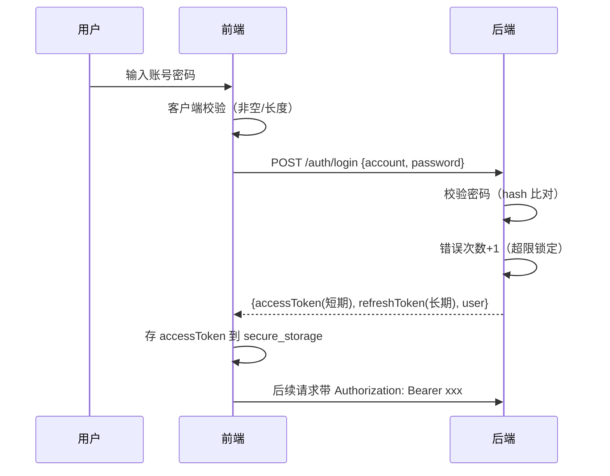

# 安全策略

> 本档是 Uten IMP 的安全架构总览。
> 详细前端准则见 [../00-项目准则/10-安全准则.md](../00-项目准则/10-安全准则.md)，本档聚焦架构层面。

---

## 一、安全原则

1. **深度防御**：前端 + 后端 + 网络多层防护，任何一层失守不致命
2. **最小权限**：默认拒绝，按需授予
3. **前端不可信**：前端所有校验只是体验优化，**后端必须独立校验**
4. **配置外置**：密钥/URL/账号不进代码，走环境变量或配置中心
5. **审计可追溯**：关键操作必须可追溯（谁/何时/做了什么）
6. **数据分级**：不同敏感度的数据用不同存储和传输方式

---

## 二、威胁模型（OWASP Top 10 2021 对照）

| OWASP | 威胁 | 本项目应对 |
|---|---|---|
| A01 | 访问控制失效 | 后端每个 API 独立校验权限；前端 hide 不 disable |
| A02 | 加密失败 | HTTPS 强制；敏感数据 flutter_secure_storage；传输 TLS 1.2+ |
| A03 | 注入 | 后端 ORM / 参数化查询；前端输入校验前置过滤 |
| A04 | 不安全设计 | 威胁建模；安全设计 review |
| A05 | 安全配置错误 | 配置外置；生产关闭调试；默认拒绝 |
| A06 | 易受攻击组件 | 依赖定期 review；锁定版本 |
| A07 | 身份认证失败 | 强密码策略；错误次数限制；双因素（可选） |
| A08 | 数据完整性失败 | JWT 签名校验；服务端状态机、幂等、版本/行锁与数据库约束；通用业务请求签名尚未实现 |
| A09 | 日志监控不足 | 审计日志；异常告警 |
| A10 | 服务端请求伪造 | 后端 URL 白名单；不直接传 URL |

---

## 三、认证与会话

### 3.1 登录流程

未知账号和错误密码使用相同对外错误；后端仍对未知账号执行一次 dummy Argon2 匹配以降低账号枚举
时序差。dummy hash 在 `LoginService` 构造时预计算，避免首个未知账号请求临时编码带来的额外延迟
与并发初始化差异。该控制只能缩小可观察差异，不能替代登录限流、锁定、统一响应和生产时序测试。

### 3.2 Token 策略

| Token | 有效期 | 存储 | 用途 |
|---|---|---|---|
| accessToken | 源码默认 **15 分钟**；运行值可由 `jwt_access_ttl_minutes` 系统设置覆盖（最小 5 分，生产实际值须从目标库核验） | flutter_secure_storage | API 鉴权 |
| refreshToken | 7 天（可配 `jwt_refresh_ttl_days`，系统设置页「登录保持时长」） | flutter_secure_storage | 静默续期 accessToken |

accessToken 过期 → 后端返 **401**（由 `SecurityConfig` 的 `AuthenticationEntryPoint` 保证——过期/匿名统一 401，而非 Spring 默认 403）→ 前端 `AuthInterceptor` 单飞调 `/auth/refresh` 换新 accessToken + 重试原请求（**用户无感**），同时用响应里的 user 同步刷新权限快照。
refreshToken 过期（7 天）/ 被吊销 / 重用检测命中 → 跳登录页。

> **V135 权限快照即时失效。** staff access JWT 携带用户 `auth_version` 和共享授权 `epoch`；
> `JwtAuthFilter` 每请求用一次轻量数据库投影同时复查账号状态和两个版本。个人覆盖、用户角色、
> 员工换部门、部门树层级/软删、共享角色/权限、超管或 employee 绑定变化会使旧 token 立即 401。
> 全量回归曾发现拒绝响应序列化异常被 token 解析的宽泛 `catch` 吞掉后继续过滤链；当前实现已把
> `authUser == null` 的拒绝分支移出该 `catch`，并用不依赖可选 Java-time module 的 JSON tree
> 写 401，`JwtAuthorizationVersionTest` 3/3 覆盖旧版本、缺版本和拒绝响应 fail-closed。开发库已
> 应用 V135；仍须通过完整 Maven、真实 HTTP 失效覆盖矩阵、事务和 P95/P99 才能视为生产闭环。

> **访客 JWT PII 最小化。** JWT payload 只签名、不加密，客户端或持有 token 的中间环节可以读取
> claim。新签发 visitor access token 以 `visitorNo` 同时填入 `acc/vno`，头像使用单独 `avs`
> seed，不再携带原手机号；登录与刷新共用该签发路径，`JwtAuthFilter`、`AuthUser` 和 Flutter
> 冷启动恢复已同步。旧 token 只为滚动兼容而可读，上线切换应等待旧 access TTL 到期或主动清退，
> 并验证通用审计中的登录标识不再是手机号。

> **JWT 环境隔离。** `JwtService` 构造时要求 secret 和 issuer 都非空，签发写入 issuer，解析时用
> `requireIssuer` 强制比对。生产 profile 必须显式提供环境唯一 `UTEN_JWT_ISSUER`；开发默认
> `uten-imp-dev`。同一 HS256 密钥被两个环境误复用时，issuer 不同的 token 仍会被拒绝，定向测试
> 已覆盖该负向路径。issuer 不能替代每环境独立密钥和正常轮换。

> ⚠️ **过期 access 必须返 401 不能返 403**：前端只在 401 时刷新，返 403 会被当「无权限」误显。曾因 `SecurityConfig` 未配 entry point、过期 token 落到默认 `Http403ForbiddenEntryPoint`，导致用户每 access TTL 看到一次「无权限」、需重登才恢复（2026-07-27 修复，见 [ADR-014](../99-决策记录-ADR/ADR-014-会话超时与token刷新机制修复.md)）。

### 3.2.5 会话空闲超时（前端 idle，与 token 独立的第二层）

除 token 外，前端 `IdleTimeoutGuard`（包在已登录区根）提供第二层会话保护——**滑动会话**：监听用户点击/滑动/输入续期，连续无操作超过阈值（`session_idle_timeout_minutes`，默认 30 分，系统设置页「自动退出登录」可配）→ 弹窗提示后登出（清 access+refresh，强制重输密码）。

| | access TTL（令牌层） | idle 超时（人的行为层） |
|---|---|---|
| 计时对象 | 令牌多久过期 | 用户多久没操作 |
| 到期行为 | 静默 refresh（用户无感） | 弹窗登出 |
| 防的是 | 令牌被窃后可滥用多久 | 用户离开但系统还开着 |

两层叠加：**一直操作**时 access 静默续期、idle 不计时（都不打扰）；**离开 30 分** idle 登出（即使令牌未到期）；**离开 7 天** refresh 过期需重输密码。idle 阈值实时生效（进系统拉一次 + 每 5 分钟轮询 + 超管保存后 `idleThresholdVersionProvider` 信号立即重拉）。

### 3.3 密码策略

- 至少 8 位
- 至少包含字母 + 数字
- 不允许和账号相同
- 错误 5 次锁定 15 分钟
- 每 90 天强制更换（可选）
- 不可使用最近 5 次用过的密码

前端在登录/改密页做强度提示，后端强制校验。

### 3.4 启动与引导账号

- `spring.profiles.active` 未显式配置时默认 `prod`，本地开发必须设置 `UTEN_PROFILE=dev`。
- base/prod 默认关闭 Swagger 并使用 INFO 日志；dev 才默认开放 Swagger 和业务 DEBUG 日志。
- prod 对数据库连接、JWT issuer 和 CORS 等部署值使用必填占位，缺失即启动失败。
- `BootstrapRunner` 只在空库且引导账号不存在时创建 `admin`，并要求至少 12 位一次性密码和首登改密。
  账号已存在时严格跳过，不读取引导密码、不写账号，也不会在每次启动时重新授予被人工撤销的超管
  权限。部署完成后应移除一次性密码并审计后续授权变更。

### 3.5 多端会话（目标能力，未完整实施）

- 同一账号可在多设备登录
- 提供会话列表 + 远程登出
- 异地登录告警

---

## 四、权限模型

### 4.1 权限模型（部门 + 个人覆盖 + 按权限点脱敏）

> 2026-07-24 角色体系下线（[ADR-011](../99-决策记录-ADR/ADR-011-工作台部门分区与动态权限配置.md)）。
> 现行模型细则见 [../00-项目准则/10-安全准则.md §六](../00-项目准则/10-安全准则.md)。

- **基础权限**：全员基础包（`employee` 权限点集合）
- **部门权限**：用户所属部门 ∪ 所有上级部门配置的权限点并集
- **个人覆盖**：对单个用户加 / 减权限点（如临时授予某报表查看权、或回收导出权）
- **按权限点脱敏**：敏感字段（PII / 薪酬）按 `employee:pii:view` / `employee:compensation:view` 决定是否展示
- **敏感写入拆分**：V141 起 `employee:create/edit` 只授权普通档案；证件/联系方式/银行字段另需
  `employee:pii:edit`，工资/社保/公积金/补贴另需 `employee:compensation:edit`
- **超管**：拥有全部权限点

### 4.2 前后端校验双保险

| 层 | 校验 | 说明 |
|---|---|---|
| 前端 | 隐藏菜单/按钮 | 体验优化 |
| 后端 | 每个 API 校验 | 真相源 |

**前端隐藏 ≠ 安全**，绕过前端直接调 API 必须被后端拒绝。

### 4.3 数据范围

不仅是"能不能访问"，还有"能看哪些数据"：

| 数据范围 | 说明 | 示例 |
|---|---|---|
| self | 只能看自己 | 普通员工看自己的工资条 |
| department | 看本部门及下属部门 | 部门主管看本部门员工 |
| all | 看全部 | 超管、或被授予 `*:view:all` 的用户 |

后端按用户身份过滤数据。

---

## 五、网络安全

| 项 | 要求 |
|---|---|
| HTTPS | 强制，不允许明文 HTTP |
| TLS 版本 | 1.2 及以上 |
| 证书 | 生产环境有效证书，禁止忽略证书校验 |
| 客户端 API 基址 | 员工/访客共用校验器；Web Release 空值同源 `/api`，非 Web Release 必须显式 HTTPS；拒绝 HTTP、回环、userinfo、query、fragment。API 地址是公开配置，`dart-define` 不得存密钥 |
| CORS | Web 端配置严格白名单 |
| Web 入口 | `web/index.html` 不含内联 style/script，启动资源拆为同源 `loading.css`/`loading.js`；所有 Release/CI 构建必须带 `--no-web-resources-cdn`，让 CanvasKit 等运行时资源同源；Web 打印使用同源 PDF Blob，不进入公共 PDF.js/动态脚本路径；禁止通过放宽 CSP 接受第三方 CDN。Nginx 模板统一静态站点和 `/api` 反代，HTTP 308 跳 HTTPS，并设置 HSTS、严格 CSP、`frame-ancestors 'none'`/X-Frame-Options、nosniff、Permissions-Policy、COOP、gzip、2 MiB 请求体上限及鉴权/API 粗粒度 IP 限流 |
| JSON 请求体 | 应用默认限制 1 MiB，并实际读取最多上限+1，覆盖错误/伪造 Content-Length 和 chunked；超限统一 413 `PAYLOAD_TOO_LARGE`，格式/类型错误统一 400 `MALFORMED_REQUEST`。multipart/二进制须由上传端点另设流式策略 |
| 代理头 | 默认 `server.forward-headers-strategy=none`；prod 才使用 `native`，且 Tomcat 只信任 `UTEN_TRUSTED_PROXY_REGEX`。防火墙/安全组必须保证应用 8080 仅受信反向代理可达 |
| CSRF | 当前 stateless JWT 仅从 `Authorization: Bearer` 读取、没有认证 Cookie，因此关闭 CSRF 与现模型一致；若改 Cookie 登录，必须启用 CSRF Token + SameSite/Secure/HttpOnly |
| 请求完整性 | 当前依靠 HTTPS、JWT、服务端授权、状态机、幂等、版本/行锁与审计；审批/转账的通用业务请求签名尚未实现 |
| 限流 | 登录采用“账号/规范手机号低阈值 + IP 高阈值”双桶并按员工/访客用途隔离，网关 IP 桶只作高阈值防洪，避免园区 NAT/运营商 CGNAT 正常用户互相 429；访客短信对手机号 HMAC 派生键使用 PostgreSQL transaction advisory lock，锁内复查发送间隔和日限并独立提交 OTP 后才调用供应商，明确拒绝才删除、不确定结果不自动重发。应用内桶仍为单实例，多实例必须改共享状态或由网关补齐 |

---

## 六、数据安全

### 6.1 传输中

- 全部走 HTTPS
- 敏感字段（密码、身份证号、完整手机号、短信验证码）不得进入后端日志；开发短信网关只记录手机号尾四位，明文验证码仅允许显式 dev 响应
- JWT claim 执行数据最小化；签名只保证完整性/真实性，不保证载荷保密，禁止承载原始 PII
- 不在 URL 中传敏感数据（用 body）

### 6.2 存储中

| 数据类型 | 存储 | 说明 |
|---|---|---|
| 偏好（主题/语言） | shared_preferences | 明文无所谓 |
| Token | flutter_secure_storage | iOS Keychain / Android Keystore |
| 用户缓存 | 当前未落本地 | 未来如需离线缓存，必须采用平台安全存储或加密数据库 |
| 离线业务数据 | 不存 | 敏感数据不落本地 |

### 6.3 展示中

- 身份证号、手机号部分隐藏（138****1234）
- 金额按权限脱敏（普通员工看不到他人工资）
- 截屏保护（移动端可选禁止截屏，敏感页面）

---

## 七、审计日志

审计分两层，不能互相替代：

- **请求覆盖层**：`UserOperationAuditInterceptor` 覆盖所有认证后的 `POST/PUT/PATCH/DELETE /api/**`，
  记录账号、方法、路径、结果/状态码、耗时、IP 和 UA；它刻意不保存请求正文，避免把密码、令牌或 PII
  复制到日志。登录、刷新和访客认证不走该拦截器，由相应认证流程显式记录需要的事件。
- **业务/数据变化层**：关键表的 `AFTER` 触发器提供 before/after，登录、导出、配置等显式事件走
  `AuditService.logExplicit`。当前不是所有表都有 before/after，且通用请求审计落库失败会告警但不会
  回滚已经产生的业务响应。

API 错误也遵守最小披露：通用异常不返回 stack/SQL；Java 老库迁移的单模块失败只返回
`LEGACY_MIGRATION_MODULE_FAILED` 与随机 UUID `referenceId`，完整异常留在服务端日志并用该编号
关联。日志系统必须限制访问并执行 PII/密钥脱敏，referenceId 不能变成对外查询任意内部日志的能力。

因此上线前仍必须完成“写端点→业务事件→表触发器”覆盖矩阵。目标字段如下：

| 字段 | 说明 |
|---|---|
| userId | 操作人 |
| action | 操作类型（login/create/update/delete/approve） |
| target | 操作对象（如 employee:123） |
| before | 变更前值（JSON） |
| after | 变更后值（JSON） |
| ip | 来源 IP |
| userAgent | 客户端 |
| timestamp | 时间戳 |
| result | 成功/失败 |

需要审计的操作：
- 登录/登出
- 权限变更
- 员工入离职
- 工资条生成/发布
- 报销审批
- 数据导出
- 配置修改

---

## 八、前端安全接入点

以下列出已落地的主要接入点，同时标明残余风险：

- **鉴权拦截器** [`lib/core/network/interceptors/auth_interceptor.dart`](../../lib/core/network/interceptors/auth_interceptor.dart)：每个请求注入 `Authorization: Bearer <accessToken>`；响应 401（非登录/刷新接口本身）时单飞调 `/auth/refresh`，成功则换 token、重试并刷新用户权限快照。V135 授权版本不匹配也会立即 401；相关 refresh 已吊销时统一清会话并要求重登。
- **安全存储** [`lib/core/security/secure_storage.dart`](../../lib/core/security/secure_storage.dart)：access/refresh token、登录账号、访客令牌均走 `flutter_secure_storage`（iOS Keychain / Android Keystore），不进 shared_preferences；登出时 `clearTokens()` 保留账号名以便下次预填。
- **会话状态** Riverpod `sessionProvider` + `sessionEventBus`：登出 / 失效统一清令牌并跳登录页；`sessionEventBus.publishProfile` 在 access 静默刷新成功时把最新 user 转发给 `sessionProvider`，**权限快照随刷新滑动更新**（不再只在登录时拉一次）。
- **会话空闲超时守卫** [`lib/features/shell/widgets/idle_timeout_guard.dart`](../../lib/features/shell/widgets/idle_timeout_guard.dart)：包在已登录区根，滑动会话——监听用户活动续期，连续无操作超阈值（默认 30 分）弹窗登出；阈值实时生效（进系统拉 + 5 分钟轮询 + 超管保存立即重拉，见 §3.2.5）。
- **路由守卫**：按集中式 any/all 路由策略校验权限点；`/admin/permissions` 共享壳接受
  `account:support` 或 `authorization:manage`，support-only 页面不渲染/请求授权区；审计、系统设置
  和其它 admin 路径要求 `authorization:manage`；`/employee/onboarding` 同时要求
  `employee:create` 与 `employee:pii:edit`。授权写操作由后端继续校验，前端守卫只是体验。
- **权限契约复核**：当前 143 个 Flutter `Perm` 常量均进入超管 fallback；后端 Java 活动引用的
  138 个权限码在 Flutter 缺失为 0。路由、导出按钮及 16 个调用页、部门/岗位/员工敏感字段、
  基础资料卡片、实验室上传和已排产销售改单均按权限 fail closed；6 个定向测试文件共 20/20，
  全量 `flutter analyze` 为 0 issue。此静态/单元证据仍须真实 API 越权矩阵。
- **敏感员工写入**：员工编辑和入职先在 UI 限制字段；后端
  `EmployeeSensitiveWritePolicy` 按请求字段再次强制 `employee:pii:edit` /
  `employee:compensation:edit`，手工构造请求缺权限时返回 403。

---

## 九、当前实现状态

- 🟡 **后端主体已接入**：鉴权、组织、人事、基础资料、销售、采购、委外、仓库、库存、
  生产、钱流、通知、建议和访客走真实 REST API。工资与员工报销前端已切 Dio，V133 表、
  后端 API 与固定状态机已有源码；业务口径和生产 E2E 仍须验收。实验室检测与空调控制待设备对接。
- 🟡 **已有安全基线**：Argon2id、JWT/refresh 轮换、会话空闲超时、pgcrypto、部分审计触发器、
  认证写请求元数据审计、部门权限 + 个人覆盖 + 按权限点脱敏。当前不得宣称“全量端到端安全验证”：
  V135 即时失效机制尚未完成数据库/覆盖矩阵/性能验收；销售五类单据对象级守卫已有源码，但正式
  owner 回填、真实 API 404/403 矩阵和跨模块消费方策略仍未验收；并非所有关键表都有 before/after；
  生产密钥、CORS/CSP、可信代理边界、备份恢复与越权矩阵仍需验收。
- 🟡 **Web 发布基线已有模板**：入口已移除全部内联样式/脚本，部署模板位于
  [`deploy/nginx/uten-imp.conf.example`](../../deploy/nginx/uten-imp.conf.example)，只为可审查的
  起点。严格 CSP 冒烟已发现 Flutter 默认 Release 的第三方 CanvasKit CDN 请求会被正确阻断并
  导致白屏，构建与 CI 已改为 `--no-web-resources-cdn`；Web 打印也已切为同源 PDF Blob，
  不得以放宽 CSP 解决。当前主机未安装
  Nginx，尚未执行目标环境 `nginx -t`，也未用冻结后的同源运行时产物完成严格 CSP（仅为 Wasm
  保留 `wasm-unsafe-eval`）、反代、限流和安全头下的完整浏览器回归，因此不能视为部署验收。
- 部署 checklist 见 [../00-项目准则/10-安全准则.md](../00-项目准则/10-安全准则.md)
- 中国大陆的同源资源、业务时区、弱网/NAT、备案、个人信息和数据地域门禁见
  [../99-项目治理/中国大陆部署与兼容性.md](../99-项目治理/中国大陆部署与兼容性.md)。

---

## 十、数据导出与高危配置安全规范（2026-07-27，以后范式）

> 本节是强制密码加密导出 + 系统设置落地后沉淀的**强制规范**。新增任何「数据导出」「高危配置」功能，必须照此执行。
> 详见 [ADR-012](../99-决策记录-ADR/ADR-012-报表加密导出与列排序与行跳源头.md) /
> [ADR-013](../99-决策记录-ADR/ADR-013-系统设置与安全策略可视化.md)。

### 10.1 数据导出（整表数据外发）—— 五道防线（缺一不可）

| 防线 | 实现 | 要点 |
|---|---|---|
| ① 独立权限 | `*_report:export` / `*:export`（**不复用 `:view`**） | 「能查看」≠「能导出」；V71 seed + 回填跟随查看，管理员可按部门/用户回收 |
| ② 频率/资源限流 | `ExportRateLimiter`（Bucket4j per-userId）+ 拦截器 `POST /api/**/export` + 进程内并发闸门 | 超限 429；每用户频率由 `export_rate_limit_per_minute` 配置；全局并发源码默认 2（`UTEN_EXPORT_MAX_CONCURRENT`）。多实例时该并发值按实例计算，需另做平台总量控制/压测 |
| ③ 文件保护与传输 | 所有报表强制使用 POI Agile AES-256；**密码入 body**（非 URL/query），长度 6–128；DTO 与 `EncryptedWorkbookService` 双层拒绝空白/越界密码，永不返回明文工作簿；prod 始终 HTTPS | 加密文件在 Excel/WPS 打开时需密码；单元格按文本写防 `=CMD()` 公式注入；客户端统一把服务端/展示文件名清洗成单一叶子名，阻断路径穿越和非法字符 |
| ④ 行数上限 | 单次 ≤ `export_max_rows`（默认 10 万，可配） | 超限拒绝，防 OOM / 批量拖库 |
| ⑤ 审计 | `audit.logExplicit("export_<module>_report", ...)` | 记 谁/什么报表/多少行/IP；审计页「仅导出」可查 |

新增导出端点范式：`*ReportService.export(report,params,sort,order)`（switch 分发 + `paginateAll` 循环累积）+ `*Controller POST /export`（`@PreAuthorize(':export')` + `@Valid @RequestBody ExportPasswordRequest` + 审计 + 强制加密 `ResponseEntity<byte[]>`）。前端统一用 [UtenExportButton](../02-组件库/UtenExportButton.md)，不得恢复“不设密码”或其它明文导出入口。
所有下载必须经 `saveBytes` 的 `sanitizeDownloadFilename` 边界，不得自行拼接磁盘路径；桌面/移动端
若同名文件已存在，应生成带序号的新文件而不是覆盖原文件。当前文件名清洗已有 3 个单元测试。

### 10.2 高危配置（系统设置）—— 改策略即影响全员

| 防线 | 实现 |
|---|---|
| ① 路由守卫 | 授权管理入口要求 `authorization:manage`，并限定超级管理员；HR 日常账号支持使用 `account:support` |
| ② 鉴权 | Controller/Service 同时校验 `authorization:manage` 与 `principal.superAdmin` |
| ③ **二次密码确认** | `SystemSettingsService.write` 用 `PasswordEncoder` 校验当前账号密码——**即使 access token 被盗，改策略还需密码** |
| ④ 审计 | `update_system_setting`（记 谁/哪项/旧→新值） |
| ⑤ 校验 | 类型 + 非负双重校验（后端权威 + 前端提示） |
| ⑥ 范围 | 只放**运行时可生效的策略阈值**；密钥（jwt.secret/crypto/sms AK）/部署类（CORS/swagger/DB）**绝不入配置页**（走 env/Vault） |

### 10.3 报表隐藏元数据（行跳源头）—— `__` 前缀命名约定

列 key 以 `__` 开头 = 隐藏元数据列（如 `__srcId`）：`execute()` 末尾 `columns.filter(c -> !c.key().startsWith("__"))` 不进返回 `columns`（前端不渲染、导出 Excel 不含），但 row Map 已 put 其值（前端 `onRowTap` 可读 `row['__srcId']`）。新增「行带元数据但不展示」的需求照此约定，**无需改表格组件**。

### 10.4 新增导出/配置功能 checklist

- [ ] 导出：独立 `:export` 权限 + 限流 + 加密 + 行数上限 + 审计（五道防线）
- [ ] 配置：路由守卫 + `@PreAuthorize` + 二次密码 + 审计 + 类型校验 + 只放阈值（密钥/部署类走 env）
- [ ] 隐藏元数据用 `__` 前缀，execute 过滤
- [ ] 密码入 body，错误信息不暴露 stack/code
- [ ] 客户端下载只传叶子文件名，经统一清洗；同名文件不覆盖

---

## 十一、待定问题

- [ ] 是否需要双因素认证（TOTP / 短信）
- [ ] 是否接入企业 SSO / LDAP
- [ ] 密码是否需要定期强制更换
- [ ] 是否禁止移动端截屏
- [ ] 审计日志保存多久
- [ ] 是否需要 IP 白名单

---

**最后更新**：2026-07-30（校准 V133 TTL、V135 授权版本、V141 员工敏感写权限、前端权限契约、
销售 owner 守卫、下载文件名和可信代理边界；说明 bearer-only CSRF 边界；保留对象级授权、
审计和生产验收限制）
