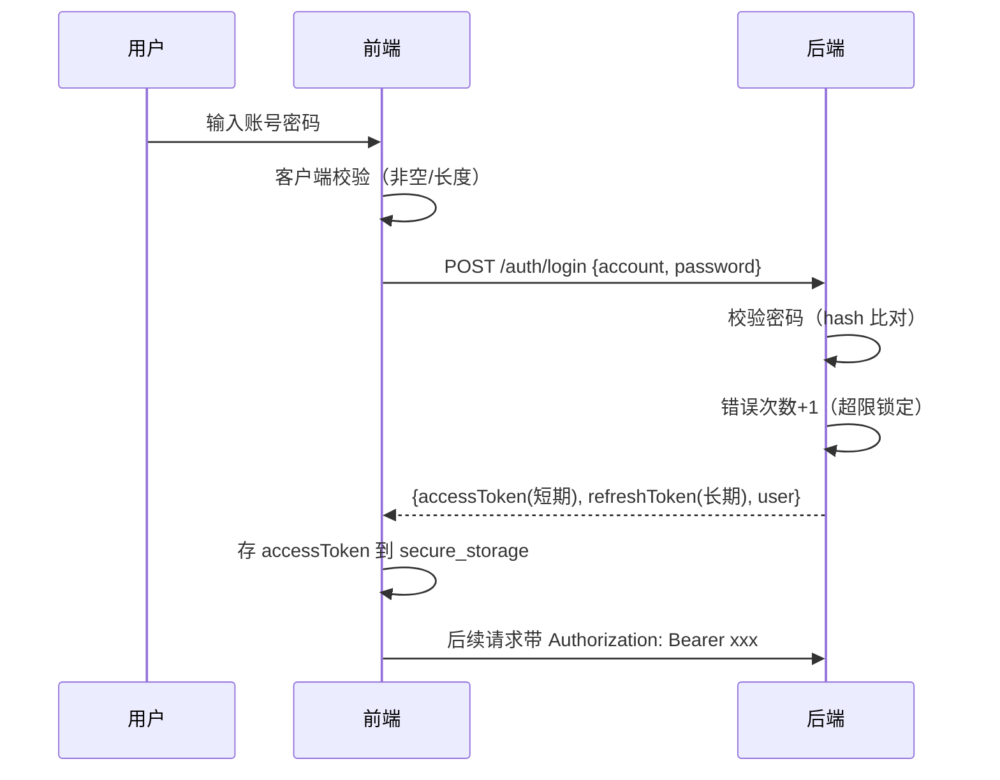

# 安全策略

> 本档是 Uten IMP 的安全架构总览。
> 详细前端准则见 [../00-项目准则/10-安全准则.md](../00-项目准则/10-安全准则.md)，本档聚焦架构层面。

---

## 一、安全原则

1. **深度防御**：前端 + 后端 + 网络多层防护，任何一层失守不致命
2. **最小权限**：默认拒绝，按需授予
3. **前端不可信**：前端所有校验只是体验优化，**后端必须独立校验**
4. **配置外置**：密钥/URL/账号不进代码，走环境变量或配置中心
5. **审计可追溯**：关键操作必须可追溯（谁/何时/做了什么）
6. **数据分级**：不同敏感度的数据用不同存储和传输方式

---

## 二、威胁模型（OWASP Top 10 2021 对照）

| OWASP | 威胁 | 本项目应对 |
|---|---|---|
| A01 | 访问控制失效 | 后端每个 API 独立校验权限；前端 hide 不 disable |
| A02 | 加密失败 | HTTPS 强制；敏感数据 flutter_secure_storage；传输 TLS 1.2+ |
| A03 | 注入 | 后端 ORM / 参数化查询；前端输入校验前置过滤 |
| A04 | 不安全设计 | 威胁建模；安全设计 review |
| A05 | 安全配置错误 | 配置外置；生产关闭调试；默认拒绝 |
| A06 | 易受攻击组件 | 依赖定期 review；锁定版本 |
| A07 | 身份认证失败 | 强密码策略；错误次数限制；双因素（可选） |
| A08 | 数据完整性失败 | 请求签名；JWT 签名校验 |
| A09 | 日志监控不足 | 审计日志；异常告警 |
| A10 | 服务端请求伪造 | 后端 URL 白名单；不直接传 URL |

---

## 三、认证与会话

### 3.1 登录流程



### 3.2 Token 策略（后端接入后）

| Token | 有效期 | 存储 | 用途 |
|---|---|---|---|
| accessToken | 30 分钟 | flutter_secure_storage | API 鉴权 |
| refreshToken | 7 天 | flutter_secure_storage | 静默续期 accessToken |

accessToken 过期 → 用 refreshToken 调 `/auth/refresh` → 拿新 accessToken。
refreshToken 过期 → 跳登录页。

### 3.3 密码策略

- 至少 8 位
- 至少包含字母 + 数字
- 不允许和账号相同
- 错误 5 次锁定 15 分钟
- 每 90 天强制更换（可选）
- 不可使用最近 5 次用过的密码

前端在登录/改密页做强度提示，后端强制校验。

### 3.4 多端会话

- 同一账号可在多设备登录
- 提供会话列表 + 远程登出
- 异地登录告警

---

## 四、权限模型

### 4.1 RBAC + 权限点

- **角色**：employee / hr / finance / lab / production / manager / admin
- **权限点**：按功能粒度定义，如 `payroll:view` / `payroll:generate` / `expense:approve`
- **角色 ↔ 权限**：多对多，admin 拥有全部
- **用户 ↔ 角色**：一对多（一个用户可多角色）

### 4.2 前后端校验双保险

| 层 | 校验 | 说明 |
|---|---|---|
| 前端 | 隐藏菜单/按钮 | 体验优化 |
| 后端 | 每个 API 校验 | 真相源 |

**前端隐藏 ≠ 安全**，绕过前端直接调 API 必须被后端拒绝。

### 4.3 数据范围

不仅是"能不能访问"，还有"能看哪些数据"：

| 数据范围 | 说明 | 示例 |
|---|---|---|
| self | 只能看自己 | 普通员工看自己的工资条 |
| department | 看本部门 | 部门主管看本部门员工 |
| all | 看全部 | HR 看全员、manager 看全部数据 |

后端按用户身份过滤数据。

---

## 五、网络安全

| 项 | 要求 |
|---|---|
| HTTPS | 强制，不允许明文 HTTP |
| TLS 版本 | 1.2 及以上 |
| 证书 | 生产环境有效证书，禁止忽略证书校验 |
| CORS | Web 端配置严格白名单 |
| CSRF | Web 端使用 SameSite Cookie 或 CSRF Token |
| 请求签名 | 关键操作（如审批/转账）加签名防篡改 |
| 限流 | 登录、敏感 API 限流（如登录 5 次/分钟） |

---

## 六、数据安全

### 6.1 传输中

- 全部走 HTTPS
- 敏感字段（密码、身份证号）后端日志脱敏
- 不在 URL 中传敏感数据（用 body）

### 6.2 存储中

| 数据类型 | 存储 | 说明 |
|---|---|---|
| 偏好（主题/语言） | shared_preferences | 明文无所谓 |
| Token | flutter_secure_storage | iOS Keychain / Android Keystore |
| 用户缓存 | hive（加密） | 可选加密 |
| 离线业务数据 | 不存 | 敏感数据不落本地 |

### 6.3 展示中

- 身份证号、手机号部分隐藏（138****1234）
- 金额按权限脱敏（普通员工看不到他人工资）
- 截屏保护（移动端可选禁止截屏，敏感页面）

---

## 七、审计日志

关键操作必须记日志：

| 字段 | 说明 |
|---|---|
| userId | 操作人 |
| action | 操作类型（login/create/update/delete/approve） |
| target | 操作对象（如 employee:123） |
| before | 变更前值（JSON） |
| after | 变更后值（JSON） |
| ip | 来源 IP |
| userAgent | 客户端 |
| timestamp | 时间戳 |
| result | 成功/失败 |

需要审计的操作：
- 登录/登出
- 权限变更
- 员工入离职
- 工资条生成/发布
- 报销审批
- 数据导出
- 配置修改

---

## 八、前端预留接口

前端阶段要预留的接入点（现在空实现，后端接入时填充）：

```dart
// lib/core/network/interceptors/auth_interceptor.dart
class AuthInterceptor extends Interceptor {
  @override
  void onRequest(RequestOptions options, RequestInterceptorHandler handler) {
    // TODO(后端接入): 从 secure_storage 读 token，加到 header
    handler.next(options);
  }

  @override
  void onError(DioException err, ErrorInterceptorHandler handler) {
    // TODO(后端接入): 401 时尝试 refresh token，失败跳登录
    handler.next(err);
  }
}
```

```dart
// lib/core/security/secure_storage.dart
class SecureStorage {
  static const _accessTokenKey = 'access_token';
  static const _refreshTokenKey = 'refresh_token';

  Future<String?> getAccessToken() async {
    // TODO(后端接入): return FlutterSecureStorage().read(key: _accessTokenKey);
    return null;
  }
  // ...
}
```

---

## 九、当前实现状态

- ✅ **后端已实现**（Spring Boot 3 + PostgreSQL）：真实鉴权（Argon2id / JWT 轮换）、pgcrypto 字段加密、触发器审计、RBAC + 按角色脱敏，已端到端验证
- HR 与鉴权模块为真实数据；其余模块（工资/报销/通知/建议/生产）仍为前端 Mock，待对应 Phase 接入
- 部署 checklist 见 [../00-项目准则/10-安全准则.md](../00-项目准则/10-安全准则.md)

---

## 十、待定问题

- [ ] 是否需要双因素认证（TOTP / 短信）
- [ ] 是否接入企业 SSO / LDAP
- [ ] 密码是否需要定期强制更换
- [ ] 是否禁止移动端截屏
- [ ] 审计日志保存多久
- [ ] 是否需要 IP 白名单

---

**最后更新**：2026-07-21
