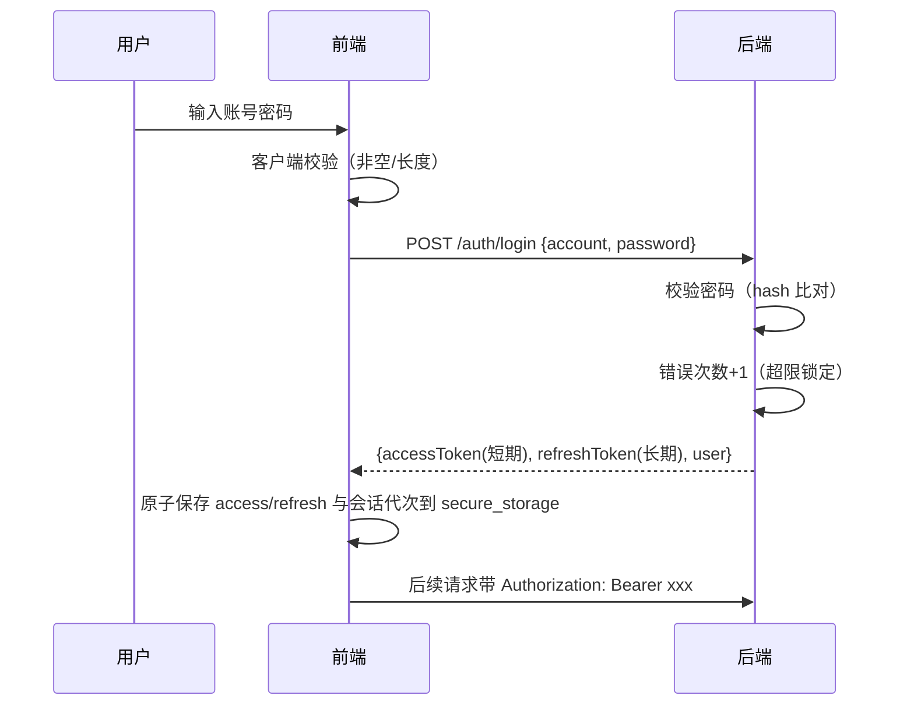

# 安全策略

> 本档是 Uten IMP 的安全架构总览。
> 详细前端准则见 [../00-项目准则/10-安全准则.md](../00-项目准则/10-安全准则.md)，本档聚焦架构层面。

---

## 一、安全原则

1. **深度防御**：前端 + 后端 + 网络多层防护，任何一层失守不致命
2. **最小权限**：默认拒绝，按需授予
3. **前端不可信**：前端所有校验只是体验优化，**后端必须独立校验**
4. **配置外置**：密钥/URL/账号不进代码，走环境变量或配置中心
5. **审计可追溯**：关键操作必须可追溯（谁/何时/做了什么）
6. **数据分级**：不同敏感度的数据用不同存储和传输方式

---

## 二、威胁模型（OWASP Top 10 2021 对照）

| OWASP | 威胁 | 本项目应对 |
|---|---|---|
| A01 | 访问控制失效 | 后端每个 API 独立校验权限；前端 hide 不 disable |
| A02 | 加密失败 | HTTPS 强制；敏感数据 flutter_secure_storage；传输 TLS 1.2+ |
| A03 | 注入 | 后端 ORM / 参数化查询；前端输入校验前置过滤 |
| A04 | 不安全设计 | 威胁建模；安全设计 review |
| A05 | 安全配置错误 | 配置外置；生产关闭调试；默认拒绝 |
| A06 | 易受攻击组件 | 依赖定期 review；锁定版本 |
| A07 | 身份认证失败 | 强密码策略；错误次数限制；双因素（可选） |
| A08 | 数据完整性失败 | JWT 签名校验；服务端状态机、幂等、版本/行锁与数据库约束；通用业务请求签名尚未实现 |
| A09 | 日志监控不足 | 审计日志；异常告警 |
| A10 | 服务端请求伪造 | 后端 URL 白名单；不直接传 URL |

---

## 三、认证与会话

### 3.1 登录流程

未知账号和错误密码使用相同对外错误；后端仍对未知账号执行一次 dummy Argon2 匹配以降低账号枚举
时序差。dummy hash 在 `LoginService` 构造时预计算，避免首个未知账号请求临时编码带来的额外延迟
与并发初始化差异。该控制只能缩小可观察差异，不能替代登录限流、锁定、统一响应和生产时序测试。

### 3.2 Token 策略

| Token | 有效期 | 存储 | 用途 |
|---|---|---|---|
| accessToken | 源码默认 **15 分钟**；运行值可由 `jwt_access_ttl_minutes` 系统设置覆盖（最小 5 分，生产实际值须从目标库核验） | flutter_secure_storage | API 鉴权 |
| refreshToken | 7 天（可配 `jwt_refresh_ttl_days`，系统设置页「登录保持时长」） | flutter_secure_storage | 静默续期 accessToken |

accessToken 过期 → 后端返 **401**（由 `SecurityConfig` 的 `AuthenticationEntryPoint` 保证——
过期/匿名统一 401，而非 Spring 默认 403）→ 前端 `AuthInterceptor` 在同进程/同源标签页间协调
`/auth/refresh`，只允许当前会话代写回，再重试原请求并用响应里的 user 同步权限快照。
refreshToken 过期、被吊销或重用检测命中时，只有后端返回精确的结构化拒绝且客户端 CAS 命中当前记录，
才清理并跳登录页。

### 3.2.1 员工会话记录、CAS 与退出边界

- 员工 access/refresh 与 `generation/intentGeneration/sessionLineage` 原子保存在单个
  `auth.token_record.v1` 权威记录中。`generation` 记录所有写，`intentGeneration` 只推进用户/安全
  意图，`sessionLineage` 隔离登录会话。refresh 保持 intent/lineage；登录、改密、退出或明确拒绝推进
  intent 并切换 lineage。
- refresh 保存/清理比较完整快照 CAS；登录/改密提交比较预留的 `intentGeneration + lineage`，再叠加
  `SessionNotifier` 本地 mutation epoch，保证 latest-intent-wins。迟到响应不能覆盖、误清或向新账号
  交付旧账号数据；本地校验失败返回 `409 SESSION_CHANGED/SESSION_STATE_UNAVAILABLE`。
- 权威记录不存在时才允许迁移旧双键，且先写新记录再删旧键；权威记录存在但损坏时写无令牌 tombstone，
  禁止从残留旧键复活。跨标签页锁/租约和 BroadcastChannel 只传 owner、到期时间、generation、intent、
  lineage、hasTokens 等不敏感元数据，绝不广播 token。
- 退出先使 UI 未登录并激活普通偏好存储中的非敏感 logout fence；随后在跨标签 token record 锁内读取
  最新记录，先通过 `beforeClear` 把旧 refresh 持久交接到加密撤销队列，成功后才写 logout tombstone。
  交接失败时保留 fence 与原 token record 供 0/30/120ms 重试，禁止先删设备上的唯一 refresh 副本；
  fence 不可读或关键清理失败也阻止启动恢复。只有交接和清理成功，或成功的新登录 intent 取代旧会话，
  才能安全解除 fence。
- 上述旧 refresh 在退出返回前必须进入 `flutter_secure_storage` 的加密撤销队列（最多 32 项、保留 30 天），
  网络调用随后异步执行。队列只重试公开且幂等的 `/auth/logout`，成功后删除精确 token；它不是通用业务
  离线队列，不得承载订单、审批、支付或其它写请求。

### 3.2.2 破坏性刷新拒绝必须精确

只有以下 `HTTP status + JSON code` 组合是销毁本地会话的权威证据：

- staff：`401 + UNAUTHORIZED`、`401 + ACCOUNT_LOCKED`、`401 + ACCOUNT_DISABLED`、
  `422 + VALIDATION_FAILED`；
- visitor：上述共享规则外，另允许 `403 + VISITOR_BLOCKED`。

HTML 401、空体 401、未知 code 401、status/code 错配、任意 503、429、网络/超时、解析异常或缺失
accessToken 的畸形 2xx 都归为 `unavailable`，必须保留 token 并传播原错误。刷新后业务重放失败也不
销毁新会话。此规则只控制客户端是否破坏本地凭据，不会放宽服务端对每个请求的认证和授权。

> **staff JWT 最小化与 V135 即时失效。** staff access JWT 只携带标准签发字段及
> `sub/typ/auth_version(av)/authorization_epoch(ae)`，不再复制账号、员工、角色、权限或
> `mustChangePassword`。登录、刷新与改密响应的 `user.roles/user.permissions` 契约保持不变，
> 所以前端功能与权限展示无需从 JWT 解码。旧 token 中的权限 claim 即使仍在 TTL 内也会被忽略。
>
> `JwtAuthFilter` 每请求查询轻量账号投影，先复查 active/软删、改密状态、员工绑定和两个版本；
> 通过后再从服务端合成角色/权限。权限快照采用 30 秒、最多 2048 项的版本键 LRU 缓存，
> `auth_version/epoch` 改变会立即拒绝旧 token 或命中新键，不受 TTL 延迟；停用/删除始终在缓存前
> fail-closed。用户主动改密和管理员重置密码都会先递增 `auth_version`，再签发替代 token/撤销
> refresh，旧 access 下一请求即 401。个人覆盖、用户角色、员工换部门、部门树、共享权限及超管
> 变化继续沿用 V135 版本机制即时失效。
>
> 账号投影、数据库或权限解析器异常属于可用性故障，统一返回 JSON
> `503 + SERVICE_UNAVAILABLE`；不得伪装成 401、不得清客户端会话。明确不存在/停用/删除、员工绑定
> 无效或 `av/ae` 不匹配才返回结构化 401。

> **访客 JWT PII 最小化。** JWT payload 只签名、不加密，客户端或持有 token 的中间环节可以读取
> claim。新签发 visitor access token 以 `visitorNo` 同时填入 `acc/vno`，头像使用单独 `avs`
> seed，不再携带原手机号；登录与刷新共用该签发路径，`JwtAuthFilter`、`AuthUser` 和 Flutter
> 冷启动恢复已同步。旧 token 只为滚动兼容而可读，上线切换应等待旧 access TTL 到期或主动清退，
> 并验证通用审计中的登录标识不再是手机号。

> **JWT 环境隔离。** `JwtService` 构造时要求 secret 和 issuer 都非空，签发写入 issuer，解析时用
> `requireIssuer` 强制比对。生产 profile 必须显式提供环境唯一 `UTEN_JWT_ISSUER`；开发默认
> `uten-imp-dev`。同一 HS256 密钥被两个环境误复用时，issuer 不同的 token 仍会被拒绝，定向测试
> 已覆盖该负向路径。issuer 不能替代每环境独立密钥和正常轮换。

> ⚠️ **过期 access 必须返 401 不能返 403**：前端只在 401 时刷新，返 403 会被当「无权限」误显。曾因 `SecurityConfig` 未配 entry point、过期 token 落到默认 `Http403ForbiddenEntryPoint`，导致用户每 access TTL 看到一次「无权限」、需重登才恢复（2026-07-27 修复，见 [ADR-014](../99-决策记录-ADR/ADR-014-会话超时与token刷新机制修复.md)）。

### 3.2.5 会话空闲超时（前端 idle，与 token 独立的第二层）

除 token 外，前端 `IdleTimeoutGuard`（包在已登录区根）提供第二层会话保护——**滑动会话**：监听用户点击/滑动/输入续期，连续无操作超过阈值（`session_idle_timeout_minutes`，默认 30 分，系统设置页「自动退出登录」可配）→ 弹窗提示后登出（清 access+refresh，强制重输密码）。

| | access TTL（令牌层） | idle 超时（人的行为层） |
|---|---|---|
| 计时对象 | 令牌多久过期 | 用户多久没操作 |
| 到期行为 | 静默 refresh（用户无感） | 弹窗登出 |
| 防的是 | 令牌被窃后可滥用多久 | 用户离开但系统还开着 |

两层叠加：**一直操作**时 access 静默续期、idle 不计时（都不打扰）；**离开 30 分** idle 登出（即使令牌未到期）；**离开 7 天** refresh 过期需重输密码。idle 阈值实时生效（进系统拉一次 + 每 5 分钟轮询 + 超管保存后 `idleThresholdVersionProvider` 信号立即重拉）。

### 3.3 密码策略

- 至少 8 位
- 至少包含字母 + 数字
- 不允许和账号相同
- 错误 5 次锁定 15 分钟
- 每 90 天强制更换（可选）
- 不可使用最近 5 次用过的密码

前端在登录/改密页做强度提示，后端强制校验。

### 3.4 启动与引导账号

- `spring.profiles.active` 未显式配置时默认 `prod`，本地开发必须设置 `UTEN_PROFILE=dev`。
- base/prod 默认关闭 Swagger 并使用 INFO 日志；dev 才默认开放 Swagger 和业务 DEBUG 日志。
- prod 对数据库连接、JWT issuer 和 CORS 等部署值使用必填占位，缺失即启动失败。
- `BootstrapRunner` 只在空库且引导账号不存在时创建 `admin`，并要求至少 12 位一次性密码和首登改密。
  账号已存在时严格跳过，不读取引导密码、不写账号，也不会在每次启动时重新授予被人工撤销的超管
  权限。部署完成后应移除一次性密码并审计后续授权变更。

### 3.5 多端会话（目标能力，未完整实施）

- 同一账号可在多设备登录
- 提供会话列表 + 远程登出
- 异地登录告警

---

## 四、权限模型

### 4.1 权限模型（部门 + 个人覆盖 + 按权限点脱敏）

> 2026-07-24 角色体系下线（[ADR-011](../99-决策记录-ADR/ADR-011-工作台部门分区与动态权限配置.md)）。
> 现行模型细则见 [../00-项目准则/10-安全准则.md §六](../00-项目准则/10-安全准则.md)。

- **基础权限**：全员基础包（`employee` 权限点集合）
- **部门权限**：用户所属部门 ∪ 所有上级部门配置的权限点并集
- **个人覆盖**：对单个用户加 / 减权限点（如临时授予某报表查看权、或回收导出权）
- **按权限点脱敏**：敏感字段（PII / 薪酬）按 `employee:pii:view` / `employee:compensation:view` 决定是否展示
- **敏感写入拆分**：V141 起 `employee:create/edit` 只授权普通档案；证件/联系方式/银行字段另需
  `employee:pii:edit`，工资/社保/公积金/补贴另需 `employee:compensation:edit`
- **超管**：拥有全部权限点
- **高危个人-only 权限**（任何部门默认都不授予，需逐条个人点名）：`audit_log:view`/`audit_log:export`
  （V173 触发器硬拒部门级）、`authorization:manage`、`user:manage`、`stock:balance:adjust`、
  `finance_asset:approve`/`post`/`dispose`/`export`、`finance_asset_period:manage`、`workflow_assignment:manage`。
  业务部门默认权限矩阵见 [V212 部门默认权限矩阵](../数据迁移/54-部门默认权限矩阵.md)（受控重置，
  写权限下沉叶子部门、管理中心/公司留空）。授权页「全部授权」按钮在此基础上额外排除敏感业务动作
  `sales_order:priority`、`sales_order:reallocate`、`supplier_return_task:handle`，避免一键放行。

### 4.2 前后端校验双保险

| 层 | 校验 | 说明 |
|---|---|---|
| 前端 | 隐藏菜单/按钮 | 体验优化 |
| 后端 | 每个 API 校验 | 真相源 |

**前端隐藏 ≠ 安全**，绕过前端直接调 API 必须被后端拒绝。

### 4.3 数据范围

不仅是"能不能访问"，还有"能看哪些数据"：

| 数据范围 | 说明 | 示例 |
|---|---|---|
| self | 只能看自己 | 普通员工看自己的工资条 |
| department | 看本部门及下属部门 | 部门主管看本部门员工 |
| all | 看全部 | 超管、或被授予 `*:view:all` 的用户 |

后端按用户身份过滤数据。

### 4.4 资产与待摊职责分离及落账门禁

V183 将资产权限拆为 `finance_asset:view/edit/approve/post/dispose/export` 和
`finance_asset_period:manage`。财税部部门默认只授予 view/edit；approve/post/dispose/export/
period manage 从部门默认授权中显式移除，必须由超管依据书面职责矩阵进行个人点名授权。export 权限
代码存在不等于真实资产导出端点已经交付，导出仍须通过独立接口、加密、限流和审计验收。

路由只校验 view；所有动作由服务端再次校验专属权限、对象版本、状态、期间以及本人回避，并将
`allowedActions` 返回给页面。页面只能取本地权限与服务端动作的交集，不能自行推导放行。月度运行
必须制单、他人审批、符合本人回避的最终过账；关闭/重开期间独立授权且重开必须有原因。

`UTEN_FINANCE_ASSET_POSTED_WORKFLOWS_ENABLED` 缺省为 `false`，当前阻断激活/初始确认、处置
申请/批准和待摊终止申请/批准。该开关是 fail-closed 风险隔离，不是上线捷径；B01–B15、UAT 和
变更审批完成前不得启用。已过账资产批次、逐项快照、日志、审批、事件和正式总账事实受数据库
不可变约束，错误写关联反向事实，禁止删除或原地改写。详见
[ADR-018](../99-决策记录-ADR/ADR-018-资产与待摊专业子账及不可变过账.md)和
[专项验收报告](../99-项目治理/2026-08-01-资产与待摊全链路实现与验收报告.md)。

### 4.5 采购/委外财务审批的精确负责人对象授权

V196/V201 采用领域专用审批实例，不复用角色广播或通用“有审核权限即可处理”模型：

- 采购/委外申请是计划下达的只读需求；商业订货必须从任务中心分解，不能恢复申请 CRUD/审核入口。
- 订货提交和超量到货异常都在创建时冻结 `assignee_user_id/employee_id/name`。处理者必须同时拥有 `finance_order_approval:review` 且等于实例负责人；超级管理员身份、负责人配置权限或已知 UUID 不能对象绕过。
- `workflow_assignment:manage` 只允许在二次密码确认、乐观锁和审计下配置未来采购/委外主负责人；该权限不默认授部门。修改默认负责人不改在途审批或异常快照。
- 前端动作只能取本地路径权限与服务端 `allowedActions` 的交集；`allowedActions` 缺失、未知或实例已变化一律 fail closed，不能从本地 `superAdmin`/角色自行显示审批按钮。
- 财务通过才使订单 `status=1` 并产生预计到货。超财务批准余量先隔离且不写库存/AP；财务批准量仍须仓库再次审核，未批准量只交原下单人确认退回，原下单人不能修改财务决定。
- 通知只是提醒，不是授权或任务事实；任务发现、详情和决定接口都必须按当前账号精确过滤并用已知他人任务 UUID 做 404/403 负向测试。

V196–V202 目前只是源码候选，公司目标库只读证据仍只到 V190。目标库迁移、负责人离职/停用处置、真实多账号/并发、仓库与供应商退回实物 UAT、完整 IQC 和发布签字未完成，生产 **NO-GO**。详见 [ADR-019](../99-决策记录-ADR/ADR-019-计划需求分解与采购委外财务审批.md)。

### 4.6 部门负责人权限转授（2026-08-02 新增）

「我的部门」（我的页 `/profile/me/department`）为组织负责人（`department.manager_id`，数据驱动判定）开放有限的成员权限转授能力，**不要求 `authorization:manage` 或超管身份**。普通负责人仅本部门；管理中心负责人可选中心或子孙部门，但每次只管所选节点的直属成员。防越权升级边界如下：

- **转授上限 = 本人有效权限集 ∖ 全员基础权限**：
  `DepartmentStaffPermissionService.headCeilingCodes = PermissionResolver.breakdownOf(head).effective() − baselinePermissions()`。
  即负责人**只能转授自己持有的、非人人皆有的权限**，禁止凭团队位置把自己没有的权限授予他人。
- **基线 / 额外两态显示**：DTO `DepartmentStaffPermissionsDto.PermissionItem` 加 `baseline` 字段。`baseline=true`（部门基线/全员基础）默认 ON 且不可由负责人关闭；`baseline=false`（负责人个人加授）默认 OFF，可逐成员开/关。
- **收回孤儿覆盖始终允许**：即便负责人已不再持有某权限点，仍可清除成员现存覆盖，避免孤儿覆盖永久滞留。
- **禁止修改本人覆盖**：负责人不能在自己的权限行上开关，防止自锁。
- **权限校验数据驱动**：`GET /api/department-staff-permissions/managed?departmentId=` 与 `PUT /api/department-staff-permissions/employees/{id}/overrides/{code}` 不挂 `@PreAuthorize`；普通负责人必须精确命中目标部门 `manager_id`，只有管理中心负责人可命中递归子孙范围。岗位名称/职级不参与授权。
- **即时失效**：写 `user_permission_overrides` 同时吊销目标 refresh token 并依赖 V135 `auth_version/epoch`，目标旧 staff access 下一请求即 401（同 §3.2.2 机制）。

详见 [部门管理页.md §十一](../03-页面/部门管理页.md) 与 [ADR-011 2026-08-03 演进](../99-决策记录-ADR/ADR-011-工作台部门分区与动态权限配置.md)。

### 4.7 敏感字段脱敏与英文键防泄漏（2026-08-02 新增）

除按权限点脱敏（PII/薪酬）外，另一类泄漏是**面向用户的英文内部键**——懂技术者可据 `FIXED_ASSET_CATEGORY_POLICY` / `DEFERRED_EXPENSE_CATEGORY_POLICY` 等键名或 `costStyleId` 等字段名反推库表结构。2026-08-02 钱流「资产与待摊」政策未就绪横幅已彻底脱敏：

- **服务端全中文**：`FinanceAssetQueryService.overview` 下发「固定资产类别政策/长期待摊费用类别政策」；`AssetCategoryPolicyReadiness.missing()` 返回中文标签（仅展示用，`ready() = missing().isEmpty()` 逻辑不变）；`FinanceAssetCategoryService.activate` 各校验报错（`requirePostableStyle` / `requireDistinctAccounts` / 未来生效 / 长期待摊）与 `operationalBlockers` 英文句全部改中文。
- **前端防御映射**：`_PolicyBanner._friendlyPolicyLabel` 即便后端回退到英文键也映射成中文，**永不直出英文**。
- **逻辑零影响**：草稿照常保存，只阻断 submit / activate / post；脱敏只改展示文本，不改业务规则或库表结构。

该范式是后续模块的参考：**面向用户的提示/错误不应包含库表字段名或内部枚举常量**。新模块上线前的安全 review 须检查错误响应、横幅、日志输出是否泄露内部命名。

---

## 五、网络安全

| 项 | 要求 |
|---|---|
| HTTPS | 强制，不允许明文 HTTP |
| TLS 版本 | 1.2 及以上 |
| 证书 | 生产环境有效证书，禁止忽略证书校验 |
| 客户端 API 基址 | 员工/访客共用校验器；Web Release 空值同源 `/api`，非 Web Release 必须显式 HTTPS；拒绝 HTTP、回环、userinfo、query、fragment。API 地址是公开配置，`dart-define` 不得存密钥 |
| CORS | Web 端配置严格白名单 |
| Web 入口 | `web/index.html` 不含内联 style/script，启动资源拆为同源 `loading.css`/`loading.js`；所有 Release/CI 构建必须带 `--no-web-resources-cdn`，让 CanvasKit 等运行时资源同源；Web 打印使用同源 PDF Blob，不进入公共 PDF.js/动态脚本路径；禁止通过放宽 CSP 接受第三方 CDN。Nginx 模板统一静态站点和 `/api` 反代，HTTP 308 跳 HTTPS，并设置 HSTS、严格 CSP、`frame-ancestors 'none'`/X-Frame-Options、nosniff、Permissions-Policy、COOP、gzip、2 MiB 请求体上限及鉴权/API 粗粒度 IP 限流 |
| JSON 请求体 | 应用默认限制 1 MiB，并实际读取最多上限+1，覆盖错误/伪造 Content-Length 和 chunked；超限统一 413 `PAYLOAD_TOO_LARGE`，格式/类型错误统一 400 `MALFORMED_REQUEST`。multipart/二进制须由上传端点另设流式策略 |
| 请求头预算 | Tomcat 对请求行 + 全部请求头设置有限 16 KiB 上限（`UTEN_MAX_HTTP_REQUEST_HEADER_SIZE` 可按目标环境调节）；Nginx 模板显式使用 2×8 KiB large-header buffers（单字段不超过 8 KiB）。先缩减 JWT/设备证据并测量，再评估上调，禁止以无限放大掩盖头膨胀 |
| 安全读重试 | 仅 GET/HEAD/OPTIONS 对连接/发送/接收超时、连接错误、408/502/504、503 做两次重试，固定 400ms/1200ms；POST/PUT/PATCH/DELETE 不因连接恢复自动重放。结构化 `503 + SERVICE_UNAVAILABLE` 可短重试但证明 HTTP 可达，不进入全局离线态 |
| 健康探测 | 只请求同源根 `/actuator/health`；2/5/10/15 秒档位采用 85%–100% jitter，手动重试跳过等待，重叠探测合并。只有 `HTTP 200 + JSON Map + status=UP` 才恢复；HTML、空体、空对象、DOWN、非 200 都失败。网关精确代理 health/liveness/readiness，其它 Actuator 路径 404，禁止 SPA fallback 假 200 |
| 代理头 | 默认 `server.forward-headers-strategy=none`；prod 才使用 `native`，且 Tomcat 只信任 `UTEN_TRUSTED_PROXY_REGEX`。防火墙/安全组必须保证应用 8080 仅受信反向代理可达 |
| CSRF | 当前 stateless JWT 仅从 `Authorization: Bearer` 读取、没有认证 Cookie，因此关闭 CSRF 与现模型一致；若改 Cookie 登录，必须启用 CSRF Token + SameSite/Secure/HttpOnly |
| 请求完整性 | 当前依靠 HTTPS、JWT、服务端授权、状态机、幂等、版本/行锁与审计；审批/转账的通用业务请求签名尚未实现 |
| 限流 | 登录采用“账号/规范手机号低阈值 + IP 高阈值”双桶并按员工/访客用途隔离，网关 IP 桶只作高阈值防洪，避免园区 NAT/运营商 CGNAT 正常用户互相 429；访客短信对手机号 HMAC 派生键使用 PostgreSQL transaction advisory lock，锁内复查发送间隔和日限并独立提交 OTP 后才调用供应商，明确拒绝才删除、不确定结果不自动重发。应用内桶仍为单实例，多实例必须改共享状态或由网关补齐 |

---

## 六、数据安全

### 6.1 传输中

- 全部走 HTTPS
- 敏感字段（密码、身份证号、完整手机号、短信验证码）不得进入后端日志；开发短信网关只记录手机号尾四位，明文验证码仅允许显式 dev 响应
- JWT claim 执行数据最小化；签名只保证完整性/真实性，不保证载荷保密，禁止承载原始 PII
- 不在 URL 中传敏感数据（用 body）

### 6.2 存储中

| 数据类型 | 存储 | 说明 |
|---|---|---|
| 偏好（主题/语言） | shared_preferences | 明文无所谓 |
| 员工 token record | flutter_secure_storage | access/refresh 与三个代次字段单记录；损坏 fail-closed 为 tombstone |
| 待撤销 refresh | flutter_secure_storage | 有界加密专用队列，仅供幂等 logout drainer；不承载业务 payload |
| logout fence | shared_preferences | 只含非敏感布尔标记；存在、损坏或不可读都阻止自动恢复 |
| 访客 Token | flutter_secure_storage | 独立 key；不得与员工会话混用 |
| 用户缓存 | 当前未落本地 | 未来如需离线缓存，必须采用平台安全存储或加密数据库 |
| 离线业务数据 | 不存 | 敏感数据不落本地 |

### 6.3 展示中

- 身份证号、手机号部分隐藏（138****1234）
- 金额按权限脱敏（普通员工看不到他人工资）
- 截屏保护（移动端可选禁止截屏，敏感页面）

---

## 七、审计日志

审计分三层，不能互相替代：

- **请求覆盖层**：`AuditRequestContextFilter` 位于 `CorsFilter`、JWT 与 MVC 之前建立关联和计时，
  `UserOperationAuditInterceptor` 在 MVC 完成后写入；Filter 对未进入 MVC 或尚未成功写入的请求兜底。
  `GET/POST/PUT/PATCH/DELETE/HEAD /api/**` 的正常、匿名认证、CORS 非法来源 403、安全链拒绝、404/405 和前置异常均记录账号
  （JWT 校验成功后绑定 request 级身份快照，匿名时为空）、方法、路径、结果/状态码、耗时、IP 和 UA；
  身份快照可跨越 SecurityContext 清理完成 404/405 归属，但不会为失效令牌绑定身份。不保存 query 值和请求正文，避免把搜索条件、
  密码、令牌或 PII 复制到日志。
- **显式安全/业务层**：登录、刷新令牌重用、访客认证、访问拒绝、导出和配置等走
  `AuditService.logExplicit` / `logSecurityEvent`；这覆盖尚未进入 MVC 或没有已认证上下文的失败。
- **数据变化层**：V169 为当时的公开业务表补齐 `AFTER` 触发器，提供脱敏 before/after；V183 最终为其
  9 张资产/待摊新表显式挂接触发器并在尾部只补缺复扫；V184 在不修改已应用 V169 的前提下，以独立后置
  迁移验证每张业务表必须恰有一个 `trg_audit%`，且已启用、为 AFTER ROW、覆盖 I/U/D 并调用批准函数；无前缀触发器时才补挂
  `fn_audit()`，异常配置直接 fail closed。V185 让后续软删除按 delete 写入、扩充迁移列明的原因备注类敏感文本/大型嵌套快照脱敏，
  同时保留 V172 设备关联证据。V188/V189 的仓库事件和退货质量事件另有业务级 append-only 守卫；
  V190 在这些新增表后重跑全表 fail-closed sweep，只覆盖以后操作、不补历史。凭证、令牌、短信码、Flyway、序号
  与迁移运行元数据表不复制行内容。
  `request_id` 将一次请求与其多条数据变化串联。

触发器是从迁移生效时刻开始的事实采集，不是历史推断。V169 之前的业务历史，以及新表在后续 sweep
生效前的变更，都不能用当前行反向补造操作人、发生时间或原始值。`AuditTriggerCoverageMigrationContractTest`
静态解析 Flyway `CREATE TABLE`：最新 sweep 之后出现的表必须是带书面理由的技术白名单项，否则测试失败；
每次部署仍要在目标 PostgreSQL 用 `pg_trigger` 复核，静态检查不能替代运行态覆盖矩阵。

审计中心默认展示最近七天的 `actorScope=user` + `operationKind=write`，使货品、分类等人工增删改优先可见；
系统/迁移记录没有被删除，切换为全部或 `system` 即可查看。后端同时支持关键字、对象类型/ID、来源、
规范 UUID Request ID、操作类型和用户/系统范围；四个主档快捷对象同时匹配数据库表与 request 路由组，
因此失败/回滚尝试不会因缺少 database 行而被隐藏；其它对象、来源等精确筛选忽略大小写。V185 前以 update
存储的软删除在读侧按删除/高风险解释。Request ID 把同一写请求
的 request 记录和一至多条 database 记录串联，核查结论不能只看其中一层。

列表首次查询取得最大审计 ID 作为 `snapshotId`（空表为 0），列表、统计和导出都固定 `id <= snapshotId`，
并按 `created_at DESC, id DESC` 排序。刷新、搜索或改变任一筛选后重新取边界。它会排除通常后续分配的更高
ID，避免审计查询自身的新日志推移 offset；但不是跨请求 MVCC 快照，旧 ID 晚提交和留存并发删除仍可能使
页集变化，必须在生产同构库验证。负数快照、非法操作范围和非规范 Request ID 必须返回 400。

请求审计在 MVC 拦截链中先于导出限流进入，因此频率或并发闸门拒绝的 429 导出尝试也会落库。审计中心
的列表、统计、详情和“本机信息与操作回执”均要求 `audit_log:view`。超级管理员因固有全权限天然具备；
非超管只授予明确指定的核查人员，
不进入普通员工基础权限、普通部门权限或访客权限。审计导出要求同时持有 `audit_log:view` 与
`audit_log:export`；“可查看”不隐含“可导出”。`authorization:manage` 只负责系统设置等授权管理，
不再作为审计查看或导出的替代权限。导出文件不含 before/after 或任何 User-Agent 字段，按日志 ID 回详情核查。
除超管固有全权限外，两个审计权限只允许个人覆盖点名授予；部门权限服务与 V173 数据库触发器都会拒绝部门级授予。
V171/V173 清理升级前已有的非超管审计 grant，发布后必须按批准名单重新授权。

权限必须前后端双重 fail closed：无 `audit_log:view` 时不渲染工作台入口、设置页本机回执入口或详情
链接，直接输入 `/admin/audit-logs`、`/settings/device-receipts` 等深链也必须被路由守卫拒绝；后端
列表、统计、详情接口再次校验权限并返回 403。普通员工和访客不得查询、导出、删除或修改服务器审计，
也不得访问本机回执。授权核查人员只能凭完整 `client_event_id` 精确核查并复制单条证据，不得批量枚举；
服务器审计无人工更新/删除端点，本机回执无手动清除入口，只按留存策略自动清理。

本机回执正文是本地偏好存储中的明文 JSON，HMAC 密钥才放平台安全存储。产品权限只能限制 UI/API，
不能阻止已取得设备管理员/root、浏览器开发工具或用户系统账号权限的人直接读取本地数据；因此回执不保存
query、正文、凭证、令牌或直接 PII。审计列表、统计、详情和核查调用会写服务器审计，但客户端不为
`/admin/audit-logs/**` 写本机回执，避免递归自观察和挤占 300 条容量。

目标本机回执不是“路由有权限即可直接读取”：详情默认只展示服务器快照，每次读取目标回执前都必须调用
服务端核查接口重新校验 `audit_log:view` 并先写 `verify_local_audit_receipt`。无权限、令牌失效、离线、
超时或服务端失败时保持零次目标回执读取，不能以本地已有数据为由降级绕过。

V172 增加设备证据关联：客户端为一次逻辑操作生成 `client_event_id`，本机先写操作回执，服务器另外
生成并回传 `request_id`；详情用二者关联服务器记录、本机请求时间、结果和设备快照。安装标识为应用
首次运行生成的随机 UUID；系统不采集 IMEI、MAC、硬盘/硬件序列号。设备名称、型号、系统、浏览器、
时区等都是经过长度、枚举和格式清洗的客户端声明，可能缺失或被伪造；数据库记录能证明服务器收到过
这些声明及请求，不能单独证明物理设备或实际操作者。本机完整性标记也不是平台设备证明，两侧一致只能
表述为“交叉佐证一致”，不得表述为“绝对真实”或“不可抵赖”。

API 错误也遵守最小披露：通用异常不返回 stack/SQL；Java 老库迁移的单模块失败只返回
`LEGACY_MIGRATION_MODULE_FAILED` 与随机 UUID `referenceId`，完整异常留在服务端日志并用该编号
关联。日志系统必须限制访问并执行 PII/密钥脱敏，referenceId 不能变成对外查询任意内部日志的能力。

通用请求审计落库失败会告警但不会回滚已经产生的业务响应；因此上线监控必须告警审计落库失败，
并持续复核“端点→显式事件→表触发器”覆盖矩阵。新增表迁移必须通过静态 sweep 护栏，目标 PostgreSQL
还必须验证所有非白名单公开业务表都有且只有预期的有效审计触发器。目标字段如下：

| 字段 | 说明 |
|---|---|
| userId | 操作人 |
| action | 操作类型（login/create/update/delete/approve） |
| target | 操作对象（如 employee:123） |
| before | 变更前值（JSON） |
| after | 变更后值（JSON） |
| ip | 来源 IP |
| userAgent | 客户端 |
| timestamp | 时间戳 |
| result | 成功/失败 |
| requestId | 关联一次请求及其数据变化 |
| clientEventId | 关联本机逻辑操作和请求重试 |
| deviceEvidence | 安装标识、名称/厂商/型号、平台/系统、应用版本、浏览器、语言/时区、采集状态和快照摘要 |
| riskLevel / riskReason | 风险等级与可解释原因 |
| http | 方法、路径、状态码、耗时 |

需要审计的操作：
- 登录/登出
- 权限变更
- 员工入离职
- 工资条生成/发布
- 报销审批
- 资产/待摊提交、审批、激活、调拨、状态变更、处置/终止、月度运行、反冲、关账/重开
- 数据导出
- 配置修改
- 审计归档与永久删除（系统任务汇总事件）

---

## 八、前端安全接入点

以下列出已落地的主要接入点，同时标明残余风险：

- **鉴权拦截器** [`lib/core/network/interceptors/auth_interceptor.dart`](../../lib/core/network/interceptors/auth_interceptor.dart)：按 lineage/intent 为逻辑请求绑定会话；401 时跨 Dio/标签页协调刷新，迟到 401 可复用同 lineage 的新 access。refresh 写回/清理均为完整快照 CAS；只接受 §3.2.2 的精确拒绝，HTML/空体/未知 401 与 503 保留会话。
- **安全存储** [`lib/core/security/secure_storage.dart`](../../lib/core/security/secure_storage.dart)：员工 token 使用原子权威记录与 tombstone；旧双键安全迁移、损坏记录 fail closed。登录账号和访客令牌也走 `flutter_secure_storage`；只有不敏感 logout fence 走普通偏好。
- **会话状态** Riverpod `sessionProvider` + `sessionEventBus`：latest-intent-wins 提交、logout fence、外部 token 变更重读和 restore pending 共同防止迟到响应复活会话；profile 事件必须匹配 generation/intent/lineage 才更新权限快照。
- **refresh 撤销** [`pending_refresh_revocation_store.dart`](../../lib/core/security/pending_refresh_revocation_store.dart) + `PendingRefreshRevocationDrainer`：退出先加密持久化，网络 drain 不阻塞 UI；仅允许幂等 logout，禁止复用为业务离线队列。
- **连接恢复** `SafeRequestRetryInterceptor` + `ConnectionRecoveryController`：安全读两次短重试、严格 health + jitter；业务写不自动重放，恢复 epoch 只在完整 disconnected 后恢复时递增一次。
- **会话空闲超时守卫** [`lib/features/shell/widgets/idle_timeout_guard.dart`](../../lib/features/shell/widgets/idle_timeout_guard.dart)：包在已登录区根，滑动会话——监听用户活动续期，连续无操作超阈值（默认 30 分）弹窗登出；阈值实时生效（进系统拉 + 5 分钟轮询 + 超管保存立即重拉，见 §3.2.5）。
- **路由守卫**：按集中式 any/all 路由策略校验权限点；`/admin/permissions` 共享壳接受
  `account:support` 或 `authorization:manage`，support-only 页面不渲染/请求授权区；审计中心和
  `/settings/device-receipts` 要求 `audit_log:view`，访客端不得注册等价回执路由；系统设置和其它
  admin 路径按各自权限校验；`/employee/onboarding` 同时要求
  `employee:create` 与 `employee:pii:edit`。授权写操作由后端继续校验，前端守卫只是体验。
- **权限契约复核**：权限目录持续增长，禁止在文档硬编码总数；Flutter `Perm`、后端活动权限引用和
  Flyway 权限目录必须由自动契约比较。资产新增 7 个权限已在 Flutter/V183 对齐。路由、导出按钮及调用页、部门/岗位/员工敏感字段、
  基础资料卡片、实验室上传和已排产销售改单均按权限 fail closed；6 个定向测试文件共 20/20，
  全量 `flutter analyze` 为 0 issue。此静态/单元证据仍须真实 API 越权矩阵。
- **敏感员工写入**：员工编辑和入职先在 UI 限制字段；后端
  `EmployeeSensitiveWritePolicy` 按请求字段再次强制 `employee:pii:edit` /
  `employee:compensation:edit`，手工构造请求缺权限时返回 403。

---

## 九、当前实现状态

- 🟡 **后端主体已接入**：鉴权、组织、人事、基础资料、销售、采购、委外、仓库、库存、
  生产、钱流、通知、建议和访客走真实 REST API。工资与员工报销前端已切 Dio，V133 表、
  后端 API 与固定状态机已有源码；业务口径和生产 E2E 仍须验收。实验室检测与空调控制待设备对接。
- 🟡 **已有安全基线**：Argon2id、JWT/refresh 轮换、会话空闲超时、pgcrypto、V169/V183/V184/V185/V190 分层业务表审计覆盖、
  进入应用的 GET/POST/PUT/PATCH/DELETE/HEAD `/api/**` 请求元数据审计（含匿名、401、CORS 403、
  404/405 与前置异常）、最小 staff JWT、服务端权限解析、有限请求头预算、部门权限 + 个人覆盖 +
  按权限点脱敏。当前不得宣称“全量端到端安全验证”：
  V135 即时失效机制尚未完成数据库/覆盖矩阵/性能验收；销售五类单据对象级守卫已有源码，但正式
  owner 回填、真实 API 404/403 矩阵和跨模块消费方策略仍未验收；凭证、令牌、短信码和技术元数据表按设计
  不保留 before/after；生产密钥、CORS/CSP、可信代理边界、备份恢复、审计容量与越权矩阵仍需验收。
  会话原子记录、加密撤销、弱网恢复、最小 JWT 与请求头预算目前同样只是源码候选；目标浏览器多标签页、
  安全存储故障注入、NAT 恢复波次、真实 Nginx/Tomcat header envelope、目标库/部署配置与运维进程监督
  未完成前，生产结论仍为 **NO-GO**。
- 🟡 **Web 发布基线已有模板**：入口已移除全部内联样式/脚本，部署模板位于
  [`deploy/nginx/uten-imp.conf.example`](../../deploy/nginx/uten-imp.conf.example)，只为可审查的
  起点。严格 CSP 冒烟已发现 Flutter 默认 Release 的第三方 CanvasKit CDN 请求会被正确阻断并
  导致白屏，构建与 CI 已改为 `--no-web-resources-cdn`；Web 打印也已切为同源 PDF Blob，
  不得以放宽 CSP 解决。当前主机未安装
  Nginx，尚未执行目标环境 `nginx -t`，也未用冻结后的同源运行时产物完成严格 CSP（仅为 Wasm
  保留 `wasm-unsafe-eval`）、反代、限流和安全头下的完整浏览器回归，因此不能视为部署验收。
- 部署 checklist 见 [../00-项目准则/10-安全准则.md](../00-项目准则/10-安全准则.md)
- 中国大陆的同源资源、业务时区、弱网/NAT、备案、个人信息和数据地域门禁见
  [../99-项目治理/中国大陆部署与兼容性.md](../99-项目治理/中国大陆部署与兼容性.md)。

---

## 十、数据导出与高危配置安全规范（2026-07-27，以后范式）

> 本节是强制密码加密导出 + 系统设置落地后沉淀的**强制规范**。新增任何「数据导出」「高危配置」功能，必须照此执行。
> 详见 [ADR-012](../99-决策记录-ADR/ADR-012-报表加密导出与列排序与行跳源头.md) /
> [ADR-013](../99-决策记录-ADR/ADR-013-系统设置与安全策略可视化.md)。

### 10.1 数据导出（整表数据外发）—— 五道防线（缺一不可）

| 防线 | 实现 | 要点 |
|---|---|---|
| ① 独立权限 | `*_report:export` / `*:export`（**不复用 `:view`**） | 「能查看」≠「能导出」；审计日志必须同时具备 `audit_log:view` + `audit_log:export`。超级管理员因固有全权限天然具备；其他核查人员无需 `authorization:manage` 或超管身份，但只能个人点名授权 |
| ② 频率/资源限流 | `ExportRateLimiter`（Bucket4j per-userId）+ 拦截器 `POST /api/**/export` + 进程内并发闸门 | 超限 429；每用户频率由 `export_rate_limit_per_minute` 配置；全局并发源码默认 2（`UTEN_EXPORT_MAX_CONCURRENT`）。多实例时该并发值按实例计算，需另做平台总量控制/压测 |
| ③ 文件保护与传输 | 所有报表强制使用 POI Agile AES-256；**密码入 body**（非 URL/query），长度 6–128；DTO 与 `EncryptedWorkbookService` 双层拒绝空白/越界密码，永不返回明文工作簿；prod 始终 HTTPS | 加密文件在 Excel/WPS 打开时需密码；单元格按文本写防 `=CMD()` 公式注入（2026-08-05 已在 `XlsxExportService` 落地：所有字符串单元格强制文本格式 `@`，见全链路审计报告）；客户端统一把服务端/展示文件名清洗成单一叶子名，阻断路径穿越和非法字符 |
| ④ 行数上限 | 单次 ≤ `export_max_rows`（默认 10 万，可配） | 超限拒绝，防 OOM / 批量拖库 |
| ⑤ 审计 | `audit.logExplicit("export_<module>_report", ...)` | 记 谁/什么报表/多少行/IP；审计页「仅导出」可查 |

新增导出端点范式：`*ReportService.export(report,params,sort,order)`（switch 分发 + `paginateAll` 循环累积）+ `*Controller POST /export`（`@PreAuthorize(':export')` + `@Valid @RequestBody ExportPasswordRequest` + 审计 + 强制加密 `ResponseEntity<byte[]>`）。前端统一用 [UtenExportButton](../02-组件库/UtenExportButton.md)，不得恢复“不设密码”或其它明文导出入口。
所有下载必须经 `saveBytes` 的 `sanitizeDownloadFilename` 边界，不得自行拼接磁盘路径；桌面/移动端
若同名文件已存在，应生成带序号的新文件而不是覆盖原文件。当前文件名清洗已有 3 个单元测试。

### 10.2 高危配置（系统设置）—— 改策略即影响全员

| 防线 | 实现 |
|---|---|
| ① 路由守卫 | 授权管理入口要求 `authorization:manage`，并限定超级管理员；HR 日常账号支持使用 `account:support` |
| ② 鉴权 | Controller/Service 同时校验 `authorization:manage` 与 `principal.superAdmin` |
| ③ **二次密码确认** | `SystemSettingsService.write` 用 `PasswordEncoder` 校验当前账号密码——**即使 access token 被盗，改策略还需密码** |
| ④ 审计 | `update_system_setting`（记 谁/哪项/旧→新值） |
| ⑤ 校验 | 类型 + 专项范围校验（后端权威 + 前端提示）；审计在线 1–120 月、归档追加 0–240 月、导出 1–100000 行 |
| ⑥ 范围 | 只放**运行时可生效的策略阈值**；密钥（jwt.secret/crypto/sms AK）/部署类（CORS/swagger/DB）**绝不入配置页**（走 env/Vault） |

### 10.3 报表隐藏元数据（行跳源头）—— `__` 前缀命名约定

列 key 以 `__` 开头 = 隐藏元数据列（如 `__srcId`）：`execute()` 末尾 `columns.filter(c -> !c.key().startsWith("__"))` 不进返回 `columns`（前端不渲染、导出 Excel 不含），但 row Map 已 put 其值（前端 `onRowTap` 可读 `row['__srcId']`）。新增「行带元数据但不展示」的需求照此约定，**无需改表格组件**。

### 10.4 新增导出/配置功能 checklist

- [ ] 导出：独立 `:export` 权限 + 限流 + 加密 + 行数上限 + 审计（五道防线）
- [ ] 配置：路由守卫 + `@PreAuthorize` + 二次密码 + 审计 + 类型校验 + 只放阈值（密钥/部署类走 env）
- [ ] 隐藏元数据用 `__` 前缀，execute 过滤
- [ ] 密码入 body，错误信息不暴露 stack/code
- [ ] 客户端下载只传叶子文件名，经统一清洗；同名文件不覆盖

### 10.5 管理员模拟身份（「切换人」）—— 以他人真实视角核验权限（2026-08-05）

> 仅超级管理员。admin 输一次密码进入限时窗口（默认 15 分），即可反复切换到任意员工身份，**以目标真实 token**（`sub=目标`+`imp=admin`）查看其工作台卡片 / 页面 / 数据范围 / 脱敏是否正确。详见 [ADR-022](../99-决策记录-ADR/ADR-022-管理员模拟身份.md) / [模拟身份(切换人) 页](../03-页面/模拟身份(切换人).md)。

| 防线 | 实现 |
|---|---|
| ① 路由守卫 + ② 鉴权 | `/api/admin/impersonation/{enter,start,targets}` 要求 `authorization:manage` **且** `principal.superAdmin`；admin 身份= `is_super_admin` 布尔列逐请求 DB 重读（与用户名/角色无关，命名攻击=零） |
| ③ **二次密码确认** | `enter` 用 Argon2id 校验 admin 当前密码，签发限时 `modeToken`；窗口内 `start` 反复切换免再输 |
| ④ **只读守卫** | `ImpersonationWriteGuardFilter`（JwtAuthFilter 之后）：主体带 `impersonatedBy` 时拦截一切 POST/PUT/PATCH/DELETE（白名单 `/end`、`/auth/logout`）→ 403 `IMPERSONATION_READ_ONLY`。杜绝以目标身份改业务数据 |
| ⑤ 审计 | `impersonation_enter`/`impersonation_switch`/`impersonation_exit` 三条 HIGH；模拟期间请求级审计把真实操作人绑成 admin（`impersonatedBy`） |
| ⑥ 范围 | 模拟 token 不签发 refresh token（到期即退，不长留）；不跨应用重启；不能模拟超管；目标须活跃。前端不因只读 hide 写按钮（否则无法验证目标可见性），点了写由后端 403 兜底 |

---

## 十一、待定问题

- [ ] 是否需要双因素认证（TOTP / 短信）
- [ ] 是否接入企业 SSO / LDAP
- [ ] 密码是否需要定期强制更换
- [ ] 是否禁止移动端截屏
- [x] 审计日志默认在线 6 个月 + 冷归档 30 个月；系统设置可调，V171 每日分批执行并在总期限后永久删除
- [ ] 是否需要 IP 白名单

---

**最后更新**：2026-08-02（补齐会话/连接安全，并增加 V196/V201 采购/委外精确财务负责人对象授权与超量到货 fail-closed 边界；新增 §4.6 部门负责人权限转授 ceiling 与 §4.7 英文敏感键脱敏；公司目标库仍只确认到 V190，真实部署、岗位/实物 UAT 和生产验收未完成）
