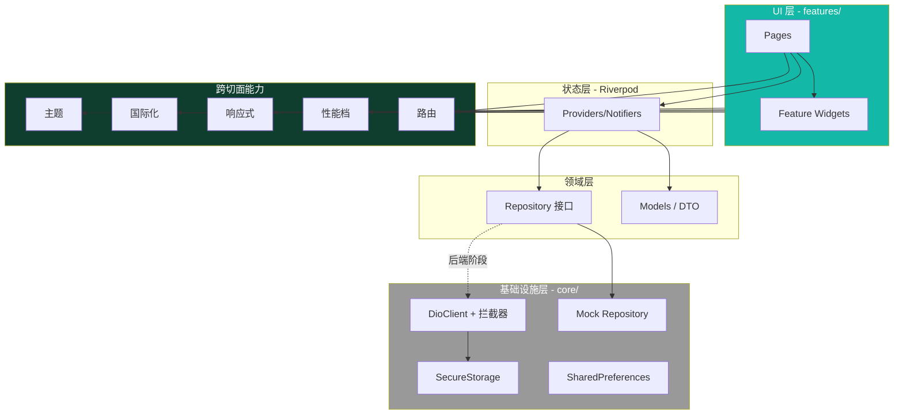
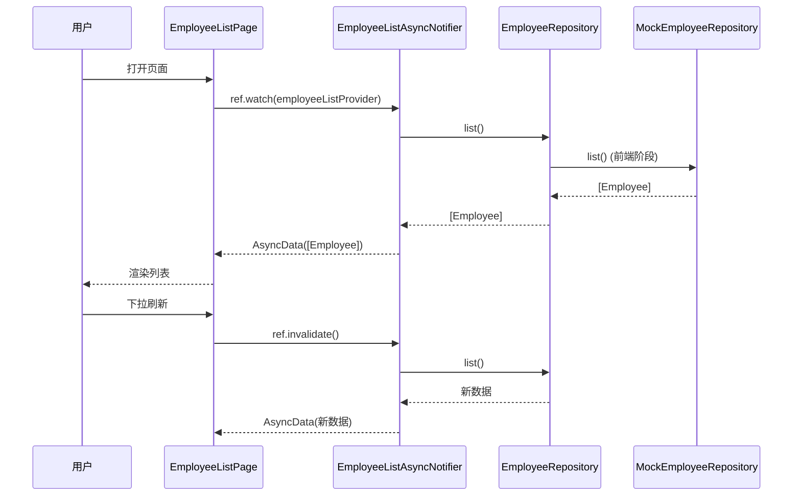
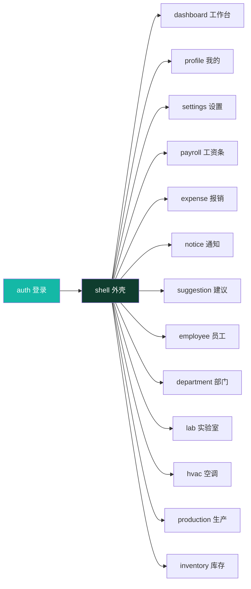
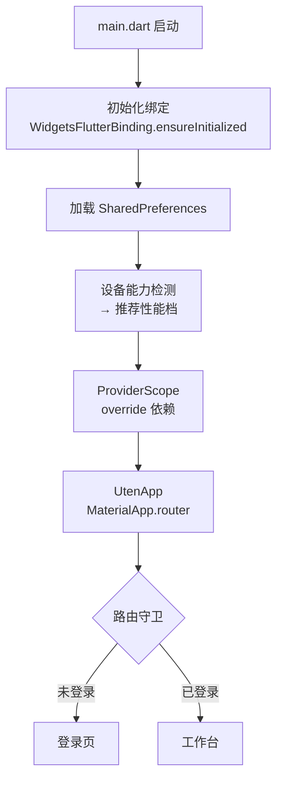

# 架构总览

> 本档是 Uten IMP 的整体架构一页纸，串联所有架构相关文档。

---

## 一、架构一图

---

## 二、分层职责

| 层 | 目录 | 职责 | 依赖方向 |
|---|---|---|---|
| UI 层 | `features/*/pages/`、`components/` | 渲染 + 用户交互 | → State |
| 状态层 | `features/*/providers/`、`shared/providers/` | 业务状态管理 | → Domain |
| 领域层 | `features/*/repositories/`（接口）、`models/` | 业务逻辑 + 数据契约 | → Infra |
| 基础设施层 | `core/network/`、`core/security/`、Mock 实现 | IO、网络、存储 | — |
| 跨切面 | `core/theme/`、`l10n/`、`responsive/`、`performance/`、`router/` | 横切关注点 | 被所有层用 |

**依赖规则**：
- 上层依赖下层，下层不依赖上层
- Feature 之间不直接依赖（通过 shared/）
- 所有层依赖跨切面

---

## 三、关键设计决策索引

| 决策 | 文档 |
|---|---|
| 用 Flutter | [ADR-001](../99-决策记录-ADR/ADR-001-技术栈选型.md) |
| 用 Riverpod | [ADR-002](../99-决策记录-ADR/ADR-002-状态管理选Riverpod.md) |
| 性能三档 | [ADR-003](../99-决策记录-ADR/ADR-003-性能分级三档.md) |
| 深绿+青绿 | [ADR-004](../99-决策记录-ADR/ADR-004-品牌色深绿青绿.md) |
| 单向影子双写 | [ADR-005](../99-决策记录-ADR/ADR-005-单向影子双写策略.md) |

---

## 四、数据流（典型场景：员工列表）

HR/鉴权已用 `DioEmployeeRepository` 等真实实现对接后端；其余模块仍是 `MockXxxRepository`，切换时只换实现、**业务代码不变**。

---

## 五、跨切面能力一览

| 能力 | 实现位置 | 文档 |
|---|---|---|
| 主题（深/浅） | `core/theme/` + `ThemeProvider` | [08-主题与配色](../00-项目准则/08-主题与配色.md) |
| 国际化（中/英） | `core/l10n/` + `LocaleProvider` | [05-国际化与多语言](../00-项目准则/05-国际化与多语言.md) |
| 响应式（三档断点） | `core/responsive/` | [02-响应式与多端适配](../00-项目准则/02-响应式与多端适配.md) |
| 自适应布局 | `components/layout/` | [03-自适应布局组件](../00-项目准则/03-自适应布局组件.md) |
| 字号可调 | `FontScaleProvider` + textTheme | [04-字体与字号可调](../00-项目准则/04-字体与字号可调.md) |
| 性能档 | `core/performance/` + `PerformanceProvider` | [07-性能自适应](../00-项目准则/07-性能自适应.md) |
| 动画 | UtenAnim token | [06-动画规范](../00-项目准则/06-动画规范.md) |
| 路由 | `core/router/` + go_router | [路由设计](路由设计.md) |
| 状态管理 | Riverpod 2.x | [状态管理](状态管理.md) |
| 网络 | `core/network/`（dio）+ Repository（HR/鉴权真实，其余 Mock） | [网络层与Mock](网络层与Mock.md) |
| 安全 | `core/security/` + 拦截器 | [安全策略](安全策略.md) + [10-安全准则](../00-项目准则/10-安全准则.md) |

---

## 六、关键约束回顾

1. **业务代码必须用 Uten 组件库**（不直接堆 Material 组件）
2. **业务依赖 Repository 接口**（HR/鉴权 Dio 实现，其余 Mock，切换零改动）
3. **颜色/字号/动画/文案必须走 token**（不硬编码）
4. **路由必须走 go_router**（不手动 `Navigator.push`）
5. **状态必须用 Riverpod**（不用 setState 管跨页状态，不用全局单例）
6. **性能档必须被组件尊重**（lite 下不跑重动画）
7. **敏感数据必须 secure_storage**（不进 shared_preferences）

---

## 七、模块依赖图（Phase 完成后）

所有 feature 依赖 `shell`（外壳）和 `shared/`（跨切面），feature 之间不互相依赖。

---

## 八、启动流程

---

## 九、相关文档导航

| 主题 | 文档 |
|---|---|
| 整体架构（本档） | 架构总览.md |
| 路由 | [路由设计.md](路由设计.md) |
| 状态管理 | [状态管理.md](状态管理.md) |
| 网络与 Mock | [网络层与Mock.md](网络层与Mock.md) |
| 安全 | [安全策略.md](安全策略.md) |
| 全局机制（权限/视角/审批/离线） | [全局机制.md](全局机制.md) |
| 目录结构 | [../01-规划/目录结构.md](../01-规划/目录结构.md) |
| 跨切面准则 | [../00-项目准则/](../00-项目准则/) |
| 老系统融合 | [../06-老系统融合/](../06-老系统融合/) |

---

**最后更新**：2026-07-21
