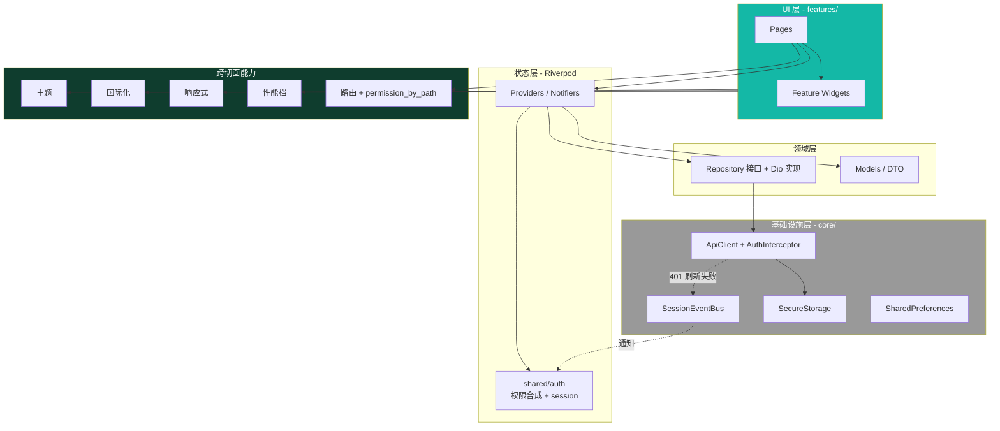
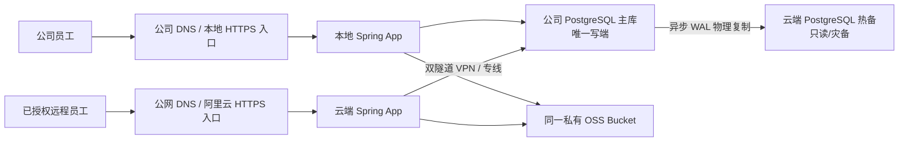
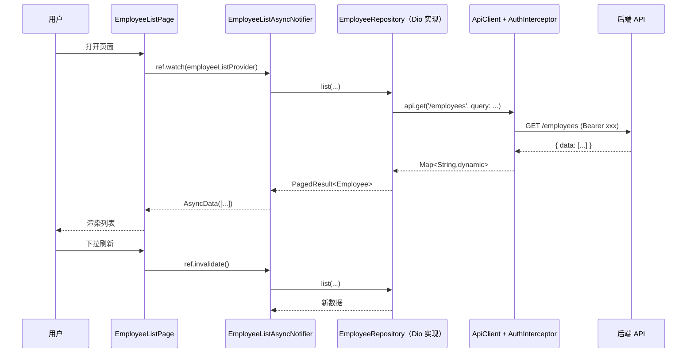
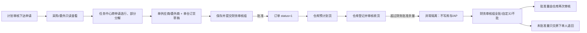
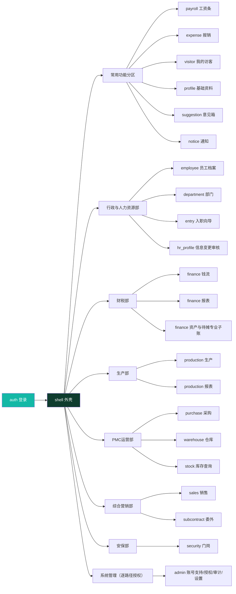
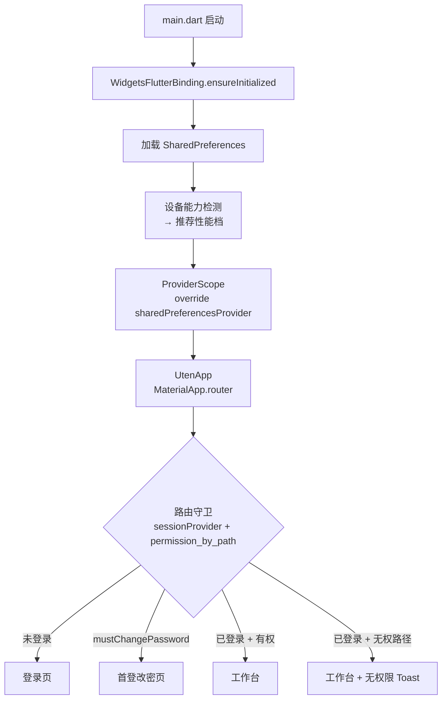

# 架构总览

> 本档是 Uten IMP 的整体架构一页纸，串联所有架构相关文档。

---

## 一、架构一图

> 后端采用 Spring Boot 3.5.16 + PostgreSQL + Flyway。工资与员工报销前端活动 Mock 已移除，
> V133 表、后端 API 与固定状态机已有源码；业务口径、权限和生产 E2E 仍须按运行证据验收。实验室/设备接入尚未完成
> （详见[网络层与拦截器](网络层与Mock.md)）。

### 1.1 生产部署拓扑（2026-08-09）

- 正常时本地/云端 App 都提交到同一个本地主库，不存在跨库合并。
- 断链时公司继续写；云端员工业务请求返回 503，不缓存、排队或恢复后静默重放业务写。
- `users.remote_access` 默认关闭；云端登录、refresh 和每个员工业务请求均由后端门禁，本地入口另受 CIDR 门禁。
- 原生 Release 固定本地/云端受控端点并在公司内优先本地；Web Release 使用同源 `/api`，不得浏览器跨域探测内网。
- 云端热备不是备份；必须另做 PITR、fencing、提升、重建和回切。

实现状态和未完成事项以
[2026-08-09 本地云端部署与生产就绪清单](../99-项目治理/2026-08-09-本地云端部署与生产就绪清单.md)为准。

---

## 二、分层职责

| 层 | 目录 | 职责 | 依赖方向 |
|---|---|---|---|
| UI 层 | `features/*/pages/`、`components/` | 渲染 + 用户交互 | → State |
| 状态层 | `features/*/providers/`、`shared/providers/`、`shared/auth/` | 业务状态 + 会话 + 权限合成 | → Domain |
| 领域层 | `features/*/repositories/`（接口 + Dio 实现）、`models/` | 业务逻辑 + 数据契约 | → Infra |
| 基础设施层 | `core/network/`、`core/security/`、`core/router/`、`core/io/` | 网络、鉴权、存储、路由守卫 | — |
| 跨切面 | `core/theme/`、`l10n/`、`responsive/`、`performance/`、`ui/` | 横切关注点 | 被所有层用 |

**依赖规则**：
- 上层依赖下层，下层不依赖上层
- Feature 之间不直接依赖（通过 `shared/`）
- 所有层依赖跨切面

---

## 三、关键设计决策索引

| 决策 | 文档 |
|---|---|
| 用 Flutter | [ADR-001](../99-决策记录-ADR/ADR-001-技术栈选型.md) |
| 用 Riverpod | [ADR-002](../99-决策记录-ADR/ADR-002-状态管理选Riverpod.md) |
| 性能三档 | [ADR-003](../99-决策记录-ADR/ADR-003-性能分级三档.md) |
| 深绿+青绿 | [ADR-004](../99-决策记录-ADR/ADR-004-品牌色深绿青绿.md) |
| 单向影子双写 | [ADR-005](../99-决策记录-ADR/ADR-005-单向影子双写策略.md) |
| Spring Boot + Postgres | [ADR-006](../99-决策记录-ADR/ADR-006-后端栈选型SpringBoot+Postgres.md) |
| 后端代码结构 | [ADR-008](../99-决策记录-ADR/ADR-008-后端代码结构重构.md) |
| 后端安全加固 | [ADR-009](../99-决策记录-ADR/ADR-009-后端安全加固与功能补全.md) |
| 组织岗位模型 | [ADR-010](../99-决策记录-ADR/ADR-010-组织岗位模型与统一部门选择器.md) |
| 工作台部门分区 + 权限动态化 | [ADR-011](../99-决策记录-ADR/ADR-011-工作台部门分区与动态权限配置.md) |
| 加密导出 + 列排序 + 行跳源头 | [ADR-012](../99-决策记录-ADR/ADR-012-报表加密导出与列排序与行跳源头.md) |
| 系统设置可视化 | [ADR-013](../99-决策记录-ADR/ADR-013-系统设置与安全策略可视化.md) |
| 模块化单体 + CQRS 读侧 + Outbox 旁路 | [ADR-017](../99-决策记录-ADR/ADR-017-模块化单体与异步旁路.md) |
| 本地单主 + 云端异步热备 + 远程授权 | [ADR-031](../99-决策记录-ADR/ADR-031-本地云端单主库部署架构.md) |

---

## 四、数据流（典型场景：员工列表）

业务数据流统一为 UI → Provider → Repository（Dio 实现）→ ApiClient → 后端。旧员工、工资和
员工报销 Mock 已移除，网络失败不会回退假数据；但 Dio 契约存在仍不能代替服务端状态机、
数据库副作用、授权和端到端验收。

---

## 五、业务模块现状

| 模块 | 路径前缀 | 数据来源 | 备注 |
|---|---|---|---|
| 鉴权 / 会话 | `/auth/*`、`/me` | 真实 | Argon2id + JWT 轮换；token 存 `secure_storage` |
| 工作台 | `/dashboard` | 真实 | 按业务部门分区（ADR-011），布局偏好后端持久化 |
| 员工档案 / 部门 / 入职 | `/employee/*`、`/department/*` | 真实 | 组织岗位模型（ADR-010） |
| 工资条 | `/payroll/*` | **Dio + V133 + 真实 API + V138 分页索引源码** | 生成/提交/审核/发布/个人查看/PDF/服务端分页已接；变量输入入口、职责分离、容量与生产 E2E 待验收 |
| 员工报销 | `/expense/*` | **Dio + V133 + 真实 API + V138 分页索引 + V240/V243/V244 附件源码** | 独立 claim/items、服务端分页、事务化付款会计交接，以及对象级附件授权、服务端哈希、精确 OSS 版本和短时下载授权源码已接；不能与 `/api/finance/expenses` 一般费用单混为一谈；PostPolicy、staging/final、AV 隔离、删除 outbox、孤儿治理、真实 OSS/恢复、审批口径、容量和生产 E2E 待验收，整体仍 NO-GO |
| 通知 / 建议 | `/notice/*`、`/suggestion/*` | 真实 | 后端 API 已实现 |
| 访客 | `/visitor-*`、`/security/*` | 真实 + V139 分页索引源码 | 主账号 + 访客子会话双总线；本人/HR/被访人三列表服务端分页，真实短信与容量/E2E 待验收 |
| 基础资料 | `/basic-data/*` | 真实 | 6 主档（货品/模具/客户/供应商/颜色/单位）+ 类别树 + 币种/仓库/账户 |
| 采购 | `/purchase/*` | 真实 + V196–V200 候选 | 计划下达申请只读；任务中心跨申请选行/部分分解，订货保存并提交财务 |
| 销售 | `/sales/*` | 真实 | 5 单据 + 报表 |
| 委外 | `/subcontract/*` | 真实 + V196–V200 候选 | 计划下达申请只读；任务中心分解订货并提交财务审核组 |
| 仓库 | `/warehouse/*` | 真实 + V196/V201 候选 | 8 单据 + 14 报表；预计到货、超量异常与批准后再审任务 |
| 库存查询 | `/stock/*` | 真实 | 余额 + 流水 |
| 生产 | `/production/*` | 真实 | 计划/成本/日报 + 报表 |
| 钱流与资产子账 | `/finance/*` | 真实 + 专用候选流程/资产安全门禁 | 5 单据 + 应收应付 + 对帐 + 22 报表；V196/V201 增订货/超量审批任务（V229/ADR-027 起改为财务审核组，单点负责人设置已删除）；`/finance/assets` 为 V183 专业子账，完整生命周期 NO-GO |
| 个人信息自助 / HR 审核 | `/profile/*`、`/hr/profile-changes/*` | 真实 | 字段策略（直改/需审核/HR 专属只读） |
| 系统管理 | `/admin/*` | 真实 | 账号支持/授权管理（含默认关闭的员工云端访问开关）、审计中心、系统设置；逐路径权限，审计核查不等于超管（ADR-013/ADR-031） |

### 5.1 计划需求到仓库的跨模块链（V196–V202 引入）

通知只是提醒，任务和动作以服务端投影、财务审核组实时资格及 `allowedActions` 为准；超级管理员不在财务部且未被点名不可代审。V202 对全部 `public` 业务表做审计触发器 sweep，并非只补到货异常表。
公司目标库 2026-08-09 已确认到 V238、源码到 V244；真实岗位/实物 UAT、完整 IQC 和发布签字仍未完成，生产 **NO-GO**。

> 单据/报表列表与主档展示统一用 `MasterDataTableView`（一处改、全表生效：列排序、加密导出、行跳源头，详见 [ADR-012](../99-决策记录-ADR/ADR-012-报表加密导出与列排序与行跳源头.md)）。

---

## 六、跨切面能力一览

| 能力 | 实现位置 | 文档 |
|---|---|---|
| 主题（深/浅） | `core/theme/` + `ThemeProvider` | [08-主题与配色](../00-项目准则/08-主题与配色.md) |
| 国际化（中/英） | `core/l10n/` + `LocaleProvider` | [05-国际化与多语言](../00-项目准则/05-国际化与多语言.md) |
| 响应式（三档断点） | `core/responsive/` | [02-响应式与多端适配](../00-项目准则/02-响应式与多端适配.md) |
| 自适应布局 | `components/layout/` | [03-自适应布局组件](../00-项目准则/03-自适应布局组件.md) |
| 字号可调 | `FontScaleProvider` + textTheme | [04-字体与字号可调](../00-项目准则/04-字体与字号可调.md) |
| 性能档 | `core/performance/` + `PerformanceProvider` | [07-性能自适应](../00-项目准则/07-性能自适应.md) |
| 动画 | UtenAnim token | [06-动画规范](../00-项目准则/06-动画规范.md) |
| 路由 + 守卫 | `core/router/` + go_router + `permission_by_path` | [路由设计](路由设计.md) |
| 状态管理 | Riverpod 2.x | [状态管理](状态管理.md) |
| 网络 + 鉴权 | `core/network/`（ApiClient + AuthInterceptor + SessionEventBus） | [网络层与拦截器](网络层与Mock.md) |
| 本地/云端入口与断链边界 | `server_selection.dart` + Local/Remote Guard + cloud routing datasource | [ADR-031](../99-决策记录-ADR/ADR-031-本地云端单主库部署架构.md) + [生产就绪清单](../99-项目治理/2026-08-09-本地云端部署与生产就绪清单.md) |
| 权限模型 | `shared/auth/permissions.dart` + `currentPermissionsProvider`（部门配置 + 个人覆盖，ADR-011） | [全局机制](全局机制.md) + [安全策略](安全策略.md) |
| 安全（导出/配置） | `:export` 权限 + Bucket4j 限流 + AES-256 + 系统设置页 | [安全策略 §十](安全策略.md) + [ADR-012](../99-决策记录-ADR/ADR-012-报表加密导出与列排序与行跳源头.md) + [ADR-013](../99-决策记录-ADR/ADR-013-系统设置与安全策略可视化.md) |

---

## 七、模块依赖图

工作台分区与公司一级部门一一对应（ADR-011）；feature 之间不互相依赖，仅依赖 `shell` + `shared/`。

---

## 八、关键约束回顾

1. **业务代码必须用 Uten 组件库**（不直接堆 Material 组件）
2. **业务依赖 Repository 接口**（生产模块使用真实 API；原型 Mock 必须显式标注且不得进入发布范围）
3. **颜色/字号/动画/文案必须走 token**（不硬编码）
4. **路由必须走 go_router + `permission_by_path`**（不手动 `Navigator.push`，不在页面散写权限判定）
5. **状态必须用 Riverpod**（不用 setState 管跨页状态，不用全局单例）
6. **性能档必须被组件尊重**（lite 下不跑重动画）
7. **敏感数据必须 secure_storage**（不进 shared_preferences；密码入 body 不入 URL）
8. **导出整表数据必须五道防线**（独立 `:export` 权限 + 限流 + 加密 + 行数上限 + 审计，[安全策略 §十](安全策略.md)）

---

## 九、启动流程

启动期 `sessionProvider.build()` 用 refresh token 调 `/auth/me` 恢复登录态；`AuthInterceptor` 监听后续 401 并通过 `SessionEventBus` 通知失效（详见 [网络层与拦截器 §六/§七](网络层与Mock.md)）。

---

## 十、相关文档导航

| 主题 | 文档 |
|---|---|
| 整体架构（本档） | 架构总览.md |
| 路由 | [路由设计.md](路由设计.md) |
| 状态管理 | [状态管理.md](状态管理.md) |
| 网络与拦截器 | [网络层与Mock.md](网络层与Mock.md)（原"网络层与 Mock"，正文已对齐真实后端） |
| 安全 | [安全策略.md](安全策略.md)（**§十 数据导出/配置安全规范为权威**） |
| 全局机制（权限/视角/审批/异常） | [全局机制.md](全局机制.md) |
| 目录结构 | [../01-规划/目录结构.md](../01-规划/目录结构.md) |
| 跨切面准则 | [../00-项目准则/](../00-项目准则/) |
| 老系统融合 | [../06-老系统融合/](../06-老系统融合/) |
| 本地/阿里云部署、远程授权和剩余工作 | [2026-08-09 生产就绪清单](../99-项目治理/2026-08-09-本地云端部署与生产就绪清单.md) |

---

**最后更新**：2026-08-09（补本地唯一写主库、云端异步热备、远程授权、双入口、共享 OSS 与生产 NO-GO 边界；
历史业务模块状态仍以各专项报告为准）
