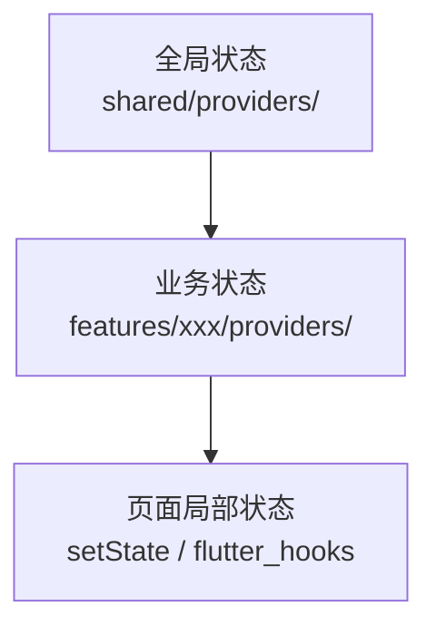

# 状态管理

> 本档定义 Uten IMP 的状态管理架构，基于 Riverpod 2.x。
> 选型理由见 [../99-决策记录-ADR/ADR-002-状态管理选Riverpod.md](../99-决策记录-ADR/ADR-002-状态管理选Riverpod.md)。

---

## 一、状态分层



| 层 | 何时用 | 持久化 | 示例 |
|---|---|---|---|
| 全局状态 | 跨 feature 共享 | 通常持久化 | 主题、语言、字号、性能档、当前用户 |
| 业务状态 | 单个 feature 内 | 通常不持久化（从 API 拉） | 工资条列表、报销草稿 |
| 局部状态 | 单个 Widget 内 | 不持久化 | 密码可见切换、Tab 索引 |

**原则**：能用局部状态就别用 Provider，避免过度设计。

---

## 二、Provider 类型选择

| 场景 | 用什么 | 示例 |
|---|---|---|
| 简单只读值 | `Provider` | `currentLocaleProvider` |
| 可变状态 | `NotifierProvider` + `Notifier` | `ThemeNotifier` |
| 异步数据（加载/错误/成功） | `AsyncNotifierProvider` + `AsyncNotifier` | `EmployeeListAsyncNotifier` |
| 派生数据 | `Provider` 组合多个 | `filteredEmployeeProvider` |
| 流式数据 | `StreamProvider` | 实时通知（后端接入后） |
| 未来数据（一次性） | `FutureProvider` | 加载单条详情 |

---

## 三、命名约定

详见 [../00-项目准则/01-命名规范.md#26-providernotifier-命名](../00-项目准则/01-命名规范.md)。

```dart
// Provider 标识（小写 camelCase + Provider 后缀）
final themeProvider = NotifierProvider<ThemeNotifier, ThemeMode>(() => ThemeNotifier());
final currentUserProvider = Provider<User?>((ref) => null);
final employeeListProvider =
    AsyncNotifierProvider<EmployeeListAsyncNotifier, List<Employee>>(
  () => EmployeeListAsyncNotifier(),
);

// Notifier 类（大写 UpperCamelCase + Notifier 后缀）
class ThemeNotifier extends Notifier<ThemeMode> { ... }
class EmployeeListAsyncNotifier extends AsyncNotifier<List<Employee>> { ... }
```

---

## 四、典型模式

### 4.1 全局偏好（持久化）

```dart
// lib/shared/providers/theme_provider.dart

class ThemeNotifier extends Notifier<ThemeMode> {
  late final SharedPreferences _prefs;

  @override
  ThemeMode build() {
    _prefs = ref.read(sharedPreferencesProvider);
    final saved = _prefs.getString('themeMode');
    return switch (saved) {
      'light' => ThemeMode.light,
      'dark' => ThemeMode.dark,
      _ => ThemeMode.system,
    };
  }

  Future<void> set(ThemeMode mode) async {
    await _prefs.setString('themeMode', mode.name);
    state = mode;
  }
}

final themeProvider = NotifierProvider<ThemeNotifier, ThemeMode>(() => ThemeNotifier());
```

### 4.2 异步业务数据

```dart
// lib/features/employee/providers/employee_list_provider.dart

class EmployeeListAsyncNotifier extends AsyncNotifier<List<Employee>> {
  @override
  Future<List<Employee>> build() async {
    final repo = ref.read(employeeRepositoryProvider);
    return repo.list();
  }

  Future<void> refresh() async {
    state = const AsyncLoading();
    state = await AsyncValue.guard(() => ref.read(employeeRepositoryProvider).list());
  }

  Future<void> search(String keyword) async {
    state = const AsyncLoading();
    state = await AsyncValue.guard(
      () => ref.read(employeeRepositoryProvider).search(keyword),
    );
  }
}

final employeeListProvider =
    AsyncNotifierProvider<EmployeeListAsyncNotifier, List<Employee>>(
  () => EmployeeListAsyncNotifier(),
);
```

### 4.3 派生数据

```dart
final filteredEmployeeProvider = Provider<List<Employee>>((ref) {
  final list = ref.watch(employeeListProvider).valueOrNull ?? [];
  final keyword = ref.watch(employeeSearchKeywordProvider);
  if (keyword.isEmpty) return list;
  return list.where((e) => e.name.contains(keyword)).toList();
});
```

### 4.4 Widget 中使用

```dart
class EmployeeListPage extends ConsumerWidget {
  @override
  Widget build(BuildContext context, WidgetRef ref) {
    final employees = ref.watch(employeeListProvider);

    return Scaffold(
      body: employees.when(
        loading: () => const UtenSkeleton.list(),
        error: (e, _) => UtenEmpty.error(onRetry: () => ref.invalidate(employeeListProvider)),
        data: (list) => EmployeeListView(employees: list),
      ),
    );
  }
}
```

---

## 五、ProviderScope 与依赖注入

只在 `main.dart` 包一层 `ProviderScope`，并注入全局依赖：

```dart
// lib/main.dart

void main() async {
  WidgetsFlutterBinding.ensureInitialized();
  final prefs = await SharedPreferences.getInstance();

  runApp(
    ProviderScope(
      overrides: [
        sharedPreferencesProvider.overrideWithValue(prefs),
        // 后端接入后：authRepositoryProvider.overrideWithValue(DioAuthRepository(dio))
        // 前端阶段：authRepositoryProvider.overrideWithValue(MockAuthRepository())
      ],
      child: const UtenApp(),
    ),
  );
}
```

Repository 用接口 + 实现分离，前端阶段用 Mock，后端接入后换 Dio 实现，**业务代码零改动**。

---

## 六、AutoDispose

列表/详情类 Provider 默认 `AutoDispose`，避免内存泄漏：

```dart
final employeeListProvider =
    AutoBotifierProvider<EmployeeListAsyncNotifier, List<Employee>>(...);
```

全局状态（主题/语言/当前用户）**不要** AutoDispose。

---

## 七、禁忌

- ❌ 不要在 Widget 顶层包多层 `ProviderScope`
- ❌ 不要在 build 方法里 `ref.read` 后修改状态（用事件处理函数）
- ❌ 不要用 `setState` 管理跨页面状态（用 Provider）
- ❌ 不要用全局单例（`static`）代替 Provider
- ❌ 不要在 Notifier 的 build 里 `ref.read`（应该 `ref.watch`，建立依赖）
- ❌ 不要直接 `ref.read(repo).xxx()` 在 build 里调用（要包在 AsyncNotifier 里）

---

## 八、测试

- 单元测试：直接实例化 Notifier，注入 mock ref
- Widget 测试：`ProviderScope(overrides: [...])` 替换依赖
- 不需要 MaterialApp 包裹就能测 Notifier 逻辑

---

## 九、相关文档

- [../00-项目准则/05-国际化与多语言.md](../00-项目准则/05-国际化与多语言.md)（LocaleProvider 实例）
- [../00-项目准则/04-字体与字号可调.md](../00-项目准则/04-字体与字号可调.md)（FontScaleNotifier 实例）
- [网络层与Mock.md](网络层与Mock.md)

---

**最后更新**：2026-07-21
