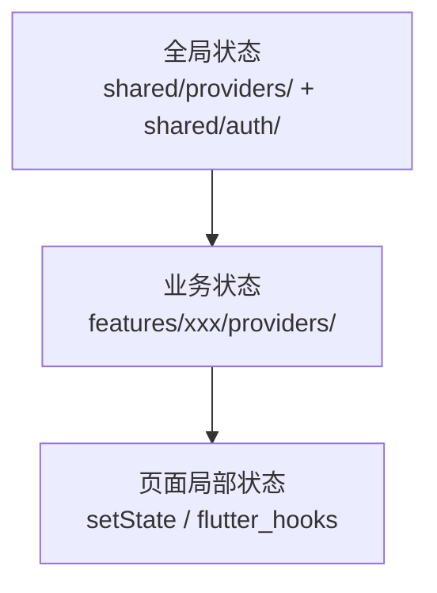

# 状态管理

> 本档定义 Uten IMP 的状态管理架构，基于 Riverpod 2.x。
> 选型理由见 [../99-决策记录-ADR/ADR-002-状态管理选Riverpod.md](../99-决策记录-ADR/ADR-002-状态管理选Riverpod.md)。

---

## 一、状态分层



| 层 | 何时用 | 持久化 | 示例 |
|---|---|---|---|
| 全局状态 | 跨 feature 共享 | 通常持久化 | 主题、语言、字号、性能档、会话（`sessionProvider`）、当前权限集（`currentPermissionsProvider`） |
| 业务状态 | 单个 feature 内 | 通常不持久化（从 API 拉） | 工资条列表、报销草稿、单据分页结果 |
| 局部状态 | 单个 Widget 内 | 不持久化 | 密码可见切换、Tab 索引 |

**原则**：能用局部状态就别用 Provider，避免过度设计。

---

## 二、Provider 类型选择

| 场景 | 用什么 | 示例 |
|---|---|---|
| 简单只读值 | `Provider` | `currentLocaleProvider`、`currentPermissionsProvider` |
| 可变状态 | `NotifierProvider` + `Notifier` | `ThemeNotifier`、`SessionNotifier` |
| 异步数据（加载/错误/成功） | `AsyncNotifierProvider` + `AsyncNotifier` | `EmployeeListAsyncNotifier` |
| 派生数据 | `Provider` 组合多个 | `filteredEmployeeProvider` |
| 流式数据 | `StreamProvider` | 实时通知（暂未接入，后端 SSE/WebSocket 后用） |
| 未来数据（一次性） | `FutureProvider` | 加载单条详情 |
| 带参数族 | `FutureProvider.family` / `AsyncNotifierProvider.family` | `payrollDetailProvider(id)`、`masterListProvider(filter)` |

---

## 三、命名约定

详见 [../00-项目准则/01-命名规范.md#26-providernotifier-命名](../00-项目准则/01-命名规范.md)。

```dart
// Provider 标识（小写 camelCase + Provider 后缀）
final themeProvider = NotifierProvider<ThemeNotifier, ThemeMode>(() => ThemeNotifier());
final sessionProvider = NotifierProvider<SessionNotifier, SessionState>(SessionNotifier.new);
final employeeListProvider =
    AsyncNotifierProvider<EmployeeListAsyncNotifier, List<Employee>>(
  () => EmployeeListAsyncNotifier(),
);

// Notifier 类（大写 UpperCamelCase + Notifier 后缀）
class ThemeNotifier extends Notifier<ThemeMode> { ... }
class SessionNotifier extends Notifier<SessionState> { ... }
class EmployeeListAsyncNotifier extends AsyncNotifier<List<Employee>> { ... }
```

---

## 四、典型模式

### 4.1 全局偏好（持久化）

```dart
// lib/shared/providers/theme_provider.dart

class ThemeNotifier extends Notifier<ThemeMode> {
  late final SharedPreferences _prefs;

  @override
  ThemeMode build() {
    _prefs = ref.read(sharedPreferencesProvider);
    final saved = _prefs.getString('themeMode');
    return switch (saved) {
      'light' => ThemeMode.light,
      'dark' => ThemeMode.dark,
      _ => ThemeMode.system,
    };
  }

  Future<void> set(ThemeMode mode) async {
    await _prefs.setString('themeMode', mode.name);
    state = mode;
  }
}

final themeProvider = NotifierProvider<ThemeNotifier, ThemeMode>(() => ThemeNotifier());
```

### 4.2 会话状态（真实后端鉴权）

```dart
// lib/shared/providers/session_provider.dart

enum AuthStatus { unauthenticated, authenticated, mustChangePassword }

class SessionState {
  const SessionState({this.status = AuthStatus.unauthenticated, this.user});
  final AuthStatus status;
  final AppUser? user;
  bool get isLoggedIn => status == AuthStatus.authenticated;
}

class SessionNotifier extends Notifier<SessionState> {
  @override
  SessionState build() {
    // 启动恢复：若有 refresh 令牌，尝试 /auth/me 恢复登录态
    Future.microtask(_restore);
    // 监听会话失效（AuthInterceptor 401 刷新失败时由 SessionEventBus 发出）
    SessionEventBus.instance.onSessionExpired.listen((_) {
      state = const SessionState();
    });
    return const SessionState();
  }

  Future<void> login({required String account, required String password}) async {
    final res = await _auth.login(account, password);
    state = SessionState(
      status: res.mustChangePassword ? AuthStatus.mustChangePassword : AuthStatus.authenticated,
      user: _toAppUser(res.user),
    );
  }
  // ... logout / changePassword / _restore
}

final sessionProvider =
    NotifierProvider<SessionNotifier, SessionState>(SessionNotifier.new);
```

要点：
- 令牌存 `secure_storage`，**不进 Provider state**（避免内存泄漏 + 跨副本泄露）。
- 启动期用 refresh token 调 `/auth/me` 恢复登录态；失败清 storage。
- `AuthInterceptor` 401 刷新失败时通过 `SessionEventBus` 通知本 Provider 置为未登录（避免 Dio ↔ Riverpod 循环依赖，详见 [网络层与拦截器 §七](网络层与Mock.md)）。

### 4.3 异步业务数据

```dart
class EmployeeListAsyncNotifier extends AsyncNotifier<List<Employee>> {
  @override
  Future<List<Employee>> build() async {
    final repo = ref.read(employeeRepositoryProvider);
    return repo.list();
  }

  Future<void> refresh() async {
    state = const AsyncLoading();
    state = await AsyncValue.guard(() => ref.read(employeeRepositoryProvider).list());
  }

  Future<void> search(String keyword) async {
    state = const AsyncLoading();
    state = await AsyncValue.guard(
      () => ref.read(employeeRepositoryProvider).search(keyword),
    );
  }
}

final employeeListProvider =
    AsyncNotifierProvider<EmployeeListAsyncNotifier, List<Employee>>(
  () => EmployeeListAsyncNotifier(),
);
```

### 4.4 派生数据

```dart
final filteredEmployeeProvider = Provider<List<Employee>>((ref) {
  final list = ref.watch(employeeListProvider).valueOrNull ?? [];
  final keyword = ref.watch(employeeSearchKeywordProvider);
  if (keyword.isEmpty) return list;
  return list.where((e) => e.name.contains(keyword)).toList();
});
```

权限派生也是此模式：`currentPermissionsProvider` watch `sessionProvider`，从 `user.permissions` 派生（超管 union 兜底），见 [全局机制 §1.3](全局机制.md)。

### 4.5 Widget 中使用

```dart
class EmployeeListPage extends ConsumerWidget {
  @override
  Widget build(BuildContext context, WidgetRef ref) {
    final employees = ref.watch(employeeListProvider);

    return Scaffold(
      body: employees.when(
        loading: () => const UtenSkeleton.list(),
        error: (e, _) => UtenEmpty.error(
          message: e is ApiException ? e.message : '网络异常',
          onRetry: () => ref.invalidate(employeeListProvider),
        ),
        data: (list) => EmployeeListView(employees: list),
      ),
    );
  }
}
```

---

## 五、ProviderScope 与依赖注入

只在 `main.dart` 包一层 `ProviderScope`：

```dart
// lib/main.dart

Future<void> main() async {
  WidgetsFlutterBinding.ensureInitialized();
  final prefs = await SharedPreferences.getInstance();

  runApp(
    ProviderScope(
      overrides: [
        // 唯一需要 override 的：把已初始化的 SharedPreferences 注入
        sharedPreferencesProvider.overrideWithValue(prefs),
      ],
      child: const UtenApp(),
    ),
  );
}
```

Repository / ApiClient / SecureStorage 等依赖**不需要在 main.dart 手动 override**——各自的 Provider 内部 `watch` 下游依赖直接 new：

```dart
// 链式注入，自给自足
final apiClientProvider = Provider<ApiClient>((ref) {
  final storage = ref.watch(secureStorageProvider);
  final dio = Dio(BaseOptions(baseUrl: _baseUrl, ...));
  dio.interceptors.add(AuthInterceptor(storage: storage, baseUrl: _baseUrl));
  return ApiClient(dio);
});

final authRepositoryProvider = Provider<AuthRepository>(
  (ref) => DioAuthRepository(ref.watch(apiClientProvider), ref.watch(secureStorageProvider)),
);
```

业务模块的 Repository Provider 全部按此模式（Dio 实现 + watch `apiClientProvider`）。**已无 Mock 实现**。

---

## 六、AutoDispose

列表/详情类 Provider 默认 `AutoDispose`，避免内存泄漏：

```dart
final employeeListProvider =
    AsyncNotifierProvider.autoDispose<EmployeeListAsyncNotifier, List<Employee>>(
  () => EmployeeListAsyncNotifier(),
);

final payrollDetailProvider =
    FutureProvider.autoDispose.family<PayrollSlip?, String>((ref, id) async { ... });
```

全局状态（主题/语言/会话/当前权限）**不要** AutoDispose。

> 报表/主档列表常需"返回保活筛选/分页状态"：用 `autoDispose` + Provider 间 watch 关键状态（筛选/排序），或通过路由层保活（详见 memory：go_router 来源感知导航）。列表分页审计见 memory：list-card-pagination。

---

## 七、禁忌

- ❌ 不要在 Widget 顶层包多层 `ProviderScope`
- ❌ 不要在 build 方法里 `ref.read` 后修改状态（用事件处理函数）
- ❌ 不要用 `setState` 管理跨页面状态（用 Provider）
- ❌ 不要用全局单例（`static`）代替 Provider（`SessionEventBus` 是少数例外，因为它要跨 Dio ↔ Riverpod 解耦）
- ❌ 不要在 Notifier 的 build 里 `ref.read`（应该 `ref.watch`，建立依赖）
- ❌ 不要直接 `ref.read(repo).xxx()` 在 build 里调用（要包在 AsyncNotifier 里）
- ❌ 不要把令牌/敏感数据放进 Provider state（走 `secure_storage`）

---

## 八、测试

- 单元测试：直接实例化 Notifier，注入 mock ref
- Widget 测试：`ProviderScope(overrides: [...])` 替换依赖（此处 `override` 是测试用，不是生产代码）
- 不需要 MaterialApp 包裹就能测 Notifier 逻辑

---

## 九、相关文档

- [../00-项目准则/05-国际化与多语言.md](../00-项目准则/05-国际化与多语言.md)（LocaleProvider 实例）
- [../00-项目准则/04-字体与字号可调.md](../00-项目准则/04-字体与字号可调.md)（FontScaleNotifier 实例）
- [网络层与Mock.md](网络层与Mock.md)（原"网络层与 Mock"，已对齐真实后端）
- [全局机制.md](全局机制.md)（sessionProvider 与权限合成）
- [ADR-002 选 Riverpod](../99-决策记录-ADR/ADR-002-状态管理选Riverpod.md)

---

**最后更新**：2026-07-27（去 Mock 阶段；对齐真实 `sessionProvider` + AuthInterceptor 协作；Provider 链式注入）
