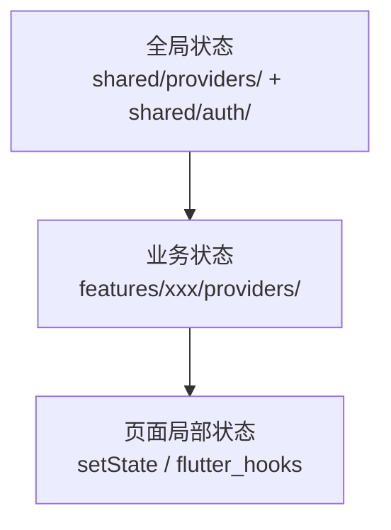

# 状态管理

> 本档定义 Uten IMP 的状态管理架构，基于 Riverpod 2.x。
> 选型理由见 [../99-决策记录-ADR/ADR-002-状态管理选Riverpod.md](../99-决策记录-ADR/ADR-002-状态管理选Riverpod.md)。

---

## 一、状态分层



| 层 | 何时用 | 持久化 | 示例 |
|---|---|---|---|
| 全局状态 | 跨 feature 共享 | 通常持久化 | 主题、语言、字号、性能档、会话（`sessionProvider`）、当前权限集（`currentPermissionsProvider`） |
| 业务状态 | 单个 feature 内 | 通常不持久化（从 API 拉） | 单据分页结果；工资、员工报销和访客三队列均通过 Dio Repository 只保留当前服务端页 |
| 局部状态 | 单个 Widget 内 | 不持久化 | 密码可见切换、Tab 索引 |

**原则**：能用局部状态就别用 Provider，避免过度设计。

---

## 二、Provider 类型选择

| 场景 | 用什么 | 示例 |
|---|---|---|
| 简单只读值 | `Provider` | `currentLocaleProvider`、`currentPermissionsProvider` |
| 可变状态 | `NotifierProvider` + `Notifier` | `ThemeNotifier`、`SessionNotifier` |
| 异步数据（加载/错误/成功） | `AsyncNotifierProvider` + `AsyncNotifier` | `EmployeeListAsyncNotifier` |
| 派生数据 | `Provider` 组合多个 | `filteredEmployeeProvider` |
| 流式数据 | `StreamProvider` | 实时通知（暂未接入，后端 SSE/WebSocket 后用） |
| 未来数据（一次性） | `FutureProvider` | 加载单条详情 |
| 带参数族 | `FutureProvider.family` / `AsyncNotifierProvider.family` | `payrollDetailProvider(id)`、`masterListProvider(filter)` |

---

## 三、命名约定

详见 [../00-项目准则/01-命名规范.md#26-providernotifier-命名](../00-项目准则/01-命名规范.md)。

```dart
// Provider 标识（小写 camelCase + Provider 后缀）
final themeProvider = NotifierProvider<ThemeNotifier, ThemeMode>(() => ThemeNotifier());
final sessionProvider = NotifierProvider<SessionNotifier, SessionState>(SessionNotifier.new);
final employeeListProvider =
    AsyncNotifierProvider<EmployeeListAsyncNotifier, List<Employee>>(
  () => EmployeeListAsyncNotifier(),
);

// Notifier 类（大写 UpperCamelCase + Notifier 后缀）
class ThemeNotifier extends Notifier<ThemeMode> { ... }
class SessionNotifier extends Notifier<SessionState> { ... }
class EmployeeListAsyncNotifier extends AsyncNotifier<List<Employee>> { ... }
```

---

## 四、典型模式

### 4.1 全局偏好（持久化）

```dart
// lib/shared/providers/theme_provider.dart

class ThemeNotifier extends Notifier<ThemeMode> {
  late final SharedPreferences _prefs;

  @override
  ThemeMode build() {
    _prefs = ref.read(sharedPreferencesProvider);
    final saved = _prefs.getString('themeMode');
    return switch (saved) {
      'light' => ThemeMode.light,
      'dark' => ThemeMode.dark,
      _ => ThemeMode.system,
    };
  }

  Future<void> set(ThemeMode mode) async {
    await _prefs.setString('themeMode', mode.name);
    state = mode;
  }
}

final themeProvider = NotifierProvider<ThemeNotifier, ThemeMode>(() => ThemeNotifier());
```

### 4.2 会话状态（真实后端鉴权）

```dart
// lib/shared/providers/session_provider.dart

enum AuthStatus { unauthenticated, authenticated, mustChangePassword }

class SessionState {
  const SessionState({this.status = AuthStatus.unauthenticated, this.user});
  final AuthStatus status;
  final AppUser? user;
  bool get isLoggedIn => status == AuthStatus.authenticated;
}

final sessionProvider =
    NotifierProvider<SessionNotifier, SessionState>(SessionNotifier.new);
```

要点：
- `SessionState` 只保存可渲染身份/权限快照，token **不进 Provider state**。员工 token 的唯一权威是
  `flutter_secure_storage` 中单个 `auth.token_record.v1`：包含 access、refresh、`generation`、
  `intentGeneration` 与随机 `sessionLineage`。普通偏好存储只保存不敏感的 logout fence。
- `generation` 表示每次权威写；`intentGeneration` 表示登录、改密、退出或明确凭据失效等用户/安全
  意图；refresh 只推进 generation 并保持 intent/lineage。权威记录损坏时写无令牌 tombstone，不能从
  旧双键恢复。旧双键迁移则必须先写成功权威记录再 best-effort 清旧键。
- 网络交换不占用 `SessionNotifier._sessionCommitTail`；队列只串行极短的存储/状态提交。本地
  `_sessionMutationEpoch` 与存储中的 `intentGeneration + sessionLineage` 共同实现
  latest-intent-wins：登录/改密先预留 intent，响应提交前后都复核；旧响应只能被撤销，不能复活会话。
- refresh 的保存/清理使用完整快照 CAS。外部标签页变化通过不含 token 的 BroadcastChannel 通知，
  收到后必须重新读取权威记录，不能直接信任可能迟到的通知。profile 刷新事件也携带三个代次字段，
  只有与当前记录及可见 lineage 一致才更新 `state.user`。
- 启动恢复先检查独立的 durable logout fence，再用当前 refresh 调 `/auth/me`；返回后复核完整会话
  identity。若 refresh 在请求期间推进同一 lineage，则重新读取最新代继续恢复；恢复信号撞上在途请求时
  只置 pending，当前请求结束后补跑，不丢唤醒。网络、503、异常响应或安全存储暂时不可读都不是凭据撤销
  证据，保持可重试；只有明确认证 code 且 CAS 命中当前记录才清理。
- 退出先同步把 `state` 切为未登录并激活 fence；随后在跨标签 token record 锁内读取最新记录，通过
  `beforeClear` 先把旧 refresh 持久交接进有界加密撤销队列，交接成功后才写 logout tombstone，网络撤销
  异步进行。交接/清理按 0/30/120ms 重试；交接失败时 fence 与原 token record 保持不动供重试，禁止先删
  设备上的唯一 refresh 副本。任何关键存储步骤失败都维持本进程 fail closed，自动恢复被
  fence/`_localStorageFailClosed` 阻断；只有持久交接和清理完成才解除 fence，成功的新登录 intent 也可安全取代。
- `SessionEventBus` 只解耦 Dio 与 Riverpod。消费 expiration 尾事件时仍比较 mutation epoch，并确认
  权威记录无 access/refresh 后才置未登录；它不是“收到任意 401 就无条件清状态”的快捷通道。
- 撤销队列只会重试公开、幂等的 `/auth/logout`，不属于业务 Provider 状态，也不能扩展成通用离线
  `POST/PUT/PATCH/DELETE` 队列。连接层只对 GET/HEAD/OPTIONS 做有限重试。

### 4.3 异步业务数据

```dart
class EmployeeListAsyncNotifier extends AsyncNotifier<List<Employee>> {
  @override
  Future<List<Employee>> build() async {
    final repo = ref.read(employeeRepositoryProvider);
    return repo.list();
  }

  Future<void> refresh() async {
    state = const AsyncLoading();
    state = await AsyncValue.guard(() => ref.read(employeeRepositoryProvider).list());
  }

  Future<void> search(String keyword) async {
    state = const AsyncLoading();
    state = await AsyncValue.guard(
      () => ref.read(employeeRepositoryProvider).search(keyword),
    );
  }
}

final employeeListProvider =
    AsyncNotifierProvider<EmployeeListAsyncNotifier, List<Employee>>(
  () => EmployeeListAsyncNotifier(),
);
```

### 4.4 派生数据

```dart
final filteredEmployeeProvider = Provider<List<Employee>>((ref) {
  final list = ref.watch(employeeListProvider).valueOrNull ?? [];
  final keyword = ref.watch(employeeSearchKeywordProvider);
  if (keyword.isEmpty) return list;
  return list.where((e) => e.name.contains(keyword)).toList();
});
```

权限派生也是此模式：`currentPermissionsProvider` watch `sessionProvider`，从 `user.permissions` 派生（超管 union 兜底），见 [全局机制 §1.3](全局机制.md)。

### 4.5 Widget 中使用

```dart
class EmployeeListPage extends ConsumerWidget {
  @override
  Widget build(BuildContext context, WidgetRef ref) {
    final employees = ref.watch(employeeListProvider);

    return Scaffold(
      body: employees.when(
        loading: () => const UtenSkeleton.list(),
        error: (e, _) => UtenEmpty.error(
          message: e is ApiException ? e.message : '网络异常',
          onRetry: () => ref.invalidate(employeeListProvider),
        ),
        data: (list) => EmployeeListView(employees: list),
      ),
    );
  }
}
```

### 4.6 列表页「操作后刷新」（A 类 invalidate / B 类刷新信号）

详情/编辑页改完数据返回列表时，列表不能停在旧数据。取数架构不同，实现方式不同：

| 类型 | 取数 | 操作后刷新机制 | 代表 |
|---|---|---|---|
| **A 类** | `ref.watch(xxxListProvider)` | 操作函数内 `ref.invalidate(xxxListProvider)`；列表即便被详情页遮在栈下，watch 仍活跃，自动重建 | 报销（`_invalidateExpense` 样板）、通知、工资、建议、HR 变更、访客 |
| **B 类** | 本地 `PagedResult? _page` + repository 直拉 | 刷新信号：列表 `ref.listen` → `_load()`；详情/编辑页操作后 `bumpListRefresh` | 采购/销售/委外/仓库/财税单据 |

A 类天然满足，**无需额外机制**。B 类没有 provider 可 invalidate，用共享刷新信号（`lib/shared/providers/list_refresh_provider.dart`）：

```dart
final listRefreshTickProvider = StateProvider.family<int, String>((ref, key) => 0);
void bumpListRefresh(WidgetRef ref, String key) =>
    ref.read(listRefreshTickProvider(key).notifier).state++;

// 列表页 build 内
ref.listen(listRefreshTickProvider(_cfg.refreshKey), (_, _) => _load(_pageNum));
// 详情/编辑页：改数据操作成功后（appSuccess 之后）
bumpListRefresh(ref, _cfg.refreshKey);
```

约定：
- 只在「会改数据」的操作成功后 bump（保存/审核/驳回/删除/弹窗确认）；纯查看/取消不 bump。
- `context.go(列表)` / `context.push(新列表)` 会重建列表（initState→`_load`），可不 bump。
- key 由各模块 config 提供（`String get refreshKey => '模块:${type.name}';`），列表/详情/编辑三处共享同一 key；无 config 的模块（仓库）挂在 `StockDocType` 枚举 getter。
- 回调必须 `(_, _)` 两个 wildcard，`__` 触发 `unnecessary_underscores`。
- **主档页**（颜色/货品/模具…）页内弹窗 CRUD 已 `_loadXxx` 自洽，**免接**；库存/报表只读查询页**免接**。

> 📌 补充（2026-08-03；2026-08-05 优化）：本节是「操作变更后精准刷新」；另有全局「返回即刷新」机制
> `pageResumeProvider` + `ref.onPageResume`（任何导航返回都刷新，覆盖未 bump 的
> 纯查看返回与跨模块返回；落点 = 工作台时刷新全局角标/概览，hub 自带按粒度刷新，
> 列表页用 `_load(silent: true)` 静默刷新——不抢返回转场帧、不闪 loading），
> 二者互补，详见 [路由设计 §九](路由设计.md#九返回即刷新pageresume)。

---

### 4.7 跨部门任务计数与动作失效（V196–V201 候选）

采购/委外未分解任务、财务订货审批、仓库预计到货/超量异常和原下单人退回任务都必须使用服务端计数端点，不能在客户端从全量列表、部门或角色推导：

- 财务订货审批为共享队列，对所有持 `finance_order_approval:view` 的财务人员可见（动作仅合格审核人可执行）；原下单人退回计数按 owner 且按采购/委外 `orderType` 过滤；无权限必须看不到对象。
- badge/count 只用于提示，不代表可以执行动作。进入详情后仍以该对象最新 `allowedActions`、version 和服务端 404/403 为准；字段缺失即 fail closed。
- 订货提交/审批、超量决定、仓库再审和退回完成后，应同时 invalidate 受影响的本角色计数；不能先在本地乐观减一后假定服务端状态已提交。
- 保存订货成功但提交财务失败时只刷新草稿列表并进入详情，不得刷新成“已送审”或伪减财务待办。

这些 Provider/端点属于 V196–V201 源码候选；公司目标库仍只确认到 V190，生产验收前不把测试计数写成上线证据。

## 五、ProviderScope 与依赖注入

只在 `main.dart` 包一层 `ProviderScope`：

```dart
// lib/main.dart

Future<void> main() async {
  WidgetsFlutterBinding.ensureInitialized();
  final prefs = await SharedPreferences.getInstance();

  runApp(
    ProviderScope(
      overrides: [
        // 唯一需要 override 的：把已初始化的 SharedPreferences 注入
        sharedPreferencesProvider.overrideWithValue(prefs),
      ],
      child: const UtenApp(),
    ),
  );
}
```

Repository / ApiClient / SecureStorage 等依赖**不需要在 main.dart 手动 override**——各自的 Provider 内部 `watch` 下游依赖直接 new：

```dart
// 链式注入，自给自足
final apiClientProvider = Provider<ApiClient>((ref) {
  final storage = ref.watch(secureStorageProvider);
  final dio = Dio(BaseOptions(baseUrl: apiBaseUrl, ...));
  dio.interceptors.add(AuthInterceptor(storage: storage, baseUrl: apiBaseUrl));
  return ApiClient(dio);
});

final authRepositoryProvider = Provider<AuthRepository>(
  (ref) => DioAuthRepository(ref.watch(apiClientProvider), ref.watch(secureStorageProvider)),
);
```

Repository Provider 按此模式注入 Dio 实现并 watch `apiClientProvider`。员工、工资和员工报销的旧
Mock Provider 已删除；后端不可用时必须进入错误态，不得静默回退假数据。切换 Dio 只证明调用路径
真实，功能是否完成仍由数据库、状态机、权限、审计和 E2E 证据决定。

---

## 六、AutoDispose

列表/详情类 Provider 默认 `AutoDispose`，避免内存泄漏：

```dart
final employeeListProvider =
    AsyncNotifierProvider.autoDispose<EmployeeListAsyncNotifier, List<Employee>>(
  () => EmployeeListAsyncNotifier(),
);

final payrollDetailProvider =
    FutureProvider.autoDispose.family<PayrollSlip?, String>((ref, id) async { ... });
```

全局状态（主题/语言/会话/当前权限）**不要** AutoDispose。

> 报表/主档列表常需"返回保活筛选/分页状态"：用 `autoDispose` + Provider 间 watch 关键状态（筛选/排序），或通过路由层保活（详见 memory：go_router 来源感知导航）。列表分页审计见 memory：list-card-pagination。

---

## 七、禁忌

- ❌ 不要在 Widget 顶层包多层 `ProviderScope`
- ❌ 不要在 build 方法里 `ref.read` 后修改状态（用事件处理函数）
- ❌ 不要用 `setState` 管理跨页面状态（用 Provider）
- ❌ 不要用全局单例（`static`）代替 Provider（`SessionEventBus` 是少数例外，因为它要跨 Dio ↔ Riverpod 解耦）
- ❌ 不要在 Notifier 的 build 里 `ref.read`（应该 `ref.watch`，建立依赖）
- ❌ 不要直接 `ref.read(repo).xxx()` 在 build 里调用（要包在 AsyncNotifier 里）
- ❌ 不要把令牌/敏感数据放进 Provider state（走 `secure_storage`）

---

## 八、测试

- 单元测试：直接实例化 Notifier，注入 mock ref
- Widget 测试：`ProviderScope(overrides: [...])` 替换依赖（此处 `override` 是测试用，不是生产代码）
- 不需要 MaterialApp 包裹就能测 Notifier 逻辑

---

## 九、相关文档

- [../00-项目准则/05-国际化与多语言.md](../00-项目准则/05-国际化与多语言.md)（LocaleProvider 实例）
- [../00-项目准则/04-字体与字号可调.md](../00-项目准则/04-字体与字号可调.md)（FontScaleNotifier 实例）
- [网络层与Mock.md](网络层与Mock.md)（原"网络层与 Mock"，已对齐真实后端）
- [全局机制.md](全局机制.md)（sessionProvider 与权限合成）
- [ADR-002 选 Riverpod](../99-决策记录-ADR/ADR-002-状态管理选Riverpod.md)

---

**最后更新**：2026-08-03（§4.6 补「返回即刷新」pageResume 交叉引用；此前：补齐原子 token record、CAS/latest-intent、logout fence、加密 refresh 撤销队列与恢复竞态；保留 §4.6 列表页刷新规范）
