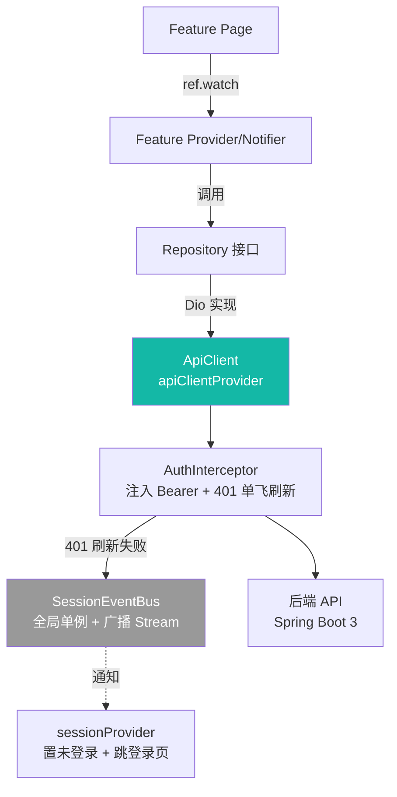

# 网络层与拦截器

> 本档定义 Uten IMP 的网络层架构：基于 Dio 的 `ApiClient` + `AuthInterceptor`（自动注入 Bearer + 401 单飞刷新）+ `SessionEventBus`（会话失效广播）+ 统一 `ApiException`。
>
> 所有业务模块（工资/报销/通知/建议/生产/采购/销售/委外/仓库/钱流/基础资料/访客）均通过此层访问真实 Spring Boot 后端，**已不再有 Mock 仓库**。
>
> 文件名保留 `网络层与Mock.md` 仅为外链稳定；Mock 阶段已于 2026-07 全量下线。

---

## 一、核心目标

| 目标 | 说明 |
|---|---|
| 业务代码与实现解耦 | Repository 接口模式；现仅 Dio 实现，业务层无感知 |
| 统一拦截器 | 鉴权（`AuthInterceptor`：注入 Bearer + 401 静默刷新）、错误转译（`ApiExceptionFactory`） |
| 类型安全 | DTO 用 Dart 类；注意 Jackson 序列化坑（连续大写字段、`int` 当 `String` 解析抛异常，见 memory） |
| 错误统一处理 | 网络错误、业务错误、会话过期走 `ApiException` + UI `AsyncValue.when` |
| 安全 | token 存 `secure_storage`；密码入 body；导出走独立 `:export` 权限（见 [安全策略 §十](安全策略.md)） |

---

## 二、分层架构



**关键点**：
- Provider 只依赖 Repository **接口**，Dio 实现通过 Riverpod Provider 注入。
- `apiClientProvider` 是全局唯一 Dio 实例（含 `BaseOptions` + `AuthInterceptor`）。
- `AuthInterceptor` 与 `sessionProvider` **不直接互引**（避免 Dio ↔ Riverpod 循环依赖），通过 `SessionEventBus`（全局单例 + 广播 `Stream`）解耦。

---

## 三、目录结构

```
lib/core/network/
├─ api_client.dart             ApiClient + apiClientProvider（全局 Dio）
├─ api_endpoints.dart          接口路径常量（authLogin / authRefresh / ...）
├─ api_exception.dart          统一 ApiException + 工厂（按状态码转译）
├─ api_error.dart              后端 ApiError DTO（code / message / fieldErrors）
├─ session_event_bus.dart      会话失效广播总线（鉴权层 → UI 解耦）
├─ visitor_session_event_bus.dart    访客端会话总线（独立子会话）
└─ interceptors/
   ├─ auth_interceptor.dart    注入 token + 401 单飞刷新 + 失效通知
   └─ visitor_auth_interceptor.dart 访客端鉴权拦截器

lib/features/<name>/repositories/
└─ <name>_repository.dart      abstract 接口 + Dio 实现 + Provider（同文件就近维护）
```

> 旧 Mock 实现（`mock_<name>_repository.dart`）已随对应模块接入真实后端而停用；如代码中仍有残留文件，按"待清理死代码"处理，**新代码一律走 Dio 实现**。

---

## 四、Repository 接口与 Dio 实现示例

### 4.1 接口与实现同文件（就近维护）

```dart
// lib/features/auth/repositories/auth_repository.dart

abstract interface class AuthRepository {
  Future<AuthResult> login(String loginAccount, String password);
  Future<AuthResult> refresh(String refreshToken);
  Future<void> logout(String? refreshToken);
  Future<AuthResult> changePassword(String oldPassword, String newPassword);
  Future<UserProfile> me();
}

class DioAuthRepository implements AuthRepository {
  DioAuthRepository(this.api, this.storage);

  final ApiClient api;
  final SecureStorage storage;

  @override
  Future<AuthResult> login(String loginAccount, String password) async {
    final json = await api.post(ApiEndpoints.authLogin, body: {
      'loginAccount': loginAccount,
      'password': password,
    });
    final res = AuthResult.fromJson(json);
    await storage.saveTokens(accessToken: res.accessToken, refreshToken: res.refreshToken);
    await storage.saveLoginAccount(loginAccount);
    return res;
  }
  // ... refresh / logout / changePassword / me 同模式
}
```

### 4.2 Provider 注入（直接 new，无需 main.dart override）

```dart
final authRepositoryProvider = Provider<AuthRepository>(
  (ref) => DioAuthRepository(
    ref.watch(apiClientProvider),
    ref.watch(secureStorageProvider),
  ),
);
```

业务模块 Repository Provider 模式一致：watch `apiClientProvider` → new Dio 实现 → return。
`main.dart` 只 override `sharedPreferencesProvider`（偏好持久化用），**不需要为每个 Repository 手动注入**。

---

## 五、ApiClient 与全局 Dio

```dart
// lib/core/network/api_client.dart

const _baseUrl = String.fromEnvironment(
  'API_BASE_URL',
  defaultValue: 'http://localhost:8080/api',
);

class ApiClient {
  ApiClient(this._dio);
  final Dio _dio;

  Future<Map<String, dynamic>> get(String path, {Map<String, dynamic>? query}) async { ... }
  Future<List<Map<String, dynamic>>> getList(String path, {Map<String, dynamic>? query}) async { ... }
  Future<Map<String, dynamic>> post(String path, {Object? body}) async { ... }
  Future<Map<String, dynamic>> put(String path, {Object? body}) async { ... }
  Future<void> delete(String path) async { ... }

  /// 加密 Excel 导出专用：密码走 body，过滤/排序走 query，bytes 接收。
  /// 错误体（bytes）尝试 UTF-8 解 JSON 取业务消息（如 403/429）。
  Future<Uint8List> downloadBytes(String path,
      {Object? body, Map<String, dynamic>? query}) async { ... }
}

final apiClientProvider = Provider<ApiClient>((ref) {
  final storage = ref.watch(secureStorageProvider);
  final dio = Dio(BaseOptions(
    baseUrl: _baseUrl,
    connectTimeout: const Duration(seconds: 10),
    receiveTimeout: const Duration(seconds: 20),
    headers: {'Content-Type': 'application/json'},
  ));
  dio.interceptors.add(AuthInterceptor(storage: storage, baseUrl: _baseUrl));
  return ApiClient(dio);
});
```

要点：
- **基址**：`--dart-define=API_BASE_URL` 指定；Web 端运行须带 `--web-port=53764` 才能连后端 CORS（见 memory）。
- **空体容错**：后端 void 接口返回 200 + 空串，`_asMap` 把非 Map 一律视为空 Map，避免 `as Map` 抛 TypeError 把"成功"当"失败"。
- **`downloadBytes`**：加密导出专用，`ResponseType.bytes` 接收；详见 [ADR-012](../99-决策记录-ADR/ADR-012-报表加密导出与列排序与行跳源头.md)。

---

## 六、AuthInterceptor 职责

- **`onRequest`**：从 `secure_storage` 读 accessToken，注入 `Authorization: Bearer xxx`。
- **`onError`**：
  - 仅 401 触发刷新；登录/刷新接口本身的 401 直通（否则失败登录会误清令牌）。
  - **单飞刷新**（`Completer` 互斥）：同一时刻多个 401 共享一次 `/auth/refresh`，避免并发刷穿。
  - 刷新成功 → 用新 token 重试原请求（标记 `extra['retried'] = true` 防死循环）。
  - 刷新失败 / 无 refresh token / 二次 401 → 调用 `_expire()`：清 `secure_storage` + `SessionEventBus.instance.expire()` 通知 UI 跳登录。

刷新用独立裸 `Dio`（仅 baseUrl，**无拦截器**），防止拦截器递归。

---

## 七、SessionEventBus（鉴权层 ↔ UI 解耦）

```dart
// lib/core/network/session_event_bus.dart

class SessionEventBus {
  SessionEventBus._();
  static final SessionEventBus instance = SessionEventBus._();

  final _controller = StreamController<void>.broadcast();
  Stream<void> get onSessionExpired => _controller.stream;

  void expire() {
    if (!_controller.isClosed) _controller.add(null);
  }
}
```

`sessionProvider.build()` 监听 `onSessionExpired`，事件到达时把状态置回 `unauthenticated`，路由守卫随后将用户重定向到登录页。
访客子会话有独立的 `VisitorSessionEventBus` + `visitor_session_provider`，互不影响主账号。

---

## 八、错误处理

统一异常类型：

```dart
// lib/core/network/api_exception.dart

class ApiException implements Exception {
  ApiException(this.code, this.message, {this.fieldErrors});
  final String code;                       // 后端错误码：BAD_CREDENTIALS / ACCOUNT_LOCKED / ...
  final String message;
  final List<ApiFieldError>? fieldErrors;
}

class NetworkException extends ApiException {
  NetworkException([String? message])
      : super('NETWORK', message ?? '网络连接失败，请检查后重试');
}

class ApiExceptionFactory {
  static ApiException fromDioStatusCode(int? status, ApiError? body) {
    if (body != null) return ApiException.fromApiError(body);  // 后端给了 ApiError 优先用
    switch (status) {
      case null:    return NetworkException();
      case 401:     return ApiException('UNAUTHORIZED', '会话已过期，请重新登录');
      case 403:     return ApiException('FORBIDDEN', '无权限访问');
      case 404:     return ApiException('NOT_FOUND', '资源不存在');
      case 429:     return ApiException('RATE_LIMITED', '请求过于频繁，请稍后再试');
      case >= 500:  return ApiException('INTERNAL', '服务器繁忙，请稍后再试');
      default:      return ApiException('UNKNOWN', '请求失败（$status）');
    }
  }
}
```

UI 层用 `AsyncValue.when` 处理：

```dart
employees.when(
  loading: () => const UtenSkeleton.list(),
  error: (e, _) {
    final msg = e is ApiException ? e.message : '网络异常';
    return UtenEmpty.error(message: msg, onRetry: () => ref.invalidate(provider));
  },
  data: (list) => EmployeeListView(employees: list),
);
```

> 业务错误码（账号锁定 `ACCOUNT_LOCKED`、登录/导出限流 `RATE_LIMITED` 等）的阈值现可在「系统管理 → 系统设置」页运行时调整，详见 [ADR-013](../99-决策记录-ADR/ADR-013-系统设置与安全策略可视化.md)。

---

## 九、禁忌

- ❌ Provider 不要直接依赖 `Dio`（依赖 Repository 接口或 `apiClientProvider`）
- ❌ 不要在 Widget 里写网络请求（一律走 Repository）
- ❌ 不要硬编码 API URL（在 `api_endpoints.dart` 集中管理）
- ❌ 不要吞掉异常（错误必须传递或记录）
- ❌ 不要新增 Mock 仓库（一律 Dio 实现）；旧的 `mock_*.dart` 是历史包袱，遇则清理
- ❌ 不要在 URL/query 传敏感数据（密码、token、PII 一律 body）
- ❌ 不要在拦截器里直接 `ref.read` Riverpod（用 `SessionEventBus` 解耦）

---

## 十、相关

- [状态管理.md](状态管理.md)
- [安全策略.md §十](安全策略.md)（导出/高危配置安全规范）
- [全局机制.md](全局机制.md)（会话失效与登录跳转的协作）
- [../00-项目准则/10-安全准则.md](../00-项目准则/10-安全准则.md)
- [ADR-012 报表加密导出](../99-决策记录-ADR/ADR-012-报表加密导出与列排序与行跳源头.md)
- [ADR-013 系统设置](../99-决策记录-ADR/ADR-013-系统设置与安全策略可视化.md)

---

**最后更新**：2026-07-27（去 Mock 阶段；对齐真实 `ApiClient` + `AuthInterceptor` + `SessionEventBus`）
