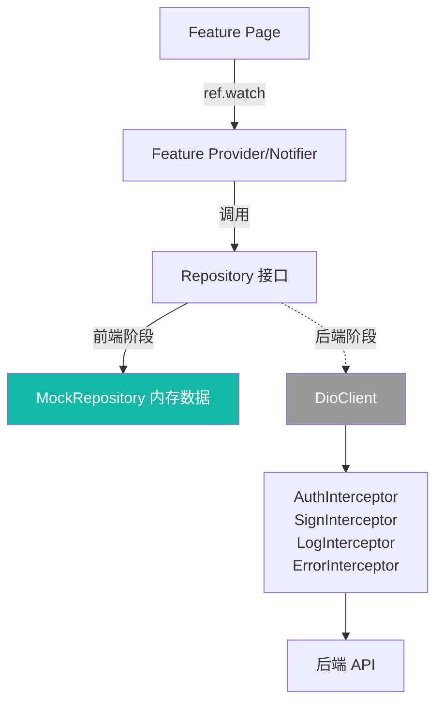

# 网络层与 Mock

> 本档定义 Uten IMP 的网络层架构。
> **dio + Repository 接口已实现**：HR/鉴权走真实后端（`DioAuthRepository`/`DioEmployeeRepository`/`DioDepartmentRepository`），其余模块仍为 Mock 仓库。

---

## 一、核心目标

| 目标 | 说明 |
|---|---|
| 业务代码与实现解耦 | Repository 接口模式；HR/鉴权用 Dio 实现，其余 Mock，切换零业务改动 |
| 统一拦截器 | 鉴权、日志、错误、签名（后端接入后启用） |
| 类型安全 | DTO 用 Dart 类，不用 Map |
| 错误统一处理 | 网络错误、业务错误、鉴权过期走统一流程 |

---

## 二、分层架构



**关键点**：Provider 只依赖 Repository **接口**，不依赖具体实现。前端阶段注入 Mock，后端阶段注入 Dio。

---

## 三、目录结构

```
lib/
├─ core/
│  ├─ network/
│  │  ├─ api_client.dart             dio 实例（后端阶段启用）
│  │  ├─ api_endpoints.dart          接口路径常量
│  │  ├─ api_exception.dart          统一异常类型
│  │  ├─ api_result.dart             统一返回包装（可选）
│  │  └─ interceptors/
│  │     ├─ auth_interceptor.dart    加 token
│  │     ├─ sign_interceptor.dart    签名（后端阶段）
│  │     ├─ log_interceptor.dart     日志
│  │     └─ error_interceptor.dart   统一错误转译
│  └─ ...
└─ features/<name>/
   └─ repositories/
      ├─ <name>_repository.dart        abstract 接口
      ├─ mock_<name>_repository.dart   前端阶段用
      └─ dio_<name>_repository.dart    后端阶段用（先不实现）
```

---

## 四、Repository 接口与实现示例

### 4.1 接口（前端阶段就定下来）

```dart
// lib/features/employee/repositories/employee_repository.dart

abstract interface class EmployeeRepository {
  Future<List<Employee>> list({int page = 1, int size = 20});
  Future<Employee> getById(String id);
  Future<Employee> create(EmployeeCreateInput input);
  Future<Employee> update(String id, EmployeeUpdateInput input);
  Future<void> delete(String id);
  Future<List<Employee>> search(String keyword);
}
```

### 4.2 Mock 实现（前端阶段使用）

```dart
// lib/features/employee/repositories/mock_employee_repository.dart

class MockEmployeeRepository implements EmployeeRepository {
  final List<Employee> _data = _seedEmployees();

  @override
  Future<List<Employee>> list({int page = 1, int size = 20}) async {
    await Future.delayed(const Duration(milliseconds: 500)); // 模拟网络延迟
    final start = (page - 1) * size;
    return _data.skip(start).take(size).toList();
  }

  @override
  Future<Employee> getById(String id) async {
    await Future.delayed(const Duration(milliseconds: 300));
    return _data.firstWhere((e) => e.id == id);
  }

  // ... 其他方法
}

List<Employee> _seedEmployees() {
  // 生成假数据，不含真实员工信息
  return List.generate(25, (i) => Employee(
    id: 'emp_${i.toString().padLeft(3, '0')}',
    code: 'E${1000 + i}',
    fullName: _mockNames[i % _mockNames.length],
    // ...
  ));
}
```

### 4.3 注入（main.dart）

```dart
ProviderScope(
  overrides: [
    employeeRepositoryProvider.overrideWithValue(MockEmployeeRepository()),
    // 后端阶段：
    // employeeRepositoryProvider.overrideWithValue(DioEmployeeRepository(dio)),
  ],
  child: const UtenApp(),
);
```

```dart
// lib/features/employee/repositories/employee_repository_provider.dart
final employeeRepositoryProvider = Provider<EmployeeRepository>((ref) {
  throw UnimplementedError('必须在 main.dart override');
});
```

---

## 五、Dio 配置（后端阶段，先写好不用）

```dart
// lib/core/network/api_client.dart

class ApiClient {
  ApiClient._(this._dio);
  final Dio _dio;

  static ApiClient create({required String baseUrl, required String token}) {
    final dio = Dio(BaseOptions(
      baseUrl: baseUrl,
      connectTimeout: const Duration(seconds: 10),
      receiveTimeout: const Duration(seconds: 30),
      headers: {'Content-Type': 'application/json'},
    ));

    dio.interceptors.addAll([
      AuthInterceptor(token: token),
      SignInterceptor(),
      LogInterceptor(),
      ErrorInterceptor(),
    ]);

    return ApiClient._(dio);
  }

  Future<T> get<T>(String path, {Map<String, dynamic>? params, ...}) { ... }
  Future<T> post<T>(String path, {dynamic data, ...}) { ... }
}
```

---

## 六、拦截器职责

| 拦截器 | 前端阶段 | 后端阶段 |
|---|---|---|
| AuthInterceptor | 空实现 | 加 `Authorization: Bearer xxx` |
| SignInterceptor | 空实现 | 加请求签名（防篡改） |
| LogInterceptor | 简单 print | 结构化日志 + 上报 |
| ErrorInterceptor | 空实现 | 统一处理 401（刷新 token）/ 403（无权限）/ 5xx |

---

## 七、Mock 数据规范

| 规则 | 说明 |
|---|---|
| 不含真实数据 | 用假名、假工号、假金额 |
| 数量合理 | 列表 20-50 条，够测分页和滚动 |
| 模拟延迟 | 300-800ms，让骨架屏有出场机会 |
| 模拟错误 | 提供"触发失败"开关，测错误处理 |
| 可重置 | 提供清空 + 重新 seed 的方法 |
| 可选持久化 | 用 hive 把 mock 数据存本地，刷新不丢 |

---

## 八、错误处理

统一异常类型：

```dart
// lib/core/network/api_exception.dart

sealed class ApiException implements Exception {
  final String message;
  final String? userMessage; // 给用户看的文案
  ApiException(this.message, {this.userMessage});
}

class NetworkException extends ApiException { ... }      // 无网络/超时
class UnauthorizedException extends ApiException { ... }  // 401
class ForbiddenException extends ApiException { ... }     // 403
class NotFoundException extends ApiException { ... }      // 404
class ServerException extends ApiException { ... }        // 5xx
class BusinessException extends ApiException {            // 业务错误（如余额不足）
  final String code;
  BusinessException(this.code, super.message, {super.userMessage});
}
```

UI 层用 `AsyncValue.when` 处理：

```dart
employees.when(
  loading: () => const UtenSkeleton.list(),
  error: (e, _) {
    final msg = e is ApiException ? (e.userMessage ?? '请求失败') : '网络异常';
    return UtenEmpty.error(message: msg, onRetry: () => ref.invalidate(provider));
  },
  data: (list) => EmployeeListView(employees: list),
);
```

---

## 九、禁忌

- ❌ Provider 不要直接依赖 Dio（依赖 Repository 接口）
- ❌ Mock 数据不要带真实员工/财务信息
- ❌ 不要在 Widget 里写网络请求（一律走 Repository）
- ❌ 不要硬编码 API URL（在 `api_endpoints.dart` 集中管理）
- ❌ 不要吞掉异常（错误必须传递或记录）

---

## 十、相关

- [状态管理.md](状态管理.md)
- [安全策略.md](安全策略.md)
- [../00-项目准则/10-安全准则.md](../00-项目准则/10-安全准则.md)

---

**最后更新**：2026-07-21
