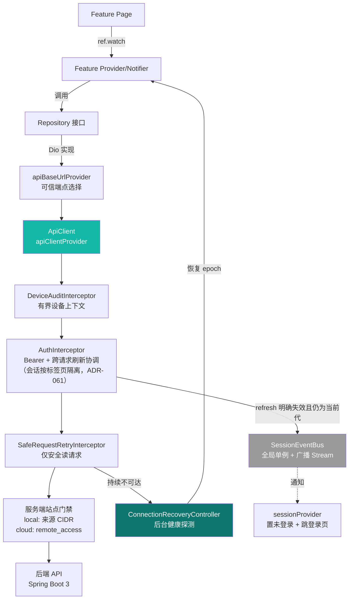

# 网络层与拦截器

> 本档定义 Uten IMP 的网络层架构：可信本地/云端选择、基于 Dio 的 `ApiClient`、安全读请求自动重试与后台健康探测、跨请求协调的 `AuthInterceptor`（会话记录按标签页隔离，ADR-061）、`SessionEventBus`（会话失效广播）和统一 `ApiException`。
>
> 真实后端模块通过此层访问 Spring Boot API。工资条与员工报销 Provider 已从活动 Mock 切换为
> Dio Repository，员工域旧 `MockEmployeeRepository`、旧模型和旧 Provider 也已删除。客户端不再
> 伪造这些数据；是否可生产使用仍取决于对应后端 API、Flyway、权限、审计和 E2E 验收。
>

---

## 一、核心目标

| 目标 | 说明 |
|---|---|
| 业务代码与实现解耦 | Repository 接口模式；现仅 Dio 实现，业务层无感知 |
| 统一拦截器 | 鉴权（`AuthInterceptor`：注入 Bearer + 401 协调刷新）、安全读重试、设备审计、错误转译 |
| 类型安全 | DTO 用 Dart 类；注意 Jackson 序列化坑（连续大写字段、`int` 当 `String` 解析抛异常，见 memory） |
| 错误统一处理 | 网络错误、业务错误、会话过期走 `ApiException` + UI `AsyncValue.when` |
| 自动恢复 | 瞬态故障仅对 GET/HEAD/OPTIONS 退避两次；持续不可达后严格探测健康端点，恢复后重建正在观察的读 Provider；该连接恢复机制不重放业务写请求 |
| 本地优先 | 原生自动模式只在两个构建期可信端点间选择：公司本地健康时用本地，否则才用云端；Web Release 固定同源 `/api` |
| 安全 | token 记录存标签页级存储（Web：sessionStorage；原生：`secure_storage`；ADR-061）；密码入 body；客户端选云端不等于获得 `remote_access`；导出走独立 `:export` 权限（见 [安全策略 §十](安全策略.md)） |

---

## 二、分层架构



**关键点**：
- Provider 只依赖 Repository **接口**，Dio 实现通过 Riverpod Provider 注入。
- `apiClientProvider` 是全局唯一 Dio 实例（含 `BaseOptions` + `AuthInterceptor`）。
- `AuthInterceptor` 与 `sessionProvider` **不直接互引**（避免 Dio ↔ Riverpod 循环依赖），通过 `SessionEventBus`（全局单例 + 广播 `Stream`）解耦。

---

## 三、目录结构

```
lib/core/network/
├─ api_base_url.dart          构建期本地端点；Web Release 强制同源 /api
├─ server_selection.dart      原生自动/仅本地/仅云端与本地健康探针
├─ server_config.dart         apiBaseUrlProvider（当前生效可信端点）
├─ api_client.dart             ApiClient + apiClientProvider（全局 Dio）
├─ api_endpoints.dart          接口路径常量（authLogin / authRefresh / ...）
├─ api_exception.dart          统一 ApiException + 工厂（按状态码转译）
├─ api_error.dart              后端 ApiError DTO（code / message / fieldErrors）
├─ connection_recovery.dart     全局连接状态、后台健康探测与恢复 epoch
├─ session_event_bus.dart      会话失效广播总线（鉴权层 → UI 解耦）
├─ visitor_session_event_bus.dart    访客端会话总线（独立子会话）
└─ interceptors/
   ├─ auth_interceptor.dart    迟到 401 复用新 access；标签页内协调刷新
   ├─ device_audit_interceptor.dart  有界操作 ID 与设备声明
   ├─ safe_request_retry_interceptor.dart  仅安全读请求有限重试
   └─ visitor_auth_interceptor.dart 访客端鉴权拦截器

lib/features/<name>/repositories/
└─ <name>_repository.dart      abstract 接口 + Dio 实现 + Provider（同文件就近维护）
```

> 已接后端模块不得保留无引用 Mock 或“双 Provider”后门。员工、工资与员工报销的旧 Mock 均已
> 从当前工作树移除；Repository 切到 Dio 后，后端不可用必须明确报错，禁止静默回退到假数据。

---

## 四、Repository 接口与 Dio 实现示例

### 4.1 接口与实现同文件（就近维护）

```dart
// lib/features/auth/repositories/auth_repository.dart

abstract interface class AuthRepository {
  Future<AuthResult> login(String loginAccount, String password);
  Future<AuthResult> refresh(String refreshToken);
  Future<void> logout(String? refreshToken);
  Future<AuthResult> changePassword(String oldPassword, String newPassword);
  Future<UserProfile> me();
}

class DioAuthRepository implements AuthRepository {
  DioAuthRepository(this.api);

  final ApiClient api;

  @override
  Future<AuthResult> login(String loginAccount, String password) async {
    final json = await api.post(ApiEndpoints.authLogin, body: {
      'loginAccount': loginAccount,
      'password': password,
    });
    return AuthResult.fromJson(json);
  }
  // ... refresh / logout / changePassword / me 同模式
}
// Repository 只做网络交换；网络请求可并发，SessionNotifier 只串行提交最新意图。
```

### 4.2 Provider 注入（直接 new，无需 main.dart override）

```dart
final authRepositoryProvider = Provider<AuthRepository>(
  (ref) => DioAuthRepository(ref.watch(apiClientProvider)),
);
```

业务模块 Repository Provider 模式一致：watch `apiClientProvider` → new Dio 实现 → return。
`main.dart` 只 override `sharedPreferencesProvider`（偏好持久化用），**不需要为每个 Repository 手动注入**。

---

## 五、ApiClient 与全局 Dio

```dart
// lib/core/network/api_client.dart

import 'server_config.dart';

class ApiClient {
  ApiClient(this._dio);
  final Dio _dio;

  Future<Map<String, dynamic>> get(String path, {Map<String, dynamic>? query}) async { ... }
  Future<List<Map<String, dynamic>>> getList(String path, {Map<String, dynamic>? query}) async { ... }
  Future<Map<String, dynamic>> post(String path, {Object? body}) async { ... }
  Future<Map<String, dynamic>> put(String path, {Object? body}) async { ... }
  Future<void> delete(String path) async { ... }

  /// 加密 Excel 导出专用：密码走 body，过滤/排序走 query，bytes 接收。
  /// 错误体（bytes）尝试 UTF-8 解 JSON 取业务消息（如 403/429）。
  Future<Uint8List> downloadBytes(String path,
      {Object? body, Map<String, dynamic>? query}) async { ... }
}

final apiClientProvider = Provider<ApiClient>((ref) {
  ref.watch(connectionRecoveryProvider.select((s) => s.recoveryEpoch));
  final recovery = ref.read(connectionRecoveryProvider.notifier);
  final baseUrl = ref.watch(apiBaseUrlProvider);
  final dio = Dio(buildApiBaseOptions(baseUrl)); // 15s / 30s / 45s
  dio.interceptors.add(DeviceAuditInterceptor(...));
  dio.interceptors.add(AuthInterceptor(storage: ..., baseUrl: baseUrl));
  dio.interceptors.add(SafeRequestRetryInterceptor(dio, recovery: recovery));
  return ApiClient(dio);
});
```

要点：
- **统一基址**：员工端 `ApiClient` 和访客端 `VisitorApiClient` 都 watch
  `server_config.dart` 的 `apiBaseUrlProvider`，不各自维护默认值；模式或本地可达性变化会重建 Dio。
- **环境矩阵**：

  | 场景 | `API_BASE_URL`（本地/公司入口） | `CLOUD_API_BASE_URL`（云入口） | 选择规则 |
  |---|---|---|---|
  | Debug/Profile 原生 | 空值回退 `http://localhost:8080/api`；可显式 HTTP(S) | 可用 Debug 设置覆盖 | 允许开发排障；不得把缓存结果当 Release 配置 |
  | Web Release | 强制同源 `/api`，绝对 URL 直接 fail-fast | 完全忽略 | 当前访问域名/DNS 决定本地或云端；不运行伪局域网探针 |
  | 移动/桌面 Release | 必须为非回环绝对 HTTPS | 应固定为非回环绝对 HTTPS；缺失时只能回退本地，因此发布门禁必须检查产物 | auto 模式立即/每 60 秒探测本地；可达优先本地，否则使用固定云端 |

  所有绝对地址都拒绝 userinfo、query 和 fragment；末尾 `/` 会被去除。两个地址都是会编译进客户端的
  公开部署配置，不是密钥。Release 永不读取 `SharedPreferences` 中旧版本遗留的任意 host，避免把密码或
  Bearer token 发送到攻击者服务器。设置页的 local/cloud 强制模式只用于两个受控端点间排障，不能录入生产 host。
- **本地 Web**：调试必须显式固定 `--web-port=53764` 并与 CORS 一致。员工生产入口不得使用 `flutter run` 或随机 localhost 端口；Web Release 静态文件和 `/api` 必须同源并由受监督服务提供。
- **空体容错**：后端 void 接口返回 200 + 空串，`_asMap` 把非 Map 一律视为空 Map，避免 `as Map` 抛 TypeError 把"成功"当"失败"。
- **`downloadBytes`**：加密导出专用，`ResponseType.bytes` 接收；详见 [ADR-012](../99-决策记录-ADR/ADR-012-报表加密导出与列排序与行跳源头.md)。

### 5.1 可信本地/云端选择

| 平台/模式 | 当前行为 | 安全边界 |
|---|---|---|
| 原生 `auto`（默认） | 首帧后立即探测本地 health，此后每 60 秒复测；本地可达用 `API_BASE_URL`，否则用已配置的 `CLOUD_API_BASE_URL` | 两者均为 Release 构建期固定 HTTPS；云端未配置时安全回落本地，不连接其它主机 |
| 原生 `local` / `cloud` | 强制可信本地或可信云端，供排障 | `cloud` 未配置时不能启用；切换只改端点，不授予远程权限 |
| Web Release | 始终当前页面同源 `/api` | 不读取 cloud 模式、不探测局域网；由内外网入口/split-horizon DNS 选择站点 |
| Debug | 可使用合法 HTTP(S) 开发端点并临时覆盖云端 | 只为开发；Release 忽略并清理任意 host 偏好 |

即使员工已获远程权限，只要公司本地 health 可达，原生 auto 仍优先本地。员工进入 cloud 后，后端在
密码与账号状态校验后的 login、refresh 轮换前、以及 `JwtAuthFilter` 后的每个已认证请求检查
`users.remote_access`；客户端服务器对话框不是授权控制面。visitor 是独立公网主体，不使用该员工
字段，但仍受访客状态/权限控制；local 的源 CIDR 门禁覆盖 visitor 在内的全部 `/api/**`。

原生 auto 从一个站点切到另一个站点后是否能沿用现有 access/refresh，取决于两端是否按部署契约使用
相同的 JWT issuer/签名密钥并读取同一权威账号/令牌状态；否则必须重新登录。该部署一致性必须在目标
环境做跨端 token 正反向验收，不能仅凭客户端自动切换测试推断成立。

当前模式选择器只在已登录设置页。原生用户若在退出前保存“仅本地”后离开公司，或保存“仅云端”后
被撤销远程权限，未登录页无法改回 auto，可能只能清应用数据恢复默认。生产前须补一个只允许两个
构建期可信端点的登录前恢复入口；不得用开放任意 host 输入来修补此自锁缺口。

---

## 六、AuthInterceptor 与自动连接

### 6.1 会话刷新

- 员工 access、refresh、`generation`、`intentGeneration`、`sessionLineage` 作为一个
  `auth.token_record.v1` 权威 JSON 记录写入（当前记录 schema 为 version 2），**记录按标签页隔离**
  （Web：sessionStorage，各标签页独立会话；原生：进程级安全存储；ADR-061）。`generation` 随每次权威写
  递增；`intentGeneration` 只在登录、改密、退出或凭据被明确拒绝等用户/安全意图变化时递增；
  refresh 保持 `intentGeneration/sessionLineage`，登录、退出、改密切换 lineage。
- 旧 `auth.access_token`/`auth.refresh_token` 双键只在权威记录不存在时迁移：必须先成功写入单记录，再
  best-effort 删除旧键。若权威记录键存在但内容损坏，必须 fail closed 写无令牌 tombstone，绝不从
  残留旧键复活会话。
- refresh 写回和明确拒绝清理都是完整快照 CAS：同时比较两个 token、三个代次字段；CAS 失败说明本
  标签页内另一请求已经推进权威记录，旧响应不得覆盖或删除新会话。登录/改密先预留全局 intent，提交时比较
  `intentGeneration + reservedLineage`，因此是 latest-intent-wins，而不是“最后返回的 HTTP 响应获胜”。
- `DioAuthRepository` 只做网络交换；生产 `authRepositoryProvider` 再用
  `DurableLogoutAuthRepository` 包装 logout 的加密交接。`SessionNotifier` 的短提交队列不包住网络等待，并用本地 mutation epoch
  再挡一次迟到提交。登录先 tombstone 旧会话；退出先立即切未登录可见状态并激活独立 logout fence，
  然后在 token record 锁内读取最新记录，通过 `beforeClear` 先把其中的 refresh 持久交接到加密撤销队列；
  交接成功后才写 logout tombstone（写失败时可在已安全交接的前提下强制删本地键）。交接失败会按
  0/30/120ms 重试，期间 fence 与原 token record 均保留，禁止先删除设备上的唯一 refresh 副本；只有交接与
  本地清理成功才撤 fence，显式新登录可用新 intent 安全取代它。
- 同进程多个 Dio 实例按 scope 共用刷新队列；Web 优先用 Web Locks，不支持时退化为只含随机 owner 和
  到期时间的 90 秒可续租 localStorage lease。锁/租约只承载互斥元数据、不保存 token；跨标签页
  BroadcastChannel 会话通知已随 ADR-061 移除（会话不跨标签页共享，锁退化为全局互斥量，无害）。迟到旧 401
  若发现同一 intent/lineage 的 access 已更新，直接用新 access 重放，不再次旋转 refresh；若 lineage 或
  intent 已变，则以本地 `409 SESSION_CHANGED` 丢弃旧响应，不能把旧账号结果交给新账号。
- **破坏性刷新拒绝必须精确匹配状态和结构化 code**：`401 + UNAUTHORIZED/ACCOUNT_LOCKED/
  ACCOUNT_DISABLED`、`422 + VALIDATION_FAILED`、员工另含 `403 + REMOTE_ACCESS_DENIED`，访客另含
  `403 + VISITOR_BLOCKED`。只有该响应提交的
  快照仍是当前代才写 tombstone 并发布失效事件。本地确实没有 refresh 也按当前代失效。
- HTML 401、空体 401、未知 code 401、status/code 错配、任意 503、429、网络/超时和畸形 2xx 都是
  `unavailable`：保留本地 token 并传播原错误。刷新成功后的业务重放失败也不销毁新会话。
- 退出捕获的 refresh 必须在上述 token record 锁内、写 tombstone 之前进入 `flutter_secure_storage` 中有界
  加密撤销队列（最多 32 项、30 天），再异步调用公开且幂等的 `/auth/logout`；启动、联网恢复和
  5s/30s/2m/10m/30m 有界退避会唤醒 drain，
  仅成功响应后删除该精确 token。此队列只允许撤销 refresh，绝不是通用业务离线写队列。
- 刷新使用独立、有限超时的 Dio，防止鉴权拦截器递归。连接恢复的自动重试不重放 POST/PUT/PATCH/
  DELETE 等业务写请求；撤销队列是上述单一幂等安全端点的明确例外。

### 6.2 自动连接

- `SafeRequestRetryInterceptor` 仅对 GET/HEAD/OPTIONS 做至多两次自动重试，延迟固定为 400ms、1200ms。
  触发范围是连接/发送/接收超时、连接错误、408/502/504、非结构化 503，以及后端结构化
  `503 + SERVICE_UNAVAILABLE`。POST/PUT/PATCH/DELETE 不走该重试器。
- `503 + SERVICE_UNAVAILABLE` 表示 HTTP 服务可达但账号/权限状态解析暂不可用：安全读仍可短重试，
  但不得把它当成主机离线、不得清会话，也不得启动全局断线探测。其它瞬态失败耗尽后才进入 disconnected。
- `ConnectionRecoveryController` 以 2/5/10/15 秒封顶循环探测同源根路径 `/actuator/health`（不拼到
  `/api`），每次生产延迟在本档位 85%–100% 内随机抖动以打散 NAT 后的客户端；“立即重试”跳过延迟和
  jitter，重叠探测合并为一次。Nginx 必须用精确 location 代理该路径并阻止其它 Actuator 路径落入 SPA。
  **只有 HTTP 200 且 JSON Map 的 `status == 'UP'` 才确认恢复**；HTML、空体、空对象、DOWN 或非 200
  都失败，不能让 SPA fallback 冒充健康。任一真实 API 响应则证明 HTTP 可达。
- 恢复只递增一次 `recoveryEpoch`，使正在观察的 Repository/FutureProvider 自动重载；状态型页面需显式监听该 epoch，保留表单与导航状态。
- 全局提示只区分“正在自动连接 / 暂时不可达 / 已恢复”，提供一个 48dp“立即重试”按钮；网络故障不得显示成“无权限”。
- 浏览器整页对应的静态站点进程已经停止时，页面内代码无法自救。生产必须由 Nginx 提供 Release 静态文件，由 systemd/编排器监督后端，禁止把两个调试终端当生产服务。

### 6.2.1 本地/云端断链的特殊边界

- 正常时本地与云端 App 都提交到公司本地主库；云端 PostgreSQL 是异步热备，不是独立写库。
- 公司到云端链路断开时，公司入口继续工作；云端员工请求因最新账号/授权状态无法从主库确认而返回 503。
- 客户端不得把该 503 当成提交成功，不得保存通用业务 payload 或恢复后静默重放。恢复只重新读取权威状态；
  创建、审批、库存、付款、过账等写操作由用户核对后决定是否重新发起。
- `PendingRefreshRevocationStore` 仍只允许幂等 logout 的 refresh 撤销，不得扩展成通用离线业务队列。
- 完整拓扑、远程授权和 RPO/RTO 见 [ADR-031](../99-决策记录-ADR/ADR-031-本地云端单主库部署架构.md)；
  当前验收状态见[新库上线与首装操作指引](../99-项目治理/2026-09-01-新库上线与首装操作指引.md)。

### 6.3 请求头预算

- Spring/Tomcat 对请求行加全部请求头设置 16 KiB 有限预算；Nginx 模板为常规字段 4 KiB、异常字段
  `2 × 8 KiB`（单字段仍须落入 8 KiB）。两层都必须做目标环境测量，不能宣称配置数值天然完全等价，
  也不得无限放大。嵌入式 Tomcat 合同测试证明约 12 KiB envelope 可进、18 KiB 被 400/431 拒绝。
- staff access JWT 只含标准签发字段与 `sub/typ/av/ae`；不含账号、员工、角色、权限或
  `mustChangePassword`。`JwtAuthFilter` 每请求先查服务端账号状态和版本，再用 30 秒/最多 2048 项的
  版本键 LRU 解析权限。账号/权限投影或解析器故障返回结构化 `503 + SERVICE_UNAVAILABLE`，不是 401，
  客户端必须保留会话；明确无效账号、版本不匹配才返回结构化 401。
- `X-Uten-Audit-Context` 编码最多 1536 字符。完整 token、正文、查询值不得复制进审计头。

---

## 七、SessionEventBus（鉴权层 ↔ UI 解耦）

```dart
// lib/core/network/session_event_bus.dart

class SessionEventBus {
  SessionEventBus._();
  static final SessionEventBus instance = SessionEventBus._();

  final _controller = StreamController<void>.broadcast();
  Stream<void> get onSessionExpired => _controller.stream;
  final _profileController = StreamController<Map<String, dynamic>>.broadcast();
  Stream<Map<String, dynamic>> get onProfileRefreshed =>
      _profileController.stream;

  void expire() {
    if (!_controller.isClosed) _controller.add(null);
  }

  void publishProfile(Map<String, dynamic> userJson) {
    if (!_profileController.isClosed) _profileController.add(userJson);
  }
}
```

`sessionProvider.build()` 监听 expiration/profile，并另监听 `SecureStorage.onExternalAuthTokenChanged`。
expiration 异步到达后还会复核本地 mutation epoch 与原子记录：只有 token 仍为空且期间无新意图才置回
`unauthenticated`；profile 必须匹配 generation/intent/lineage 才更新。外部标签页通知只作 wakeup，
消费方重新读取权威记录。启动 `/auth/me` 的成功结果也复核完整 identity；若请求期间 refresh 推进
同一 lineage，则用最新代次再恢复。网络恢复信号撞上在途恢复时登记 pending，结束后补跑。
访客子会话有独立的 `VisitorSessionEventBus` + `visitor_session_provider`，互不影响主账号。

---

## 八、错误处理

统一异常类型：

```dart
// lib/core/network/api_exception.dart

class ApiException implements Exception {
  ApiException(this.code, this.message, {this.fieldErrors});
  final String code;                       // 后端错误码：BAD_CREDENTIALS / ACCOUNT_LOCKED / ...
  final String message;
  final List<ApiFieldError>? fieldErrors;
}

class NetworkException extends ApiException {
  NetworkException([String? message])
      : super('NETWORK', message ?? '网络连接失败，请检查后重试');
}

class ApiExceptionFactory {
  static ApiException fromDioStatusCode(int? status, ApiError? body) {
    if (body != null) return ApiException.fromApiError(body);  // 后端给了 ApiError 优先用
    switch (status) {
      case null:    return NetworkException();
      case 401:     return ApiException('UNAUTHORIZED', '会话已过期，请重新登录');
      case 403:     return ApiException('FORBIDDEN', '无权限访问');
      case 404:     return ApiException('NOT_FOUND', '资源不存在');
      case 429:     return ApiException('RATE_LIMITED', '请求过于频繁，请稍后再试');
      case >= 500:  return ApiException('INTERNAL', '服务器繁忙，请稍后再试');
      default:      return ApiException('UNKNOWN', '请求失败（$status）');
    }
  }
}
```

UI 层用 `AsyncValue.when` 处理：

```dart
employees.when(
  loading: () => const UtenSkeleton.list(),
  error: (e, _) {
    final msg = e is ApiException ? e.message : '网络异常';
    return UtenEmpty.error(message: msg, onRetry: () => ref.invalidate(provider));
  },
  data: (list) => EmployeeListView(employees: list),
);
```

> 业务错误码（账号锁定 `ACCOUNT_LOCKED`、登录/导出限流 `RATE_LIMITED` 等）的阈值现可在「系统管理 → 系统设置」页运行时调整，详见 [ADR-013](../99-决策记录-ADR/ADR-013-系统设置与安全策略可视化.md)。

---

## 九、禁忌

- ❌ Provider 不要直接依赖 `Dio`（依赖 Repository 接口或 `apiClientProvider`）
- ❌ 不要在 Widget 里写网络请求（一律走 Repository）
- ❌ 不要硬编码 API URL（基址只走 `api_base_url.dart`；相对端点在 `api_endpoints.dart` 集中管理）
- ❌ 不要让 Release 从 SharedPreferences、输入框或远端响应接受任意 API host；只能使用构建期可信
  本地/云端端点，Web 只能同源 `/api`
- ❌ 不要把“选择云端”当成远程授权，也不要把云端断链 503 描述成已离线写入或会自动合并
- ❌ 不要吞掉异常（错误必须传递或记录）
- ❌ 不要把 Mock 页面描述成生产功能；新业务默认实现真实 Repository，确需原型时必须在 UI、文档与发布清单明确标注
- ❌ 不要在 URL/query 传敏感数据（密码、token、PII 一律 body）
- ❌ 不要在拦截器里直接 `ref.read` Riverpod（用 `SessionEventBus` 解耦）

---

## 十、相关

- [状态管理.md](状态管理.md)
- [安全策略.md §十](安全策略.md)（导出/高危配置安全规范）
- [全局机制.md](全局机制.md)（会话失效与登录跳转的协作）
- [../00-项目准则/10-安全准则.md](../00-项目准则/10-安全准则.md)
- [ADR-012 报表加密导出](../99-决策记录-ADR/ADR-012-报表加密导出与列排序与行跳源头.md)
- [ADR-013 系统设置](../99-决策记录-ADR/ADR-013-系统设置与安全策略可视化.md)

---

**最后更新**：2026-08-09（Release 双受控端点、公司内优先本地、Web 同源、local/cloud 门禁、
`REMOTE_ACCESS_DENIED` 会话失效与云端断链 503/不重放边界）。隔离克隆真实 HTTP 已验证员工授权
矩阵；公司 CIDR/可信代理、Release 构建端点、Web 内外网入口、阿里云链路恢复和 PostgreSQL 复制
仍待目标环境验收，生产结论为 **NO-GO**。
