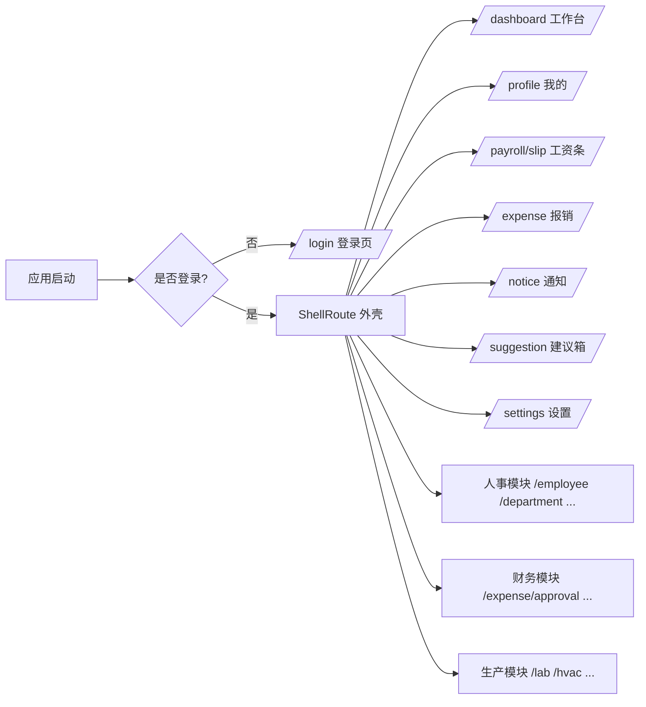

# 路由设计

> 本档定义 Uten IMP 的路由架构，使用 go_router。
> 路径命名规则见 [../00-项目准则/01-命名规范.md](../00-项目准则/01-命名规范.md)。

---

## 一、技术选型

**go_router**（Flutter 官方 package）。

理由：
- 声明式路由，配置集中
- 支持 Web 深链和浏览器地址栏
- 内置 `redirect` 钩子（路由守卫）
- 支持 ShellRoute（导航壳 + 子页面）
- 嵌套导航（侧边 NavRail 切换子页面）

---

## 二、路由整体结构



---

## 三、路由表（Phase 0 + 1）

| 路径 | 页面 | 说明 | 是否受保护 |
|---|---|---|---|
| `/login` | LoginPage | 登录页 | ❌ |
| `/` | 重定向到 `/dashboard` | — | ✅ |
| `/dashboard` | DashboardPage | 工作台 | ✅ |
| `/profile` | ProfilePage | 我的 | ✅ |
| `/payroll/slip` | PayrollSlipListPage | 工资条列表 | ✅ |
| `/payroll/slip/:id` | PayrollSlipDetailPage | 工资条详情 | ✅ |
| `/expense` | ExpenseListPage | 报销列表 | ✅ |
| `/expense/new` | ExpenseNewPage | 新建报销 | ✅ |
| `/expense/:id` | ExpenseDetailPage | 报销详情 | ✅ |
| `/notice` | NoticeListPage | 通知列表 | ✅ |
| `/notice/:id` | NoticeDetailPage | 通知详情 | ✅ |
| `/suggestion` | SuggestionPage | 建议箱 | ✅ |
| `/settings` | SettingsPage | 设置 | ✅ |

Phase 2+ 的路由（员工档案/部门/审批/生产/库存等）在对应页面文档登记时加入本表。

---

## 四、路由名称常量

避免在代码里硬编码字符串路径，统一管理：

```dart
// lib/core/router/route_names.dart

abstract class RouteName {
  static const String login = '/login';
  static const String dashboard = '/dashboard';
  static const String profile = '/profile';
  static const String payrollSlip = '/payroll/slip';
  static const String payrollSlipDetail = '/payroll/slip/:id';
  static const String expense = '/expense';
  static const String expenseNew = '/expense/new';
  static const String expenseDetail = '/expense/:id';
  static const String notice = '/notice';
  static const String noticeDetail = '/notice/:id';
  static const String suggestion = '/suggestion';
  static const String settings = '/settings';
}

abstract class RoutePath {
  /// 拼接带参数的路径，如 payrollSlipDetailPath('123') => '/payroll/slip/123'
  static String payrollSlipDetail(String id) => '/payroll/slip/$id';
  static String expenseDetail(String id) => '/expense/$id';
  static String noticeDetail(String id) => '/notice/$id';
}
```

---

## 五、路由守卫（登录校验）

```dart
// lib/core/router/app_router.dart

GoRouter buildAppRouter(Ref ref) {
  return GoRouter(
    refreshListenable: ref.read(authStateProvider.notifier),
    redirect: (context, state) {
      final isLoggedIn = ref.read(authStateProvider).isLoggedIn;
      final isOnLogin = state.matchedLocation == RouteName.login;

      if (!isLoggedIn && !isOnLogin) {
        // 未登录访问受保护页 → 跳登录页（带原地址 returnTo）
        return '${RouteName.login}?returnTo=${state.matchedLocation}';
      }
      if (isLoggedIn && isOnLogin) {
        // 已登录访问登录页 → 跳工作台
        return RouteName.dashboard;
      }
      return null; // 不重定向
    },
    routes: [
      GoRoute(path: RouteName.login, builder: (c, s) => const LoginPage()),
      ShellRoute(
        builder: (context, state, child) => MainShellPage(child: child),
        routes: [
          GoRoute(path: '/', redirect: (_, __) => RouteName.dashboard),
          GoRoute(path: RouteName.dashboard, builder: (c, s) => const DashboardPage()),
          // ... 其他 ShellRoute 内的页面
        ],
      ),
    ],
  );
}
```

---

## 六、权限路由（Phase 2+）

某些路由需要特定角色才能访问。在 `redirect` 中追加权限校验：

```dart
// 伪代码
redirect: (context, state) async {
  // ... 登录校验 ...

  final user = ref.read(currentUserProvider);
  final path = state.matchedLocation;

  // 路径 → 所需权限映射
  final requiredPermission = permissionByPath[path];
  if (requiredPermission != null &&
      !user.hasPermission(requiredPermission)) {
    return '/403'; // 无权限页
  }

  return null;
},
```

路径权限映射集中在 `permission_by_path.dart`，不散落在各页面。

---

## 七、页面转场动画

go_router 的 `pageBuilder` + `CustomTransitionPage` 实现统一转场：

```dart
GoRoute(
  path: RouteName.dashboard,
  pageBuilder: (context, state) => buildFadeTransitionPage(
    context: context,
    state: state,
    child: const DashboardPage(),
  ),
);
```

`buildFadeTransitionPage` 封装在 `lib/core/router/transitions.dart`，走 [06-动画规范](../00-项目准则/06-动画规范.md) 的统一 token。

---

## 八、深链与 Web

- 路由路径 = Web URL（如 `/payroll/slip/123`）
- 支持浏览器前进/后退
- 支持刷新保持当前页
- 支持分享链接（带权限的话打开后跳登录再回原页）

---

## 九、待定问题

- [ ] 403 无权限页 / 404 页面的设计
- [ ] 是否需要 `/onboarding` 首次登录引导
- [ ] 多 Tab 同时操作时的状态同步

---

**最后更新**：2026-07-21
