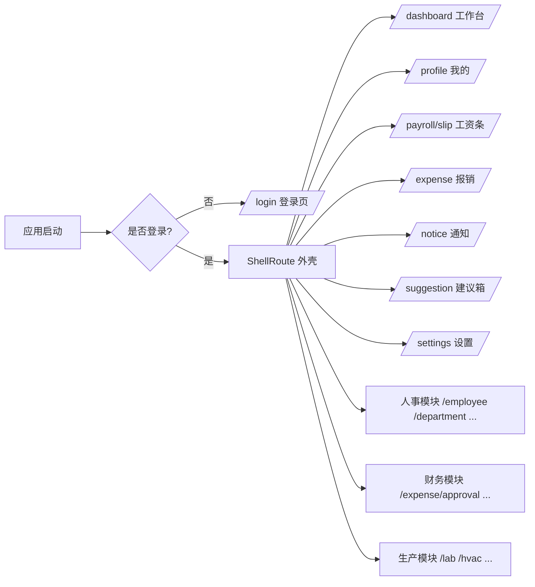

# 路由设计

> 本档定义 Uten IMP 的路由架构，使用 go_router。
> 路径命名规则见 [../00-项目准则/01-命名规范.md](../00-项目准则/01-命名规范.md)。

---

## 一、技术选型

**go_router**（Flutter 官方 package）。

理由：
- 声明式路由，配置集中
- 支持 Web 深链和浏览器地址栏
- 内置 `redirect` 钩子（路由守卫）
- 支持 ShellRoute（导航壳 + 子页面）
- 嵌套导航（侧边 NavRail 切换子页面）

路由采用“核心组装 + feature 自注册列表”的模块化方式：

- `lib/core/router/app_router.dart` 只负责会话、权限守卫、Shell 与各模块路由列表的组装。
- 业务模块在自身目录导出 `List<RouteBase>`；例如生产模块由
  `lib/features/production/production_routes.dart` 管理。
- 新增大模块时不得继续把全部页面 import 和 `GoRoute` 堆回核心路由文件。

---

## 二、路由整体结构



---

## 三、路由表（Phase 0 + 1）

> “是否受保护”只表示路由需要登录/权限守卫，不表示页面已接真实后端。
> `/payroll/*` 与员工 `/expense/*` 路由已切换 Dio Repository；V133 已建立对应领域表。
> 路由存在和客户端契约可调用不等于状态机、权限、会计副作用与 E2E 已通过生产验收。

| 路径 | 页面 | 说明 | 是否受保护 |
|---|---|---|---|
| `/login` | LoginPage | 登录页 | ❌ |
| `/` | 重定向到 `/dashboard` | — | ✅ |
| `/dashboard` | DashboardPage | 工作台 | ✅ |
| `/profile` | ProfilePage | 我的 | ✅ |
| `/payroll/slip` | PayrollSlipListPage | 工资条列表 | ✅ |
| `/payroll/slip/:id` | PayrollSlipDetailPage | 工资条详情 | ✅ |
| `/expense` | ExpenseListPage | 报销列表 | ✅ |
| `/expense/new` | ExpenseNewPage | 新建报销 | ✅ |
| `/expense/:id` | ExpenseDetailPage | 报销详情 | ✅ |
| `/notice` | NoticeListPage | 通知列表 | ✅ |
| `/notice/:id` | NoticeDetailPage | 通知详情 | ✅ |
| `/suggestion` | SuggestionPage | 建议箱 | ✅ |
| `/settings` | SettingsPage | 设置 | ✅ |
| `/finance/assets` | FinanceAssetsPage → FinanceAssetWorkbenchPage | 资产与待摊专业工作台；要求 `finance_asset:view`，不继承报表权限 | ✅ |
| `/operations/workbench/purchase` | OperationsWorkbenchPage | 采购未分解申请任务；申请只读，分解动作另验申请 view + 订单 edit/submit | ✅ |
| `/operations/workbench/subcontract` | OperationsWorkbenchPage | 委外未分解申请任务；申请只读，分解动作另验来源与目标权限 | ✅ |
| `/finance/procurement-approvals` | FinanceProcurementApprovalTasksPage | 精确分配给当前账号的订货审批任务 | ✅ |
| `/finance/procurement-arrival-exceptions` | FinanceArrivalExceptionTasksPage | 精确分配给当前账号的超量到货审批 | ✅ |
| `/finance/procurement-arrival-exceptions/:id` | FinanceArrivalExceptionDetailPage | 财务全批/自定义/不批；服务端对象负责人 + `allowedActions` | ✅ |
| `/finance/workflow-responsibilities` | FinanceWorkflowResponsibilitiesPage | 采购/委外财务负责人设置；要求独立管理权限和二次确认 | ✅ |
| `/warehouse/inbound/expectations` | WarehouseInboundExpectationsPage | 财务批准后的预计到货，只是未来任务 | ✅ |
| `/warehouse/inbound/arrival-exceptions` | WarehouseArrivalExceptionsPage | 仓库超量隔离与批准后再审任务 | ✅ |
| `/procurement/arrival-exceptions[/:id]` | ProcurementReturnTaskPage | 财务未批准量仅供原下单人确认退回 | ✅ |
| `/rd/tasks` | RdTaskCenterPage | 工程研发部任务中心；要求 `rd_task:view`；入口在工作台「工程研发部」分区「任务中心」卡（带 `RdTaskBadge`）；与 `/production/schedule/forward-rd` 联动 | ✅ |

Phase 2+ 的路由（员工档案/部门/审批/生产/库存等）在对应页面文档登记时加入本表。

> 2026-08-02 补：生产「BOM 缺失转发工程研发部」走 `POST /api/production/schedule/forward-rd`（路由权限点 `production_plan:forward_rd`，授 `DEPT_PROD` / `SUB_PLAN`），创建 `rd_tasks(category=BOM)` 并经 `business_outbox` 通知 `DEPT_ENG`；研发保存有效 BOM 后由 `GoodsBomService.recalcSourceE` 链路自动完成任务并通知转发人。任务中心入口位于工作台「工程研发部」分区，详见 [工程研发部任务中心.md](../03-页面/工程研发部任务中心.md)。

---

## 四、路由名称常量

避免在代码里硬编码字符串路径，统一管理：

```dart
// lib/core/router/route_names.dart

abstract class RouteName {
  static const String login = '/login';
  static const String dashboard = '/dashboard';
  static const String profile = '/profile';
  static const String payrollSlip = '/payroll/slip';
  static const String payrollSlipDetail = '/payroll/slip/:id';
  static const String expense = '/expense';
  static const String expenseNew = '/expense/new';
  static const String expenseDetail = '/expense/:id';
  static const String notice = '/notice';
  static const String noticeDetail = '/notice/:id';
  static const String suggestion = '/suggestion';
  static const String settings = '/settings';
}

abstract class RoutePath {
  /// 拼接带参数的路径，如 payrollSlipDetailPath('123') => '/payroll/slip/123'
  static String payrollSlipDetail(String id) => '/payroll/slip/$id';
  static String expenseDetail(String id) => '/expense/$id';
  static String noticeDetail(String id) => '/notice/$id';
}
```

---

## 五、路由守卫（登录校验）

```dart
// lib/core/router/app_router.dart

GoRouter buildAppRouter(Ref ref) {
  return GoRouter(
    refreshListenable: ref.read(sessionProvider.notifier),
    redirect: (context, state) {
      final session = ref.read(sessionProvider);
      final isLoggedIn = session.isLoggedIn;
      final isOnLogin = state.matchedLocation == RouteName.login;

      // 首登强制改密：已认证但 mustChangePassword → 改密页
      if (session.mustChangePassword && state.matchedLocation != RouteName.changePassword) {
        return RouteName.changePassword;
      }
      if (!isLoggedIn && !isOnLogin) {
        // 未登录访问受保护页 → 跳登录页（带原地址 returnTo）
        return '${RouteName.login}?returnTo=${state.matchedLocation}';
      }
      if (isLoggedIn && isOnLogin) {
        // 已登录访问登录页 → 跳工作台
        return RouteName.dashboard;
      }
      return null; // 不重定向
    },
    routes: [
      GoRoute(path: RouteName.login, builder: (c, s) => const LoginPage()),
      ShellRoute(
        builder: (context, state, child) => MainShellPage(child: child),
        routes: [
          GoRoute(path: '/', redirect: (_, __) => RouteName.dashboard),
          GoRoute(path: RouteName.dashboard, builder: (c, s) => const DashboardPage()),
          // ... 其他 ShellRoute 内的页面（业务模块已远超 Phase 1 路由表，见 route_names.dart）
        ],
      ),
    ],
  );
}
```

> 现行实现以 `lib/core/router/app_router.dart` + `route_names.dart` + `permission_by_path.dart` 为准；上面是登录/会话守卫的最小骨架。完整路由表覆盖鉴权/工作台/员工/部门/采购/销售/委外/仓库/库存/生产/钱流/基础资料/访客/系统管理等全部业务模块。

---

## 六、权限路由

受保护路由统一通过 `route_access_policy.dart` 判定。权限映射仍来自
`requiredAnyPermFor` / `requiredAllPermsFor`，拒绝结果进入明确的
`/access-denied` 页面，不执行目标页面动作，也不静默跳回工作台：

```dart
case AuthStatus.authenticated:
  if (isLogin) return RouteName.dashboard;
  return employeePermissionRedirect(session.user, state.matchedLocation);
```

要点（详见 [全局机制 §1](全局机制.md)）：
- 权限点（不是角色）决定可见性，2026-07-24 起角色已下线（ADR-011）。
- `requiredAnyPermFor` 返回 `List<String>?`，用于一个入口可由多种功能权限进入的场景；单一门槛也返回单元素列表。
- `requiredAllPermsFor` 用于组合门槛；当前 `/employee/onboarding` 同时要求
  `employee:create` 与 `employee:pii:edit`。工作台显隐与路由 redirect 使用同一 all 契约。
- `/finance/customers` 是真实 `ClientCategoryPage` 的别名，入口要求 `client:view`；后端再按
  `client:view:all`、本人和 `user_data_scopes(scope=client)` 过滤 owner 范围。
- `/finance/assets` 单独要求 `finance_asset:view`；`finance_report:view` 不能替代。页面动作还要
  取服务端 `allowedActions` 与本地动作权限的交集，初始确认/处置/终止另受默认关闭的服务端门禁。
- V196–V201 候选路由门槛：订货审批/超量审批列表用 `finance_order_approval:view`，负责人设置用 `workflow_assignment:manage`，仓库预计到货/异常用 `warehouse_inbound:view`，原下单人退回用 `supplier_return_task:handle`。
- 上述路由权限只决定“能否进入这一类页面”。财务详情还必须由服务端校验当前账号等于实例 `assignee_user_id`；退回详情必须校验当前账号是原下单人。超级管理员不能对象绕过，已知 ID 也必须 404/403。
- 页面只能按服务端 `allowedActions` 显示决定/完成按钮；缺失或未知动作 fail closed。Badge/count 同样按精确负责人/owner 由服务端过滤，不能从本地部门或角色推导。
- 申请列表/详情路径不得因拥有旧 `*:edit` 权限恢复新建、编辑、审核、红冲或删除入口；订货必须从任务中心分解，保存后提交财务。
- 公司目标库仍只确认到 V190；路由与页面存在不等于 V196–V202 已部署或生产验收。
- 路由守卫只判“能否看到入口”，绝不替代后端列表过滤、对象级读写校验和动作权限。
- 超管走 `superAdmin` 字段短路（**不再对持 admin 角色的用户短路**，V30 安全加固）。
- 无权限深链进入 `/access-denied`，明确告知目标未打开、操作未执行；不静默跳工作台。路由守卫只负责入口反馈，后端仍独立执行接口权限和对象范围校验。
- 路径权限映射集中在 `permission_by_path.dart`，与工作台显隐共用同一数据源，不散落在各页面。

---

## 七、页面转场动画

go_router 的 `pageBuilder` + `CustomTransitionPage` 实现统一转场：

```dart
GoRoute(
  path: RouteName.dashboard,
  pageBuilder: (context, state) => buildFadeTransitionPage(
    context: context,
    state: state,
    child: const DashboardPage(),
  ),
);
```

`buildFadeTransitionPage` 封装在 `lib/core/router/transitions.dart`，走 [06-动画规范](../00-项目准则/06-动画规范.md) 的统一 token。

---

## 八、深链与 Web

- 路由路径 = Web URL（如 `/payroll/slip/123`）
- 支持浏览器前进/后退
- 支持刷新保持当前页
- 支持分享链接（带权限的话打开后跳登录再回原页）
- 生产计划详情使用 `/production/plans/:id`；可选查询参数 `executionSegmentId` 只负责在父计划页内定位并打开一次执行分段详情，不是独立执行段路由。
- `subplan_links` 中的真实自制件子计划仍通过 `/production/plans/{childPlanId}` 进入自己的详情；不得把它和执行分段深链混用。
- 计划详情页的 Widget key 按计划 ID 隔离；路径 ID 变化时必须重新加载详情、MRP、执行分段和子计划，不能沿用上一计划的定位状态。
- 深链无权、ID 缺失、目标不存在或路由失败必须给出明确反馈，不能保留可点击样式却静默无响应。

---

## 九、返回即刷新（pageResume）

**问题**：工作台等主 Tab 由 Shell 保活（Offstage 隐藏不销毁）；列表页被 push 进的详情/编辑页压在栈下时也不销毁。从子页面返回时页面实例复用、不重走 `initState`，本地 State 与缓存 provider 停在旧数据——例：销售订货单走完流程回工作台，计划部门角标要等 60s 轮询才出现；审计中心返回工作台，概览也不是最新的。

**机制**（2026-08-03 落地）：

- `lib/core/router/page_resume_provider.dart`：`pageResumeProvider` 记录最近一次路由落点（path，不含 query）+ 单调递增 tick。`app_router` 在 `routerDelegate` 上挂监听，**任何导航落定**（go / push / pop / 系统返回手势 / 深链）后在微任务里 `bumpPageResume`（微任务是为了避开构建期改 provider 的崩溃；路径未变的原地通知不 bump）。
- 页面用 `ref.onPageResume(myLocation, refresh)` 注册，触发规则：**仅当「上一落点不是我、新落点是我」才执行**——首次进入不触发（`initState` 已加载，避免重复请求）；从我走进子页不触发（离开不是返回）；App 启动首次落定不触发（页面刚建已是新数据）。
- 外壳 `MainShellPage` 统一响应：**任何落点**刷新全局角标（生产待排产/采购任务/研发任务/访客审批与接待/HR 变更审核/通知未读，见 `dashboard/providers/workbench_refresh.dart`，各 Notifier 内部已按权限自卫）；落点是工作台再 `invalidate(dashboardOverviewProvider)`，是通知 Tab 再 `invalidate(noticeListProvider)`。
- 已按页接入：审计中心与 销售/采购/仓库出入库/钱流/委外 5 个单据列表页（返回时重拉当前页，保留筛选与页码）；采购/委外/仓库/钱流 4 个 hub 的任务数卡片（按 hub 粒度 `invalidate` 对应 `autoDispose` 计数 provider——不放进全局刷新，避免把没打开的 hub 的 provider 激活、白白启动轮询）。

**与 `listRefreshTickProvider` 的分工**：listRefresh 是「操作变更后精准刷新」（省请求）；pageResume 是「任何返回都刷新」，覆盖未 bump 的纯查看返回与跨模块返回。新页面接入只需在 build 里加一行 `ref.onPageResume(...)`。

**接入注意**：带路径参数的页面（如 `/sales/:seg`）`myLocation` 必须在**首次 build 捕获**（`_myLocation ??= GoRouterState.of(context).matchedLocation`）——被 push 页遮住后现取拿到的是别人的路径；静态路径页面直接用 `RouteName` 常量即可（如审计中心用 `RouteName.adminAuditLogs`）。

---

## 十、待定问题

- [x] 403/无权限拒绝页 → 已落 `/access-denied`；后端接口继续独立拒绝越权请求
- [x] ~~404 页面~~ → 用 `UtenEmpty` 美化（见 [全局机制 §5.1](全局机制.md)）
- [ ] 是否需要 `/onboarding` 首次登录引导（仍未实施，路由名已预留）
- [ ] 多 Tab 同时操作时的状态同步
- [x] 操作后列表刷新（A 类 provider `invalidate` 天然覆盖；B 类本地态单据页用刷新信号 `listRefreshTickProvider` + `bumpListRefresh`，详见 [状态管理 §4.6](状态管理.md)）
- [x] 跨页跳转的来源感知导航（已落地 `nav_helpers.dart`：`goFrom` 带 `?returnTo`、`backTo` 读 returnTo；详见 memory：go-router-origin-aware-nav）
- 弹窗内嵌页返回键：被 `showDialog` / `showModalBottomSheet` 包裹的页面（如 `NoticeDetailPage`）返回键必须传 `onBack: () => Navigator.of(ctx).pop()`——默认 `UtenBackButton` 走 go_router `pop/go`，够不着 Dialog/Sheet 路由，会「点返回无反应」。

---

**最后更新**：2026-08-03（新增第九章「返回即刷新（pageResume）」：路由落点信号 + `ref.onPageResume`，工作台/通知/审计中心/5 个单据列表页/4 个 hub 任务数卡片已接入；物化视图调度器日志改为成功静默、失败才打，见 [全局机制 §〇-7](全局机制.md)）
