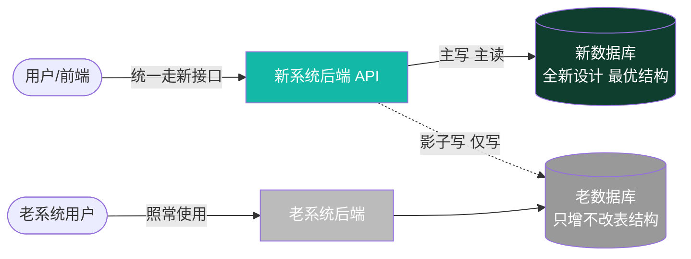
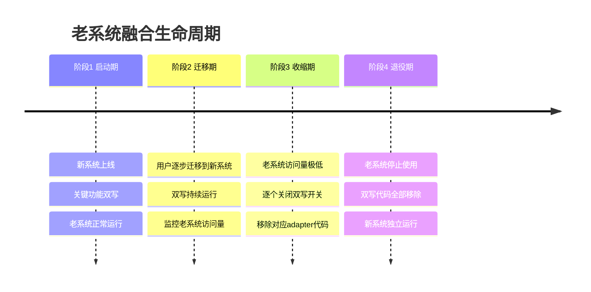

# 00 - 老系统融合总策略

> ⚠️ **这是新系统与老系统共存期间的核心架构文档。**
> 所有"新系统对接老系统"的设计必须以本文档为唯一依据。

---

## 一、核心结论（先读这段就够）

### 1.1 战略定位

**老系统是历史包袱，新系统是未来真相源。**

- ✅ 新系统 = 新数据库（全新设计、最优结构） + 新功能（更丰富）
- ✅ 老系统 = 持续运行（**不能影响**），等用户自然迁移
- ✅ 新系统的写入操作，如果对应老系统已有的功能，**同时写老库**（影子双写）
- ✅ 老系统不再使用后，删除双写代码，全部回归新系统

### 1.2 一句话方针

> **单向影子双写（Shadow Write）**：新系统是新数据的唯一真相源，写新库的同时往老库"影子写一份"作为过渡期的双重保险；不读老库、不改老库结构；老系统退役时移除双写代码即可。

---

## 二、数据流向（必看图）

**关键点**：

| 方向 | 是否允许 | 说明 |
|---|---|---|
| 前端 → 新系统 API | ✅ 唯一入口 | 前端不感知老系统 |
| 新系统 API → 新库（读/写） | ✅ 主路径 | 新库是真相源 |
| 新系统 API → 老库（**只写**） | ✅ 影子写 | 仅对老系统已有功能双写 |
| 新系统 API ← 老库（读） | ❌ 禁止 | 老数据不读，避免污染 |
| 改老库表结构 | ❌ 绝对禁止 | 不能破坏老系统 |
| 老系统 → 新库 | ❌ 不允许 | 老系统完全不知道新系统存在 |

---

## 三、五大铁律（不可违反）

### 铁律 1：新系统是新数据的唯一真相源

- 所有 CRUD 都以新库为准
- 新库结构由新系统团队自主设计，不被老库束缚
- 数据冲突时，以新库为准

### 铁律 2：绝不破坏老系统

- ❌ 不改老库表结构
- ❌ 不改老系统代码（除非修复严重 bug 且与团队确认）
- ❌ 不停老系统
- ✅ 老系统该怎么跑还怎么跑

### 铁律 3：双写是"尽力而为"的影子操作

- 双写失败**不能阻塞**主流程（新库已成功就是成功）
- 双写失败要记录到告警/日志，由运维介入
- 双写是单向的（新→老），不做反向同步

### 铁律 4：双写必须可关闭

- 每一个双写点都有**配置开关**（feature flag）
- 老系统某功能下线 → 关掉对应开关 → 移除代码
- 双写代码集中在 `legacy_adapters/` 目录，方便整体下线

### 铁律 5：前端零感知

- 前端只对接新系统 API
- 前端代码里不出现"老系统""legacy"等字眼
- 前端不知道哪些数据被双写

---

## 四、双写适用范围

### 4.1 哪些功能需要双写？

判断准则：**老系统是否有这个功能 + 老系统用户是否还在依赖它**

| 场景 | 是否双写 | 原因 |
|---|---|---|
| 新功能，老系统没有 | ❌ 不双写 | 老系统无对应表 |
| 老系统已有，老用户还在用 | ✅ 双写 | 双重保险 |
| 老系统已有，但老用户已迁完 | ❌ 关掉开关 | 移除代码 |
| 纯新系统特有（如 Dashboard 高级分析） | ❌ 不双写 | 老系统无对应概念 |

### 4.2 具体到本项目（待老系统调研后填充）

> 以下表格等老系统功能清单出来后逐条核对填充。

| 模块 | 老系统是否有 | 是否双写 | 双写字段映射 | 状态 |
|---|---|---|---|---|
| 员工档案 | ⏳ 待调研 | — | — | 待定 |
| 部门 | ⏳ 待调研 | — | — | 待定 |
| 工资条 | ⏳ 待调研 | — | — | 待定 |
| 报销 | ⏳ 待调研 | — | — | 待定 |
| 通知 | ⏳ 待调研 | — | — | 待定 |
| 实验室检测 | ⏳ 待调研 | — | — | 待定 |
| 空调控制 | ⏳ 待调研 | — | — | 待定 |
| 流水线 / 产量 | ⏳ 待调研 | — | — | 待定 |
| 库存 | ⏳ 待调研 | — | — | 待定 |

---

## 五、生命周期（从共存到退役）

每个阶段的关键动作：

| 阶段 | 新系统动作 | 老系统动作 | 双写开关状态 |
|---|---|---|---|
| 启动期 | 上线关键功能 | 正常运行 | 全开 |
| 迁移期 | 持续完善、引导迁移 | 正常运行 | 全开 |
| 收缩期 | 功能稳定 | 访问量极低 | 按模块逐个关 |
| 退役期 | 完全独立 | 下线 | 全关，代码移除 |

---

## 六、对前端的影响（极小）

**结论：前端完全不受影响。**

| 维度 | 影响 |
|---|---|
| 页面 / 组件 / 路由 | ❌ 无影响 |
| 主题 / 字号 / 多语言 | ❌ 无影响 |
| 响应式 / 动画 / 性能 | ❌ 无影响 |
| 网络层 | ⚠️ 极小：所有请求走新接口，无需区分新老 |
| 数据模型文档 | ⚠️ 标注哪些实体"老系统已存在，需双写" |

前端工程师不需要读这份文档。这份文档主要给**后端工程师**和**架构决策**用。

---

## 七、相关文档

| 主题 | 文档 |
|---|---|
| 老系统现状（技术栈、库、功能、表结构） | [01-老系统现状调研.md](01-老系统现状调研.md) ⏳ 待调研 |
| 双写与同步的技术方案（Outbox / 事件 / CDC） | [02-双写与同步方案.md](02-双写与同步方案.md) |
| 数据迁移执行（模块清单 + 一键迁移 + 各模块文档） | [../数据迁移/README.md](../数据迁移/README.md) |

---

## 八、决策记录

本策略的来龙去脉记录在 ADR：

- [ADR-005-单向影子双写策略.md](../99-决策记录-ADR/ADR-005-单向影子双写策略.md)

---

**最后更新**：2026-07-21 · **当前状态**：策略已定，老系统调研待启动（后端启动前进行）
