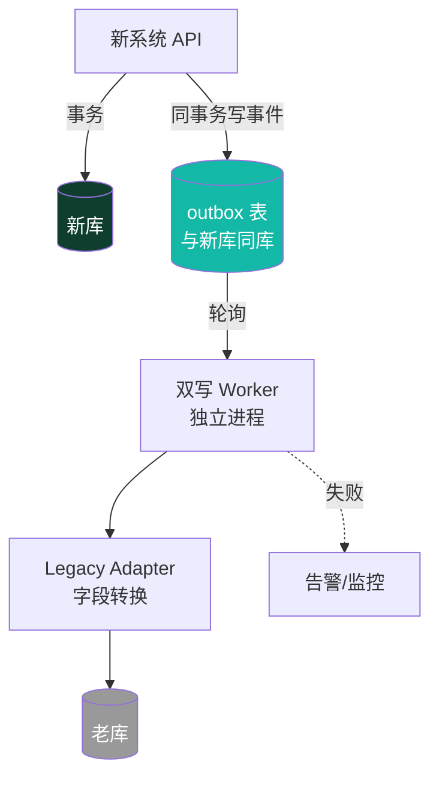

# 02 - 双写与同步方案

> ⏳ **本档为方案选型草案**。具体方案在老系统调研完成、后端启动时最终确定。
> 现在先列出候选方案和各自的取舍，作为决策储备。

---

## 一、双写的核心难点

新系统写一笔数据，要同时写新库和老库。难点在：

| 难点 | 描述 |
|---|---|
| 一致性 | 两库写成功/失败的组合如何处理 |
| 性能 | 不能让老库的慢拖累新库 |
| 字段映射 | 新老结构不同，转换规则可能复杂 |
| 触发器风险 | 老库可能有触发器，写入会引发副作用 |
| 失败补偿 | 影子写失败了怎么办 |
| 可关闭 | 每个双写点要能单独关 |

---

## 二、候选方案对比

### 方案 A：同步双写（API 内直接写两库）

```
新系统 API 收到请求
  ├─ 事务1: 写新库（主）
  ├─ 事务2: 写老库（影子）  ← 失败不阻塞，记日志
  └─ 返回成功
```

| 优点 | 缺点 |
|---|---|
| 实现最简单 | 老库慢会拖累整体响应（虽不阻塞，但占线程） |
| 实时性最高 | 字段转换逻辑散落在业务代码里 |
| 容易调试 | 双写逻辑和业务逻辑耦合 |

**适用**：双写点少、老库性能稳定的场景。

### 方案 B：异步双写（消息队列 + Outbox 模式）⭐ 倾向

```
新系统 API 收到请求
  ├─ 事务: 写新库 + 写本地 outbox 表（同一事务）
  └─ 立即返回成功

后台 Worker：
  ├─ 轮询 outbox 表
  ├─ 字段转换
  ├─ 写老库
  ├─ 成功 → 标记 outbox 已完成
  └─ 失败 → 重试 / 告警
```

| 优点 | 缺点 |
|---|---|
| 新库事务和双写解耦 | 引入消息组件或自建 worker |
| 性能不受老库影响 | 有秒级延迟 |
| 失败可重试、可追溯 | 调试稍复杂 |
| 双写逻辑集中在 adapter | 需要 outbox 表 |

**适用**：双写点多、要求新库性能不被拖累、要求可追溯。**本项目倾向此方案。**

### 方案 C：CDC（变更数据捕获，如 Debezium）

监听新库 binlog，自动同步到老库。

| 优点 | 缺点 |
|---|---|
| 业务代码零侵入 | 配置复杂 |
| 自动捕获所有变更 | 字段映射规则难维护（要写转换层） |
| | 老库如果是 SQL Server/Oracle，CDC 支持有限 |

**适用**：双写规则简单、新老库结构相近的场景。本项目结构差异大，**不倾向**。

---

## 三、推荐架构（草案）



**关键设计点**：

1. **outbox 表和新库同事务**——保证"新库写成功 ↔ 双写事件一定产生"
2. **Worker 独立进程**——老库慢/挂不影响新系统
3. **Adapter 集中**——所有字段转换规则在 `legacy_adapters/` 目录，方便整体下线
4. **每个双写点配置开关**——可单独关闭
5. **失败重试 + 告警**——不丢数据

---

## 四、字段转换规则（草案）

新老库结构不同，转换规则统一在 Adapter 层实现：

```python
# 伪代码示例
class EmployeeLegacyAdapter:
    def to_legacy(self, new_employee: Employee) -> LegacyEmployeeRow:
        return LegacyEmployeeRow(
            emp_no=new_employee.code,           # 新系统 code → 老系统 emp_no
            name=new_employee.fullName,         # fullName → name
            dept_id=self.map_dept(new_employee.deptId),  # 部门 ID 需查映射表
            # 老系统没有 email 字段 → 不写
            # 老系统必填 hire_date → 用 new_employee.hireDate
        )
```

详细映射规则填入 [04-新老数据映射表.md](04-新老数据映射表.md)。

---

## 五、失败处理策略

| 失败场景 | 处理 |
|---|---|
| 新库写失败 | 整个请求失败，不触发双写 |
| outbox 写失败 | 整个请求失败（和新库同事务） |
| 老库写失败（Worker） | 重试 N 次（指数退避）→ 仍失败记入死信表 + 告警 |
| 老库触发器异常 | 记日志 + 告警，**不影响新库** |
| 老库连接不上 | Worker 暂停该 adapter，告警 |

**核心原则**：双写失败永远不阻塞新系统主流程。

---

## 六、监控指标

| 指标 | 阈值 | 含义 |
|---|---|---|
| outbox 积压数 | > 1000 告警 | Worker 处理不过来 |
| 双写失败率 | > 1% 告警 | 老库或转换规则有问题 |
| 双写延迟 | P99 > 30s 告警 | 实时性下降 |
| 死信表数量 | > 0 告警 | 有彻底失败的双写 |

---

## 七、双写代码组织（后端）

```
backend/
└─ legacy_adapters/                # 所有双写代码集中在此
   ├─ employee_adapter.py
   ├─ department_adapter.py
   ├─ payroll_adapter.py
   ├─ ...
   ├─ mapping/                     # 字段映射规则
   │  └─ dept_mapping.json
   └─ adapter_registry.py          # adapter 注册 + 开关
```

退役时直接删除整个目录 + 移除调用点。

---

## 八、待定问题

> 后端启动前需要和团队确认。

- [ ] 选方案 A 还是 B？（倾向 B）
- [ ] outbox 表放新库还是单独库？
- [ ] Worker 用什么实现？（独立服务 / 定时任务 / 消息队列消费者）
- [ ] 重试次数和退避策略？
- [ ] 死信数据如何人工介入处理？
- [ ] 老库如果是触发器敏感型，是否需要专门的"安全写入时段"？

---

**当前状态**：方案草案 · **最终确定时间**：后端启动时 · **依赖**：[01-老系统现状调研.md](01-老系统现状调研.md) 完成
