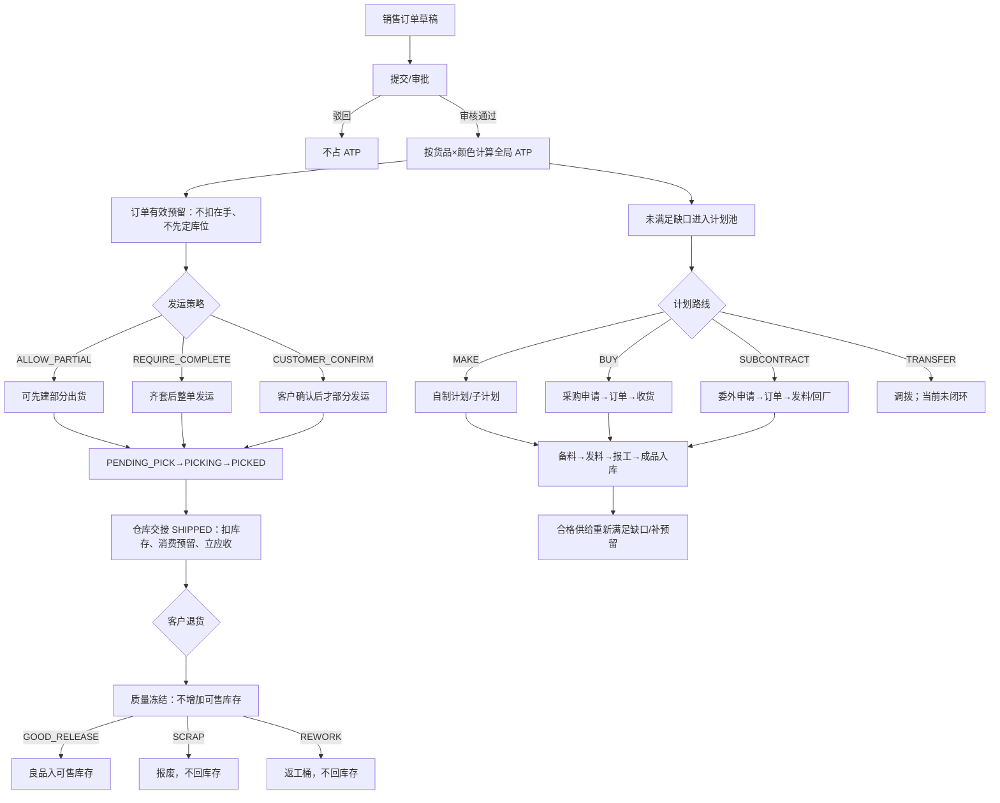

# 销售—仓库—计划—生产/采购/委外全链路安全复核报告

> **历史快照提示（2026-08-09）**：本文保留 Flyway V190 候选时的业务安全证据；当前数据库、
> 自动化和本地/云端放行状态请以
> [2026-08-09 本地云端部署与生产就绪清单](2026-08-09-本地云端部署与生产就绪清单.md)为准。

> **复核日期**：2026-08-01
> **候选基线**：Flyway V190、Flutter 3.44.2、Java 21、PostgreSQL 16.14
> **生产结论**：**NO-GO**。当前候选的源码、空库迁移和自动化回归已达到可继续联调的安全基线，但公司目标库历史数据、真实岗位、实物作业、容量和恢复演练尚未验收，不得据此直接上线。

> **2026-08-02 ADR-019 后置覆盖**（**2026-08-07 ADR-027 再覆盖**）：本报告下方“采购申请→订单→收货、委外申请→订单→回厂”是 V190 时点的历史概括。现行 V196–V202 源码候选已改为计划下达只读申请、采购/委外跨申请部分分解订货、财务审批审核组（财务部门持 `finance_order_approval:review`，+跨部门点名加授）批准后才生效、超量先隔离再由财务决定且仓库再审、未批量交原下单人退回；V229 删除单点负责人配置（ADR-027）。公司目标库仍只确认到 V190，完整 IQC、真实岗位/实物 UAT 和发布签字未完成，结论仍为 **NO-GO**。

## 一、结论

本次不是把“有库存就通知仓库、没库存就通知计划”写成一条简单状态，而是把同一销售订单拆成五类不同事实：

1. **现货承诺**：审核后形成订单有效预留，只减少 ATP，不扣实物库存。
2. **仓库作业**：接近发运时才开始定仓、拣货、复核和交接；当前只落了单据级最小状态，完整 WMS 仍缺。
3. **缺口计划**：订单行未满足量进入计划需求，不默认一律生产，由计划选择 MAKE / BUY / SUBCONTRACT / TRANSFER。
4. **实际出入库**：只有仓库过账才改变在手；所有已交接出货禁止普通红冲直接回库。
5. **退货质量**：退货先冻结，只有质量判定为良品释放才回到可售库存；报废和返工均不增加可售量。

因此，“仓库已经有的货要不要一直给这个客户留着”不应靠口头决定，也不应由系统按订单金额自动抢货。公司当前规则是：审核后正式预留；按订单的整单、分批或客户确认策略决定能否先发；交期逾期只提醒，不自动释放；确需让给更急订单时，由有权限主管写明原因手工让单，并保留审计和原订单缺口。客户取消、订单减量或经批准让单才释放。

## 二、权威流程

### 2.1 订单审核与现货预留

- 草稿、提交未审不占 ATP；审核通过才形成有效预留。
- 全局 ATP 不是“全公司余额减一份安全库存”，而是每个有该货色余额的仓先扣该仓保护量，再汇总并扣有效预留，最后钳制为非负。
- 有多少现货就预留多少，剩余数量进入计划缺口；多品项逐行处理，不因为其中一项缺货而伪造整单现货。
- 预留默认先保持货品×颜色级全局承诺。开始实际仓库作业时才校验并绑定具体仓；部分从 A 仓交接只绑定本次消费段，剩余预留仍可由 B 仓履约。
- 稀缺库存不按“VIP、大额订单自动抢占”。主管可设置业务优先级并手工让单；系统负责锁、数量守恒、原因、通知和审计，业务人员负责客户承诺判断。

### 2.2 已有现货但其它产品还要一个月

订单必须选定发运策略：

| 策略 | 公司规则 | 现货怎么处理 |
|---|---|---|
| ALLOW_PARTIAL | 允许分批 | 已预留现货可先建部分出货，剩余继续计划 |
| REQUIRE_COMPLETE | 必须齐套 | 现货继续保留到齐套；逾期提醒销售/主管复核是否让单 |
| CUSTOMER_CONFIRM | 客户决定 | 未记录客户确认前不能开始部分发运；改量、取消、红冲会清空旧确认 |

系统不在“创建后 7 天”无条件自动释放，因为制造订单应按交期、合同和实际缺口判断，自动释放还会同时影响订单行累计、客户承诺和排产。当前以订单交期加宽限期做逾期提醒，真实释放走取消、减量或有权限的手工让单。后续如要自动重排，必须先有服务等级、不可取消标识、付款/信用、未来供给和客户沟通结果等权威数据。

### 2.3 仓库、计划和生产领料

- 订单预留不等于仓库已经拣货；仓库作业状态与库存流水分开。
- 计划确认必须展开完整 BOM，主料、辅料和包装料都进入需求；齐套量按瓶颈物料拆为 READY / WAITING。
- READY 只表示计划可执行，不表示仓库已经发料。实际领料必须走生产 DRAW/领料单、仓库审核和不可变领退耗台账。
- 分批领料、退料、消耗、损耗必须满足数量守恒；超领、补料、代料和不良品仍需审批/QMS 能力。
- 自制子计划已成为父计划包的真实 SUBPLAN 单据，页面点击可进入真实子计划；但父需求到子计划产出和 FINISHED_IN 的完整 supply peg 仍未闭环。

### 2.4 采购与委外

- BUY 和 SUBCONTRACT 从同一计划需求派生，来源、数量和反向边界必须保留，不能把无来源收货当成计划已满足。
- 当前采购/委外“收货”还没有完整 IQC 待检、合格、特采、退货隔离门，不能把到货等同质量合格。
- 委外发料必须以服务端订单数量、单位和价格为准，不信任客户端累计；退料、损耗和委外退货不得超过同一来源已发/已收数量。
- 新委外发料在缺少冻结 BOM 和逐需求子台账时故意返回 409，历史单仍可查看和受控反向。这是防错账门禁，不是功能已完整。
- 供应商处我方库存、逐批耗用、余料、合同损耗、加工费和季度对账尚未形成完整守恒实体。

### 2.5 发货、红冲与退货

- 出货的客户、币种、汇率、付款/税务条件、单价、折扣和金额均从来源订单在服务端重建；客户端传入金额和成本不是财务事实。
- 财务已审核的出货不能直接编辑、删除或驳回，必须先走财务反审。
- 所有 SHIPPED 均禁止普通红冲，即使历史记录没有交接时间；缺时间不是“没有交接”的证据。
- 新销售退货审核后只创建质量冻结并重开待满足需求，不直接增加预留或可拣库存。只有 GOOD_RELEASE 写库存；SCRAP、REWORK 不写可售库存。
- 已发生质量处置后，整单退货红冲会被阻断，避免库存和处置事实被同时改写。

## 三、本次完成的工程加固

| 范围 | 已完成 |
|---|---|
| 销售商业事实 | 订单原币额和本币额由服务端计算；出货按来源数量比例重建金额；混合不兼容条件拒绝；成本注入清空；无价格权限服务端脱敏 |
| 预留与多仓 | 分仓安全库存后的全局 ATP；部分仓交接拆分预留且总量守恒；本仓或未定仓预留均可被正确消费；历史未激活订单提前 fail-closed |
| 仓库事件 | V187 最小作业状态；V188 追加式不可变仓库事件；所有已交接出货禁止普通红冲 |
| 退货质量 | V189 冻结投影、良品释放/报废/返工事件、数量/精度/原因校验、处置后红冲保护、权限与 Flutter 操作区 |
| 退货质检对象范围 | 普通 view 按销售 owner/委派过滤；已知退货 ID 的质检 GET/POST 已调用 PMC 专用对象旁路且不扩大退货编辑/红冲权限。独立跨 owner 任务发现入口、方法鉴权组合和真实页面闭环尚未完成 |
| 计划/子计划 | 真实 MAKE 子计划登记为父包单据；删除/反审失败关闭；生产看板、调度、执行分段和销售进度深链可点击且有错误反馈 |
| 委外 | 服务端来源数量/单位/价格权威；发料/退料/损耗/退货上限与重复出库保护；缺少冻结子账的新发料返回 409 |
| 工作台权限 | 部门和单据动作精确映射；批量采购同时要求来源查看与目标编辑；无权元数据清空，深链进入拒绝页 |
| 审计 | V190 在 V188/V189 新表后重跑全表 fail-closed 触发器覆盖检查；业务事件另有 append-only 守卫 |

## 四、安全复核结论

### 已形成的安全边界

- 关键写操作在服务端鉴权和对象范围校验，界面隐藏按钮不是唯一防线。
- 金额、库存数量、累计数量和来源关系不信任客户端。
- 订单、预留、仓库作业和质量处置采用显式状态转换，非法跳转失败关闭。
- 预留消费、库存过账和业务累计在事务中完成；库存键使用稳定锁序/数据库锁，防止并发超卖。
- 仓库事件和质量事件不可普通更新/删除；V190 补齐新增公开业务表的审计触发器覆盖。
- 历史数据不被自动补造：旧订单、旧交接时间线和旧退货质检结论均保持“未知”，需要对账后显式激活。

### 自动化证据

| 验证 | 结果 | 边界 |
|---|---:|---|
| Java 默认套件 | **589 项，0 failure/error，54 skipped** | 535 项实际执行通过；数据库测试另见下一行 |
| Java 本次链路定向测试 | **56/56 通过** | 商业事实、预留、发运、退货、MAKE、委外、权限、审计迁移 |
| 退货质检结构增量回归 | **5/5 通过** | 隔离构建目录；2 项仅验证 Service 调用对象策略，3 项验证处置纯函数；不覆盖方法鉴权、任务发现或多账号端到端 |
| 场景矩阵契约增量回归 | **2/2 通过** | 40 个端到端场景编号唯一，核心权威源/锁/反向/权限/发布门禁仍完整 |
| PostgreSQL 16.14 Testcontainers | **18 组、54/54 通过** | 空库按 Flyway 应用并 validate **171 个迁移至 V190** |
| Flutter 全量测试 | **74 个测试文件、278/278 通过** | 含生产子计划点击、销售深链、权限和退货质检 |
| 本次 Flutter 定向 analyze | **0 issues** | 生产、销售、退货、委外范围 |
| Flutter 全仓 analyze | **无 error；10 个 warning/info** | 均在并行基础资料文件 mould_category_page.dart，不属于本链路；仍应在候选合并前清零 |
| 差异检查 | git diff --check 通过 | 不代表业务 UAT |

首次隔离 Java 全量运行的 4 个错误只是验证副本未包含 legacy_migration/*.sql；补入只读目录连接后 589 项默认套件为 0 failure/error，其中 54 项数据库测试按默认门禁跳过，并已在 PostgreSQL 显式运行中 54/54 通过。JDK 21.0.11 在关闭共享 Maven 缓存中的 Tomcat WebSocket JAR 时曾输出 Windows AccessDeniedException 警告，但编译和 Maven 构建正式结果均成功；运行中服务的 server/target/classes 未被覆盖。

文档一致性复核时发现：按退货 ID 的质检 GET 原本始终按销售 owner 过滤，而处置接口没有显式执行同一对象策略。当前 Service 已让两条直接接口调用同一 `sales_return_quality:handle` 操作旁路，普通销售查看仍保持 owner/委派隔离；新增 2 项测试只锁定该调用顺序。Flutter 质检卡仍依赖受普通 owner 范围保护的退货详情，系统没有独立跨 owner 任务投影/工作台，view/handle 方法鉴权和 handle-only 负向也未形成端到端证据，因此不能称为 PMC 任务闭环。

## 五、专业系统对照

- SAP aATP 把 Product Availability Check、Product Allocation、Supply Protection 和 Backorder Processing 组合使用，说明“库存可承诺、稀缺保护、再分配”应是不同控制层，而不是一条自动抢货规则：[SAP aATP](https://help.sap.com/docs/SAP_S4HANA_ON-PREMISE/f132c385e0234fe68ae9ff35b2da178c/e541e617043545a0bb60e5067d037046.html)。
- Dynamics 365 的 reservation hierarchy 允许延后到仓库作业阶段才确定库位等详细维度，支持本项目“订单审核先全局承诺、拣货时再详细分配”的裁剪：[Dynamics 365 仓库预留](https://learn.microsoft.com/en-us/dynamics365/supply-chain/warehousing/reservations-in-warehouse-management)。
- SAP 生产领料把 goods issue 同时作为库存减少、预留减少和工单成本归集的业务事件，支持“计划锁料不等于实际发料”的分层：[SAP 生产领料](https://help.sap.com/docs/SAP_S4HANA_ON-PREMISE/f899ce30af9044299d573ea30b533f1c/c339c95360267614e10000000a174cb4.html)。
- SAP 和 Dynamics 的退货处理都先进入退回冻结/隔离，再经检验与 disposition 决定去向，支持 V189 的“退货不直接可售”原则：[SAP Returned Goods Blocked Stock](https://help.sap.com/docs/SAP_S4HANA_ON-PREMISE/91b21005dded4984bcccf4a69ae1300c/1864bd534f22b44ce10000000a174cb4.html)、[Dynamics 365 Quarantine Orders](https://learn.microsoft.com/en-us/dynamics365/supply-chain/inventory/quarantine-orders)。

以上是从官方机制推导出的设计原则。本项目只按公司现有订单、库存、权限和生产模型做了边界化实现，不宣称已经达到 SAP、Oracle 或 Dynamics 的完整能力。

## 六、仍阻断生产上线的事项

### P0：未关闭前必须保持 NO-GO

1. **公司目标数据库**：备份、恢复演练、V182–V190 Flyway 升级、校验和、触发器矩阵、迁移前后数量/金额/状态零差异对账。
2. **历史开放订单激活**：V90 未激活订单必须逐行核对库存、已发、旧计划和客户承诺后显式激活；当前没有安全批量激活命令。
3. **完整 WMS**：库位、批次/序列号、实拣数量、复核、装箱、承运交接、扫码、盘点期间作业和仓库级人员数据范围。
4. **采购/委外 IQC**：待检、合格、不合格、特采、退货、批次责任及反向；当前到货不能等同生产可用。
5. **MAKE 供给闭环**：父需求—子计划行—报工—FINISHED_IN—父需求唤醒的 supply peg、改量、取消和反向守恒。
6. **委外所有权库存**：冻结 BOM/逐需求发料子账、供应商处库存和在制、耗用/余料/损耗/退料/期末对账；新发料当前故意 409。
7. **客户退货处置**：退款结案、换货、补发、维修后返还的权威选择、审批及对应应收/需求规则。
8. **质量处置纠错**：GOOD_RELEASE/SCRAP/REWORK 的双人复核、追加式补偿命令、返工单和二次检验；不得管理员改事件。
9. **商业条件引擎**：正式价目、折扣底线、税额、多币种、发票金额和多次分批舍入尾差的最终对账。
10. **退货质检任务闭环**：补独立最小任务投影和 PMC 工作台，收紧并验证 view/handle、handle-only、已知 UUID、返回投影及“不授予退货编辑/红冲”的服务端矩阵。
11. **真实验收**：销售、PMC、仓库、生产、采购、委外、品质和财务账号的正负权限矩阵，双会话并发、实物 UAT、压力、死锁、Outbox、告警、灰度和发布签字。

### P1：下一阶段专业化

- 有限产能日历、冻结区间、插单影响分析和替代料审批。
- 未来供给承诺日期、供应保护/渠道配额和有审批的 backorder 重排。
- 批次效期、FEFO、召回、MTO 销售订单专属库存和质量附件。
- 自动调拨、运输成本/可达日、合单/拆单和装车约束。
- 清理全仓 analyze 的 10 条基础资料告警，补真实浏览器/移动端无障碍与返回栈 UAT。

## 七、生产放行清单

只有以下证据全部齐备，结论才可从 NO-GO 改为 GO：

1. 目标库备份可恢复，V190 升级和审计矩阵通过，历史对账差异为 0 或全部有签字处置。
2. 所有 P0 能力闭环，或产品负责人书面确认范围外且相应入口保持 fail-closed。
3. 八类岗位真实账号完成最小权限、越权、对象范围和职责分离验收。
4. 仓库/车间/供应商实物数量与系统台账逐单守恒，异常和反向流程均演练。
5. 全量 Java、显式 PostgreSQL、Flutter test/analyze、迁移回放、并发和容量测试同一提交通过。
6. 备份恢复、Outbox 重放、磁盘/锁等待/失败率告警、回滚和灰度方案完成签字。

## 八、对应文档

- [销售订货到发货全链路 SOP](../07-业务链路/01-销售订货到发货全链路-SOP.md)
- [V90 预留台账与计划订单联动](../07-业务链路/02-数据库设计-V90-预留台账与计划订单联动.md)
- [生产订单排产与执行全链路](../07-业务链路/04-生产订单排产与执行全链路需求.md)
- [销售现货预留生命周期与稀缺仲裁](../07-业务链路/05-销售现货预留生命周期与稀缺仲裁.md)
- [销售退货质检冻结与处置](../07-业务链路/06-销售退货质检冻结与处置.md)
- [销售—生产—仓库—采购—委外场景矩阵](../../server/src/test/resources/business-chain-scenario-matrix.md)
- [销售出货仓库作业页](../03-页面/销售出货仓库作业页.md)
- [销售退货质检冻结处置页](../03-页面/销售退货质检冻结处置页.md)
- [生产调度工作台](../03-页面/生产调度工作台.md)
- [生产主管看板页](../03-页面/生产主管看板页.md)
- [页面总览](../03-页面/页面总览.md)
- [生产履约 V1 实体关系](../04-数据模型/生产履约V1实体关系.md)
- [实体字典](../04-数据模型/实体字典.md)
- [路由设计](../05-架构/路由设计.md)
- [全局机制](../05-架构/全局机制.md)
- [安全策略](../05-架构/安全策略.md)
- [迁移 README](../数据迁移/README.md)
- [销售管理新库与迁移（历史模型及现行覆盖）](../数据迁移/20-销售管理-新库与迁移.md)
- [Java 后端普通单据通用基线](../数据迁移/28-Java后端契约.md)
- [销售单据归属授权](../数据迁移/39-销售单据归属授权.md)
- [审计与日志保留](../数据迁移/38-运维-审计与日志保留.md)
- [仓库盘点修正与历史单据处理](../数据迁移/50-仓库盘点修正与历史单据处理.md)
